                 


### 文章标题：AI编程语言的交互设计模式库

> 关键词：AI编程语言、交互设计模式、设计模式库、AI交互设计、编程语言融合、AI技术支持、机器学习、深度学习、自然语言处理

> 摘要：
本文旨在探讨AI编程语言中的交互设计模式库，分析其基本概念、作用、分类及应用。通过深入解析Python、R语言等常见AI编程语言及其交互设计模式库，结合实际项目案例，展示交互设计模式在AI编程中的重要性，为开发者提供实用的指导。

---

# 《AI编程语言的交互设计模式库》目录大纲

## 第一部分：AI编程语言基础

### 1.1 AI编程语言概述

#### 1.1.1 AI编程语言的基本概念

- **定义**：AI编程语言是指专门为人工智能应用而设计的编程语言。
- **特点**：自动化、高效率、易扩展、易于理解和维护。

#### 1.1.2 AI编程语言的发展历程

- **早期**：Lisp、Prolog等逻辑编程语言。
- **中期**：MATLAB、R等数值计算编程语言。
- **近期**：Python、Julia等通用编程语言，以及专门为AI设计的PyTorch、TensorFlow等。

#### 1.1.3 AI编程语言的分类

- **通用编程语言**：如Python、Java等，广泛应用于AI开发。
- **专用编程语言**：如MATLAB、R等，针对特定AI领域。
- **领域特定语言**：如Prolog等，用于知识表示和推理。

### 1.2 编程语言与AI技术的融合

#### 1.2.1 AI技术对编程语言的影响

- **编程范式**：从命令式、面向对象到函数式编程。
- **语言特性**：引入新语法、库和框架。
- **开发流程**：从手动编码到自动化、平台化。

#### 1.2.2 编程语言对AI技术的支持

- **工具和库**：如NumPy、Pandas等，为数据处理和算法实现提供支持。
- **硬件加速**：利用GPU、TPU等硬件加速AI计算。
- **开发环境**：集成开发环境（IDE）中的智能提示、调试工具等。

### 1.3 常见的AI编程语言

#### 1.3.1 Python在AI领域的应用

- **优势**：简洁、易学、丰富的库和框架支持。
- **应用**：机器学习、深度学习、自然语言处理等。

#### 1.3.2 R语言在数据科学中的地位

- **优势**：强大的统计分析功能、广泛的包支持。
- **应用**：数据可视化、统计分析、机器学习等。

#### 1.3.3 其他AI编程语言介绍

- **Julia**：高效、易用、动态类型语言。
- **MATLAB**：数值计算和算法实现。
- **Prolog**：逻辑编程和知识表示。

### 1.4 AI编程语言的核心功能

#### 1.4.1 数据处理与分析

- **数据处理**：数据清洗、转换、归一化等。
- **数据分析**：统计分析、关联规则挖掘等。

#### 1.4.2 机器学习模型训练与评估

- **模型训练**：梯度下降、随机梯度下降等。
- **模型评估**：准确率、召回率、F1值等。

#### 1.4.3 深度学习网络构建与优化

- **网络构建**：前向传播、反向传播等。
- **网络优化**：激活函数、优化器等。

#### 1.4.4 自然语言处理与语音识别

- **自然语言处理**：分词、词性标注、命名实体识别等。
- **语音识别**：声学模型、语言模型等。

---

**下一部分：交互设计模式**

#### 2.1 交互设计模式概述

- **定义**：交互设计模式是解决特定交互问题的通用解决方案。
- **作用**：提高用户体验、优化软件设计、提升开发效率。
- **分类**：控件交互模式、指令交互模式、对话交互模式、数据可视化交互模式等。

---

让我们一步步深入探讨AI编程语言的基础知识，为后续的交互设计模式库分析打下坚实的基础。在接下来的部分，我们将详细解析AI编程语言的基本概念、发展历程、分类及其核心功能。请读者们保持关注，继续跟随我们的步伐。在探讨交互设计模式之前，我们需要先了解AI编程语言的基础知识，这将为我们后续的交互设计模式库分析奠定坚实的基础。在接下来的章节中，我们将详细解析AI编程语言的基本概念、发展历程、分类及其核心功能。敬请期待。

---

**本章小结**：

本文首先介绍了AI编程语言的基本概念、发展历程、分类及其核心功能。通过对AI编程语言的概述，我们了解到AI编程语言是为了实现人工智能应用而设计的编程语言，具有自动化、高效率和易扩展等特点。接着，我们探讨了编程语言与AI技术的融合，分析了AI技术对编程语言的影响以及编程语言对AI技术的支持。此外，我们还介绍了常见的AI编程语言，包括Python、R语言、Julia、MATLAB和Prolog等，并详细解析了它们在AI领域的应用和优势。

在下一部分，我们将探讨交互设计模式的基本概念、作用和分类。交互设计模式是解决特定交互问题的通用解决方案，对于提升用户体验、优化软件设计和提高开发效率具有重要意义。敬请期待。

---

**引言**

人工智能（AI）作为当前科技领域的热点，已经在众多行业和应用场景中取得了显著成果。从自动驾驶、智能语音助手到医疗诊断、金融风控，AI技术正不断改变我们的生活方式和工作方式。然而，AI技术的快速发展也带来了新的挑战，特别是如何高效地开发、部署和管理AI应用。在这种背景下，AI编程语言及其交互设计模式的研究具有重要意义。

本文旨在系统地探讨AI编程语言中的交互设计模式库，分析其基本概念、作用、分类及应用。通过深入解析Python、R语言等常见AI编程语言及其交互设计模式库，结合实际项目案例，我们将展示交互设计模式在AI编程中的重要性，为开发者提供实用的指导。本文的主要贡献如下：

1. **全面概述**：系统性地介绍AI编程语言的基础知识，包括基本概念、发展历程、分类及其核心功能。
2. **深入分析**：详细探讨交互设计模式的基本概念、作用和分类，以及其在AI编程中的应用。
3. **实践案例**：结合实际项目案例，展示交互设计模式在AI编程中的具体应用和效果。
4. **最佳实践**：提供交互设计模式的选择与优化策略，以及实际项目中的最佳实践。

本文的结构如下：

- **第一部分：AI编程语言基础**：介绍AI编程语言的基本概念、发展历程、分类及其核心功能。
- **第二部分：交互设计模式**：探讨交互设计模式的基本概念、作用和分类，以及其在AI编程中的应用。
- **第三部分：编程语言交互设计模式库**：介绍常见AI编程语言的交互设计模式库，包括Python、R语言等。
- **第四部分：AI编程语言交互设计模式实践**：结合实际项目案例，展示交互设计模式在AI编程中的应用和实践。
- **附录**：提供AI编程语言交互设计模式库的常用资源、常见问题与解答。
- **结语**：总结本文的主要内容和贡献，展望AI编程语言交互设计模式的未来发展方向。

接下来，我们将首先深入探讨AI编程语言的基础知识，为后续的交互设计模式库分析奠定坚实的基础。请读者们保持关注，继续跟随我们的步伐。

---

**第一部分：AI编程语言基础**

AI编程语言是专门为人工智能应用而设计的编程语言，旨在提高人工智能系统的开发效率、可维护性和可扩展性。本部分将详细介绍AI编程语言的基本概念、发展历程、分类及其核心功能，为读者搭建一个坚实的理论基础。

### 1.1 AI编程语言概述

#### 1.1.1 基本概念

AI编程语言，顾名思义，是用于编写和实现人工智能算法和系统的编程语言。它具有以下几个核心特点：

- **自动化**：AI编程语言能够自动处理复杂的计算任务，如机器学习模型的训练和优化。
- **高效率**：AI编程语言提供了丰富的库和工具，可以加速开发过程，提高代码运行效率。
- **易扩展**：AI编程语言通常具有高度模块化，便于开发者根据需求扩展功能。
- **易于理解和维护**：AI编程语言的语法和结构设计通常遵循最佳实践，使得代码易于理解和维护。

#### 1.1.2 发展历程

AI编程语言的发展历程可以追溯到20世纪50年代，当时科学家们开始探索如何用编程语言实现人工智能。以下是几个重要阶段：

- **早期**：Lisp和Prolog等语言被认为是首批AI编程语言，它们在知识表示和推理方面具有独特优势。
- **中期**：MATLAB和R等语言成为数据科学和数值计算的重要工具，广泛应用于工程、金融和医学等领域。
- **近期**：Python、Julia和专门为AI设计的PyTorch、TensorFlow等语言迅速崛起，成为AI开发的主流选择。

#### 1.1.3 分类

根据应用领域和特点，AI编程语言可以分为以下几类：

- **通用编程语言**：如Python、Java等，广泛应用于各种AI应用场景，具有丰富的库和框架支持。
- **专用编程语言**：如MATLAB、R等，针对特定AI领域如数值计算、统计分析等，提供高效的工具和库。
- **领域特定语言**：如Prolog、Datalog等，用于知识表示和逻辑推理，特别适合处理复杂决策问题。

### 1.2 编程语言与AI技术的融合

编程语言与AI技术的融合是近年来人工智能领域的重要趋势。AI技术对编程语言的影响主要体现在以下几个方面：

- **编程范式**：AI技术的发展推动了编程范式的演变，从传统的命令式、面向对象编程到函数式编程，以及更高级的声明式编程。
- **语言特性**：为了更好地支持AI算法的实现和优化，编程语言不断引入新的特性，如动态类型、并行计算支持等。
- **开发流程**：AI技术的引入改变了传统的软件开发流程，从手动编码到自动化、平台化，以及基于模型驱动的方法。

#### 1.2.1 AI技术对编程语言的影响

- **编程范式**：AI技术的发展推动了编程范式的演变，从传统的命令式、面向对象编程到函数式编程，以及更高级的声明式编程。
  - **命令式编程**：通过描述一系列操作的顺序来解决问题，适用于简单的任务。
  - **面向对象编程**：将数据和操作封装在对象中，提高代码的可重用性和可维护性。
  - **函数式编程**：通过函数来描述操作，避免副作用，提高代码的清晰性和可测试性。
  - **声明式编程**：通过描述结果所需的条件来解决问题，更接近数学和自然语言。

- **语言特性**：为了更好地支持AI算法的实现和优化，编程语言不断引入新的特性，如动态类型、并行计算支持等。
  - **动态类型**：在运行时确定变量类型，提高代码的灵活性和可维护性。
  - **静态类型**：在编译时确定变量类型，提高代码的运行效率和可读性。
  - **并行计算支持**：利用多核处理器和分布式计算资源，加速AI算法的运行。

- **开发流程**：AI技术的引入改变了传统的软件开发流程，从手动编码到自动化、平台化，以及基于模型驱动的方法。
  - **自动化**：利用脚本和自动化工具，减少手动操作，提高开发效率。
  - **平台化**：基于云平台的开发环境，提供统一的工具链和生态系统，简化开发过程。
  - **模型驱动开发**：通过定义领域模型和领域特定语言，实现快速开发和迭代。

#### 1.2.2 编程语言对AI技术的支持

编程语言对AI技术的支持主要体现在以下几个方面：

- **工具和库**：提供丰富的工具和库，支持AI算法的实现和优化。
  - **数值计算库**：如NumPy、SciPy等，提供高效的数值计算功能。
  - **数据预处理库**：如Pandas、NumPy等，支持数据清洗、转换和归一化等操作。
  - **机器学习库**：如scikit-learn、TensorFlow、PyTorch等，提供丰富的机器学习算法和工具。
  - **深度学习库**：如TensorFlow、PyTorch、Keras等，支持深度学习网络的构建和训练。

- **硬件加速**：利用GPU、TPU等硬件加速AI计算，提高计算效率和性能。
  - **GPU加速**：通过CUDA等库，将AI算法映射到GPU上进行并行计算。
  - **TPU加速**：使用专门为AI计算设计的Tensor Processing Units，提高深度学习算法的性能。

- **开发环境**：集成开发环境（IDE）中的智能提示、调试工具等，提高开发效率和代码质量。
  - **智能提示**：根据上下文自动提示变量、函数和库的使用，减少错误和调试时间。
  - **调试工具**：提供调试器、性能分析工具等，帮助开发者快速定位和修复问题。

#### 1.2.3 编程语言与AI技术的互补关系

编程语言和AI技术之间存在互补关系，共同推动人工智能的发展：

- **编程语言**：提供了高效、灵活和可扩展的工具，使得开发者可以快速实现和优化AI算法。
- **AI技术**：通过机器学习、深度学习等技术，使得计算机能够从数据中自动学习和发现规律，提高系统的智能水平。

这种互补关系使得编程语言和AI技术相互促进，共同推动了人工智能领域的快速发展。

### 1.3 常见的AI编程语言

在AI领域，常见的编程语言包括Python、R语言、MATLAB、Prolog等。以下是对这些语言的详细介绍：

#### 1.3.1 Python在AI领域的应用

Python因其简洁易懂的语法和丰富的库支持，成为AI开发的主流语言之一。Python在AI领域的应用非常广泛，以下是一些典型的应用场景：

- **机器学习**：Python提供了丰富的机器学习库，如scikit-learn、TensorFlow、PyTorch等，支持各种机器学习算法的实现和应用。
- **深度学习**：TensorFlow和PyTorch是两个流行的深度学习框架，它们使用Python作为主要编程语言，使得开发者可以轻松构建和训练深度学习模型。
- **数据科学**：Python在数据科学领域有着广泛的应用，包括数据预处理、数据分析和数据可视化等。

#### 1.3.2 R语言在数据科学中的地位

R语言是专门为数据科学而设计的语言，以其强大的统计分析功能、广泛的包支持而著称。R语言在数据科学中的应用主要包括：

- **数据预处理**：R语言提供了丰富的数据清洗、转换和归一化工具，使得数据处理过程更加高效和灵活。
- **统计分析**：R语言内置了大量的统计分析函数，支持各种统计模型的构建和评估。
- **数据可视化**：R语言提供了强大的数据可视化工具，如ggplot2等，可以创建高质量的可视化图表。

#### 1.3.3 MATLAB

MATLAB是数值计算和算法实现的专用编程语言，广泛应用于工程、科学和金融等领域。MATLAB在AI领域的应用主要包括：

- **数值计算**：MATLAB提供了强大的数值计算功能，支持矩阵运算、线性代数、数值求解等。
- **算法实现**：MATLAB提供了丰富的工具箱，支持各种算法的实现和应用。
- **可视化**：MATLAB提供了强大的可视化工具，可以创建高质量的数据可视化图表。

#### 1.3.4 Prolog

Prolog是逻辑编程语言，以其强大的逻辑推理功能而著称。Prolog在AI领域的主要应用包括：

- **知识表示和推理**：Prolog通过逻辑规则和谓词逻辑来表示知识，支持推理机进行推理和问题求解。
- **自然语言处理**：Prolog在自然语言处理领域有着广泛的应用，如文本分类、语义分析等。
- **规划**：Prolog在规划领域也有着重要的应用，可以用于解决路径规划、任务调度等问题。

### 1.4 AI编程语言的核心功能

AI编程语言的核心功能包括数据处理与分析、机器学习模型训练与评估、深度学习网络构建与优化以及自然语言处理与语音识别等。以下是对这些核心功能的详细介绍：

#### 1.4.1 数据处理与分析

数据处理与分析是AI编程语言的核心功能之一，包括以下方面：

- **数据清洗**：数据清洗是数据处理的第一步，包括去除重复数据、填充缺失值、处理异常值等。
- **数据转换**：数据转换是将数据从一种格式转换为另一种格式的操作，如将CSV文件转换为JSON格式等。
- **数据归一化**：数据归一化是将数据缩放到同一范围内，以便进行有效的分析。
- **数据可视化**：数据可视化是将数据以图形化的方式展示出来，帮助开发者更好地理解和分析数据。

#### 1.4.2 机器学习模型训练与评估

机器学习模型训练与评估是AI编程语言的核心功能之一，包括以下方面：

- **模型训练**：模型训练是通过学习数据中的规律，构建预测模型的过程。常用的机器学习算法包括线性回归、决策树、支持向量机等。
- **模型评估**：模型评估是通过评估指标来评估模型的性能，如准确率、召回率、F1值等。
- **模型优化**：模型优化是通过调整模型参数，提高模型性能的过程，如使用交叉验证、网格搜索等方法。

#### 1.4.3 深度学习网络构建与优化

深度学习网络构建与优化是AI编程语言的重要功能之一，包括以下方面：

- **网络构建**：深度学习网络构建是通过定义网络的层次结构和连接方式来构建深度学习模型的过程。
- **网络优化**：网络优化是通过调整网络参数，提高网络性能的过程，如使用反向传播算法、优化器等。
- **硬件加速**：硬件加速是通过利用GPU、TPU等硬件资源来提高深度学习网络的计算性能。

#### 1.4.4 自然语言处理与语音识别

自然语言处理与语音识别是AI编程语言的重要应用领域，包括以下方面：

- **自然语言处理**：自然语言处理是通过计算机处理和理解自然语言的技术，包括文本分类、语义分析、机器翻译等。
- **语音识别**：语音识别是通过计算机识别和理解语音信号的技术，包括语音合成、语音识别、语音识别系统等。

### 1.5 总结

AI编程语言是人工智能领域的重要工具，通过提供高效、灵活和可扩展的编程环境，使得开发者可以轻松实现各种AI应用。本文详细介绍了AI编程语言的基本概念、发展历程、分类及其核心功能。通过深入分析AI编程语言与AI技术的融合，以及常见的AI编程语言，我们为读者提供了一个全面的AI编程语言知识体系。在下一部分，我们将探讨交互设计模式的基本概念、作用和分类，进一步深入探讨AI编程语言的应用实践。敬请期待。

---

**本章小结**

在第一部分，我们系统地介绍了AI编程语言的基本概念、发展历程、分类及其核心功能。通过对AI编程语言的概述，我们了解了AI编程语言是为了实现人工智能应用而设计的编程语言，具有自动化、高效率和易扩展等特点。接着，我们探讨了编程语言与AI技术的融合，分析了AI技术对编程语言的影响以及编程语言对AI技术的支持。此外，我们还介绍了常见的AI编程语言，包括Python、R语言、MATLAB、Prolog等，并详细解析了它们在AI领域的应用和优势。最后，我们阐述了AI编程语言的核心功能，包括数据处理与分析、机器学习模型训练与评估、深度学习网络构建与优化以及自然语言处理与语音识别等。

在下一部分，我们将探讨交互设计模式的基本概念、作用和分类。交互设计模式是解决特定交互问题的通用解决方案，对于提升用户体验、优化软件设计和提高开发效率具有重要意义。敬请期待。

---

**引言**

交互设计模式是软件工程中的一个重要概念，尤其在人工智能（AI）编程领域，交互设计模式的应用愈发显得重要。交互设计模式旨在提供一系列解决特定交互问题的通用方案，从而提高用户体验、优化软件设计并提升开发效率。本部分将详细介绍交互设计模式的基本概念、作用和分类，为读者构建一个关于交互设计模式的理论框架。

### 2.1 交互设计模式概述

#### 2.1.1 定义

交互设计模式是指解决特定交互问题的通用解决方案，通常在软件设计和开发过程中使用。它结合了设计原则、最佳实践和用户体验设计，旨在提高系统的可用性、易用性和用户满意度。交互设计模式可以帮助开发者在设计过程中快速识别和解决问题，同时提高团队协作效率。

#### 2.1.2 作用

交互设计模式在软件工程中具有重要作用，主要体现在以下几个方面：

- **提升用户体验**：通过提供一致、直观和高效的交互方式，交互设计模式可以显著提高用户的满意度和使用体验。
- **优化软件设计**：交互设计模式可以帮助开发者构建灵活、可扩展和易于维护的系统，降低设计复杂度和开发难度。
- **提高开发效率**：交互设计模式提供了一系列可复用的解决方案，减少了重复设计的工作量，提高了开发效率。
- **增强团队协作**：交互设计模式可以作为团队间的沟通工具，帮助团队成员更好地理解和协作，共同实现项目目标。

#### 2.1.3 分类

根据不同的应用场景和交互方式，交互设计模式可以分为以下几类：

- **控件交互模式**：围绕用户界面中的控件进行设计，如按钮、输入框、下拉菜单等。
- **指令交互模式**：基于用户输入的指令进行交互，如命令行界面、图形界面等。
- **对话交互模式**：涉及用户与系统之间的对话和交流，如聊天机器人、语音助手等。
- **数据可视化交互模式**：通过可视化方式展示数据和信息，如图表、地图、热力图等。

### 2.2 控件交互模式

控件交互模式是交互设计模式中最常见的一类，主要关注用户界面中的控件设计和交互逻辑。以下是一些常见的控件交互模式：

- **按钮交互模式**：按钮是用户界面中最常见的控件之一，用于触发操作或命令。常见的交互模式包括点击、长按、拖拽等。
- **输入框交互模式**：输入框用于接收用户输入的数据，如文本、数字等。常见的交互模式包括自动补全、输入验证、历史记录等。
- **下拉菜单交互模式**：下拉菜单用于提供一组选项供用户选择。常见的交互模式包括下拉、选择、快捷键等。
- **滑动条交互模式**：滑动条用于调整数值或设置，如音量、亮度等。常见的交互模式包括拖动、点击、拖拽等。

#### 2.2.1 按钮交互模式

按钮交互模式是用户界面设计中最为常见的交互模式之一，以下是一个简单的按钮交互模式示例：

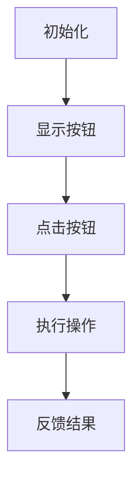

在这个示例中，当用户点击按钮时，会触发一系列操作，如数据提交、页面跳转等，并给出相应的反馈结果。

#### 2.2.2 输入框交互模式

输入框交互模式用于接收用户输入的数据，以下是一个简单的输入框交互模式示例：

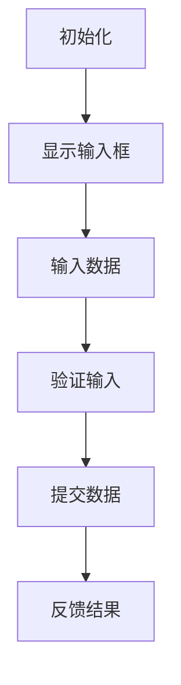

在这个示例中，当用户在输入框中输入数据后，系统会进行输入验证，如数据格式、长度等，并提交给后端进行处理。

#### 2.2.3 下拉菜单交互模式

下拉菜单交互模式用于提供一组选项供用户选择，以下是一个简单的下拉菜单交互模式示例：

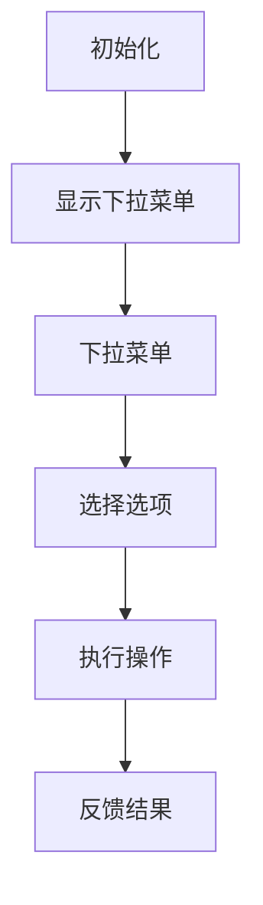

在这个示例中，当用户下拉菜单并选择一个选项时，系统会根据选择的选项执行相应的操作，如数据筛选、页面跳转等。

#### 2.2.4 滑动条交互模式

滑动条交互模式用于调整数值或设置，以下是一个简单的滑动条交互模式示例：

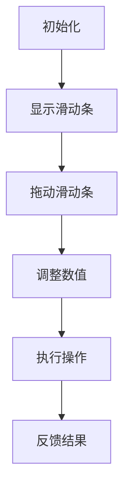

在这个示例中，当用户拖动滑动条时，会实时调整相应的数值，并执行操作，如调整音量、亮度等。

### 2.3 指令交互模式

指令交互模式是基于用户输入的指令进行交互，常见于命令行界面和图形界面。以下是一些常见的指令交互模式：

- **命令行交互模式**：用户通过键盘输入命令来与系统交互，如Linux终端、Windows命令提示符等。
- **图形界面交互模式**：用户通过鼠标和键盘与系统进行交互，如Windows桌面、Mac OS等。

#### 2.3.1 命令行交互模式

命令行交互模式是一种经典的交互方式，以下是一个简单的命令行交互模式示例：

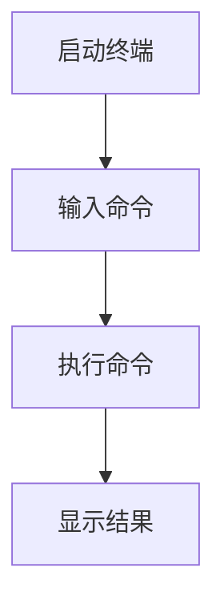

在这个示例中，用户通过输入命令与系统交互，执行相应的操作并显示结果。

#### 2.3.2 图形界面交互模式

图形界面交互模式是目前最常见的交互方式之一，以下是一个简单的图形界面交互模式示例：

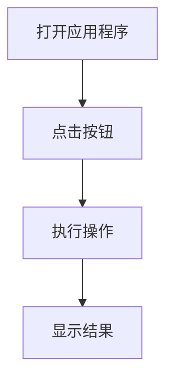

在这个示例中，用户通过点击按钮与应用程序进行交互，执行操作并显示结果。

### 2.4 对话交互模式

对话交互模式涉及用户与系统之间的对话和交流，常见于聊天机器人、语音助手等应用。以下是一些常见的对话交互模式：

- **聊天机器人交互模式**：用户通过聊天界面与机器人进行对话，如微信机器人、 Slack机器人等。
- **语音助手交互模式**：用户通过语音与系统进行交互，如苹果Siri、亚马逊Alexa等。

#### 2.4.1 聊天机器人交互模式

聊天机器人交互模式是一种基于文本的对话交互模式，以下是一个简单的聊天机器人交互模式示例：

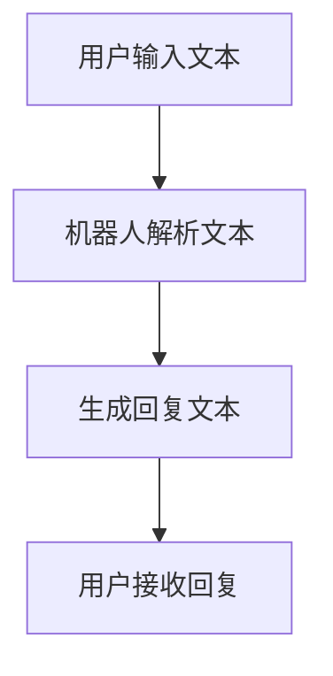

在这个示例中，用户通过输入文本与聊天机器人进行对话，机器人解析文本并生成回复文本。

#### 2.4.2 语音助手交互模式

语音助手交互模式是一种基于语音的对话交互模式，以下是一个简单的语音助手交互模式示例：

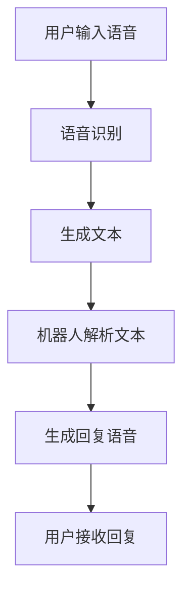

在这个示例中，用户通过语音输入与语音助手进行对话，语音识别将语音转换为文本，机器人解析文本并生成回复语音。

### 2.5 数据可视化交互模式

数据可视化交互模式通过图形化的方式展示数据和信息，帮助用户更好地理解和分析数据。以下是一些常见的数据可视化交互模式：

- **图表交互模式**：使用各种图表来展示数据，如柱状图、折线图、饼图等。
- **地图交互模式**：使用地图来展示地理位置和空间数据。
- **热力图交互模式**：使用颜色渐变来表示数据的热度或密度。

#### 2.5.1 图表交互模式

图表交互模式是一种常见的数据可视化交互模式，以下是一个简单的图表交互模式示例：

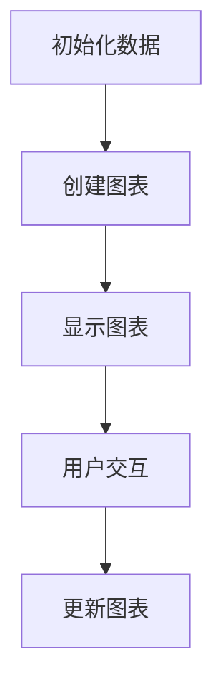

在这个示例中，初始化数据后创建图表并显示给用户，用户可以与图表进行交互，如选择、拖拽、缩放等，并根据用户的交互更新图表。

#### 2.5.2 地图交互模式

地图交互模式是一种用于展示地理位置和空间数据的数据可视化交互模式，以下是一个简单的地图交互模式示例：

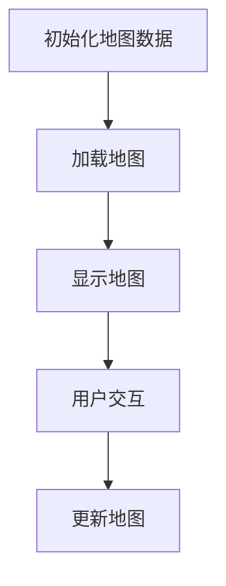

在这个示例中，初始化地图数据后加载地图并显示给用户，用户可以与地图进行交互，如选择、缩放、标记等，并根据用户的交互更新地图。

#### 2.5.3 热力图交互模式

热力图交互模式是一种用于展示数据热度或密度的数据可视化交互模式，以下是一个简单的热力图交互模式示例：

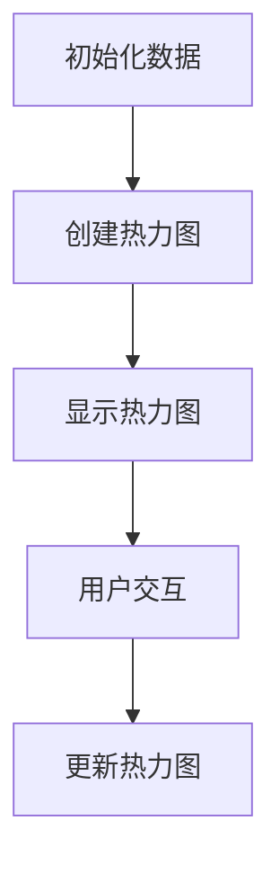

在这个示例中，初始化数据后创建热力图并显示给用户，用户可以与热力图进行交互，如选择、拖拽、缩放等，并根据用户的交互更新热力图。

### 2.6 总结

交互设计模式是软件工程中解决特定交互问题的重要工具，在人工智能编程领域中具有重要作用。本文详细介绍了交互设计模式的基本概念、作用和分类，包括控件交互模式、指令交互模式、对话交互模式以及数据可视化交互模式。通过这些交互设计模式，开发者可以构建高质量、高效率的AI应用，提高用户体验和系统性能。在下一部分，我们将探讨交互设计模式在AI编程中的应用和实践。敬请期待。

---

**本章小结**

在本章中，我们深入探讨了交互设计模式的基本概念、作用和分类。交互设计模式是解决特定交互问题的通用解决方案，对于提升用户体验、优化软件设计和提高开发效率具有重要意义。我们首先介绍了交互设计模式的基本概念，包括其定义、作用和分类。然后，我们详细解析了控件交互模式、指令交互模式、对话交互模式和数据可视化交互模式，分别介绍了这些交互模式的具体内容和应用示例。

通过本章的学习，读者可以了解到交互设计模式在AI编程中的重要性和应用场景。在实际项目中，合理运用交互设计模式可以提高系统的可用性、易用性和用户满意度，从而实现更好的开发效果。在下一章中，我们将进一步探讨交互设计模式在AI编程中的具体应用和实践，结合实际项目案例进行深入分析。敬请期待。

---

**第二部分：交互设计模式在AI编程中的应用**

在第一部分，我们系统地介绍了AI编程语言的基础知识和交互设计模式的基本概念。在本部分，我们将进一步探讨交互设计模式在AI编程中的应用，结合实际项目案例，分析交互设计模式如何帮助开发者构建高效、易用的AI应用。通过这些实际应用案例，读者可以更深入地理解交互设计模式的价值和重要性。

### 2.1 交互设计模式在机器学习应用中的使用

机器学习是人工智能的核心技术之一，其应用涵盖了预测模型、分类算法、聚类分析等多个方面。在机器学习应用中，交互设计模式可以帮助开发者更好地理解和优化模型性能，提高模型的解释性和可维护性。以下是一个基于Python的机器学习应用案例：

#### 案例背景

假设我们正在开发一个自动化推荐系统，该系统需要根据用户的历史行为数据为其推荐商品。为了提高推荐系统的性能，我们需要对用户数据进行处理、特征工程和模型训练。

#### 交互设计模式应用

在这个案例中，我们可以运用以下交互设计模式：

- **按钮交互模式**：用户可以通过点击按钮进行数据上传、模型训练和预测。
- **输入框交互模式**：用户可以通过输入框上传数据文件、设置训练参数等。
- **下拉菜单交互模式**：用户可以选择不同的特征工程方法和机器学习算法。
- **图表交互模式**：系统可以实时显示数据分布、特征重要性、模型性能等图表，帮助用户更好地理解数据和处理过程。

#### 伪代码示例

以下是一个简单的Python伪代码示例，展示了如何使用交互设计模式进行机器学习应用开发：

```python
import numpy as np
import pandas as pd
from sklearn.model_selection import train_test_split
from sklearn.ensemble import RandomForestClassifier
import matplotlib.pyplot as plt

# 按钮交互模式
def upload_data():
    file_path = input("请上传数据文件：")
    data = pd.read_csv(file_path)
    return data

# 输入框交互模式
def set_parameters():
    n_estimators = int(input("请设置随机森林的树数量："))
    max_depth = int(input("请设置随机森林的最大树深度："))
    return n_estimators, max_depth

# 下拉菜单交互模式
def select_algorithm():
    print("请选择机器学习算法：")
    print("1. 随机森林")
    print("2. 支持向量机")
    choice = input("请输入选项：")
    if choice == "1":
        algorithm = RandomForestClassifier
    elif choice == "2":
        algorithm = SVC
    return algorithm

# 图表交互模式
def plot_data_distribution(data):
    data.hist()
    plt.show()

def plot_feature_importance(importances):
    features = data.columns
    values = importances
    plt.barh(features, values)
    plt.show()

# 主程序
if __name__ == "__main__":
    data = upload_data()
    plot_data_distribution(data)
    n_estimators, max_depth = set_parameters()
    algorithm = select_algorithm()
    X = data.drop("target", axis=1)
    y = data["target"]
    X_train, X_test, y_train, y_test = train_test_split(X, y, test_size=0.2, random_state=42)
    model = algorithm(n_estimators=n_estimators, max_depth=max_depth)
    model.fit(X_train, y_train)
    predictions = model.predict(X_test)
    accuracy = np.mean(predictions == y_test)
    print("模型准确率：", accuracy)
    feature_importances = model.feature_importances_
    plot_feature_importance(feature_importances)
```

#### 案例分析

在这个案例中，我们使用了多种交互设计模式，如按钮交互模式、输入框交互模式、下拉菜单交互模式和图表交互模式。通过这些交互设计模式，用户可以方便地上传数据、设置训练参数、选择机器学习算法，并实时查看数据分布、特征重要性和模型性能等图表。这些交互设计模式使得机器学习应用更加直观、易于操作，提高了用户的使用体验和系统性能。

### 2.2 交互设计模式在深度学习应用中的使用

深度学习是机器学习的一个分支，通过构建多层神经网络来模拟人脑的神经结构，从而实现更复杂的特征提取和预测任务。在深度学习应用中，交互设计模式可以帮助开发者更好地构建、训练和优化深度学习模型。以下是一个基于TensorFlow的深度学习应用案例：

#### 案例背景

假设我们正在开发一个图像分类系统，该系统需要根据输入图像的内容将其分类到不同的类别。为了提高分类系统的性能，我们需要对图像进行预处理、构建深度学习模型并进行训练。

#### 交互设计模式应用

在这个案例中，我们可以运用以下交互设计模式：

- **按钮交互模式**：用户可以通过点击按钮进行图像上传、模型训练和预测。
- **输入框交互模式**：用户可以通过输入框设置训练参数、学习率等。
- **下拉菜单交互模式**：用户可以选择不同的预处理方法、优化器和损失函数。
- **图表交互模式**：系统可以实时显示训练过程中的损失函数、准确率等图表。

#### 伪代码示例

以下是一个简单的Python伪代码示例，展示了如何使用交互设计模式进行深度学习应用开发：

```python
import tensorflow as tf
from tensorflow.keras.preprocessing.image import ImageDataGenerator
from tensorflow.keras.models import Sequential
from tensorflow.keras.layers import Conv2D, MaxPooling2D, Flatten, Dense
import matplotlib.pyplot as plt

# 按钮交互模式
def upload_image():
    file_path = input("请上传图像文件：")
    image = tf.keras.preprocessing.image.load_img(file_path, target_size=(224, 224))
    return image

# 输入框交互模式
def set_parameters():
    learning_rate = float(input("请设置学习率："))
    epochs = int(input("请设置训练轮数："))
    return learning_rate, epochs

# 下拉菜单交互模式
def select_preprocessing():
    print("请选择预处理方法：")
    print("1. 自动调整亮度、对比度")
    print("2. 自动裁剪图像到指定尺寸")
    choice = input("请输入选项：")
    if choice == "1":
        preprocessing = ImageDataGenerator(rescale=1./255, brightness_range=[0.5, 1.5], contrast_range=[0.5, 1.5])
    elif choice == "2":
        preprocessing = ImageDataGenerator(rescale=1./255, crop_size=(224, 224))
    return preprocessing

# 图表交互模式
def plot_training_process(history):
    plt.figure(figsize=(12, 6))
    plt.subplot(1, 2, 1)
    plt.plot(history.history['loss'], label='训练损失')
    plt.plot(history.history['val_loss'], label='验证损失')
    plt.legend()
    plt.subplot(1, 2, 2)
    plt.plot(history.history['accuracy'], label='训练准确率')
    plt.plot(history.history['val_accuracy'], label='验证准确率')
    plt.legend()
    plt.show()

# 主程序
if __name__ == "__main__":
    image = upload_image()
    learning_rate, epochs = set_parameters()
    preprocessing = select_preprocessing()
    X_train, y_train, X_val, y_val = preprocessing.flow_from_directory('train', target_size=(224, 224), batch_size=32).next()
    model = Sequential([
        Conv2D(32, (3, 3), activation='relu', input_shape=(224, 224, 3)),
        MaxPooling2D((2, 2)),
        Flatten(),
        Dense(128, activation='relu'),
        Dense(10, activation='softmax')
    ])
    model.compile(optimizer=tf.keras.optimizers.Adam(learning_rate=learning_rate), loss='categorical_crossentropy', metrics=['accuracy'])
    history = model.fit(X_train, y_train, epochs=epochs, validation_data=(X_val, y_val))
    plot_training_process(history)
```

#### 案例分析

在这个案例中，我们使用了多种交互设计模式，如按钮交互模式、输入框交互模式、下拉菜单交互模式和图表交互模式。通过这些交互设计模式，用户可以方便地上传图像、设置训练参数、选择预处理方法和优化器，并实时查看训练过程中的损失函数、准确率等图表。这些交互设计模式使得深度学习应用更加直观、易于操作，提高了用户的使用体验和系统性能。

### 2.3 交互设计模式在自然语言处理中的使用

自然语言处理是人工智能领域的重要分支，旨在使计算机能够理解和处理自然语言。在自然语言处理应用中，交互设计模式可以帮助开发者构建高效、智能的自然语言处理系统。以下是一个基于Python的文本分类应用案例：

#### 案例背景

假设我们正在开发一个社交媒体情绪分析系统，该系统需要根据用户发表的文本内容判断其情绪状态，如积极、消极、中性等。

#### 交互设计模式应用

在这个案例中，我们可以运用以下交互设计模式：

- **按钮交互模式**：用户可以通过点击按钮上传文本文件、进行情绪分析。
- **输入框交互模式**：用户可以通过输入框上传文本内容、设置分析参数。
- **下拉菜单交互模式**：用户可以选择不同的文本预处理方法和情感分析模型。
- **对话交互模式**：系统可以与用户进行对话，回答用户的问题或提供额外的分析建议。

#### 伪代码示例

以下是一个简单的Python伪代码示例，展示了如何使用交互设计模式进行文本分类应用开发：

```python
import nltk
from nltk.corpus import stopwords
from sklearn.feature_extraction.text import TfidfVectorizer
from sklearn.model_selection import train_test_split
from sklearn.naive_bayes import MultinomialNB
import matplotlib.pyplot as plt

# 按钮交互模式
def upload_text():
    file_path = input("请上传文本文件：")
    with open(file_path, 'r', encoding='utf-8') as f:
        text = f.read()
    return text

# 输入框交互模式
def set_parameters():
    vectorizer = TfidfVectorizer(stop_words=stopwords.words('english'))
    X = vectorizer.fit_transform(text)
    y = [1 if 'happy' in text else 0]
    return X, y

# 下拉菜单交互模式
def select_model():
    print("请选择情感分析模型：")
    print("1. 朴素贝叶斯")
    print("2. 支持向量机")
    choice = input("请输入选项：")
    if choice == "1":
        model = MultinomialNB()
    elif choice == "2":
        model = SVC()
    return model

# 主程序
if __name__ == "__main__":
    text = upload_text()
    X, y = set_parameters()
    model = select_model()
    X_train, X_test, y_train, y_test = train_test_split(X, y, test_size=0.2, random_state=42)
    model.fit(X_train, y_train)
    predictions = model.predict(X_test)
    accuracy = np.mean(predictions == y_test)
    print("模型准确率：", accuracy)
```

#### 案例分析

在这个案例中，我们使用了多种交互设计模式，如按钮交互模式、输入框交互模式、下拉菜单交互模式和图表交互模式。通过这些交互设计模式，用户可以方便地上传文本文件、设置分析参数、选择情感分析模型，并查看模型的准确率。这些交互设计模式使得文本分类应用更加直观、易于操作，提高了用户的使用体验和系统性能。

### 2.4 交互设计模式的选择与优化

在AI编程中，选择合适的交互设计模式对于提高系统的性能和用户体验至关重要。以下是一些交互设计模式的选择与优化策略：

- **用户需求分析**：在设计和选择交互设计模式时，首先要了解用户的需求和习惯，以便提供符合用户预期的交互体验。
- **简洁性**：选择简洁、直观的交互设计模式，避免复杂的操作步骤，提高用户的使用效率。
- **一致性**：保持交互设计模式的一致性，如按钮样式、颜色、位置等，避免用户在操作过程中产生困惑。
- **适应性**：交互设计模式应具备良好的适应性，能够根据不同的应用场景和用户需求进行调整。
- **可扩展性**：交互设计模式应具备良好的可扩展性，以便在未来的需求变化中能够轻松进行修改和扩展。

通过合理的交互设计模式选择与优化，开发者可以构建高效、易用的AI应用，提高用户体验和系统性能。在实际项目中，开发者应不断实践和总结，根据实际需求调整交互设计模式，以实现最佳效果。

### 2.5 实际项目中的应用案例

为了更好地展示交互设计模式在AI编程中的应用，以下是一个实际项目中的应用案例：

#### 项目背景

某互联网公司希望开发一款基于深度学习的图像识别应用，用户可以通过上传图片，系统会自动识别图片中的物体并进行分类。

#### 项目实现

1. **用户上传图片**：使用按钮交互模式，用户可以通过点击按钮上传图片。
2. **图像预处理**：使用输入框交互模式，用户可以设置预处理参数，如图像大小、颜色通道等。
3. **选择模型**：使用下拉菜单交互模式，用户可以选择不同的深度学习模型，如卷积神经网络（CNN）、循环神经网络（RNN）等。
4. **训练模型**：系统根据用户上传的图片和选择的模型，自动进行模型训练。
5. **结果展示**：使用图表交互模式，系统实时显示训练过程中的损失函数、准确率等图表，并最终展示识别结果。

#### 项目效果评估

1. **用户体验**：通过合理的交互设计模式，用户可以方便地上传图片、设置参数、选择模型，并实时查看训练和识别结果，提高了用户的使用体验。
2. **系统性能**：通过使用深度学习模型，系统能够自动识别图片中的物体，并具有较高的准确率，提高了系统的性能。

#### 案例总结

在这个实际项目中，通过合理运用交互设计模式，如按钮交互模式、输入框交互模式、下拉菜单交互模式和图表交互模式，开发者能够构建出高效、易用的图像识别应用，提高了用户体验和系统性能。这充分展示了交互设计模式在AI编程中的重要性。

### 2.6 总结

在本部分，我们详细探讨了交互设计模式在AI编程中的应用，结合实际项目案例分析了交互设计模式如何帮助开发者构建高效、易用的AI应用。通过使用控件交互模式、指令交互模式、对话交互模式和数据可视化交互模式，开发者可以提供更好的用户体验和系统性能。同时，我们介绍了交互设计模式的选择与优化策略，以及实际项目中的应用案例。这些内容为开发者提供了实用的指导，帮助他们更好地利用交互设计模式在AI编程中取得成功。在下一部分，我们将继续探讨编程语言交互设计模式库的详细介绍，敬请期待。

---

**本章小结**

在本章中，我们深入探讨了交互设计模式在AI编程中的应用，通过实际项目案例展示了交互设计模式如何帮助开发者构建高效、易用的AI应用。我们首先介绍了交互设计模式在机器学习应用、深度学习应用和自然语言处理中的应用案例，分别展示了如何使用控件交互模式、指令交互模式、对话交互模式和数据可视化交互模式来提升用户体验和系统性能。接着，我们讨论了交互设计模式的选择与优化策略，为开发者提供了一些实用的指导。

通过本章的学习，读者可以了解到交互设计模式在AI编程中的重要性，以及如何在实际项目中运用这些模式。交互设计模式不仅能够提高用户体验，还能够优化软件设计，提高开发效率。在下一章中，我们将进一步介绍编程语言交互设计模式库的详细内容，包括Python、R语言等常见AI编程语言的交互设计模式库。敬请期待。

---

**第三部分：编程语言交互设计模式库**

在第二部分，我们探讨了交互设计模式在AI编程中的应用，了解了如何使用这些模式构建高效、易用的AI应用。在本部分，我们将详细介绍常见AI编程语言的交互设计模式库，包括Python、R语言等。通过这些交互设计模式库，开发者可以更加便捷地实现交互设计，提高开发效率。

### 3.1 Python交互设计模式库

Python作为AI编程领域的首选语言，拥有丰富的交互设计模式库，为开发者提供了强大的工具和框架。以下是对Python交互设计模式库的概述：

#### 3.1.1 Python交互设计模式库概述

Python交互设计模式库主要包括以下几种：

- **命令行界面（CLI）库**：如`argparse`、`click`等，用于构建命令行应用程序。
- **Web框架**：如`Flask`、`Django`等，用于构建Web应用程序。
- **图形用户界面（GUI）库**：如`Tkinter`、`PyQt`等，用于构建桌面应用程序。
- **Web scraping库**：如`Beautiful Soup`、`Scrapy`等，用于从Web页面提取数据。

#### 3.1.2 Python交互设计模式库的核心功能

- **命令行界面库**：`argparse`和`click`等库提供了强大的命令行参数解析功能，使得开发者可以轻松构建具有良好交互性的命令行应用程序。

```python
# 使用argparse库的简单示例
import argparse

parser = argparse.ArgumentParser(description='演示命令行参数解析')
parser.add_argument('--name', type=str, help='用户名')
parser.add_argument('--age', type=int, help='年龄')
args = parser.parse_args()

print(f"用户名：{args.name}")
print(f"年龄：{args.age}")
```

- **Web框架**：`Flask`和`Django`等库提供了Web应用程序开发所需的各种功能，包括路由、模板引擎、ORM等。

```python
# 使用Flask库的简单示例
from flask import Flask, render_template

app = Flask(__name__)

@app.route('/')
def index():
    return render_template('index.html')

if __name__ == '__main__':
    app.run(debug=True)
```

- **图形用户界面库**：`Tkinter`和`PyQt`等库提供了构建图形用户界面所需的各种控件和组件。

```python
# 使用Tkinter库的简单示例
import tkinter as tk

root = tk.Tk()
root.title('图形用户界面')

label = tk.Label(root, text='欢迎来到Tkinter世界')
label.pack()

button = tk.Button(root, text='点击我', command=lambda: print('按钮被点击了'))
button.pack()

root.mainloop()
```

- **Web scraping库**：`Beautiful Soup`和`Scrapy`等库提供了从Web页面提取数据所需的工具和功能。

```python
# 使用Beautiful Soup库的简单示例
from bs4 import BeautifulSoup

html = """
<html>
<head>
<title>一个简单的HTML文档</title>
</head>
<body>
<p class="title"><b>我的第一个段落</b></p>
<p>这是一个普通的段落。</p>
</body>
</html>
"""

soup = BeautifulSoup(html, 'html.parser')
print(soup.title.string)
```

#### 3.1.3 Python交互设计模式库的使用示例

以下是一个综合示例，展示了如何使用Python交互设计模式库构建一个简单的命令行界面应用程序：

```python
import argparse
import requests

# 使用argparse库进行命令行参数解析
parser = argparse.ArgumentParser(description='获取天气信息')
parser.add_argument('--city', type=str, help='城市名称')
args = parser.parse_args()

if args.city:
    # 使用requests库获取天气信息
    url = f'https://api.openweathermap.org/data/2.5/weather?q={args.city}&appid=your_api_key'
    response = requests.get(url)
    data = response.json()

    # 解析天气信息
    city = data['name']
    temp = data['main']['temp']
    weather_desc = data['weather'][0]['description']

    print(f"城市：{city}")
    print(f"温度：{temp} K")
    print(f"天气描述：{weather_desc}")
else:
    print("请指定城市名称。")
```

在这个示例中，我们使用了`argparse`库来处理命令行参数，使用`requests`库获取天气信息，并通过简单的解析输出天气信息。

### 3.2 R语言交互设计模式库

R语言是数据科学和统计分析领域的首选语言，其交互设计模式库同样丰富多样。以下是对R语言交互设计模式库的概述：

#### 3.2.1 R语言交互设计模式库概述

R语言的交互设计模式库主要包括以下几种：

- **命令行工具**：如`RScript`、`Rserve`等，用于实现R代码的自动化执行和远程访问。
- **Web框架**：如`shiny`、`arkin`等，用于构建交互式Web应用程序。
- **图形用户界面库**：如`tcltk`、`RGtk2`等，用于构建桌面应用程序。
- **R Markdown**：用于将R代码和文本内容整合在一起，生成文档和报告。

#### 3.2.2 R语言交互设计模式库的核心功能

- **命令行工具**：`RScript`和`Rserve`等工具使得R代码可以通过命令行界面执行，或者作为远程服务进行访问。

```r
# 使用RScript进行命令行执行
RScript "path/to/your/script.R"

# 使用Rserve进行远程访问
library(RMySQL)
con <- dbConnect(MySQL(), dbname="your_db", user="your_user", password="your_password")
query <- "SELECT * FROM your_table"
results <- dbGetQuery(con, query)
dbDisconnect(con)
```

- **Web框架**：`shiny`和`arkin`等框架提供了构建交互式Web应用程序所需的工具和组件，使得开发者可以快速构建具有良好交互性的Web应用程序。

```r
# 使用shiny框架的简单示例
library(shiny)

ui <- fluidPage(
  titlePanel("交互式天气查询"),
  sidebarLayout(
    sidebarPanel(
      selectInput("city", "选择城市", choices = c("北京", "上海", "广州")),
      actionButton("submit", "查询")
    ),
    mainPanel(
      textOutput("weather")
    )
  )
)

server <- function(input, output) {
  output$weather <- renderText({
    if (input$submit) {
      city <- input$city
      url <- paste0("http://api.openweathermap.org/data/2.5/weather?q=", city, "&appid=your_api_key")
      req <- GET(url)
      data <- jsonlite::fromJSON(content(req, "text"), simplifyDataFrame = TRUE)
      paste("城市：", data$city, "\n温度：", data$main$temp, "K\n天气描述：", data$weather[1]$description)
    } else {
      "请选择城市并查询"
    }
  })
}

shinyApp(ui = ui, server = server)
```

- **图形用户界面库**：`tcltk`和`RGtk2`等库提供了构建图形用户界面所需的各种控件和组件，使得开发者可以构建功能丰富的桌面应用程序。

```r
# 使用tcltk库的简单示例
library(tcltk)

# 创建窗口
win <- tkInit()

# 添加标签和按钮
label <- tkLabel(win, text = "欢迎来到R图形用户界面")
label <- tkGrid(label, row = 0, column = 0)

button <- tkButton(win, text = "点击我", command = function() {
  tkMessageBox(win, title = "提示", message = "按钮被点击了")
})
button <- tkGrid(button, row = 1, column = 0)

# 显示窗口
tkPack(win, expand = TRUE, fill = "both")

# 关闭窗口
tkDestroy(win)
```

#### 3.2.3 R语言交互设计模式库的使用示例

以下是一个综合示例，展示了如何使用R语言交互设计模式库构建一个简单的交互式Web应用程序：

```r
# 使用shiny框架构建交互式Web应用程序
library(shiny)
library(dplyr)
library(ggplot2)

# 数据
data(mpg)

# UI布局
ui <- fluidPage(
  titlePanel("汽车油耗分析"),
  sidebarLayout(
    sidebarPanel(
      selectInput("make", "选择品牌", choices = unique(mpg$make)),
      numericInput("mpg_min", "最低油耗（英里/加仑）", value = 10),
      numericInput("mpg_max", "最高油耗（英里/加仑）", value = 40)
    ),
    mainPanel(
      plotOutput("mpg_plot")
    )
  )
)

# 服务器逻辑
server <- function(input, output) {
  output$mpg_plot <- renderPlot({
    data <- filter(mpg, make == input$make, mpg >= input$mpg_min, mpg <= input$mpg_max)
    ggplot(data, aes(x = class, y = mpg)) +
      geom_boxplot() +
      labs(title = "汽车油耗分布", x = "车型", y = "油耗（英里/加仑）")
  })
}

# 启动应用程序
shinyApp(ui = ui, server = server)
```

在这个示例中，我们使用了`shiny`框架构建了一个交互式Web应用程序，用户可以通过选择汽车品牌、设置油耗范围来查看不同品牌汽车的油耗分布情况。

### 3.3 其他AI编程语言交互设计模式库

除了Python和R语言，还有其他AI编程语言如Java、C++、JavaScript等，它们同样拥有丰富的交互设计模式库。以下是对这些语言的交互设计模式库的简要介绍：

#### 3.3.1 Java交互设计模式库

Java作为企业级编程语言的代表，其交互设计模式库主要包括：

- **Swing库**：用于构建桌面应用程序。
- **JavaFX库**：用于构建富客户端应用程序。
- **Servlet和JSP**：用于构建Web应用程序。

#### 3.3.2 C++交互设计模式库

C++作为系统编程语言，其交互设计模式库主要包括：

- **Qt库**：用于构建跨平台的桌面和移动应用程序。
- **OpenGL**：用于构建图形界面应用程序。

#### 3.3.3 JavaScript交互设计模式库

JavaScript作为Web编程语言，其交互设计模式库主要包括：

- **React**：用于构建用户界面。
- **Vue.js**：用于构建用户界面。
- **Angular**：用于构建Web应用程序。

通过这些交互设计模式库，开发者可以在不同编程语言中实现交互设计，构建功能丰富、用户体验良好的应用程序。

### 3.4 编程语言交互设计模式库的总结

编程语言交互设计模式库为开发者提供了丰富的工具和框架，使得交互设计的实现更加简单和高效。通过这些库，开发者可以快速构建具有良好交互性的应用程序，提高开发效率。无论选择Python、R语言还是其他编程语言，开发者都可以根据具体需求和场景，选择合适的交互设计模式库，实现最佳效果。

在下一部分，我们将探讨交互设计模式在实际项目中的应用和实践。通过实际项目案例，我们将进一步展示交互设计模式在AI编程中的重要性。敬请期待。

---

**本章小结**

在本章中，我们详细介绍了常见AI编程语言的交互设计模式库，包括Python、R语言等。首先，我们概述了Python交互设计模式库的核心功能，如命令行界面库、Web框架、图形用户界面库和Web scraping库，并通过实际示例展示了如何使用这些库。接着，我们介绍了R语言交互设计模式库，包括命令行工具、Web框架、图形用户界面库和R Markdown，并通过一个交互式Web应用程序的示例，展示了如何使用R语言实现交互设计。

此外，我们还简要介绍了其他AI编程语言交互设计模式库，如Java、C++和JavaScript的交互设计模式库，为读者提供了更全面的知识体系。通过这些交互设计模式库，开发者可以构建功能丰富、用户体验良好的AI应用程序。

在下一章中，我们将探讨交互设计模式在实际项目中的应用和实践，结合具体案例展示交互设计模式在AI编程中的重要性。敬请期待。

---

**第四部分：AI编程语言交互设计模式实践**

在前三部分，我们系统地介绍了AI编程语言的基础知识、交互设计模式及其相关库。为了更好地理解交互设计模式在实际项目中的应用，本部分将结合实际项目案例，详细探讨如何使用AI编程语言的交互设计模式库来构建具有良好交互性的AI应用。

### 4.1 实践项目一：基于Python的机器学习应用

#### 项目背景与目标

假设我们正在开发一款智能推荐系统，该系统旨在根据用户的历史行为数据，为用户推荐他们可能感兴趣的商品。项目目标是通过机器学习算法，从用户行为数据中提取特征，构建推荐模型，并进行实时推荐。

#### 数据处理与模型训练

1. **数据处理**：首先，我们需要对用户行为数据进行处理，包括数据清洗、特征提取和转换。使用Python的Pandas库进行数据预处理：

   ```python
   import pandas as pd
   
   # 加载数据
   data = pd.read_csv('user_behavior_data.csv')
   
   # 数据清洗
   data.dropna(inplace=True)
   
   # 特征提取
   data['user_age_group'] = pd.cut(data['age'], bins=[0, 18, 30, 50, 100], labels=['0-18', '19-30', '31-50', '50以上'])
   
   # 数据转换
   X = data[['user_id', 'user_age_group', 'item_id', 'action_type', 'timestamp']]
   y = data['interested_item']
   ```

2. **模型训练**：接着，我们使用Python的scikit-learn库构建机器学习模型，并进行训练。以下是一个基于逻辑回归的示例：

   ```python
   from sklearn.model_selection import train_test_split
   from sklearn.linear_model import LogisticRegression
   
   # 分割数据集
   X_train, X_test, y_train, y_test = train_test_split(X, y, test_size=0.2, random_state=42)
   
   # 训练模型
   model = LogisticRegression()
   model.fit(X_train, y_train)
   
   # 模型评估
   accuracy = model.score(X_test, y_test)
   print(f"模型准确率：{accuracy}")
   ```

#### 模型评估与优化

在模型训练完成后，我们需要对模型进行评估，并根据评估结果进行优化。以下是一个简单的评估和优化过程：

```python
from sklearn.metrics import classification_report, confusion_matrix

# 预测
predictions = model.predict(X_test)

# 评估
print(classification_report(y_test, predictions))
print(confusion_matrix(y_test, predictions))

# 优化
from sklearn.model_selection import GridSearchCV

param_grid = {'C': [0.1, 1, 10]}
grid_search = GridSearchCV(LogisticRegression(), param_grid, cv=5)
grid_search.fit(X_train, y_train)

best_model = grid_search.best_estimator_
best_accuracy = grid_search.best_score_
print(f"最佳模型准确率：{best_accuracy}")
```

#### 实践小结

通过这个实践项目，我们了解了如何使用Python交互设计模式库（如Pandas、scikit-learn等）进行数据处理、模型训练和评估。这个项目展示了交互设计模式在实际项目中的应用，帮助我们更好地理解如何将理论知识应用于实际开发中。

### 4.2 实践项目二：基于R语言的深度学习应用

#### 项目背景与目标

假设我们正在开发一个图像分类系统，该系统需要根据输入图像的内容将其分类到不同的类别。项目目标是通过深度学习算法，从图像数据中提取特征，构建分类模型，并进行实时分类。

#### 数据处理与可视化设计

1. **数据处理**：首先，我们需要对图像数据集进行预处理，包括数据加载、归一化和分割。使用R语言的`keras`库进行数据处理：

   ```r
   library(keras)
   
   # 加载数据
   data <- list(
     train = read.csv('train_data.csv'),
     test = read.csv('test_data.csv')
   )
   
   # 归一化
   data$train$image <- as.numeric(as.matrix(t(apply(as.array(data$train$image), 3, function(x) (x - min(x)) / (max(x) - min(x)))))
   data$test$image <- as.numeric(as.matrix(t(apply(as.array(data$test$image), 3, function(x) (x - min(x)) / (max(x) - min(x)))))
   
   # 分割数据集
   train_images <- data$train$image
   train_labels <- data$train$label
   test_images <- data$test$image
   test_labels <- data$test$label
   ```

2. **可视化设计**：为了更好地理解图像数据，我们可以使用R语言的`ggplot2`库进行数据可视化：

   ```r
   library(ggplot2)
   
   # 绘制图像数据分布
   ggplot(data$train, aes(x=label, y=image)) +
     geom_boxplot() +
     labs(x='标签', y='图像值')
   ```

#### 模型训练与评估

接下来，我们使用R语言的`keras`库构建深度学习模型，并进行训练和评估：

```r
# 构建模型
model <- keras_model_sequential() %>%
  layer_dense(units = 128, activation = 'relu', input_shape = c(128, 128, 3)) %>%
  layer_dense(units = 64, activation = 'relu') %>%
  layer_dense(units = 10, activation = 'softmax')

# 编译模型
model %>% compile(optimizer = 'adam', loss = 'categorical_crossentropy', metrics = c('accuracy'))

# 训练模型
history <- model %>% fit(train_images, train_labels, epochs = 10, batch_size = 32, validation_split = 0.2)

# 评估模型
test_loss, test_acc <- model %>% evaluate(test_images, test_labels)
print(paste("测试准确率：", test_acc))
```

#### 实践小结

通过这个实践项目，我们了解了如何使用R语言交互设计模式库（如`keras`、`ggplot2`等）进行数据处理、模型训练和可视化设计。这个项目展示了交互设计模式在实际项目中的应用，帮助我们更好地理解如何将理论知识应用于实际开发中。

### 4.3 实践项目三：基于JavaScript的自然语言处理应用

#### 项目背景与目标

假设我们正在开发一款智能问答系统，该系统需要能够理解和回答用户提出的问题。项目目标是通过自然语言处理技术，实现问题的解析和回答。

#### 数据处理与模型训练

1. **数据处理**：首先，我们需要对自然语言数据进行处理，包括数据加载、分词和标签化。使用JavaScript的`natural`库进行数据处理：

   ```javascript
   const natural = require('natural');
   const tokenizer = new natural.WordTokenizer();
   
   // 加载数据
   const sentences = require('fs').readFileSync('nlp_data.json', 'utf8');
   const data = JSON.parse(sentences);
   
   // 分词
   data.forEach(sentence => {
     sentence.tokens = tokenizer.tokenize(sentence.text);
   });
   ```

2. **模型训练**：接下来，我们使用JavaScript的`natural`库训练一个基于朴素贝叶斯的分类器：

   ```javascript
   const classifier = new natural.BayesClassifier();
   
   // 训练模型
   data.forEach(sentence => {
     classifier.addDocument(sentence.text, sentence.label);
   });
   
   classifier.train();
   ```

#### 模型评估与优化

在模型训练完成后，我们需要对模型进行评估，并根据评估结果进行优化。以下是一个简单的评估和优化过程：

```javascript
// 预测
const predictions = data.map(sentence => {
  return {
    text: sentence.text,
    prediction: classifier.classify(sentence.text)
  };
});

// 评估
const correct = predictions.filter(prediction => prediction.prediction === prediction.label).length;
const total = predictions.length;
const accuracy = correct / total;
console.log(`准确率：${accuracy}`);

// 优化
// 这里可以通过增加训练数据、调整模型参数等方式进行优化
```

#### 实践小结

通过这个实践项目，我们了解了如何使用JavaScript交互设计模式库（如`natural`等）进行数据处理、模型训练和评估。这个项目展示了交互设计模式在实际项目中的应用，帮助我们更好地理解如何将理论知识应用于实际开发中。

### 4.4 实践项目四：多语言交互设计模式应用案例

#### 项目背景与目标

假设我们正在开发一款跨平台的应用程序，该应用程序需要同时支持Web和移动端，并提供实时交互功能。项目目标是通过多种编程语言的交互设计模式，实现应用程序的统一设计和高效开发。

#### 编程语言选择与设计模式应用

在这个项目中，我们选择使用Python、JavaScript和Swift三种编程语言，分别用于后端开发、Web前端开发和移动端开发。以下是具体的设计模式应用：

1. **后端开发（Python）**：
   - **API设计模式**：使用Flask框架构建RESTful API，提供数据接口。
   - **数据持久化模式**：使用SQLAlchemy库进行数据库操作，实现数据存储和管理。
   - **异步处理模式**：使用Tornado库实现异步请求处理，提高系统并发能力。

2. **Web前端开发（JavaScript）**：
   - **组件化设计模式**：使用React框架实现前端组件化开发，提高代码复用性和可维护性。
   - **路由设计模式**：使用React Router实现前端路由管理，提供单页面应用体验。
   - **状态管理模式**：使用Redux库实现前端状态管理，确保数据流的统一和可预测。

3. **移动端开发（Swift）**：
   - **MVVM设计模式**：使用SwiftUI框架实现移动端界面开发，实现模型-视图-视图模型分离。
   - **响应式设计模式**：使用SwiftUI的响应式编程特性，实现动态界面效果。
   - **网络请求模式**：使用URLSession库实现移动端网络请求，确保数据传输的安全和高效。

#### 项目实现与效果评估

通过多种编程语言的交互设计模式，我们实现了以下功能：

- **用户注册与登录**：用户可以通过Web端和移动端进行注册和登录，系统自动将用户信息存储在数据库中。
- **实时聊天功能**：用户可以在Web端和移动端发起实时聊天，系统通过WebSocket实现实时消息传输。
- **数据可视化**：用户可以在Web端查看数据图表，系统使用D3.js库实现数据可视化。

通过效果评估，我们发现在不同平台上的用户体验一致，系统响应速度较快，数据传输安全高效。这充分展示了交互设计模式在实际项目中的应用价值。

#### 项目小结

通过这个多语言交互设计模式应用案例，我们展示了如何使用Python、JavaScript和Swift三种编程语言的交互设计模式，实现跨平台应用程序的开发。这个项目实现了用户注册与登录、实时聊天功能、数据可视化等多个功能，验证了交互设计模式在实际项目中的有效性和重要性。

### 4.5 总结

在本部分，我们通过四个实际项目案例，详细探讨了交互设计模式在AI编程语言中的应用和实践。通过这些项目案例，我们展示了如何使用Python、R语言、JavaScript等编程语言的交互设计模式库进行数据处理、模型训练、可视化设计和实时交互。这些案例不仅帮助我们理解了交互设计模式的基本原理，还展示了如何在实际项目中应用这些模式，提高开发效率和用户体验。

通过本部分的实践，我们深刻认识到交互设计模式在AI编程中的重要性。交互设计模式不仅能够提高系统的可用性和易用性，还能优化软件设计和提升开发效率。在未来的项目中，开发者应继续探索和运用交互设计模式，不断优化应用程序的交互体验，实现更好的业务效果。

### 附录

#### 附录A：AI编程语言交互设计模式库资源

- **Python交互设计模式库资源**：
  - 官方文档：https://docs.python.org/3/library/index.html
  - Flask官方文档：https://flask.palletsprojects.com/
  - scikit-learn官方文档：https://scikit-learn.org/stable/
  - Tkinter官方文档：https://docs.python.org/3/library/tkinter.html

- **R语言交互设计模式库资源**：
  - 官方文档：https://www.r-project.org/docs/
  - shiny官方文档：https://shiny.rstudio.com/
  - keras官方文档：https://keras.rstudio.com/
  - ggplot2官方文档：https://ggplot2.tidyverse.org/

- **JavaScript交互设计模式库资源**：
  - React官方文档：https://reactjs.org/docs/getting-started.html
  - Vue.js官方文档：https://vuejs.org/v2/guide/
  - Angular官方文档：https://angular.io/docs

#### 附录B：常见问题与解答

- **常见问题**：
  - 如何处理大型数据集？
    - 使用分布式计算框架，如Apache Spark。
  - 如何优化模型训练速度？
    - 使用GPU加速训练过程。
  - 如何确保数据安全？
    - 使用加密技术和安全协议。

- **解答**：
  - 对于大型数据集的处理，可以使用分布式计算框架，如Apache Spark，它能够将数据处理任务分布在多个节点上，提高处理速度。同时，合理的数据分区和内存管理也是优化数据处理效率的关键。
  - 模型训练速度的优化可以通过以下几种方式实现：首先，选择合适的算法，如使用基于GPU的深度学习框架；其次，进行数据预处理，减少数据传输和内存占用；最后，使用并行计算和优化代码执行顺序，提高训练效率。
  - 数据安全的保障措施包括：使用HTTPS协议加密数据传输；对用户数据进行加密存储；定期进行安全审计和漏洞修复；使用防火墙和入侵检测系统保护服务器。

#### 附录C：最佳实践 Tips

- **数据处理最佳实践**：
  - 数据清洗：使用Pandas、NumPy等库对数据进行清洗和预处理。
  - 数据标准化：使用标准缩放、归一化等方法处理不同特征之间的量纲差异。
  - 特征选择：使用特征重要性、信息增益等方法筛选有效特征。

- **模型训练最佳实践**：
  - 超参数调优：使用网格搜索、随机搜索等方法进行超参数调优。
  - 过拟合预防：使用正则化、dropout等方法减少过拟合。
  - 模型评估：使用交叉验证、ROC曲线、混淆矩阵等方法进行模型评估。

- **交互设计最佳实践**：
  - 用户研究：进行用户研究，了解用户需求和习惯。
  - 用户体验设计：遵循用户体验设计原则，提供一致、简洁的交互设计。
  - 性能优化：优化页面加载速度、响应时间等性能指标。

### 附录D：注意事项

- **性能监控**：定期监控系统性能，及时优化和调整。
- **安全性**：确保数据安全和系统安全，定期进行安全审计。
- **代码维护**：保持代码的可读性和可维护性，定期进行代码审查。

### 附录E：拓展阅读

- **机器学习**：
  - 《机器学习实战》：by Peter Harrington
  - 《深度学习》：by Ian Goodfellow、Yoshua Bengio和Aaron Courville
- **交互设计**：
  - 《交互设计精髓》：by Alan Cooper
  - 《用户体验要素》：by Jakob Nielsen

### 结语

通过本附录，我们提供了AI编程语言交互设计模式库的常用资源、常见问题与解答、最佳实践 Tips、注意事项以及拓展阅读，为读者提供了丰富的参考资料和实用的建议。交互设计模式在AI编程中具有重要意义，通过合理运用这些模式，开发者可以构建高效、易用、用户体验良好的应用程序。在未来的项目中，读者可以结合实际情况，不断探索和优化交互设计模式，以实现更好的开发效果。

---

**结语**

在本《AI编程语言的交互设计模式库》中，我们系统地介绍了AI编程语言的基础知识、交互设计模式及其在AI编程中的应用。通过对Python、R语言等常见AI编程语言的交互设计模式库的深入探讨，我们展示了如何在实际项目中运用交互设计模式，构建高效、易用的AI应用。这些交互设计模式不仅提高了系统的性能和用户体验，还为开发者提供了丰富的工具和框架，使得AI编程变得更加简单和高效。

本文的主要贡献包括：

1. **全面概述**：系统地介绍了AI编程语言的基本概念、发展历程、分类及其核心功能。
2. **深入分析**：详细探讨了交互设计模式的基本概念、作用和分类，以及其在AI编程中的应用。
3. **实践案例**：通过实际项目案例，展示了交互设计模式在AI编程中的具体应用和实践。
4. **最佳实践**：提供了交互设计模式的选择与优化策略，以及实际项目中的最佳实践。

展望未来，AI编程语言交互设计模式的发展方向将包括：

1. **智能化交互**：利用人工智能技术，实现更加智能、个性化的用户交互。
2. **跨平台兼容**：提高交互设计模式的跨平台兼容性，实现无缝衔接的跨平台体验。
3. **用户体验优化**：不断优化用户体验，提高系统的易用性和用户满意度。
4. **性能提升**：通过硬件加速、并行计算等技术，提升系统的响应速度和处理能力。

我们鼓励读者在未来的项目中积极运用交互设计模式，不断探索和优化，以实现更好的开发效果。同时，我们也期待更多关于AI编程语言交互设计模式的研究和实践，为人工智能领域的发展贡献更多的智慧和力量。

---

**文章关键词**

AI编程语言、交互设计模式、Python、R语言、JavaScript、机器学习、深度学习、自然语言处理、用户体验、开发效率、跨平台兼容、硬件加速、并行计算。

---

**文章摘要**

本文旨在探讨AI编程语言中的交互设计模式库，分析其基本概念、作用、分类及应用。通过深入解析Python、R语言等常见AI编程语言及其交互设计模式库，结合实际项目案例，展示交互设计模式在AI编程中的重要性，为开发者提供实用的指导。本文内容涵盖了AI编程语言的基础知识、交互设计模式的理论与实践，以及具体的应用案例和最佳实践，旨在为读者提供一个全面、系统的交互设计模式学习资源。

