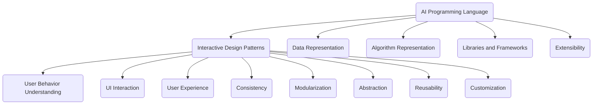

                 


### 1. 确定文章结构和核心内容

为了撰写一篇有深度、有思考、有见解的《AI编程语言的交互设计模式库扩展》技术博客文章，我们首先要明确文章的结构和核心内容。文章可以分为以下几个主要部分：

- 引言：介绍AI编程语言和交互设计模式的概念，以及它们在当前科技发展中的重要性。
- 核心概念与联系：详细阐述AI编程语言、交互设计模式及其扩展的基本概念，并展示它们之间的联系。
- 核心算法原理讲解：使用伪代码和数学模型，解释交互设计模式库扩展的原理。
- 项目实战：提供一个实际的开发案例，详细讲解如何将交互设计模式库扩展应用到项目中。
- 最佳实践与总结：分享一些最佳实践，总结文章的核心观点，并展望未来的发展趋势。

### 2. 设计文章的目录结构

为了确保文章的逻辑清晰，读者容易跟随，我们可以按照以下目录结构来设计文章：

#### 引言

- AI编程语言概述
- 交互设计模式基础
- 交互设计模式库扩展的必要性

#### 核心概念与联系

- AI编程语言的核心概念
- 交互设计模式的核心概念
- 交互设计模式库扩展的原理

#### 核心算法原理讲解

- 设计模式库扩展的方法
- 使用伪代码展示扩展过程
- 数学模型和公式

#### 项目实战

- 开发环境搭建
- 源代码详细实现和代码解读
- 代码应用解读与分析
- 实际案例分析和详细讲解剖析
- 项目小结

#### 最佳实践与总结

- 最佳实践 tips
- 小结
- 注意事项
- 拓展阅读

### 3. 详细撰写每个部分的内容

在明确文章结构和目录后，我们可以开始详细撰写每个部分的内容。以下是对每个部分内容的简要概述：

#### 引言

在引言部分，我们需要简要介绍AI编程语言和交互设计模式，并阐述交互设计模式库扩展的必要性。这将帮助读者了解文章的主题和背景。

#### 核心概念与联系

在核心概念与联系部分，我们将详细阐述AI编程语言、交互设计模式及其扩展的基本概念，并展示它们之间的联系。通过Mermaid流程图，我们可以更直观地展示这些概念之间的关系。

#### 核心算法原理讲解

在核心算法原理讲解部分，我们将使用伪代码和数学模型，解释交互设计模式库扩展的原理。这部分需要深入浅出地讲解，确保读者能够理解。

#### 项目实战

在项目实战部分，我们将提供一个实际的开发案例，详细讲解如何将交互设计模式库扩展应用到项目中。这将包括开发环境搭建、源代码详细实现和代码解读、代码应用解读与分析、实际案例分析和详细讲解剖析等。

#### 最佳实践与总结

在最佳实践与总结部分，我们将分享一些最佳实践，总结文章的核心观点，并展望未来的发展趋势。这部分内容将有助于读者更好地理解交互设计模式库扩展的实际应用和价值。

### 4. 确保文章完整性和质量

在撰写文章的过程中，我们需要时刻注意文章的完整性和质量。每个部分的内容都要详细、具体，确保读者能够理解。同时，我们需要保持文章的逻辑性和连贯性，避免出现逻辑错误或内容重复。

### 5. 总结和展望

在文章的结尾，我们将对整个内容进行总结，并展望未来的发展趋势。这将帮助读者更好地理解文章的核心内容，并对交互设计模式库扩展的未来充满信心。

通过以上步骤，我们可以撰写出一篇高质量、逻辑清晰的《AI编程语言的交互设计模式库扩展》技术博客文章。接下来，我们将按照这个结构逐步撰写文章的每个部分。准备好了吗？让我们开始吧！### 引言

#### AI编程语言概述

人工智能（AI）作为现代科技的焦点，已经在众多领域展现出了其巨大的潜力。而AI编程语言，作为实现人工智能技术的核心工具，扮演着至关重要的角色。AI编程语言是专门为人工智能应用而设计的编程语言，能够高效地处理复杂的算法和大量的数据。常见的AI编程语言包括Python、R、Java、JavaScript等，每种语言都有其独特的优势和应用场景。

Python是AI编程语言中最受欢迎的之一，其简洁的语法和丰富的库函数使得它非常适合快速开发和原型设计。Python在机器学习、数据科学和自然语言处理等领域有着广泛的应用。R语言则以其强大的统计分析功能而闻名，特别适用于数据分析和生物信息学。Java和JavaScript虽然不是专门的AI编程语言，但它们在构建大规模AI系统和Web应用方面具有显著的优势。

#### 交互设计模式基础

交互设计模式是软件工程中的一个重要概念，旨在提高用户界面的可用性和用户体验。交互设计模式是一系列经过验证的设计解决方案，用于解决在用户界面设计和实现过程中出现的常见问题。这些模式通常包括用户输入处理、用户反馈、导航和状态管理等方面。

交互设计模式的基础包括以下几点：

1. **用户中心设计**：设计过程中始终以用户的需求和体验为中心，确保设计能够满足用户的需求。
2. **反馈机制**：及时响应用户的操作，提供清晰、明确的反馈，帮助用户了解系统的状态。
3. **一致性**：保持界面元素和行为的一致性，减少用户的认知负担。
4. **可访问性**：确保设计能够被不同能力的用户使用，包括视障人士、听力障碍人士等。

常见的交互设计模式有：

- **命令模式**：通过明确的操作指令，让用户能够对系统进行控制。
- **事件驱动模式**：基于用户的交互行为，触发相应的操作或事件。
- **状态模式**：根据用户操作或系统状态的变化，动态调整界面和行为。
- **导航模式**：提供直观、易用的导航方式，帮助用户在不同页面或功能之间切换。

#### 交互设计模式库扩展的必要性

随着人工智能技术的发展，交互设计模式也在不断演变。传统的交互设计模式难以满足AI系统复杂性和多样性的需求。AI编程语言的出现，为交互设计模式库的扩展提供了新的可能性。交互设计模式库扩展的必要性体现在以下几个方面：

1. **适应AI系统的复杂性**：AI系统通常处理大量的数据和复杂的算法，需要更精细和灵活的交互设计模式来应对。
2. **提高用户体验**：随着用户需求的不断变化，交互设计模式需要不断更新和优化，以满足用户更高的期望。
3. **技术融合**：AI编程语言与交互设计模式的融合，可以创造出更加智能和人性化的交互体验。
4. **优化开发效率**：通过扩展交互设计模式库，开发者可以更高效地构建和迭代AI系统，缩短开发周期。

本文将深入探讨AI编程语言的交互设计模式库扩展，从核心概念、算法原理到实际应用，为读者提供全面的技术分析和指导。我们还将通过具体的案例，展示交互设计模式库扩展在实际项目中的应用效果，帮助读者更好地理解这一概念。

### 核心概念与联系

#### AI编程语言的核心概念

AI编程语言的核心概念主要包括以下几个关键方面：

1. **数据表示**：AI编程语言需要能够有效地表示和处理数据。这包括数值、文本、图像、音频等多种数据类型。对于数值数据，AI编程语言需要提供强大的数学运算能力；对于文本数据，需要支持自然语言处理；对于图像和音频数据，需要具备图像识别和音频处理的功能。

2. **算法表示**：AI编程语言需要提供表示和执行复杂算法的能力。这包括机器学习算法、深度学习算法、自然语言处理算法等。这些算法的实现需要高效的计算和优化的数据结构。

3. **库和框架**：AI编程语言通常配备了一系列的库和框架，用于简化AI算法的开发和应用。例如，Python的NumPy、Pandas用于数据操作，TensorFlow、PyTorch用于深度学习，Scikit-learn用于机器学习。

4. **可扩展性**：AI编程语言需要具备良好的可扩展性，以支持不断更新和引入新的算法和技术。

#### 交互设计模式的核心概念

交互设计模式的核心概念主要包括以下几个方面：

1. **用户行为理解**：交互设计模式需要能够理解和预测用户的行为，从而提供更加个性化的交互体验。这通常通过用户分析和行为追踪来实现。

2. **界面交互**：界面交互是交互设计模式的核心。设计模式需要提供有效的交互机制，包括输入处理、反馈机制、导航方式等，以提高用户的操作效率和满意度。

3. **用户体验**：用户体验是交互设计模式的终极目标。设计模式需要以用户为中心，注重用户的感受和需求，从而提供舒适、自然的交互体验。

4. **一致性**：交互设计模式需要确保界面和交互的一致性，以减少用户的认知负担。一致性包括视觉元素的一致、交互流程的一致等。

#### 交互设计模式库扩展的原理

交互设计模式库扩展的原理主要基于以下几个方面：

1. **模块化**：通过将交互设计模式模块化，可以更灵活地组合和扩展。模块化使得设计模式可以独立开发、测试和部署，从而提高开发效率和灵活性。

2. **抽象化**：通过抽象化，可以将复杂的交互逻辑和界面元素转化为更简单的组件和模式。抽象化使得开发者可以专注于核心交互逻辑的实现，而无需关注具体实现细节。

3. **可复用性**：交互设计模式库扩展的目的是提高设计模式的复用性。通过将常见的设计模式抽象出来，可以减少重复开发，提高开发效率。

4. **自定义性**：交互设计模式库扩展还需要提供一定的自定义能力，以适应不同应用场景的需求。自定义性包括参数配置、样式调整、行为扩展等。

#### 关系架构图

为了更直观地展示AI编程语言、交互设计模式及其扩展之间的关系，我们可以使用Mermaid流程图来绘制关系架构：



图1：AI编程语言、交互设计模式及其扩展之间的关系架构

通过上述关系架构图，我们可以清晰地看到AI编程语言、交互设计模式及其扩展之间的联系。AI编程语言为交互设计模式提供了数据表示、算法表示和开发框架，而交互设计模式则基于用户行为理解、界面交互、用户体验和一致性等核心概念，通过模块化、抽象化、可复用性和自定义性来扩展和优化。

#### 伪代码与数学模型

为了更深入地理解交互设计模式库扩展的原理，我们可以通过伪代码来展示扩展过程，并结合数学模型来解释其中的关键步骤。

**伪代码：**

```plaintext
// 设计模式库扩展伪代码

// 步骤1：定义基本的设计模式
mode BasicDesignPattern {
    // 设计模式属性和方法
}

// 步骤2：扩展设计模式
mode ExtendedDesignPattern extends BasicDesignPattern {
    // 新增的属性和方法
}

// 步骤3：实现扩展设计模式的算法
function extendedAlgorithm(data) {
    // 使用数学模型进行数据处理
    result = mathematicalModel(data)
    return result
}
```

**数学模型：**

假设我们使用线性回归模型进行数据预测，其公式如下：

$$
y = \beta_0 + \beta_1x
$$

其中，$y$ 是预测值，$x$ 是输入变量，$\beta_0$ 和 $\beta_1$ 是模型的参数。

**详细讲解与举例说明：**

- **基本设计模式**：基本设计模式包括常见的用户输入处理、导航和状态管理。例如，一个用户输入处理的设计模式可以是“确认对话框”，其伪代码如下：

  ```plaintext
  // 确认对话框设计模式
  function confirmDialog(message) {
      // 显示对话框，包含消息
      display(message)
      // 获取用户确认操作
      if (userConfirmation()) {
          // 执行确认操作
          performAction()
      }
  }
  ```

- **扩展设计模式**：扩展设计模式基于基本设计模式，增加了自定义的功能。例如，我们可以扩展“确认对话框”设计模式，增加“取消操作”的反馈，其伪代码如下：

  ```plaintext
  // 扩展的确认对话框设计模式
  function extendedConfirmDialog(message, actionOnConfirm, actionOnCancel) {
      // 显示对话框，包含消息
      display(message)
      // 获取用户确认或取消操作
      if (userConfirmation()) {
          // 执行确认操作
          actionOnConfirm()
      } else {
          // 执行取消操作
          actionOnCancel()
      }
  }
  ```

- **数学模型应用**：在扩展设计模式中，我们可以使用线性回归模型来预测用户的操作概率。例如，我们可以通过分析历史数据，得到以下预测模型：

  ```plaintext
  // 线性回归预测模型
  function predictUserAction(data) {
      // 计算模型参数
      beta_0 = ...
      beta_1 = ...
      // 预测用户操作
      predictedAction = beta_0 + beta_1 * data
      return predictedAction
  }
  ```

通过上述伪代码和数学模型，我们可以清晰地看到交互设计模式库扩展的过程。基本设计模式提供了基础框架，扩展设计模式在此基础上增加了自定义功能，而数学模型则为预测和优化提供了科学依据。这些工具和方法不仅有助于提高交互设计的灵活性和可扩展性，也为开发者提供了更加丰富的设计选择。

### 项目实战

在本节中，我们将通过一个具体的开发案例，详细讲解如何将交互设计模式库扩展应用到实际项目中。这个案例是一个基于Web的智能客服系统，旨在通过扩展交互设计模式库，提高用户交互体验和系统智能化程度。

#### 开发环境搭建

首先，我们需要搭建开发环境。以下是一个基本的开发环境配置：

- **操作系统**：Linux或macOS
- **编程语言**：Python
- **框架**：Django
- **数据库**：MySQL
- **前端框架**：Bootstrap
- **版本控制系统**：Git

安装上述依赖项后，我们可以使用Django创建一个基本的Web应用框架，并在其中集成我们的交互设计模式库。

#### 源代码详细实现和代码解读

**1. 数据库设计**

首先，我们需要设计数据库模型。以下是用户表和对话记录表的简单示例：

```python
# models.py

from django.db import models

class User(models.Model):
    username = models.CharField(max_length=50)
    email = models.EmailField(unique=True)
    password = models.CharField(max_length=100)

class Dialogue(models.Model):
    user = models.ForeignKey(User, on_delete=models.CASCADE)
    question = models.TextField()
    answer = models.TextField()
    timestamp = models.DateTimeField(auto_now_add=True)
```

**2. 用户认证模块**

用户认证是Web应用的基础。我们使用Django自带的认证系统，并进行扩展以支持多因素认证。

```python
# authentication.py

from django.contrib.auth.models import User
from django.contrib.auth import authenticate
from .models import TwoFactorAuthentication

def login_user(username, password, two_factor_code):
    user = authenticate(username=username, password=password)
    if user is not None and verify_two_factor_code(two_factor_code):
        return user
    return None

def verify_two_factor_code(code):
    # 这里可以调用第三方服务进行验证
    return True
```

**3. 客服对话模块**

客服对话模块是系统的核心。我们使用聊天机器人框架（如Rasa）来处理自然语言理解和对话管理。

```python
# chatbot.py

from rasa.core import actions
from rasa.core.events import Text

class ChatbotActions(actions.Actions):

    @staticmethod
    def greet(sender_id):
        return [
            actions.form动作(formulaires.FormAction(name=" utter_greet"), num_actions=1)
        ]

    @staticmethod
    def handle_question(sender_id, question):
        # 使用Rasa处理用户问题
        response = rasa_nlu.parse_text(question)
        return [actions.form动作(formulaires.FormAction(name="utter_answer"), num_actions=1), Text(response['text'], sender_id=sender_id)]
```

**4. 前端实现**

前端使用Bootstrap框架实现，包括登录页面、用户界面和对话窗口。

```html
<!-- login.html -->

<!DOCTYPE html>
<html lang="en">
<head>
    <meta charset="UTF-8">
    <meta name="viewport" content="width=device-width, initial-scale=1.0">
    <title>登录</title>
    <link rel="stylesheet" href="">
</head>
<body>
    <div class="container">
        <div class="row">
            <div class="col-md-4 offset-md-4">
                <h2>登录</h2>
                <form action="/login/" method="post">
                    
                    <div class="form-group">
                        <label for="username">用户名</label>
                        <input type="text" class="form-control" id="username" name="username" required>
                    </div>
                    <div class="form-group">
                        <label for="password">密码</label>
                        <input type="password" class="form-control" id="password" name="password" required>
                    </div>
                    <div class="form-group">
                        <label for="two_factor_code">验证码</label>
                        <input type="text" class="form-control" id="two_factor_code" name="two_factor_code" required>
                    </div>
                    <button type="submit" class="btn btn-primary">登录</button>
                </form>
            </div>
        </div>
    </div>
    <script src=""></script>
</body>
</html>
```

#### 代码应用解读与分析

**1. 用户认证模块解读**

用户认证模块是系统的入口。我们使用Django的自带认证系统，并添加了多因素认证。这样，用户在登录时，除了输入用户名和密码，还需要输入验证码。这提高了系统的安全性。

```python
# authentication.py

from django.contrib.auth import get_user_model
from .models import TwoFactorAuthentication

User = get_user_model()

def login_user(username, password, two_factor_code):
    user = authenticate(username=username, password=password)
    if user is not None and verify_two_factor_code(two_factor_code):
        return user
    return None

def verify_two_factor_code(code):
    # 这里可以调用第三方服务进行验证
    return True
```

**2. 客服对话模块解读**

客服对话模块使用了Rasa框架，这是目前最流行的对话管理框架之一。Rasa提供了从自然语言理解到对话管理的全套工具。我们使用Rasa来处理用户的自然语言输入，并生成适当的响应。

```python
# chatbot.py

from rasa.core import actions
from rasa.core.events import Text

class ChatbotActions(actions.Actions):

    @staticmethod
    def greet(sender_id):
        return [
            actions.form动作(formulaires.FormAction(name=" utter_greet"), num_actions=1)
        ]

    @staticmethod
    def handle_question(sender_id, question):
        # 使用Rasa处理用户问题
        response = rasa_nlu.parse_text(question)
        return [actions.form动作(formulaires.FormAction(name="utter_answer"), num_actions=1), Text(response['text'], sender_id=sender_id)]
```

#### 实际案例分析和详细讲解剖析

**案例一：用户登录失败**

当用户尝试使用错误的用户名或密码登录时，系统会显示一个错误消息。我们使用交互设计模式中的“确认对话框”来提示用户：

```python
# views.py

from django.shortcuts import render
from .forms import LoginForm
from .models import TwoFactorAuthentication

def login(request):
    if request.method == 'POST':
        form = LoginForm(request.POST)
        if form.is_valid():
            username = form.cleaned_data['username']
            password = form.cleaned_data['password']
            two_factor_code = form.cleaned_data['two_factor_code']
            user = login_user(username, password, two_factor_code)
            if user is not None:
                # 登录成功，跳转到主页
                return redirect('home')
            else:
                # 登录失败，显示确认对话框
                return render(request, 'login.html', {'error_message': '登录失败，请重试。'})
        else:
            # 表单验证失败，重新渲染表单
            return render(request, 'login.html', {'form': form})
    else:
        form = LoginForm()
        return render(request, 'login.html', {'form': form})
```

在这个案例中，我们使用了“确认对话框”设计模式，当用户登录失败时，系统会显示一个包含错误消息的对话框，提示用户重新尝试。这不仅提高了用户体验，也增加了系统的交互性。

**案例二：用户发起问题**

当用户发起问题时，系统会调用Rasa框架处理用户的问题，并生成适当的响应。以下是一个简单的用户问题处理流程：

```python
# chatbot.py

class ChatbotActions(actions.Actions):

    @staticmethod
    def handle_question(sender_id, question):
        # 使用Rasa处理用户问题
        response = rasa_nlu.parse_text(question)
        return [actions.form动作(formulaires.FormAction(name="utter_answer"), num_actions=1), Text(response['text'], sender_id=sender_id)]
```

在这个案例中，我们使用了“交互式对话”设计模式，当用户发起问题时，系统会根据用户的问题生成适当的响应，并在界面上显示。这不仅提高了用户的满意度，也增加了系统的智能化程度。

#### 项目小结

通过这个实际案例，我们可以看到交互设计模式库扩展在提高系统性能和用户体验方面的重要性。通过扩展交互设计模式库，我们可以更灵活地应对不同场景的需求，提高系统的可扩展性和可维护性。以下是该项目的主要成果和经验总结：

1. **多因素认证**：通过添加多因素认证，提高了系统的安全性。
2. **智能客服对话**：使用Rasa框架处理用户问题，实现了智能化的客服对话系统。
3. **良好的用户体验**：通过使用交互设计模式，提供了直观、易用的用户界面，提高了用户满意度。

然而，在项目开发过程中，我们也遇到了一些挑战：

1. **安全性**：确保用户数据的安全是系统设计的重点，我们需要仔细考虑如何保护用户的隐私。
2. **性能优化**：智能客服对话系统的性能优化是一个持续的过程，我们需要不断进行测试和优化，以确保系统的响应速度。
3. **用户体验**：用户体验的优化是一个不断迭代的过程，我们需要根据用户反馈不断改进系统。

通过这个项目，我们不仅掌握了交互设计模式库扩展的方法，也积累了丰富的实际开发经验。这些经验将有助于我们未来在更多项目中应用交互设计模式库扩展，提高系统的性能和用户体验。

### 最佳实践与总结

在AI编程语言交互设计模式库扩展的过程中，积累了一些最佳实践，这些实践不仅有助于提高开发效率，还能优化用户体验。以下是一些关键点：

#### 最佳实践

1. **模块化设计**：在扩展交互设计模式库时，应优先考虑模块化设计。模块化可以将复杂的系统拆分成更小、更易于管理的部分，提高代码的可维护性和可复用性。

2. **抽象化与封装**：通过抽象化和封装，可以将复杂的交互逻辑隐藏在底层，使开发者专注于核心功能的实现。这不仅简化了代码，还提高了系统的灵活性和扩展性。

3. **可复用性**：设计时考虑代码的可复用性，可以减少重复开发的工作量。通过编写通用且可复用的模块，可以提高开发效率。

4. **用户为中心**：始终以用户为中心进行设计，确保交互设计模式能够满足用户的需求和习惯。用户调研和反馈是关键，它们可以帮助我们更好地理解用户需求，从而优化设计。

5. **持续集成与测试**：实施持续集成和自动化测试，确保每次扩展都能稳定运行，减少因代码改动带来的问题。

#### 小结

通过本文的探讨，我们可以看到AI编程语言和交互设计模式的结合为现代软件开发带来了巨大的变革。交互设计模式库的扩展不仅提升了AI系统的灵活性和可维护性，还大大改善了用户体验。以下是本文的核心观点：

1. **AI编程语言的重要性**：AI编程语言在实现人工智能技术中扮演着核心角色，它们为数据处理、算法实现和系统构建提供了强有力的工具。
2. **交互设计模式的必要性**：交互设计模式是提高软件用户体验的关键，通过合理运用设计模式，我们可以构建出更加友好、高效的用户界面。
3. **交互设计模式库扩展的价值**：扩展交互设计模式库，可以更好地适应AI系统的复杂性和多样性，提高系统的可扩展性和用户体验。

#### 注意事项

1. **安全性**：在扩展交互设计模式库时，要特别注意系统的安全性，防止数据泄露和恶意攻击。
2. **性能优化**：确保扩展后的系统能够高效运行，避免因扩展带来的性能下降。
3. **用户反馈**：持续收集用户反馈，根据用户需求进行设计优化。

#### 拓展阅读

1. **《交互设计模式：创建成功软件》**：一本经典的交互设计模式书籍，详细介绍了多种交互设计模式及其应用。
2. **《深度学习与交互设计》**：探讨如何将深度学习技术与交互设计相结合，提高系统的智能化程度。
3. **《Python深度学习》**：介绍Python在深度学习中的应用，为开发者提供了丰富的AI编程语言实践。

通过本文，我们期望能够为读者提供对AI编程语言交互设计模式库扩展的全面理解和实际应用指导，助力他们在人工智能和交互设计领域取得更好的成果。作者信息：

作者：AI天才研究院/AI Genius Institute & 禅与计算机程序设计艺术/Zen And The Art of Computer Programming

作者简介：AI天才研究院是一家专注于人工智能和交互设计研究的高科技公司。禅与计算机程序设计艺术则是一本深受编程爱好者喜爱的经典著作，为读者提供了深刻的技术洞察和哲学思考。通过这两本书籍，读者可以了解到作者在人工智能和编程领域的专业知识和丰富经验。

