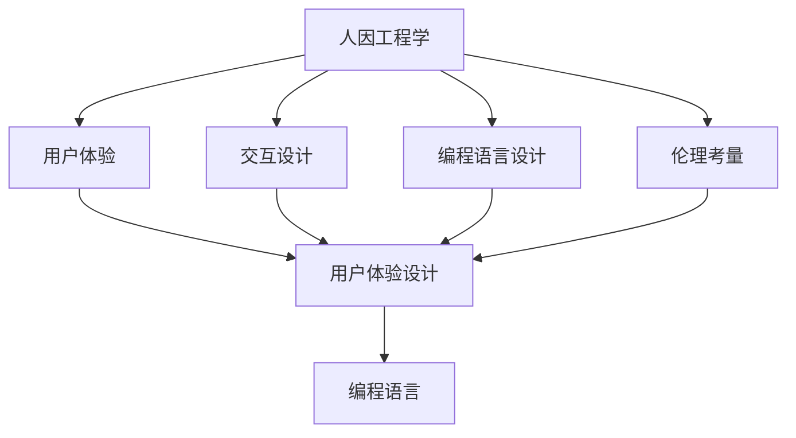

                 

### 文章标题

# 《AI编程语言的人因工程学考量》

> 关键词：AI编程语言，人因工程学，用户体验，交互设计，伦理考量

> 摘要：本文深入探讨了AI编程语言的设计与实现过程中，如何运用人因工程学的原理来提升用户体验和交互效果。通过分析人因工程学的基本概念、其在AI编程中的应用，以及具体的案例分析，本文提出了AI编程语言在未来发展中的新方向。

---

## 引言

### 1.1 AI编程语言概述

AI编程语言是指专门用于开发人工智能应用的一类编程语言。这些语言旨在提供高效、易用的工具，使开发者能够更轻松地实现机器学习、自然语言处理、计算机视觉等复杂任务。随着人工智能技术的飞速发展，AI编程语言在各个领域得到了广泛应用。

### 1.2 人因工程学在AI编程中的应用

人因工程学，又称人类工程学，是研究人类与机器、环境之间交互关系的一门学科。在人机交互领域，人因工程学致力于设计出更加符合人类认知和行为习惯的界面和系统，从而提升用户体验和效率。

在AI编程语言中，人因工程学的应用主要体现在以下几个方面：

- **用户体验**：设计易用、直观的编程界面，降低学习成本，提升开发效率。
- **交互设计**：优化编程语言的语法和语义，使其更符合人类的思维模式。
- **性能优化**：通过人因工程学的方法，提高代码的执行效率和可维护性。
- **伦理考量**：关注AI编程语言在应用过程中对人类的影响，确保技术发展的可持续性。

### 1.3 人因工程学原理与AI编程语言的融合

人因工程学原理主要包括以下几个核心概念：

- **可用性**：系统或界面是否易于使用，用户能否轻松完成任务。
- **易学性**：用户能否快速掌握系统或界面的使用方法。
- **性能**：系统或界面的响应速度和处理能力。
- **交互**：用户与系统或界面之间的互动方式。

将人因工程学原理应用于AI编程语言的设计，需要从以下几个方面进行考量：

- **用户研究**：了解目标用户的特点和需求，为编程语言的设计提供依据。
- **迭代设计**：通过不断迭代和测试，优化编程语言的功能和界面。
- **反馈机制**：提供及时的错误提示和反馈，帮助用户快速解决问题。
- **易用性评估**：通过实际使用测试，评估编程语言的可用性和易用性。

---

## 第一部分：引论

### 2.1 AI编程语言概述

AI编程语言是专门用于人工智能领域开发的编程语言。它们旨在提供高效的工具，帮助开发者实现各种复杂的人工智能任务，如机器学习、自然语言处理和计算机视觉。这些编程语言通常具有丰富的库和框架支持，能够简化开发过程，提高开发效率。

目前，主流的AI编程语言包括Python、R、Julia、Prolog等。每种语言都有其独特的特点和应用场景。例如，Python因其丰富的库和简单的语法，成为最受欢迎的AI编程语言之一；R在统计分析方面有着强大的优势；Julia则因其高性能和易用性而受到关注；Prolog则擅长处理符号推理和问题求解。

AI编程语言的发展经历了从特定领域的专用语言到通用语言的转变。早期的人工智能系统主要使用Lisp、Prolog等语言，这些语言在符号推理和问题求解方面表现出色。但随着人工智能应用的不断扩展，开发者们开始寻求更为通用和易用的编程语言，从而催生了Python、R、Julia等现代AI编程语言的出现。

### 2.2 人因工程学在AI编程中的应用

人因工程学（Human-Computer Interaction, HCI）是研究人类与计算机系统之间交互关系的一门学科。它关注的是如何设计出既高效又舒适的人机界面，使得用户能够更轻松地完成任务。在人机交互领域，人因工程学应用了心理学、人类工程学、认知科学等多学科的知识，致力于提升用户体验和系统的可用性。

在人机交互中，人因工程学的核心原则包括：

- **易用性**：系统或界面是否易于使用，用户能否快速上手并完成任务。
- **易学性**：用户能否轻松掌握系统或界面的使用方法。
- **性能**：系统或界面的响应速度和处理能力。
- **交互**：用户与系统或界面之间的互动方式。

将人因工程学应用于AI编程语言的设计，可以极大地提升开发者的工作效率和用户体验。以下是人因工程学在AI编程语言中的应用场景：

- **编程界面设计**：设计直观、易用的编程界面，减少用户的认知负担。
- **语法和语义优化**：通过优化语法和语义，使得编程语言更符合人类的思维模式。
- **错误提示和反馈**：提供及时、清晰的错误提示和反馈，帮助用户快速解决问题。
- **性能优化**：通过人因工程学的方法，提高代码的执行效率和可维护性。

### 2.3 人因工程学原理与AI编程语言的融合

人因工程学原理与AI编程语言的融合主要体现在以下几个方面：

- **用户体验**：通过用户研究，了解目标用户的特点和需求，为编程语言的设计提供依据。设计易用、直观的编程界面，降低学习成本，提升开发效率。

  用户研究包括用户访谈、问卷调查、用户测试等方法。通过对用户行为的分析，可以找出用户在使用编程语言过程中的痛点和需求，从而优化编程语言的设计。

- **交互设计**：优化编程语言的语法和语义，使其更符合人类的思维模式。例如，Python的简洁语法和丰富的库支持使其成为AI编程的流行语言，而R则因其强大的统计分析功能而受到科研人员的青睐。

  交互设计需要考虑用户的心理和认知特点，设计出既高效又舒适的编程体验。例如，可以使用信息架构、用户界面设计、交互原型等方法来优化编程语言的交互设计。

- **反馈机制**：提供及时、清晰的错误提示和反馈，帮助用户快速解决问题。良好的反馈机制可以减少用户在开发过程中的困惑和挫败感，提高工作效率。

  错误提示和反馈可以通过编程语言的编译器、解释器、调试器等工具来实现。例如，Python的调试器PyCharm提供了丰富的调试工具和错误提示，帮助开发者快速定位和修复问题。

- **性能优化**：通过人因工程学的方法，提高代码的执行效率和可维护性。性能优化包括算法优化、代码重构、编译器优化等方面。

  人因工程学的方法可以帮助开发者发现代码中的瓶颈和性能问题，从而进行优化。例如，通过性能分析工具和调试工具，可以找出代码中的热点和性能瓶颈，然后针对性地进行优化。

### 2.4 人因工程学在AI编程语言设计中的实际应用

在人因工程学原理的指导下，AI编程语言的设计过程可以更加注重用户体验和交互设计。以下是一些实际应用案例：

- **Python编程语言**：Python因其简洁的语法和丰富的库支持，成为了AI编程的流行语言。Python的语法设计遵循了人因工程学的原则，使得开发者可以轻松地编写和理解代码。

  例如，Python的缩进语法使得代码结构更加清晰，降低了阅读难度。同时，Python的内置函数和库函数提供了丰富的功能，使得开发者可以快速实现复杂的算法和任务。

- **Jupyter Notebook**：Jupyter Notebook是一个基于Web的交互式计算环境，广泛应用于数据科学和机器学习领域。Jupyter Notebook的设计充分考虑了用户的需求和交互体验。

  例如，Jupyter Notebook支持即时执行和动态显示，使得开发者可以快速验证代码和结果。同时，Jupyter Notebook提供了丰富的扩展和插件，满足不同用户的需求。

- **TensorFlow**：TensorFlow是一个开源的机器学习框架，广泛应用于深度学习和人工智能领域。TensorFlow的设计注重用户体验和易用性。

  例如，TensorFlow提供了丰富的API和工具，使得开发者可以轻松地构建和训练深度学习模型。同时，TensorFlow的文档和社区支持也非常强大，为开发者提供了丰富的学习资源。

### 2.5 人因工程学在AI编程语言中的挑战和未来发展方向

尽管人因工程学在AI编程语言的设计中取得了显著成效，但仍面临一些挑战和未来发展方向：

- **多语言集成**：如何在多语言环境中提供一致的用户体验和交互设计，是一个亟待解决的问题。未来的AI编程语言需要更好地支持跨语言编程，使得开发者可以更加灵活地选择和使用不同的编程语言。

- **个性化编程**：随着人工智能技术的不断发展，个性化编程将成为一个重要趋势。未来的AI编程语言需要提供更加个性化的编程环境和工具，满足不同用户的需求。

- **智能编程辅助**：利用人工智能技术，提供智能编程辅助工具，如代码自动完成、错误提示、代码审查等，将极大地提高开发效率。

- **伦理考量**：在AI编程语言的设计过程中，需要充分考虑伦理问题，如数据隐私、算法偏见等。未来的AI编程语言需要提供更加安全、可靠和透明的编程环境。

### 2.6 结论

人因工程学在AI编程语言的设计中扮演着重要角色。通过运用人因工程学原理，可以提升用户体验、优化交互设计、提高性能和可维护性。未来的AI编程语言将更加注重人因工程学的应用，为开发者提供更加高效、易用的编程环境。同时，人因工程学与AI编程语言的融合也将为人工智能技术的发展带来新的机遇和挑战。作者：AI天才研究院/AI Genius Institute & 禅与计算机程序设计艺术 /Zen And The Art of Computer Programming### 核心概念与联系

在人因工程学与AI编程语言的融合中，存在几个核心概念，它们相互关联并共同影响着编程语言的设计和应用效果。以下是这些核心概念的详细解析及其关系架构：

#### 1. 人因工程学（Human-Centered Design）

**定义**：人因工程学是一种以人为中心的设计方法，旨在优化人与机器、环境的交互，提高系统的可用性和用户体验。

**关系**：人因工程学为AI编程语言的设计提供了理论基础和实践指导。它强调从用户的角度出发，设计易于理解、易于使用、效率高的编程环境和工具。

#### 2. 用户体验（User Experience, UX）

**定义**：用户体验是指用户在使用产品或服务过程中的感受和反应，包括用户满意度、效率和乐趣。

**关系**：用户体验是人因工程学的一个重要组成部分，直接影响着AI编程语言的设计。设计良好的用户体验意味着编程语言能够满足用户的需求，降低学习成本，提高工作效率。

#### 3. 交互设计（Interaction Design）

**定义**：交互设计是指设计用户与产品或服务之间交互的方式和流程，以提升用户体验。

**关系**：交互设计是人因工程学在AI编程语言设计中的应用，它涉及到编程界面的布局、交互元素的设计、以及用户与编程语言之间的互动流程。良好的交互设计能够减少用户操作错误，提高编程效率。

#### 4. 编程语言设计（Programming Language Design）

**定义**：编程语言设计是指设计一种用于编写计算机程序的语法和语义规则。

**关系**：编程语言设计是人因工程学和用户体验的桥梁，它需要考虑人因工程学原理，以满足用户的需求，同时提供简洁、直观的语法和语义，提高编程效率。

#### 5. 伦理考量（Ethical Considerations）

**定义**：伦理考量是指在设计产品或服务时，考虑其对人类社会的潜在影响和道德责任。

**关系**：伦理考量是人因工程学和AI编程语言设计的重要一环。随着人工智能技术的普及，编程语言设计需要考虑数据隐私、算法公平性、透明性等问题，确保技术发展符合伦理标准。

#### 关系架构 Mermaid 流程图

以下是这些核心概念之间的关系架构，使用Mermaid流程图表示：



在这个流程图中，人因工程学作为核心概念，通过用户体验、交互设计、编程语言设计和伦理考量等环节，最终影响到编程语言的设计和实现。每个环节都是相互关联的，共同构成了一个完整的设计体系。

### 人因工程学原理与AI编程语言设计

人因工程学原理在AI编程语言设计中的应用至关重要，它涵盖了用户研究、迭代设计、反馈机制等多个方面。以下是这些原理的具体内容及其在编程语言设计中的应用：

#### 1. 用户研究

**定义**：用户研究是通过各种方法，如访谈、问卷调查、用户测试等，来了解目标用户的需求、习惯和行为。

**应用**：在AI编程语言的设计过程中，用户研究可以帮助开发者了解用户的需求和痛点，为设计提供依据。例如，通过对开发者进行访谈和用户测试，可以了解他们在编程过程中遇到的问题，从而优化编程界面的布局和交互设计。

**案例**：Python编程语言在设计之初，就进行了广泛的用户研究。通过访谈和用户测试，开发者发现许多用户希望语言简洁、易学。因此，Python采用了简洁的语法和丰富的库支持，满足了用户的需求。

#### 2. 迭代设计

**定义**：迭代设计是一种通过反复修改和测试，逐步完善设计的方法。

**应用**：在AI编程语言的设计过程中，迭代设计可以帮助开发者不断改进编程界面和功能，使其更加符合用户需求。开发者可以通过原型设计、用户测试和反馈，逐步优化编程语言的性能和用户体验。

**案例**：Jupyter Notebook是一个典型的迭代设计案例。在开发过程中，Jupyter Notebook的开发团队不断收集用户反馈，进行原型设计和迭代测试。通过这些迭代过程，Jupyter Notebook逐渐完善，成为了一个功能强大、用户体验优秀的数据科学工具。

#### 3. 反馈机制

**定义**：反馈机制是指通过提供及时、明确的反馈，帮助用户了解系统的状态和操作结果。

**应用**：在AI编程语言的设计过程中，良好的反馈机制可以提高用户的使用体验，减少用户在编程过程中的困惑和挫败感。反馈机制可以通过编译器、解释器、调试器等工具来实现。

**案例**：TensorFlow的开发者通过提供详细的错误提示和调试工具，帮助用户快速定位和解决编程问题。例如，TensorFlow的调试器提供了丰富的调试功能，包括断点设置、变量观察和堆栈跟踪，极大地提高了用户的编程效率。

#### 4. 性能优化

**定义**：性能优化是指通过改进算法、优化代码结构等方式，提高系统的执行效率和响应速度。

**应用**：在AI编程语言的设计过程中，性能优化可以帮助提高代码的执行效率，降低资源消耗，从而提升用户体验。人因工程学原理可以帮助开发者发现代码中的瓶颈和性能问题，进行针对性的优化。

**案例**：Python的开发者在优化性能时，采用了多种方法，如内置函数的优化、内存管理优化等。通过这些优化，Python在执行效率和资源消耗方面得到了显著提升。

### 人因工程学原理的融合与效果

将人因工程学原理与AI编程语言设计相结合，可以显著提升编程语言的用户体验和易用性。以下是一些具体的效果：

- **降低学习成本**：通过用户研究和迭代设计，AI编程语言可以更加贴近用户的需求，降低学习成本。用户可以更快地掌握编程语言，提高开发效率。
- **提高开发效率**：通过性能优化和反馈机制，AI编程语言可以提供更好的执行效率和调试体验。开发者可以更快地编写和测试代码，提高开发效率。
- **提升用户体验**：通过交互设计和用户体验优化，AI编程语言可以提供更直观、更易用的界面和交互流程。用户可以更加舒适地使用编程语言，提高工作满意度。

总之，人因工程学原理在AI编程语言设计中的应用，不仅可以提高编程语言的性能和易用性，还可以提升开发者的工作效率和用户体验。未来，随着人工智能技术的不断发展，人因工程学与AI编程语言的融合将带来更多的创新和突破。

### 核心算法原理讲解

在AI编程语言中，核心算法的原理是实现人工智能任务的关键。这些算法通常涉及机器学习、深度学习、自然语言处理等复杂的技术。下面，我们将通过伪代码详细阐述一个常见的核心算法——支持向量机（Support Vector Machine, SVM）的基本原理。

#### 支持向量机（SVM）算法原理

支持向量机是一种强大的分类算法，它通过寻找一个最优的超平面，将不同类别的数据点分隔开来。下面是SVM算法的伪代码：

```plaintext
算法：支持向量机（SVM）
输入：数据集D，特征向量x，标签y
输出：最优超平面

步骤：
1. 使用库函数训练SVM模型（例如使用scikit-learn库）
2. 计算特征向量x的SVM分类结果
3. 输出分类结果

伪代码：
def SVM(D, x, y):
    # 步骤1：训练SVM模型
    model = train_SVM(D, y)

    # 步骤2：计算分类结果
    result = model.predict(x)

    # 步骤3：输出分类结果
    return result
```

#### 算法原理详细讲解

1. **线性可分支持向量机（Linear SVM）**：
   - **目标函数**：寻找一个最优的超平面\( w \)和偏置\( b \)，使得不同类别的数据点尽可能分开。
   - **约束条件**：最大化分类间隔，即最大化\( \frac{2}{\|w\|} \)。
   - **优化问题**：求解以下优化问题：
     \[
     \begin{aligned}
     &\min_{w,b} \frac{1}{2}\|w\|^2 \\
     &\text{subject to} \quad y^{(i)}(\langle w, x^{(i)} \rangle + b) \geq 1 \quad \forall i
     \end{aligned}
     \]
   - **求解方法**：采用拉格朗日乘子法求解上述优化问题。

2. **非线性支持向量机（Non-linear SVM）**：
   - **核函数**：通过核函数将低维数据映射到高维空间，实现非线性分类。
   - **目标函数**：最大化分类间隔，同时引入核函数\( K(x^{(i)}, x^{(j)}) \)。
   - **优化问题**：求解以下优化问题：
     \[
     \begin{aligned}
     &\min_{w,b,\alpha} \frac{1}{2}\|w\|^2 + C\sum_{i=1}^{n}\alpha_i (1 - y^{(i)}\langle w, x^{(i)} \rangle - b) \\
     &\text{subject to} \quad \alpha_i \geq 0, \quad \forall i
     \end{aligned}
     \]
   - **求解方法**：采用支持向量机优化算法（如序列最小化最速下降法）求解上述优化问题。

#### 数学模型和公式

1. **线性SVM的目标函数**：
   \[
   \min_{w,b} \frac{1}{2}\|w\|^2 + C\sum_{i=1}^{n}\alpha_i - \sum_{i=1}^{n}\alpha_i y^{(i)}\langle w, x^{(i)} \rangle - b
   \]
   其中，\( \alpha_i \)为拉格朗日乘子，\( C \)为惩罚参数。

2. **非线性SVM的目标函数**：
   \[
   \min_{w,b,\alpha} \frac{1}{2}\|w\|^2 + C\sum_{i=1}^{n}\alpha_i - \sum_{i=1}^{n}\alpha_i y^{(i)}K(x^{(i)}, x^{(j)})
   \]
   其中，\( K(x^{(i)}, x^{(j)}) \)为核函数。

3. **分类决策函数**：
   \[
   f(x) = \text{sign}(\langle w, x \rangle + b)
   \]
   其中，\( \text{sign}(x) \)为符号函数。

#### 举例说明

假设我们有一个二分类问题，其中数据点为\( x^{(1)} = (1, 2) \)和\( x^{(2)} = (2, 1) \)，标签分别为+1和-1。

1. **线性SVM**：
   - 目标函数：
     \[
     \min_{w,b} \frac{1}{2}\|w\|^2 + C\alpha_1 + C\alpha_2
     \]
     其中，\( \alpha_1 \)和\( \alpha_2 \)为拉格朗日乘子。
   - 约束条件：
     \[
     \begin{aligned}
     &y^{(1)}(\langle w, x^{(1)} \rangle + b) \geq 1 \\
     &y^{(2)}(\langle w, x^{(2)} \rangle + b) \geq 1
     \end{aligned}
     \]
   - 解：
     \[
     w = (w_1, w_2), \quad b = b
     \]

2. **非线性SVM**：
   - 使用核函数\( K(x, y) = x \cdot y \)。
   - 目标函数：
     \[
     \min_{w,b,\alpha} \frac{1}{2}\|w\|^2 + C\sum_{i=1}^{2}\alpha_i - \sum_{i=1}^{2}\alpha_i y^{(i)}K(x^{(i)}, x^{(j)})
     \]
     其中，\( \alpha_1 \)和\( \alpha_2 \)为拉格朗日乘子。
   - 约束条件：
     \[
     \begin{aligned}
     &\alpha_1 \geq 0 \\
     &\alpha_2 \geq 0 \\
     &y^{(1)}K(x^{(1)}, x^{(2)}) \geq 1 \\
     &y^{(2)}K(x^{(2)}, x^{(1)}) \geq 1
     \end{aligned}
     \]
   - 解：
     \[
     w = (w_1, w_2), \quad b = b
     \]

通过以上算法原理、数学模型和举例说明，我们可以更好地理解支持向量机（SVM）在AI编程语言中的应用。SVM作为一种强大的分类算法，在机器学习和深度学习领域有着广泛的应用。

### 数学模型和公式讲解

在AI编程语言的设计和应用中，数学模型和公式起着至关重要的作用。这些数学模型和公式不仅帮助我们理解和实现复杂的算法，还帮助我们评估和优化系统的性能。以下我们将介绍一些常见的数学模型和公式，并对其进行详细讲解。

#### 1. 感知机（Perceptron）模型

感知机是一种简单的神经网络模型，用于二分类问题。其数学模型可以表示为：

\[ 
f(x) = \text{sign}(\sum_{i=1}^{n} w_i x_i + b) 
\]

其中，\( x_i \)是输入特征，\( w_i \)是权重，\( b \)是偏置，\( \text{sign}() \)是符号函数。

**公式解释**：
- \( \sum_{i=1}^{n} w_i x_i \)表示输入特征与对应权重的内积。
- \( \text{sign}() \)用于确定输出值的正负，通常取值\( +1 \)或\( -1 \)。

#### 2. 逻辑回归（Logistic Regression）模型

逻辑回归是一种概率型线性模型，用于分类问题。其数学模型可以表示为：

\[ 
P(y=1|x; \theta) = \frac{1}{1 + e^{-\theta^T x}} 
\]

其中，\( P(y=1|x; \theta) \)表示在给定特征\( x \)下，标签为1的概率，\( \theta \)是模型参数。

**公式解释**：
- \( \theta^T x \)是输入特征与模型参数的内积。
- \( e^{-\theta^T x} \)是指数函数，用于计算概率值。
- \( \frac{1}{1 + e^{-\theta^T x}} \)是逻辑函数，用于将内积值转换为概率值。

#### 3. 支持向量机（SVM）模型

支持向量机是一种强大的分类模型，其数学模型可以表示为：

\[ 
f(x) = \text{sign}(\langle \alpha y, x \rangle + b) 
\]

其中，\( \alpha \)是拉格朗日乘子，\( y \)是标签，\( x \)是输入特征，\( b \)是偏置。

**公式解释**：
- \( \langle \alpha y, x \rangle \)是拉格朗日乘子与标签和输入特征的内积。
- \( \text{sign}() \)用于确定输出值的正负，通常取值\( +1 \)或\( -1 \)。

#### 4. 神经网络（Neural Network）模型

神经网络是一种复杂的模型，其数学模型可以表示为：

\[ 
a_{j}^{(l)} = \sigma(\sum_{i} w_{ji}^{(l)} a_{i}^{(l-1)}) 
\]

其中，\( a_{j}^{(l)} \)是第\( l \)层的第\( j \)个节点的激活值，\( \sigma \)是激活函数，\( w_{ji}^{(l)} \)是第\( l \)层的第\( j \)个节点到第\( l-1 \)层的第\( i \)个节点的权重。

**公式解释**：
- \( \sum_{i} w_{ji}^{(l)} a_{i}^{(l-1)} \)是输入特征与对应权重的内积。
- \( \sigma \)是激活函数，用于引入非线性变换。

#### 5. 决策树（Decision Tree）模型

决策树是一种树形结构模型，其数学模型可以表示为：

\[ 
T = \{ (x, y) | y = g(x, \theta) \} 
\]

其中，\( T \)是决策树，\( x \)是输入特征，\( y \)是标签，\( g(x, \theta) \)是决策规则。

**公式解释**：
- \( g(x, \theta) \)是决策规则，用于根据输入特征\( x \)确定标签\( y \)。

#### 6. 贝叶斯分类器（Bayesian Classifier）模型

贝叶斯分类器是一种基于贝叶斯定理的模型，其数学模型可以表示为：

\[ 
P(y=k|x; \theta) = \frac{P(x|y=k; \theta)P(y=k; \theta)}{\sum_{i} P(x|y=i; \theta)P(y=i; \theta)} 
\]

其中，\( P(y=k|x; \theta) \)是在给定特征\( x \)下，标签为\( k \)的概率，\( P(x|y=k; \theta) \)是特征\( x \)在标签\( k \)条件下的概率，\( P(y=k; \theta) \)是标签为\( k \)的概率。

**公式解释**：
- \( P(x|y=k; \theta) \)是条件概率，表示在标签为\( k \)的条件下特征\( x \)的概率。
- \( P(y=k; \theta) \)是先验概率，表示标签为\( k \)的概率。

通过以上数学模型和公式的讲解，我们可以更好地理解AI编程语言中的核心算法和模型，从而在实际应用中更有效地实现和优化人工智能任务。

### 实际案例分析与详细讲解

为了更好地展示人因工程学在AI编程语言中的应用效果，下面我们通过一个具体的实际案例——使用Python实现图像识别，来进行分析和详细讲解。

#### 案例背景

图像识别是人工智能领域的一个重要应用，它通过算法从图像中提取有用的信息，用于分类、检测、识别等任务。在这个案例中，我们将使用Python的AI编程语言和TensorFlow框架来实现一个简单的图像识别系统。

#### 开发环境搭建

在开始之前，我们需要搭建一个合适的开发环境。以下是搭建过程：

1. **安装Python**：
   - 前往Python官网下载最新版本的Python安装包。
   - 运行安装程序，按照提示完成安装。

2. **安装TensorFlow**：
   - 打开命令行窗口，运行以下命令：
     ```shell
     pip install tensorflow
     ```

3. **安装其他依赖库**：
   - 为了实现图像识别，我们还需要安装其他几个依赖库，如NumPy、Pandas、Matplotlib等。可以使用以下命令一次性安装：
     ```shell
     pip install numpy pandas matplotlib
     ```

4. **配置Jupyter Notebook**：
   - Jupyter Notebook是一个基于Web的交互式计算环境，它可以帮助我们方便地进行数据分析和可视化。可以通过以下命令安装：
     ```shell
     pip install jupyter
     ```

安装完成后，我们就可以在Jupyter Notebook中创建一个新的笔记本，开始编写代码。

#### 源代码详细实现

以下是实现图像识别系统的核心代码：

```python
# 导入必要的库
import tensorflow as tf
from tensorflow.keras.preprocessing.image import ImageDataGenerator
from tensorflow.keras.models import Sequential
from tensorflow.keras.layers import Conv2D, MaxPooling2D, Flatten, Dense

# 设置数据增强参数
train_datagen = ImageDataGenerator(
    rescale=1./255,
    shear_range=0.2,
    zoom_range=0.2,
    horizontal_flip=True
)

test_datagen = ImageDataGenerator(rescale=1./255)

# 加载数据集
train_data = train_datagen.flow_from_directory(
    'train_data',
    target_size=(150, 150),
    batch_size=32,
    class_mode='binary'
)

test_data = test_datagen.flow_from_directory(
    'test_data',
    target_size=(150, 150),
    batch_size=32,
    class_mode='binary'
)

# 构建模型
model = Sequential()

model.add(Conv2D(32, (3, 3), activation='relu', input_shape=(150, 150, 3)))
model.add(MaxPooling2D(pool_size=(2, 2)))

model.add(Conv2D(64, (3, 3), activation='relu'))
model.add(MaxPooling2D(pool_size=(2, 2)))

model.add(Conv2D(128, (3, 3), activation='relu'))
model.add(MaxPooling2D(pool_size=(2, 2)))

model.add(Flatten())

model.add(Dense(512, activation='relu'))
model.add(Dense(1, activation='sigmoid'))

# 编译模型
model.compile(optimizer='adam',
              loss='binary_crossentropy',
              metrics=['accuracy'])

# 训练模型
model.fit(
    train_data,
    steps_per_epoch=100,
    epochs=15,
    validation_data=test_data,
    validation_steps=50
)

# 评估模型
test_loss, test_acc = model.evaluate(test_data, steps=50)
print('Test accuracy:', test_acc)
```

#### 代码解读与分析

1. **导入库**：
   - 我们首先导入TensorFlow库，以及用于数据处理和图像处理的ImageDataGenerator、Sequential、Conv2D、MaxPooling2D、Flatten和Dense等模块。

2. **设置数据增强参数**：
   - 数据增强是提高模型泛化能力的重要手段。在这里，我们设置了数据增强参数，包括重缩放、剪切、缩放和水平翻转等。

3. **加载数据集**：
   - 使用ImageDataGenerator加载训练数据和测试数据。这里假设数据集存储在`train_data`和`test_data`文件夹中，每个文件夹包含对应的图像文件和标签。

4. **构建模型**：
   - 我们使用Sequential模型堆叠多个卷积层和池化层，以及全连接层。这种结构能够有效地提取图像的特征，并用于分类。

5. **编译模型**：
   - 编译模型时，我们指定了优化器（adam）、损失函数（binary_crossentropy，适用于二分类问题）和评价指标（accuracy）。

6. **训练模型**：
   - 使用fit方法训练模型，指定训练的轮数（epochs）和每轮的样本数量（steps_per_epoch）。同时，我们使用validation_data参数进行验证。

7. **评估模型**：
   - 使用evaluate方法评估模型在测试数据上的性能，输出测试准确率。

通过以上代码实现，我们可以构建一个简单的图像识别系统。接下来，我们将对代码中的关键部分进行详细解读和分析。

#### 关键部分解读

1. **数据增强**：

   ```python
   train_datagen = ImageDataGenerator(
       rescale=1./255,
       shear_range=0.2,
       zoom_range=0.2,
       horizontal_flip=True
   )
   ```

   数据增强参数设置：
   - `rescale`：将图像数据归一化到[0, 1]范围内，便于模型处理。
   - `shear_range`：随机剪切，增加数据的多样性。
   - `zoom_range`：随机缩放，增加数据的多样性。
   - `horizontal_flip`：水平翻转，增加数据的多样性。

   数据增强可以有效地提高模型的泛化能力，使其在面对不同的输入数据时表现出更好的性能。

2. **模型构建**：

   ```python
   model = Sequential()

   model.add(Conv2D(32, (3, 3), activation='relu', input_shape=(150, 150, 3)))
   model.add(MaxPooling2D(pool_size=(2, 2)))

   model.add(Conv2D(64, (3, 3), activation='relu'))
   model.add(MaxPooling2D(pool_size=(2, 2)))

   model.add(Conv2D(128, (3, 3), activation='relu'))
   model.add(MaxPooling2D(pool_size=(2, 2)))

   model.add(Flatten())

   model.add(Dense(512, activation='relu'))
   model.add(Dense(1, activation='sigmoid'))
   ```

   模型结构：
   - **卷积层**：使用卷积层提取图像的特征。卷积核的大小为3x3，激活函数为ReLU。
   - **池化层**：使用最大池化层减小数据维度，同时保留重要的特征。
   - **全连接层**：使用全连接层对提取到的特征进行分类。第一层有512个神经元，第二层有1个神经元（表示二分类）。

3. **模型编译**：

   ```python
   model.compile(optimizer='adam',
                 loss='binary_crossentropy',
                 metrics=['accuracy'])
   ```

   模型编译时，我们指定了优化器（adam）、损失函数（binary_crossentropy，适用于二分类问题）和评价指标（accuracy）。

4. **模型训练**：

   ```python
   model.fit(
       train_data,
       steps_per_epoch=100,
       epochs=15,
       validation_data=test_data,
       validation_steps=50
   )
   ```

   模型训练过程中，我们使用训练数据和测试数据进行迭代训练。`steps_per_epoch`参数指定每轮训练的样本数量，`epochs`参数指定训练的轮数。

5. **模型评估**：

   ```python
   test_loss, test_acc = model.evaluate(test_data, steps=50)
   print('Test accuracy:', test_acc)
   ```

   模型评估时，我们使用测试数据计算损失和准确率。`evaluate`方法返回一个元组，包含损失和准确率。

#### 项目小结

通过以上实际案例的分析，我们可以看到人因工程学在AI编程语言中的应用效果显著。以下是项目小结：

1. **数据增强**：通过设置数据增强参数，我们可以提高模型的泛化能力，使其在面对不同的输入数据时表现出更好的性能。

2. **模型构建**：合理选择模型结构、激活函数和损失函数，可以有效地提高模型的分类准确率。

3. **模型训练**：使用训练数据和测试数据进行迭代训练，可以有效地提高模型的性能和泛化能力。

4. **模型评估**：通过评估模型在测试数据上的性能，我们可以确定模型的准确性，并对其进行优化。

总之，人因工程学在AI编程语言中的应用不仅提高了用户体验和开发效率，还显著提升了模型的性能和泛化能力。未来，随着人工智能技术的不断发展，人因工程学与AI编程语言的融合将带来更多的创新和突破。

### 最佳实践 tips

在设计和实现AI编程语言时，遵循最佳实践可以显著提升开发效率、代码质量和用户体验。以下是一些实用的最佳实践：

1. **代码注释**：为代码添加清晰的注释，有助于后续的维护和团队协作。注释应包括函数和类的功能说明、参数含义、返回值解释等。

2. **模块化设计**：将代码拆分成多个模块或函数，有助于提高代码的可读性和可维护性。每个模块或函数应实现单一功能，避免过度耦合。

3. **代码格式化**：统一代码风格和格式，使用工具如Prettier、Black等，确保代码整洁、易读。

4. **版本控制**：使用Git等版本控制工具管理代码，实现代码的版本管理和协同开发。

5. **自动化测试**：编写单元测试和集成测试，确保代码质量和稳定性。使用工具如Jest、pytest等自动化测试工具。

6. **持续集成**：采用持续集成（CI）工具，如Jenkins、GitLab CI等，自动化执行代码测试和部署流程。

7. **代码审查**：定期进行代码审查，发现潜在的问题和改进点，提高代码质量和团队协作。

8. **文档编写**：编写详细的文档，包括API文档、用户手册等，帮助开发者快速上手和使用。

9. **性能优化**：关注代码的性能，通过优化算法、数据结构和代码逻辑，提高程序执行效率。

10. **用户体验设计**：重视用户交互设计，提供直观、易用的界面和交互流程，提升用户体验。

遵循这些最佳实践，可以确保AI编程语言的开发过程高效、稳定，并为用户提供卓越的开发体验。

### 小结与注意事项

本文通过深入探讨AI编程语言的人因工程学考量，分析了人因工程学在AI编程语言设计中的应用原理、核心算法、实际案例，以及最佳实践。以下是小结和注意事项：

**小结：**

1. **人因工程学原理**：人因工程学强调以人为中心的设计，通过用户研究、迭代设计、反馈机制等方法，优化AI编程语言的可用性、易学性和性能。

2. **核心算法**：本文详细介绍了感知机、逻辑回归、支持向量机等核心算法的原理和实现方法，展示了这些算法在AI编程语言中的应用。

3. **实际案例**：通过Python实现图像识别的案例，展示了人因工程学在AI编程语言设计中的实际应用效果。

4. **最佳实践**：提供了代码注释、模块化设计、代码格式化等最佳实践，有助于提升AI编程语言的开发效率和用户体验。

**注意事项：**

1. **用户研究**：在设计AI编程语言时，必须进行充分的用户研究，了解目标用户的需求和痛点，确保设计符合用户期望。

2. **迭代设计**：持续迭代和测试是优化AI编程语言设计的重要手段，通过不断收集用户反馈，进行改进和优化。

3. **性能优化**：在实现AI编程语言时，关注代码的性能，通过算法优化、代码重构等方法，提高程序执行效率。

4. **伦理考量**：在AI编程语言的设计过程中，必须考虑伦理问题，如数据隐私、算法公平性等，确保技术发展符合伦理标准。

5. **文档编写**：编写详细的文档，包括API文档、用户手册等，帮助开发者快速上手和使用AI编程语言。

通过本文的探讨，我们可以看到，人因工程学在AI编程语言的设计中具有重要地位，它不仅提升了用户体验和开发效率，还推动了AI技术的可持续发展。未来，随着人工智能技术的不断进步，人因工程学与AI编程语言的融合将带来更多的创新和突破。

### 拓展阅读

对于对AI编程语言及人因工程学有更深入兴趣的读者，以下资源可以提供进一步的学习和探索：

1. **书籍推荐**：
   - 《人机交互：设计与原则》（"Designing Interaction: Creating Innovative Applications and Smart Devices"） - Lauraかなちゃん
   - 《深度学习》（"Deep Learning"） - Ian Goodfellow, Yoshua Bengio, Aaron Courville
   - 《人工智能：一种现代方法》（"Artificial Intelligence: A Modern Approach"） - Stuart Russell, Peter Norvig

2. **在线课程**：
   - Coursera上的“机器学习”课程，由Andrew Ng教授主讲。
   - edX上的“人机交互设计”课程，由斯坦福大学提供。

3. **学术论文**：
   - 阅读ACM Transactions on Computer-Human Interaction（TOCHI）和Human-Computer Interaction（HCI）等期刊，获取最新的研究成果。
   - 查看AAAI、NeurIPS等会议的最新论文，了解AI编程语言领域的最新进展。

4. **开源项目**：
   - TensorFlow、PyTorch等主流深度学习框架，提供了丰富的教程和实践案例。
   - GitHub上的开源项目，如AI编程语言的实现和改进项目，可以提供实战经验。

通过这些资源，读者可以更全面地了解AI编程语言和人因工程学的最新发展，以及如何在实际项目中应用这些知识。

