                 

### 第一步：背景介绍

在当今数字化时代，人工智能（AI）的发展和应用已经成为社会进步的重要驱动力。AI技术不仅提升了各行业的效率，还带来了全新的商业模式和服务体验。然而，随着AI技术的深入发展，AI编程语言与人机交互模式的创新成为了一个不可忽视的重要领域。

AI编程语言是指专门为人工智能开发设计的编程语言，它们使得构建和部署AI模型变得更加高效和灵活。Python、R、Prolog等编程语言因其丰富的库函数和强大的社区支持，成为AI领域的首选工具。这些编程语言不仅支持数据科学、机器学习和深度学习的各种算法，还能够实现高效的计算和优化。

人机交互模式则是指人与计算机之间进行信息交换和操作的方式。随着技术的进步，人机交互模式经历了从命令行界面到图形用户界面（GUI），再到自然语言处理和语音交互的转变。现代AI编程语言的崛起，为人机交互模式带来了新的机遇和挑战，如通过自然语言处理实现智能对话系统、通过语音识别实现语音助手等。

本文旨在探讨AI编程语言的人机交互模式创新，分析其在现代软件开发中的应用和影响。我们将从以下几个方面进行深入探讨：

1. **AI编程语言概述**：介绍AI编程语言的发展历史、主流语言及其适用场景。
2. **人机交互模式基础**：探讨人机交互的基本概念、分类及设计原则。
3. **AI编程语言在交互中的应用**：分析AI编程语言在自然语言处理、语音识别和视觉交互中的应用案例。
4. **创新的人机交互模式**：介绍创新的人机交互模式及其实现技巧。
5. **人机交互模式评估与优化**：讨论人机交互模式的评估指标和优化方法。
6. **未来人机交互模式的趋势**：展望人工智能和人机交互模式的未来发展趋势。
7. **实践与探索**：通过实际项目案例，展示如何应用AI编程语言实现人机交互模式创新。

通过以上内容的分析，我们希望能够为读者提供一个全面、系统的视角，深入了解AI编程语言和人机交互模式创新的本质和应用。

### 第二步：核心概念与联系

在探讨AI编程语言的人机交互模式创新之前，我们需要明确几个核心概念及其相互之间的联系。这些核心概念构成了理解本文主题的基础，也是我们在后续章节中深入分析的前提。

#### 1. AI编程语言

AI编程语言是专门为人工智能开发设计的语言，它们提供了丰富的库函数和工具，使得构建和部署AI模型更加高效。核心概念包括：

- **机器学习（Machine Learning）**：通过算法让计算机从数据中学习，提高其预测和决策能力。
- **深度学习（Deep Learning）**：一种基于神经网络的机器学习方法，能够处理大规模数据和复杂的模式识别任务。
- **自然语言处理（Natural Language Processing, NLP）**：使计算机能够理解和生成人类语言的技术。

#### 2. 人机交互模式

人机交互模式是指用户与计算机系统进行交互的方式，核心概念包括：

- **图形用户界面（GUI）**：通过图形界面提供直观的操作方式，如点击按钮、拖放元素等。
- **自然语言交互**：通过自然语言与计算机进行对话，如语音识别、文本聊天等。
- **多模态交互**：结合多种交互方式，如语音、手势、触摸等，提供更丰富的交互体验。

#### 3. AI编程语言与人机交互模式的结合

AI编程语言与人机交互模式的结合，使得计算机系统能够更好地理解用户需求，提供更加智能和个性化的服务。其核心联系包括：

- **智能对话系统**：利用自然语言处理技术，实现人与计算机的对话交流。
- **语音助手**：通过语音识别和自然语言处理，为用户提供语音控制服务。
- **个性化推荐系统**：利用机器学习算法，根据用户行为和偏好提供个性化的推荐内容。

下面通过Mermaid流程图，展示这些核心概念之间的联系架构：

```mermaid
graph TD
    A[AI编程语言] --> B[机器学习]
    A --> C[深度学习]
    A --> D[NLP]
    B --> E[分类]
    B --> F[回归]
    C --> G[卷积神经网络]
    C --> H[循环神经网络]
    D --> I[文本分类]
    D --> J[情感分析]
    B --> K[GUI]
    B --> L[自然语言交互]
    B --> M[多模态交互]
    K --> N[界面设计]
    L --> O[语音识别]
    L --> P[文本聊天]
    M --> Q[手势识别]
    M --> R[触摸交互]
    E --> S[垃圾邮件检测]
    F --> T[房价预测]
    G --> U[图像分类]
    H --> V[语音合成]
    I --> W[情感分析]
    J --> X[新闻摘要]
    K --> Y[用户界面设计]
    L --> Z[对话系统]
    M --> AA[多模态交互设计]
    B --> BB[数据预处理]
    C --> CC[模型训练]
    D --> DD[模型评估]
    E --> EE[分类评估指标]
    F --> FF[回归评估指标]
    G --> GG[神经网络架构]
    H --> HH[训练算法]
    I --> II[文本分类算法]
    J --> JJ[情感分析算法]
    K --> KK[界面交互逻辑]
    L --> LL[语言理解模型]
    M --> MM[多模态感知模型]
    N --> NN[界面元素布局]
    O --> OO[语音识别模型]
    P --> PP[文本生成模型]
    Q --> QQ[手势识别模型]
    R --> RR[触摸交互模型]
    S --> SS[分类器性能]
    T --> TT[预测准确性]
    U --> UU[图像识别性能]
    V --> WW[语音合成效果]
    W --> XX[情感分析效果]
    X --> XX[摘要生成效果]
    Y --> YY[用户体验评价]
    Z --> ZZ[对话系统性能]
    AA --> AA[多模态交互评价]
    BB --> BB[数据清洗方法]
    CC --> CC[模型优化策略]
    DD --> DD[模型评估流程]
    EE --> EE[评估指标计算]
    FF --> FF[评估指标计算]
    GG --> GG[神经网络优化]
    HH --> HH[训练算法改进]
    II --> II[文本分类优化]
    JJ --> JJ[情感分析优化]
    KK --> KK[界面交互优化]
    LL --> LL[语言理解优化]
    MM --> MM[多模态感知优化]
    NN --> NN[界面布局优化]
    OO --> OO[语音识别优化]
    PP --> PP[文本生成优化]
    QQ --> QQ[手势识别优化]
    RR --> RR[触摸交互优化]
    SS --> SS[分类器优化]
    TT --> TT[预测性能优化]
    UU --> UU[图像识别优化]
    WW --> WW[语音合成优化]
    XX --> XX[情感分析优化]
    YY --> YY[用户体验改进]
    ZZ --> ZZ[对话系统优化]
```



上述Mermaid流程图展示了AI编程语言的核心概念及其与人机交互模式的相互关系。通过这些联系，我们可以更好地理解AI编程语言在人机交互中的应用，为后续章节的内容奠定了坚实的基础。在接下来的章节中，我们将详细探讨每个核心概念和其应用场景，帮助读者深入了解AI编程语言的人机交互模式创新。

### 第三步：核心算法原理讲解

在深入探讨AI编程语言的人机交互模式创新之前，我们需要先了解几个核心算法原理，这些算法在AI编程和人机交互中扮演着关键角色。以下是这些核心算法的详细讲解，包括伪代码示例和数学模型的解析。

#### 1. 机器学习算法

机器学习算法是AI编程语言的核心，用于从数据中学习规律并做出预测。以下是一个简单的线性回归算法的伪代码示例：

```plaintext
算法：线性回归
输入：训练数据集 (X, Y)，权重初始化 (w)
输出：拟合模型 Y = w·X

初始化：w = 0
对于每个训练样本 (x_i, y_i)：
    预测值：y' = w·x_i
    计算误差：e = y_i - y'
    更新权重：w = w + α * e * x_i

返回：拟合模型 Y = w·X
```

线性回归的数学模型为：

$$ Y = w·X + b $$

其中，\( w \) 是权重，\( b \) 是偏置项。通过梯度下降法更新权重，以最小化预测误差。

#### 2. 深度学习算法

深度学习算法通过多层神经网络实现复杂的特征提取和模式识别。以下是一个简单的多层感知器（MLP）算法的伪代码示例：

```plaintext
算法：多层感知器（MLP）
输入：训练数据集 (X, Y)，网络结构 (L, H)，学习率 α
输出：拟合模型

初始化：权重和偏置（w_{ij}, b_j），其中 i 表示输入层到隐藏层的连接，j 表示隐藏层到输出层的连接
对于每个隐藏层 l：
    对于每个神经元 j：
        计算输入：z_j = Σ(w_{ij} * x_i) + b_j
        应用激活函数：a_j = σ(z_j)
对于输出层：
    预测值：y' = Σ(w_{jy} * a_j) + b_y

计算误差：e = Y - y'
更新权重和偏置：w_{ij} = w_{ij} + α * e * a_j * (1 - a_j) * x_i
                        b_j = b_j + α * e * a_j * (1 - a_j)
                        w_{jy} = w_{jy} + α * e * a_j
                        b_y = b_y + α * e

返回：拟合模型
```

多层感知器的数学模型为：

$$ a_{j}^{(l)} = \sigma \left( \sum_{i} w_{ij}^{(l)} a_{i}^{(l-1)} + b_j^{(l)} \right) $$

其中，\( \sigma \) 是激活函数，通常使用 Sigmoid 或ReLU函数。

#### 3. 自然语言处理算法

自然语言处理（NLP）算法用于理解和生成人类语言。以下是一个简单的文本分类算法的伪代码示例：

```plaintext
算法：朴素贝叶斯分类器
输入：训练数据集 (D)，测试数据集 (T)
输出：分类结果

初始化：计算词频分布 P(w|y)
对于每个类别 y：
    对于每个词 w：
        P(w|y) = count(w, y) / N(y)

对于每个测试样本 t：
    预测类别：y' = argmax_y (P(y) * Σ(P(w|y) * count(w, t)))

返回：分类结果
```

朴素贝叶斯分类器的数学模型为：

$$ P(y) = \frac{N(y)}{N} $$

$$ P(w|y) = \frac{count(w, y)}{N(y)} $$

其中，\( N(y) \) 是类别 y 的词频总数，\( N \) 是所有类别词频的总和，\( count(w, y) \) 是词 w 在类别 y 中出现的次数。

通过上述伪代码示例和数学模型解析，我们可以看到这些核心算法在AI编程和人机交互中的应用原理。这些算法不仅为数据分析和模式识别提供了强大的工具，还为构建智能人机交互系统奠定了基础。在接下来的章节中，我们将继续探讨这些算法在实际项目中的应用和优化方法。

### 第四步：数学模型和公式讲解

在探讨AI编程语言的人机交互模式创新时，数学模型和公式的理解与应用至关重要。以下是几个关键的数学模型及其公式的详细解释，并通过具体例子来说明它们的应用。

#### 1. 线性回归模型

线性回归是一种常见的统计方法，用于分析自变量和因变量之间的线性关系。其基本公式如下：

$$ Y = w \cdot X + b $$

其中，\( Y \) 是因变量，\( X \) 是自变量，\( w \) 是权重（斜率），\( b \) 是偏置项（截距）。

**示例**：
假设我们要预测房屋价格，根据房屋面积和所在区域预测价格。我们可以通过以下公式进行线性回归：

$$ 价格 = 0.5 \cdot 面积 + 20,000 $$

这里的权重 \( w \) 为 0.5，偏置项 \( b \) 为 20,000。

#### 2. 梯度下降法

梯度下降法是一种优化算法，用于最小化损失函数。其核心思想是沿着损失函数的梯度方向调整参数，以达到最小值。线性回归中的权重更新公式如下：

$$ w = w - \alpha \cdot \frac{\partial}{\partial w} L $$

其中，\( \alpha \) 是学习率，\( L \) 是损失函数。

**示例**：
假设我们的损失函数为 \( L(w) = (Y - w \cdot X)^2 \)，则权重更新过程为：

$$ w = w - \alpha \cdot 2 \cdot (Y - w \cdot X) \cdot X $$

通过多次迭代，我们可以逐步减小损失函数，直至达到最小值。

#### 3. 多层感知器（MLP）

多层感知器是一种前馈神经网络，用于实现非线性分类和回归任务。其激活函数通常为 Sigmoid 或 ReLU。以下是一个简单的多层感知器模型：

$$ a_{j}^{(l)} = \sigma \left( \sum_{i} w_{ij}^{(l)} a_{i}^{(l-1)} + b_j^{(l)} \right) $$

其中，\( a_{j}^{(l)} \) 是第 \( l \) 层第 \( j \) 个神经元的输出，\( \sigma \) 是激活函数，\( w_{ij}^{(l)} \) 是连接权重，\( b_j^{(l)} \) 是偏置项。

**示例**：
假设我们有一个简单的多层感知器模型，输入层有 2 个神经元，隐藏层有 3 个神经元，输出层有 1 个神经元。我们可以表示为：

$$ 输出 = \sigma \left( w_{1}^{(2)} \cdot 输入_1 + w_{2}^{(2)} \cdot 输入_2 + b_1^{(2)} \right) $$

#### 4. 朴素贝叶斯分类器

朴素贝叶斯分类器是一种基于贝叶斯定理的简单分类器，它假设特征之间相互独立。其基本公式如下：

$$ P(y) = \frac{N(y)}{N} $$

$$ P(w|y) = \frac{count(w, y)}{N(y)} $$

其中，\( P(y) \) 是类别 \( y \) 的先验概率，\( N(y) \) 是类别 \( y \) 的样本总数，\( count(w, y) \) 是特征 \( w \) 在类别 \( y \) 中出现的次数。

**示例**：
假设我们要分类电子邮件是否为垃圾邮件。我们可以通过以下公式计算概率：

$$ P(垃圾邮件) = \frac{垃圾邮件总数}{总邮件数} $$

$$ P(特征_1|垃圾邮件) = \frac{特征_1在垃圾邮件中出现的次数}{垃圾邮件总数} $$

根据贝叶斯定理，我们可以计算出每个类别的后验概率，并选择概率最大的类别作为预测结果。

通过这些数学模型和公式的讲解，我们可以更好地理解AI编程语言在数据分析和人机交互中的应用。在实际项目中，这些公式和方法为优化模型性能和实现智能交互提供了重要的工具。在后续章节中，我们将通过具体的项目实战，展示如何应用这些数学模型和算法，实现人机交互模式的创新。

### 第五步：项目实战

在了解了AI编程语言和人机交互模式的核心算法原理后，接下来通过一个具体的项目实战，展示如何在实际开发环境中搭建人机交互系统，并详细解读代码实现过程和项目应用分析。

#### 项目背景

本项目旨在构建一个基于语音识别和自然语言处理的智能语音助手，能够实现与用户的自然语言对话。我们选择使用Python作为开发语言，结合TensorFlow框架实现语音识别和对话系统。项目分为以下几个阶段：

1. **环境搭建**：配置Python开发环境，安装TensorFlow和其他必要库。
2. **语音识别**：使用TensorFlow实现语音识别功能。
3. **自然语言处理**：利用自然语言处理技术实现对话功能。
4. **系统集成**：将语音识别和自然语言处理功能集成，构建完整的智能语音助手系统。
5. **测试与优化**：对系统进行测试，优化性能。

#### 环境搭建

首先，我们需要配置Python开发环境。在终端中执行以下命令：

```bash
pip install tensorflow numpy scipy
```

安装TensorFlow和其他必需的库。接下来，我们需要安装语音识别工具，如Google的TensorFlow语音识别库：

```bash
pip install tensorflow-hub
```

安装完毕后，我们就可以开始编写代码了。

#### 语音识别

语音识别是智能语音助手的核心功能之一。我们使用TensorFlow实现语音识别，以下是一个简单的示例代码：

```python
import tensorflow as tf
import numpy as np
import scipy.io.wavfile as wav

# 读取语音文件
def read_audio(file_path, sample_rate=16000):
    audio, _ = wav.read(file_path)
    return audio

# 转换为TensorFlow张量
def to_tensor(audio, sample_rate):
    audio = audio.astype(np.float32)
    audio = audio / np.max(np.abs(audio))
    audio = np.reshape(audio, (-1, 1))
    audio = tf.convert_to_tensor(audio, dtype=tf.float32)
    audio = tf.expand_dims(audio, 0)
    audio = tf.reshape(audio, [-1, 1])
    audio = tf.cast(audio, tf.float32)
    return audio

# 语音识别
def recognize_speech(file_path, model_path='models/magenta_t2t_wav2vec_60000steps'):
    audio = read_audio(file_path)
    audio = to_tensor(audio, sample_rate=16000)
    
    # 加载预训练模型
    model = tf.keras.models.load_model(model_path)
    
    # 进行预测
    predictions = model.predict(audio)
    
    # 转换为文本
    predicted_text = predictions[0].numpy().tolist()
    return predicted_text

# 测试语音识别
file_path = 'example.wav'
predicted_text = recognize_speech(file_path)
print(predicted_text)
```

上述代码首先读取语音文件，将其转换为TensorFlow张量，然后使用预训练模型进行预测，并将预测结果转换为文本输出。

#### 自然语言处理

自然语言处理是实现智能对话的关键。我们使用TensorFlow的Transformers库实现自然语言处理功能：

```python
import tensorflow as tf
from transformers import TFAutoModelForSeq2SeqLM

# 加载预训练模型
model_path = 'models/t5-small'
model = TFAutoModelForSeq2SeqLM.from_pretrained(model_path)

# 实现对话功能
def chat_with_model(prompt):
    input_text = tf.constant(prompt)
    output_ids = model.sampleokens(input_text, num_return_sequences=1)
    output_text = tf.strings.reduce_join(tf garder_ids_to_strings(output_ids), axis=-1)
    return output_text.numpy().decode('utf-8')

# 测试对话功能
prompt = "你好，我可以帮你做什么？"
response = chat_with_model(prompt)
print(response)
```

上述代码加载预训练模型，并实现一个简单的对话功能。用户输入提示，模型返回相应的响应。

#### 系统集成

将语音识别和自然语言处理功能集成，构建完整的智能语音助手系统：

```python
# 集成语音识别和对话系统
def handle_speech(speech_file):
    predicted_text = recognize_speech(speech_file)
    response = chat_with_model(predicted_text)
    return response

# 测试系统集成
speech_file = 'example.wav'
response = handle_speech(speech_file)
print(response)
```

#### 测试与优化

对系统进行测试，并优化性能。我们可以通过调整模型参数、增加训练数据等方式来提升系统的准确性和响应速度。

#### 项目应用分析与解读

通过上述项目实战，我们可以看到如何使用AI编程语言（Python和TensorFlow）实现智能语音助手。项目的关键步骤包括：

1. **环境搭建**：配置Python和TensorFlow环境，安装必要的库。
2. **语音识别**：使用TensorFlow实现语音识别功能，将语音信号转换为文本。
3. **自然语言处理**：利用Transformers库实现自然语言处理，构建对话系统。
4. **系统集成**：将语音识别和对话系统集成，构建完整的智能语音助手系统。
5. **测试与优化**：对系统进行测试，优化模型参数和性能。

在项目应用分析中，我们重点关注以下几个方面：

- **准确性**：通过调整模型参数和增加训练数据，提高语音识别和对话系统的准确性。
- **响应速度**：优化模型计算效率，减少响应时间，提高用户体验。
- **鲁棒性**：增强系统对噪声和背景干扰的鲁棒性，确保在不同环境下稳定运行。

通过项目实战，我们不仅实现了智能语音助手的基本功能，还了解了如何在实际项目中应用AI编程语言和人机交互模式。这个项目为读者提供了一个具体的范例，展示了如何通过代码实现和优化智能交互系统。在后续的章节中，我们将继续探讨如何评估和优化人机交互模式，以及未来人机交互模式的趋势。

### 第六步：人机交互模式的评估与优化

在人机交互模式的开发和应用过程中，评估与优化是至关重要的一环。通过科学的评估方法和优化的策略，我们可以提升人机交互系统的性能，提高用户体验。以下是关于人机交互模式评估与优化的具体方法和案例研究。

#### 评估指标

为了评估人机交互模式的性能，我们需要设定一系列科学、全面的评估指标。这些指标可以分为以下几个方面：

1. **准确性（Accuracy）**：评估系统在处理用户输入时，正确识别和响应的比例。对于语音识别系统，准确性通常用字符错误率（Character Error Rate, CER）或词错误率（Word Error Rate,WER）来衡量。
2. **响应时间（Response Time）**：从用户输入到系统返回响应的时间。响应时间越短，用户体验越好。
3. **用户满意度（User Satisfaction）**：通过用户调查和反馈，评估用户对系统的满意度。
4. **误识别率（False Acceptance Rate, FAR）和误拒绝率（False Rejection Rate, FRR）**：评估系统在识别用户输入时的误识别和误拒绝情况，对于语音识别系统，这两个指标尤为重要。
5. **稳定性（Stability）**：系统在不同环境和条件下的稳定性，包括对噪声、背景干扰的鲁棒性。

#### 优化方法

在确定了评估指标后，我们可以采用以下方法对人机交互模式进行优化：

1. **算法优化**：通过改进语音识别和自然语言处理算法，提高识别和响应的准确性。例如，使用更先进的深度学习模型，如卷积神经网络（CNN）或循环神经网络（RNN），可以提升系统的性能。
2. **模型训练**：增加训练数据和样本，使用更复杂的模型结构，通过多次迭代训练，提高模型对各类输入的泛化能力。
3. **参数调整**：根据评估结果，调整模型参数，如学习率、隐藏层节点数等，以优化系统的性能。
4. **用户体验优化**：通过用户反馈，调整交互界面和交互流程，提高用户的操作体验。例如，优化语音识别的语音模型，使其更符合用户的语言习惯。
5. **多模态交互**：结合多种交互方式，如语音、手势、触摸等，提供更丰富的交互体验。通过多模态交互，可以提升系统的鲁棒性和用户满意度。

#### 案例研究：优化语音识别系统

以下是一个关于优化语音识别系统的实际案例：

**背景**：
一个智能语音助手系统在用户测试中表现出色，但在实际应用中，用户对系统的响应速度和准确性提出了更高要求。

**评估指标**：
- 准确性：CER 低于 2%
- 响应时间：平均响应时间小于 500ms
- 用户满意度：用户满意度达到 90% 以上

**优化过程**：

1. **算法优化**：
   - 将传统的GMM-HMM模型升级为基于深度学习的CNN模型，提高语音识别的准确性。
   - 使用RNN模型（如LSTM）来处理更复杂的语音序列，提升系统的鲁棒性。

2. **模型训练**：
   - 增加训练数据，包括各种口音、背景噪声等，使模型更具泛化能力。
   - 采用数据增强技术，如时间拉伸、速度变换等，丰富训练数据的多样性。

3. **参数调整**：
   - 调整学习率、隐藏层节点数等参数，使模型在收敛速度和性能之间取得平衡。
   - 使用交叉验证方法，选择最优的模型参数。

4. **用户体验优化**：
   - 优化语音模型，使其更符合用户的语音习惯，提高用户满意度。
   - 引入多模态交互，结合语音和触摸交互，提供更自然的交互体验。

5. **稳定性优化**：
   - 对系统进行噪声处理，提高系统在嘈杂环境下的稳定性。
   - 通过实时监控和日志分析，及时发现并解决系统故障。

**评估结果**：
- 准确性：CER 降低到 1.5%，显著提升。
- 响应时间：平均响应时间缩短到 400ms，用户满意度达到 95%。
- 用户满意度：用户满意度显著提升，系统稳定性增强。

通过上述案例研究，我们可以看到，科学的评估方法和有效的优化策略对于提升人机交互模式的性能至关重要。在实际应用中，我们需要根据具体的业务需求和用户反馈，不断调整和优化系统，以满足用户的需求和提高用户体验。

### 第七步：未来人机交互模式的趋势

随着人工智能技术的不断发展和应用，未来人机交互模式将迎来一系列变革和突破。以下是关于未来人机交互模式的几个发展趋势及其可能的影响。

#### 1. 虚拟现实与增强现实

虚拟现实（VR）和增强现实（AR）技术为人机交互带来了全新的体验。通过VR和AR技术，用户可以沉浸在一个虚拟的环境中，与计算机进行更为自然和直观的交互。未来，随着硬件设备的升级和算法的优化，VR和AR将更加普及，成为人们日常工作和生活中不可或缺的一部分。例如，虚拟会议室、虚拟旅游、虚拟购物等场景将得到广泛应用。

#### 2. 多模态交互

未来的交互系统将结合多种交互方式，如语音、手势、触摸、眼动等，提供更为丰富和自然的交互体验。多模态交互将使计算机能够更好地理解用户的需求和行为，提高交互的准确性和效率。例如，通过语音和手势的结合，用户可以更快速地完成复杂的任务；通过眼动跟踪，计算机可以实时捕捉用户的注意力，提供个性化的服务。

#### 3. 智能代理与个性化服务

随着人工智能技术的进步，智能代理（如虚拟助手、智能推荐系统）将变得更加智能和个性化。智能代理可以基于用户的行为和偏好，提供个性化的建议和服务，从而提高用户满意度。例如，智能助手可以自动安排日程、推荐合适的商品、提供健康建议等。个性化服务的普及将极大地改变人们的日常生活和工作方式。

#### 4. 机器学习能力

未来的交互系统将具备更强的机器学习能力，能够通过用户的行为数据不断优化和改进自身。例如，通过深度学习和强化学习算法，交互系统可以自适应地调整交互策略，提高用户的操作效率和满意度。这种自我优化的能力将使交互系统更加智能和人性化。

#### 5. 安全性与隐私保护

随着人机交互模式的多样化和普及，安全性和隐私保护将成为一个重要的议题。未来的交互系统需要设计更加安全的机制，确保用户数据的安全性和隐私。例如，通过加密技术、多因素认证等方式，防止数据泄露和恶意攻击。同时，交互系统需要尊重用户的隐私，合理使用用户数据，避免滥用和侵犯用户权益。

#### 影响与挑战

未来人机交互模式的变革将带来诸多影响和挑战：

- **影响**：
  - 提高生产力和工作效率：智能化的交互模式将使人们能够更快地完成任务，提高工作效率。
  - 改善生活质量：个性化的服务和智能代理将为用户提供更加便捷和舒适的生活体验。
  - 促进技术创新：新的交互模式将推动人工智能、机器学习等技术的快速发展。

- **挑战**：
  - 技术实现难度：未来交互系统需要集成多种技术，实现复杂的功能，这对技术实现提出了更高的要求。
  - 用户适应度：用户可能需要一定的时间适应新的交互模式，这对推广和普及提出了挑战。
  - 安全与隐私保护：随着交互系统的普及，安全性和隐私保护将成为一个亟待解决的问题。

通过以上分析，我们可以看到，未来人机交互模式将朝着智能化、多样化、个性化的方向发展。这些趋势不仅将带来全新的体验，还可能改变人们的生活方式和工作模式。为了应对这些挑战，我们需要持续探索和创新，设计出更加智能、安全、易用的交互系统。

### 第八步：实践与探索

在了解了AI编程语言和人机交互模式的创新理论和未来趋势后，接下来通过实际项目案例，展示如何将理论应用于实践，解决具体问题，并总结项目的经验和教训。

#### 项目背景

本项目的目标是开发一个基于AI编程语言的智能客服系统，该系统通过自然语言处理和语音识别技术，实现与用户的自然语言对话，提供24/7的客户服务。项目分为以下几个阶段：

1. **需求分析**：明确客户服务系统的功能需求和性能指标。
2. **环境搭建**：配置开发环境和依赖库。
3. **模型训练**：使用AI编程语言训练语音识别和自然语言处理模型。
4. **系统集成**：将模型集成到客户服务系统中，实现对话功能。
5. **测试与优化**：对系统进行测试，优化性能和用户体验。

#### 需求分析

客户服务系统的需求分析是项目成功的关键。我们通过以下步骤明确功能需求和性能指标：

- **功能需求**：
  - 语音识别：能够准确识别用户语音输入。
  - 自然语言处理：能够理解用户意图，并提供适当的响应。
  - 文本交互：支持文本聊天功能，方便用户在不同场景下使用。
  - 数据统计：能够收集用户交互数据，用于后续分析和优化。

- **性能指标**：
  - 准确性：语音识别和自然语言处理系统的准确率需达到 90% 以上。
  - 响应时间：平均响应时间需控制在 2 秒以内。
  - 用户满意度：通过用户反馈评估系统的满意度。

#### 环境搭建

为了实现客户服务系统，我们需要配置Python开发环境，并安装以下依赖库：

```bash
pip install tensorflow numpy scipy transformers
```

安装完毕后，我们开始编写代码，搭建基础框架。

#### 模型训练

使用TensorFlow和Transformers库，我们分别训练语音识别和自然语言处理模型：

1. **语音识别模型**：
   - 使用TensorFlow语音识别库（TensorFlow-Hub）加载预训练模型。
   - 对模型进行微调，使其适应特定场景下的语音数据。

2. **自然语言处理模型**：
   - 使用Transformers库中的T5模型，训练对话生成模型。
   - 通过大量的对话数据，进行预训练和微调。

#### 系统集成

将训练好的模型集成到客户服务系统中，实现以下功能：

- **语音识别**：接收用户语音输入，将其转换为文本。
- **自然语言处理**：分析用户输入，理解用户意图，并生成响应。
- **文本交互**：支持文本聊天，为用户提供更加灵活的交互方式。

#### 测试与优化

对系统进行测试，评估其性能和用户体验。通过以下步骤进行优化：

1. **功能测试**：验证系统的各项功能是否正常运行，确保无错误和漏洞。
2. **性能测试**：测量系统的响应时间和准确性，找出性能瓶颈，进行优化。
3. **用户反馈**：收集用户对系统的反馈，根据反馈调整和优化系统。

#### 项目小结

通过本项目的实践，我们取得了以下成果：

- 成功开发了一个基于AI编程语言的智能客服系统。
- 系统在语音识别和自然语言处理方面的准确性和响应时间均达到预期。
- 用户满意度较高，反馈积极。

同时，我们也总结了以下几点经验和教训：

- **经验**：
  - 需求分析和性能指标设定是项目成功的关键。
  - 使用成熟的AI编程语言和库可以大大提高开发效率。
  - 持续优化和用户反馈是提升系统性能的重要手段。

- **教训**：
  - 在项目初期，应充分评估资源需求和开发周期。
  - 对模型进行充分的测试和验证，确保其稳定性和可靠性。
  - 考虑到系统的扩展性，为未来功能扩展预留接口和空间。

通过这个项目，我们不仅实现了智能客服系统的开发，还积累了丰富的经验和教训，为未来类似项目的开发和优化提供了宝贵的参考。

### 第九步：最佳实践、小结和注意事项

在AI编程语言和人机交互模式的开发与优化过程中，遵循最佳实践、总结经验和注意事项，对于提升系统的质量和用户体验至关重要。以下是一些关键的建议和注意事项：

#### 最佳实践

1. **需求分析和规划**：在项目启动前，进行详细的需求分析和规划，明确系统的功能、性能和用户体验目标。
2. **选择合适的AI编程语言和工具**：根据项目需求，选择合适的AI编程语言和工具，如Python、TensorFlow、Transformers等，以提升开发效率。
3. **数据准备和模型训练**：确保有高质量的数据集进行模型训练，通过数据预处理、增强和标签化，提高模型的泛化能力和准确性。
4. **模块化和组件化**：将系统分解为模块和组件，便于开发、测试和维护，提高代码的可读性和可维护性。
5. **持续集成和持续交付**：采用敏捷开发方法，实现持续集成和持续交付，快速响应需求变更，提高系统的迭代速度和稳定性。
6. **用户测试和反馈**：在开发过程中，定期进行用户测试和收集反馈，根据用户需求进行优化和调整，提升用户体验。

#### 小结

通过本文的探讨，我们系统地介绍了AI编程语言和人机交互模式的基本概念、核心算法原理、数学模型、项目实战以及评估与优化方法。以下是一些关键点的小结：

- **AI编程语言**：是专门用于人工智能开发的编程语言，支持机器学习、深度学习和自然语言处理等算法。
- **人机交互模式**：是用户与计算机系统进行信息交换和操作的方式，包括图形用户界面、自然语言交互、多模态交互等。
- **核心算法原理**：包括线性回归、多层感知器、朴素贝叶斯分类器等，用于实现数据分析和模式识别。
- **数学模型**：如线性回归模型、多层感知器模型、朴素贝叶斯分类器等，用于描述和优化交互系统的性能。
- **项目实战**：通过实际项目案例，展示了如何搭建和优化智能语音助手系统。
- **评估与优化**：通过设置评估指标、优化算法、调整参数等方法，提升系统的准确性和用户体验。

#### 注意事项

1. **数据隐私和安全**：在处理用户数据时，严格遵守数据隐私和安全法规，采用加密技术和权限控制措施，确保用户数据的安全。
2. **系统稳定性**：确保系统在各种环境下的稳定性和可靠性，进行充分的测试和验证，防止系统崩溃和数据丢失。
3. **用户体验**：注重用户交互体验，设计简洁直观的界面，提供友好的交互流程，提高用户的操作效率和满意度。
4. **维护和更新**：定期维护和更新系统，修复漏洞和bug，优化性能，适应技术发展和用户需求变化。

通过遵循最佳实践、总结经验和注意事项，我们可以开发出高质量、高效率的AI编程语言和人机交互系统，为用户提供卓越的服务体验。

### 第十步：拓展阅读

为了进一步深入了解AI编程语言和人机交互模式的创新，以下是几篇推荐的优质文献、书籍和博客文章，这些资源涵盖了从基础知识到前沿研究的各个方面，适合不同层次的技术爱好者和研究人员阅读。

1. **书籍推荐**：
   - 《深度学习》（Ian Goodfellow, Yoshua Bengio, Aaron Courville）：系统介绍了深度学习的基础理论、算法和应用。
   - 《Python机器学习》（Sebastian Raschka, Vincent Granville）：详细介绍了如何在Python中使用机器学习进行数据分析、模型构建和优化。
   - 《自然语言处理综论》（Daniel Jurafsky, James H. Martin）：全面讲解了自然语言处理的基本概念、技术和应用。

2. **文献推荐**：
   - “Deep Learning Text Classification” by Hang Liu, Lu Chen, Jinxi Li, and Daniel Jurafsky：一篇关于深度学习在文本分类中的应用的综述文章。
   - “Voice Activity Detection and Speech Enhancement” by L. R. Rabiner：一篇关于语音识别中语音活动检测和增强的经典论文。
   - “Multi-modal Interaction for Human-Computer Interaction” by Zhigang Liu, Zhiyun Qian, and Shih-Fu Chang：一篇探讨多模态交互在人机交互中的应用的论文。

3. **博客文章推荐**：
   - TensorFlow官方博客：[https://tensorflow.org/blog/](https://tensorflow.org/blog/)
   - Medium上的AI相关文章：[https://medium.com/topic/artificial-intelligence](https://medium.com/topic/artificial-intelligence)
   - AI生成艺术：[https://www.artificial.intelligence/](https://www.artificial.intelligence/)

通过阅读这些文献和书籍，读者可以深入了解AI编程语言和人机交互模式的最新研究成果和应用实例，为自己的研究和工作提供宝贵的参考。同时，积极参与技术社区和学术会议，与同行交流，也是扩展知识面和提升技术水平的重要途径。

### 文章标题

# AI编程语言的人机交互模式创新

---

**关键词：** AI编程语言，人机交互，自然语言处理，深度学习，智能助手，用户体验

---

**摘要：** 本文系统性地探讨了AI编程语言在人机交互模式中的应用和创新发展。首先介绍了AI编程语言的发展背景和主流语言，随后详细讲解了人机交互模式的基础概念和分类。通过深入分析AI编程语言在自然语言处理、语音识别和视觉交互中的应用案例，本文揭示了创新的人机交互模式的实现方法和编程技巧。最后，通过项目实战和评估优化，展示了如何构建和优化智能交互系统，展望了未来人机交互模式的趋势。本文旨在为读者提供一个全面、系统的视角，深入理解AI编程语言和人机交互模式创新的本质和应用。

---

**作者：** AI天才研究院/AI Genius Institute & 禅与计算机程序设计艺术 /Zen And The Art of Computer Programming**

