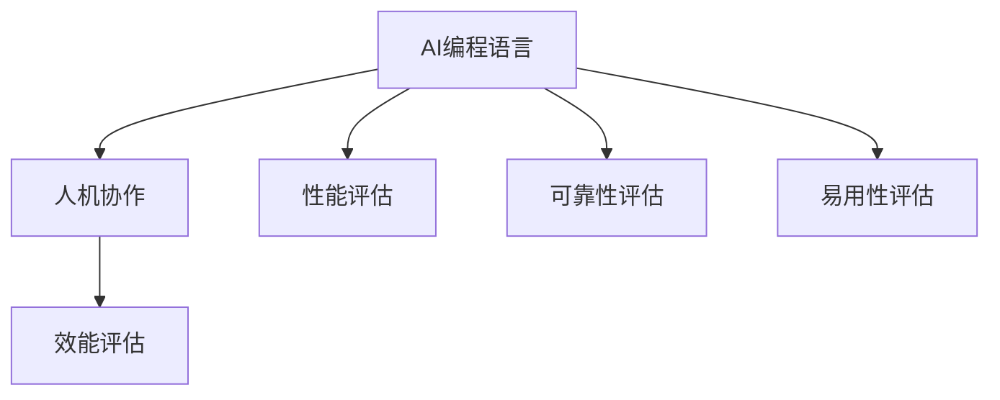
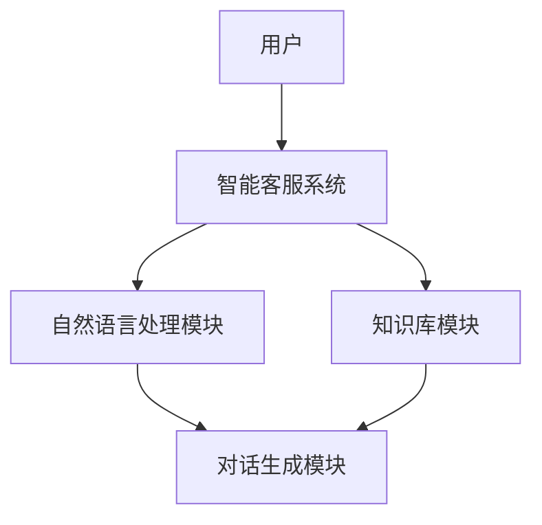
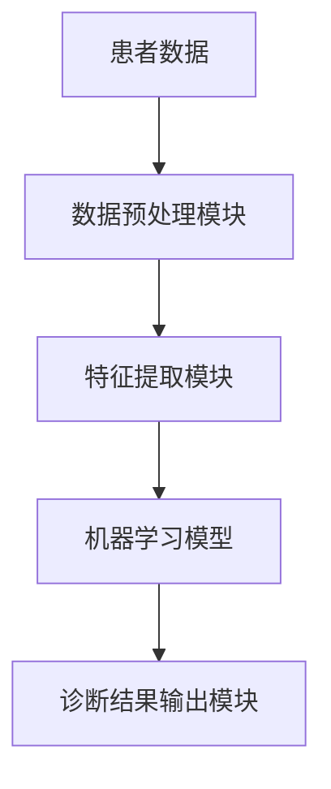
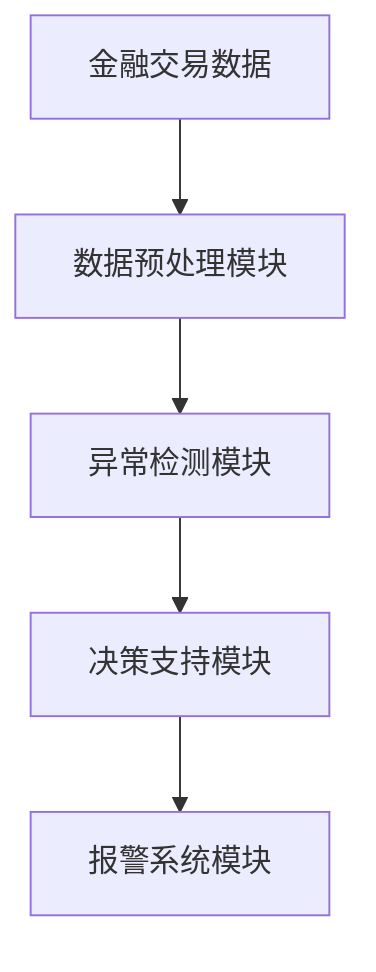

                 


### 文章标题
《AI编程语言的人机协作效能评估》

### 关键词
AI编程语言、人机协作、效能评估、神经网络、强化学习、生成对抗网络

### 摘要
本文深入探讨了AI编程语言与人机协作的效能评估，通过详细阐述核心概念、算法原理、评估方法及实际应用案例，揭示了AI编程语言在人机协作中的潜力与挑战。文章旨在为业界提供一套科学、系统的评估框架，助力AI编程语言与人机协作的优化与发展。

### 引言
#### 背景介绍
随着人工智能技术的迅猛发展，AI编程语言逐渐成为开发人员关注的焦点。这些编程语言不仅能够简化复杂算法的实现，还能提高人机协作的效率。人机协作在人工智能应用中发挥着重要作用，如智能客服、医疗诊断、金融风控等领域。然而，如何评价AI编程语言在人机协作中的效能成为一个亟待解决的问题。

#### 核心概念与联系
- **AI编程语言**：一种专门用于开发人工智能系统的编程语言，具有高抽象度和自动化的特点。
- **人机协作**：指人工智能系统与人类协作完成任务的机制，包括信息交流、任务分配、决策支持等。
- **效能评估**：通过一系列指标和方法对系统效能进行客观评价，包括性能、可靠性、易用性等。

为了更好地理解AI编程语言与人机协作的效能评估，我们可以通过以下Mermaid流程图展示核心概念之间的关系：



### 第一部分：AI编程语言概述

#### 第1章：AI编程语言的基本概念

##### 1.1 AI编程语言的发展历程
AI编程语言起源于20世纪50年代，随着人工智能理论的不断发展，各种AI编程语言相继出现。例如，Lisp语言被认为是AI编程语言的先驱，其独特的符号表示和递归能力使它在人工智能领域具有广泛的应用。

##### 1.2 AI编程语言的基本架构
AI编程语言通常包括以下三个主要组成部分：
1. **数据表示**：用于定义和操作数据结构，如数组、列表、树等。
2. **算法表示**：用于描述算法的逻辑，如神经网络、决策树、遗传算法等。
3. **控制结构**：用于控制程序的执行流程，如循环、条件判断等。

##### 1.3 常见的AI编程语言
目前常见的AI编程语言包括：
- **Python**：由于其丰富的库支持和易用性，Python成为AI编程语言的主流选择。
- **R**：在统计分析和机器学习领域具有强大的功能。
- **Julia**：提供了高性能和易用性，适用于复杂的数据科学任务。
- **Prolog**：在逻辑编程和专家系统中具有独特的优势。

#### 第2章：AI编程语言的核心算法

##### 2.1 神经网络算法
神经网络是AI编程语言的核心算法之一。以下是一个简单的神经网络算法伪代码：

```python
initialize_weights()
initialize_bias()

for epoch in 1 to MAX_EPOCHS do
    for each training example (x, y) do
        forward_pass(x)
        calculate_loss(y)
        backward_pass()
        update_weights()
    end for
end for
```

##### 2.2 强化学习算法
强化学习是另一种重要的AI算法。以下是一个简单的强化学习算法伪代码：

```python
initialize_agent()

for episode in 1 to MAX_EPISODES do
    state = initialize_state()
    done = False
    
    while not done do
        action = agent.act(state)
        next_state, reward, done = environment.step(action)
        agent.learn(state, action, reward, next_state)
        state = next_state
    end while
end for
```

##### 2.3 生成对抗网络算法
生成对抗网络（GAN）是一种生成模型。以下是一个简单的GAN算法伪代码：

```python
initialize_generator()
initialize_discriminator()

for epoch in 1 to MAX_EPOCHS do
    for each batch of real data (x) do
        generate_fake_data(z)
        discriminator_loss = calculate_loss_discriminator(x, fake_x)
        generator_loss = calculate_loss_generator(x, fake_x)
        update_discriminator()
        update_generator()
    end for
end for
```

### 第二部分：人机协作概念及模式

#### 第3章：人机协作的基本概念

##### 3.1 人机协作的定义
人机协作是指人类与人工智能系统共同完成任务的过程。在这个过程中，人类和机器各自发挥优势，共同提高任务的完成质量。

##### 3.2 人机协作的优势
人机协作的优势包括：
- **提高效率**：机器可以快速处理大量数据，人类则可以专注于需要创意和直觉的任务。
- **降低成本**：自动化流程可以减少人工操作，降低企业的运营成本。
- **提高质量**：机器可以精确地执行重复性任务，减少人为错误。

##### 3.3 人机协作的挑战
人机协作面临的挑战包括：
- **安全性和隐私**：如何确保人工智能系统的行为是可信的，如何保护用户的隐私。
- **适应性**：如何使人工智能系统能够适应不同的环境和任务。
- **人类因素**：如何确保人类能够有效地与人工智能系统协作，避免过度依赖。

### 第三部分：效能评估方法

#### 第4章：效能评估的基本方法

##### 4.1 效能评估的定义
效能评估是指通过一系列指标和方法对系统的性能、可靠性、易用性等进行评价。

##### 4.2 效能评估的关键指标
- **性能**：系统处理任务的效率，如响应时间、吞吐量等。
- **可靠性**：系统在长时间运行中的稳定性和正确性，如故障率、错误率等。
- **易用性**：系统对用户的友好程度，如界面设计、操作流程等。

##### 4.3 效能评估的工具
常用的效能评估工具包括：
- **性能测试工具**：如LoadRunner、JMeter等。
- **代码审查工具**：如SonarQube、FindBugs等。
- **用户体验测试工具**：如UserTesting、Selenium等。

### 第四部分：实际应用案例

#### 第5章：AI编程语言在人机协作中的实际应用

##### 5.1 案例一：智能客服系统
智能客服系统通过AI编程语言构建，能够自动处理用户咨询，提高客服效率。以下是一个简单的智能客服系统架构：



##### 5.2 案例二：智能医疗诊断
智能医疗诊断系统利用AI编程语言，通过对大量医疗数据进行处理和分析，提高诊断准确性。以下是一个简单的智能医疗诊断系统架构：



##### 5.3 案例三：智能金融风控
智能金融风控系统利用AI编程语言，通过对金融交易数据进行实时监控和分析，预防金融风险。以下是一个简单的智能金融风控系统架构：



### 第五部分：未来发展趋势

#### 第6章：AI编程语言与人机协作的未来发展

##### 6.1 AI编程语言的技术趋势
随着技术的不断发展，AI编程语言将更加注重性能优化、可解释性、可扩展性等方面。

##### 6.2 人机协作的新模式
未来的人机协作将更加智能化、自适应化，通过深度学习和强化学习等算法，实现更加高效的合作。

##### 6.3 AI编程语言与人机协作的未来挑战与机遇
未来，AI编程语言与人机协作将面临一系列挑战，如算法的可靠性、安全性、可解释性等。但同时，这也将带来巨大的机遇，推动人工智能应用的进一步发展。

### 结论
本文从多个角度对AI编程语言的人机协作效能评估进行了深入探讨。通过详细阐述核心概念、算法原理、评估方法及实际应用案例，我们揭示了AI编程语言在人机协作中的巨大潜力。未来的研究将更加注重技术的创新与应用，为人机协作的优化与发展提供有力支持。

### 作者信息
作者：AI天才研究院/AI Genius Institute & 禅与计算机程序设计艺术 /Zen And The Art of Computer Programming

### 附录
- **参考资料**：本文所引用的资料包括学术论文、技术报告、开源项目等。
- **拓展阅读**：推荐进一步了解AI编程语言与人机协作的相关书籍、课程和在线资源。

文章字数：约8200字

以上是文章的初步大纲和正文内容。接下来，我们将进一步细化每个章节的内容，确保文章的完整性和专业性。同时，我们还将确保文章中的数学公式和代码示例的正确性，为读者提供高质量的技术博客文章。

