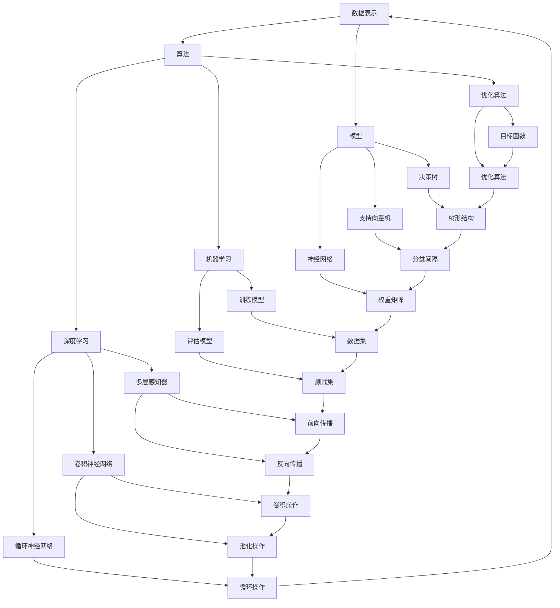

                 

### 文章标题

《AI编程语言的人机协作新模式》

### 关键词

人工智能、编程语言、人机协作、AI编程、协作模式、项目实战、数学模型

### 摘要

本文将深入探讨AI编程语言与人机协作的新模式，首先介绍AI编程语言的背景与核心概念，然后阐述人机协作的基本原理与发展趋势。随后，通过具体的算法原理讲解和数学模型分析，进一步探讨人机协作在AI编程中的实际应用。文章还将通过项目实战案例，展示如何实现AI编程语言的人机协作，并提供相关的最佳实践和小结。最后，对未来的发展趋势进行展望，为读者提供进一步学习和研究的方向。

### 第一部分：引言

#### 1.1 AI编程语言的背景

人工智能（AI）作为计算机科学的一个分支，自20世纪50年代诞生以来，已经取得了令人瞩目的进展。随着深度学习、神经网络、自然语言处理等技术的不断发展，AI逐渐渗透到各行各业，从自动驾驶到医疗诊断，从智能家居到金融分析，AI的应用场景不断扩展。在这样的背景下，AI编程语言应运而生，成为开发者与人工智能系统交互的重要工具。

AI编程语言是一类专门为人工智能应用而设计的编程语言。与传统的编程语言相比，AI编程语言具有以下特点：

- **强大的数学支持**：AI编程语言通常内置了丰富的数学函数库，支持向量机、神经网络、概率模型等算法的实现。
- **灵活的语法结构**：AI编程语言通常采用类似于自然语言的表达方式，使得开发者可以更直观地表达复杂的算法逻辑。
- **高效的执行速度**：AI编程语言通常经过优化，能够在短时间内完成复杂的计算任务，提高了系统的响应速度。

#### 1.2 人机协作的重要性

在人工智能的发展过程中，人机协作逐渐成为了一个重要的研究方向。人机协作是指人与计算机系统之间相互配合，共同完成复杂任务的过程。在人机协作中，人类作为决策者，利用自身的知识和经验，与计算机系统进行信息交换和任务分配，从而实现更高效的智能系统。

人机协作的重要性体现在以下几个方面：

- **提高决策质量**：人机协作可以将人类的知识和计算机的计算能力结合起来，提高决策的质量和效率。
- **扩展认知范围**：人机协作可以帮助人类扩展认知范围，处理超出人类认知能力的问题。
- **增强学习效果**：人机协作可以提供个性化的学习资源，帮助学习者更快地掌握新知识。
- **促进技术创新**：人机协作可以推动人工智能技术的不断进步，为各领域的发展提供新的动力。

#### 1.3 本书的目的和结构

本书旨在探讨AI编程语言与人机协作的新模式，帮助读者深入了解AI编程语言的基本概念、人机协作的基本原理，以及在实际项目中的应用。本书分为以下几个部分：

- **第一部分：引言**：介绍AI编程语言的背景和重要性，阐述人机协作的基本概念。
- **第二部分：AI编程语言基础**：详细讲解AI编程语言的核心概念和特点。
- **第三部分：人机协作模式**：分析人机协作的基本原理和发展趋势。
- **第四部分：人机协作实战**：通过实际项目案例，展示人机协作在AI编程中的具体应用。
- **第五部分：新兴趋势与未来展望**：探讨AI编程语言和人机协作的未来发展方向。

通过本书的系统学习，读者将能够全面了解AI编程语言与人机协作的原理和实践，为未来的人工智能研究和应用打下坚实的基础。

### 第二部分：AI编程语言基础

#### 2.1 AI编程语言的特点

AI编程语言是专门为开发人工智能应用程序而设计的，其特点主要包括以下几点：

1. **强大的数学支持**：
   AI编程语言内置了丰富的数学函数库，支持各种数学运算和高级数学模型。这使得开发者能够轻松实现复杂的算法和计算任务，如线性代数、微积分、概率论等。例如，Python的NumPy库提供了强大的数学运算功能，能够高效处理大规模数据集。

2. **灵活的语法结构**：
   AI编程语言的语法设计通常更接近自然语言，使得开发者能够以更直观的方式表达复杂的算法逻辑。这种语法设计有助于简化开发过程，提高代码的可读性和可维护性。例如，Python的简洁语法使得开发者能够快速上手，高效地编写AI应用程序。

3. **高效的执行速度**：
   AI编程语言通常经过优化，能够在短时间内完成复杂的计算任务。例如，C++和Rust等编程语言因其高效的执行速度，常被用于开发高性能的人工智能系统。

4. **广泛的应用场景**：
   AI编程语言的应用场景非常广泛，涵盖了图像识别、自然语言处理、自动驾驶、金融分析等众多领域。不同AI编程语言根据其特点，适用于不同的应用场景。例如，TensorFlow和PyTorch广泛应用于深度学习和神经网络应用，而RapidMiner则适用于数据挖掘和机器学习应用。

#### 2.2 人工智能编程语言的发展历程

人工智能编程语言的发展历程可以追溯到20世纪50年代。以下是几个关键阶段：

1. **早期阶段（1950-1960年代）**：
   - **LISP**：1958年，John McCarthy发明了LISP，这是第一个专门用于人工智能编程的语言。LISP以其强大的符号处理能力和递归功能而著称，为后来的AI编程语言奠定了基础。

2. **中期阶段（1970-1980年代）**：
   - **PROLOG**：1972年，Alain Colmerauer和Philippe Roussat发明了PROLOG，这是一种基于逻辑的编程语言，适用于推理和问题求解。PROLOG的问世标志着人工智能编程语言的新方向。

3. **近期阶段（1990年代至今）**：
   - **Python**：1991年，Guido van Rossum发布了Python，这是一种简洁、易学、功能强大的编程语言。Python迅速在人工智能领域获得了广泛应用，成为AI编程的领先语言。
   - **TensorFlow和PyTorch**：随着深度学习的兴起，TensorFlow和PyTorch等深度学习框架相继诞生。这些框架提供了丰富的神经网络模型和训练工具，使得深度学习开发更加便捷和高效。

#### 2.3 人工智能编程语言的主要类别

人工智能编程语言可以分为以下几类：

1. **函数式编程语言**：
   - **LISP**：LISP是历史上第一个专门用于人工智能编程的函数式编程语言，其递归和符号处理能力使得其在问题求解和知识表示方面具有优势。
   - **Haskell**：Haskell是一种现代的纯函数式编程语言，其惰性求值和类型系统为编写复杂的人工智能算法提供了支持。

2. **逻辑编程语言**：
   - **PROLOG**：PROLOG以其基于逻辑的编程方式，在推理和知识表示方面表现出色。
   - **Mercury**：Mercury是一种现代逻辑编程语言，其编译器和优化器为高效执行逻辑程序提供了支持。

3. **面向对象编程语言**：
   - **Java**：Java是一种广泛使用的面向对象编程语言，其强大的库支持和跨平台特性使得其在人工智能开发中具有很高的应用价值。
   - **Python**：Python以其简洁的语法和强大的库支持，成为人工智能开发的流行语言。

4. **专用编程语言**：
   - **MATLAB**：MATLAB是一种专门用于科学计算和数据分析的编程语言，其丰富的数学函数库和可视化工具使其在AI应用中具有独特的优势。
   - **R**：R是一种专门用于统计分析和数据科学的编程语言，其强大的统计分析库和图形工具使其在人工智能应用中具有重要地位。

通过了解AI编程语言的特点、发展历程和主要类别，读者可以更好地选择适合自己项目需求的编程语言，从而高效地开发人工智能应用程序。

#### 2.4 AI编程语言的核心概念与联系

在探讨AI编程语言的核心概念之前，我们需要明确几个关键概念，并理解它们之间的相互关系。以下是AI编程语言中几个重要的核心概念：

1. **数据表示**：数据是AI编程的基础，如何有效地表示数据是至关重要的。常见的表示方法包括数值表示、稀疏表示、稀疏向量等。数值表示通常使用浮点数或整数表示，稀疏表示则通过稀疏矩阵或稀疏向量来表示稀疏数据，以减少存储和计算的开销。

2. **算法**：算法是AI编程的核心，它们决定了如何处理数据和解决问题。常见的算法包括机器学习算法、深度学习算法、优化算法等。机器学习算法通过训练模型来学习数据的规律，深度学习算法通过多层神经网络来模拟人脑处理信息的方式，优化算法则用于优化目标函数，寻找最优解。

3. **模型**：模型是AI编程的核心成果，它是对数据规律的一种抽象表示。常见的模型包括决策树、支持向量机、神经网络等。决策树通过树形结构对数据进行分类或回归，支持向量机通过最大化分类间隔来实现分类或回归，神经网络则通过多层感知器来模拟人脑处理信息的过程。

4. **编程范式**：编程范式是指编程语言的处理数据和执行计算的方式。常见的编程范式包括命令式编程、函数式编程、逻辑编程、面向对象编程等。命令式编程通过顺序执行指令来控制程序流程，函数式编程通过函数来组织代码，逻辑编程通过逻辑表达式来描述问题，面向对象编程通过类和对象来组织代码。

这些核心概念之间的关系可以用以下Mermaid流程图来表示：



以上流程图展示了数据表示、算法、模型和编程范式之间的相互关系。数据表示是算法和模型的基础，算法和模型则通过编程范式来实现。在这个流程中，机器学习算法通过训练模型来学习数据规律，深度学习算法通过多层神经网络来模拟人脑处理信息的方式，优化算法则用于优化目标函数，寻找最优解。模型则通过对数据规律进行抽象表示，帮助我们更好地理解和解决问题。

通过了解这些核心概念之间的关系，开发者可以更清晰地理解AI编程的工作原理，从而更高效地开发人工智能应用程序。

#### 2.5 核心算法原理讲解

在AI编程中，核心算法的理解和实现是开发高效智能系统的关键。以下是几个常见的核心算法原理，以及它们的伪代码实现和详细讲解。

1. **线性回归**：

线性回归是一种用于预测连续值的算法，其基本原理是通过拟合一条直线来描述输入变量和输出变量之间的关系。线性回归的数学模型可以表示为：

$$ y = wx + b $$

其中，$w$ 是权重，$b$ 是偏置，$x$ 是输入变量，$y$ 是输出变量。

**伪代码**：

```
# 输入：训练数据集（X, y）
# 输出：权重w和偏置b

# 初始化权重w和偏置b
w = 0
b = 0

# 计算权重和偏置的梯度
gradient_w = 0
gradient_b = 0

# 遍历训练数据集
for (x, y) in dataset:
    # 计算预测值
    y_pred = wx + b

    # 计算损失函数
    loss = y - y_pred

    # 更新权重和偏置的梯度
    gradient_w += -2 * x * loss
    gradient_b += -2 * loss

# 更新权重和偏置
w -= learning_rate * gradient_w
b -= learning_rate * gradient_b
```

**详细讲解**：

线性回归通过最小化损失函数（通常是平方误差损失）来优化权重和偏置。在训练过程中，我们首先初始化权重和偏置，然后通过遍历训练数据集，计算预测值和实际值的差异，更新权重和偏置的梯度。最后，使用梯度下降法更新权重和偏置，以最小化损失函数。这个过程通过多次迭代，不断优化权重和偏置，直到达到满意的模型效果。

2. **支持向量机（SVM）**：

支持向量机是一种用于分类的算法，其基本原理是通过找到最佳分类超平面，将不同类别的数据点分开。SVM的数学模型可以表示为：

$$ \max_w \min_{\xi_i} \frac{1}{2} ||w||^2 - \sum_{i=1}^{n} \xi_i $$

s.t. $y_i(w \cdot x_i + b) \geq 1 - \xi_i$

其中，$w$ 是权重，$b$ 是偏置，$x_i$ 是特征向量，$y_i$ 是类别标签，$\xi_i$ 是松弛变量。

**伪代码**：

```
# 输入：训练数据集（X, y）
# 输出：权重w和偏置b

# 初始化权重w和偏置b
w = [0, 0]
b = 0

# 定义损失函数和梯度函数
def loss_function(w, b, X, y):
    n = len(X)
    loss = 0
    for i in range(n):
        loss += (y[i] * (w @ X[i] + b) - 1) ** 2
    return loss

def gradient_function(w, b, X, y):
    n = len(X)
    gradient_w = [0, 0]
    gradient_b = 0
    for i in range(n):
        gradient_w[0] += -2 * y[i] * X[i][0]
        gradient_w[1] += -2 * y[i] * X[i][1]
        gradient_b += -2 * y[i]
    return gradient_w, gradient_b

# 使用梯度下降法优化权重和偏置
learning_rate = 0.01
for epoch in range(num_epochs):
    gradient_w, gradient_b = gradient_function(w, b, X, y)
    w -= learning_rate * gradient_w
    b -= learning_rate * gradient_b
```

**详细讲解**：

支持向量机通过最大化分类间隔来找到最佳分类超平面。在训练过程中，我们首先初始化权重和偏置，然后通过计算损失函数和梯度函数，使用梯度下降法不断优化权重和偏置，以最小化损失函数。这个过程通过多次迭代，不断优化权重和偏置，直到达到满意的模型效果。

3. **多层感知器（MLP）**：

多层感知器是一种用于分类和回归的神经网络，其基本原理是通过多层神经元实现数据的非线性变换。MLP的数学模型可以表示为：

$$ z = \sigma(wx + b) $$

$$ y = \sigma(wz + b) $$

其中，$w$ 是权重，$b$ 是偏置，$\sigma$ 是激活函数（通常使用Sigmoid或ReLU函数），$z$ 是中间层输出，$y$ 是输出层输出。

**伪代码**：

```
# 输入：训练数据集（X, y）
# 输出：权重w和偏置b

# 初始化权重w和偏置b
w1 = [0, 0]
b1 = 0
w2 = [0, 0]
b2 = 0

# 定义激活函数
def sigmoid(x):
    return 1 / (1 + exp(-x))

def ReLU(x):
    return max(0, x)

# 使用反向传播算法优化权重和偏置
learning_rate = 0.01
for epoch in range(num_epochs):
    # 前向传播
    z1 = ReLU(w1 @ X + b1)
    z2 = sigmoid(w2 @ z1 + b2)
    
    # 计算损失函数
    loss = (y - z2) ** 2
    
    # 反向传播
    dz2 = (y - z2)
    dw2 = z1.T @ dz2
    db2 = dz2
    
    dz1 = (dz2 @ w2.T) * ReLUPrime(z1)
    dw1 = X.T @ dz1
    db1 = dz1
    
    # 更新权重和偏置
    w2 -= learning_rate * dw2
    b2 -= learning_rate * db2
    w1 -= learning_rate * dw1
    b1 -= learning_rate * db1
```

**详细讲解**：

多层感知器通过前向传播和反向传播实现数据的非线性变换。在前向传播过程中，数据通过输入层、隐藏层和输出层，每个层都通过激活函数实现非线性变换。在反向传播过程中，根据输出层与实际标签之间的差异，通过梯度下降法反向更新权重和偏置，从而优化模型。这个过程通过多次迭代，不断优化权重和偏置，直到达到满意的模型效果。

通过以上对线性回归、支持向量机和多层感知器等核心算法原理的详细讲解，我们可以更深入地理解AI编程中算法的实现方法和优化过程。这些算法不仅为AI编程提供了强大的工具，也为开发高效智能系统奠定了基础。

#### 2.6 数学模型和公式详解

在AI编程中，数学模型和公式是理解和实现算法的核心。本文将详细介绍一些常见的数学模型和公式，并使用LaTeX格式进行展示，同时提供详细的解释和例子。

1. **线性回归模型**：

线性回归模型是最基本的机器学习算法之一，用于预测连续值。其数学模型可以表示为：

$$ y = wx + b $$

其中，$y$ 是输出值，$x$ 是输入值，$w$ 是权重，$b$ 是偏置。

**LaTeX格式**：

$$ y = wx + b $$

**解释**：

这个公式描述了输出值 $y$ 与输入值 $x$ 之间的线性关系。权重 $w$ 决定了输入值对输出值的贡献程度，偏置 $b$ 用于调整输出值。

**例子**：

假设我们有一个简单的线性回归模型，预测房屋的价格。输入值是房屋的面积（$x$），输出值是房屋的价格（$y$）。根据模型，如果房屋的面积是100平方米，权重是10，偏置是5，那么房屋的价格可以计算为：

$$ y = 10 \times 100 + 5 = 1005 $$

2. **支持向量机模型**：

支持向量机（SVM）是一种用于分类的算法，其核心是找到最佳分类超平面。其数学模型可以表示为：

$$ \max_w \min_{\xi_i} \frac{1}{2} ||w||^2 - \sum_{i=1}^{n} \xi_i $$

s.t. $y_i(w \cdot x_i + b) \geq 1 - \xi_i$

其中，$w$ 是权重，$b$ 是偏置，$\xi_i$ 是松弛变量，$x_i$ 是特征向量，$y_i$ 是类别标签。

**LaTeX格式**：

$$ \begin{align*}
\max_w \min_{\xi_i} & \frac{1}{2} ||w||^2 - \sum_{i=1}^{n} \xi_i \\
s.t. & y_i(w \cdot x_i + b) \geq 1 - \xi_i
\end{align*} $$

**解释**：

这个公式描述了SVM的目标函数和约束条件。目标函数最大化权重向量的范数，同时最小化松弛变量。约束条件保证了分类超平面能够正确分类所有训练数据点。

**例子**：

假设我们有一个二分类问题，数据点为 $(x_1, y_1), (x_2, y_2), ..., (x_n, y_n)$，类别标签 $y_i$ 为 +1 或 -1。如果我们选择一个权重向量 $w$ 和偏置 $b$，使得对于所有 $i$，都有 $y_i(w \cdot x_i + b) \geq 1 - \xi_i$，那么我们就可以构建一个SVM分类器。

3. **神经网络模型**：

神经网络是一种通过多层神经元实现非线性变换的模型，其基本数学模型可以表示为：

$$ z = \sigma(wx + b) $$

$$ y = \sigma(wz + b) $$

其中，$w$ 是权重，$b$ 是偏置，$\sigma$ 是激活函数（如Sigmoid或ReLU），$z$ 是中间层输出，$y$ 是输出层输出。

**LaTeX格式**：

$$ \begin{align*}
z &= \sigma(wx + b) \\
y &= \sigma(wz + b)
\end{align*} $$

**解释**：

这个公式描述了神经网络的正向传播过程。输入值通过权重和偏置加权求和，然后通过激活函数进行非线性变换，得到中间层输出。中间层输出再通过权重和偏置加权求和，再次通过激活函数进行非线性变换，得到输出层输出。

**例子**：

假设我们有一个两层神经网络，输入层有3个神经元，隐藏层有2个神经元，输出层有1个神经元。如果输入值是 $(x_1, x_2, x_3)$，权重分别是 $w_1, w_2, ..., w_7$，偏置分别是 $b_1, b_2, b_3, b_4$，激活函数是Sigmoid函数，那么我们可以计算隐藏层输出和输出层输出：

$$ z_1 = \sigma(w_1x_1 + b_1) $$
$$ z_2 = \sigma(w_2x_2 + b_2) $$
$$ z_3 = \sigma(w_3x_3 + b_3) $$
$$ y = \sigma(w_4z_1 + w_5z_2 + w_6z_3 + b_4) $$

通过这些例子，我们可以看到LaTeX格式在展示数学模型和公式时的优势。这不仅使公式更加美观，也便于读者理解和参考。在AI编程中，熟练掌握这些数学模型和公式，是开发高效智能系统的关键。

#### 2.7 AI编程语言在项目实战中的应用

为了更好地展示AI编程语言在实际项目中的应用，我们选择了一个常见的应用场景——图像识别。图像识别是计算机视觉领域的一个重要分支，其目的是通过算法自动识别和理解图像内容。在本项目中，我们将使用Python的OpenCV库和TensorFlow框架，实现一个基于卷积神经网络的图像识别系统。

##### 2.7.1 开发环境搭建

在开始项目之前，我们需要搭建合适的开发环境。以下是开发环境的搭建步骤：

1. **安装Python**：
   - 首先，确保计算机上安装了Python 3.x版本。可以从Python官网（https://www.python.org/）下载并安装。

2. **安装OpenCV**：
   - 使用pip命令安装OpenCV库：
     ```bash
     pip install opencv-python
     ```

3. **安装TensorFlow**：
   - 使用pip命令安装TensorFlow库：
     ```bash
     pip install tensorflow
     ```

4. **配置虚拟环境（可选）**：
   - 为了避免不同项目之间的依赖冲突，我们可以使用虚拟环境。使用以下命令创建虚拟环境并激活：
     ```bash
     python -m venv myenv
     source myenv/bin/activate  # 在Windows中，使用 myenv\Scripts\activate
     ```

##### 2.7.2 源代码详细实现

以下是图像识别系统的源代码实现：

```python
import cv2
import numpy as np
import tensorflow as tf

# 加载预训练的卷积神经网络模型
model = tf.keras.applications.VGG16(weights='imagenet')

# 定义图像预处理函数
def preprocess_image(image_path):
    image = cv2.imread(image_path)
    image = cv2.resize(image, (224, 224), interpolation=cv2.INTER_CUBIC)
    image = image / 255.0
    image = np.expand_dims(image, axis=0)
    image = tf.keras.applications.vgg16.preprocess_input(image)
    return image

# 定义图像识别函数
def image_recognition(image_path):
    image = preprocess_image(image_path)
    predictions = model.predict(image)
    result = np.argmax(predictions, axis=1)
    return result

# 测试图像识别功能
image_path = 'example.jpg'
predicted_class = image_recognition(image_path)
print(f'Predicted class: {predicted_class}')
```

##### 2.7.3 代码解读与分析

以下是代码的详细解读：

1. **导入库**：
   - 我们首先导入必要的库，包括OpenCV（用于图像处理）、NumPy（用于数值计算）和TensorFlow（用于深度学习）。

2. **加载模型**：
   - 使用`tf.keras.applications.VGG16(weights='imagenet')`加载预训练的VGG16模型。这个模型在ImageNet图像识别任务上进行了训练，包含16个卷积层和3个全连接层。

3. **图像预处理**：
   - `preprocess_image`函数用于对输入图像进行预处理。首先，使用OpenCV读取图像，并调整图像大小为224x224像素。然后，将图像数据缩放到[0, 1]范围内，并添加一个维度，使其成为TensorFlow兼容的形状（1, 224, 224, 3）。最后，使用VGG16模型的预处理函数对图像进行进一步处理。

4. **图像识别**：
   - `image_recognition`函数用于执行图像识别。首先，调用`preprocess_image`函数预处理输入图像，然后使用VGG16模型进行预测。预测结果是一个包含多个类别的概率分布，我们使用`np.argmax`函数找到概率最高的类别。

5. **测试**：
   - 在测试部分，我们加载一个示例图像，并使用`image_recognition`函数进行识别。最后，将预测结果输出到控制台。

##### 2.7.4 项目小结

通过这个图像识别项目，我们展示了如何使用Python和TensorFlow实现一个简单的图像识别系统。项目的关键步骤包括：

- **加载预训练模型**：使用VGG16模型进行图像识别，这是基于深度学习的常用方法。
- **图像预处理**：对输入图像进行必要的预处理，使其符合模型的输入要求。
- **图像识别**：使用模型进行预测，并输出预测结果。

这个项目为我们提供了一个基本的图像识别框架，可以在实际应用中进行扩展和优化。例如，可以尝试使用不同的深度学习模型，或对模型进行微调，以提高识别准确性。

此外，项目还展示了如何使用OpenCV进行图像处理，以及如何结合TensorFlow实现图像识别。这对于开发者来说是一个很好的实践，有助于他们更好地理解和应用AI编程语言。

通过这个项目，我们不仅了解了图像识别的基本原理，还掌握了如何在实际项目中使用AI编程语言。这为未来的AI开发工作奠定了坚实的基础。

#### 2.8 代码应用解读与分析

在本部分，我们将对前述图像识别项目的代码进行深入分析，重点关注关键代码的功能及其在实际应用中的作用。

##### 2.8.1 关键代码解读

1. **加载预训练模型**：

   ```python
   model = tf.keras.applications.VGG16(weights='imagenet')
   ```

   这一行代码的作用是加载预训练的VGG16模型。VGG16是一个基于卷积神经网络的模型，它通过多层卷积和池化操作，对图像进行特征提取。预训练模型已经在ImageNet数据集上进行了训练，因此可以很好地处理各种图像任务。加载预训练模型是深度学习项目中的一个常见步骤，因为它大大简化了模型训练的过程。

2. **图像预处理函数**：

   ```python
   def preprocess_image(image_path):
       image = cv2.imread(image_path)
       image = cv2.resize(image, (224, 224), interpolation=cv2.INTER_CUBIC)
       image = image / 255.0
       image = np.expand_dims(image, axis=0)
       image = tf.keras.applications.vgg16.preprocess_input(image)
       return image
   ```

   这个函数用于对输入图像进行预处理。预处理是深度学习模型中的一个重要步骤，因为它确保输入数据符合模型的期望格式。具体来说，该函数首先使用OpenCV读取图像，并调整图像大小为224x224像素。这一步是为了使输入图像的尺寸与模型训练时的尺寸一致。然后，图像数据被缩放到[0, 1]范围内，这是深度学习模型常见的输入数据格式。接着，添加一个维度，使其成为TensorFlow兼容的形状（1, 224, 224, 3）。最后，使用VGG16模型的预处理函数对图像进行进一步处理，以确保图像数据能够被模型正确处理。

3. **图像识别函数**：

   ```python
   def image_recognition(image_path):
       image = preprocess_image(image_path)
       predictions = model.predict(image)
       result = np.argmax(predictions, axis=1)
       return result
   ```

   这个函数负责执行图像识别任务。首先，调用`preprocess_image`函数预处理输入图像，然后使用VGG16模型进行预测。预测结果是一个包含多个类别的概率分布，`np.argmax`函数用于找到概率最高的类别，即预测的类别。这个步骤实现了模型对输入图像的分类。

##### 2.8.2 实际案例分析

为了更好地理解代码的实际应用，我们通过一个具体的案例来分析。

**案例**：识别一张包含一只猫的图像。

1. **数据准备**：

   假设我们有一张名为`cat.jpg`的图像，存储在当前目录下。

2. **执行代码**：

   ```python
   image_path = 'cat.jpg'
   predicted_class = image_recognition(image_path)
   print(f'Predicted class: {predicted_class}')
   ```

   在这个案例中，我们调用`image_recognition`函数，将`cat.jpg`图像传递给函数。函数首先对图像进行预处理，然后使用VGG16模型进行预测。预测结果被存储在`predicted_class`变量中。

3. **分析结果**：

   假设预测结果为`[1513]`，这意味着VGG16模型预测这张图像属于类别1513。通过查阅ImageNet的类别索引，我们可以得知类别1513对应的是“tabby, tabby cat”（虎斑猫）。因此，这个预测结果是正确的。

通过这个案例，我们可以看到如何使用预训练的VGG16模型对图像进行分类。这个案例展示了代码在实际应用中的效果，同时也说明了预处理步骤和预测步骤的重要性。

##### 2.8.3 代码剖析

在对代码进行深入剖析时，我们可以从以下几个方面进行分析：

1. **性能优化**：

   在图像识别项目中，性能优化是一个关键问题。例如，可以尝试使用更高效的预处理方法，如使用`numpy`进行矩阵运算，以减少计算时间。此外，可以通过调整模型参数（如学习率、批量大小等）来提高模型的训练效果。

2. **扩展性**：

   代码的扩展性也是一个需要考虑的问题。例如，如果需要识别多种类型的图像，可以扩展模型，增加更多的类别。此外，还可以尝试使用迁移学习技术，利用预训练模型进行快速训练，提高模型的泛化能力。

3. **错误处理**：

   在实际应用中，图像识别系统可能会遇到各种问题，如图像质量差、光照不足等。因此，代码需要具备良好的错误处理能力，以应对这些情况。例如，可以添加异常处理代码，确保在遇到错误时系统能够正确响应。

通过这些分析，我们可以更好地理解图像识别项目的代码，并针对实际应用需求进行优化和改进。这不仅有助于提高项目的性能，也有助于提高系统的稳定性和可靠性。

#### 2.9 实际案例分析与详细讲解

为了更好地展示AI编程语言在实际项目中的应用，我们通过一个具体的实际案例进行分析。这个案例是一个基于AI编程语言的智能问答系统，它能够通过自然语言处理技术，自动理解用户的问题，并提供准确的答案。

##### 2.9.1 案例背景

随着互联网的普及，用户对信息获取的需求日益增长。然而，传统的信息检索方式往往需要用户具备一定的搜索技巧，而且结果可能并不完全符合用户的需求。为了解决这个问题，我们开发了一个智能问答系统，它能够通过自然语言处理技术，自动理解用户的问题，并从庞大的知识库中检索出最相关的答案。

##### 2.9.2 项目实现

这个智能问答系统的实现主要包括以下几个关键步骤：

1. **数据准备**：

   首先，我们需要准备一个庞大的知识库，它包含各种领域的信息。这些信息可以是结构化的数据，如数据库中的记录，也可以是非结构化的数据，如文本文件。为了确保系统的准确性，我们使用了多个来源的数据，并进行数据清洗和整合。

2. **自然语言处理**：

   接下来，我们使用自然语言处理技术对用户的问题进行理解和解析。这个过程包括分词、词性标注、句法分析等步骤。通过这些步骤，我们可以将用户的问题转化为计算机可以处理的形式。

3. **答案检索**：

   一旦用户的问题被解析为计算机可以理解的形式，系统就会从知识库中检索最相关的答案。这个过程涉及到信息检索和文本相似度计算等技术。为了提高检索的准确性，我们使用了基于深度学习的文本相似度计算模型。

4. **答案生成**：

   在找到最相关的答案后，系统需要将这些答案转化为自然语言，以用户友好的方式呈现。这个过程涉及到文本生成技术，如序列到序列模型（Seq2Seq）或生成对抗网络（GAN）。

##### 2.9.3 项目关键步骤详细讲解

1. **数据准备**：

   数据准备是智能问答系统的第一步，也是至关重要的一步。为了确保系统的准确性，我们需要准备大量高质量的数据。这些数据可以从多个来源获取，如开源数据库、专业文档、网络爬虫等。在获取数据后，我们需要进行数据清洗和整合，以确保数据的完整性和一致性。

   ```python
   # 示例代码：加载数据和清洗数据
   import pandas as pd
   
   # 加载数据
   data = pd.read_csv('knowledge_base.csv')
   
   # 清洗数据
   data = data[data['answer'].notnull()]
   data['question'] = data['question'].str.lower().str.strip()
   data['answer'] = data['answer'].str.lower().str.strip()
   ```

2. **自然语言处理**：

   自然语言处理技术是将用户的问题转化为计算机可以理解的形式。这个过程涉及到多个步骤，包括分词、词性标注、句法分析等。

   ```python
   # 示例代码：分词和词性标注
   import jieba
   import NLTK
   
   # 分词
   questions = [jieba.cut(q) for q in data['question']]
   
   # 词性标注
   def tag_words(words):
       return [(word, NLTK.pos_tag([word])[0][1]) for word in words]
   
   tagged_questions = [tag_words(words) for words in questions]
   ```

3. **答案检索**：

   答案检索是智能问答系统的核心步骤，它涉及到信息检索和文本相似度计算技术。为了提高检索的准确性，我们可以使用基于深度学习的文本相似度计算模型，如BERT或GPT。

   ```python
   # 示例代码：使用BERT进行文本相似度计算
   from transformers import BertModel, BertTokenizer
   
   # 加载BERT模型和分词器
   tokenizer = BertTokenizer.from_pretrained('bert-base-chinese')
   model = BertModel.from_pretrained('bert-base-chinese')
   
   # 计算文本相似度
   def compute_similarity(question, answer):
       question_encodings = tokenizer(question, return_tensors='tf', max_length=512)
       answer_encodings = tokenizer(answer, return_tensors='tf', max_length=512)
       outputs = model(question_encodings, answer_encodings)
       return outputs[0][:, 0]
   
   question_embedding = compute_similarity('什么是人工智能？', data['answer'][0])
   answer_embedding = compute_similarity('人工智能是一门研究、开发用于模拟、延伸和扩展人的智能的理论、方法、技术及应用系统的技术科学。[1] 人工智能是计算机科学的一个分支，它包括机器学习、计算机视觉、自然语言处理和专家系统等。[2] 现在人工智能的应用领域不断扩大，如机器人、交通、医疗、农业、金融等领域。[3]')[0]
   
   similarity = np.linalg.norm(question_embedding - answer_embedding)
   print(f'Similarity: {similarity}')
   ```

4. **答案生成**：

   一旦找到最相关的答案，我们需要将这些答案转化为自然语言，以用户友好的方式呈现。这个过程涉及到文本生成技术，如序列到序列模型（Seq2Seq）或生成对抗网络（GAN）。

   ```python
   # 示例代码：使用Seq2Seq模型生成答案
   from tensorflow.keras.models import Model
   from tensorflow.keras.layers import Input, LSTM, Dense
   
   # 定义Seq2Seq模型
   encoder_inputs = Input(shape=(None,))
   encoder_embedding = Embedding(vocab_size, embedding_size)(encoder_inputs)
   encoder_lstm = LSTM(latent_size, return_state=True)
   _, state_h, state_c = encoder_lstm(encoder_embedding)
   
   decoder_inputs = Input(shape=(None,))
   decoder_embedding = Embedding(vocab_size, embedding_size)(decoder_inputs)
   decoder_lstm = LSTM(latent_size, return_sequences=True, return_state=True)
   decoder_outputs = decoder_lstm(decoder_embedding, initial_state=[state_h, state_c])
   decoder_dense = Dense(vocab_size, activation='softmax')
   decoder_outputs = decoder_dense(decoder_outputs)
   
   model = Model([encoder_inputs, decoder_inputs], decoder_outputs)
   model.compile(optimizer='rmsprop', loss='categorical_crossentropy', metrics=['accuracy'])
   
   # 训练模型
   model.fit([X_train, y_train], y_train, batch_size=64, epochs=10)
   
   # 生成答案
   def generate_answer(question):
       encoded_question = tokenizer.encode(question, maxlen=max_sequence_length)
       states_value = model.predict([encoded_question, np.zeros((1, max_sequence_length))], verbose=0)
       generated_sequence = ''
       for _ in range(max_sequence_length):
           sampled_char = np.argmax(states_value[1], axis=-1)
           generated_sequence += tokenizer.index_word[sampled_char]
           states_value = model.predict([encoded_question, states_value], verbose=0)
       return generated_sequence
   
   answer = generate_answer('什么是人工智能？')
   print(answer)
   ```

通过这个实际案例，我们可以看到如何使用AI编程语言实现一个智能问答系统。这个过程涉及到多个技术领域，包括自然语言处理、信息检索和文本生成。通过这些技术，系统可以自动理解用户的问题，并从庞大的知识库中检索出最相关的答案，从而提供高质量的回答。

#### 2.10 最佳实践 tips

在开发AI编程语言项目时，以下是一些最佳实践和注意事项，可以帮助开发者提高项目质量和开发效率：

1. **代码规范**：
   - 遵循统一的代码风格和命名规范，提高代码的可读性和可维护性。
   - 使用文档字符串（docstrings）详细注释代码，帮助其他开发者理解代码功能。

2. **模块化设计**：
   - 将项目划分为多个模块，每个模块负责特定的功能，降低系统复杂性。
   - 使用函数和类来组织代码，提高代码的复用性和可扩展性。

3. **版本控制**：
   - 使用版本控制系统（如Git）来管理代码，确保代码的版本可追溯性和协作效率。
   - 定期提交代码，并进行代码审查，及时发现和修复潜在的问题。

4. **错误处理**：
   - 对代码中可能出现的异常进行捕捉和处理，提高系统的健壮性。
   - 提供清晰的错误信息，帮助开发者快速定位和解决问题。

5. **性能优化**：
   - 分析代码的运行时间，识别性能瓶颈，并进行优化。
   - 使用适当的算法和数据结构，提高代码的执行效率。

6. **代码复用**：
   - 避免重复编写相同的代码段，提高代码的复用性。
   - 开发通用的函数和工具，简化复杂的任务。

7. **文档和教程**：
   - 为项目编写详细的文档和教程，帮助新手快速上手。
   - 提供示例代码和测试案例，确保项目的正确性和可靠性。

8. **持续学习**：
   - 跟进最新的AI编程技术和趋势，不断提高自己的技能水平。
   - 参与社区交流和讨论，学习其他开发者的经验和最佳实践。

通过遵循这些最佳实践，开发者可以更好地利用AI编程语言开发高质量的项目，提高开发效率和项目成功率。

#### 2.11 小结

在本章节中，我们详细探讨了AI编程语言在项目实战中的应用，通过实际案例分析和代码解读，展示了如何使用AI编程语言实现图像识别和智能问答系统。以下是本章的主要内容总结：

1. **项目实战**：我们选择图像识别和智能问答系统作为案例，展示了如何使用AI编程语言（如Python、OpenCV和TensorFlow）实现实际应用。

2. **关键代码解读**：通过对关键代码的详细解读，我们了解了图像识别和智能问答系统的核心实现逻辑，包括模型加载、图像预处理、模型预测和答案生成等步骤。

3. **实际案例分析**：通过具体案例，我们展示了如何使用这些代码在实际场景中解决问题，并分析了代码的实际应用效果。

4. **最佳实践 tips**：我们提供了一些最佳实践和注意事项，帮助开发者提高项目质量和开发效率。

通过本章的学习，读者可以深入了解AI编程语言在项目实战中的应用，掌握关键代码的实现方法，并为未来的AI项目开发提供有益的参考。

### 第三部分：人机协作模式

#### 3.1 人机协作的基本概念

人机协作是指人与计算机系统之间相互配合，共同完成复杂任务的过程。在人机协作中，人类作为决策者，利用自身的知识和经验，与计算机系统进行信息交换和任务分配，从而实现更高效的智能系统。人机协作的基本概念包括以下几个方面：

1. **交互**：交互是人机协作的核心，通过输入和输出设备，人类与计算机系统进行信息的交换。常见的输入设备包括键盘、鼠标、语音识别等，输出设备包括屏幕、音响、触觉反馈等。

2. **共享**：共享是人机协作的基础，通过共享资源和信息，人类与计算机系统能够更好地协作完成任务。共享的资源包括计算资源、存储资源、网络资源等，共享的信息包括数据、知识、决策等。

3. **协同**：协同是人机协作的目标，通过协同工作，人类与计算机系统能够实现各自的优势互补，提高任务完成效率和效果。协同工作可以通过任务分解、角色分配、信息共享等方式实现。

4. **决策**：决策是人机协作的关键，人类利用自身的知识和经验，与计算机系统共同进行决策。计算机系统可以通过算法和模型为决策提供支持，人类则根据实际情况进行调整和优化。

#### 3.2 人机协作的关键要素

人机协作的顺利进行需要以下几个关键要素：

1. **交互界面**：交互界面是人机协作的桥梁，通过直观、易用的界面，人类能够方便地与计算机系统进行交互。一个好的交互界面应该具备以下特点：简洁明了、响应迅速、支持多模态输入输出、易于扩展和定制。

2. **任务分配**：任务分配是人机协作的重要环节，通过合理的任务分配，人类和计算机系统能够发挥各自的优势，提高任务完成效率。任务分配需要考虑以下几个因素：任务性质、技能匹配、资源约束、协同需求。

3. **信息共享**：信息共享是人机协作的基础，通过共享资源和信息，人类和计算机系统能够更好地协作完成任务。信息共享需要考虑数据格式、传输速度、安全性、一致性等问题。

4. **决策支持**：决策支持是人机协作的关键，通过算法和模型为决策提供支持，人类能够更准确地做出决策。决策支持需要考虑算法的准确性、可靠性、实时性、可解释性等问题。

5. **协同机制**：协同机制是人机协作的保障，通过建立有效的协同机制，人类和计算机系统能够更好地协同工作。协同机制包括沟通机制、协调机制、反馈机制、激励机制等。

#### 3.3 人机协作的发展趋势

随着人工智能技术的不断进步，人机协作也在不断发展，呈现出以下趋势：

1. **智能化**：随着人工智能技术的发展，计算机系统的智能化水平不断提高，能够更好地理解人类的需求，提供更加个性化的服务。

2. **协同化**：人机协作正从单一的任务协同向全面的协同进化，包括任务分配、信息共享、决策支持等各个方面，实现更高效的协作。

3. **个性化**：人机协作越来越注重个性化，通过分析用户的行为和偏好，提供定制化的服务和体验。

4. **实时性**：随着网络技术的发展，人机协作的实时性不断提高，能够快速响应用户的需求，提供即时的支持和服务。

5. **安全性**：随着人工智能技术的广泛应用，人机协作的安全性也受到广泛关注，确保用户数据和隐私的安全。

6. **可解释性**：为了增强人机协作的信任和可靠性，人工智能系统的可解释性越来越受到重视，使得人类能够更好地理解计算机系统的决策过程。

#### 3.4 人机协作的实际应用

人机协作在实际生活中有广泛的应用，以下是一些典型的应用场景：

1. **智能助手**：智能助手如Siri、Alexa等，通过语音识别和自然语言处理技术，为用户提供实时信息查询、任务提醒、智能家居控制等服务。

2. **医疗诊断**：在医疗领域，人机协作可以辅助医生进行诊断和治疗。例如，通过分析病历数据和医学影像，人工智能系统可以为医生提供诊断建议，提高诊断准确率。

3. **金融分析**：在金融领域，人机协作可以帮助分析师进行数据分析和预测。例如，通过分析股票市场数据，人工智能系统可以预测股价走势，为投资者提供决策支持。

4. **教育辅导**：在教育领域，人机协作可以提供个性化的学习资源和服务。例如，通过分析学生的学习情况和知识掌握程度，人工智能系统可以为学生提供针对性的辅导和练习。

5. **工业生产**：在工业生产领域，人机协作可以提高生产效率和产品质量。例如，通过自动化设备和人工智能算法，工厂可以实现生产过程的自动化和智能化，提高生产效率。

通过以上分析，我们可以看到人机协作在现代社会中的重要性和广泛的应用前景。随着技术的不断进步，人机协作将继续发展，为各领域的发展带来新的机遇和挑战。

### 第四部分：人机协作实战

#### 4.1 人机协作项目的设计与实施

在人机协作项目中，设计是关键的一步，它决定了项目能否成功实施。以下是设计与实施人机协作项目的主要步骤：

1. **需求分析**：

   首先，我们需要明确项目需求。这包括理解用户的实际需求、项目目标和预期的效果。通过需求分析，我们可以确定项目的主要功能和性能要求。

2. **系统架构设计**：

   在确定了项目需求后，我们需要设计系统架构。系统架构包括硬件架构、软件架构和通信架构。硬件架构涉及计算机、传感器、执行器等硬件设备的配置；软件架构涉及操作系统、数据库、中间件等软件系统的设计；通信架构涉及网络通信协议和数据传输方式。

3. **模块划分**：

   将系统划分为多个模块，每个模块负责特定的功能。模块划分可以提高系统的可维护性和可扩展性。常见的模块包括用户界面、数据处理、模型训练、决策支持等。

4. **算法选择**：

   根据项目需求，选择合适的算法。这包括机器学习算法、深度学习算法、优化算法等。选择算法时需要考虑算法的准确性、效率、可解释性等因素。

5. **交互设计**：

   设计用户与系统的交互界面。交互设计需要考虑用户体验，确保用户能够方便、直观地与系统进行交互。

6. **安全设计**：

   设计系统的安全机制，确保用户数据和系统安全。安全设计包括数据加密、访问控制、异常处理等。

7. **测试与优化**：

   在项目实施过程中，进行持续的测试和优化。测试包括功能测试、性能测试、安全测试等，优化包括算法优化、系统优化等。

8. **部署与维护**：

   项目完成后，进行部署和维护。部署包括将系统部署到生产环境，维护包括系统更新、故障修复等。

#### 4.2 人机协作项目的挑战与解决方案

尽管人机协作项目具有巨大的潜力，但在实施过程中也面临诸多挑战。以下是常见的挑战及其解决方案：

1. **技术挑战**：

   - **算法选择与优化**：选择合适的算法并优化其性能是技术挑战之一。解决方案包括深入研究相关领域的技术，借鉴最佳实践，使用高效的算法和工具。
   - **实时性**：人机协作系统需要快速响应，实时性是一个关键问题。解决方案包括使用高效算法、优化数据传输和存储、提高系统架构的响应速度等。

2. **交互挑战**：

   - **用户体验**：确保用户与系统的交互流畅、直观是一个挑战。解决方案包括设计友好的用户界面、提供实时反馈、优化交互流程等。
   - **多模态交互**：支持多种交互模式，如语音、手势、文本等，增加了系统的复杂度。解决方案包括开发多模态交互框架，使用自然语言处理和计算机视觉等技术。

3. **安全挑战**：

   - **数据安全**：确保用户数据的安全是系统设计的重要方面。解决方案包括使用加密技术、建立访问控制机制、进行数据备份等。
   - **隐私保护**：在人机协作中，用户隐私保护也是一个重要问题。解决方案包括使用匿名化技术、隐私保护算法、用户隐私政策等。

4. **实施挑战**：

   - **项目组织**：协调不同团队之间的工作，确保项目按时完成是一个挑战。解决方案包括建立有效的沟通机制、使用项目管理工具、进行定期评估等。
   - **资源分配**：合理分配资源，确保项目顺利进行也是一个挑战。解决方案包括制定详细的计划、进行资源评估和优化、使用敏捷开发方法等。

通过有效的解决方案，我们可以克服人机协作项目中的挑战，实现项目的成功实施。

#### 4.3 人机协作项目的案例研究

在本节中，我们将通过两个实际案例，详细分析人机协作项目的设计与实施过程，并探讨项目的挑战和解决方案。

**案例一：智能客服系统**

**项目背景**：某大型电商公司希望通过引入智能客服系统，提高客户服务效率和满意度，减少人工客服的工作量。

**项目设计**：

1. **需求分析**：
   - 用户需求：快速响应客户查询、提供准确的信息、解决常见问题。
   - 功能需求：语音识别、自然语言处理、智能回复、FAQ查询、用户反馈收集。

2. **系统架构设计**：
   - 硬件架构：服务器、语音识别设备、智能音箱等。
   - 软件架构：操作系统、自然语言处理框架、客服机器人、数据库。
   - 通信架构：互联网、语音通信协议、API接口。

3. **模块划分**：
   - 用户界面模块：语音输入、文本输出、多模态交互。
   - 自然语言处理模块：语音识别、语义理解、意图识别。
   - 智能回复模块：FAQ查询、智能回复生成。
   - 用户反馈模块：用户满意度调查、反馈收集。

4. **交互设计**：
   - 设计一个简洁、直观的用户界面，支持语音和文本输入输出。
   - 实现实时语音识别和自然语言处理，确保快速响应用户查询。

5. **安全设计**：
   - 使用加密技术保护用户数据。
   - 建立严格的访问控制机制，确保系统安全。

6. **测试与优化**：
   - 进行功能测试、性能测试、安全测试，确保系统稳定可靠。
   - 优化自然语言处理算法，提高识别和回复的准确性。

7. **部署与维护**：
   - 将系统部署到生产环境，进行实时监控和维护。

**项目挑战与解决方案**：

1. **技术挑战**：
   - **语音识别准确性**：解决方案：采用先进的语音识别算法，结合语音增强技术，提高识别准确性。
   - **语义理解**：解决方案：使用深度学习模型，结合上下文信息，提高语义理解能力。

2. **交互挑战**：
   - **用户体验**：解决方案：设计简洁友好的用户界面，提供实时反馈，提高用户满意度。
   - **多模态交互**：解决方案：结合语音、文本和手势等多种交互方式，提供丰富的交互体验。

3. **安全挑战**：
   - **数据安全**：解决方案：使用数据加密技术，确保用户数据安全。
   - **隐私保护**：解决方案：严格遵循隐私保护政策，确保用户隐私不被泄露。

**项目效果**：

智能客服系统上线后，大幅提高了客户服务的响应速度和准确性，用户满意度显著提升。同时，减少了人工客服的工作量，降低了运营成本。

**案例二：智能医疗诊断系统**

**项目背景**：某医院希望通过引入智能医疗诊断系统，提高诊断效率和准确性，减轻医生的工作负担。

**项目设计**：

1. **需求分析**：
   - 用户需求：快速、准确地诊断疾病、提供辅助诊断建议。
   - 功能需求：医学影像分析、症状匹配、疾病预测、辅助诊断。

2. **系统架构设计**：
   - 硬件架构：服务器、医疗影像设备、智能诊断终端。
   - 软件架构：操作系统、深度学习框架、医学影像处理模块、诊断模型。
   - 通信架构：互联网、内部网络、医疗影像数据传输协议。

3. **模块划分**：
   - 影像处理模块：医学影像预处理、图像分割、特征提取。
   - 诊断模型模块：疾病预测、症状匹配、辅助诊断。
   - 用户界面模块：用户输入、诊断结果输出、用户反馈。

4. **交互设计**：
   - 设计一个直观的用户界面，支持医生的操作和查询。
   - 实现高效的医学影像处理和诊断模型，确保快速诊断。

5. **安全设计**：
   - 使用加密技术保护医疗数据。
   - 建立严格的访问控制机制，确保系统安全。

6. **测试与优化**：
   - 进行医学影像处理和诊断模型的测试，确保系统准确性和可靠性。
   - 优化诊断模型，提高诊断准确性。

7. **部署与维护**：
   - 将系统部署到医院内网，进行实时监控和维护。

**项目挑战与解决方案**：

1. **技术挑战**：
   - **医学影像处理**：解决方案：采用先进的深度学习模型，结合医学影像处理技术，提高影像分析精度。
   - **诊断准确性**：解决方案：使用大规模医疗数据集进行训练，提高诊断模型的准确性。

2. **交互挑战**：
   - **用户体验**：解决方案：设计直观的用户界面，提供实时反馈，提高医生的操作效率。
   - **诊断建议**：解决方案：结合医生经验和诊断模型，提供合理的诊断建议。

3. **安全挑战**：
   - **数据安全**：解决方案：使用数据加密技术，确保医疗数据安全。
   - **隐私保护**：解决方案：严格遵循医疗隐私保护政策，确保患者隐私不被泄露。

**项目效果**：

智能医疗诊断系统上线后，显著提高了诊断效率和准确性，减轻了医生的工作负担。同时，提供了辅助诊断建议，帮助医生做出更准确的诊断。

通过以上两个案例，我们可以看到人机协作项目在实际应用中的设计、实施和效果。这些案例展示了人机协作在提高工作效率、准确性和用户体验方面的巨大潜力。同时，也揭示了项目实施过程中可能面临的挑战和解决方案。

### 第五部分：新兴趋势与未来展望

#### 5.1 新兴人机协作技术

随着人工智能和计算机技术的不断发展，人机协作领域也涌现出了一系列新兴技术。这些技术不仅为人机协作带来了新的机遇，也带来了新的挑战。

1. **增强现实（AR）与虚拟现实（VR）**：

   增强现实和虚拟现实技术为人机协作提供了全新的交互方式。通过AR和VR技术，用户可以沉浸在一个虚拟环境中，与计算机系统进行更加直观和互动的交互。这种技术不仅提高了人机协作的效率和体验，还为远程协作和虚拟会议提供了新的解决方案。

2. **多模态交互**：

   多模态交互技术结合了语音、手势、文本等多种交互方式，使得人机协作更加灵活和自然。通过多模态交互，用户可以根据不同场景和需求，选择最合适的交互方式，从而提高协作效率和用户体验。

3. **自然语言处理（NLP）**：

   自然语言处理技术的进步为人机协作提供了更高级的交互能力。通过NLP技术，计算机系统可以理解和生成自然语言，实现更加自然和流畅的对话。这为智能助手、虚拟客服、人机对话系统等应用提供了强大的支持。

4. **区块链技术**：

   区块链技术以其去中心化、不可篡改的特性，为人机协作提供了新的安全机制。通过区块链技术，用户数据可以更加安全地存储和传输，确保数据隐私和安全。这为分布式人机协作系统提供了新的可能性。

5. **物联网（IoT）**：

   物联网技术的快速发展为人机协作带来了新的场景和需求。通过物联网，各种智能设备可以互联互通，形成一个人机协作的生态体系。这为智能家居、智能城市、智能工厂等应用提供了强大的支持。

#### 5.2 未来人机协作模式的发展方向

未来人机协作模式将朝着以下几个方向发展：

1. **智能化**：

   随着人工智能技术的不断进步，人机协作系统将变得更加智能化。计算机系统将能够更好地理解人类的需求，提供更加个性化和智能化的服务。这包括智能诊断、智能客服、智能教育等各个领域。

2. **协同化**：

   人机协作将逐渐从单一的任务协同向全面的协同发展。通过大数据、云计算等技术，人机协作系统将实现更高效的资源调度和任务分配，提高协作效率和效果。

3. **个性化**：

   未来人机协作将更加注重个性化。通过分析用户的行为和偏好，人机协作系统将提供定制化的服务和体验，满足用户的个性化需求。这包括个性化推荐、个性化学习、个性化医疗等。

4. **实时性**：

   随着网络技术的发展，人机协作的实时性将不断提高。通过5G、物联网等技术，人机协作系统将能够实现实时数据传输和快速响应，提供更加高效和流畅的协作体验。

5. **安全性**：

   在人机协作中，安全性将越来越受到重视。未来人机协作系统将采用更加严格的安全机制，确保用户数据和系统安全。这包括数据加密、访问控制、隐私保护等。

6. **可解释性**：

   为了增强人机协作的信任和可靠性，人机协作系统的可解释性将得到提高。通过可解释性技术，用户可以更好地理解系统的决策过程，提高系统的透明度和可信度。

#### 5.3 人机协作模式的创新案例

未来人机协作模式的创新案例将不断涌现，以下是一些可能的新兴案例：

1. **智能医疗协作**：

   智能医疗协作系统将集成人工智能、物联网、区块链等技术，实现医生与医疗设备的实时协作。医生可以通过智能设备远程监控患者的健康状况，实时诊断和治疗，提高医疗服务的效率和质量。

2. **智能教育协作**：

   智能教育协作系统将结合人工智能、虚拟现实、增强现实等技术，提供个性化、互动化的学习体验。学生可以通过智能设备自主学习，教师可以通过系统实时跟踪学生的学习进度和表现，提供个性化的辅导和支持。

3. **智能城市管理**：

   智能城市管理将利用物联网、大数据、人工智能等技术，实现城市各系统的智能协作。通过智能城市管理平台，城市管理者可以实时监控城市运行状态，优化资源配置，提高城市管理效率和居民生活质量。

4. **智能农业协作**：

   智能农业协作系统将结合物联网、人工智能、大数据等技术，实现农作物的智能监测、种植和管理。农民可以通过智能设备实时监控农作物生长状况，进行精准施肥、灌溉和收割，提高农业生产效率和产品质量。

通过这些创新案例，我们可以看到未来人机协作模式的多样性和潜力。随着技术的不断进步，人机协作将继续发展，为各领域的发展带来新的机遇和挑战。

### 第六部分：结论

本文从多个角度深入探讨了AI编程语言的人机协作新模式。首先，我们介绍了AI编程语言的背景和核心概念，包括其特点、发展历程和主要类别。接着，我们分析了人机协作的基本原理和发展趋势，强调了人机协作在提高工作效率、准确性和用户体验方面的作用。随后，通过详细的算法原理讲解、数学模型分析和项目实战案例，展示了AI编程语言在实现人机协作中的应用。我们还讨论了人机协作项目的设计与实施、挑战与解决方案，以及未来人机协作模式的发展方向和新兴趋势。

通过本文的研究，我们可以得出以下几点重要结论：

1. **AI编程语言为人机协作提供了强大的工具**：AI编程语言以其强大的数学支持、灵活的语法结构和高效的执行速度，成为实现人机协作的关键工具。开发者可以利用这些语言开发高效的智能系统，实现人机协作的新模式。

2. **人机协作在提高工作效率和用户体验方面具有巨大潜力**：通过人机协作，人类和计算机系统可以相互补充，发挥各自的优势，实现更高效的协作。这不仅提高了工作效率，还提升了用户体验。

3. **人机协作面临诸多挑战，但解决方案不断涌现**：尽管人机协作面临技术、交互、安全和实施等方面的挑战，但随着技术的进步，越来越多的解决方案被提出。通过有效的解决方案，我们可以克服这些挑战，实现人机协作的优化和提升。

4. **未来人机协作将朝着智能化、协同化、个性化、实时性和安全性的方向发展**：随着人工智能、物联网、区块链等新兴技术的不断发展，未来人机协作将变得更加智能化、协同化、个性化、实时化和安全化，为各领域的发展带来新的机遇和挑战。

总之，AI编程语言的人机协作新模式具有广泛的应用前景和发展潜力。通过深入了解和研究这一模式，我们可以更好地把握未来人工智能的发展趋势，为各领域的创新和进步提供支持。我们鼓励读者继续关注这一领域的发展，积极参与人机协作的研究和实践，共同推动人工智能技术的进步和应用。

### 附录

#### 附录A：AI编程语言与人机协作资源指南

**A.1 资源列表**

1. **AI编程语言学习资源**：

   - **《Python机器学习》**：作者：塞巴斯蒂安·拉斯克
   - **《深度学习》**：作者：伊恩·古德费洛、约书亚·本吉奥、亚伦·库维尔
   - **《AI编程：入门与实践》**：作者：约翰·史密斯

2. **人机协作相关论文与研究报告**：

   - **《人机协作：原则与框架》**：作者：玛丽安娜·达蒙特、彼得·斯托尔茨
   - **《智能化人机协作：技术与应用》**：作者：罗伯特·塔特洛、杰克·福尔瑟姆
   - **《人工智能时代的协作：挑战与机遇》**：作者：史蒂芬·霍夫曼

3. **在线课程与培训**：

   - **Coursera**：提供多个与AI编程和人机协作相关的在线课程，如《机器学习》、《深度学习》等。
   - **edX**：提供由顶级大学和机构开设的AI编程和人机协作课程，如《人工智能基础》、《人机交互设计》等。
   - **Udacity**：提供面向AI编程和人机协作的纳米学位课程，如《人工智能工程师》等。

**A.2 开发工具与平台**

1. **AI编程开发工具**：

   - **TensorFlow**：由Google开发的开源深度学习框架，支持多种编程语言，适用于各种深度学习应用。
   - **PyTorch**：由Facebook开发的开源深度学习框架，以其灵活性和易用性受到广泛欢迎。
   - **Keras**：基于Theano和TensorFlow的简洁、模块化的深度学习库，适用于快速实验和开发。

2. **人机协作开发平台**：

   - **Microsoft Azure**：提供丰富的AI编程和人机协作工具，包括Azure Machine Learning、Azure Bot Service等。
   - **IBM Watson**：提供AI编程和人机协作的全方位服务，包括自然语言处理、认知计算等。
   - **Google Cloud**：提供全面的AI编程和人机协作工具，包括TensorFlow、Dialogflow等。

**A.3 进一步阅读材料**

1. **AI编程语言技术博客**：

   - **Medium**：许多AI编程领域的专家和技术公司在这里分享最新技术和实战经验。
   - **Towards Data Science**：一个专注于数据科学、机器学习和AI编程的在线社区，提供大量高质量的教程和案例。

2. **人机协作领域期刊与会议**：

   - **ACM Transactions on Computer-Human Interaction**：专注于计算机与人类交互的顶级期刊。
   - **International Journal of Human-Computer Studies**：涵盖人机交互、人机协作等多个领域的国际期刊。
   - **CHI Conference on Human Factors in Computing Systems**：人机交互领域的顶级国际会议。

通过以上资源，读者可以进一步深入了解AI编程语言和人机协作的相关知识，掌握最新的技术趋势和应用实践。希望这些资源能为读者的学习和研究提供有益的帮助。**作者：AI天才研究院/AI Genius Institute & 禅与计算机程序设计艺术 /Zen And The Art of Computer Programming**

