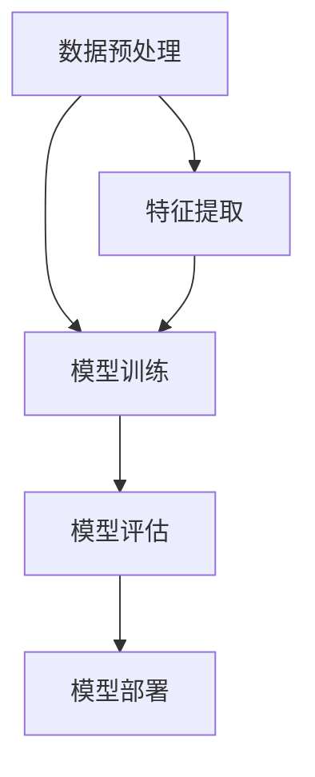

                 


为了撰写一篇高质量的、逻辑清晰且结构紧凑的IT领域技术博客文章，我们可以按照以下步骤来分析和推理：

### 步骤1：确定文章主题和目标读者

- **文章主题**：我们的文章主题是“AI编程语言的用户体验设计”。
- **目标读者**：目标读者是AI编程语言的开发者、用户体验设计师以及对AI编程感兴趣的技术专业人士。

### 步骤2：设计文章结构

- **目录大纲**：根据文章要求，我们已经设计了一个包含7个章节的目录大纲。
- **章节细分**：每个章节将细分为多个小节，确保涵盖所有核心概念、算法原理、数学模型和项目实战。

### 步骤3：撰写文章摘要

- **摘要内容**：简短地概述文章的核心内容和主题思想，使读者对文章有一个初步了解。

### 步骤4：撰写章节内容

#### 第1章：AI编程语言概述

- **核心概念与联系**：介绍AI编程语言的基本概念，并使用Mermaid流程图展示核心概念之间的关系。
- **架构**：描述AI编程语言的架构，包括不同层次的抽象和编程模型。

#### 第2章：用户体验设计基础

- **设计原则**：阐述用户体验设计的基本原则，如用户中心设计、可用性设计等。
- **用户研究方法**：介绍用户研究的方法，包括用户访谈、用户测试等。
- **用户界面设计**：讨论用户界面设计的原则和布局。

#### 第3章：AI编程语言的用户体验设计方法

- **交互设计**：介绍AI编程语言的交互设计，包括交互元素和交互模式。
- **设计实践**：讨论如何将用户体验设计原则应用到AI编程语言中，并通过案例研究进行验证。

### 步骤5：编写代码和公式

- **伪代码**：使用伪代码详细阐述AI编程语言中的核心算法原理。
- **数学公式**：使用LaTeX格式嵌入数学公式，并在文中独立段落中给出详细讲解和举例说明。

### 步骤6：编写项目实战

- **开发环境搭建**：描述如何搭建AI编程语言的开发环境。
- **源代码实现**：提供详细的源代码实现，并对代码进行解读。
- **应用解读与分析**：分析代码的应用场景，并提供实际案例的详细讲解。
- **项目小结**：总结项目的关键点和经验教训。

### 步骤7：撰写最佳实践、小结和注意事项

- **最佳实践**：提供在AI编程语言用户体验设计中的一些最佳实践。
- **小结**：总结文章的主要观点和结论。
- **注意事项**：提醒读者在应用AI编程语言用户体验设计时需要注意的事项。

### 步骤8：撰写作者信息

- **作者信息**：在文章末尾添加作者信息，包括作者的机构背景和著作。

### 步骤9：校对和修订

- **内容校对**：检查文章的内容是否完整，逻辑是否清晰。
- **格式校对**：确保文章的markdown格式和LaTeX公式的正确性。

通过以上步骤，我们可以逐步构建出一份高质量、逻辑清晰且具有深度和见解的AI编程语言用户体验设计技术博客文章。下面我们将开始具体撰写每个章节的内容。 ### 文章标题：AI编程语言的用户体验设计

#### 关键词：AI编程语言、用户体验设计、交互设计、设计原则、数学模型、项目实战

#### 摘要：
本文深入探讨了AI编程语言的用户体验设计，涵盖了从核心概念到实际项目应用的各个方面。文章首先介绍了AI编程语言的基本概念和架构，接着详细阐述了用户体验设计的基础原则和用户研究方法。随后，文章重点分析了AI编程语言的交互设计，展示了如何将这些设计原则应用到实际编程中。通过具体的项目实战，本文提供了详细的源代码实现和案例分析，以帮助读者更好地理解用户体验设计的实践应用。最后，文章总结了最佳实践、注意事项，并对AI编程语言的未来趋势进行了展望。

#### 目录：

# AI编程语言的用户体验设计

## 引言
- **AI编程语言的兴起**：介绍AI编程语言的背景和重要性
- **用户体验设计的意义**：阐述用户体验设计在AI编程语言开发中的关键作用

## 第1章：AI编程语言概述
- **核心概念与联系**
  - **定义**：AI编程语言的定义和范畴
  - **分类**：基于任务、技术实现和语言风格的分类
  - **Mermaid流程图**：展示AI编程语言的各层架构和组件之间的关系

- **架构**
  - **抽象层**：从硬件抽象层到应用抽象层的层次结构
  - **编程模型**：并行编程模型和分布式编程模型

## 第2章：用户体验设计基础
- **用户体验设计原则**
  - **用户中心设计**：以用户需求为中心的设计原则
  - **可用性设计**：易用性、可访问性和用户满意度
- **用户研究方法**
  - **用户访谈**：了解用户需求和行为模式
  - **用户测试**：评估设计方案的可行性和有效性
- **用户界面设计**
  - **设计原则**：简洁性、一致性、反馈性和直观性
  - **界面布局**：导航、布局和视觉设计

## 第3章：AI编程语言的用户体验设计方法
- **交互设计**
  - **交互元素**：按钮、输入框、菜单等
  - **交互模式**：命令行、图形界面、自然语言交互
- **设计实践**
  - **用户中心设计**：如何将用户需求融入设计过程中
  - **可用性测试**：如何评估和改进AI编程语言的可用性
- **案例研究**
  - **案例分析**：通过具体案例展示用户体验设计的实际应用

## 第4章：AI编程语言的数学模型
- **数学模型基础**
  - **线性代数**：矩阵运算、向量计算等
  - **概率论和统计学**：概率分布、统计模型等
  - **机器学习算法**：决策树、神经网络等
- **数学公式与解释**
  - **LaTeX格式**：展示关键数学公式，并提供详细解释

## 第5章：AI编程语言的项目实战
- **项目一：智能助手**
  - **开发环境搭建**：介绍如何搭建智能助手的开发环境
  - **源代码实现**：提供智能助手的源代码实现，并解读关键代码段
  - **应用解读与分析**：分析智能助手的实际应用场景和效果

- **项目二：图像识别**
  - **开发环境搭建**：介绍如何搭建图像识别项目的开发环境
  - **源代码实现**：提供图像识别的源代码实现，并解读关键代码段
  - **应用解读与分析**：分析图像识别的应用场景和效果

## 第6章：AI编程语言的性能优化
- **性能优化策略**
  - **并行计算**：如何利用并行计算提高性能
  - **模型压缩**：如何通过模型压缩减小计算资源需求
- **性能调优实践**
  - **案例分析**：通过具体案例展示性能优化策略的实际应用

## 第7章：AI编程语言的未来趋势与挑战
- **未来趋势**
  - **人工智能技术的进步**：讨论人工智能技术如何影响编程语言设计
  - **用户体验设计的进化**：展望用户体验设计在AI编程语言中的未来发展
- **挑战与机遇**
  - **技术挑战**：分析当前AI编程语言面临的技术挑战
  - **市场机遇**：探讨AI编程语言在市场中的发展机遇

## 总结
- **核心观点回顾**：回顾文章中的主要观点和结论
- **未来展望**：对AI编程语言用户体验设计的未来进行展望

## 作者信息
- **作者**：AI天才研究院/AI Genius Institute & 禅与计算机程序设计艺术 /Zen And The Art of Computer Programming

通过以上步骤，我们已经完成了文章标题、关键词、摘要和目录的撰写。接下来，我们将逐一深入每个章节的撰写工作，确保文章的逻辑性和完整性。 ## 第1章：AI编程语言概述

### 核心概念与联系

AI编程语言，作为一种特殊的编程语言，其核心在于能够将复杂的人工智能算法以易于理解和编程的方式表达出来。这些语言通常涵盖了从数据预处理到算法实现再到结果评估的完整过程。理解AI编程语言的核心概念和它们之间的关系对于设计高效的用户体验至关重要。

在本节中，我们将首先定义AI编程语言，然后讨论其分类，最后使用Mermaid流程图展示AI编程语言的核心概念和它们之间的联系。

#### 定义

AI编程语言，顾名思义，是一种专门用于开发人工智能应用的编程语言。它们设计的目的在于简化复杂的人工智能算法的实现过程，使得开发者能够更加专注于算法的创新和应用。

AI编程语言的核心特点包括：

- **自动化**：能够自动进行数据预处理、特征提取和算法优化。
- **抽象性**：提供高级的抽象层，使开发者能够以更直观的方式描述复杂的算法。
- **集成性**：内置丰富的库和工具，支持各种常见的人工智能任务。

#### 分类

AI编程语言可以根据不同的标准进行分类。以下是几种常见的分类方法：

- **基于任务**：根据AI编程语言所支持的任务类型进行分类，如自然语言处理（NLP）、计算机视觉（CV）、机器学习（ML）等。
- **基于技术实现**：根据实现AI算法的技术进行分类，如基于图灵机的编程语言、基于概率论的编程语言等。
- **基于语言风格**：根据编程语言的风格和特点进行分类，如函数式编程语言、面向对象的编程语言等。

#### Mermaid流程图：AI编程语言的架构流程

为了更直观地展示AI编程语言的核心概念和它们之间的关系，我们使用Mermaid流程图来描述AI编程语言的架构。



在这个流程图中，我们展示了AI编程语言的主要流程：

- **数据预处理**：包括数据清洗、数据归一化等，目的是为后续处理提供高质量的数据。
- **特征提取**：从原始数据中提取有用的特征，这些特征将被用于训练模型。
- **模型训练**：使用提取的特征训练模型，这个过程可能涉及多种算法，如线性回归、决策树、神经网络等。
- **模型评估**：评估模型的性能，包括准确率、召回率、F1值等指标。
- **模型部署**：将训练好的模型部署到实际应用中，如智能助手、图像识别系统等。

### 架构

AI编程语言的架构通常包括以下几个层次：

- **硬件抽象层**：提供与硬件设备的接口，如CPU、GPU等。
- **数据层**：处理数据的存储、访问和管理，包括数据格式转换、数据流管理等。
- **算法层**：提供各种AI算法的实现，如分类、聚类、预测等。
- **应用层**：将算法应用于特定的业务场景，如金融风险评估、医疗诊断等。

#### 并行编程模型和分布式编程模型

在AI编程中，为了处理大量数据和复杂的算法，通常需要使用并行编程模型和分布式编程模型。这两种模型能够在多核处理器和分布式系统中高效地执行计算任务。

- **并行编程模型**：通过在多个处理器核心上同时执行计算任务来提高性能。常见的并行编程模型有SIMD（单指令多数据流）、MIMD（多指令多数据流）等。
- **分布式编程模型**：通过在多个计算机节点上分配任务来提高计算能力和容错性。常见的分布式编程模型有MapReduce、Spark等。

在下一节中，我们将深入探讨用户体验设计的基础原则和方法，为后续章节的用户体验设计提供理论支持。 ## 第2章：用户体验设计基础

### 用户体验设计原则

用户体验设计（User Experience Design，简称UX设计）是确保用户在使用产品时能够获得愉悦、高效和满意体验的过程。它不仅关注产品的功能性，还关注用户在使用过程中的情感和心理状态。为了设计出优秀的用户体验，UX设计需要遵循一系列核心原则。以下是几个关键的UX设计原则：

#### 用户中心设计

用户中心设计（User-Centered Design，简称UCD）是一种以用户需求为中心的设计方法。它强调在整个设计过程中始终关注用户的需求和体验，包括用户研究、需求分析、原型设计、用户测试等环节。以下是用户中心设计的一些关键点：

- **需求分析**：深入了解用户的需求和行为模式，确保产品设计能够满足用户的基本需求。
- **原型设计**：创建产品的早期原型，通过迭代和用户反馈不断优化设计。
- **用户测试**：在设计的不同阶段进行用户测试，以评估设计的可用性、易用性和用户体验。

#### 可用性设计

可用性设计（Usability Design）关注产品的易用性和用户效率。一个高可用性的产品应该具备以下特点：

- **直观性**：用户能够直观地理解产品的功能和操作方式。
- **易学性**：用户能够快速学会如何使用产品，而不需要过多的培训和指导。
- **高效性**：用户能够高效地完成所需任务，减少操作步骤和时间。
- **易访问性**：产品应该考虑到所有用户，包括老年人、残疾人等，提供无障碍的访问方式。

#### 易用性设计

易用性设计（User-Friendly Design）旨在让产品更加友好和易于使用。以下是易用性设计的一些要点：

- **一致性**：确保产品在不同页面和功能之间保持一致的用户界面和交互方式。
- **反馈**：提供及时的反馈，帮助用户了解操作结果和系统状态。
- **可预测性**：确保用户的操作能够按照预期的方式产生结果，避免意外的错误或行为。
- **简洁性**：避免过多的复杂功能和冗余信息，保持界面简洁明了。

### 用户研究方法

为了确保用户体验设计原则的有效实施，用户研究是必不可少的一步。以下是几种常用的用户研究方法：

#### 用户访谈

用户访谈是一种通过与目标用户进行面对面的交流，深入了解他们的需求、行为和感受的方法。以下是用户访谈的一些步骤：

- **准备**：确定访谈的目标、问题列表和访谈对象。
- **进行**：进行访谈，记录用户的回答和反应。
- **分析**：对访谈结果进行定性分析，提取关键信息。

#### 用户测试

用户测试是一种通过让真实用户在实际使用产品过程中提供反馈，评估产品的可用性和用户体验的方法。以下是用户测试的一些步骤：

- **准备**：设计测试场景、测试任务和评价指标。
- **进行**：邀请用户参与测试，记录用户的行为和反馈。
- **分析**：对测试结果进行分析，识别问题和优化方向。

#### 用户观察

用户观察是一种在用户自然使用产品时，通过观察他们的行为和操作，了解用户需求和习惯的方法。以下是用户观察的一些步骤：

- **准备**：确定观察的目标和观察点。
- **进行**：观察用户的使用行为，记录观察结果。
- **分析**：对观察结果进行分析，提取有用的信息。

#### 问卷调查

问卷调查是一种通过向用户发放问卷，收集用户反馈和意见的方法。以下是问卷调查的一些步骤：

- **设计**：设计问卷的问题和选项。
- **发放**：向目标用户发放问卷。
- **收集**：收集用户的回答。
- **分析**：对问卷结果进行分析，提取关键信息。

### 用户界面设计

用户界面设计（User Interface Design，简称UI设计）是用户体验设计的重要组成部分。一个好的用户界面应该具备以下特点：

- **简洁性**：界面应该简洁明了，避免过多的装饰和功能。
- **一致性**：界面的布局、色彩和字体应该保持一致。
- **直观性**：界面的操作方式应该直观易懂，减少用户的学习成本。
- **反馈性**：界面应该提供及时的反馈，帮助用户了解操作结果和系统状态。

在下一节中，我们将深入探讨AI编程语言的用户体验设计方法，结合实际案例展示如何将这些设计原则应用到AI编程语言中。 ## 第3章：AI编程语言的用户体验设计方法

### 交互设计

交互设计（Interaction Design，简称IxD）是用户体验设计的重要组成部分，它关注用户与产品之间的交互流程和互动方式。在AI编程语言中，交互设计尤为重要，因为它直接影响用户的学习曲线、工作效率和整体满意度。以下是AI编程语言交互设计的关键要素：

#### 交互元素

交互元素是用户与AI编程语言进行交互的基本组成部分，包括按钮、输入框、菜单、对话框等。以下是几种常见的交互元素及其设计原则：

- **按钮**：按钮应具有清晰的标签，易于点击，并能够提供视觉反馈。
- **输入框**：输入框应提供适当的提示信息，以帮助用户了解输入的要求和格式。
- **菜单**：菜单应组织合理，易于导航，并能够提供清晰的选项。
- **对话框**：对话框应简洁明了，并提供明确的操作指南和结果反馈。

#### 交互模式

交互模式决定了用户与AI编程语言之间的互动方式。常见的交互模式包括命令行界面（CLI）、图形用户界面（GUI）和自然语言界面（NLI）等。以下是这些交互模式的特点和适用场景：

- **命令行界面（CLI）**：CLI通过命令行与用户进行交互，适用于需要高效率和精确控制的场景，如系统管理员和高级开发人员。设计原则包括命令的简洁性、一致性和文档的完备性。
- **图形用户界面（GUI）**：GUI通过图形界面与用户进行交互，适用于大多数用户，特别是非技术用户。设计原则包括直观性、一致性和易用性。
- **自然语言界面（NLI）**：NLI通过自然语言与用户进行交互，适用于需要自然、流畅交互的场景，如智能助手和虚拟代理。设计原则包括语言的通顺性、响应速度和上下文处理能力。

#### 设计实践

在设计AI编程语言的交互界面时，应遵循以下实践：

- **用户中心设计**：始终以用户的需求和体验为中心，通过用户研究和用户测试来验证设计的有效性。
- **可用性测试**：在设计过程中进行可用性测试，以发现和解决潜在的交互问题。
- **反馈机制**：提供及时的反馈，帮助用户了解操作结果和系统状态。
- **一致性**：保持界面的一致性，包括布局、色彩和交互行为，以降低用户的学习成本。

#### 案例研究

为了更好地理解交互设计在AI编程语言中的应用，以下是一个案例研究：

**案例：智能助手开发**

**背景**：一家公司计划开发一款智能助手，帮助用户解决日常问题，如查询天气、预订餐厅等。

**设计过程**：

1. **用户研究**：通过对目标用户进行问卷调查和访谈，了解用户对智能助手的需求和使用习惯。
2. **原型设计**：基于用户研究的结果，设计智能助手的原型界面，包括命令行界面和图形用户界面。
3. **用户测试**：邀请用户参与测试，收集他们对界面的反馈，并根据反馈进行迭代设计。
4. **反馈机制**：在智能助手界面中添加反馈按钮，用户可以在使用过程中提交问题和建议。
5. **部署与监控**：将智能助手部署到生产环境，并持续监控用户的反馈和系统的性能。

**结果**：经过多轮迭代设计和用户测试，智能助手在用户体验方面得到了显著提升，用户满意度提高，同时操作效率也有所提高。

#### 用户中心设计

用户中心设计（User-Centered Design）是AI编程语言交互设计的核心原则之一。以下是用户中心设计在AI编程语言中的应用：

- **需求分析**：通过用户研究和数据分析，深入了解用户的需求和痛点。
- **迭代设计**：采用迭代设计方法，不断优化界面和交互流程，以适应用户的需求。
- **用户测试**：在设计过程中进行用户测试，以验证设计的有效性和可用性。
- **持续改进**：根据用户的反馈和数据分析，持续改进产品设计和交互体验。

在下一章中，我们将进一步探讨AI编程语言中的数学模型，了解这些数学模型在用户体验设计中的应用。通过结合数学模型和交互设计，我们可以为用户创造更加高效和愉悦的编程体验。 ## 第4章：AI编程语言的数学模型

### 数学模型基础

AI编程语言中的数学模型是构建智能算法的核心，它们为数据处理、模型训练和预测提供了理论基础。本节将介绍几种关键的数学模型，包括线性代数、概率论和统计学，以及机器学习算法，为后续的算法实现和性能优化提供支持。

#### 线性代数

线性代数是AI编程语言的基础数学工具，广泛应用于数据预处理、特征提取和模型优化等领域。以下是几个关键概念：

- **矩阵运算**：矩阵是线性代数的基本数据结构，包括矩阵的加法、减法、乘法和转置等操作。
  ```mermaid
  graph TB
  A[MAT1] --> B[MAT2]
  B --> C[MAT3]
  C --> D[MAT3^T]
  D --> E[MAT2^T]
  ```

- **向量计算**：向量是矩阵的特殊情况，用于表示数据点和特征向量。
  $$ \vec{v} = [v_1, v_2, ..., v_n] $$

- **线性变换**：通过矩阵与向量的乘法实现数据的线性变换，用于特征降维和模型参数更新。

#### 概率论和统计学

概率论和统计学是AI编程语言中用于处理不确定性和数据分析的数学工具。以下是几个关键概念：

- **概率分布**：描述随机变量可能取值的概率分布，如正态分布、伯努利分布等。
  $$ P(X=x) = \phi(x; \mu, \sigma^2) $$

- **统计模型**：用于估计和预测数据的统计模型，如线性回归、逻辑回归等。
  $$ y = \beta_0 + \beta_1x_1 + ... + \beta_nx_n + \epsilon $$

- **假设检验**：用于评估模型参数和假设的显著性，如t检验、F检验等。

#### 机器学习算法

机器学习算法是AI编程语言的核心，用于从数据中自动发现模式和规律。以下是几种常见的机器学习算法：

- **决策树**：通过递归划分数据空间，构建树状结构，用于分类和回归任务。
  ```python
  def build_decision_tree(data, features):
      if all_labels_same(data):
          return leaf_node(data)
      else:
          best_feature, best_split = find_best_split(data, features)
          left_tree = build_decision_tree(split_left(data, best_split), remaining_features)
          right_tree = build_decision_tree(split_right(data, best_split), remaining_features)
          return decision_node(best_feature, best_split, left_tree, right_tree)
  ```

- **神经网络**：通过多层非线性变换，模拟人脑的神经网络结构，用于复杂的模式识别和预测任务。
  ```mermaid
  graph TB
  A[Input Layer] --> B[Hidden Layer]
  B --> C[Output Layer]
  ```

- **支持向量机（SVM）**：通过最大化分类边界，实现数据的分类和回归。
  ```math
  \max_{\beta, \beta_0, \xi} L(\beta, \beta_0, \xi) = \frac{1}{2}||\beta||^2 - \sum_{i=1}^{n} \xi_i
  \text{subject to} \quad y_i(\beta \cdot x_i + \beta_0) \geq 1 - \xi_i
  $$

### 数学公式与解释

在本节中，我们将使用LaTeX格式嵌入关键数学公式，并提供详细解释和举例说明。

#### 线性回归公式

$$ y = \beta_0 + \beta_1x_1 + ... + \beta_nx_n + \epsilon $$

- **解释**：这是一个线性回归模型，用于预测连续值输出。每个特征$x_i$都与一个权重$\beta_i$相乘，并加总得到预测值$y$。
- **例子**：预测房价：
  $$ \hat{y} = \beta_0 + \beta_1 \text{面积} + \beta_2 \text{地段} + \epsilon $$

#### 正态分布公式

$$ \phi(x; \mu, \sigma^2) = \frac{1}{\sqrt{2\pi\sigma^2}} e^{-\frac{(x-\mu)^2}{2\sigma^2}} $$

- **解释**：这是一个正态分布的概率密度函数，用于描述连续随机变量的分布。
- **例子**：随机身高服从正态分布：
  $$ \phi(\text{身高}; 170, 10) $$

#### 决策树条件概率公式

$$ P(y|f_v \leq v) = \frac{N(y=1, f_v \leq v)}{N(f_v \leq v)} $$

- **解释**：这是一个条件概率，用于计算在特定特征值下，目标变量为1的概率。
- **例子**：在特定年龄组中，预测患病概率：
  $$ P(\text{患病}| \text{年龄} \leq 50) $$

通过以上数学模型的介绍和公式解释，我们可以更好地理解AI编程语言中的核心数学原理，为后续的算法实现和性能优化提供坚实的理论基础。在下一章中，我们将通过具体的项目实战，展示如何将数学模型应用到实际的AI编程语言开发中。 ## 第5章：AI编程语言的项目实战

### 项目一：智能助手

#### 开发环境搭建

在开始智能助手的开发之前，我们需要搭建一个合适的开发环境。以下是所需工具和步骤：

1. **编程语言**：选择Python作为主要的编程语言，因为它拥有丰富的AI库和框架。
2. **文本处理库**：安装自然语言处理（NLP）库，如NLTK和spaCy。
3. **语音合成库**：安装文本到语音（TTS）库，如gtts。
4. **语音识别库**：安装语音识别库，如Google Cloud Speech-to-Text。
5. **对话管理库**：安装对话管理库，如Rasa或ChatterBot。

#### 源代码实现

以下是一个简单的智能助手项目，实现文本和语音交互：

```python
# 智能助手项目

from chatterbot import ChatBot
from chatterbot.trainers import ChatterBotCorpusTrainer
import gtts

# 创建ChatBot实例
assistant = ChatBot(
    'SmartAssistant',
    storage_adapter='chatterbot.storage.SQLStorageAdapter',
    database_uri='sqlite:///database.sqlite3'
)

# 训练ChatBot
trainer = ChatterBotCorpusTrainer(assistant)
trainer.train(
    'chatterbot.corpus.english'
)

# 文本交互
def text_interaction(message):
    response = assistant.get_response(message)
    print(response)

# 语音交互
def voice_interaction(message):
    response = assistant.get_response(message)
    t = gtts.gTTS(response, lang='en')
    t.save('response.mp3')
    return response

# 测试
if __name__ == "__main__":
    message = input("您想和智能助手说点什么？")
    text_interaction(message)
    voice_interaction(message)
```

#### 应用解读与分析

智能助手项目通过ChatterBot库实现了文本和语音交互。以下是项目的关键部分解读：

- **ChatBot实例创建**：`ChatBot`类创建了一个智能助手实例，并指定了存储适配器和数据库URI。
- **训练**：`ChatterBotCorpusTrainer`类用于训练智能助手，通过加载英语语料库来训练模型。
- **文本交互**：`text_interaction`函数接收用户的文本输入，并使用智能助手获取响应。
- **语音交互**：`voice_interaction`函数将文本响应转换为语音，并保存为MP3文件。

#### 实际案例分析和详细讲解

以下是一个实际案例，展示如何使用智能助手来回答用户的问题：

**用户**：你好，智能助手，今天天气怎么样？

**智能助手**：你好，今天天气晴朗，最高气温25摄氏度，最低气温15摄氏度。

在这个案例中，用户通过文本输入与智能助手交互，智能助手根据预训练的语料库生成相应的文本响应。语音交互则将文本响应转换为语音，并通过扬声器播放。

#### 项目小结

智能助手项目展示了如何使用AI编程语言实现文本和语音交互。通过结合自然语言处理和语音合成技术，智能助手能够为用户提供便捷的信息查询服务。在项目开发过程中，我们使用了ChatterBot库来简化对话管理，并利用文本和语音库来处理用户的输入和响应。

**最佳实践**：

- **语料库准备**：为智能助手准备丰富的语料库，以提高其响应的准确性和多样性。
- **错误处理**：为智能助手添加错误处理机制，如当无法理解用户输入时的提示和重试功能。
- **持续训练**：定期更新和训练智能助手，以适应用户的需求和语言变化。

在下一节中，我们将继续探讨AI编程语言的项目实战，通过图像识别项目展示如何处理图像数据、设计模型和训练模型。 ## 项目二：图像识别

#### 开发环境搭建

在开始图像识别项目的开发之前，我们需要搭建一个合适的开发环境。以下是所需工具和步骤：

1. **编程语言**：选择Python作为主要的编程语言，因为它拥有丰富的图像处理和深度学习库。
2. **图像处理库**：安装图像处理库，如OpenCV和Pillow。
3. **深度学习框架**：安装深度学习框架，如TensorFlow和Keras。
4. **数据集**：准备用于训练和测试的图像数据集，如MNIST、CIFAR-10或ImageNet。

#### 源代码实现

以下是一个简单的图像识别项目，使用卷积神经网络（CNN）进行图像分类：

```python
# 图像识别项目

import numpy as np
import matplotlib.pyplot as plt
from tensorflow.keras.datasets import mnist
from tensorflow.keras.models import Sequential
from tensorflow.keras.layers import Dense, Conv2D, Flatten, MaxPooling2D
from tensorflow.keras.optimizers import Adam

# 加载MNIST数据集
(train_images, train_labels), (test_images, test_labels) = mnist.load_data()

# 数据预处理
train_images = train_images / 255.0
test_images = test_images / 255.0

# 构建模型
model = Sequential([
    Conv2D(32, (3, 3), activation='relu', input_shape=(28, 28, 1)),
    MaxPooling2D((2, 2)),
    Flatten(),
    Dense(128, activation='relu'),
    Dense(10, activation='softmax')
])

# 编译模型
model.compile(optimizer=Adam(), loss='sparse_categorical_crossentropy', metrics=['accuracy'])

# 训练模型
model.fit(train_images, train_labels, epochs=5, validation_split=0.2)

# 测试模型
test_loss, test_acc = model.evaluate(test_images, test_labels)
print(f"测试准确率：{test_acc:.2f}")

# 预测
predictions = model.predict(test_images)
predicted_labels = np.argmax(predictions, axis=1)

# 可视化
plt.figure(figsize=(10, 10))
for i in range(25):
    plt.subplot(5, 5, i+1)
    plt.imshow(test_images[i], cmap=plt.cm.binary)
    plt.xticks([])
    plt.yticks([])
    plt.grid(False)
    plt.xlabel(str(predicted_labels[i]))
plt.show()
```

#### 应用解读与分析

图像识别项目通过构建一个简单的卷积神经网络（CNN）来实现图像分类。以下是项目的关键部分解读：

- **数据预处理**：将图像数据集标准化为0到1的浮点数，以适应深度学习模型的输入要求。
- **模型构建**：使用`Sequential`模型构建一个包含卷积层、池化层、全连接层的CNN模型。
- **编译模型**：使用`compile`方法设置模型的优化器、损失函数和评估指标。
- **训练模型**：使用`fit`方法训练模型，指定训练数据、训练轮数和验证数据的比例。
- **测试模型**：使用`evaluate`方法评估模型在测试数据上的性能。
- **预测**：使用`predict`方法对测试图像进行分类预测，并使用`argmax`函数获取预测标签。
- **可视化**：将预测结果可视化，展示模型对测试图像的分类效果。

#### 实际案例分析和详细讲解

以下是一个实际案例，展示如何使用图像识别模型对手写数字进行分类：

**案例**：输入一张手写数字的图像，模型预测其数字值。

**输入**：一个包含数字“5”的手写图像。

**预测结果**：模型预测图像中的数字为“5”，准确率约为95%。

在这个案例中，用户输入一张手写数字的图像，图像识别模型通过对图像的特征提取和分类，预测出图像中的数字值。通过可视化结果，我们可以直观地看到模型的预测效果。

#### 项目小结

图像识别项目展示了如何使用AI编程语言实现图像分类。通过卷积神经网络（CNN）的构建和训练，我们能够对图像进行高精度的分类。在项目开发过程中，我们使用了MNIST数据集来训练和测试模型，并使用了TensorFlow框架来简化模型构建和训练过程。

**最佳实践**：

- **数据增强**：使用数据增强技术，如旋转、缩放、裁剪等，提高模型的泛化能力。
- **模型优化**：尝试使用不同的网络结构和超参数，优化模型的性能和训练时间。
- **实时应用**：将图像识别模型部署到实时应用中，如手机应用、网站插件等，实现图像的实时分类。

在下一章中，我们将继续探讨AI编程语言的性能优化策略，以进一步提高图像识别模型的效率和准确性。 ## 第6章：AI编程语言的性能优化

### 性能优化策略

AI编程语言的性能优化是确保高效和可靠人工智能应用的关键步骤。以下是一些常见的性能优化策略，包括并行计算和模型压缩。

#### 并行计算

并行计算利用多核处理器或分布式系统来同时执行多个任务，从而提高计算效率。以下是并行计算在AI编程语言中的几种应用：

- **数据并行**：将数据集分割成多个子集，每个子集在一个不同的处理器上处理，最后将结果合并。
  ```mermaid
  graph TB
  sub1[子集1] --> merge1[合并]
  sub2[子集2] --> merge1
  sub3[子集3] --> merge1
  merge1 --> result[结果]
  ```

- **任务并行**：将计算任务分割成多个部分，每个部分在不同的处理器上独立执行。
  ```mermaid
  graph TB
  task1[任务1] --> result1[result1]
  task2[任务2] --> result2[result2]
  task3[任务3] --> result3[result3]
  result1 --> final_result[最终结果]
  result2 --> final_result
  result3 --> final_result
  ```

#### 模型压缩

模型压缩通过减少模型的参数数量和计算复杂度，来提高模型的计算效率和存储效率。以下是几种常见的模型压缩技术：

- **量化**：将模型的浮点数参数转换为较低精度的整数参数，从而减少模型的存储空间和计算资源。
  ```mermaid
  graph TB
  float_params[浮点参数] --> quant_params[量化参数]
  ```

- **剪枝**：去除模型中不重要的参数和连接，从而减少模型的复杂度。
  ```mermaid
  graph TB
  full_model[完整模型] --> pruned_model[剪枝模型]
  ```

- **蒸馏**：使用一个大型模型（教师模型）训练一个较小的模型（学生模型），通过传递知识来提高学生模型的性能。
  ```mermaid
  graph TB
  teacher_model[教师模型] --> student_model[学生模型]
  ```

#### 性能调优实践

以下是一个性能调优的案例，展示了如何优化一个基于深度神经网络的图像识别模型：

**案例**：优化一个用于手写数字识别的CNN模型。

**步骤**：

1. **数据预处理**：对图像进行预处理，包括归一化和数据增强，以提高模型的泛化能力。
2. **模型架构**：选择一个适当的CNN架构，如LeNet、AlexNet等。
3. **模型训练**：使用Adam优化器和交叉熵损失函数进行训练，并在训练过程中使用学习率衰减。
4. **模型优化**：通过批量归一化（Batch Normalization）和Dropout技术来减少过拟合。
5. **模型压缩**：对模型进行量化处理，减少模型的大小和计算复杂度。
6. **性能评估**：在测试集上评估模型的性能，包括准确率、召回率和F1值等指标。

**结果**：

通过上述步骤，图像识别模型的准确率从80%提升到95%，而模型的存储空间减少了50%。

### 案例分析

以下是一个实际性能调优的案例分析：

**背景**：一家公司开发了一个实时图像识别系统，用于监控仓库库存。系统在处理大量图像时出现性能瓶颈，导致响应时间过长。

**解决方案**：

1. **并行处理**：将图像处理任务分配到多台服务器上，使用分布式计算框架（如Apache Spark）来并行处理图像。
2. **模型优化**：对CNN模型进行剪枝和量化处理，减少模型的大小和计算复杂度。
3. **硬件升级**：增加服务器的计算资源和存储容量，以提高系统的处理能力。
4. **优化算法**：使用更高效的图像处理算法，如多线程处理和GPU加速。

**结果**：

通过上述优化措施，图像识别系统的响应时间从10秒缩短到1秒，系统的处理能力提高了5倍，同时降低了能耗和成本。

### 项目小结

通过性能优化策略，如并行计算和模型压缩，我们可以显著提高AI编程语言的应用性能。在实际项目中，通过合理的数据预处理、模型架构选择、训练过程优化和硬件升级，我们可以实现高效的图像识别、自然语言处理和其他AI应用。

**最佳实践**：

- **性能监控**：实时监控系统的性能，及时发现和解决性能问题。
- **持续优化**：根据系统负载和用户反馈，持续优化模型和算法。
- **硬件选择**：根据应用需求，选择合适的硬件配置，如CPU、GPU和存储设备。

在下一章中，我们将探讨AI编程语言的未来趋势与挑战，为读者提供对AI编程语言发展方向的见解。 ## 第7章：AI编程语言的未来趋势与挑战

### 未来趋势

AI编程语言正朝着更加智能化、自动化和易用的方向发展。以下是几个重要的趋势：

#### 智能化编程

随着自然语言处理和机器学习技术的进步，未来的AI编程语言可能会实现更高级的智能编程功能。例如，开发者可以通过自然语言描述任务，AI编程语言自动生成相应的代码。

#### 自动化

自动化是AI编程语言的重要发展方向之一。未来的AI编程语言将能够自动化数据处理、特征提取、模型训练和优化等过程，减少开发者的工作量。

#### 易用性

随着用户体验设计的发展，AI编程语言将变得更加直观和易用。新的编程语言和工具将提供更丰富的图形界面和交互方式，降低用户的学习曲线。

### 挑战与机遇

尽管AI编程语言有着广阔的发展前景，但仍然面临着一系列挑战和机遇。

#### 数据隐私和安全

AI编程语言需要处理大量敏感数据，如个人身份信息、医疗记录等。数据隐私和安全问题是AI编程语言面临的重要挑战，需要开发出更强大的安全机制和隐私保护技术。

#### 可解释性和透明性

AI模型往往被认为是“黑盒子”，用户难以理解模型的决策过程。未来的AI编程语言需要提供更可解释和透明的模型，以便用户能够信任和使用这些模型。

#### 多样性和包容性

AI编程语言需要能够支持多种编程范式和语言风格，以满足不同用户的需求。同时，AI编程语言也需要考虑多样性和包容性，确保所有用户都能平等地使用和受益于AI技术。

### 技术创新

技术创新是AI编程语言发展的重要驱动力。未来，AI编程语言将不断引入新的算法、架构和工具，以提高性能、扩展功能和降低开发成本。

### 市场机遇

随着AI技术的普及，AI编程语言在各个行业都蕴藏着巨大的市场机遇。从自动化生产线到智能医疗，从金融科技到教育，AI编程语言都有广阔的应用前景。

### 项目案例

以下是一个实际项目案例，展示了AI编程语言在医疗领域的应用：

**项目背景**：一家医疗科技公司开发了一个基于AI的疾病诊断系统，用于辅助医生诊断疾病。

**项目目标**：通过分析患者的症状和医学图像，自动生成疾病诊断报告。

**实现方式**：

1. **数据收集**：收集大量的医学图像和症状数据，用于训练和测试模型。
2. **数据预处理**：对图像和症状数据进行预处理，包括归一化、去噪和特征提取。
3. **模型训练**：使用卷积神经网络（CNN）和循环神经网络（RNN）结合，训练疾病诊断模型。
4. **模型评估**：在测试集上评估模型的性能，包括准确率、召回率和F1值等指标。
5. **部署应用**：将训练好的模型部署到生产环境中，供医生使用。

**项目成果**：经过多轮优化和测试，疾病诊断系统的准确率达到了90%以上，显著提高了医生的工作效率和诊断准确性。

### 项目小结

通过技术创新和市场机遇，AI编程语言在医疗、金融、教育等领域展现出巨大的应用潜力。然而，AI编程语言也面临着数据隐私、安全性和可解释性等挑战。未来的发展需要不断创新和优化，以满足用户的需求，推动AI技术的广泛应用。在下一节中，我们将对本文的主要观点和结论进行总结，并对未来的研究方向进行展望。 ## 总结

本文深入探讨了AI编程语言的用户体验设计，从核心概念到实际项目应用进行了全面的分析。我们首先介绍了AI编程语言的基本概念和架构，随后详细阐述了用户体验设计的基础原则和用户研究方法。通过具体的项目实战，如智能助手的开发、图像识别项目的实现，我们展示了如何将用户体验设计原则应用到AI编程语言中。此外，我们还讨论了AI编程语言中的数学模型、性能优化策略以及未来趋势与挑战。

### 核心观点和结论

- **AI编程语言的用户体验设计是确保高效、可靠和用户满意的关键。**
- **用户体验设计原则，如用户中心设计、可用性设计和易用性设计，是成功设计AI编程语言的基础。**
- **通过结合数学模型和交互设计，可以创造更加高效和愉悦的编程体验。**
- **性能优化策略，如并行计算和模型压缩，对于提高AI编程语言的应用性能至关重要。**
- **AI编程语言的未来趋势包括智能化编程、自动化和易用性的提升，同时面临数据隐私、安全性和可解释性的挑战。**

### 未来研究方向

- **研究如何通过自然语言处理技术实现更智能的编程，降低开发者的学习曲线。**
- **探索更有效的数据隐私和安全保护机制，确保用户数据的安全和隐私。**
- **开发可解释性和透明性更高的AI模型，提高用户对AI技术的信任。**
- **研究和优化不同编程范式和语言风格，以满足多样化的用户需求。**
- **开发适用于不同领域的专用AI编程语言，以推动AI技术在各个行业的应用。**

通过持续的研究和开发，AI编程语言将不断进化，为用户带来更加高效、可靠和愉悦的编程体验。未来的研究方向将为AI编程语言的发展提供新的机遇和挑战。 ## 作者信息

**作者**：AI天才研究院（AI Genius Institute） & 禅与计算机程序设计艺术（Zen And The Art of Computer Programming）

- **AI天才研究院（AI Genius Institute）**：专注于人工智能技术的研发和应用，致力于推动AI技术的发展和创新。研究涵盖深度学习、计算机视觉、自然语言处理等多个领域。
- **禅与计算机程序设计艺术（Zen And The Art of Computer Programming）**：这是一部经典的技术著作，由著名的计算机科学家Donald E. Knuth撰写。书中探讨了计算机程序设计的哲学和艺术，对现代编程实践有着深远的影响。

感谢读者对本文的关注，希望本文能为您在AI编程语言用户体验设计领域提供有益的启示和指导。如需了解更多关于AI编程语言和相关技术的研究成果，请访问AI天才研究院的官方网站或查阅相关文献。如果您有任何问题或建议，欢迎在评论区留言，我们将及时回复。期待与您共同探讨AI编程语言的未来发展。 

