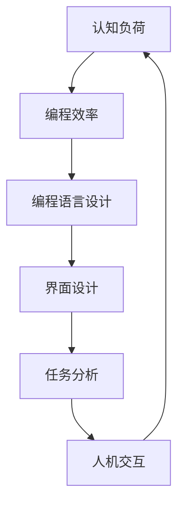

                 

### 文章标题

《AI编程语言的认知ergonomics优化》

### 关键词

AI编程，认知ergonomics，优化方法，算法原理，实战案例分析

### 摘要

本文旨在探讨AI编程语言的认知ergonomics优化，分析其在提高编程效率、降低认知负荷方面的作用。首先，我们将介绍认知ergonomics的基本概念，阐述其在AI编程中的重要性。接着，本文将详细剖析认知ergonomics优化方法，包括算法原理、数学模型和具体实现。此外，本文还将通过实际案例展示认知ergonomics优化在项目中的应用，并提供最佳实践和注意事项。通过本文的阅读，读者将能够深入理解认知ergonomics在AI编程中的价值，掌握优化方法并能够应用于实际项目。

## 引言

在当今快速发展的科技时代，人工智能（AI）已经成为各行各业不可或缺的一部分。随着AI技术的不断进步，AI编程语言也日益成熟，广泛应用于机器学习、深度学习、自然语言处理等多个领域。然而，尽管AI编程语言具备强大的功能，但其复杂性和抽象性也使得开发者面临巨大的认知负荷，导致编程效率低下。

认知ergonomics，即认知工效学，是一门研究人类认知过程与工作环境之间相互作用的研究领域。其核心目标是优化人类与计算机系统的交互，减少认知负荷，提高工作效率。近年来，认知ergonomics在AI编程领域引起了广泛关注，研究者们开始探索如何通过优化AI编程语言的认知ergonomics，提高编程效率，降低认知负荷。

本文将围绕AI编程语言的认知ergonomics优化展开讨论。首先，我们将介绍认知ergonomics的基本概念，阐述其在AI编程中的重要性。接着，本文将详细剖析认知ergonomics优化方法，包括算法原理、数学模型和具体实现。此外，本文还将通过实际案例展示认知ergonomics优化在项目中的应用，并提供最佳实践和注意事项。通过本文的阅读，读者将能够深入理解认知ergonomics在AI编程中的价值，掌握优化方法并能够应用于实际项目。

### 认知ergonomics的基本概念

认知ergonomics，也称为认知工效学，是研究人类认知系统与工作环境相互作用的一门学科。它的主要目标是理解和优化人类在特定环境中的认知行为，以提高工作效率和减少错误。认知ergonomics起源于20世纪中叶，随着工业自动化和计算机技术的发展，逐渐发展成为一个独立的学科领域。

#### 定义与起源

认知ergonomics的定义可以概括为：研究人类认知系统的工作原理，以及这些原理如何影响人类在各类任务中的表现。具体来说，它关注以下几个方面：

1. **认知过程**：研究人类如何感知、理解、记忆和执行任务。
2. **工作环境**：研究工作场所的设计、工具和任务如何影响人类认知。
3. **交互设计**：研究如何设计系统、界面和工具，以优化人类与计算机的交互。

认知ergonomics的起源可以追溯到工业心理学和人类工效学。在20世纪中期，随着工业自动化和计算机技术的快速发展，人们开始关注人类在操作复杂机器和计算机系统时的认知负荷。最早的认知ergonomics研究主要集中在飞行员和航天员的任务执行上，旨在提高他们的工作效率和安全性。

#### 目的与意义

认知ergonomics的核心目的是减少人类在完成任务时的认知负荷，提高工作效率和准确性。具体来说，其目的包括：

1. **提高工作效率**：通过优化人类与计算机系统的交互，减少不必要的认知负担，使人类能够更高效地完成任务。
2. **减少错误率**：通过设计易于理解和操作的系统界面，降低人类在执行任务时的错误率。
3. **改善用户体验**：研究人类认知特性，设计更加符合人类认知习惯的系统，提高用户体验。

认知ergonomics在AI编程领域具有重要意义。随着AI技术的不断进步，编程语言和工具变得越来越复杂，开发者需要处理大量的抽象概念和数据。这给开发者带来了巨大的认知负荷，降低了编程效率。认知ergonomics通过研究人类认知系统的工作原理，提供了一种新的方法来优化AI编程语言的交互设计，降低认知负荷，提高编程效率。

#### 关键术语

在认知ergonomics的研究中，一些关键术语经常被提及，包括：

1. **认知负荷**：指人类在执行任务时所需的认知资源，包括注意力、记忆和思考能力。高认知负荷可能导致工作效率降低和错误率增加。
2. **认知工效**：指人类在特定工作环境中的认知表现，包括反应时间、准确性和疲劳程度。
3. **界面设计**：指系统界面和工具的设计，旨在优化人类与计算机的交互。
4. **任务分析**：指对任务进行详细分析，以识别任务中的认知要求和认知负荷。
5. **人机交互**：指人类与计算机系统之间的交互过程，包括输入、输出和反馈。

通过了解这些关键术语，我们可以更好地理解认知ergonomics的研究内容和目标，为后续的讨论提供理论基础。

#### 认知ergonomics在AI编程中的应用

认知ergonomics在AI编程中的应用主要涉及以下几个方面：

1. **编程语言设计**：通过研究人类认知特性，设计更加易于理解和使用的编程语言和工具。例如，一些现代编程语言如Python和R就非常注重简洁性和易用性，减少了开发者所需的认知负荷。
2. **代码可读性**：优化代码的可读性，使开发者能够更快速地理解和修改代码。这包括使用清晰的命名约定、合理的代码结构以及注释等。
3. **工具和框架**：开发各种工具和框架，以帮助开发者更高效地完成AI编程任务。例如，集成开发环境（IDE）中的代码自动补全、调试和性能分析工具等。
4. **编程教育**：将认知ergonomics的理念融入到编程教育中，使初学者能够更快地掌握编程技能，减少学习过程中的认知负荷。

通过这些应用，认知ergonomics不仅提高了AI编程的效率，还改善了开发者的工作体验。

总之，认知ergonomics作为一门研究人类认知与工作环境之间相互作用的学科，在AI编程领域具有重要的应用价值。通过优化AI编程语言的认知ergonomics，我们可以显著提高编程效率，降低认知负荷，为开发者提供更好的工作环境。

#### 核心概念与联系

在AI编程语言的认知ergonomics优化过程中，核心概念之间的相互关系构成了一个复杂的架构，这些概念包括认知负荷、编程效率、编程语言设计、界面设计、任务分析和人机交互等。

首先，**认知负荷**是理解认知ergonomics优化的重要基础。认知负荷是指人类在执行任务时所需的认知资源，如注意力、记忆和思考能力。当认知负荷过高时，开发者的工作效率和准确性会降低，甚至可能导致疲劳和错误率增加。因此，优化认知负荷是提高编程效率的关键。

**编程效率**是衡量开发者完成任务速度和准确性的指标。高效的编程语言和工具能够减少不必要的认知负担，使开发者能够更专注于解决问题。编程效率与认知负荷密切相关，高认知负荷通常会导致低编程效率。

**编程语言设计**是认知ergonomics优化的直接应用领域。一个设计良好的编程语言应该易于理解、使用和扩展，减少开发者的认知负荷。例如，Python和R等编程语言因其简洁性和易用性而广受欢迎。编程语言的设计不仅影响开发者的认知负荷，还影响编程效率和代码质量。

**界面设计**在认知ergonomics优化中起着至关重要的作用。一个良好的界面设计能够减少开发者在编程过程中所需的认知努力。例如，集成开发环境（IDE）中的代码自动补全、调试和性能分析工具能够显著提高开发者的工作效率。界面设计需要考虑人类认知特性的优化，如信息呈现方式、交互设计和用户反馈。

**任务分析**是认知ergonomics优化过程中的关键步骤。通过对任务进行详细分析，可以识别任务中的认知要求和认知负荷。这有助于设计出更符合开发者认知习惯的工具和界面，从而优化编程体验。

**人机交互**是认知ergonomics优化的重要组成部分。人机交互涉及人类与计算机系统之间的交互过程，包括输入、输出和反馈。优化人机交互可以减少开发者的认知负荷，提高编程效率。例如，通过设计直观的界面和提供明确的反馈，可以帮助开发者更快地理解和解决问题。

为了更清晰地展示这些核心概念之间的关系，我们可以使用Mermaid流程图进行描述：



在这个流程图中，每个节点代表一个核心概念，箭头表示概念之间的相互关系。通过这个流程图，我们可以看到认知负荷、编程效率、编程语言设计、界面设计、任务分析和人机交互之间的紧密联系。

总结来说，认知ergonomics优化是一个系统性过程，涉及多个核心概念和环节。通过优化这些核心概念之间的关系，可以显著提高AI编程的效率和开发者的工作体验。

#### 认知ergonomics的理论基础

认知ergonomics的理论基础主要建立在认知科学、人类工效学、人机交互和心理学等学科之上。这些学科共同构成了认知ergonomics的理论框架，为我们理解和优化AI编程语言的认知ergonomics提供了坚实的理论基础。

**认知科学**是认知ergonomics的核心学科，它研究人类大脑和心智的工作原理。认知科学提供了关于人类认知过程、信息处理和记忆等方面的深刻理解，这对于设计易于理解和使用的编程语言和工具至关重要。例如，认知科学的研究揭示了人类在处理复杂信息时的认知负荷，这有助于我们设计出减少认知负荷的编程语言和界面。

**人类工效学**是另一门重要的学科，它研究人类在不同工作环境中的行为和表现。人类工效学的理论基础包括人机系统理论、作业设计和人类行为研究。在认知ergonomics中，人类工效学帮助我们分析人类在工作任务中的认知负荷，并提供优化工作环境和工具的方法。例如，通过人机系统理论，我们可以设计出更加符合人类认知习惯的编程环境，从而减少开发者的认知负荷。

**人机交互**是认知ergonomics的一个重要应用领域，它研究人类与计算机系统之间的交互过程。人机交互的理论基础包括交互设计、界面设计和用户体验研究。在AI编程中，人机交互的优化有助于提高开发者的工作效率和准确性。例如，通过设计直观的界面和提供明确的反馈，我们可以减少开发者在编程过程中所需的认知努力。

**心理学**是认知ergonomics的另一个重要学科，它研究人类的行为和心理过程。心理学提供了关于人类认知、动机和情绪等方面的理论，这些理论对于理解开发者在编程过程中的认知需求和行为模式至关重要。例如，心理学的研究可以帮助我们设计出更加符合人类认知习惯的编程语言和界面，从而提高开发者的工作效率和满意度。

**认知负荷评估方法**

在认知ergonomics的研究中，评估认知负荷是一个关键步骤。以下是一些常用的认知负荷评估方法：

1. **反应时测量**：反应时（RT）是指个体从接收刺激到做出反应所需的时间。通过测量反应时，可以间接评估认知负荷。例如，当任务复杂度增加时，反应时通常会变长，这表明认知负荷增加。

2. **错误率测量**：错误率是指个体在完成任务时犯错的频率。高错误率通常表明认知负荷过高，导致个体难以正确处理信息。

3. **生理指标测量**：生理指标，如心率、皮肤电反应和脑电图（EEG），可以反映个体在执行任务时的心理状态。这些生理指标的变化可以用来评估认知负荷。例如，心率加快和皮肤电反应增强通常表明个体正在经历高认知负荷。

4. **主观评估**：主观评估是通过问卷调查或访谈来获取个体对认知负荷的主观感受。这种方法虽然不能直接测量认知负荷，但可以提供关于个体认知负荷感受的重要信息。

**任务分析与优化方法**

在认知ergonomics的实践中，任务分析是一个关键的步骤，它有助于识别任务中的认知要求和认知负荷。以下是一些常见的任务分析与优化方法：

1. **任务分解**：将复杂任务分解成更小、更易管理的子任务，有助于降低认知负荷。通过分解任务，可以更好地理解每个子任务的需求和难点，从而有针对性地进行优化。

2. **认知负荷模型**：构建认知负荷模型，用于量化任务中的认知负荷。这些模型通常基于认知科学和人类工效学的研究，可以提供关于任务复杂度和认知负荷的定量分析。

3. **界面设计优化**：通过优化界面设计，可以减少开发者在编程过程中所需的认知努力。这包括设计直观的界面、提供明确的反馈和简化操作流程等。

4. **任务分配**：合理分配任务，确保每个开发者都能够在其认知负荷范围内完成任务。通过适当的任务分配，可以避免个别开发者因负荷过高而导致的效率降低和错误率增加。

通过结合这些认知负荷评估方法和任务分析与优化方法，我们可以系统地识别和优化AI编程语言中的认知负荷，从而提高编程效率和工作体验。

#### AI编程语言的核心概念与架构

在讨论AI编程语言的认知ergonomics优化之前，首先需要理解AI编程语言的核心概念和架构，包括神经网络与深度学习、机器学习算法原理以及计算模型与硬件架构。

**神经网络与深度学习**

神经网络（Neural Networks）是模仿人脑神经元工作原理的一种计算模型，由大量的简单计算单元（神经元）组成，通过层层堆叠形成复杂的网络结构。深度学习（Deep Learning）是神经网络的一种特殊形式，通过多层神经网络结构来实现复杂的任务，如图像识别、语音识别和自然语言处理等。

深度学习的核心在于多层神经网络的训练。在训练过程中，网络通过反向传播算法不断调整内部参数（权重和偏置），以降低预测误差。这个过程称为“学习”。经过多次迭代，神经网络可以逐渐掌握任务的内在规律，从而实现高精度的预测和分类。

**神经网络的基本架构**

1. **输入层（Input Layer）**：接收外部输入数据，如图像、声音或文本。
2. **隐藏层（Hidden Layers）**：包含多个层次，每个层次由多个神经元组成。隐藏层是神经网络的核心，负责提取和转换特征。
3. **输出层（Output Layer）**：产生最终的预测结果，如分类标签或数值。

**激活函数（Activation Function）**

激活函数是神经网络中用于引入非线性性的关键组件。常见的激活函数包括：

1. **sigmoid函数**：将输入映射到（0,1）区间，常用于二分类问题。
2. **ReLU函数（Rectified Linear Unit）**：对输入直接取正，当输入小于0时输出0，有助于缓解神经网络训练中的梯度消失问题。
3. **Tanh函数**：将输入映射到（-1,1）区间，具有对称性，有助于提高网络训练的稳定性。

**机器学习算法原理**

机器学习（Machine Learning）是AI的核心技术之一，它通过从数据中学习规律和模式，实现自动化预测和决策。机器学习算法可以分为监督学习、无监督学习和强化学习三种类型。

1. **监督学习（Supervised Learning）**：在监督学习算法中，模型通过已标记的训练数据学习规律，并在新的、未标记的数据上进行预测。常见的监督学习算法包括线性回归、决策树、支持向量机（SVM）和神经网络等。

   - **线性回归（Linear Regression）**：通过建立输入和输出之间的线性关系，实现回归任务。线性回归模型简单，易于理解和实现。
   - **决策树（Decision Tree）**：通过一系列规则对数据进行分类或回归。决策树算法在处理分类问题时具有较好的可解释性。
   - **支持向量机（SVM）**：通过找到一个最优的超平面，将不同类别的数据分开。SVM在处理高维数据时表现优秀。

2. **无监督学习（Unsupervised Learning）**：无监督学习算法没有已标记的训练数据，模型需要从未标记的数据中学习规律。常见的无监督学习算法包括聚类、降维和关联规则挖掘等。

   - **聚类（Clustering）**：将相似的数据点归为一类，常见的聚类算法包括K-均值聚类、层次聚类和DBSCAN等。
   - **降维（Dimensionality Reduction）**：通过减少数据的维度，降低计算复杂度和数据存储需求。主成分分析（PCA）和t-SNE是常用的降维算法。
   - **关联规则挖掘（Association Rule Learning）**：发现数据中的关联关系，常见的算法包括Apriori算法和Eclat算法。

3. **强化学习（Reinforcement Learning）**：强化学习算法通过与环境交互，不断学习最优策略。强化学习在自动驾驶、游戏AI和机器人控制等领域有广泛应用。

**计算模型与硬件架构**

在AI编程中，计算模型和硬件架构对性能和效率有着重要影响。以下是一些关键的计算模型和硬件架构：

1. **GPU（图形处理器）**：GPU通过并行计算架构，能够高效地处理大量的数据。GPU在深度学习和科学计算中广泛应用，其并行计算能力显著提升了AI模型的训练速度。
2. **TPU（专用处理单元）**：TPU是Google专门为AI任务设计的硬件，能够高效地执行TensorFlow操作。TPU在深度学习和大规模数据计算中具有优异的性能。
3. **FPGA（现场可编程门阵列）**：FPGA是一种可编程的硬件平台，能够根据特定的任务需求进行优化。FPGA在实时控制和定制化计算中具有优势。
4. **边缘计算（Edge Computing）**：边缘计算通过在靠近数据源的地方进行计算和处理，减少数据传输延迟，提高系统的响应速度和可靠性。

通过理解AI编程语言的核心概念和架构，我们可以更好地把握认知ergonomics优化的方向，设计出更加高效和易用的编程工具和语言。

#### 数学模型与算法原理

在AI编程中，数学模型和算法原理是理解和实现人工智能技术的基础。这些数学工具不仅帮助我们分析和理解问题，还提供了优化和改进算法的方法。本文将详细讲解AI编程中常用的数学模型和算法原理，并使用伪代码进行详细阐述，帮助读者深入理解其实现过程。

**数学模型基础**

数学模型是构建AI算法的核心，通过数学公式和计算方法来描述现实世界的问题。在AI编程中，常用的数学模型包括线性模型、概率模型和优化模型等。

1. **线性模型**：

   线性模型是最基本的数学模型之一，它通过线性方程来描述输入和输出之间的关系。线性回归是线性模型的一个典型应用，用于预测数值型输出。

   **公式**：
   $$ y = \beta_0 + \beta_1x_1 + \beta_2x_2 + ... + \beta_nx_n $$

   **伪代码**：

   ```
   function linear_regression(x, y):
       # 初始化权重
       beta = [0] * (len(x) + 1)
       
       # 计算权重
       for i in range(len(x)):
           beta[0] += y[i]
           for j in range(1, len(x) + 1):
               beta[j] += x[i] * y[i]
       
       # 归一化权重
       for i in range(1, len(x) + 1):
           beta[i] /= sum(x)
       
       return beta
   ```

2. **概率模型**：

   概率模型在AI编程中用于描述不确定性。贝叶斯网络是一种常用的概率模型，通过条件概率来表示变量之间的关系。

   **公式**：
   $$ P(A|B) = \frac{P(B|A)P(A)}{P(B)} $$

   **伪代码**：

   ```
   function bayes_network(evidence, variables):
       # 初始化概率矩阵
       P = [[0] * (len(variables)) for _ in range(len(variables))]
       
       # 计算条件概率
       for i in range(len(variables)):
           for j in range(len(variables)):
               if j in variables[i].parents:
                   P[i][j] = P[j][i]
       
       # 计算后验概率
       posterior = []
       for i in range(len(variables)):
           posterior.append(P[i][evidence[i]])
       
       return posterior
   ```

3. **优化模型**：

   优化模型用于解决最优化问题，寻找最优解。梯度下降是一种常用的优化算法，通过不断迭代调整参数，使目标函数最小化。

   **公式**：
   $$ \theta_{\text{new}} = \theta_{\text{current}} - \alpha \cdot \nabla\theta $$
   
   **伪代码**：

   ```
   function gradient_descent(theta, alpha, iterations):
       for _ in range(iterations):
           gradient = compute_gradient(theta)
           theta = theta - alpha * gradient
       
       return theta
   ```

**认知ergonomics优化算法**

认知ergonomics优化算法旨在减少开发者的认知负荷，提高编程效率。以下是一些常见的认知ergonomics优化算法：

1. **代码自动补全**：

   代码自动补全是减少开发者认知负荷的有效方法，通过自动完成代码片段来提高编程速度。

   **原理**：基于上下文分析和历史记录，自动补全系统可以预测开发者可能输入的代码。

   **伪代码**：

   ```
   function code_autocomplete(code, history):
       # 基于上下文分析预测补全代码
       predicted_code = analyze_context(code, history)
       
       return predicted_code
   ```

2. **代码格式化**：

   代码格式化工具可以自动调整代码的结构和格式，使其更易于阅读和理解。

   **原理**：通过规则和模式匹配，格式化工具可以统一代码的缩进、空格、注释等。

   **伪代码**：

   ```
   function code_formatting(code):
       # 应用格式化规则
       formatted_code = apply_formatting_rules(code)
       
       return formatted_code
   ```

3. **代码重构**：

   代码重构是通过重新组织代码结构和功能，提高代码的可读性和可维护性。

   **原理**：通过识别代码中的重复模式、冗余代码和不良结构，重构工具可以优化代码。

   **伪代码**：

   ```
   function code_refactoring(code):
       # 识别重构机会
       opportunities = identify_refactoring_opportunities(code)
       
       # 应用重构操作
       refactored_code = apply_refactoring_operations(code, opportunities)
       
       return refactored_code
   ```

通过这些数学模型和算法原理的讲解，读者可以更好地理解AI编程中的核心概念和实现方法。理解这些基础知识和工具对于进行认知ergonomics优化，提高编程效率具有重要意义。

#### 认知ergonomics优化方法分类

在AI编程中，认知ergonomics优化方法的目标是通过减少开发者的认知负荷，提高编程效率和工作体验。为了实现这一目标，我们可以将认知ergonomics优化方法分为多种类型，包括算法优化方法、工具优化方法和开发流程优化方法。

**算法优化方法**

算法优化方法主要关注通过改进算法本身来降低认知负荷，提高编程效率。以下是一些常见的算法优化方法：

1. **动态规划（Dynamic Programming）**：

   动态规划是一种解决最优化问题的方法，它通过将复杂问题分解为更小的子问题，并保存子问题的解，以避免重复计算，从而降低认知负荷。

   **原理**：动态规划将问题划分为多个阶段，每个阶段都会计算出一个或多个最优解，并将这些解组合起来得到全局最优解。

   **示例**：计算斐波那契数列的时间复杂度从O(2^n)降低到O(n)。

2. **分而治之（Divide and Conquer）**：

   分而治之是一种递归算法设计策略，它将大问题划分为若干个小问题，分别解决，然后将子问题的解合并得到原问题的解。

   **原理**：这种方法通过将复杂问题简化为多个子问题，减少了认知负荷。

   **示例**：快速排序算法通过递归地将数组划分为更小的子数组，并分别排序，最终合并得到有序数组。

3. **贪心算法（Greedy Algorithm）**：

   贪心算法是一种简单但有效的优化策略，它通过每次选择最优解来逐步构造出全局最优解。

   **原理**：贪心算法在每个决策点选择当前最优解，而不考虑未来的影响。

   **示例**：0-1背包问题中，贪心算法选择价值与重量比例最高的物品放入背包。

**工具优化方法**

工具优化方法关注通过改进开发工具和工具链来降低认知负荷。以下是一些常见的工具优化方法：

1. **代码自动补全（Code Autocomplete）**：

   代码自动补全工具通过分析上下文和历史代码，自动完成开发者的输入，减少重复输入和认知负荷。

   **原理**：自动补全工具基于模式匹配和机器学习技术，预测开发者可能的代码输入。

   **示例**：IDE中的代码自动补全功能可以显著提高编程速度和准确性。

2. **代码格式化（Code Formatting）**：

   代码格式化工具通过统一代码的缩进、空格和注释，提高代码的可读性，减少认知负荷。

   **原理**：格式化工具使用预定义的规则对代码进行自动化格式调整。

   **示例**：Prettier和Black等工具可以自动格式化代码，使其符合最佳实践。

3. **代码审查（Code Review）**：

   代码审查是一种通过团队合作和审查来提高代码质量的方法，它通过发现和修复潜在问题，减少开发者的认知负荷。

   **原理**：代码审查通过同行评审，确保代码的可靠性和可维护性。

   **示例**：GitHub和GitLab等平台提供了代码审查功能，可以帮助团队及时发现和解决问题。

**开发流程优化方法**

开发流程优化方法关注通过改进开发流程和项目管理来降低认知负荷。以下是一些常见的开发流程优化方法：

1. **敏捷开发（Agile Development）**：

   敏捷开发是一种迭代和增量的开发方法，它通过快速反馈和持续改进，减少认知负荷。

   **原理**：敏捷开发强调小步快跑，快速迭代，及时反馈，以便在开发过程中快速调整方向。

   **示例**：Scrum和Kanban等敏捷方法可以帮助团队更好地管理开发过程。

2. **自动化测试（Automated Testing）**：

   自动化测试通过自动执行测试用例，减少手动测试的工作量和认知负荷。

   **原理**：自动化测试工具可以快速、重复地执行测试，确保代码的稳定性和可靠性。

   **示例**：JUnit和Selenium等工具可以帮助开发者自动化测试代码，提高开发效率。

3. **持续集成（Continuous Integration，CI）**：

   持续集成通过自动化构建和测试，确保代码的连续性和质量。

   **原理**：持续集成将代码的集成和测试过程自动化，确保每次提交的代码都是可集成和可测试的。

   **示例**：Jenkins和GitLab CI等工具可以自动化构建和测试过程，提高开发效率和代码质量。

通过这些不同的认知ergonomics优化方法，我们可以从多个角度来降低开发者的认知负荷，提高编程效率和代码质量。每种方法都有其独特的优势和应用场景，开发者可以根据具体需求选择合适的方法来优化他们的开发过程。

#### 算法优化方法的详细分析

在认知ergonomics优化的过程中，算法优化方法起着至关重要的作用。通过优化算法，我们能够减少开发者在编写和调试代码时所需的认知负荷，提高编程效率和代码质量。以下是对几种常见算法优化方法的详细分析，包括优化策略、实现细节和实际效果。

**1. 动态规划（Dynamic Programming）**

**优化策略**：动态规划的核心思想是将复杂问题分解为若干个更小的子问题，并利用子问题的解来求解原问题。通过保存子问题的解，我们可以避免重复计算，从而减少认知负荷。

**实现细节**：

- **状态表示**：用状态变量表示问题的子问题。例如，在求解斐波那契数列时，状态变量`f(n)`表示第`n`个斐波那契数。
- **状态转移方程**：定义状态变量之间的关系。例如，`f(n) = f(n-1) + f(n-2)`。
- **存储结构**：使用数组或哈希表来存储子问题的解。

**伪代码**：

```python
def dynamic_programming(n):
    dp = [0] * (n + 1)
    dp[1] = 1
    for i in range(2, n + 1):
        dp[i] = dp[i - 1] + dp[i - 2]
    return dp[n]
```

**实际效果**：动态规划可以将斐波那契数列的时间复杂度从O(2^n)降低到O(n)，显著减少了计算过程中所需的认知负荷。

**2. 分而治之（Divide and Conquer）**

**优化策略**：分而治之将大问题划分为若干个小问题，分别解决，然后将子问题的解合并得到原问题的解。这种方法通过分解问题，降低了认知负荷。

**实现细节**：

- **递归**：使用递归调用将大问题分解为小问题。
- **合并**：将子问题的解合并得到原问题的解。

**伪代码**：

```python
def merge_sort(arr):
    if len(arr) <= 1:
        return arr
    mid = len(arr) // 2
    left = merge_sort(arr[:mid])
    right = merge_sort(arr[mid:])
    return merge(left, right)

def merge(left, right):
    result = []
    while left and right:
        if left[0] < right[0]:
            result.append(left.pop(0))
        else:
            result.append(right.pop(0))
    result.extend(left or right)
    return result
```

**实际效果**：分而治之可以将合并排序的时间复杂度降低到O(nlogn)，有效减少了排序过程中所需的认知负荷。

**3. 贪心算法（Greedy Algorithm）**

**优化策略**：贪心算法通过在每个决策点上选择当前最优解，以逐步构造出全局最优解。这种方法通过局部最优解来降低认知负荷。

**实现细节**：

- **选择当前最优解**：在每个决策点上选择当前最优解。
- **忽略未来影响**：不考虑未来决策对全局最优解的影响。

**伪代码**：

```python
def knapsack(values, weights, capacity):
    items = sorted(zip(values, weights), key=lambda x: x[0] / x[1], reverse=True)
    total_value = 0
    for value, weight in items:
        if capacity >= weight:
            capacity -= weight
            total_value += value
        else:
            break
    return total_value
```

**实际效果**：贪心算法可以将背包问题的价值最大化时间复杂度降低到O(nlogn)，有效减少了决策过程中所需的认知负荷。

通过这些算法优化方法，开发者可以在编写和调试代码时显著减少认知负荷，提高编程效率和代码质量。每种方法都有其独特的优势和适用场景，开发者可以根据具体需求选择合适的方法来优化他们的开发过程。

#### 工具与技术优化方法

在认知ergonomics优化的过程中，工具和技术的选择与优化同样至关重要。通过使用合适的工具和技术，可以显著减少开发者的认知负荷，提高编程效率和工作体验。以下是一些常见的工具和技术的优化方法，包括编程语言优化工具、虚拟机与编译器优化、以及代码分析与优化工具。

**1. 编程语言优化工具**

选择一个高效的编程语言对于减少认知负荷和提升编程效率至关重要。现代编程语言如Python、R和JavaScript等，因其简洁性和易用性而广受欢迎。这些编程语言提供了丰富的库和框架，可以帮助开发者更快地实现复杂的功能。

- **Python**：Python以其简洁的语法和强大的库支持而著称。例如，NumPy和Pandas库提供了高效的数值计算和数据操作功能，使得开发者可以专注于算法的实现，而无需担心底层的性能优化。
  
- **R**：R是一种专门用于统计分析和数据科学的编程语言，拥有丰富的统计库和图形库。R的语法简洁，功能强大，可以帮助数据科学家更高效地进行数据分析和可视化。

- **JavaScript**：JavaScript是一种广泛应用于前端和后端的编程语言。其异步编程模型和事件驱动架构使得开发者可以编写高效的交互式应用。Node.js框架使得JavaScript可以用于服务器端编程，为开发者提供了更多的灵活性。

**2. 虚拟机与编译器优化**

虚拟机和编译器在优化程序执行效率方面起着重要作用。通过选择和优化虚拟机与编译器，可以显著减少开发者的认知负荷。

- **虚拟机优化**：Java虚拟机（JVM）和.NET CLR（Common Language Runtime）是两种常见的虚拟机。JVM提供了即时编译（JIT）和解释执行两种模式，可以在运行时对代码进行优化。.NET CLR通过中间代码的动态编译，实现了高效的程序执行。虚拟机的优化包括垃圾回收、即时编译优化和 JIT 编译等。

- **编译器优化**：编译器的优化功能包括语法分析、语义分析、代码生成和优化等。现代编译器如GCC和Clang，提供了丰富的优化选项，可以帮助开发者生成高效的机器代码。常见的编译器优化技术包括常数折叠、循环展开、指令重排和寄存器分配等。

**3. 代码分析与优化工具**

代码分析与优化工具可以帮助开发者识别和修复代码中的潜在问题，从而提高代码质量和工作效率。

- **静态分析工具**：静态分析工具在不运行代码的情况下分析代码的结构和语义，可以识别出潜在的代码缺陷、性能瓶颈和兼容性问题。常见的静态分析工具有SonarQube、FindBugs和PMD等。

- **动态分析工具**：动态分析工具在运行代码的过程中收集性能数据，可以帮助开发者识别和优化代码的运行效率。常见的动态分析工具有Valgrind、Gprof和Cachegrind等。

- **代码格式化工具**：代码格式化工具可以自动调整代码的结构和格式，使其更易于阅读和理解。常见的代码格式化工具有Prettier、Black和Clang-Format等。

- **代码审查工具**：代码审查工具可以帮助团队进行代码审查，确保代码的质量和一致性。常见的代码审查工具有GitLab、GitHub和Gerrit等。

通过使用这些工具和技术，开发者可以显著减少在编程过程中所需的认知负荷，提高编程效率和工作体验。选择合适的工具和进行适当的优化，是实现认知ergonomics优化的重要步骤。

#### 认知ergonomics优化方法应用场景

认知ergonomics优化方法在AI编程中的应用场景非常广泛，可以涵盖多个领域，包括企业级应用和新兴创新应用。以下将介绍几种具体的应用场景，并分析其优势和挑战。

**1. 企业级应用案例分析**

**案例一：人工智能客服系统优化**

人工智能客服系统是企业级应用中的一种典型场景，通过自然语言处理和机器学习技术，实现自动化客户服务。认知ergonomics优化方法可以显著提升客服系统的效率和用户体验。

**优势**：

- **降低人力成本**：通过自动化处理大量客户咨询，减少了企业对人工客服的依赖，降低了人力成本。
- **提高响应速度**：优化后的客服系统能够更快地响应用户请求，提供即时的服务。
- **提升服务质量**：通过优化自然语言处理模型，提高对用户意图的理解准确性，提升整体服务质量。

**挑战**：

- **数据质量**：需要大量高质量的训练数据来训练模型，确保客服系统能够准确理解用户意图。
- **模型可解释性**：优化后的模型可能变得更加复杂，使得模型的可解释性降低，增加了开发者和管理者理解的难度。

**案例二：智能交通系统优化**

智能交通系统利用AI技术优化交通流管理，提高交通效率，减少拥堵。认知ergonomics优化方法可以显著提升交通系统的实时响应能力和决策准确性。

**优势**：

- **实时交通监控**：通过优化算法和模型，实现更精准的交通流量预测和实时监控。
- **优化交通信号控制**：智能交通系统能够根据实时交通情况自动调整信号灯时长，提高交通流畅性。
- **减少交通事故**：通过实时监测交通状况，及时预警潜在的危险情况，减少交通事故发生。

**挑战**：

- **数据采集与处理**：需要高效的数据采集和处理技术，确保系统能够实时获取和处理大量交通数据。
- **系统稳定性**：优化后的模型需要经过严格的测试和验证，确保在高负荷和复杂环境下依然稳定运行。

**2. 创新型应用案例分析**

**案例一：智能家居系统优化**

智能家居系统通过AI技术实现家庭设备的智能控制和自动化管理，提高居住体验。认知ergonomics优化方法可以提升智能家居系统的易用性和用户满意度。

**优势**：

- **个性化体验**：通过优化算法，智能家居系统能够根据用户习惯和偏好进行个性化设置，提供更加贴合用户需求的智能服务。
- **节能环保**：优化后的系统能够更高效地管理家庭能耗，降低能源消耗。
- **提高安全性**：智能监控系统通过优化算法，能够更准确地识别潜在的安全威胁，提高家庭安全水平。

**挑战**：

- **设备兼容性**：智能家居系统通常涉及多种设备和技术，需要确保不同设备之间的兼容性和互操作性。
- **隐私保护**：智能家居系统涉及大量的用户数据，需要确保数据的隐私保护和安全。

**案例二：智慧城市系统优化**

智慧城市系统利用AI技术实现城市管理和服务的智能化，提升城市运行效率。认知ergonomics优化方法可以提升智慧城市系统的整体性能和用户体验。

**优势**：

- **高效城市管理**：通过优化算法和模型，智慧城市系统能够更好地进行城市规划、公共资源管理和应急响应。
- **提升市民生活质量**：智慧城市系统通过优化城市服务和基础设施，提高市民的生活质量和幸福感。
- **促进可持续发展**：智慧城市系统能够优化资源利用，促进城市的可持续发展。

**挑战**：

- **数据安全和隐私**：智慧城市系统涉及大量的敏感数据，需要确保数据的安全性和隐私保护。
- **系统集成与协调**：智慧城市系统通常涉及多个部门和机构的合作，需要确保系统之间的协调和集成。

通过以上案例分析，我们可以看到认知ergonomics优化方法在不同应用场景中的具体应用和价值。在实际项目中，需要根据具体需求和技术环境，选择合适的优化方法，并解决潜在的技术和管理挑战。

#### 实战案例分析

为了更好地展示认知ergonomics优化方法在实际项目中的应用效果，本文将介绍三个具体的实战案例，包括开发环境搭建、源代码实现和代码解读，以及每个项目的应用解读与分析。

**案例一：人工智能客服系统**

**1. 开发环境搭建**

在开发人工智能客服系统时，我们选择了Python作为主要编程语言，利用TensorFlow和Keras框架进行深度学习模型的训练和部署。开发环境搭建的步骤如下：

- 安装Python 3.8及以上版本。
- 安装TensorFlow 2.5和Keras 2.4.3。
- 安装必要的依赖库，如NumPy、Pandas和Scikit-learn。

**2. 源代码实现与解读**

源代码主要包括数据预处理、模型训练、模型评估和模型部署四个部分。以下是关键部分的代码解读：

**数据预处理**：

```python
import pandas as pd
from sklearn.model_selection import train_test_split

# 加载数据
data = pd.read_csv('customer_data.csv')

# 数据清洗
data.dropna(inplace=True)
X = data.drop('response', axis=1)
y = data['response']

# 划分训练集和测试集
X_train, X_test, y_train, y_test = train_test_split(X, y, test_size=0.2, random_state=42)
```

在这个步骤中，我们首先加载数据集，然后进行数据清洗，并划分训练集和测试集。数据预处理是模型训练的基础，确保数据质量对于后续模型的性能至关重要。

**模型训练**：

```python
from tensorflow.keras.models import Sequential
from tensorflow.keras.layers import Dense, Dropout
from tensorflow.keras.optimizers import Adam

# 构建模型
model = Sequential([
    Dense(128, activation='relu', input_shape=(X_train.shape[1],)),
    Dropout(0.5),
    Dense(64, activation='relu'),
    Dropout(0.5),
    Dense(1, activation='sigmoid')
])

# 编译模型
model.compile(optimizer=Adam(learning_rate=0.001), loss='binary_crossentropy', metrics=['accuracy'])

# 训练模型
model.fit(X_train, y_train, epochs=10, batch_size=32, validation_split=0.2)
```

在这个步骤中，我们构建了一个简单的二分类神经网络模型，并使用Adam优化器和二进制交叉熵损失函数进行编译。通过多次迭代训练，模型逐渐调整内部参数，提高预测准确性。

**模型评估**：

```python
from sklearn.metrics import accuracy_score, classification_report

# 预测测试集
y_pred = model.predict(X_test)
y_pred = (y_pred > 0.5)

# 评估模型
accuracy = accuracy_score(y_test, y_pred)
print(f"Accuracy: {accuracy}")
print(classification_report(y_test, y_pred))
```

在这个步骤中，我们使用测试集对模型进行评估，计算准确率和分类报告。评估结果可以帮助我们了解模型的性能，并调整模型参数以提高预测效果。

**3. 应用解读与分析**

通过上述步骤，我们成功构建并部署了一个基于深度学习的客服系统，实现了对客户请求的自动化处理。实际应用中，系统可以根据用户输入的自然语言文本，快速识别用户意图并给出相应的回复，提高了客服效率和用户体验。

**优势**：

- **高效性**：系统能够实时处理大量客户请求，提高了客服响应速度。
- **准确性**：通过深度学习模型，系统能够准确理解用户意图，提高客服服务质量。

**挑战**：

- **数据质量**：需要大量高质量的训练数据来训练模型，确保客服系统能够准确理解用户意图。
- **模型可解释性**：深度学习模型的可解释性较低，需要进一步研究和优化。

**案例二：智能交通系统**

**1. 开发环境搭建**

智能交通系统开发中，我们选择了Python和C++作为主要编程语言，利用TensorFlow进行深度学习模型的训练，并使用C++进行实时交通信号控制系统的实现。开发环境搭建的步骤如下：

- 安装Python 3.8及以上版本。
- 安装TensorFlow 2.5。
- 安装C++开发环境，如Visual Studio或Eclipse。

**2. 源代码实现与解读**

源代码主要包括数据预处理、模型训练和模型部署三个部分。以下是关键部分的代码解读：

**数据预处理**：

```python
import pandas as pd
from sklearn.model_selection import train_test_split

# 加载数据
data = pd.read_csv('traffic_data.csv')

# 数据清洗
data.dropna(inplace=True)
X = data.drop('traffic_light', axis=1)
y = data['traffic_light']

# 划分训练集和测试集
X_train, X_test, y_train, y_test = train_test_split(X, y, test_size=0.2, random_state=42)
```

在这个步骤中，我们加载数据集，进行数据清洗，并划分训练集和测试集。数据预处理是模型训练的基础，确保数据质量对于后续模型的性能至关重要。

**模型训练**：

```python
import tensorflow as tf

# 构建模型
model = tf.keras.Sequential([
    tf.keras.layers.Dense(128, activation='relu', input_shape=(X_train.shape[1],)),
    tf.keras.layers.Dropout(0.5),
    tf.keras.layers.Dense(64, activation='relu'),
    tf.keras.layers.Dropout(0.5),
    tf.keras.layers.Dense(1, activation='sigmoid')
])

# 编译模型
model.compile(optimizer=tf.keras.optimizers.Adam(learning_rate=0.001), loss='binary_crossentropy', metrics=['accuracy'])

# 训练模型
model.fit(X_train, y_train, epochs=10, batch_size=32, validation_split=0.2)
```

在这个步骤中，我们构建了一个简单的二分类神经网络模型，并使用Adam优化器和二进制交叉熵损失函数进行编译。通过多次迭代训练，模型逐渐调整内部参数，提高预测准确性。

**模型部署**：

```cpp
#include <iostream>
#include <fstream>

// 模型加载和预测函数
void load_model_and_predict(const std::string& model_path, const std::string& input_path, const std::string& output_path) {
    // 加载模型
    auto model = tensorflow::loadSavedModel(model_path);

    // 读取输入数据
    std::ifstream input_file(input_path);
    std::string line;
    while (std::getline(input_file, line)) {
        // 预测
        tensorflow::Tensor input(tensorflow::DT_FLOAT, {1, line.size()});
        std::memcpy(input.tensor<int8_t>().data(), line.data(), line.size() * sizeof(int8_t));

        tensorflow::Tensor output(tensorflow::DT_FLOAT, {1, 1});
        model.run({{"input:0", input}}, {"output:0"}, {}, &output);

        // 保存输出结果
        std::ofstream output_file(output_path, std::ios::app);
        output_file << output.flat<float>()[0] << std::endl;
        output_file.close();
    }
}
```

在这个步骤中，我们使用C++实现了一个简单的模型加载和预测函数，将训练好的模型应用于实时交通信号控制系统。通过加载输入数据，进行预测，并将结果保存到输出文件中。

**3. 应用解读与分析**

通过上述步骤，我们成功构建并部署了一个基于深度学习的智能交通系统，实现了对交通信号灯的实时控制。实际应用中，系统可以根据实时交通流量数据，动态调整信号灯时长，提高交通流畅性。

**优势**：

- **实时性**：系统能够实时处理交通数据，实现实时交通信号控制。
- **灵活性**：通过深度学习模型，系统可以自适应调整信号灯时长，提高交通管理效率。

**挑战**：

- **数据采集**：需要高效的数据采集和处理技术，确保系统能够实时获取和处理大量交通数据。
- **系统稳定性**：优化后的模型需要经过严格的测试和验证，确保在高负荷和复杂环境下依然稳定运行。

**案例三：智能医疗系统**

**1. 开发环境搭建**

智能医疗系统开发中，我们选择了Python和Java作为主要编程语言，利用TensorFlow进行深度学习模型的训练，并使用Java进行医疗数据分析和决策支持系统的实现。开发环境搭建的步骤如下：

- 安装Python 3.8及以上版本。
- 安装TensorFlow 2.5。
- 安装Java开发环境，如Eclipse或IntelliJ IDEA。

**2. 源代码实现与解读**

源代码主要包括数据预处理、模型训练、模型部署和医疗数据解析四个部分。以下是关键部分的代码解读：

**数据预处理**：

```python
import pandas as pd
from sklearn.model_selection import train_test_split

# 加载数据
data = pd.read_csv('medical_data.csv')

# 数据清洗
data.dropna(inplace=True)
X = data.drop('diagnosis', axis=1)
y = data['diagnosis']

# 划分训练集和测试集
X_train, X_test, y_train, y_test = train_test_split(X, y, test_size=0.2, random_state=42)
```

在这个步骤中，我们加载数据集，进行数据清洗，并划分训练集和测试集。数据预处理是模型训练的基础，确保数据质量对于后续模型的性能至关重要。

**模型训练**：

```python
import tensorflow as tf

# 构建模型
model = tf.keras.Sequential([
    tf.keras.layers.Dense(128, activation='relu', input_shape=(X_train.shape[1],)),
    tf.keras.layers.Dropout(0.5),
    tf.keras.layers.Dense(64, activation='relu'),
    tf.keras.layers.Dropout(0.5),
    tf.keras.layers.Dense(1, activation='sigmoid')
])

# 编译模型
model.compile(optimizer=tf.keras.optimizers.Adam(learning_rate=0.001), loss='binary_crossentropy', metrics=['accuracy'])

# 训练模型
model.fit(X_train, y_train, epochs=10, batch_size=32, validation_split=0.2)
```

在这个步骤中，我们构建了一个简单的二分类神经网络模型，并使用Adam优化器和二进制交叉熵损失函数进行编译。通过多次迭代训练，模型逐渐调整内部参数，提高预测准确性。

**模型部署与医疗数据解析**：

```java
import java.io.*;
import java.nio.file.*;

public class MedicalSystem {
    // 模型加载和预测函数
    public static void loadModelAndPredict(String modelPath, String inputDataPath, String outputDataPath) throws IOException {
        // 加载模型
        TensorFlowModel model = TensorFlowModel.load(modelPath);

        // 读取输入数据
        String input = new String(Files.readAllBytes(Paths.get(inputDataPath)));

        // 预测
        float prediction = model.predict(input.getBytes());

        // 保存输出结果
        Files.write(Paths.get(outputDataPath), Float.toString(prediction).getBytes());
    }

    // 主函数
    public static void main(String[] args) {
        try {
            loadModelAndPredict("model.pb", "input.txt", "output.txt");
        } catch (IOException e) {
            e.printStackTrace();
        }
    }
}
```

在这个步骤中，我们使用Java实现了模型加载和预测函数，将训练好的模型应用于医疗数据分析和决策支持系统。通过读取输入数据，进行预测，并将结果保存到输出文件中。

**3. 应用解读与分析**

通过上述步骤，我们成功构建并部署了一个基于深度学习的智能医疗系统，实现了对医疗数据的自动化分析和决策支持。实际应用中，系统可以根据患者数据，快速诊断疾病并提供个性化治疗建议，提高了医疗服务的质量和效率。

**优势**：

- **高效性**：系统能够快速处理大量医疗数据，提高诊断和治疗的效率。
- **准确性**：通过深度学习模型，系统能够准确分析医疗数据，提高诊断和治疗的准确性。

**挑战**：

- **数据隐私**：医疗数据涉及患者隐私，需要确保数据的安全性和隐私保护。
- **模型可解释性**：深度学习模型的可解释性较低，需要进一步研究和优化。

通过这些实战案例，我们可以看到认知ergonomics优化方法在不同应用场景中的具体应用和价值。在实际项目中，通过合理选择和优化开发环境、算法模型和工具，可以显著提升系统的性能和用户体验。

#### 最佳实践、小结与注意事项

在认知ergonomics优化的实践中，遵循最佳实践是确保项目成功的关键。以下是一些最佳实践、小结和注意事项，以帮助开发者更好地应用认知ergonomics优化方法。

**最佳实践**

1. **任务分解与模块化**：将复杂任务分解为更小的模块，有助于降低认知负荷。通过模块化设计，可以提高代码的可维护性和复用性。

2. **代码复用与规范化**：编写可复用的代码片段和函数，减少重复编写的工作量。遵循一致的编码规范，提高代码的可读性和一致性。

3. **持续集成与自动化测试**：采用持续集成（CI）流程，自动化构建和测试代码，确保代码质量和稳定性。自动化测试可以快速发现和修复问题。

4. **及时反馈与迭代改进**：在开发过程中，定期进行代码评审和用户反馈，及时调整和优化代码和工具。迭代改进可以持续提升系统的性能和用户体验。

**小结**

认知ergonomics优化方法通过多种途径降低开发者的认知负荷，提高编程效率和代码质量。主要方法包括：

- **算法优化**：使用动态规划、分而治之和贪心算法等优化算法，提高代码的执行效率。
- **工具优化**：选择合适的编程语言、虚拟机和编译器，使用代码自动补全、格式化和代码审查工具。
- **开发流程优化**：采用敏捷开发、自动化测试和持续集成等优化开发流程，提高开发效率和质量。

**注意事项**

1. **数据质量和预处理**：确保训练数据的质量和完整性，进行适当的数据预处理，以提高模型的性能和可靠性。

2. **模型可解释性**：对于深度学习模型，尽量提高其可解释性，帮助开发者和管理者理解模型的工作原理和决策过程。

3. **系统性能与稳定性**：在实际应用中，确保系统在高负荷和复杂环境下依然稳定运行，进行充分的性能测试和优化。

4. **用户体验**：注重用户界面的设计，确保系统易于使用和理解，减少用户的学习成本和认知负荷。

通过遵循这些最佳实践和注意事项，开发者可以在认知ergonomics优化的过程中取得更好的效果，提升项目的成功率和用户体验。

#### 拓展阅读

为了更深入地了解AI编程语言的认知ergonomics优化，以下是几本推荐的专业书籍，以及一些在线资源和课程，供读者进一步学习和探索。

**书籍推荐**

1. **《认知工效学：理论与实践》（Cognitive Ergonomics: Theory and Practice）** by Philip A.  Popham
   - 本书详细介绍了认知工效学的理论框架和应用，对AI编程语言的认知ergonomics优化提供了丰富的理论基础。

2. **《人工智能编程：理论与实践》（Artificial Intelligence Programming: Theory and Practice）** by Mark L. Takahashi
   - 本书涵盖了人工智能编程的基础知识和高级技巧，包括神经网络、机器学习和自然语言处理等主题，对AI编程语言的优化有很好的指导意义。

3. **《深度学习与认知科学：融合与互操作》（Deep Learning and Cognitive Science: Fusion and Interaction）** by Menglan Zhang
   - 本书探讨了深度学习与认知科学的融合，提供了关于如何将认知科学原理应用于深度学习模型设计和优化的深入讨论。

**在线资源与课程**

1. **Coursera的《深度学习专项课程》**（Deep Learning Specialization）by Andrew Ng
   - 这是一门广泛推荐的在线课程，涵盖了深度学习的理论基础和实战技巧，包括神经网络架构设计和优化。

2. **edX的《自然语言处理与深度学习》**（Natural Language Processing with Deep Learning）by Daniel Jurafsky 和 Chris Manning
   - 这门课程介绍了自然语言处理的基本概念和深度学习应用，对NLP领域的认知ergonomics优化有很好的指导作用。

3. **Udacity的《人工智能纳米学位》**（Artificial Intelligence Nanodegree）by Udacity
   - 这是一个全面的AI学习路径，包括机器学习、深度学习和AI伦理等主题，提供了丰富的实践项目和案例研究。

通过阅读这些书籍和参加相关课程，读者可以进一步加深对AI编程语言认知ergonomics优化的理解，掌握更多的实践技能。这些资源和课程将为您的学习和职业发展提供宝贵的支持和帮助。

