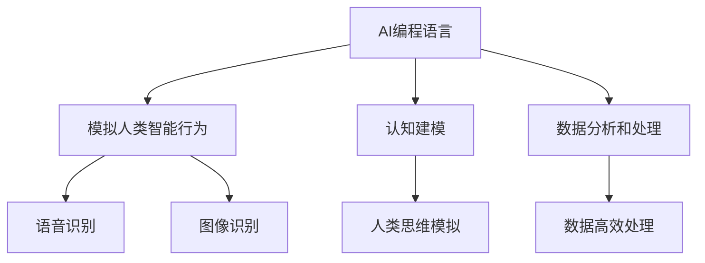

                 

### AI编程语言的认知科学实验方法论

#### 1. 引言

人工智能（AI）编程语言是使计算机模拟人类智能行为的关键工具。随着认知科学的不断发展，AI编程语言的研究逐渐与认知科学实验方法论相结合，形成了一种新的研究方法。本文旨在探讨AI编程语言的认知科学实验方法论，为人工智能领域的研究者提供一种新的研究思路。

AI编程语言，如Python、Java、Lisp等，通过定义语法和语义，使计算机能够执行复杂的任务，如自然语言处理、图像识别、决策制定等。而认知科学则研究人类思维、感知和决策的内在机制，旨在揭示人类智能的本质。

#### 2. 核心概念与联系

**AI编程语言**与**认知科学**之间的联系体现在以下几个方面：

1. **模拟人类智能行为**：AI编程语言通过编写程序来模拟人类智能行为，如语音识别、图像识别等。
2. **认知建模**：认知科学实验常使用AI编程语言来构建认知模型，模拟人类思维过程，以便更好地理解人类智能。
3. **数据分析和处理**：认知科学实验产生的大量数据需要通过AI编程语言进行高效的处理和分析。

为了更直观地展示AI编程语言与认知科学之间的联系，我们可以使用Mermaid流程图来表示：



#### 3. 核心算法原理讲解

AI编程语言中涉及的核心算法主要包括神经网络、决策树、支持向量机等。以下以神经网络算法为例，使用伪代码详细阐述其原理。

**神经网络算法伪代码：**

```python
# 定义神经网络结构
input_layer = [x1, x2, ..., xn]
hidden_layer = [h1, h2, ..., hn]
output_layer = [o1, o2, ..., om]

# 定义激活函数（以Sigmoid函数为例）
activation_function(z):
    return 1 / (1 + e^(-z))

# 前向传播
for each hidden_neuron in hidden_layer:
    z = dot_product(input_layer, weights)
    hidden_neuron = activation_function(z)

for each output_neuron in output_layer:
    z = dot_product(hidden_layer, weights)
    output_neuron = activation_function(z)

# 计算损失函数（以均方误差为例）
loss = sum((expected_output - actual_output)^2) / 2

# 反向传播
d_output = (expected_output - actual_output) * activation_function_derivative(output_neuron)
d_hidden = dot_product(d_output, weights_T) * activation_function_derivative(hidden_neuron)

# 更新权重
weights += learning_rate * d_hidden * input_layer_T
```

#### 4. 数学模型与公式

神经网络算法中的数学模型和公式是理解其工作原理的关键。以下是一些基本的数学模型和公式：

**Sigmoid函数：**
$$
\sigma(z) = \frac{1}{1 + e^{-z}}
$$

**均方误差（MSE）损失函数：**
$$
MSE = \frac{1}{2} \sum_{i=1}^{m} (y_i - \hat{y}_i)^2
$$

**反向传播算法中的梯度计算：**
$$
\frac{\partial J}{\partial W} = \frac{\partial}{\partial W} \left( \sum_{i=1}^{m} (y_i - \hat{y}_i)^2 \right)
$$

#### 5. 实验方法论

认知科学实验方法论是结合AI编程语言进行实验研究的核心。以下是一个典型的认知科学实验方法论流程：

1. **实验设计**：明确实验目的、受试者选择、实验步骤等。
2. **数据采集**：通过AI编程语言实现实验系统，采集实验数据。
3. **数据处理**：使用AI编程语言对采集到的数据进行清洗、转换和分析。
4. **实验分析**：通过统计分析方法对数据进行分析，验证实验假设。
5. **结果解释与验证**：对实验结果进行解释，并与现有理论进行验证。

#### 6. 应用实践

**案例1：自然语言处理**

通过使用AI编程语言，如Python，构建自然语言处理系统，实现文本分类、情感分析等任务。以下是一个简单的文本分类的代码示例：

```python
from sklearn.feature_extraction.text import TfidfVectorizer
from sklearn.naive_bayes import MultinomialNB

# 文本数据
text_data = ["这是一篇关于人工智能的文章", "这篇文章讨论了自然语言处理技术"]

# 词频矩阵
tfidf_vectorizer = TfidfVectorizer()
tfidf_matrix = tfidf_vectorizer.fit_transform(text_data)

# 训练模型
classifier = MultinomialNB()
classifier.fit(tfidf_matrix, labels)

# 测试文本
test_text = ["人工智能技术正在快速发展"]

# 预测
predicted_labels = classifier.predict(tfidf_vectorizer.transform(test_text))
```

**案例2：图像识别**

使用Python的OpenCV库进行图像识别任务。以下是一个简单的图像识别代码示例：

```python
import cv2

# 读取图像
image = cv2.imread("example.jpg")

# 特征提取
gray_image = cv2.cvtColor(image, cv2.COLOR_BGR2GRAY)
features = cv2.SIFT().detectAndCompute(gray_image, None)

# 模型加载
model = cv2.xfeatures2d.SIFT_create()

# 搜索匹配
keypoints1, descriptors1 = model.detectAndCompute(image1, None)
keypoints2, descriptors2 = model.detectAndCompute(image2, None)
matcher = cv2.BFMatcher()
matches = matcher.knnMatch(descriptors1, descriptors2, k=2)

# 匹配结果
good_matches = []
for m, n in matches:
    if m.distance < 0.7 * n.distance:
        good_matches.append(m)

# 绘制匹配结果
img_matches = cv2.drawMatches(image1, keypoints1, image2, keypoints2, good_matches, None, flags=2)
cv2.imshow('img_matches', img_matches)
cv2.waitKey(0)
cv2.destroyAllWindows()
```

#### 7. 总结与展望

AI编程语言的认知科学实验方法论为人工智能领域的研究提供了新的思路和方法。通过结合AI编程语言和认知科学实验方法论，我们可以更好地理解人类智能，开发出更高效、更智能的人工智能系统。未来，这一方法有望在自然语言处理、图像识别、智能决策等领域取得更多突破。

### 注意事项与拓展阅读

- 在进行AI编程语言的认知科学实验时，需要注意实验设计的科学性、数据的可靠性和分析方法的合理性。
- 拓展阅读方面，可以参考以下书籍和论文：
  - 《认知科学导论》（Michael S. Gazzaniga 著）
  - 《深度学习》（Ian Goodfellow、Yoshua Bengio、Aaron Courville 著）
  - 《认知科学：探索人类智能的奥秘》（Michael Arbib 著）
  - 相关论文和最新研究动态。

**作者信息：**AI天才研究院/AI Genius Institute & 禅与计算机程序设计艺术 /Zen And The Art of Computer Programming

