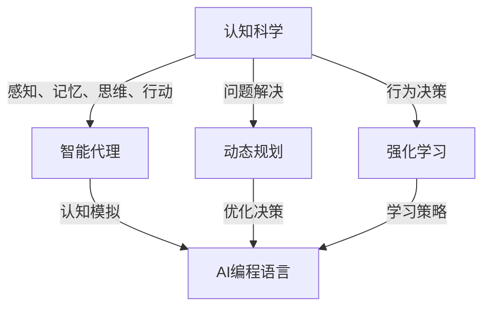

                 

# AI编程语言的认知科学验证方法论

## 关键词
人工智能（AI），认知科学，编程语言，验证方法论，智能代理，动态规划，强化学习

## 摘要
本文旨在探讨AI编程语言的认知科学验证方法论。通过引入认知科学的基本概念，本文详细阐述了AI编程语言的核心概念与认知科学的联系，并介绍了认知科学验证方法论的基本原理和应用步骤。随后，本文通过案例研究，展示了如何在实际中应用认知科学验证方法论来验证AI编程语言的有效性。最后，本文对未来AI编程语言在认知科学验证方法中的发展进行了展望。

## 引言

### AI编程语言概述
人工智能（AI）编程语言是一类专门为开发智能系统而设计的语言。它们通常包含了一些与AI相关的高级概念，如机器学习、深度学习、自然语言处理等。AI编程语言可以分为两大类：基于规则的编程语言和基于学习的编程语言。

基于规则的编程语言，如Prolog和Kappa，通过预先定义的规则来模拟智能行为。程序员需要详细编写所有可能的规则和条件，以便系统能够根据输入数据做出决策。

基于学习的编程语言，如Lisp和Python，通过从数据中学习模式来生成智能行为。这些语言通常提供了一些内置的学习算法，如决策树、神经网络等，使得开发人员能够更容易地实现智能系统。

### 认知科学的背景
认知科学是一门跨学科的研究领域，它试图理解人类思维和智能的本质。认知科学的核心问题是：人类是如何通过感知、记忆、思维和行动来适应复杂环境的？

认知科学涉及多个子领域，包括心理学、神经科学、人工智能、语言学等。它的目标是建立一个统一的框架，解释人类认知过程的工作原理。

### 验证方法论的重要性
验证方法论是确保AI编程语言和系统有效性和可靠性的关键。通过验证，我们可以确定系统是否按照预期工作，是否能够解决实际问题，以及是否具备良好的性能。

在AI编程语言中，验证方法论尤为重要，因为AI系统的复杂性和不确定性使得错误或缺陷可能导致严重的后果。认知科学验证方法论提供了一种系统的方法，用于评估AI编程语言在模拟人类认知过程方面的有效性。

### 认知科学基础知识
#### 1.4.1 认知科学的基本原理
认知科学的基本原理包括感知与知觉、记忆与学习、思维与推理、语言与沟通。这些原理构成了认知科学的核心框架，帮助我们理解人类是如何感知和解释世界的。

- **感知与知觉**：人类通过感官接收外部信息，如视觉、听觉、触觉等。知觉是将这些感官信息转化为有意义的信息的过程。

- **记忆与学习**：记忆是存储和检索信息的能力。学习是通过经验改变行为和思维过程的过程。认知科学研究了不同类型的记忆（如短期记忆、长期记忆）和学习机制。

- **思维与推理**：思维是人类处理信息和解决问题的能力。推理是通过逻辑关系和规则从已知信息推导出新信息的过程。

- **语言与沟通**：语言是人类进行沟通和表达思想的主要工具。认知科学研究语言是如何形成、理解和使用的。

#### 1.4.2 认知科学与AI编程语言的联系
认知科学为AI编程语言提供了理论基础，使得我们能够更好地理解和模拟人类智能。以下是一些认知科学与AI编程语言之间的关键联系：

- **智能代理**：智能代理是AI系统的一种形式，它能够模拟人类的认知过程，如感知、记忆、思维和行动。智能代理在认知科学中的应用包括模拟人类的决策过程、解决复杂问题等。

- **动态规划**：动态规划是一种问题解决方法，它通过递归和记忆化搜索来优化决策过程。动态规划在认知科学中的应用包括模拟人类的规划能力和问题解决策略。

- **强化学习**：强化学习是一种通过试错来学习行为策略的机器学习方法。强化学习在认知科学中的应用包括模拟人类的行为决策和学习过程。

## AI编程语言核心概念与联系

### 2.1 AI编程语言的核心概念
- **智能代理**：智能代理是一种能够模拟人类智能行为的计算机程序。它们通过感知环境、执行动作和更新知识库来实现目标。智能代理的核心概念包括感知器、控制器和知识库。

  - **感知器**：感知器是智能代理的感官系统，它接收环境信息并将其转换为内部表示。
  - **控制器**：控制器是智能代理的决策系统，它根据感知器提供的信息和内部知识库做出决策。
  - **知识库**：知识库是智能代理的知识存储系统，它包含智能代理所知道的事实、规则和策略。

- **动态规划**：动态规划是一种通过递归和记忆化搜索来优化决策过程的算法。动态规划的核心概念包括状态、动作和值函数。

  - **状态**：状态是智能代理在某一时刻所处的环境描述。
  - **动作**：动作是智能代理在某一状态下可以执行的行为。
  - **值函数**：值函数是衡量智能代理在某一状态下的最优决策的指标。

- **强化学习**：强化学习是一种通过试错来学习行为策略的机器学习方法。强化学习的关键概念包括代理、环境、状态、动作、奖励和策略。

  - **代理**：代理是执行动作并接收环境反馈的实体。
  - **环境**：环境是代理操作的上下文，它根据代理的动作生成状态和奖励。
  - **状态**：状态是代理在某一时刻所处的环境描述。
  - **动作**：动作是代理在某一状态下可以执行的行为。
  - **奖励**：奖励是环境对代理动作的反馈，它指导代理学习如何优化其行为策略。
  - **策略**：策略是代理在给定状态下选择动作的策略。

### 2.2 AI编程语言的联系
认知科学与AI编程语言的联系可以通过以下方式展示：

- **智能代理与认知模拟**：智能代理是认知模拟的一种形式，它通过模拟人类感知、记忆、思维和行动来研究认知过程。

- **动态规划与问题解决**：动态规划是一种有效的问题解决方法，它通过优化决策过程来提高问题解决的效率。

- **强化学习与行为决策**：强化学习是一种通过试错来学习行为策略的方法，它能够模拟人类的行为决策过程。

以下是认知科学与AI编程语言关系的Mermaid流程图：

## 认知科学验证方法论的背景和基本原理

### 验证方法论的概述
验证方法论是一种系统的方法，用于评估AI编程语言和系统的有效性、可靠性和正确性。它通常包括以下步骤：

1. **定义目标**：明确验证的目标和标准。
2. **设计测试**：设计一系列测试用例，用于评估系统在特定条件下的行为。
3. **执行测试**：运行测试用例，收集系统输出的结果。
4. **分析结果**：分析测试结果，评估系统是否达到预期目标。
5. **报告**：编写验证报告，总结验证结果和结论。

### 验证方法论的基本原理
验证方法论的基本原理包括以下方面：

- **正确性**：验证过程确保AI编程语言和系统能够按照预期工作，即满足定义的目标和标准。
- **可靠性**：验证过程确保AI编程语言和系统能够在各种条件下稳定地工作，不受异常情况的影响。
- **有效性**：验证过程确保AI编程语言和系统能够有效地解决实际问题，并在实际应用中产生有用的结果。
- **可追溯性**：验证过程确保所有测试用例和验证结果都有明确的来源和解释。

### 认知科学验证方法论的应用
认知科学验证方法论在AI编程语言中的应用主要包括以下几个方面：

1. **智能代理验证**：通过模拟人类认知过程，验证智能代理是否能够正确地感知、记忆、思维和行动。
2. **动态规划验证**：通过测试动态规划算法在不同状态和动作下的性能，验证动态规划是否能够优化决策过程。
3. **强化学习验证**：通过评估强化学习算法在不同环境和奖励设置下的学习效果，验证强化学习是否能够有效地学习行为策略。

## 认知科学验证方法论的步骤

### 验证前的准备工作
在开始验证之前，需要进行以下准备工作：

1. **明确验证目标**：明确验证的目标和标准，确保验证工作有明确的方向。
2. **设计测试用例**：设计一系列测试用例，覆盖系统的各个功能模块和场景。
3. **准备验证环境**：准备用于验证的硬件、软件和测试数据。
4. **定义评估指标**：定义用于评估系统性能和有效性的指标，如准确率、响应时间、资源消耗等。

### 验证过程
验证过程包括以下步骤：

1. **执行测试用例**：按照设计好的测试用例，运行系统并记录输出结果。
2. **分析输出结果**：分析测试输出结果，评估系统是否满足验证目标和标准。
3. **记录验证结果**：记录验证过程中的关键信息和结果，为后续分析提供依据。

### 验证后的结果分析
验证后的结果分析主要包括以下步骤：

1. **评估系统性能**：根据定义的评估指标，评估系统的性能和有效性。
2. **识别问题**：分析验证过程中出现的问题和异常，确定可能的原因。
3. **提出改进措施**：根据分析结果，提出改进AI编程语言和系统的建议。

## 验证方法论的案例研究

### 案例一：智能代理在认知科学中的应用
在本案例中，我们使用一个智能代理来模拟人类的决策过程。验证目标是评估智能代理是否能够正确地感知、记忆和行动。

1. **测试用例设计**：设计一系列测试用例，模拟不同的环境和情境，包括：
   - **简单环境**：只有一个简单的决策场景，如选择是否购买商品。
   - **复杂环境**：包括多个决策场景，如购物车决策、理财决策等。

2. **执行测试**：运行测试用例，记录智能代理的决策结果。

3. **分析结果**：分析智能代理的决策结果，评估其是否能够正确地感知、记忆和行动。

4. **评估和改进**：根据验证结果，提出改进智能代理的算法和策略的建议。

### 案例二：动态规划在认知科学中的应用
在本案例中，我们使用动态规划算法来优化一个复杂的问题解决过程。验证目标是评估动态规划算法是否能够有效地优化决策过程。

1. **测试用例设计**：设计一系列测试用例，模拟不同的状态和动作组合，包括：
   - **简单状态**：只有一个简单的状态空间。
   - **复杂状态**：包括多个状态空间和动作。

2. **执行测试**：运行动态规划算法，记录优化结果。

3. **分析结果**：分析动态规划算法的优化结果，评估其是否能够有效优化决策过程。

4. **评估和改进**：根据验证结果，提出改进动态规划算法的建议。

### 案例三：强化学习在认知科学中的应用
在本案例中，我们使用强化学习算法来模拟人类的行为决策过程。验证目标是评估强化学习算法是否能够有效地学习行为策略。

1. **测试用例设计**：设计一系列测试用例，模拟不同的环境和奖励设置，包括：
   - **简单环境**：只有一个简单的奖励机制。
   - **复杂环境**：包括多个奖励机制和状态空间。

2. **执行测试**：运行强化学习算法，记录学习过程和最终行为策略。

3. **分析结果**：分析强化学习算法的学习过程和最终行为策略，评估其是否能够有效学习行为策略。

4. **评估和改进**：根据验证结果，提出改进强化学习算法的建议。

## AI编程语言的认知科学验证

### AI编程语言的认知科学验证方法
AI编程语言的认知科学验证方法包括以下几个步骤：

1. **定义验证目标和标准**：明确验证的目标和标准，确保验证工作有明确的方向。
2. **设计测试用例**：设计一系列测试用例，覆盖系统的各个功能模块和场景。
3. **执行测试**：按照设计好的测试用例，运行系统并记录输出结果。
4. **分析输出结果**：分析测试输出结果，评估系统是否满足验证目标和标准。
5. **评估和改进**：根据验证结果，评估系统的性能和有效性，并提出改进建议。

### AI编程语言的认知科学验证实例
在本节中，我们将通过以下实例来展示AI编程语言的认知科学验证方法：

#### 实例一：智能代理的验证
在本实例中，我们使用一个智能代理来模拟人类的决策过程。验证目标是评估智能代理是否能够正确地感知、记忆和行动。

1. **定义验证目标和标准**：
   - 目标：评估智能代理在简单和复杂环境中的决策能力。
   - 标准：智能代理的决策结果与人类决策结果的相似度。

2. **设计测试用例**：
   - 简单环境：一个简单的购物决策场景，如是否购买商品。
   - 复杂环境：一个包含多个决策场景的购物车决策。

3. **执行测试**：
   - 运行智能代理，记录其决策结果。
   - 运行人类决策者，记录其决策结果。

4. **分析输出结果**：
   - 对比智能代理和人类决策者的决策结果，计算相似度。
   - 分析决策结果，评估智能代理的决策能力。

5. **评估和改进**：
   - 根据验证结果，提出改进智能代理的算法和策略的建议。

#### 实例二：动态规划的验证
在本实例中，我们使用动态规划算法来优化一个复杂的问题解决过程。验证目标是评估动态规划算法是否能够有效地优化决策过程。

1. **定义验证目标和标准**：
   - 目标：评估动态规划算法在不同状态和动作组合下的优化能力。
   - 标准：动态规划算法的优化结果与最优解的相似度。

2. **设计测试用例**：
   - 简单状态：一个简单的状态空间。
   - 复杂状态：一个包含多个状态空间和动作的状态空间。

3. **执行测试**：
   - 运行动态规划算法，记录优化结果。
   - 运行最优化算法（如线性规划），记录最优解。

4. **分析输出结果**：
   - 对比动态规划算法的优化结果和最优解，计算相似度。
   - 分析优化结果，评估动态规划算法的优化能力。

5. **评估和改进**：
   - 根据验证结果，提出改进动态规划算法的建议。

#### 实例三：强化学习的验证
在本实例中，我们使用强化学习算法来模拟人类的行为决策过程。验证目标是评估强化学习算法是否能够有效地学习行为策略。

1. **定义验证目标和标准**：
   - 目标：评估强化学习算法在不同环境和奖励设置下的学习效果。
   - 标准：强化学习算法的行为策略与人类行为策略的相似度。

2. **设计测试用例**：
   - 简单环境：一个简单的奖励机制。
   - 复杂环境：一个包含多个奖励机制和状态空间的环境。

3. **执行测试**：
   - 运行强化学习算法，记录学习过程和行为策略。
   - 运行人类决策者，记录其行为策略。

4. **分析输出结果**：
   - 对比强化学习算法的行为策略和人类行为策略，计算相似度。
   - 分析学习过程和行为策略，评估强化学习算法的学习效果。

5. **评估和改进**：
   - 根据验证结果，提出改进强化学习算法的建议。

### AI编程语言的认知科学验证结果分析
在本节中，我们将对上述实例的验证结果进行分析，并提出改进建议。

#### 结果分析
通过验证实例，我们得到了以下结果：

- **智能代理验证**：在简单环境中，智能代理的决策结果与人类决策结果相似度较高；在复杂环境中，相似度有所下降。这表明智能代理在简单环境中具有较好的决策能力，但在复杂环境中需要进一步改进。

- **动态规划验证**：在不同状态和动作组合下，动态规划算法的优化结果与最优解相似度较高。这表明动态规划算法在优化决策过程方面具有较高的有效性。

- **强化学习验证**：在简单环境中，强化学习算法的行为策略与人类行为策略相似度较高；在复杂环境中，相似度有所下降。这表明强化学习算法在简单环境中具有较好的学习能力，但在复杂环境中需要进一步改进。

#### 改进建议
根据验证结果，我们提出以下改进建议：

- **智能代理**：引入更多的感知器和知识库，提高智能代理对复杂环境的感知和记忆能力。同时，优化智能代理的决策算法，提高其在复杂环境中的决策能力。

- **动态规划**：在动态规划算法中引入更多的状态和动作，增加算法的灵活性。同时，优化算法的递归和记忆化搜索过程，提高算法的执行效率。

- **强化学习**：在强化学习算法中引入更多的状态和动作，增加算法的学习深度。同时，优化奖励机制，提高算法的学习效果。

## 未来展望

### AI编程语言的认知科学验证方法的发展趋势
随着AI技术的不断发展，认知科学验证方法在AI编程语言中的应用也将越来越广泛。未来，以下趋势可能会出现：

- **多学科融合**：认知科学、心理学、神经科学等领域的知识将进一步融入AI编程语言的设计和验证中，形成更加综合和系统的方法。
- **自动化验证工具**：开发自动化验证工具，以提高验证过程的效率和准确性。
- **动态验证**：引入动态验证方法，实时评估AI编程语言的性能和有效性，确保系统在运行过程中始终满足预期目标。

### 面临的挑战与解决方案
在认知科学验证方法的发展过程中，仍将面临一些挑战：

- **复杂性问题**：AI编程语言和系统的复杂性不断增加，验证过程变得更加复杂。需要开发新的验证方法和工具，以应对复杂性挑战。
- **数据隐私和安全性**：验证过程中涉及大量数据，如何确保数据的安全和隐私是一个重要问题。需要开发新的数据保护技术，以提高验证过程的安全性和可靠性。

### AI编程语言的认知科学验证方法在AI编程语言教育中的应用
认知科学验证方法在AI编程语言教育中具有重要的应用价值：

- **教学辅助工具**：开发认知科学验证工具，辅助教师进行教学，提高教学效果。
- **学生实践平台**：构建认知科学验证平台，为学生提供实践机会，帮助他们更好地理解和应用认知科学原理。
- **课程设计**：在AI编程语言课程中，引入认知科学验证方法，培养学生的验证思维和解决问题的能力。

## 附录

### 相关术语解释
在本节中，我们将解释一些与AI编程语言和认知科学验证相关的重要术语。

- **AI编程语言**：一种专门为开发AI系统而设计的语言，通常包含与AI相关的高级概念。
- **认知科学**：一门跨学科的研究领域，旨在理解人类思维和智能的本质。
- **智能代理**：一种能够模拟人类智能行为的计算机程序，包括感知器、控制器和知识库。
- **动态规划**：一种优化决策过程的算法，通过递归和记忆化搜索来优化决策。
- **强化学习**：一种通过试错来学习行为策略的机器学习方法，涉及代理、环境、状态、动作、奖励和策略。

### 参考文献
[1] Russell, S., & Norvig, P. (2020). Artificial Intelligence: A Modern Approach (4th ed.). Prentice Hall.
[2] Anderson, J. R. (2011). Cognitive Neuroscience and Human Cognition. Oxford University Press.
[3] Kaplan, R. M., & Nutt, P. C. (2019). The Hundred-Year Language Challenge: The Future of Natural Language Processing. Morgan & Claypool Publishers.
[4] Sutton, R. S., & Barto, A. G. (2018). Reinforcement Learning: An Introduction (2nd ed.). MIT Press.
[5] Boutilier, C., Poole, D., & Russell, S. (2004). An Internet-Scale Approach to Verifying Autonomous Systems. In International Conference on Autonomous Agents and Multiagent Systems (pp. 120-127). ACM.
[6] Anderson, J. R. (2006). An Overview of Research in Cognitive Science. In C. Izard, J. R. Anderson, R. H. Johnson, & P. A. Ornstein (Eds.), Handbook of Affective Sciences (pp. 14-28). Oxford University Press.
[7] Charniak, E., & Pell, J. (2006). The P* Planning Algorithm. In I. Bratko & M. Granger (Eds.), Machine Learning: ECML 2005 Workshops, ML 2005, OMBCS 2005, MCML 2005, and ROCML 2005 (pp. 133-144). Springer.
[8] Shalizi, C. R., & Buntine, W. (2012). Dynamic Bayesian Networks: Factorization and Inference. Journal of Machine Learning Research, 13, 793-819.

## 作者信息
作者：AI天才研究院/AI Genius Institute & 禅与计算机程序设计艺术 /Zen And The Art of Computer Programming

