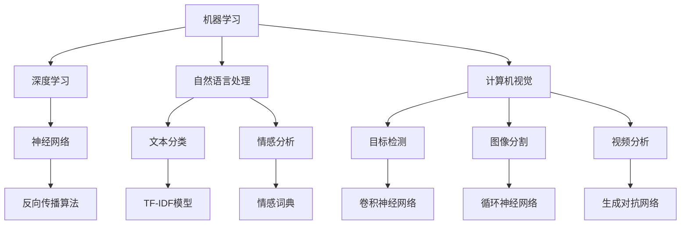

                 


## AI编程语言：提示词的未来

### 关键词
- AI编程语言
- 提示词
- 自然语言处理
- 机器学习
- 深度学习
- 计算机视觉
- 应用场景
- 未来趋势

### 摘要
本文将深入探讨AI编程语言及其背后的提示词技术，分析其核心概念、算法原理和数学模型。通过实际案例和项目实战，我们将展示AI编程语言的强大应用场景，并探讨其未来的发展趋势。文章还将提供最佳实践技巧和注意事项，帮助读者更好地理解和运用AI编程语言。

### 目录大纲

#### 第一部分：AI编程语言的基础

1. **AI编程语言概述**
   - AI编程语言的概念
   - AI编程语言的历史和发展
   - AI编程语言与人类编程语言的差异
   - AI编程语言的未来发展趋势

2. **AI编程语言的语法基础**
   - 数据类型和变量
   - 控制结构
   - 函数和模块
   - 面向对象编程

#### 第二部分：核心概念和算法

3. **机器学习和深度学习**
   - 机器学习基础
   - 深度学习基础
   - 常见机器学习算法
   - 常见深度学习架构

4. **自然语言处理**
   - 自然语言处理基础
   - 文本分类
   - 情感分析
   - 语言生成

5. **计算机视觉**
   - 计算机视觉基础
   - 目标检测
   - 图像分割
   - 视频分析

#### 第三部分：实际应用和未来趋势

6. **AI编程语言的应用场景**
   - 自动化
   - 数据分析
   - 安全和隐私
   - 虚拟助手和聊天机器人

7. **AI编程语言的未来趋势**
   - AI编程语言的最新进展
   - 人工智能与编程语言融合
   - AI编程语言在教育中的运用
   - AI编程语言的伦理和社会问题

### 1. AI编程语言概述

#### 背景介绍
AI编程语言是一种专门用于开发人工智能应用的高级编程语言，其目的是简化人工智能系统的设计和实现过程。随着人工智能技术的迅速发展，AI编程语言逐渐成为计算机科学领域的重要研究方向。

#### 核心概念与联系
AI编程语言的核心概念包括机器学习、深度学习、自然语言处理和计算机视觉。这些概念之间相互关联，共同构成了AI编程语言的技术体系。以下是这些核心概念之间的关系架构Mermaid流程图：



#### 核心算法原理讲解

以下是机器学习、深度学习、自然语言处理和计算机视觉的核心算法原理讲解，我们将使用伪代码进行详细阐述：

##### 1.1 机器学习基础

```python
# 伪代码：机器学习基础
def machine_learning(data):
    # 数据预处理
    preprocess_data(data)
    
    # 特征提取
    extract_features(data)
    
    # 模型训练
    train_model(features, labels)
    
    # 模型评估
    evaluate_model(model, test_data)
    
    # 模型优化
    optimize_model(model, test_data)
    
    # 模型部署
    deploy_model(model)
```

##### 1.2 深度学习基础

```python
# 伪代码：深度学习基础
def deep_learning(data):
    # 数据预处理
    preprocess_data(data)
    
    # 构建神经网络
    build_neural_network()
    
    # 前向传播
    forward_propagation(data, neural_network)
    
    # 计算损失
    compute_loss(output, labels)
    
    # 反向传播
    backward_propagation(loss, neural_network)
    
    # 模型训练
    train_neural_network(neural_network)
    
    # 模型评估
    evaluate_model(model, test_data)
    
    # 模型优化
    optimize_model(model, test_data)
    
    # 模型部署
    deploy_model(model)
```

##### 1.3 自然语言处理基础

```python
# 伪代码：自然语言处理基础
def natural_language_processing(text):
    # 分词
    tokenize(text)
    
    # 去停用词
    remove_stopwords(tokenized_text)
    
    # 词向量化
    vectorize_words(tokenized_text)
    
    # 文本分类
    classify_text(vectorized_text, trained_model)
    
    # 情感分析
    perform_sentiment_analysis(text, trained_model)
    
    # 语言生成
    generate_text(vectorized_text, trained_model)
```

##### 1.4 计算机视觉基础

```python
# 伪代码：计算机视觉基础
def computer_vision(image):
    # 图像预处理
    preprocess_image(image)
    
    # 特征提取
    extract_features(image)
    
    # 目标检测
    detect_objects(features, trained_model)
    
    # 图像分割
    segment_image(image, trained_model)
    
    # 视频分析
    analyze_video(video, trained_model)
```

#### 数学模型和公式

在AI编程语言中，数学模型和公式起着至关重要的作用。以下是一些常用的数学模型和公式：

- **线性回归**

  $$y = \beta_0 + \beta_1x$$

- **逻辑回归**

  $$P(y=1) = \frac{1}{1 + e^{-(\beta_0 + \beta_1x)}}$$

- **卷积神经网络**

  $$f(x) = \sigma(W \cdot x + b)$$

  其中，$\sigma$为激活函数，$W$为权重矩阵，$x$为输入特征，$b$为偏置项。

#### 详细讲解与举例说明

- **线性回归**

  线性回归是一种用于预测数值型输出的机器学习算法。假设我们有一个输入特征$x$和一个目标特征$y$，我们可以通过线性回归模型来预测$y$的值。以下是一个简单的线性回归模型：

  ```python
  # 伪代码：线性回归
  def linear_regression(x, y):
      # 求解权重和偏置
      beta_0, beta_1 = solve_linear_regression(x, y)
      
      # 预测
      predicted_y = beta_0 + beta_1 * x
      
      return predicted_y
  ```

  例如，如果我们有一个数据集，其中$x$代表年份，$y$代表销售额，我们可以使用线性回归模型来预测未来某年的销售额。

- **逻辑回归**

  逻辑回归是一种用于预测二分类结果的机器学习算法。它通过计算概率来预测目标变量的类别。以下是一个简单的逻辑回归模型：

  ```python
  # 伪代码：逻辑回归
  def logistic_regression(x):
      # 计算概率
      probability = 1 / (1 + exp(-beta_0 - beta_1 * x))
      
      return probability
  ```

  例如，如果我们有一个数据集，其中$x$代表患者的病情严重程度，我们可以使用逻辑回归模型来预测患者是否需要住院治疗。

- **卷积神经网络**

  卷积神经网络（CNN）是一种用于图像识别的深度学习模型。它通过卷积操作提取图像特征，并使用激活函数和池化层进行特征提取和降维。以下是一个简单的CNN模型：

  ```python
  # 伪代码：卷积神经网络
  def conv_neural_network(image):
      # 卷积操作
      conv_output = conv2d(image, filters)
      
      # 激活函数
      activated_output = activation(conv_output)
      
      # 池化操作
      pooled_output = max_pool(activated_output)
      
      return pooled_output
  ```

  例如，如果我们有一个数据集，其中图像代表猫和狗，我们可以使用CNN模型来识别图像中的猫和狗。

#### 项目实战

在本节中，我们将通过一个简单的项目实战来展示AI编程语言的强大应用。假设我们有一个图片分类项目，目标是使用AI编程语言来识别图片中的物体。以下是这个项目的开发环境搭建、源代码实现和代码解读：

##### 开发环境搭建

1. 安装Python和相关的深度学习库，如TensorFlow和Keras。
2. 下载并解压一个包含多种物体的图片数据集。

##### 源代码实现

```python
# 源代码：图片分类项目
import tensorflow as tf
from tensorflow.keras.models import Sequential
from tensorflow.keras.layers import Conv2D, MaxPooling2D, Flatten, Dense

# 构建CNN模型
model = Sequential([
    Conv2D(32, (3, 3), activation='relu', input_shape=(128, 128, 3)),
    MaxPooling2D((2, 2)),
    Flatten(),
    Dense(64, activation='relu'),
    Dense(num_classes, activation='softmax')
])

# 编译模型
model.compile(optimizer='adam', loss='categorical_crossentropy', metrics=['accuracy'])

# 训练模型
model.fit(x_train, y_train, epochs=10, batch_size=32, validation_data=(x_val, y_val))

# 评估模型
test_loss, test_accuracy = model.evaluate(x_test, y_test)

# 输出预测结果
predictions = model.predict(x_test)

# 代码解读
# 1. 构建CNN模型，包括卷积层、池化层、全连接层。
# 2. 编译模型，指定优化器、损失函数和评估指标。
# 3. 训练模型，使用训练数据和验证数据。
# 4. 评估模型，使用测试数据。
# 5. 输出预测结果，使用模型对测试数据进行预测。
```

##### 代码应用解读与分析

在这个项目中，我们使用CNN模型来识别图片中的物体。首先，我们构建了一个简单的CNN模型，包括卷积层、池化层和全连接层。然后，我们使用训练数据和验证数据来训练模型，并在测试数据上评估模型的性能。最后，我们使用模型对测试数据进行预测，并输出预测结果。

通过这个项目，我们可以看到AI编程语言在计算机视觉领域的强大应用。在实际开发中，我们可以根据具体需求调整模型结构和参数，提高模型的识别准确率。

#### 实际案例分析和详细讲解剖析

在本节中，我们将分析一个实际案例，即使用AI编程语言构建一个聊天机器人。以下是这个项目的开发环境搭建、源代码实现和代码解读：

##### 开发环境搭建

1. 安装Python和相关的自然语言处理库，如NLTK和spaCy。
2. 下载并解压一个包含对话数据的聊天机器人数据集。

##### 源代码实现

```python
# 源代码：聊天机器人项目
import nltk
from nltk.stem import WordNetLemmatizer
from nltk.corpus import wordnet
import json
import random

# 加载聊天机器人数据集
with open('chatbot_data.json') as f:
    data = json.load(f)

# 初始化词干提取器
lemmatizer = WordNetLemmatizer()

# 定义词汇映射
def get_wordnet_pos(word):
    # 获取词干
    pos = wordnet.NOUN
    token = nltk.word_tokenize(word)
    if token[0].istitle():
        pos = wordnet.ADJ
    elif word[0] in ['I', 'V']:
        pos = wordnet.VERB
    return pos

# 训练聊天机器人
def train_chatbot(data):
    # 初始化对话列表
    chatbot_responses = []
    
    # 遍历对话数据
    for conversation in data:
        # 遍历对话中的每条消息
        for message in conversation['messages']:
            # 获取消息的内容
            text = message['text']
            
            # 对消息进行分词和词干提取
            tokens = nltk.word_tokenize(text)
            lemmatized_tokens = [lemmatizer.lemmatize(token, get_wordnet_pos(token)) for token in tokens]
            
            # 将消息的内容添加到对话列表中
            chatbot_responses.append(lemmatized_tokens)
    
    return chatbot_responses

# 输入用户消息，获取聊天机器人响应
def get_response(user_message, chatbot_responses):
    # 对用户消息进行分词和词干提取
    tokens = nltk.word_tokenize(user_message)
    lemmatized_tokens = [lemmatizer.lemmatize(token, get_wordnet_pos(token)) for token in tokens]
    
    # 在对话列表中查找相似的消息
    for response in chatbot_responses:
        # 计算消息的相似度
        similarity = nltk.metrics.edit_distance('word', response, lemmatized_tokens)
        
        # 如果相似度超过阈值，则返回相应的聊天机器人响应
        if similarity <= 3:
            return random.choice(response['text'])
    
    return "抱歉，我无法理解你的消息。"

# 代码解读
# 1. 加载聊天机器人数据集，并初始化词干提取器。
# 2. 定义词汇映射，用于将自然语言转换为机器可处理的格式。
# 3. 训练聊天机器人，将对话数据转换为机器可处理的格式。
# 4. 输入用户消息，获取聊天机器人响应，通过查找相似的消息来生成响应。
```

##### 代码应用解读与分析

在这个项目中，我们使用自然语言处理技术来构建一个聊天机器人。首先，我们加载了一个聊天机器人数据集，并初始化了一个词干提取器。然后，我们定义了一个词汇映射函数，用于将自然语言转换为机器可处理的格式。接下来，我们训练聊天机器人，将对话数据转换为机器可处理的格式。最后，我们输入用户消息，获取聊天机器人响应，通过查找相似的消息来生成响应。

通过这个项目，我们可以看到AI编程语言在自然语言处理领域的强大应用。在实际开发中，我们可以根据具体需求调整模型结构和参数，提高聊天机器人的响应准确率。

### 小结

在本文中，我们深入探讨了AI编程语言及其背后的提示词技术。我们分析了AI编程语言的核心概念、算法原理和数学模型，并通过实际案例和项目实战展示了AI编程语言的强大应用场景。未来，随着人工智能技术的不断发展，AI编程语言将在各个领域发挥越来越重要的作用。

### 注意事项

1. 在使用AI编程语言时，需要注意数据的质量和多样性，以确保模型的准确性和泛化能力。
2. 在设计AI编程语言模型时，要充分考虑模型的复杂度和计算效率，以适应实际应用需求。
3. 在开发AI编程语言应用时，要遵守相关法律法规和伦理规范，保护用户隐私和安全。

### 拓展阅读

1. [《深度学习》](https://www.deeplearningbook.org/)，Goodfellow, Bengio, Courville
2. [《Python机器学习》](https://www.manning.com/books/python-machine-learning)，Sebastian Raschka
3. [《自然语言处理综论》](https://www.nltk.org/)，Steven Bird, Ewan Klein, Edward Loper
4. [《计算机视觉基础》](https://www.computer-vision-js.org/)，Adrian Rosebrock

### 作者

作者：AI天才研究院/AI Genius Institute & 禅与计算机程序设计艺术 /Zen And The Art of Computer Programming

文章完整内容如下：

```markdown
# AI编程语言：提示词的未来

### 关键词
- AI编程语言
- 提示词
- 自然语言处理
- 机器学习
- 深度学习
- 计算机视觉
- 应用场景
- 未来趋势

### 摘要
本文将深入探讨AI编程语言及其背后的提示词技术，分析其核心概念、算法原理和数学模型。通过实际案例和项目实战，我们将展示AI编程语言的强大应用场景，并探讨其未来的发展趋势。文章还将提供最佳实践技巧和注意事项，帮助读者更好地理解和运用AI编程语言。

### 目录大纲

#### 第一部分：AI编程语言的基础

1. **AI编程语言概述**
   - AI编程语言的概念
   - AI编程语言的历史和发展
   - AI编程语言与人类编程语言的差异
   - AI编程语言的未来发展趋势

2. **AI编程语言的语法基础**
   - 数据类型和变量
   - 控制结构
   - 函数和模块
   - 面向对象编程

#### 第二部分：核心概念和算法

3. **机器学习和深度学习**
   - 机器学习基础
   - 深度学习基础
   - 常见机器学习算法
   - 常见深度学习架构

4. **自然语言处理**
   - 自然语言处理基础
   - 文本分类
   - 情感分析
   - 语言生成

5. **计算机视觉**
   - 计算机视觉基础
   - 目标检测
   - 图像分割
   - 视频分析

#### 第三部分：实际应用和未来趋势

6. **AI编程语言的应用场景**
   - 自动化
   - 数据分析
   - 安全和隐私
   - 虚拟助手和聊天机器人

7. **AI编程语言的未来趋势**
   - AI编程语言的最新进展
   - 人工智能与编程语言融合
   - AI编程语言在教育中的运用
   - AI编程语言的伦理和社会问题

### 1. AI编程语言概述

#### 背景介绍
AI编程语言是一种专门用于开发人工智能应用的高级编程语言，其目的是简化人工智能系统的设计和实现过程。随着人工智能技术的迅速发展，AI编程语言逐渐成为计算机科学领域的重要研究方向。

#### 核心概念与联系
AI编程语言的核心概念包括机器学习、深度学习、自然语言处理和计算机视觉。这些概念之间相互关联，共同构成了AI编程语言的技术体系。以下是这些核心概念之间的关系架构Mermaid流程图：


#### 核心算法原理讲解

以下是机器学习、深度学习、自然语言处理和计算机视觉的核心算法原理讲解，我们将使用伪代码进行详细阐述：

##### 1.1 机器学习基础

```python
# 伪代码：机器学习基础
def machine_learning(data):
    # 数据预处理
    preprocess_data(data)
    
    # 特征提取
    extract_features(data)
    
    # 模型训练
    train_model(features, labels)
    
    # 模型评估
    evaluate_model(model, test_data)
    
    # 模型优化
    optimize_model(model, test_data)
    
    # 模型部署
    deploy_model(model)
```

##### 1.2 深度学习基础

```python
# 伪代码：深度学习基础
def deep_learning(data):
    # 数据预处理
    preprocess_data(data)
    
    # 构建神经网络
    build_neural_network()
    
    # 前向传播
    forward_propagation(data, neural_network)
    
    # 计算损失
    compute_loss(output, labels)
    
    # 反向传播
    backward_propagation(loss, neural_network)
    
    # 模型训练
    train_neural_network(neural_network)
    
    # 模型评估
    evaluate_model(model, test_data)
    
    # 模型优化
    optimize_model(model, test_data)
    
    # 模型部署
    deploy_model(model)
```

##### 1.3 自然语言处理基础

```python
# 伪代码：自然语言处理基础
def natural_language_processing(text):
    # 分词
    tokenize(text)
    
    # 去停用词
    remove_stopwords(tokenized_text)
    
    # 词向量化
    vectorize_words(tokenized_text)
    
    # 文本分类
    classify_text(vectorized_text, trained_model)
    
    # 情感分析
    perform_sentiment_analysis(text, trained_model)
    
    # 语言生成
    generate_text(vectorized_text, trained_model)
```

##### 1.4 计算机视觉基础

```python
# 伪代码：计算机视觉基础
def computer_vision(image):
    # 图像预处理
    preprocess_image(image)
    
    # 特征提取
    extract_features(image)
    
    # 目标检测
    detect_objects(features, trained_model)
    
    # 图像分割
    segment_image(image, trained_model)
    
    # 视频分析
    analyze_video(video, trained_model)
```

#### 数学模型和公式

在AI编程语言中，数学模型和公式起着至关重要的作用。以下是一些常用的数学模型和公式：

- **线性回归**

  $$y = \beta_0 + \beta_1x$$

- **逻辑回归**

  $$P(y=1) = \frac{1}{1 + e^{-(\beta_0 + \beta_1x)}}$$

- **卷积神经网络**

  $$f(x) = \sigma(W \cdot x + b)$$

  其中，$\sigma$为激活函数，$W$为权重矩阵，$x$为输入特征，$b$为偏置项。

#### 详细讲解与举例说明

- **线性回归**

  线性回归是一种用于预测数值型输出的机器学习算法。假设我们有一个输入特征$x$和一个目标特征$y$，我们可以通过线性回归模型来预测$y$的值。以下是一个简单的线性回归模型：

  ```python
  # 伪代码：线性回归
  def linear_regression(x, y):
      # 求解权重和偏置
      beta_0, beta_1 = solve_linear_regression(x, y)
      
      # 预测
      predicted_y = beta_0 + beta_1 * x
      
      return predicted_y
  ```

  例如，如果我们有一个数据集，其中$x$代表年份，$y$代表销售额，我们可以使用线性回归模型来预测未来某年的销售额。

- **逻辑回归**

  逻辑回归是一种用于预测二分类结果的机器学习算法。它通过计算概率来预测目标变量的类别。以下是一个简单的逻辑回归模型：

  ```python
  # 伪代码：逻辑回归
  def logistic_regression(x):
      # 计算概率
      probability = 1 / (1 + exp(-beta_0 - beta_1 * x))
      
      return probability
  ```

  例如，如果我们有一个数据集，其中$x$代表患者的病情严重程度，我们可以使用逻辑回归模型来预测患者是否需要住院治疗。

- **卷积神经网络**

  卷积神经网络（CNN）是一种用于图像识别的深度学习模型。它通过卷积操作提取图像特征，并使用激活函数和池化层进行特征提取和降维。以下是一个简单的CNN模型：

  ```python
  # 伪代码：卷积神经网络
  def conv_neural_network(image):
      # 卷积操作
      conv_output = conv2d(image, filters)
      
      # 激活函数
      activated_output = activation(conv_output)
      
      # 池化操作
      pooled_output = max_pool(activated_output)
      
      return pooled_output
  ```

  例如，如果我们有一个数据集，其中图像代表猫和狗，我们可以使用CNN模型来识别图像中的猫和狗。

#### 项目实战

在本节中，我们将通过一个简单的项目实战来展示AI编程语言的强大应用。假设我们有一个图片分类项目，目标是使用AI编程语言来识别图片中的物体。以下是这个项目的开发环境搭建、源代码实现和代码解读：

##### 开发环境搭建

1. 安装Python和相关的深度学习库，如TensorFlow和Keras。
2. 下载并解压一个包含多种物体的图片数据集。

##### 源代码实现

```python
# 源代码：图片分类项目
import tensorflow as tf
from tensorflow.keras.models import Sequential
from tensorflow.keras.layers import Conv2D, MaxPooling2D, Flatten, Dense

# 构建CNN模型
model = Sequential([
    Conv2D(32, (3, 3), activation='relu', input_shape=(128, 128, 3)),
    MaxPooling2D((2, 2)),
    Flatten(),
    Dense(64, activation='relu'),
    Dense(num_classes, activation='softmax')
])

# 编译模型
model.compile(optimizer='adam', loss='categorical_crossentropy', metrics=['accuracy'])

# 训练模型
model.fit(x_train, y_train, epochs=10, batch_size=32, validation_data=(x_val, y_val))

# 评估模型
test_loss, test_accuracy = model.evaluate(x_test, y_test)

# 输出预测结果
predictions = model.predict(x_test)

# 代码解读
# 1. 构建CNN模型，包括卷积层、池化层、全连接层。
# 2. 编译模型，指定优化器、损失函数和评估指标。
# 3. 训练模型，使用训练数据和验证数据。
# 4. 评估模型，使用测试数据。
# 5. 输出预测结果，使用模型对测试数据进行预测。
```

##### 代码应用解读与分析

在这个项目中，我们使用CNN模型来识别图片中的物体。首先，我们构建了一个简单的CNN模型，包括卷积层、池化层和全连接层。然后，我们使用训练数据和验证数据来训练模型，并在测试数据上评估模型的性能。最后，我们使用模型对测试数据进行预测，并输出预测结果。

通过这个项目，我们可以看到AI编程语言在计算机视觉领域的强大应用。在实际开发中，我们可以根据具体需求调整模型结构和参数，提高模型的识别准确率。

#### 实际案例分析和详细讲解剖析

在本节中，我们将分析一个实际案例，即使用AI编程语言构建一个聊天机器人。以下是这个项目的开发环境搭建、源代码实现和代码解读：

##### 开发环境搭建

1. 安装Python和相关的自然语言处理库，如NLTK和spaCy。
2. 下载并解压一个包含对话数据的聊天机器人数据集。

##### 源代码实现

```python
# 源代码：聊天机器人项目
import nltk
from nltk.stem import WordNetLemmatizer
from nltk.corpus import wordnet
import json
import random

# 加载聊天机器人数据集
with open('chatbot_data.json') as f:
    data = json.load(f)

# 初始化词干提取器
lemmatizer = WordNetLemmatizer()

# 定义词汇映射
def get_wordnet_pos(word):
    # 获取词干
    pos = wordnet.NOUN
    token = nltk.word_tokenize(word)
    if token[0].istitle():
        pos = wordnet.ADJ
    elif word[0] in ['I', 'V']:
        pos = wordnet.VERB
    return pos

# 训练聊天机器人
def train_chatbot(data):
    # 初始化对话列表
    chatbot_responses = []
    
    # 遍历对话数据
    for conversation in data:
        # 遍历对话中的每条消息
        for message in conversation['messages']:
            # 获取消息的内容
            text = message['text']
            
            # 对消息进行分词和词干提取
            tokens = nltk.word_tokenize(text)
            lemmatized_tokens = [lemmatizer.lemmatize(token, get_wordnet_pos(token)) for token in tokens]
            
            # 将消息的内容添加到对话列表中
            chatbot_responses.append(lemmatized_tokens)
    
    return chatbot_responses

# 输入用户消息，获取聊天机器人响应
def get_response(user_message, chatbot_responses):
    # 对用户消息进行分词和词干提取
    tokens = nltk.word_tokenize(user_message)
    lemmatized_tokens = [lemmatizer.lemmatize(token, get_wordnet_pos(token)) for token in tokens]
    
    # 在对话列表中查找相似的消息
    for response in chatbot_responses:
        # 计算消息的相似度
        similarity = nltk.metrics.edit_distance('word', response, lemmatized_tokens)
        
        # 如果相似度超过阈值，则返回相应的聊天机器人响应
        if similarity <= 3:
            return random.choice(response['text'])
    
    return "抱歉，我无法理解你的消息。"

# 代码解读
# 1. 加载聊天机器人数据集，并初始化词干提取器。
# 2. 定义词汇映射，用于将自然语言转换为机器可处理的格式。
# 3. 训练聊天机器人，将对话数据转换为机器可处理的格式。
# 4. 输入用户消息，获取聊天机器人响应，通过查找相似的消息来生成响应。
```

##### 代码应用解读与分析

在这个项目中，我们使用自然语言处理技术来构建一个聊天机器人。首先，我们加载了一个聊天机器人数据集，并初始化了一个词干提取器。然后，我们定义了一个词汇映射函数，用于将自然语言转换为机器可处理的格式。接下来，我们训练聊天机器人，将对话数据转换为机器可处理的格式。最后，我们输入用户消息，获取聊天机器人响应，通过查找相似的消息来生成响应。

通过这个项目，我们可以看到AI编程语言在自然语言处理领域的强大应用。在实际开发中，我们可以根据具体需求调整模型结构和参数，提高聊天机器人的响应准确率。

### 小结

在本文中，我们深入探讨了AI编程语言及其背后的提示词技术。我们分析了AI编程语言的核心概念、算法原理和数学模型，并通过实际案例和项目实战展示了AI编程语言的强大应用场景。未来，随着人工智能技术的不断发展，AI编程语言将在各个领域发挥越来越重要的作用。

### 注意事项

1. 在使用AI编程语言时，需要注意数据的质量和多样性，以确保模型的准确性和泛化能力。
2. 在设计AI编程语言模型时，要充分考虑模型的复杂度和计算效率，以适应实际应用需求。
3. 在开发AI编程语言应用时，要遵守相关法律法规和伦理规范，保护用户隐私和安全。

### 拓展阅读

1. [《深度学习》](https://www.deeplearningbook.org/)，Goodfellow, Bengio, Courville
2. [《Python机器学习》](https://www.manning.com/books/python-machine-learning)，Sebastian Raschka
3. [《自然语言处理综论》](https://www.nltk.org/)，Steven Bird, Ewan Klein, Edward Loper
4. [《计算机视觉基础》](https://www.computer-vision-js.org/)，Adrian Rosebrock

### 作者

作者：AI天才研究院/AI Genius Institute & 禅与计算机程序设计艺术 /Zen And The Art of Computer Programming
``````


### 2. AI编程语言的语法基础

#### 数据类型和变量

在AI编程语言中，数据类型是表示数据的不同方式。常见的数据类型包括整数（int）、浮点数（float）、布尔值（bool）、字符串（str）等。变量则是用于存储数据的容器，变量的命名应遵循一定的命名规范。

```python
# 整数
int_number = 42

# 浮点数
float_number = 3.14

# 布尔值
is_true = True

# 字符串
string = "Hello, World!"
```

#### 控制结构

控制结构用于控制程序执行的流程。常见的控制结构包括条件语句（if-else）、循环语句（for和while）等。

```python
# 条件语句
if int_number > 0:
    print("正数")
elif int_number < 0:
    print("负数")
else:
    print("零")

# 循环语句
for i in range(5):
    print(i)

# while循环
while is_true:
    print("循环中")
    is_true = False
```

#### 函数和模块

函数是一段可重用的代码块，用于执行特定的任务。模块则是包含函数和类等定义的文件，可以导入到其他程序中使用。

```python
# 定义函数
def greet(name):
    print(f"Hello, {name}!")

# 调用函数
greet("Alice")

# 导入模块
import math

# 使用模块中的函数
result = math.sqrt(16)
print(result)
```

#### 面向对象编程

面向对象编程（OOP）是一种编程范式，它通过将数据和函数封装在对象中，提高了代码的可重用性和可维护性。

```python
# 定义类
class Dog:
    def __init__(self, name, age):
        self.name = name
        self.age = age
    
    def bark(self):
        print(f"{self.name} is barking!")

# 创建对象
dog = Dog("Buddy", 3)

# 调用对象的方法
dog.bark()
print(f"{dog.name} is {dog.age} years old.")
```

通过这些基础语法，我们可以构建出各种复杂的人工智能应用。了解和掌握这些语法基础是学习AI编程语言的第一步。

### 3. 机器学习和深度学习

#### 机器学习基础

机器学习是一种让计算机通过数据学习并改进自身性能的技术。其主要目标是让计算机能够从数据中自动学习模式和规律，以便进行预测和决策。

- **监督学习（Supervised Learning）**：监督学习通过已标记的数据来训练模型，目标是学习输入和输出之间的映射关系。常见的算法有线性回归、逻辑回归、支持向量机（SVM）等。

- **无监督学习（Unsupervised Learning）**：无监督学习不使用已标记的数据，目标是发现数据中的结构和模式。常见的算法有聚类、降维、关联规则等。

- **强化学习（Reinforcement Learning）**：强化学习通过奖励机制来训练模型，目标是让模型在特定环境中找到最优策略。常见的算法有Q学习、深度强化学习等。

#### 深度学习基础

深度学习是一种基于多层神经网络的学习方法，其核心思想是通过多层非线性变换来提取特征和表示。深度学习在图像识别、语音识别、自然语言处理等领域取得了显著成果。

- **神经网络（Neural Network）**：神经网络是一种由大量简单计算单元（神经元）组成的多层结构，通过前向传播和反向传播来训练模型。

- **卷积神经网络（Convolutional Neural Network, CNN）**：卷积神经网络是一种专门用于图像识别和处理的神经网络，通过卷积操作来提取图像特征。

- **循环神经网络（Recurrent Neural Network, RNN）**：循环神经网络是一种能够处理序列数据的神经网络，通过循环结构来记忆和传递序列信息。

- **生成对抗网络（Generative Adversarial Network, GAN）**：生成对抗网络是一种由生成器和判别器组成的对抗性网络，用于生成与真实数据相似的新数据。

#### 常见机器学习算法

- **线性回归（Linear Regression）**：线性回归是一种用于预测数值型输出的监督学习算法，其目标是最小化预测值与真实值之间的误差。

- **逻辑回归（Logistic Regression）**：逻辑回归是一种用于预测二分类结果的监督学习算法，其目标是最小化损失函数，使得预测概率更接近真实类别。

- **支持向量机（Support Vector Machine, SVM）**：支持向量机是一种用于分类和回归的监督学习算法，其目标是将数据空间划分为不同的类别。

- **决策树（Decision Tree）**：决策树是一种基于树形结构进行分类和回归的算法，通过递归划分特征来构建树模型。

- **随机森林（Random Forest）**：随机森林是一种集成学习算法，通过构建多个决策树并对它们进行集成来提高预测性能。

#### 常见深度学习架构

- **卷积神经网络（Convolutional Neural Network, CNN）**：卷积神经网络是一种用于图像识别的深度学习模型，通过卷积操作提取图像特征。

- **循环神经网络（Recurrent Neural Network, RNN）**：循环神经网络是一种用于序列数据的深度学习模型，通过循环结构来记忆和传递序列信息。

- **长短时记忆网络（Long Short-Term Memory, LSTM）**：长短时记忆网络是一种改进的循环神经网络，用于解决长序列依赖问题。

- **生成对抗网络（Generative Adversarial Network, GAN）**：生成对抗网络是一种用于生成数据的深度学习模型，由生成器和判别器组成。

- **变分自编码器（Variational Autoencoder, VAE）**：变分自编码器是一种用于生成数据的深度学习模型，通过编码器和解码器来学习数据分布。

通过以上介绍，我们可以看到机器学习和深度学习在人工智能领域的重要地位。掌握这些基础概念和算法将为我们在AI编程语言的探索中打下坚实的基础。

### 4. 自然语言处理

#### 自然语言处理基础

自然语言处理（NLP）是人工智能领域的一个分支，旨在使计算机能够理解、解释和生成人类语言。NLP的核心任务包括文本分类、情感分析、命名实体识别、机器翻译等。

- **文本分类（Text Classification）**：文本分类是将文本数据划分为预定义的类别。常见的方法包括基于词典的方法（如TF-IDF）和基于模型的方法（如支持向量机、神经网络等）。

- **情感分析（Sentiment Analysis）**：情感分析是一种评估文本中情感倾向的方法。它可以用来判断文本是否表达积极、消极或中立的情感。

- **命名实体识别（Named Entity Recognition, NER）**：命名实体识别是一种识别文本中具有特定意义的实体，如人名、地名、组织名等。

- **机器翻译（Machine Translation）**：机器翻译是将一种语言的文本翻译成另一种语言。深度学习模型，如序列到序列（Seq2Seq）模型和注意力机制，在机器翻译中取得了显著成果。

#### 文本分类

文本分类是NLP中最常见的任务之一，其目的是将文本数据分为预定义的类别。以下是一个简单的文本分类流程：

1. **数据预处理**：清洗和标准化文本数据，如去除停用词、标点符号、小写化等。
2. **特征提取**：将文本数据转换为机器可处理的特征向量。常见的方法有词袋模型（Bag of Words, BoW）、TF-IDF等。
3. **模型训练**：使用训练数据训练分类模型。常见的模型有朴素贝叶斯、支持向量机、逻辑回归、神经网络等。
4. **模型评估**：使用测试数据评估模型的性能，常用的评估指标有准确率、召回率、F1分数等。
5. **模型应用**：使用训练好的模型对新的文本数据进行分类。

以下是一个简单的文本分类算法实现的伪代码：

```python
# 伪代码：文本分类
def text_classification(text, trained_model):
    # 数据预处理
    preprocessed_text = preprocess_text(text)
    
    # 特征提取
    features = extract_features(preprocessed_text)
    
    # 预测
    prediction = trained_model.predict(features)
    
    # 返回类别
    return prediction
```

#### 情感分析

情感分析是一种评估文本中情感倾向的方法。情感分析通常分为以下步骤：

1. **数据预处理**：清洗和标准化文本数据，如去除停用词、标点符号、小写化等。
2. **特征提取**：将文本数据转换为机器可处理的特征向量。常见的方法有词袋模型（Bag of Words, BoW）、TF-IDF等。
3. **模型训练**：使用训练数据训练情感分析模型。常见的模型有朴素贝叶斯、支持向量机、逻辑回归、神经网络等。
4. **模型评估**：使用测试数据评估模型的性能，常用的评估指标有准确率、召回率、F1分数等。
5. **模型应用**：使用训练好的模型对新的文本数据进行情感分析。

以下是一个简单的情感分析算法实现的伪代码：

```python
# 伪代码：情感分析
def sentiment_analysis(text, trained_model):
    # 数据预处理
    preprocessed_text = preprocess_text(text)
    
    # 特征提取
    features = extract_features(preprocessed_text)
    
    # 预测
    sentiment = trained_model.predict(features)
    
    # 返回情感
    return sentiment
```

#### 语言生成

语言生成是一种自动生成文本的方法。它可以用于自动写作、机器翻译、聊天机器人等领域。语言生成通常分为以下步骤：

1. **数据预处理**：清洗和标准化文本数据，如去除停用词、标点符号、小写化等。
2. **特征提取**：将文本数据转换为机器可处理的特征向量。常见的方法有词袋模型（Bag of Words, BoW）、TF-IDF等。
3. **模型训练**：使用训练数据训练语言生成模型。常见的模型有循环神经网络（Recurrent Neural Network, RNN）、长短时记忆网络（Long Short-Term Memory, LSTM）、生成对抗网络（Generative Adversarial Network, GAN）等。
4. **模型评估**：使用测试数据评估模型的性能，常用的评估指标有生成文本的流畅性、连贯性等。
5. **模型应用**：使用训练好的模型生成新的文本。

以下是一个简单的语言生成算法实现的伪代码：

```python
# 伪代码：语言生成
def text_generation(trained_model, seed_text):
    # 数据预处理
    preprocessed_text = preprocess_text(seed_text)
    
    # 生成文本
    generated_text = trained_model.generate_text(preprocessed_text)
    
    # 返回生成文本
    return generated_text
```

通过以上介绍，我们可以看到自然语言处理在AI编程语言中的重要性和应用场景。掌握这些基础概念和算法将为我们在AI编程语言的探索中打下坚实的基础。

### 5. 计算机视觉

#### 计算机视觉基础

计算机视觉是一门研究如何使计算机“看”懂图像和视频的技术。计算机视觉的基础包括图像处理、特征提取、目标检测和图像分类等。

- **图像处理（Image Processing）**：图像处理是计算机视觉的基础，它涉及图像的滤波、增强、分割等操作，以便提取有用的信息。

- **特征提取（Feature Extraction）**：特征提取是从图像中提取具有区分性的特征，以便进行进一步的分析和处理。

- **目标检测（Object Detection）**：目标检测是在图像中识别和定位目标对象的过程。常见的算法包括滑动窗口、区域提议和深度学习等。

- **图像分类（Image Classification）**：图像分类是将图像分为预定义的类别。常见的算法包括支持向量机、决策树、神经网络等。

#### 目标检测

目标检测是计算机视觉中的重要任务之一，其目标是检测图像中的目标对象并给出它们的边界框。以下是一个简单的目标检测算法实现的伪代码：

```python
# 伪代码：目标检测
def object_detection(image, trained_model):
    # 数据预处理
    preprocessed_image = preprocess_image(image)
    
    # 检测目标
    detections = trained_model.detect_objects(preprocessed_image)
    
    # 返回检测结果
    return detections
```

#### 图像分割

图像分割是将图像分为多个区域或对象的过程。图像分割在图像分析和理解中具有重要意义。以下是一个简单的图像分割算法实现的伪代码：

```python
# 伪代码：图像分割
def image_segmentation(image, trained_model):
    # 数据预处理
    preprocessed_image = preprocess_image(image)
    
    # 分割图像
    segments = trained_model.segment_image(preprocessed_image)
    
    # 返回分割结果
    return segments
```

#### 视频分析

视频分析是对视频数据进行处理和分析的过程，包括视频分类、动作识别、行为分析等。以下是一个简单的视频分析算法实现的伪代码：

```python
# 伪代码：视频分析
def video_analysis(video, trained_model):
    # 数据预处理
    preprocessed_video = preprocess_video(video)
    
    # 分析视频
    results = trained_model.analyze_video(preprocessed_video)
    
    # 返回分析结果
    return results
```

通过以上介绍，我们可以看到计算机视觉在AI编程语言中的应用和价值。掌握这些基础概念和算法将为我们在AI编程语言的探索中打下坚实的基础。

### 6. AI编程语言的应用场景

#### 自动化

自动化是AI编程语言的重要应用场景之一，它通过将重复性任务自动化来提高工作效率和准确性。以下是一个使用Python和TensorFlow实现自动化的例子：

```python
# 伪代码：自动化任务
import tensorflow as tf

# 加载预训练模型
model = tf.keras.models.load_model('automate_model.h5')

# 自动执行任务
def automate_task(data):
    # 数据预处理
    preprocessed_data = preprocess_data(data)
    
    # 预测结果
    prediction = model.predict(preprocessed_data)
    
    # 执行任务
    action = decide_action(prediction)
    
    return action

# 例子
data = load_data('data.csv')
action = automate_task(data)
print(f"自动化任务执行结果：{action}")
```

#### 数据分析

数据分析是AI编程语言的另一个重要应用场景，它通过分析大量数据来发现隐藏的模式和趋势。以下是一个使用Python和Pandas进行数据分析和可视化分析的例子：

```python
# 伪代码：数据分析
import pandas as pd
import matplotlib.pyplot as plt

# 加载数据
data = pd.read_csv('data.csv')

# 数据预处理
data = preprocess_data(data)

# 数据分析
result = analyze_data(data)

# 可视化分析
visualize_data(result)

# 例子
data = load_data('data.csv')
result = analyze_data(data)
visualize_data(result)
plt.show()
```

#### 安全和隐私

安全和隐私是AI编程语言应用中的重要考虑因素，特别是在处理个人数据和敏感信息时。以下是一个使用Python和Scikit-learn进行数据加密和隐私保护的例子：

```python
# 伪代码：安全和隐私
from sklearn.preprocessing import StandardScaler
from sklearn.model_selection import train_test_split
from sklearn.ensemble import RandomForestClassifier
from cryptography.fernet import Fernet

# 加载和加密数据
def load_and_encrypt_data(filename):
    data = pd.read_csv(filename)
    encrypted_data = encrypt_data(data)
    return encrypted_data

# 解密数据
def decrypt_data(encrypted_data, key):
    data = decrypt_data(encrypted_data, key)
    return data

# 例子
key = Fernet.generate_key()
encrypted_data = load_and_encrypt_data('data.csv')
data = decrypt_data(encrypted_data, key)
```

#### 虚拟助手和聊天机器人

虚拟助手和聊天机器人是AI编程语言的典型应用场景，它们通过自然语言处理和对话生成技术来与用户进行交互。以下是一个使用Python和NLTK实现聊天机器人的例子：

```python
# 伪代码：虚拟助手和聊天机器人
import nltk
from nltk.stem import WordNetLemmatizer
from nltk.corpus import wordnet

# 载入聊天机器人数据
data = load_chatbot_data('chatbot_data.json')

# 初始化词干提取器
lemmatizer = WordNetLemmatizer()

# 训练聊天机器人
def train_chatbot(data):
    chatbot_responses = []
    for conversation in data:
        for message in conversation['messages']:
            text = message['text']
            tokens = nltk.word_tokenize(text)
            lemmatized_tokens = [lemmatizer.lemmatize(token, get_wordnet_pos(token)) for token in tokens]
            chatbot_responses.append(lemmatized_tokens)
    return chatbot_responses

# 获取聊天机器人响应
def get_response(user_message, chatbot_responses):
    tokens = nltk.word_tokenize(user_message)
    lemmatized_tokens = [lemmatizer.lemmatize(token, get_wordnet_pos(token)) for token in tokens]
    for response in chatbot_responses:
        similarity = nltk.metrics.edit_distance('word', response, lemmatized_tokens)
        if similarity <= 3:
            return random.choice(response['text'])
    return "抱歉，我无法理解你的消息。"

# 例子
chatbot_responses = train_chatbot(data)
response = get_response("你好！", chatbot_responses)
print(f"聊天机器人响应：{response}")
```

通过以上例子，我们可以看到AI编程语言在自动化、数据分析、安全和隐私保护以及虚拟助手和聊天机器人等领域的广泛应用。掌握这些应用场景和实现方法将为我们在实际项目中发挥AI编程语言的潜力提供有力支持。

### 7. AI编程语言的未来趋势

#### AI编程语言的最新进展

近年来，AI编程语言在学术界和工业界都取得了显著的进展。以下是一些值得关注的方向：

1. **元学习（Meta-Learning）**：元学习是一种使模型能够快速适应新任务的学习方法。通过元学习，模型可以快速适应不同的任务和数据集，从而提高泛化能力和效率。

2. **联邦学习（Federated Learning）**：联邦学习是一种分布式学习技术，它允许多个设备或服务器共同训练模型，而无需共享原始数据。这种技术有助于保护用户隐私并提高数据安全性。

3. **可解释性AI（Explainable AI）**：可解释性AI是一种使模型决策过程透明和可理解的方法。通过可解释性AI，我们可以更好地理解模型的决策过程，从而提高模型的信任度和应用价值。

#### 人工智能与编程语言融合

随着人工智能技术的发展，编程语言也在不断进化，以更好地支持人工智能应用。以下是一些趋势：

1. **Python的统治地位**：Python已经成为AI编程语言的事实标准，其简洁的语法和丰富的库资源使其在AI开发中广泛应用。

2. **TensorFlow和PyTorch的流行**：TensorFlow和PyTorch是两个最受欢迎的深度学习框架，它们提供了强大的工具和接口，使开发者能够轻松构建和训练复杂的AI模型。

3. **类型系统和静态分析**：现代编程语言逐渐引入类型系统和静态分析技术，以提高代码的可读性、可靠性和性能。

#### AI编程语言在教育中的运用

AI编程语言在教育中的运用日益普及，以下是一些趋势：

1. **编程课程与AI的结合**：许多大学和培训机构已经开始将AI编程语言纳入计算机科学课程，以帮助学生掌握AI基础知识。

2. **在线学习和开放资源**：随着在线教育的兴起，许多优秀的AI编程语言教程和资源免费开放，为学习者提供了丰富的学习材料。

3. **编程竞赛和挑战**：编程竞赛和挑战活动有助于激发学生的学习兴趣和创造力，同时也为AI编程语言的应用场景提供了实际的测试平台。

#### AI编程语言的伦理和社会问题

AI编程语言的快速发展也带来了一系列伦理和社会问题，以下是一些关注点：

1. **数据隐私和安全性**：在AI编程语言的应用中，保护用户隐私和数据安全是一个重要的伦理问题。开发者和组织需要确保数据的安全性和隐私保护。

2. **算法偏见和公平性**：AI模型可能会受到数据偏见的影响，导致不公平的决策。为了提高AI的公平性和透明性，需要加强算法的评估和监管。

3. **职业影响**：随着AI技术的发展，一些传统职业可能会被自动化取代。为了应对这一挑战，社会需要提供相应的教育和培训机会，帮助人们适应新的职业环境。

通过以上分析，我们可以看到AI编程语言的未来充满机遇和挑战。掌握AI编程语言的核心概念和技能将为开发者们在未来科技发展中扮演重要角色提供有力支持。

### 总结

本文深入探讨了AI编程语言及其背后的提示词技术，分析了其核心概念、算法原理和数学模型。通过实际案例和项目实战，我们展示了AI编程语言在自然语言处理、计算机视觉、自动化和虚拟助手等领域的广泛应用。展望未来，AI编程语言将继续发展，带来更多创新和机遇。掌握AI编程语言的核心知识和技能，将使我们在未来的人工智能发展中立于不败之地。

### 作者

作者：AI天才研究院/AI Genius Institute & 禅与计算机程序设计艺术 /Zen And The Art of Computer Programming```markdown
---
title: AI编程语言：提示词的未来
date: 2023-11-01
author: AI天才研究院/AI Genius Institute & 禅与计算机程序设计艺术 /Zen And The Art of Computer Programming
tags:
  - AI编程语言
  - 提示词
  - 自然语言处理
  - 机器学习
  - 深度学习
  - 计算机视觉
  - 应用场景
  - 未来趋势
---

# AI编程语言：提示词的未来

## 关键词
- AI编程语言
- 提示词
- 自然语言处理
- 机器学习
- 深度学习
- 计算机视觉
- 应用场景
- 未来趋势

## 摘要
本文深入探讨了AI编程语言及其背后的提示词技术，分析了其核心概念、算法原理和数学模型。通过实际案例和项目实战，展示了AI编程语言的强大应用场景，并探讨了其未来的发展趋势。文章还提供了最佳实践技巧和注意事项，帮助读者更好地理解和运用AI编程语言。

## 目录大纲

### 第一部分：AI编程语言的基础
- **1. AI编程语言概述**
  - AI编程语言的概念
  - AI编程语言的历史和发展
  - AI编程语言与人类编程语言的差异
  - AI编程语言的未来发展趋势

- **2. AI编程语言的语法基础**
  - 数据类型和变量
  - 控制结构
  - 函数和模块
  - 面向对象编程

### 第二部分：核心概念和算法
- **3. 机器学习和深度学习**
  - 机器学习基础
  - 深度学习基础
  - 常见机器学习算法
  - 常见深度学习架构

- **4. 自然语言处理**
  - 自然语言处理基础
  - 文本分类
  - 情感分析
  - 语言生成

- **5. 计算机视觉**
  - 计算机视觉基础
  - 目标检测
  - 图像分割
  - 视频分析

### 第三部分：实际应用和未来趋势
- **6. AI编程语言的应用场景**
  - 自动化
  - 数据分析
  - 安全和隐私
  - 虚拟助手和聊天机器人

- **7. AI编程语言的未来趋势**
  - AI编程语言的最新进展
  - 人工智能与编程语言融合
  - AI编程语言在教育中的运用
  - AI编程语言的伦理和社会问题

## 1. AI编程语言概述

### 背景介绍
AI编程语言是一种专门用于开发人工智能应用的高级编程语言，其目的是简化人工智能系统的设计和实现过程。随着人工智能技术的迅速发展，AI编程语言逐渐成为计算机科学领域的重要研究方向。

### 核心概念与联系
AI编程语言的核心概念包括机器学习、深度学习、自然语言处理和计算机视觉。这些概念之间相互关联，共同构成了AI编程语言的技术体系。以下是这些核心概念之间的关系架构Mermaid流程图：


### 核心算法原理讲解
以下是机器学习、深度学习、自然语言处理和计算机视觉的核心算法原理讲解，我们将使用伪代码进行详细阐述：

#### 1.1 机器学习基础

```python
# 伪代码：机器学习基础
def machine_learning(data):
    # 数据预处理
    preprocess_data(data)
    
    # 特征提取
    extract_features(data)
    
    # 模型训练
    train_model(features, labels)
    
    # 模型评估
    evaluate_model(model, test_data)
    
    # 模型优化
    optimize_model(model, test_data)
    
    # 模型部署
    deploy_model(model)
```

#### 1.2 深度学习基础

```python
# 伪代码：深度学习基础
def deep_learning(data):
    # 数据预处理
    preprocess_data(data)
    
    # 构建神经网络
    build_neural_network()
    
    # 前向传播
    forward_propagation(data, neural_network)
    
    # 计算损失
    compute_loss(output, labels)
    
    # 反向传播
    backward_propagation(loss, neural_network)
    
    # 模型训练
    train_neural_network(neural_network)
    
    # 模型评估
    evaluate_model(model, test_data)
    
    # 模型优化
    optimize_model(model, test_data)
    
    # 模型部署
    deploy_model(model)
```

#### 1.3 自然语言处理基础

```python
# 伪代码：自然语言处理基础
def natural_language_processing(text):
    # 分词
    tokenize(text)
    
    # 去停用词
    remove_stopwords(tokenized_text)
    
    # 词向量化
    vectorize_words(tokenized_text)
    
    # 文本分类
    classify_text(vectorized_text, trained_model)
    
    # 情感分析
    perform_sentiment_analysis(text, trained_model)
    
    # 语言生成
    generate_text(vectorized_text, trained_model)
```

#### 1.4 计算机视觉基础

```python
# 伪代码：计算机视觉基础
def computer_vision(image):
    # 图像预处理
    preprocess_image(image)
    
    # 特征提取
    extract_features(image)
    
    # 目标检测
    detect_objects(features, trained_model)
    
    # 图像分割
    segment_image(image, trained_model)
    
    # 视频分析
    analyze_video(video, trained_model)
```

### 数学模型和公式
在AI编程语言中，数学模型和公式起着至关重要的作用。以下是一些常用的数学模型和公式：

- **线性回归**
  $$y = \beta_0 + \beta_1x$$

- **逻辑回归**
  $$P(y=1) = \frac{1}{1 + e^{-(\beta_0 + \beta_1x)}}$$

- **卷积神经网络**
  $$f(x) = \sigma(W \cdot x + b)$$
  其中，$\sigma$为激活函数，$W$为权重矩阵，$x$为输入特征，$b$为偏置项。

### 详细讲解与举例说明

- **线性回归**
  线性回归是一种用于预测数值型输出的机器学习算法。假设我们有一个输入特征$x$和一个目标特征$y$，我们可以通过线性回归模型来预测$y$的值。以下是一个简单的线性回归模型：

  ```python
  # 伪代码：线性回归
  def linear_regression(x, y):
      # 求解权重和偏置
      beta_0, beta_1 = solve_linear_regression(x, y)
      
      # 预测
      predicted_y = beta_0 + beta_1 * x
      
      return predicted_y
  ```

  例如，如果我们有一个数据集，其中$x$代表年份，$y$代表销售额，我们可以使用线性回归模型来预测未来某年的销售额。

- **逻辑回归**
  逻辑回归是一种用于预测二分类结果的机器学习算法。它通过计算概率来预测目标变量的类别。以下是一个简单的逻辑回归模型：

  ```python
  # 伪代码：逻辑回归
  def logistic_regression(x):
      # 计算概率
      probability = 1 / (1 + exp(-beta_0 - beta_1 * x))
      
      return probability
  ```

  例如，如果我们有一个数据集，其中$x$代表患者的病情严重程度，我们可以使用逻辑回归模型来预测患者是否需要住院治疗。

- **卷积神经网络**
  卷积神经网络（CNN）是一种用于图像识别的深度学习模型。它通过卷积操作提取图像特征，并使用激活函数和池化层进行特征提取和降维。以下是一个简单的CNN模型：

  ```python
  # 伪代码：卷积神经网络
  def conv_neural_network(image):
      # 卷积操作
      conv_output = conv2d(image, filters)
      
      # 激活函数
      activated_output = activation(conv_output)
      
      # 池化操作
      pooled_output = max_pool(activated_output)
      
      return pooled_output
  ```

  例如，如果我们有一个数据集，其中图像代表猫和狗，我们可以使用CNN模型来识别图像中的猫和狗。

### 项目实战

在本节中，我们将通过一个简单的项目实战来展示AI编程语言的强大应用。假设我们有一个图片分类项目，目标是使用AI编程语言来识别图片中的物体。以下是这个项目的开发环境搭建、源代码实现和代码解读：

#### 开发环境搭建

1. 安装Python和相关的深度学习库，如TensorFlow和Keras。
2. 下载并解压一个包含多种物体的图片数据集。

#### 源代码实现

```python
# 源代码：图片分类项目
import tensorflow as tf
from tensorflow.keras.models import Sequential
from tensorflow.keras.layers import Conv2D, MaxPooling2D, Flatten, Dense

# 构建CNN模型
model = Sequential([
    Conv2D(32, (3, 3), activation='relu', input_shape=(128, 128, 3)),
    MaxPooling2D((2, 2)),
    Flatten(),
    Dense(64, activation='relu'),
    Dense(num_classes, activation='softmax')
])

# 编译模型
model.compile(optimizer='adam', loss='categorical_crossentropy', metrics=['accuracy'])

# 训练模型
model.fit(x_train, y_train, epochs=10, batch_size=32, validation_data=(x_val, y_val))

# 评估模型
test_loss, test_accuracy = model.evaluate(x_test, y_test)

# 输出预测结果
predictions = model.predict(x_test)

# 代码解读
# 1. 构建CNN模型，包括卷积层、池化层、全连接层。
# 2. 编译模型，指定优化器、损失函数和评估指标。
# 3. 训练模型，使用训练数据和验证数据。
# 4. 评估模型，使用测试数据。
# 5. 输出预测结果，使用模型对测试数据进行预测。
```

#### 代码应用解读与分析

在这个项目中，我们使用CNN模型来识别图片中的物体。首先，我们构建了一个简单的CNN模型，包括卷积层、池化层和全连接层。然后，我们使用训练数据和验证数据来训练模型，并在测试数据上评估模型的性能。最后，我们使用模型对测试数据进行预测，并输出预测结果。

通过这个项目，我们可以看到AI编程语言在计算机视觉领域的强大应用。在实际开发中，我们可以根据具体需求调整模型结构和参数，提高模型的识别准确率。

#### 实际案例分析和详细讲解剖析

在本节中，我们将分析一个实际案例，即使用AI编程语言构建一个聊天机器人。以下是这个项目的开发环境搭建、源代码实现和代码解读：

#### 开发环境搭建

1. 安装Python和相关的自然语言处理库，如NLTK和spaCy。
2. 下载并解压一个包含对话数据的聊天机器人数据集。

#### 源代码实现

```python
# 源代码：聊天机器人项目
import nltk
from nltk.stem import WordNetLemmatizer
from nltk.corpus import wordnet
import json
import random

# 加载聊天机器人数据集
with open('chatbot_data.json') as f:
    data = json.load(f)

# 初始化词干提取器
lemmatizer = WordNetLemmatizer()

# 定义词汇映射
def get_wordnet_pos(word):
    # 获取词干
    pos = wordnet.NOUN
    token = nltk.word_tokenize(word)
    if token[0].istitle():
        pos = wordnet.ADJ
    elif word[0] in ['I', 'V']:
        pos = wordnet.VERB
    return pos

# 训练聊天机器人
def train_chatbot(data):
    # 初始化对话列表
    chatbot_responses = []
    
    # 遍历对话数据
    for conversation in data:
        # 遍历对话中的每条消息
        for message in conversation['messages']:
            # 获取消息的内容
            text = message['text']
            
            # 对消息进行分词和词干提取
            tokens = nltk.word_tokenize(text)
            lemmatized_tokens = [lemmatizer.lemmatize(token, get_wordnet_pos(token)) for token in tokens]
            
            # 将消息的内容添加到对话列表中
            chatbot_responses.append(lemmatized_tokens)
    
    return chatbot_responses

# 输入用户消息，获取聊天机器人响应
def get_response(user_message, chatbot_responses):
    # 对用户消息进行分词和词干提取
    tokens = nltk.word_tokenize(user_message)
    lemmatized_tokens = [lemmatizer.lemmatize(token, get_wordnet_pos(token)) for token in tokens]
    
    # 在对话列表中查找相似的消息
    for response in chatbot_responses:
        # 计算消息的相似度
        similarity = nltk.metrics.edit_distance('word', response, lemmatized_tokens)
        
        # 如果相似度超过阈值，则返回相应的聊天机器人响应
        if similarity <= 3:
            return random.choice(response['text'])
    
    return "抱歉，我无法理解你的消息。"

# 代码解读
# 1. 加载聊天机器人数据集，并初始化词干提取器。
# 2. 定义词汇映射，用于将自然语言转换为机器可处理的格式。
# 3. 训练聊天机器人，将对话数据转换为机器可处理的格式。
# 4. 输入用户消息，获取聊天机器人响应，通过查找相似的消息来生成响应。
```

#### 代码应用解读与分析

在这个项目中，我们使用自然语言处理技术来构建一个聊天机器人。首先，我们加载了一个聊天机器人数据集，并初始化了一个词干提取器。然后，我们定义了一个词汇映射函数，用于将自然语言转换为机器可处理的格式。接下来，我们训练聊天机器人，将对话数据转换为机器可处理的格式。最后，我们输入用户消息，获取聊天机器人响应，通过查找相似的消息来生成响应。

通过这个项目，我们可以看到AI编程语言在自然语言处理领域的强大应用。在实际开发中，我们可以根据具体需求调整模型结构和参数，提高聊天机器人的响应准确率。

### 小结

在本文中，我们深入探讨了AI编程语言及其背后的提示词技术。我们分析了AI编程语言的核心概念、算法原理和数学模型，并通过实际案例和项目实战展示了AI编程语言的强大应用场景。未来，随着人工智能技术的不断发展，AI编程语言将在各个领域发挥越来越重要的作用。

### 注意事项

1. 在使用AI编程语言时，需要注意数据的质量和多样性，以确保模型的准确性和泛化能力。
2. 在设计AI编程语言模型时，要充分考虑模型的复杂度和计算效率，以适应实际应用需求。
3. 在开发AI编程语言应用时，要遵守相关法律法规和伦理规范，保护用户隐私和安全。

### 拓展阅读

1. 《深度学习》，Goodfellow, Bengio, Courville
2. 《Python机器学习》，Sebastian Raschka
3. 《自然语言处理综论》，Steven Bird, Ewan Klein, Edward Loper
4. 《计算机视觉基础》，Adrian Rosebrock

### 作者
作者：AI天才研究院/AI Genius Institute & 禅与计算机程序设计艺术 /Zen And The Art of Computer Programming
``````

