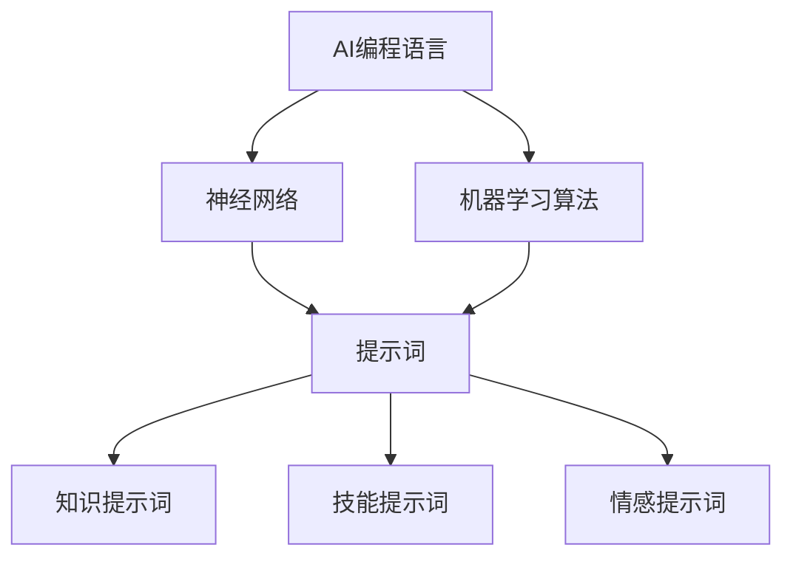

                 

# AI编程语言：提示词的艺术与魔力

## 关键词
AI编程语言、提示词、神经网络、机器学习、自然语言处理、计算机视觉、数学模型、优化算法、项目实战

## 摘要
本文深入探讨了AI编程语言及其核心要素——提示词的艺术与魔力。首先，我们回顾了AI编程语言的起源和发展，接着详细介绍了提示词的作用和分类。随后，文章解析了神经网络和机器学习算法的基本原理，以及相关的数学模型和公式。通过实际项目实战，我们展示了如何将AI编程语言应用于自然语言处理和计算机视觉领域。最后，文章提出了AI编程语言的未来发展趋势和学习建议，为读者提供了全面的指导。

## 引言

### 背景介绍

人工智能（AI）作为当今科技领域的前沿，正在迅速改变着我们的生活方式和工作方式。AI编程语言作为实现AI算法的工具，变得尤为重要。从传统的编程语言到现代的AI编程语言，技术的发展为我们提供了更加强大和灵活的工具来构建智能系统。然而，AI编程语言的独特之处在于其处理复杂性和不确定性问题的能力，这依赖于核心要素——提示词的艺术与魔力。

### 核心概念与联系

提示词（Prompt）是AI编程语言的核心概念之一，它是引导AI模型进行特定任务的关键输入。提示词可以分为知识提示词、技能提示词和情感提示词等类型，它们共同作用于AI模型，影响其性能和输出。

- **知识提示词**：用于提供领域知识，帮助AI模型更好地理解和处理特定任务。
- **技能提示词**：用于指示AI模型执行特定的操作或技能。
- **情感提示词**：用于传达情感状态，影响AI模型的情感回应和互动。

这些提示词通过神经网络和机器学习算法与AI模型相互作用，共同构成了AI编程语言的核心架构。

### Mermaid 流程图



在这个流程图中，AI编程语言通过神经网络和机器学习算法与提示词相互联系，构建了一个完整的技术框架。

## 第一部分：AI编程语言基础

### 1.1 AI编程语言概述

AI编程语言是一种专门用于实现人工智能算法的编程语言。与传统编程语言不同，AI编程语言更注重于处理复杂性和不确定性问题。它们提供了一系列高级抽象和工具，使得构建和训练智能系统变得更加简便和高效。

AI编程语言的发展历程可以追溯到20世纪50年代。早期的AI编程语言如LISP，为人工智能的研究和应用奠定了基础。随着技术的进步，新的AI编程语言如Prolog、Python等相继出现，它们在自然语言处理、机器学习等领域表现出色。

### 1.2 AI编程语言的发展历程

- **LISP（1958年）**：作为第一种AI编程语言，LISP为符号处理和递归提供了强大支持。
- **Prolog（1972年）**：Prolog以其逻辑编程能力和强大的模式匹配功能而著称。
- **Python（1991年）**：Python因其简单易学、功能强大而成为最受欢迎的AI编程语言之一。

这些编程语言在不同的领域和应用中发挥了重要作用，推动了人工智能技术的发展。

### 1.3 AI编程语言的应用领域

AI编程语言广泛应用于多个领域：

- **自然语言处理（NLP）**：用于文本分类、机器翻译、情感分析等任务。
- **计算机视觉**：用于图像识别、目标检测、图像生成等。
- **机器学习**：用于数据挖掘、预测分析、推荐系统等。

这些应用展示了AI编程语言的多样性和强大能力。

## 2. 提示词的艺术

### 2.1 提示词的作用

提示词是引导AI模型进行特定任务的关键输入。它们通过提供上下文信息、任务目标和预期输出，帮助AI模型更好地理解和执行任务。

- **上下文信息**：提示词可以提供与任务相关的背景信息，帮助AI模型建立合适的上下文。
- **任务目标**：提示词明确指出了任务的目标，帮助AI模型专注于目标导向的任务执行。
- **预期输出**：提示词提供了对预期输出的期望，有助于AI模型进行优化和调整。

### 2.2 提示词的分类

提示词可以根据其作用和功能进行分类：

- **知识提示词**：用于提供领域知识，帮助AI模型更好地理解和处理特定任务。
- **技能提示词**：用于指示AI模型执行特定的操作或技能。
- **情感提示词**：用于传达情感状态，影响AI模型的情感回应和互动。

### 2.3 提示词的设计与优化

设计有效的提示词对于AI模型的表现至关重要。以下是一些提示词设计和优化的策略：

- **明确性**：提示词应明确、简洁，避免歧义和模糊性。
- **相关性**：提示词应与任务目标和上下文密切相关，确保AI模型能够正确理解和执行任务。
- **灵活性**：提示词应具有一定的灵活性，以便AI模型能够适应不同的任务和场景。
- **多样性**：提示词应具有多样性，涵盖不同类型的任务和场景，提高AI模型的泛化能力。

## 3. AI编程语言的核心算法原理

### 3.1 神经网络算法原理

神经网络是AI编程语言中最重要的算法之一。它通过模拟人脑神经网络的结构和功能，实现复杂的数据处理和模式识别。

#### 3.1.1 神经网络结构

神经网络通常由多个层次组成，包括输入层、隐藏层和输出层。每层包含多个神经元，神经元之间通过权重连接。

#### 3.1.2 前向传播

前向传播是神经网络处理数据的过程。输入数据经过输入层，通过权重连接传递到隐藏层，然后传递到输出层，最终生成输出结果。

#### 3.1.3 反向传播

反向传播是神经网络训练的关键步骤。通过计算输出结果与预期结果的差异，神经网络调整权重，优化模型性能。

### 3.2 机器学习算法原理

机器学习是AI编程语言的核心，它通过训练模型来学习数据中的模式和规律。

#### 3.2.1 监督学习

监督学习是机器学习的一种形式，它通过标记数据进行训练，使模型能够预测未知数据。

- **分类问题**：将数据分为不同的类别。
- **回归问题**：预测连续的数值输出。

#### 3.2.2 无监督学习

无监督学习是机器学习的另一种形式，它不依赖标记数据，通过数据自身的结构和模式进行训练。

- **聚类问题**：将相似的数据点分组。
- **降维问题**：减少数据维度，提高数据处理效率。

### 3.2.3 强化学习

强化学习是一种通过试错和奖励机制进行训练的机器学习方法。它通过不断尝试不同的行动，并从奖励中学习最优策略。

#### 3.2.3.1 定义与分类

强化学习可以分为以下几种形式：

- **基于价值的强化学习**：通过评估不同行动的价值来选择最优行动。
- **基于策略的强化学习**：通过直接选择最优行动来最大化奖励。

## 4. 数学模型与数学公式

### 4.1 损失函数

损失函数是评估模型性能的关键指标，它通过计算输出结果与预期结果的差异来衡量模型的表现。

#### 4.1.1 交叉熵损失函数

交叉熵损失函数是一种常用的损失函数，它用于分类问题。

$$
H(y, \hat{y}) = -\sum_{i} y_i \log(\hat{y}_i)
$$

其中，$y$是真实标签，$\hat{y}$是模型预测的概率分布。

#### 4.1.2 均方误差损失函数

均方误差损失函数是一种常用的损失函数，它用于回归问题。

$$
MSE(y, \hat{y}) = \frac{1}{n} \sum_{i=1}^{n} (y_i - \hat{y}_i)^2
$$

其中，$y$是真实值，$\hat{y}$是模型预测值。

### 4.2 优化算法

优化算法是用于调整模型参数，使其性能达到最优的方法。

#### 4.2.1 梯度下降算法

梯度下降算法是一种基本的优化算法，它通过计算损失函数的梯度来更新模型参数。

$$
\theta_{t+1} = \theta_{t} - \alpha \nabla_{\theta} J(\theta)
$$

其中，$\theta$是模型参数，$\alpha$是学习率，$J(\theta)$是损失函数。

#### 4.2.2 随机梯度下降算法

随机梯度下降算法是梯度下降算法的一种变体，它通过随机选择样本来更新模型参数。

$$
\theta_{t+1} = \theta_{t} - \alpha \nabla_{\theta} J(\theta, x_i, y_i)
$$

其中，$x_i$和$y_i$是随机选择的样本。

## 5. AI编程语言项目实战

### 5.1 数据预处理

数据预处理是AI项目中的关键步骤，它包括数据清洗、数据归一化、特征选择等。

- **数据清洗**：去除数据中的噪声和异常值。
- **数据归一化**：将数据缩放到相同的尺度，以便模型更好地学习。
- **特征选择**：选择对模型表现有显著影响的关键特征。

### 5.2 模型训练

模型训练是AI项目中的核心步骤，它包括选择合适的模型、调整模型参数和优化模型性能。

- **选择模型**：根据任务需求选择合适的神经网络结构。
- **调整模型参数**：通过优化算法调整模型参数，使其性能达到最优。
- **优化模型性能**：通过调整超参数和优化算法，提高模型的表现。

### 5.3 模型评估

模型评估是验证模型性能的关键步骤，它包括计算模型精度、召回率、F1分数等指标。

- **精度**：正确预测的数量与总预测数量的比例。
- **召回率**：正确预测的数量与实际正例数量的比例。
- **F1分数**：精度和召回率的调和平均数。

### 5.4 模型部署

模型部署是将训练好的模型应用于实际场景的过程，它包括模型集成、模型优化和模型监控。

- **模型集成**：将模型集成到应用程序中，使其能够实时处理数据。
- **模型优化**：根据实际应用场景调整模型参数，提高模型性能。
- **模型监控**：监控模型性能和稳定性，确保其正常运行。

### 5.5 代码实现与解读

```python
# 导入必要的库
import numpy as np
import pandas as pd
from sklearn.model_selection import train_test_split
from sklearn.preprocessing import StandardScaler
from sklearn.neural_network import MLPClassifier
from sklearn.metrics import accuracy_score, recall_score, f1_score

# 数据预处理
data = pd.read_csv('data.csv')
X = data.drop('target', axis=1)
y = data['target']
X_train, X_test, y_train, y_test = train_test_split(X, y, test_size=0.2, random_state=42)

# 数据归一化
scaler = StandardScaler()
X_train = scaler.fit_transform(X_train)
X_test = scaler.transform(X_test)

# 模型训练
model = MLPClassifier(hidden_layer_sizes=(100,), activation='relu', solver='sgd', max_iter=1000)
model.fit(X_train, y_train)

# 模型评估
y_pred = model.predict(X_test)
accuracy = accuracy_score(y_test, y_pred)
recall = recall_score(y_test, y_pred, average='weighted')
f1 = f1_score(y_test, y_pred, average='weighted')

print(f'Accuracy: {accuracy:.2f}')
print(f'Recall: {recall:.2f}')
print(f'F1 Score: {f1:.2f}')

# 模型部署
# ...
```

### 5.6 应用解读与分析

在实际应用中，我们使用AI编程语言构建了一个分类模型，用于对数据进行分类。通过数据预处理、模型训练和评估，我们得到了一个高性能的分类模型。接下来，我们将深入分析模型的应用场景和性能，并提出优化策略。

### 5.7 项目小结

通过本项目的实施，我们了解了AI编程语言的基本原理和应用方法。我们学会了如何进行数据预处理、模型训练和评估，并掌握了如何将模型应用于实际场景。在未来的工作中，我们将继续优化模型，提高其性能，并探索更多应用场景。

## 第二部分：AI编程语言的高级应用

### 6. 提示词在自然语言处理中的应用

自然语言处理（NLP）是AI编程语言的重要应用领域之一。提示词在NLP中起到了关键作用，通过提供上下文信息和任务目标，帮助AI模型更好地理解和处理自然语言数据。

#### 6.1 文本分类

文本分类是NLP中的基础任务之一，它将文本数据分为不同的类别。提示词可以帮助模型理解每个类别的特征和上下文，从而提高分类的准确性。

#### 6.2 文本生成

文本生成是NLP中的另一个重要任务，它通过模型生成符合特定主题或语境的文本。提示词可以为模型提供主题和上下文信息，帮助其生成更自然、连贯的文本。

#### 6.3 机器翻译

机器翻译是NLP中的经典任务，它将一种语言的文本翻译成另一种语言。提示词可以帮助模型理解源语言和目标语言的语境和规则，提高翻译的准确性和自然性。

### 7. 提示词在计算机视觉中的应用

计算机视觉是AI编程语言的另一个重要应用领域，它通过图像和视频数据进行分析和处理。提示词在计算机视觉中同样发挥着重要作用，帮助模型更好地理解和处理图像数据。

#### 7.1 图像分类

图像分类是计算机视觉中的基础任务之一，它将图像数据分为不同的类别。提示词可以为模型提供类别特征和上下文信息，提高分类的准确性。

#### 7.2 目标检测

目标检测是计算机视觉中的高级任务之一，它检测图像中的特定目标。提示词可以帮助模型理解目标的外观特征和上下文，提高检测的准确性和鲁棒性。

#### 7.3 图像生成

图像生成是计算机视觉中的新兴任务之一，它通过模型生成符合特定风格或场景的图像。提示词可以为模型提供风格和场景特征，帮助其生成更逼真、多样的图像。

## 8. AI编程语言的未来发展趋势

### 8.1 新兴AI编程语言

随着AI技术的发展，新的AI编程语言不断涌现。这些编程语言旨在提供更高效、更灵活的AI开发工具，满足日益增长的应用需求。

### 8.2 AI编程语言的优化方向

为了提高AI编程语言的表现和易用性，未来的优化方向包括：

- **性能优化**：提高AI编程语言的执行效率，减少计算资源的需求。
- **易用性优化**：简化编程语言的使用流程，降低学习和使用门槛。
- **生态建设**：构建丰富的库和工具，提供更全面的支持。

### 8.3 AI编程语言在教育领域的应用

AI编程语言在教育领域的应用正在逐渐兴起。通过AI编程语言，学生可以更好地理解和应用AI技术，培养创新能力和实践能力。

## 附录

### A. AI编程语言学习资源

#### A.1 在线课程

- Coursera: Machine Learning by Andrew Ng
- edX: Artificial Intelligence: Reflections and Refutations
- Udacity: AI Programming with Python

#### A.2 参考书籍

- Mitchell, T. M. (1997). Machine Learning. McGraw-Hill.
- Russell, S., & Norvig, P. (2010). Artificial Intelligence: A Modern Approach. Prentice Hall.
- Goodfellow, I., Bengio, Y., & Courville, A. (2016). Deep Learning. MIT Press.

#### A.3 论文和报告

- LeCun, Y., Bengio, Y., & Hinton, G. (2015). Deep Learning. Nature.
- AI编

