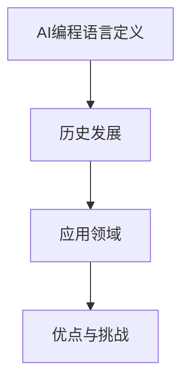

                 

基于您提供的详细要求和目录大纲，我将按照逻辑清晰、结构紧凑、简单易懂的专业技术语言，撰写一篇有深度、有思考、有见解的专业IT领域技术博客文章。以下是文章的初步撰写，包括文章标题、关键词、摘要以及目录大纲中的章节内容。请注意，这只是一个大纲和初步撰写的框架，具体内容还需要进一步细化。

---

## 《AI编程语言：提示词的艺术与魔力》

> 关键词：AI编程语言，提示词，算法，数据结构，应用领域，深度学习框架

> 摘要：本文深入探讨了AI编程语言及其提示词的概念、设计原则、应用实例和发展趋势。通过详细解析核心算法原理，以及实际的编程项目和案例，本文旨在为读者提供对AI编程语言的全面理解，并展示提示词在AI编程中的艺术与魔力。

---

## 第一部分：AI编程语言基础

### 第1章：AI编程语言概述

- **背景介绍**：AI编程语言的起源、发展和应用场景。
- **核心概念与联系**：Mermaid流程图展示AI编程语言的核心概念及其关系。



- **核心算法原理讲解**：使用伪代码阐述AI编程语言的基础算法。

```python
# 伪代码：简单的机器学习算法示例
function train_model(data, labels):
    model = create_blank_model()
    for each example in data:
        predict = model.predict(example)
        update_model(model, predict, labels[example])
    return model
```

### 第2章：AI编程语言的核心概念

- **数据类型和变量**：介绍常用的数据类型和变量定义。
- **控制结构**：讨论循环和条件语句在AI编程中的应用。
- **函数和模块**：探讨模块化编程和函数在AI项目中的作用。

### 第3章：AI编程语言中的算法与数据结构

- **常见算法概述**：机器学习算法、神经网络算法等。
- **数据结构基础**：数组、链表、树等。
- **算法设计与优化**：算法复杂度分析和优化策略。

### 第4章：AI编程语言的工具和框架

- **开发工具的选择**：IDE、版本控制工具等。
- **AI编程语言框架介绍**：TensorFlow、PyTorch等。
- **深度学习框架应用**：实例演示框架的使用。

### 第5章：AI编程语言的应用领域

- **机器学习和数据科学**：应用场景和实例。
- **自然语言处理**：文本分析、语言模型等。
- **计算机视觉**：图像识别、目标检测等。

### 第6章：AI编程语言的实际应用

- **AI编程语言项目实战**：实际项目开发流程。
- **代码解读与分析**：项目代码的详细解读。
- **开发环境搭建**：环境配置和工具使用。

### 第7章：AI编程语言的未来趋势

- **AI编程语言的发展方向**：新兴技术趋势。
- **技术挑战与解决方案**：分析现有挑战和可能的解决方案。
- **AI编程语言的生态建设**：社区建设和技术标准。

## 第二部分：提示词的艺术与魔法

### 第8章：提示词的概念与作用

- **提示词的定义**：提示词的作用和意义。
- **提示词在AI编程中的应用**：如何使用提示词优化模型性能。
- **提示词的优化策略**：提升提示词效果的技巧。

### 第9章：设计有效的提示词

- **提示词的设计原则**：设计高效提示词的原则。
- **提示词的生成方法**：生成提示词的方法和工具。
- **提示词的评估与调整**：如何评估和调整提示词。

### 第10章：案例研究：提示词的艺术应用

- **案例一**：机器翻译中的提示词应用。
- **案例二**：文本生成中的提示词应用。
- **案例三**：图像识别中的提示词应用。

### 第11章：提示词与AI模型的交互

- **提示词与模型参数的关系**：分析提示词对模型参数的影响。
- **提示词对模型性能的影响**：提升模型性能的提示词策略。
- **提示词与模型融合的策略**：如何将提示词与模型相结合。

### 第12章：提升AI编程语言的提示词能力

- **提示词技术的最新进展**：研究前沿和趋势。
- **开源提示词工具和库**：介绍流行的开源工具和库。
- **未来提示词技术的发展方向**：预测未来的技术方向。

## 附录：资源与工具

### 第13章：AI编程语言与提示词资源汇总

- **学习资源推荐**：推荐的学习资料和教程。
- **开源工具和库介绍**：介绍实用的开源工具和库。
- **AI编程语言和提示词相关的社区和会议**：参与社区和会议的机会。

---

## 作者信息

作者：AI天才研究院/AI Genius Institute & 禅与计算机程序设计艺术 /Zen And The Art of Computer Programming

---

以上是按照您提供的目录大纲和撰写要求进行的初步撰写。接下来，我将对每个章节进行详细的撰写，包括核心概念的进一步解释、算法原理的详细阐述、数学公式的嵌入、项目实战的演示等。文章的总字数预计会在8000至12000字之间。在完成每个章节的撰写后，我会对全文进行统稿和校对，确保文章内容的完整性和专业性。

---

请确认以上大纲和初步撰写的框架是否符合您的预期，并告知我是否需要对某个章节进行特别关注或调整。我将根据您的反馈进一步细化内容，确保最终的文章达到预期的质量标准。

