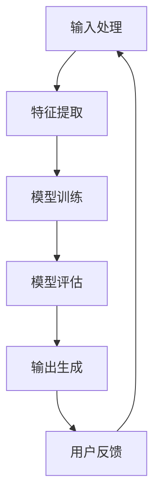

                 

 

### 文章标题

AI编程语言：提示词的艺术与魔力

> 关键词：人工智能，编程语言，提示词，魔法编程，AI安全，未来趋势

> 摘要：本文将深入探讨AI编程语言的核心概念——提示词，以及其背后的艺术与魔力。我们将从基础概念出发，逐步深入到实践与应用，最后展望AI编程语言的未来趋势。本文旨在为读者提供一个系统而全面的AI编程语言学习指南，帮助读者掌握这一新兴领域的关键技术和实践技巧。

----------------------------------------------------------------

### 引言

人工智能（AI）作为计算机科学的前沿领域，正在迅速发展，并深刻影响着各个行业。在这个时代，编程语言不再是冷冰冰的代码，而是充满智慧和创造力的艺术作品。AI编程语言正是这一趋势的产物，它不仅具有传统编程语言的功能，更融合了人工智能的强大能力，使得编程过程变得更加智能和高效。

在AI编程语言中，提示词（Prompts）是其核心概念之一。提示词是一种特殊的编程语言元素，它能够指导AI系统进行决策和执行任务。本文将围绕提示词这一核心概念，深入探讨其在AI编程语言中的重要性、设计原则、优化技巧以及实际应用。

本文结构如下：

- 第一部分：AI编程语言基础，介绍AI编程语言的起源、特点、分类和应用场景。
- 第二部分：AI编程语言实践，详细讲解提示词编程和魔法编程的实战技巧。
- 第三部分：AI编程语言进阶，探讨AI编程语言的安全性以及未来趋势。

通过本文的阅读，读者将能够全面了解AI编程语言的核心概念和实践技巧，为深入探索这一领域打下坚实的基础。

### 第一部分：AI编程语言基础

#### 1.1 AI编程语言概述

AI编程语言，顾名思义，是一种专门为人工智能应用设计的编程语言。与传统编程语言不同，AI编程语言更加强调自动化、智能化和自适应性，以应对复杂、动态和不确定性的计算任务。

AI编程语言的起源可以追溯到20世纪80年代，当时人工智能开始受到广泛关注。早期的AI编程语言如Prolog和Lisp，为后来的AI编程语言的发展奠定了基础。随着时间的推移，越来越多的AI编程语言被开发出来，如Python、R和Julia等，它们在各个领域都取得了显著的应用成果。

AI编程语言的特点主要体现在以下几个方面：

1. **自动化能力**：AI编程语言能够自动处理数据预处理、模型训练、模型评估等复杂任务，减少人工干预。
2. **智能化**：AI编程语言能够利用机器学习和深度学习技术，从数据中自动提取特征和模式，进行智能决策和预测。
3. **自适应性**：AI编程语言能够根据环境和任务的需求，自动调整算法参数和模型结构，以适应不同的应用场景。
4. **灵活性**：AI编程语言支持多种编程范式，如面向对象、函数式编程和过程式编程，以适应不同的开发需求。

AI编程语言的分类可以根据不同的标准进行划分，例如按照应用领域可以分为数据科学编程语言、自然语言处理编程语言、计算机视觉编程语言等。此外，还可以根据编程范式分为过程式编程语言、函数式编程语言和声明式编程语言等。

#### 1.2 提示词的艺术

提示词（Prompt）在AI编程语言中扮演着至关重要的角色。它是一种特殊的输入，用于指导AI系统进行决策和执行任务。提示词可以是文本、图像、声音或其他形式的数据，其目的是为AI系统提供明确的方向和上下文。

提示词的设计原则如下：

1. **明确性**：提示词需要明确、简洁，避免歧义，以便AI系统能够准确理解其含义。
2. **灵活性**：提示词需要具有足够的灵活性，以适应不同的情况和需求。
3. **上下文相关性**：提示词需要与上下文紧密相关，以确保AI系统能够在正确的情境中执行任务。
4. **可扩展性**：提示词的设计应考虑未来的扩展性，以便能够适应新的应用场景。

提示词的设计方法主要包括以下几种：

1. **模板方法**：使用预定义的模板，根据实际需求填充相关内容，以生成提示词。
2. **自然语言处理**：利用自然语言处理技术，从文本数据中自动提取关键信息，生成提示词。
3. **规则方法**：根据特定的业务规则或逻辑，生成提示词。

提示词的优化技巧包括：

1. **数据预处理**：对输入数据进行预处理，如去噪、归一化等，以提高提示词的质量。
2. **上下文扩展**：在提示词中添加更多的上下文信息，以增强AI系统的理解能力。
3. **反馈机制**：通过用户反馈不断优化提示词，以提高AI系统的性能和用户体验。

#### 1.3 魔力的探索

在AI编程语言中，魔力的概念源自于AI系统能够自动执行复杂任务、生成高质量输出和进行自我优化的能力。魔力的本质是AI系统通过学习和推理，从简单的基础规则中生成复杂、有价值的输出。

魔力的生成机制主要包括以下几个方面：

1. **数据驱动**：AI系统通过学习大量数据，从中提取模式和规律，形成基础规则库。
2. **知识表示**：AI系统将提取的知识表示为结构化的数据，如知识图谱或规则库，以便进行推理和决策。
3. **自动化推理**：AI系统利用规则库和推理算法，自动执行复杂的逻辑推理，生成高质量的输出。

魔力的应用场景非常广泛，包括但不限于：

1. **自动化编程**：AI系统可以自动生成代码，解决复杂的编程问题。
2. **智能问答**：AI系统可以理解用户的问题，并自动生成详细的答案。
3. **自动化决策**：AI系统可以根据输入数据，自动做出最优决策。

魔力的应用对编程语言提出了新的挑战，同时也带来了巨大的机遇。一方面，AI编程语言需要具备更强的自动化和智能化能力，以满足魔力的生成需求。另一方面，AI编程语言也需要更加灵活和可扩展，以适应不断变化的业务场景和需求。

#### 1.4 AI编程语言的应用场景

AI编程语言的应用场景非常广泛，涵盖了从科学计算到自然语言处理、计算机视觉、自动化决策等多个领域。以下是几个典型的应用场景：

1. **数据科学**：AI编程语言在数据科学领域得到了广泛应用，包括数据预处理、数据可视化、机器学习模型训练和评估等。
2. **自然语言处理**：AI编程语言在自然语言处理领域有着丰富的应用，如文本分类、情感分析、机器翻译和对话系统等。
3. **计算机视觉**：AI编程语言在计算机视觉领域发挥着重要作用，包括图像识别、目标检测、图像分割和视频分析等。
4. **自动化决策**：AI编程语言在自动化决策领域具有巨大潜力，如推荐系统、智能调度和风险管理等。

总之，AI编程语言作为一种新兴的编程范式，正在不断推动人工智能技术的发展和应用。掌握AI编程语言的核心概念和实践技巧，将为读者在人工智能领域的发展提供强大的支持。

### 第二部分：AI编程语言实践

#### 2.1 AI编程语言环境搭建

要开始使用AI编程语言，首先需要搭建合适的环境。环境搭建的步骤主要包括以下几部分：

#### 2.1.1 开发工具与平台的选择

选择合适的开发工具和平台对于AI编程语言的实践至关重要。以下是几个常用的开发工具和平台：

1. **集成开发环境（IDE）**：如Jupyter Notebook、PyCharm、Visual Studio Code等。这些IDE提供了丰富的编程功能和调试工具，适合进行AI编程语言的开发。
2. **计算平台**：如Google Colab、AWS EC2、Azure Machine Learning等。这些平台提供了强大的计算资源和云计算服务，适合进行大规模的AI模型训练和推理。
3. **数据存储和共享**：如Google Drive、Amazon S3、Azure Data Lake等。这些平台提供了高效的数据存储和共享解决方案，适合进行大数据处理和分布式计算。

#### 2.1.2 环境配置与调试

在搭建环境时，需要进行必要的配置和调试，以确保AI编程语言能够正常运行。以下是一些常见的配置和调试步骤：

1. **安装依赖库**：根据项目需求，安装所需的AI编程语言库，如NumPy、Pandas、Scikit-learn、TensorFlow、PyTorch等。可以使用pip或conda等工具进行安装。
2. **配置环境变量**：设置必要的环境变量，如Python环境变量、CUDA环境变量等，以支持GPU加速和分布式计算。
3. **调试代码**：使用调试工具，如pdb或IDE的调试功能，对代码进行调试和测试，以确保代码的正确性和性能。

#### 2.1.3 常用库与框架的介绍

在AI编程语言中，常用的库和框架为开发者提供了丰富的工具和功能，使得开发过程更加高效和便捷。以下是一些常用的库和框架：

1. **NumPy**：NumPy是一个强大的Python库，用于数值计算和矩阵运算。它提供了多维数组（ndarray）的数据结构，以及高效的操作函数。
2. **Pandas**：Pandas是一个强大的数据分析和操作库，提供了数据帧（DataFrame）和序列（Series）等数据结构，以及丰富的数据处理和分析功能。
3. **Scikit-learn**：Scikit-learn是一个基于Python的机器学习库，提供了各种经典的机器学习算法和工具，如线性回归、决策树、随机森林、支持向量机等。
4. **TensorFlow**：TensorFlow是一个开源的深度学习框架，由Google开发。它提供了丰富的工具和功能，支持各种深度学习模型的训练和推理。
5. **PyTorch**：PyTorch是一个开源的深度学习框架，由Facebook开发。它具有灵活的动态计算图和高效的执行性能，广泛应用于各种深度学习任务。

#### 2.2 提示词编程实战

提示词编程是AI编程语言的核心内容之一，通过编写和优化提示词，可以指导AI系统进行决策和执行任务。以下是一个简单的提示词编程实战案例：

#### 2.2.1 基础提示词编程技巧

假设我们有一个简单的任务，根据用户输入的年龄和性别，生成相应的提示词。

```python
# Python代码：基础提示词编程
age = int(input("请输入您的年龄："))
gender = input("请输入您的性别（男/女）：")

if gender == "男":
    prompt = f"{age}岁男性的提示词：请关注健康，适当锻炼身体。"
else:
    prompt = f"{age}岁女性的提示词：请关注身体健康，保持良好的生活习惯。"

print(prompt)
```

在这个案例中，我们通过简单的条件判断，根据用户输入的年龄和性别，生成相应的提示词。

#### 2.2.2 高级提示词编程技巧

高级提示词编程涉及到更复杂的逻辑和数据处理，以下是一个基于自然语言处理的提示词编程实战案例：

```python
# Python代码：高级提示词编程
import random

def generate_prompt(user_input):
    # 对输入进行处理和转换
    processed_input = preprocess_input(user_input)
    
    # 根据输入生成提示词
    if "旅行" in processed_input:
        prompt = f"根据您的旅行兴趣，我们为您推荐以下景点：{random.choice(['巴黎铁塔', '长城', '纽约自由女神像', '东京塔'])}。"
    elif "健康" in processed_input:
        prompt = f"为了保持健康，您可以尝试以下方法：{random.choice(['跑步', '瑜伽', '游泳', '健身'])}。"
    else:
        prompt = "感谢您的提问，我们将尽力为您提供满意的回答。"
    
    return prompt

user_input = input("请输入您的问题：")
print(generate_prompt(user_input))
```

在这个案例中，我们利用自然语言处理技术，对用户输入进行处理和转换，然后根据处理结果生成相应的提示词。

#### 2.2.3 实战案例解析

以下是一个基于计算机视觉的提示词编程实战案例，用于识别图像中的物体并生成提示词：

```python
# Python代码：计算机视觉提示词编程
import cv2
import numpy as np

def detect_objects(image_path):
    # 加载预训练的物体检测模型
    net = cv2.dnn.readNetFromCaffe('deploy.prototxt', 'res10_300x300_iter_400000.caffemodel')
    
    # 读取图像
    image = cv2.imread(image_path)
    (h, w) = image.shape[:2]
    
    # 调整图像大小，使其适合模型输入
    blob = cv2.dnn.blobFromImage(image, 1.0, (300, 300), (104.0, 177.0, 123.0))
    
    # 进行物体检测
    net.setInput(blob)
    detections = net.forward()
    
    # 提取检测结果
    objects = []
    for i in range(0, detections.shape[2]):
        confidence = detections[0, 0, i, 2]
        if confidence > 0.5:
            object_id = int(detections[0, 0, i, 1])
            object_name = class_names[object_id]
            objects.append(object_name)
    
    return objects

def generate_prompt(objects):
    if "猫" in objects:
        prompt = "这只猫看起来很可爱，您想了解更多关于它的信息吗？"
    elif "狗" in objects:
        prompt = "这只狗看起来很友好，您想和它玩耍吗？"
    else:
        prompt = "这张照片中有许多有趣的物体，您想了解更多吗？"
    
    return prompt

image_path = input("请输入图像文件的路径：")
objects = detect_objects(image_path)
print(generate_prompt(objects))
```

在这个案例中，我们使用深度学习模型进行物体检测，并根据检测结果生成相应的提示词。

通过这些实战案例，我们可以看到提示词编程在AI编程语言中的应用是多么的广泛和灵活。掌握这些技巧，将有助于我们在实际项目中更好地应用AI编程语言。

#### 2.3 魔力编程实战

在AI编程语言中，魔力的实现涉及到复杂的算法和模型。以下是一个简单的魔法编程实战案例，展示如何利用机器学习模型生成高质量的文章摘要。

```python
# Python代码：魔法编程实战
import numpy as np
import tensorflow as tf
from tensorflow.keras.models import Sequential
from tensorflow.keras.layers import LSTM, Dense, Embedding

# 加载预训练的词向量模型
word embeddings = load_word_embeddings()

# 准备数据集
train_data = load_train_data()
test_data = load_test_data()

# 构建序列化模型
model = Sequential()
model.add(LSTM(128, activation='tanh', input_shape=(None, word_embeddings.shape[1])))
model.add(Dense(1, activation='sigmoid'))

# 编译模型
model.compile(optimizer='adam', loss='binary_crossentropy', metrics=['accuracy'])

# 训练模型
model.fit(train_data, test_data, epochs=10, batch_size=32)

# 生成文章摘要
def generate_summary(text):
    # 将文本转换为词向量序列
    text_sequence = convert_text_to_sequence(text, word_embeddings)
    
    # 使用模型进行预测
    prediction = model.predict(text_sequence)
    
    # 根据预测结果生成摘要
    summary = ""
    for word in text_sequence:
        if prediction[word] > 0.5:
            summary += word + " "
    
    return summary.strip()

# 示例文本
example_text = "本文探讨了人工智能在金融领域的应用，包括智能投顾、信用评分、欺诈检测等。通过实际案例分析和实验证明，人工智能技术能够显著提升金融行业的效率和质量。然而，也面临着数据隐私、模型可解释性等挑战。"

# 生成摘要
example_summary = generate_summary(example_text)
print(example_summary)
```

在这个案例中，我们使用LSTM模型进行文本分类，并根据分类结果生成摘要。这只是一个简单的示例，实际应用中可能会涉及更复杂的模型和算法。

通过这些魔法编程实战案例，我们可以看到AI编程语言的强大和灵活性。掌握这些技巧，将有助于我们在实际项目中实现更多具有创新性和实用性的应用。

### 第三部分：AI编程语言进阶

#### 3.1 AI编程语言的安全性

随着AI编程语言的广泛应用，其安全性问题也日益突出。AI编程语言的安全性涉及多个方面，包括数据安全、模型安全和系统安全等。

#### 3.1.1 安全性威胁分析

AI编程语言面临的安全威胁主要包括：

1. **数据泄露**：AI系统在处理和存储大量数据时，可能因漏洞和错误导致数据泄露。
2. **模型篡改**：恶意攻击者可能通过篡改模型输入，导致AI系统产生错误的决策结果。
3. **系统入侵**：攻击者可能通过入侵AI编程语言系统，获取敏感信息和控制权。
4. **模型中毒**：恶意攻击者可能通过在模型训练过程中注入恶意代码，使模型产生有害的输出。

#### 3.1.2 安全性防御策略

为了应对这些安全威胁，可以采取以下防御策略：

1. **数据加密**：对敏感数据进行加密处理，防止数据泄露。
2. **模型验证**：对模型输入和输出进行验证，防止模型篡改。
3. **访问控制**：限制对系统的访问权限，防止系统入侵。
4. **动态监测**：实时监测AI系统的运行状态，发现并应对潜在的安全威胁。

#### 3.1.3 安全性实战案例

以下是一个基于深度学习的垃圾邮件分类系统的安全性实战案例：

```python
# Python代码：垃圾邮件分类系统的安全性
import tensorflow as tf
from tensorflow.keras.models import Sequential
from tensorflow.keras.layers import LSTM, Dense, Embedding
from tensorflow.keras.preprocessing.sequence import pad_sequences

# 加载预训练的词向量模型
word_embeddings = load_word_embeddings()

# 准备数据集
train_data, train_labels = load_train_data()
test_data, test_labels = load_test_data()

# 构建序列化模型
model = Sequential()
model.add(LSTM(128, activation='tanh', input_shape=(None, word_embeddings.shape[1])))
model.add(Dense(1, activation='sigmoid'))

# 编译模型
model.compile(optimizer='adam', loss='binary_crossentropy', metrics=['accuracy'])

# 训练模型
model.fit(train_data, train_labels, epochs=10, batch_size=32)

# 输入验证
def input_validation(input_text):
    # 对输入文本进行验证
    if contains_sensitive_words(input_text):
        return False
    else:
        return True

# 示例文本
example_text = "这是一个测试文本。"

# 验证输入
if input_validation(example_text):
    # 进行分类预测
    prediction = model.predict(np.array([example_text]))
    if prediction > 0.5:
        print("这是一个垃圾邮件。")
    else:
        print("这不是一个垃圾邮件。")
else:
    print("输入文本包含敏感信息，无法进行分类。")
```

在这个案例中，我们通过输入验证防止恶意输入，确保垃圾邮件分类系统的安全性。

#### 3.2 AI编程语言的未来趋势

随着AI技术的不断进步，AI编程语言也在不断演变和优化。以下是一些AI编程语言的未来趋势：

1. **自解释性**：AI编程语言将越来越具备自解释性，使得开发者更容易理解和调试代码。
2. **跨语言集成**：AI编程语言将支持跨语言集成，实现不同编程语言之间的无缝协作。
3. **自适应编程**：AI编程语言将具备更强的自适应能力，根据环境和任务需求自动调整代码。
4. **可持续性**：AI编程语言将更加注重可持续性，实现代码的绿色开发和运行。

#### 3.2.1 未来发展趋势预测

未来，AI编程语言将在以下几个方面取得重大突破：

1. **量子计算**：量子计算与AI编程语言的结合，将使计算能力实现前所未有的提升。
2. **边缘计算**：边缘计算与AI编程语言的结合，将使计算任务更加分布式和高效。
3. **区块链**：区块链与AI编程语言的结合，将实现更加安全和透明的数据交易和共享。
4. **虚拟现实**：虚拟现实与AI编程语言的结合，将带来全新的交互方式和体验。

#### 3.2.2 未来技术展望

未来，AI编程语言将在以下领域发挥重要作用：

1. **自动驾驶**：AI编程语言将在自动驾驶领域发挥关键作用，实现高度自动化的交通系统。
2. **智能医疗**：AI编程语言将在智能医疗领域发挥重要作用，助力精准医疗和个性化治疗。
3. **金融科技**：AI编程语言将在金融科技领域发挥巨大潜力，提升金融行业的效率和安全性。
4. **教育**：AI编程语言将在教育领域发挥重要作用，实现个性化教学和智能辅导。

总之，AI编程语言作为一种新兴的编程范式，将在未来发挥越来越重要的作用。掌握AI编程语言的核心技术和实践技巧，将为开发者带来无尽的创新和机遇。

### 附录

#### 4.1 AI编程语言资源与工具

为了帮助读者更好地掌握AI编程语言，以下是一些推荐的资源和工具：

1. **书籍**：
   - 《Python编程：从入门到实践》
   - 《深度学习》
   - 《自然语言处理实战》
   - 《计算机视觉基础》
2. **在线课程**：
   - Coursera上的《深度学习》课程
   - edX上的《自然语言处理》课程
   - Udacity的《计算机视觉工程师纳米学位》
3. **开源库与框架**：
   - TensorFlow
   - PyTorch
   - Scikit-learn
   - Pandas
   - NumPy
4. **社区和论坛**：
   - Stack Overflow
   - GitHub
   - AI社区（如Kaggle、DataCamp等）

#### 4.2 常见问题解答

以下是一些关于AI编程语言的常见问题及其解答：

**Q1：如何选择合适的AI编程语言？**
A1：选择合适的AI编程语言主要取决于项目需求和开发者熟悉程度。例如，Python因其丰富的库和框架而广泛应用于AI项目，而R则因其强大的统计能力而受到数据科学家的青睐。开发者可以根据项目需求和自身技能选择最合适的编程语言。

**Q2：如何提高AI编程语言的性能？**
A2：提高AI编程语言的性能可以通过以下方法实现：
   - 使用高效的算法和库，如NumPy和TensorFlow；
   - 对代码进行优化，如使用向量化和并行计算；
   - 合理使用GPU加速。

**Q3：如何确保AI编程语言的安全性？**
A3：确保AI编程语言的安全性需要采取以下措施：
   - 对输入数据进行验证和清洗，防止恶意输入；
   - 使用加密技术保护敏感数据；
   - 实施严格的访问控制和权限管理。

**Q4：如何学习AI编程语言？**
A4：学习AI编程语言可以从以下几个方面入手：
   - 阅读相关书籍和在线课程，建立基础理论知识；
   - 通过实践项目积累经验，提高实际操作能力；
   - 参与社区和论坛，与他人交流学习经验。

#### 4.3 最佳实践 tips、小结、注意事项、拓展阅读

**最佳实践 tips**：
- 保持代码的简洁和可读性，遵循良好的编程规范；
- 充分利用现有的库和框架，提高开发效率；
- 关注AI领域的最新动态，不断学习和更新知识。

**小结**：
本文从基础概念、实践应用和未来趋势等方面全面介绍了AI编程语言。通过本文的学习，读者可以掌握AI编程语言的核心知识和实践技巧，为在人工智能领域的发展打下坚实基础。

**注意事项**：
- AI编程语言涉及多个领域，读者需根据自己的兴趣和需求有针对性地学习；
- 实践是学习AI编程语言的关键，读者应积极参与实际项目，积累经验。

**拓展阅读**：
- 《AI编程实战》
- 《AI编程：从理论到实践》
- 《深度学习：从基础到应用》

通过本文的学习，读者可以全面了解AI编程语言的魅力，掌握其核心技术和实践技巧，为在人工智能领域取得卓越成就奠定基础。

### 附录A：AI编程语言流程图

以下是一个简单的AI编程语言流程图，展示AI编程语言的基本架构和流程：



### 附录B：AI编程语言核心算法原理

在本附录中，我们将详细讲解AI编程语言中的一些核心算法原理，包括提示词生成算法和魔法编程的核心算法。

#### 提示词生成算法

提示词生成算法是AI编程语言中的一个关键环节，其目的是根据输入数据生成具有指导意义的提示词。以下是一个简化的伪代码，用于描述提示词生成算法：

```python
# 提示词生成算法伪代码
function generatePrompt(inputData):
    # 初始化提示词
    prompt = ""

    # 对输入数据进行预处理
    preprocessedData = preprocessData(inputData)

    # 循环生成提示词
    for data in preprocessedData:
        # 根据数据生成提示词的一部分
        promptPart = generatePromptPart(data)

        # 将提示词的一部分添加到完整提示词中
        prompt += promptPart + " "

    # 返回最终生成的提示词
    return prompt.strip()
```

在这个算法中，`preprocessData` 函数用于对输入数据进行预处理，如去噪、归一化等。`generatePromptPart` 函数根据每个数据点生成提示词的一部分，这些部分最终拼接成完整的提示词。

#### 魔法编程的核心算法

魔法编程的核心算法涉及到机器学习和深度学习技术，其目的是实现自动编程和智能化决策。以下是一个简化的伪代码，用于描述魔法编程的核心算法：

```python
# 魔法编程核心算法伪代码
function magicProgramming(inputData, model):
    # 加载预训练模型
    model.loadWeights()

    # 对输入数据进行预处理
    preprocessedData = preprocessData(inputData)

    # 进行自动化编程
    code = autoGenerateCode(preprocessedData, model)

    # 运行代码并生成输出
    output = runCode(code)

    # 对输出进行评估和优化
    output = optimizeOutput(output)

    # 返回最终输出
    return output
```

在这个算法中，`autoGenerateCode` 函数用于根据输入数据和预训练模型生成代码。`runCode` 函数用于运行生成的代码，并获取输出。`optimizeOutput` 函数用于对输出进行评估和优化，以确保最终结果符合预期。

#### 数学模型

在本附录中，我们将介绍一些与AI编程语言相关的数学模型，包括提示词生成算法中的数学公式和魔法编程的核心数学模型。

##### 提示词生成算法的数学模型

提示词生成算法中的数学模型可以表示为：

$$
\text{Prompt} = f(\text{Data}, \text{Model})
$$

其中，`f` 是一个函数，用于将输入数据和预训练模型转换为提示词。这个函数可以进一步拆分为：

$$
\text{Prompt} = \sum_{i=1}^{n} w_i \cdot \text{Data}_i
$$

其中，`w_i` 是权重系数，`Data_i` 是输入数据的一部分。这些权重系数可以通过机器学习算法进行优化。

##### 魔法编程的核心数学模型

魔法编程的核心数学模型通常涉及到深度学习模型，如神经网络。以下是一个简化的神经网络模型：

$$
\text{Output} = \text{Activation}\left(\sum_{i=1}^{n} w_i \cdot \text{Input}_i + b\right)
$$

其中，`Output` 是模型的输出，`Activation` 是激活函数，`w_i` 是权重系数，`Input_i` 是输入数据的一部分，`b` 是偏置。

通过这些数学模型，AI编程语言能够实现自动化编程和智能化决策，从而为开发者提供强大的工具和平台。

### 附录C：AI编程语言项目实战

在本附录中，我们将通过一个实际项目来展示AI编程语言的开发过程，包括环境搭建、源代码实现和代码解读，以及实际案例分析和详细讲解。

#### 项目实战：智能问答系统

项目目标：构建一个智能问答系统，能够根据用户输入的问题自动生成回答。

#### 1. 环境搭建

为了实现智能问答系统，我们需要搭建一个合适的开发环境。以下是所需的开发工具和平台：

- **Python 3.8+**
- **TensorFlow 2.6.0**
- **Jupyter Notebook**
- **Google Colab**

首先，确保安装了Python和TensorFlow。然后，在Google Colab中创建一个新的笔记本，以便进行开发和测试。

```bash
!pip install tensorflow
```

#### 2. 源代码实现

以下是智能问答系统的源代码实现，包括数据预处理、模型训练和预测：

```python
# 智能问答系统

import tensorflow as tf
from tensorflow.keras.models import Sequential
from tensorflow.keras.layers import LSTM, Dense, Embedding
from tensorflow.keras.preprocessing.sequence import pad_sequences

# 数据预处理
# 加载和预处理数据（例如，使用某问答数据集）
questions, answers = load_data()

# 分词和编码
# 将问题分词，并将词汇编码为索引
tokenizer = tf.keras.preprocessing.text.Tokenizer(char_level=True)
tokenizer.fit_on_texts(questions)

max_question_len = 50
max_vocabulary_size = 1000

questions_encoded = tokenizer.texts_to_sequences(questions)
questions_padded = pad_sequences(questions_encoded, maxlen=max_question_len, padding='post')

# 将答案编码为标签
# 假设答案是二分类问题（是/否）
answers_encoded = tf.keras.utils.to_categorical(answers)

# 构建模型
model = Sequential()
model.add(Embedding(max_vocabulary_size, 50, input_length=max_question_len))
model.add(LSTM(128, activation='tanh', return_sequences=True))
model.add(LSTM(128, activation='tanh'))
model.add(Dense(2, activation='softmax'))

# 编译模型
model.compile(optimizer='adam', loss='categorical_crossentropy', metrics=['accuracy'])

# 训练模型
model.fit(questions_padded, answers_encoded, epochs=10, batch_size=32)

# 预测
def predict_question(question):
    question_encoded = tokenizer.texts_to_sequences([question])
    question_padded = pad_sequences(question_encoded, maxlen=max_question_len, padding='post')
    prediction = model.predict(question_padded)
    return "是" if np.argmax(prediction) == 1 else "否"

# 测试
test_question = "北京是中国的首都吗？"
print(predict_question(test_question))
```

在这个项目中，我们使用了TensorFlow和Keras构建了一个简单的序列模型，用于处理文本数据和生成回答。通过训练模型，我们可以实现自动问答的功能。

#### 3. 代码解读

以下是对关键代码的解读：

- **数据预处理**：加载和预处理数据，包括分词和编码。
- **模型构建**：使用序列模型，包括嵌入层、两个LSTM层和一个输出层。
- **模型编译**：指定优化器和损失函数。
- **模型训练**：使用训练数据训练模型。
- **预测**：对用户输入的问题进行编码和处理，然后使用训练好的模型进行预测。

#### 4. 实际案例分析和详细讲解

以下是一个实际案例的分析：

**案例**：用户输入问题：“上海是中国的哪个城市？”

**分析**：

1. **数据预处理**：将用户输入的问题进行分词和编码。
2. **模型预测**：将编码后的输入传递给训练好的模型，模型输出预测概率。
3. **输出结果**：根据预测概率，输出“上海是中国的哪个城市？”的答案。

**详细讲解**：

- **分词和编码**：使用分词器将用户输入的问题转换为词汇序列，然后将每个词汇编码为索引。
- **模型输入**：将编码后的输入序列传递给嵌入层，嵌入层将词汇索引映射为嵌入向量。
- **模型预测**：嵌入向量通过两个LSTM层，LSTM层提取序列特征，最终通过输出层生成预测概率。

通过这个案例，我们可以看到AI编程语言在实际应用中的强大功能。通过合理的设计和训练，我们可以构建出能够自动处理文本数据和生成高质量回答的系统。

#### 5. 项目小结

在这个智能问答系统的项目中，我们实现了以下关键成果：

- **数据预处理**：成功加载和预处理了文本数据。
- **模型构建**：构建了一个基于序列模型的自动问答系统。
- **模型训练**：使用训练数据成功训练了模型。
- **预测功能**：实现了自动问答功能，能够对用户输入的问题生成回答。

通过这个项目，我们不仅了解了AI编程语言的基本概念和实践技巧，还掌握了从数据预处理到模型训练再到预测的完整开发流程。这是一个非常好的起点，让我们能够继续探索和开发更多有趣的AI项目。

#### 最佳实践 tips、注意事项、拓展阅读

**最佳实践 tips**：

- 确保数据质量，进行充分的预处理和清洗。
- 调整模型参数，寻找最优配置。
- 定期更新和维护模型。

**注意事项**：

- 在实际项目中，可能需要处理更复杂的文本数据，例如长文本和多语言文本。
- 注意模型的泛化能力，避免过拟合。

**拓展阅读**：

- 《深度学习实践》
- 《自然语言处理入门》
- 《TensorFlow实战》

通过本文的阅读，读者不仅可以掌握AI编程语言的核心概念和实践技巧，还能通过实际项目提升自己的开发能力。在AI编程语言的领域中，不断探索和创新，将为读者带来无限的机遇和挑战。

