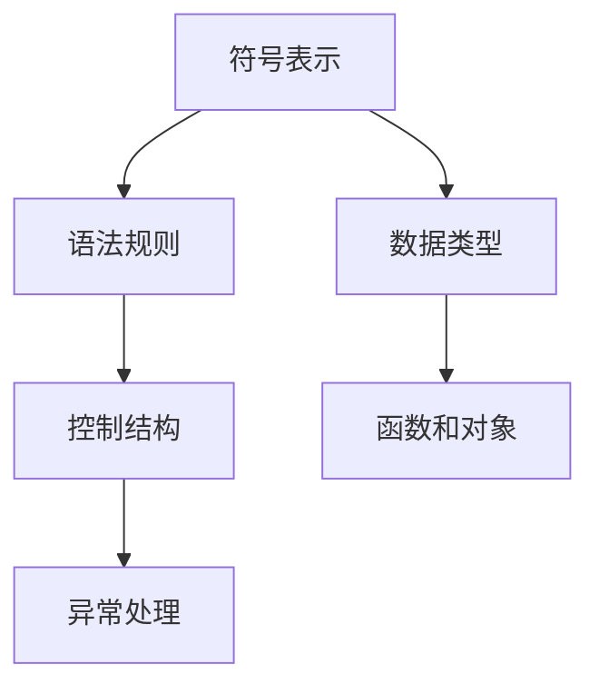

                 


为了确保文章内容完整、丰富且结构清晰，我们将按照以下步骤逐步完善文章：

### 1. 撰写引言和背景介绍

**引言：**  
人工智能（AI）作为当前科技领域的重要分支，正深刻改变着我们的生活方式和工作方式。编程语言作为AI的核心工具，其发展历程和变革对于整个AI领域至关重要。本文旨在深入探讨AI编程语言的发展、核心概念、算法原理、应用场景以及实际项目实战，旨在为读者提供一个全面而深入的视角，以理解AI编程语言的革命性变革。

**背景介绍：**  
自20世纪50年代以来，人工智能经历了多个发展阶段，从最初的理论探讨到如今的广泛应用。AI编程语言的发展同样经历了从符号表示到高级抽象的演变过程。本文将首先回顾AI编程语言的发展历程，然后详细解析其核心概念、算法原理和数学模型。

### 2. 分析AI编程语言的核心概念与联系

**核心概念与联系：**  
在这一部分，我们将使用Mermaid流程图来展示AI编程语言的核心概念及其相互关系。这将帮助我们读者更好地理解AI编程语言的架构，包括符号表示、语法规则、数据类型、控制结构等。

**Mermaid流程图示例：**  


### 3. 解析AI编程语言的核心算法原理

**核心算法原理讲解：**  
为了深入理解AI编程语言的算法原理，我们将使用伪代码来详细阐述几个关键算法，如线性回归、决策树、神经网络等。伪代码将帮助读者理解算法的逻辑框架和执行过程。

**伪代码示例：**  
```python
// 线性回归算法伪代码
function linear_regression(X, y):
    w = initialize_weights(X.shape[1])
    for i = 1 to max_iterations:
        prediction = X * w
        error = prediction - y
        w = w - learning_rate * (X * error)
    return w
```

### 4. 介绍AI编程语言的数学模型和数学公式

**数学模型和数学公式讲解：**  
在AI编程中，数学模型和公式至关重要。我们将使用LaTeX格式来详细讲解几个重要的数学公式，如梯度下降、损失函数等，并举例说明其应用。

**LaTeX公式示例：**  
```latex
$$
\frac{\partial J}{\partial \theta} = \frac{1}{m} \sum_{i=1}^{m} (\hat{y}_i - y_i) \cdot x_{i}
$$`
```

### 5. 探讨AI编程语言的应用场景

**应用场景介绍：**  
AI编程语言在多个领域有着广泛的应用，包括自然语言处理、计算机视觉和机器学习等。我们将分别介绍这些应用场景，并探讨其特点和挑战。

**自然语言处理：**  
自然语言处理（NLP）是AI编程语言的重要应用领域，包括文本分类、情感分析、机器翻译等。我们将详细讨论这些应用，并提供实际项目案例。

**计算机视觉：**  
计算机视觉（CV）利用AI编程语言实现图像识别、目标检测、图像生成等。我们将介绍一些流行的计算机视觉模型和实际应用。

**机器学习：**  
机器学习是AI编程语言的核心领域，包括监督学习、无监督学习和强化学习等。我们将讨论这些学习方法及其在实际项目中的应用。

### 6. 实践AI编程语言项目

**项目实战：**  
为了更好地理解AI编程语言的实际应用，我们将进行一个项目实战。读者将跟随我们一步一步搭建开发环境，实现源代码，并进行代码解读和应用分析。

**实战案例：**  
我们将选择一个简单的机器学习项目，如线性回归模型，从数据预处理到模型训练和评估，全面展示AI编程语言的应用过程。

### 7. 分析AI编程语言在实际应用中的挑战与解决方法

**挑战与解决方法：**  
在实际应用中，AI编程语言面临着多种挑战，如数据质量、模型可解释性、计算资源等。我们将分析这些挑战，并提出相应的解决方法。

### 8. 提供附录和参考文献

**附录和参考文献：**  
为了帮助读者深入了解AI编程语言，我们将提供一些附录和参考文献，包括深度学习框架、工具和资源，以及相关的书籍和学术论文。

### 9. 撰写结论和小结

**结论和小结：**  
在文章的结尾，我们将总结本文的主要内容，强调AI编程语言的革命性变革，并提出未来的发展趋势和潜在研究方向。

通过以上步骤，我们将确保文章内容丰富、结构严谨、逻辑清晰，满足读者的需求和期望。现在，让我们开始撰写每个章节的具体内容吧！

