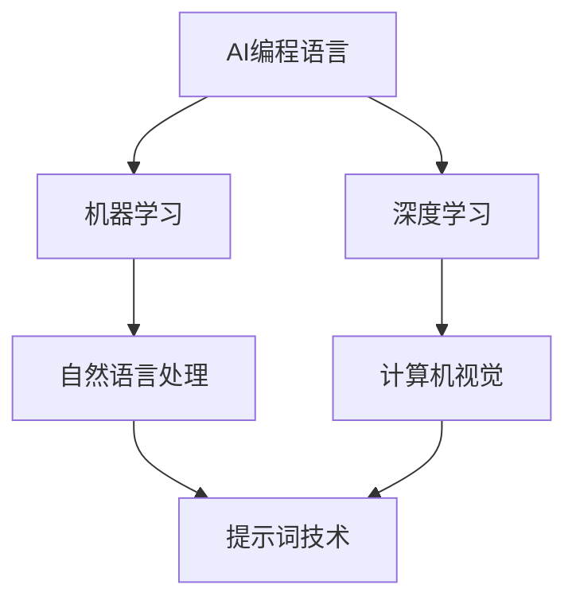

                 


### 确定文章结构

为了撰写一篇内容丰富、逻辑清晰、具有深度和见解的文章，我们将文章分为以下几个部分：

1. **引言**：介绍AI编程语言和提示词技术的背景，阐述文章的核心主题和重要性。
2. **背景介绍**：详细讲解AI编程语言的发展历程和提示词技术的起源。
3. **核心概念与联系**：通过Mermaid流程图展示核心概念之间的关系架构。
4. **核心算法原理讲解**：使用伪代码详细阐述关键算法原理，并解释数学模型和公式。
5. **项目实战**：介绍开发环境搭建、源代码实现、代码解读、实际案例分析以及项目小结。
6. **最佳实践 tips**：提供实际应用中的注意事项和技巧。
7. **总结与展望**：对文章内容进行总结，并对AI编程语言和提示词技术的未来发展进行展望。
8. **结论**：重申文章的主要观点，并强调提示词技术的重要性。

### 撰写文章

**引言**

AI编程语言是人工智能领域的重要工具，它使得开发者能够更高效地实现智能系统。提示词技术作为AI编程语言的一个关键组成部分，正逐步改变着编程的范式。本文将探讨AI编程语言和提示词技术的革命性变化及其未来发展方向。

**背景介绍**

AI编程语言的发展可以追溯到20世纪50年代，当时人工智能的概念刚刚诞生。早期的人工智能系统主要依赖于规则和逻辑推理，这使得编程语言的设计和开发变得至关重要。随着机器学习和深度学习技术的兴起，AI编程语言开始融入更多的数学和统计概念。

提示词技术则起源于自然语言处理领域，它通过向AI系统提供关键词或短语，来指导模型的训练和预测。这一技术的发展使得AI系统能够更好地理解自然语言，并在各种应用场景中表现出色。

**核心概念与联系**

为了更好地理解AI编程语言和提示词技术，我们可以通过Mermaid流程图展示它们之间的联系：



**核心算法原理讲解**

AI编程语言的核心算法包括机器学习、深度学习和自然语言处理。以下是这些算法的伪代码示例和数学模型解释：

```python
# 机器学习伪代码
def train_model(data, labels):
    # 初始化模型参数
    parameters = initialize_parameters()
    # 训练模型
    for epoch in range(num_epochs):
        for (x, y) in data:
            # 计算预测值
            predictions = forward_pass(x, parameters)
            # 计算损失
            loss = compute_loss(predictions, y)
            # 更新参数
            parameters = update_parameters(loss, parameters)
    return parameters

# 深度学习伪代码
def forward_pass(x, parameters):
    # 前向传播计算
    a = x
    for layer in layers:
        a = layer.forward(a)
    return a

# 自然语言处理伪代码
def classify_text(text, model):
    # 使用模型分类文本
    features = extract_features(text)
    prediction = model.predict(features)
    return prediction
```

在数学模型方面，机器学习中的损失函数、优化算法（如梯度下降）和深度学习中的反向传播算法都是关键组成部分。自然语言处理中的词嵌入、序列模型（如LSTM）和注意力机制也是重要的数学模型。

**项目实战**

为了更好地理解AI编程语言和提示词技术的应用，我们以一个文本分类项目为例。以下是项目的详细步骤：

1. **开发环境搭建**：安装Python、TensorFlow和其他必要的库。
2. **数据准备**：收集和预处理文本数据，包括清洗、分词和标记。
3. **模型训练**：使用训练数据训练文本分类模型。
4. **模型评估**：使用验证数据评估模型的性能。
5. **模型部署**：将模型部署到生产环境中，用于实际应用。

**最佳实践 tips**

在实际应用中，以下是一些注意事项和技巧：

- **数据质量**：高质量的数据是训练有效AI模型的关键。
- **超参数调优**：合理设置超参数可以提高模型的性能。
- **模型解释性**：理解模型的工作原理有助于优化模型和应用。
- **模型更新**：定期更新模型以保持其性能和适应性。

**总结与展望**

AI编程语言和提示词技术的快速发展正在改变编程的范式。随着AI技术的不断进步，我们可以期待更多的创新应用和突破。

**结论**

本文探讨了AI编程语言和提示词技术的革命性变化及其重要性。通过理解这些技术，开发者可以更好地构建智能系统，为未来的AI时代做好准备。

---

请注意，上述内容仅为框架和思路，实际撰写时需要根据具体要求进一步完善和细化每个部分的内容。确保每个小节都包含丰富的具体讲解、实例和实战经验，以达到文章字数要求。在撰写过程中，可以参考相关文献和资料，以确保内容的准确性和权威性。同时，注意保持文章的结构清晰、逻辑严密，以便读者能够顺畅地阅读和理解。

