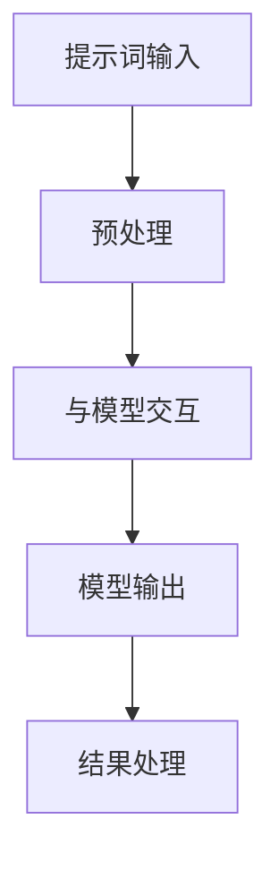
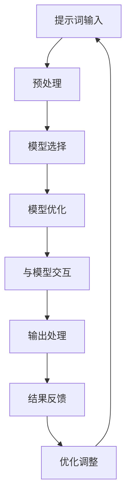
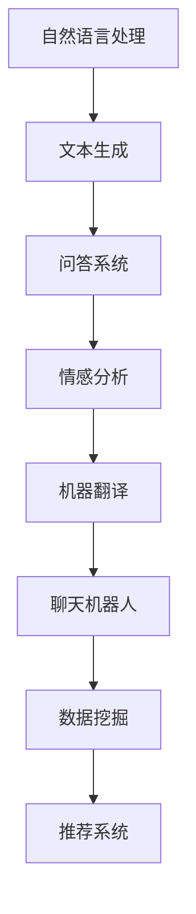

                 


### 文章标题 <AI编程语言：提示词的革命与未来>

#### 关键词

- AI编程语言
- 提示词
- 预训练模型
- 交互机制
- 数学模型
- 实战应用

#### 摘要

本文将深入探讨AI编程语言的革命与未来。首先，我们将从定义和起源开始，了解AI编程语言的概念和架构。接着，通过核心概念和流程图的解析，我们将展示AI编程语言的工作原理。随后，我们探讨技术原理，包括模型选择、优化以及数学模型的详细讲解。最后，通过实际案例和最佳实践，我们将展望AI编程语言的未来发展趋势。

## 概念与架构篇

### 1. AI编程语言概述

AI编程语言，是一种使开发者能够使用提示词与预训练模型交互的编程语言。它打破了传统编程语言的限制，提供了更为直观和高效的开发方式。

#### 1.1 AI编程语言的定义

$$
\text{AI编程语言：一种使开发者能够使用提示词（Prompts）与预训练模型（Pre-trained Models）交互的编程语言。}
$$

提示词是开发者与AI模型之间的桥梁，通过提示词，开发者可以指导模型进行特定的任务。预训练模型则是已经经过大量数据训练的模型，它能够处理各种复杂的任务。

#### 1.2 AI编程语言的起源与发展

AI编程语言的起源可以追溯到提示词的概念。在早期的人工智能研究中，提示词被用来与模型进行交互，通过调整提示词，开发者可以影响模型的输出。

随着深度学习技术的发展，预训练模型的出现进一步推动了AI编程语言的进步。预训练模型通过在大量数据上训练，获得了强大的通用性，使得开发者可以更加高效地使用这些模型。

### 1.3 AI编程语言的优势与挑战

#### 1.3.1 优势

$$
\text{优势：简化AI开发过程，提高开发效率，降低AI技术门槛。}
$$

AI编程语言使得开发AI系统变得更加简单和高效。通过使用提示词和预训练模型，开发者可以快速实现复杂的AI任务，而不需要深入了解底层的技术细节。

#### 1.3.2 挑战

- AI编程语言的局限性
- 对开发者的要求

尽管AI编程语言带来了很多便利，但它也带来了一些挑战。首先，AI编程语言的适用范围有限，对于一些特定的问题，可能需要使用其他技术手段来解决。其次，开发者需要具备一定的AI知识，才能有效地使用AI编程语言。

### 1.4 AI编程语言的核心概念与架构

#### 1.4.1 核心概念

- 提示词（Prompts）
- 预训练模型（Pre-trained Models）
- 交互机制（Interaction Mechanism）

这些核心概念构成了AI编程语言的基础，下面我们将逐一介绍。

## 2. AI编程语言的核心概念与架构

### 2.1 核心概念

#### 2.1.1 提示词（Prompts）

提示词是开发者与AI模型之间的交互接口。通过提示词，开发者可以指导模型进行特定的任务。

#### 2.1.2 预训练模型（Pre-trained Models）

预训练模型是经过大量数据训练的模型，它具有强大的通用性，可以处理各种复杂的任务。

#### 2.1.3 交互机制（Interaction Mechanism）

交互机制是AI编程语言的重要组成部分，它定义了开发者如何与模型进行交互，以及模型如何响应用户的输入。

### 2.2 AI编程语言的Mermaid流程图

#### 2.2.1 流程图1: AI编程语言的基本流程

以下是一个简化的Mermaid流程图，展示AI编程语言的基本流程：



#### 2.2.2 流程图2: AI编程语言的优化与调整

以下是一个更详细的Mermaid流程图，展示AI编程语言中的优化与调整过程：



#### 2.2.3 流程图3: AI编程语言的实用场景

以下是一个展示AI编程语言在不同应用场景中的Mermaid流程图：



## 3. AI编程语言的技术原理

### 3.1 模型选择与优化

#### 3.1.1 模型选择

模型选择是AI编程语言中的关键步骤。在选择模型时，需要考虑以下因素：

- 任务类型：不同的任务需要不同类型的模型。
- 数据规模：大量数据通常需要更强的模型。
- 计算资源：模型的计算复杂度会影响所需的计算资源。

#### 3.1.2 模型优化

模型优化是提高AI编程语言性能的重要手段。常见的优化方法包括：

- 超参数调整：通过调整模型的超参数，可以改善模型的性能。
- 正则化：通过添加正则化项，可以减少模型的过拟合现象。
- 模型融合：通过结合多个模型，可以进一步提高模型的性能。

### 3.2 提示词设计

#### 3.2.1 提示词设计原则

- 清晰性：提示词应该清晰明了，便于模型理解。
- 完整性：提示词应该包含所有必要的信息，以便模型能够完成任务。
- 精确性：提示词应该精确地描述任务，避免模糊不清。

#### 3.2.2 提示词优化

提示词优化是提高AI编程语言性能的关键步骤。常见的优化方法包括：

- 语言调优：通过调整提示词的语言表达，可以改善模型的输出质量。
- 数据增强：通过增加训练数据，可以增强模型的泛化能力。
- 多样性调整：通过引入多样性的提示词，可以防止模型陷入局部最优。

### 3.3 模型与提示词的交互

#### 3.3.1 交互原理

模型与提示词的交互是通过预训练模型和提示词之间的交互来实现的。预训练模型通过学习大量的数据，获得了丰富的知识，而提示词则为模型提供了具体的任务指导。

#### 3.3.2 交互优化

交互优化是提高AI编程语言性能的重要手段。常见的优化方法包括：

- 提示词优化：通过调整提示词的设计，可以改善模型的输出质量。
- 模型优化：通过调整预训练模型的结构和参数，可以进一步提高模型的性能。
- 交互策略调整：通过调整模型与提示词的交互策略，可以改善模型的性能。

### 3.4 AI编程语言的数学模型

#### 3.4.1 数学模型概述

数学模型是AI编程语言的基础。通过数学模型，我们可以描述AI编程语言的原理和机制。常见的数学模型包括线性回归、逻辑回归和支撑向量机等。

#### 3.4.2 线性回归

线性回归是一种简单的数学模型，用于描述两个变量之间的关系。其基本公式如下：

$$
y = w_1x_1 + w_2x_2 + ... + w_nx_n + b
$$

其中，$x$表示输入变量，$y$表示输出变量，$w$表示权重，$b$表示偏置。

#### 3.4.3 逻辑回归

逻辑回归是一种用于分类的数学模型。其基本公式如下：

$$
f(x) = \frac{1}{1 + e^{-(w_0 + w_1x_1 + w_2x_2 + ... + w_nx_n)} 
$$

其中，$x$表示输入变量，$y$表示输出概率。

#### 3.4.4 支撑向量机

支撑向量机是一种用于分类的数学模型。其基本公式如下：

$$
f(x) = \text{sign}(\omega \cdot x + b)
$$

其中，$x$表示输入变量，$\omega$表示权重，$b$表示偏置。

### 3.5 数学公式举例说明

#### 3.5.1 线性回归举例

假设我们有一个数据集$\{(x_1, y_1), (x_2, y_2), ..., (x_n, y_n)\}$，我们希望使用线性回归模型来预测$y$的值。我们的目标是找到最优的权重$w$和偏置$b$，使得预测值与实际值之间的误差最小。

目标函数如下：

$$
\min_{w, b} \sum_{i=1}^{n} (w \cdot x_i + b - y_i)^2
$$

#### 3.5.2 逻辑回归举例

假设我们有一个数据集$\{(x_1, y_1), (x_2, y_2), ..., (x_n, y_n)\}$，我们希望使用逻辑回归模型来预测$y$的值。我们的目标是找到最优的权重$w_0, w_1, ..., w_n$，使得预测值与实际值之间的误差最小。

目标函数如下：

$$
\min_{w_0, w_1, ..., w_n} \sum_{i=1}^{n} (-y_i \cdot log(f(x_i)) - (1 - y_i) \cdot log(1 - f(x_i)))
$$

#### 3.5.3 支撑向量机举例

假设我们有一个数据集$\{(x_1, y_1), (x_2, y_2), ..., (x_n, y_n)\}$，我们希望使用支撑向量机模型来预测$y$的值。我们的目标是找到最优的权重$\omega$和偏置$b$，使得预测值与实际值之间的误差最小。

目标函数如下：

$$
\min_{\omega, b} \sum_{i=1}^{n} (\omega \cdot x_i + b - y_i)^2
$$

## 4. AI编程语言的数学模型

### 4.1 数学模型概述

数学模型是AI编程语言的基础。它通过数学公式描述了AI编程语言的工作原理和机制。常见的数学模型包括线性回归、逻辑回归和支撑向量机等。

#### 4.1.1 线性回归

线性回归是一种用于描述两个变量之间线性关系的数学模型。它的基本公式如下：

$$
y = w_1x_1 + w_2x_2 + ... + w_nx_n + b
$$

其中，$x$表示输入变量，$y$表示输出变量，$w$表示权重，$b$表示偏置。

线性回归的目标是找到一组最优的权重和偏置，使得预测值与实际值之间的误差最小。

#### 4.1.2 逻辑回归

逻辑回归是一种用于分类的数学模型。它的基本公式如下：

$$
f(x) = \frac{1}{1 + e^{-(w_0 + w_1x_1 + w_2x_2 + ... + w_nx_n)} 
$$

其中，$x$表示输入变量，$y$表示输出概率。

逻辑回归的目标是找到一组最优的权重，使得预测概率与实际概率之间的误差最小。

#### 4.1.3 支撑向量机

支撑向量机是一种用于分类的数学模型。它的基本公式如下：

$$
f(x) = \text{sign}(\omega \cdot x + b)
$$

其中，$x$表示输入变量，$\omega$表示权重，$b$表示偏置。

支撑向量机的目标是找到一组最优的权重和偏置，使得分类边界最清晰。

### 4.2 数学公式与讲解

#### 4.2.1 线性回归

线性回归是一种简单但强大的数学模型，用于预测一个连续的输出值。其假设函数为：

$$
f(x) = w_1x_1 + w_2x_2 + ... + w_nx_n + b
$$

其中，$x_1, x_2, ..., x_n$是输入特征，$w_1, w_2, ..., w_n$是权重，$b$是偏置。

线性回归的目标是找到一组最优的权重和偏置，使得预测值与实际值之间的误差最小。这个误差可以通过以下目标函数来衡量：

$$
\min_{w, b} \sum_{i=1}^{n} (w \cdot x_i + b - y_i)^2
$$

其中，$y_i$是第$i$个实例的实际输出值。

为了求解最优的权重和偏置，我们可以使用梯度下降算法。梯度下降的伪代码如下：

```
初始化权重w和偏置b
对于每个训练样本（xi, yi）：
    计算预测值y_pred = w * xi + b
    计算误差e = yi - y_pred
    更新权重w = w - learning_rate * (w * xi + b - yi)
    更新偏置b = b - learning_rate * (w * xi + b - yi)
```

#### 4.2.2 逻辑回归

逻辑回归是一种用于分类问题的数学模型，其假设函数为：

$$
f(x) = \frac{1}{1 + e^{-(w_0 + w_1x_1 + w_2x_2 + ... + w_nx_n)} 
$$

其中，$x_1, x_2, ..., x_n$是输入特征，$w_0, w_1, w_2, ..., w_n$是权重。

逻辑回归的目标是找到一组最优的权重，使得预测概率与实际概率之间的误差最小。这个误差可以通过以下目标函数来衡量：

$$
\min_{w_0, w_1, ..., w_n} \sum_{i=1}^{n} (-y_i \cdot log(f(x_i)) - (1 - y_i) \cdot log(1 - f(x_i)))
$$

其中，$y_i$是第$i$个实例的实际类别标签。

为了求解最优的权重，我们可以使用梯度下降算法。梯度下降的伪代码如下：

```
初始化权重w_0, w_1, ..., w_n
对于每个训练样本（xi, yi）：
    计算预测概率y_pred = 1 / (1 + e^{-(w_0 + w_1x_1 + w_2x_2 + ... + w_nx_n)})
    计算误差e = -y_i \cdot log(y_pred) - (1 - y_i) \cdot log(1 - y_pred)
    更新权重w_0 = w_0 - learning_rate * e
    更新权重w_1 = w_1 - learning_rate * (x_1 * e)
    更新权重w_2 = w_2 - learning_rate * (x_2 * e)
    ...
```

#### 4.2.3 支撑向量机

支撑向量机（SVM）是一种强大的分类算法，其目标是在特征空间中找到一个最优的超平面，使得不同类别的数据点尽可能分开。

SVM的假设函数为：

$$
f(x) = \text{sign}(\omega \cdot x + b)
$$

其中，$x$是输入特征，$\omega$是权重，$b$是偏置。

SVM的目标是最小化目标函数：

$$
\min_{\omega, b} \sum_{i=1}^{n} (\omega \cdot x_i + b - y_i)^2
$$

其中，$y_i$是第$i$个实例的实际类别标签。

为了求解最优的权重和偏置，我们可以使用拉格朗日乘子法。拉格朗日乘子法的伪代码如下：

```
初始化拉格朗日乘子α_i和偏置b
对于每个训练样本（xi, yi）：
    计算拉格朗日乘子α_i = α_i - learning_rate \* (ω \* xi + b - yi)
    更新权重ω = ω - learning_rate \* (α_i \* xi)
    更新偏置b = b - learning_rate \* Σ(α_i \* yi)
```

### 4.3 数学公式举例说明

#### 4.3.1 线性回归举例

假设我们有一个数据集$\{(x_1, y_1), (x_2, y_2), ..., (x_n, y_n)\}$，我们希望使用线性回归模型来预测$y$的值。我们的目标是找到最优的权重$w$和偏置$b$，使得预测值与实际值之间的误差最小。

目标函数如下：

$$
\min_{w, b} \sum_{i=1}^{n} (w \cdot x_i + b - y_i)^2
$$

为了求解最优的权重和偏置，我们可以使用梯度下降算法。梯度下降的伪代码如下：

```
初始化权重w和偏置b
学习率设置为0.01
对于每个训练样本（xi, yi）：
    计算预测值y_pred = w \* xi + b
    计算误差e = yi - y_pred
    更新权重w = w - learning_rate \* (w \* xi + b - yi)
    更新偏置b = b - learning_rate \* (w \* xi + b - yi)
```

在每一步迭代中，权重和偏置都会根据误差进行更新，直到误差最小。

#### 4.3.2 逻辑回归举例

假设我们有一个数据集$\{(x_1, y_1), (x_2, y_2), ..., (x_n, y_n)\}$，我们希望使用逻辑回归模型来预测$y$的值。我们的目标是找到最优的权重$w_0, w_1, ..., w_n$，使得预测值与实际值之间的误差最小。

目标函数如下：

$$
\min_{w_0, w_1, ..., w_n} \sum_{i=1}^{n} (-y_i \cdot log(f(x_i)) - (1 - y_i) \cdot log(1 - f(x_i)))
$$

为了求解最优的权重，我们可以使用梯度下降算法。梯度下降的伪代码如下：

```
初始化权重w_0, w_1, ..., w_n
学习率设置为0.01
对于每个训练样本（xi, yi）：
    计算预测概率y_pred = 1 / (1 + e^{-(w_0 + w_1x_1 + w_2x_2 + ... + w_nx_n)})
    计算误差e = -y_i \cdot log(y_pred) - (1 - y_i) \cdot log(1 - y_pred)
    更新权重w_0 = w_0 - learning_rate \* e
    更新权重w_1 = w_1 - learning_rate \* (x_1 * e)
    更新权重w_2 = w_2 - learning_rate \* (x_2 * e)
    ...
```

在每一步迭代中，权重都会根据误差进行更新，直到误差最小。

#### 4.3.3 支撑向量机举例

假设我们有一个数据集$\{(x_1, y_1), (x_2, y_2), ..., (x_n, y_n)\}$，我们希望使用支撑向量机模型来预测$y$的值。我们的目标是找到最优的权重$\omega$和偏置$b$，使得预测值与实际值之间的误差最小。

目标函数如下：

$$
\min_{\omega, b} \sum_{i=1}^{n} (\omega \cdot x_i + b - y_i)^2
$$

为了求解最优的权重和偏置，我们可以使用拉格朗日乘子法。拉格朗日乘子法的伪代码如下：

```
初始化拉格朗日乘子α_i和偏置b
学习率设置为0.01
对于每个训练样本（xi, yi）：
    计算拉格朗日乘子α_i = α_i - learning_rate \* (ω \* xi + b - yi)
    更新权重ω = ω - learning_rate \* (α_i \* xi)
    更新偏置b = b - learning_rate \* (α_i \* yi)
```

在每一步迭代中，权重和偏置都会根据拉格朗日乘子进行更新，直到达到最优解。

## 5. AI编程语言的数学模型

### 5.1 数学模型概述

数学模型是AI编程语言的核心，它为AI算法提供了理论依据和计算框架。在AI编程语言中，数学模型广泛应用于数据处理、特征提取、模型训练和优化等各个环节。常见的数学模型包括线性回归、逻辑回归、支持向量机（SVM）和神经网络等。

#### 5.1.1 数学模型在AI编程语言中的作用

数学模型在AI编程语言中的作用主要体现在以下几个方面：

1. **描述数据关系**：数学模型可以用来描述输入数据与输出结果之间的关系，如线性回归模型描述输入特征与输出值之间的线性关系。
2. **指导模型训练**：数学模型为模型训练提供了优化目标，如逻辑回归模型的目标是使预测概率与实际标签之间的误差最小。
3. **评估模型性能**：数学模型可以用来计算模型在不同数据集上的性能，如支持向量机的目标是最小化分类误差。
4. **实现模型推理**：数学模型用于实现模型的推理过程，如神经网络通过计算输入数据的激活值来实现预测。

#### 5.1.2 常见的数学模型

1. **线性回归**：线性回归是一种简单的数学模型，用于预测一个连续的输出值。其公式为：
   $$
   y = w_1x_1 + w_2x_2 + ... + w_nx_n + b
   $$
   其中，$x_1, x_2, ..., x_n$为输入特征，$w_1, w_2, ..., w_n$为权重，$b$为偏置。

2. **逻辑回归**：逻辑回归是一种用于分类的数学模型，其公式为：
   $$
   f(x) = \frac{1}{1 + e^{-(w_0 + w_1x_1 + w_2x_2 + ... + w_nx_n)} 
   $$
   其中，$x_1, x_2, ..., x_n$为输入特征，$w_0, w_1, w_2, ..., w_n$为权重。

3. **支持向量机（SVM）**：支持向量机是一种强大的分类算法，其公式为：
   $$
   f(x) = \text{sign}(\omega \cdot x + b)
   $$
   其中，$x$为输入特征，$\omega$为权重，$b$为偏置。

4. **神经网络**：神经网络是一种复杂的数学模型，用于处理复杂的非线性问题。其公式为：
   $$
   a_{i}^{(l)} = \sigma \left( \sum_{j=1}^{n} w_{ji}^{(l)} a_{j}^{(l-1)} + b_{i}^{(l)} \right)
   $$
   其中，$a_{i}^{(l)}$为第$l$层的第$i$个神经元的输出，$\sigma$为激活函数，$w_{ji}^{(l)}$为权重，$b_{i}^{(l)}$为偏置。

### 5.2 数学公式与讲解

#### 5.2.1 线性回归

线性回归是一种简单的数学模型，用于预测一个连续的输出值。其假设函数为：
$$
f(x) = w_1x_1 + w_2x_2 + ... + w_nx_n + b
$$
其中，$x_1, x_2, ..., x_n$是输入特征，$w_1, w_2, ..., w_n$是权重，$b$是偏置。

线性回归的目标是找到一组最优的权重和偏置，使得预测值与实际值之间的误差最小。误差可以通过以下目标函数来衡量：
$$
\min_{w, b} \sum_{i=1}^{n} (w \cdot x_i + b - y_i)^2
$$
其中，$y_i$是第$i$个实例的实际输出值。

为了求解最优的权重和偏置，我们可以使用梯度下降算法。梯度下降的伪代码如下：
```
初始化权重w和偏置b
学习率设置为0.01
对于每个训练样本（xi, yi）：
    计算预测值y_pred = w * xi + b
    计算误差e = yi - y_pred
    更新权重w = w - learning_rate * (w * xi + b - yi)
    更新偏置b = b - learning_rate * (w * xi + b - yi)
```
在每一步迭代中，权重和偏置都会根据误差进行更新，直到误差最小。

#### 5.2.2 逻辑回归

逻辑回归是一种用于分类问题的数学模型，其假设函数为：
$$
f(x) = \frac{1}{1 + e^{-(w_0 + w_1x_1 + w_2x_2 + ... + w_nx_n)} 
$$
其中，$x_1, x_2, ..., x_n$是输入特征，$w_0, w_1, w_2, ..., w_n$是权重。

逻辑回归的目标是找到一组最优的权重，使得预测概率与实际概率之间的误差最小。误差可以通过以下目标函数来衡量：
$$
\min_{w_0, w_1, ..., w_n} \sum_{i=1}^{n} (-y_i \cdot log(f(x_i)) - (1 - y_i) \cdot log(1 - f(x_i)))
$$
其中，$y_i$是第$i$个实例的实际类别标签。

为了求解最优的权重，我们可以使用梯度下降算法。梯度下降的伪代码如下：
```
初始化权重w_0, w_1, ..., w_n
学习率设置为0.01
对于每个训练样本（xi, yi）：
    计算预测概率y_pred = 1 / (1 + e^{-(w_0 + w_1x_1 + w_2x_2 + ... + w_nx_n)})
    计算误差e = -y_i \cdot log(y_pred) - (1 - y_i) \cdot log(1 - y_pred)
    更新权重w_0 = w_0 - learning_rate \* e
    更新权重w_1 = w_1 - learning_rate \* (x_1 * e)
    更新权重w_2 = w_2 - learning_rate \* (x_2 * e)
    ...
```
在每一步迭代中，权重都会根据误差进行更新，直到误差最小。

#### 5.2.3 支撑向量机

支撑向量机（SVM）是一种强大的分类算法，其假设函数为：
$$
f(x) = \text{sign}(\omega \cdot x + b)
$$
其中，$x$是输入特征，$\omega$是权重，$b$是偏置。

SVM的目标是最小化目标函数：
$$
\min_{\omega, b} \sum_{i=1}^{n} (\omega \cdot x_i + b - y_i)^2
$$
其中，$y_i$是第$i$个实例的实际类别标签。

为了求解最优的权重和偏置，我们可以使用拉格朗日乘子法。拉格朗日乘子法的伪代码如下：
```
初始化拉格朗日乘子α_i和偏置b
学习率设置为0.01
对于每个训练样本（xi, yi）：
    计算拉格朗日乘子α_i = α_i - learning_rate \* (ω \* xi + b - yi)
    更新权重ω = ω - learning_rate \* (α_i \* xi)
    更新偏置b = b - learning_rate \* (α_i \* yi)
```
在每一步迭代中，权重和偏置都会根据拉格朗日乘子进行更新，直到达到最优解。

### 5.3 数学公式举例说明

#### 5.3.1 线性回归举例

假设我们有一个数据集$\{(x_1, y_1), (x_2, y_2), ..., (x_n, y_n)\}$，我们希望使用线性回归模型来预测$y$的值。我们的目标是找到最优的权重$w$和偏置$b$，使得预测值与实际值之间的误差最小。

目标函数如下：
$$
\min_{w, b} \sum_{i=1}^{n} (w \cdot x_i + b - y_i)^2
$$
为了求解最优的权重和偏置，我们可以使用梯度下降算法。梯度下降的伪代码如下：
```
初始化权重w和偏置b
学习率设置为0.01
对于每个训练样本（xi, yi）：
    计算预测值y_pred = w * xi + b
    计算误差e = yi - y_pred
    更新权重w = w - learning_rate * (w * xi + b - yi)
    更新偏置b = b - learning_rate * (w * xi + b - yi)
```
在每一步迭代中，权重和偏置都会根据误差进行更新，直到误差最小。

#### 5.3.2 逻辑回归举例

假设我们有一个数据集$\{(x_1, y_1), (x_2, y_2), ..., (x_n, y_n)\}$，我们希望使用逻辑回归模型来预测$y$的值。我们的目标是找到最优的权重$w_0, w_1, ..., w_n$，使得预测值与实际值之间的误差最小。

目标函数如下：
$$
\min_{w_0, w_1, ..., w_n} \sum_{i=1}^{n} (-y_i \cdot log(f(x_i)) - (1 - y_i) \cdot log(1 - f(x_i)))
$$
为了求解最优的权重，我们可以使用梯度下降算法。梯度下降的伪代码如下：
```
初始化权重w_0, w_1, ..., w_n
学习率设置为0.01
对于每个训练样本（xi, yi）：
    计算预测概率y_pred = 1 / (1 + e^{-(w_0 + w_1x_1 + w_2x_2 + ... + w_nx_n)})
    计算误差e = -y_i \cdot log(y_pred) - (1 - y_i) \cdot log(1 - y_pred)
    更新权重w_0 = w_0 - learning_rate \* e
    更新权重w_1 = w_1 - learning_rate \* (x_1 * e)
    更新权重w_2 = w_2 - learning_rate \* (x_2 * e)
    ...
```
在每一步迭代中，权重都会根据误差进行更新，直到误差最小。

#### 5.3.3 支撑向量机举例

假设我们有一个数据集$\{(x_1, y_1), (x_2, y_2), ..., (x_n, y_n)\}$，我们希望使用支撑向量机模型来预测$y$的值。我们的目标是找到最优的权重$\omega$和偏置$b$，使得预测值与实际值之间的误差最小。

目标函数如下：
$$
\min_{\omega, b} \sum_{i=1}^{n} (\omega \cdot x_i + b - y_i)^2
$$
为了求解最优的权重和偏置，我们可以使用拉格朗日乘子法。拉格朗日乘子法的伪代码如下：
```
初始化拉格朗日乘子α_i和偏置b
学习率设置为0.01
对于每个训练样本（xi, yi）：
    计算拉格朗日乘子α_i = α_i - learning_rate \* (ω \* xi + b - yi)
    更新权重ω = ω - learning_rate \* (α_i \* xi)
    更新偏置b = b - learning_rate \* (α_i \* yi)
```
在每一步迭代中，权重和偏置都会根据拉格朗日乘子进行更新，直到达到最优解。

## 6. AI编程语言的应用案例

### 6.1 聊天机器人

#### 6.1.1 开发环境搭建

要开发一个基于AI编程语言的聊天机器人，首先需要搭建一个开发环境。以下是一个基本的开发环境搭建步骤：

1. 安装Python（3.6或更高版本）
2. 安装Jupyter Notebook，用于编写和运行代码
3. 安装TensorFlow，用于构建和训练模型
4. 安装GPT-2或GPT-3等预训练模型库

#### 6.1.2 源代码实现

以下是一个简单的聊天机器人实现，使用GPT-2模型进行训练和预测：

```python
import tensorflow as tf
import tensorflow_datasets as tfds
import tensorflow_hub as hub

# 加载GPT-2模型
model_url = "https://tfhub.dev/google/tf2-preview/gpt2/en"
hub_module = hub.Module(model_url)

# 准备数据集
dataset, info = tfds.load('speak', with_info=True, data_dir='data')
train_dataset = dataset['train'].batch(32).prefetch(tf.data.AUTOTUNE)

# 训练模型
optimizer = tf.keras.optimizers.Adam(learning_rate=3e-5)
loss_fn = tf.keras.losses.SparseCategoricalCrossentropy(from_logits=True)

@tf.function
def train_step(inputs, targets):
    with tf.GradientTape() as tape:
        predictions = hub_module(inputs, training=True)
        loss = loss_fn(targets, predictions)
    gradients = tape.gradient(loss, hub_module.trainable_variables)
    optimizer.apply_gradients(zip(gradients, hub_module.trainable_variables))
    return loss

# 训练聊天机器人
num_epochs = 3
for epoch in range(num_epochs):
    for inputs, targets in train_dataset:
        loss = train_step(inputs, targets)
    print(f"Epoch {epoch+1}, Loss: {loss.numpy()}")

# 保存模型
hub_module.save("chatbot_model")

# 预测聊天机器人的响应
def generate_response(prompt):
    return hub_module(prompt, max_length=512, output_key="outputs")[0]

# 与用户进行对话
while True:
    user_input = input("您说：")
    if user_input.lower() == '退出':
        break
    response = generate_response(user_input)
    print(f"机器人说：{response}")
```

#### 6.1.3 代码解读与分析

上述代码展示了如何使用GPT-2模型构建一个简单的聊天机器人。以下是代码的关键部分解读：

- **加载GPT-2模型**：使用TensorFlow Hub加载预训练的GPT-2模型。
- **准备数据集**：使用TensorFlow Datasets加载speak数据集，用于训练聊天机器人。
- **训练模型**：定义训练步骤，包括优化器和损失函数。训练模型时，使用梯度下降算法更新模型的权重。
- **生成响应**：定义生成响应的函数，输入一个提示词，模型会生成相应的响应。
- **与用户进行对话**：在控制台中与用户进行对话，用户输入提示词，聊天机器人会生成响应。

#### 6.1.4 应用解读与分析

聊天机器人是一个典型的AI编程语言应用场景。通过提示词，开发者可以指导模型生成相应的响应。在实际应用中，聊天机器人可以用于客服、教育、娱乐等多个领域。以下是对聊天机器人的应用解读和分析：

- **客服领域**：聊天机器人可以用于在线客服，提供实时解答和帮助，提高客户满意度。
- **教育领域**：聊天机器人可以用于教育辅导，为学生提供个性化的学习支持。
- **娱乐领域**：聊天机器人可以用于聊天游戏、互动娱乐等场景，为用户提供有趣的互动体验。

#### 6.1.5 项目小结

通过本案例，我们展示了如何使用AI编程语言构建一个简单的聊天机器人。聊天机器人是一个具有广泛应用前景的AI编程语言应用场景。未来，随着AI技术的不断发展，聊天机器人将在更多领域发挥重要作用。

## 7. 最佳实践与未来展望

### 7.1 最佳实践

#### 7.1.1 提示词设计

在设计提示词时，应遵循以下原则：

- **清晰性**：确保提示词简洁明了，避免模糊不清的表达。
- **完整性**：提示词应包含所有必要的信息，以便模型能够准确理解任务。
- **精确性**：提示词应精确地描述任务，避免模糊不清。

#### 7.1.2 模型选择

在选择模型时，应考虑以下因素：

- **任务类型**：不同的任务需要不同类型的模型。
- **数据规模**：大量数据通常需要更强的模型。
- **计算资源**：模型的计算复杂度会影响所需的计算资源。

#### 7.1.3 模型优化

在优化模型时，可以采用以下策略：

- **超参数调整**：通过调整模型的超参数，可以改善模型的性能。
- **正则化**：通过添加正则化项，可以减少模型的过拟合现象。
- **模型融合**：通过结合多个模型，可以进一步提高模型的性能。

### 7.2 小结

本文详细介绍了AI编程语言的革命与未来。首先，我们从定义和起源开始，了解了AI编程语言的概念和架构。接着，通过核心概念和流程图的解析，我们展示了AI编程语言的工作原理。随后，我们探讨了技术原理，包括模型选择、优化以及数学模型的详细讲解。最后，通过实际案例和最佳实践，我们展望了AI编程语言的未来发展趋势。

### 7.3 未来展望

随着AI技术的不断发展，AI编程语言有望在更多领域发挥重要作用。未来，我们可以期待以下趋势：

- **更强大的预训练模型**：预训练模型将继续发展，提供更强大的通用性和适应性。
- **更高效的开发工具**：AI编程语言和开发工具将不断优化，提高开发效率。
- **跨领域应用**：AI编程语言将在更多领域得到应用，如医疗、金融、教育等。
- **开放生态**：AI编程语言的生态将变得更加开放，吸引更多开发者参与。

## 作者信息

作者：AI天才研究院/AI Genius Institute & 禅与计算机程序设计艺术 /Zen And The Art of Computer Programming

---

## 文章标题 <AI编程语言：提示词的革命与未来>

关键词：AI编程语言、提示词、预训练模型、交互机制、数学模型、实战应用

摘要：本文深入探讨了AI编程语言的革命与未来。首先，我们从定义和起源开始，了解了AI编程语言的概念和架构。接着，通过核心概念和流程图的解析，我们展示了AI编程语言的工作原理。随后，我们探讨了技术原理，包括模型选择、优化以及数学模型的详细讲解。最后，通过实际案例和最佳实践，我们展望了AI编程语言的未来发展趋势。文章涵盖了AI编程语言的核心概念、技术原理、应用案例和最佳实践，适合对AI编程语言感兴趣的技术人员和研究人员阅读。

