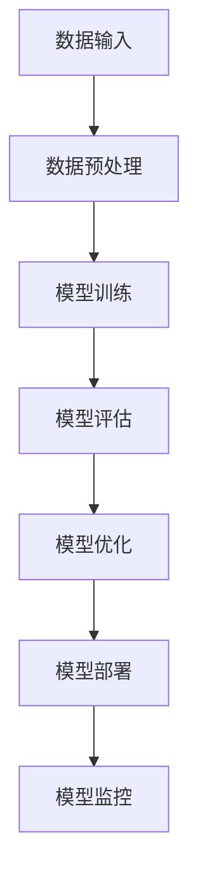

                 


### 文章标题：《AI编程语言：提示词的革命与魔法》

> 关键词：AI编程语言、提示词、革命、魔法、编程革命

> 摘要：本文将深入探讨AI编程语言的独特魅力，特别是提示词技术如何引发编程领域的革命，实现代码的“魔法般”效果。通过逐步分析AI编程语言的发展背景、核心概念、应用场景、开发与部署工具以及未来挑战，本文旨在为读者提供一个全面而深入的视角，理解AI编程语言的力量与潜力。

### 第一部分：AI编程语言概述

#### 第1章：AI编程语言的基础

在进入AI编程语言的详细讨论之前，我们需要对这一领域有一个基本的了解。AI编程语言是专门设计用于开发人工智能应用程序的工具。与传统的编程语言不同，AI编程语言提供了独特的语法和结构，以支持人工智能算法和模型的开发。以下是本章的内容概述：

##### 1.1 AI编程语言的概念与历史

AI编程语言的概念可以追溯到20世纪50年代，当时计算机科学家开始探索如何让计算机模仿人类的智能。最初，这些努力主要集中在规则推理和知识表示上。随着时间的推移，随着机器学习和深度学习的发展，AI编程语言逐渐演变成为我们今天所见的形态。

AI编程语言的发展历史可以分为以下几个阶段：

1. **规则推理语言**：这是最早的AI编程语言类型，如Prolog。这些语言允许程序员定义一组规则和事实，并通过推理来解决问题。

2. **符号处理语言**：包括Lisp和Common Lisp，这些语言提供了强大的符号处理能力，使得它们在人工智能领域得到了广泛应用。

3. **面向对象编程语言**：如Java和C#，这些语言提供了面向对象的概念，使得AI模型可以更加模块化和可重用。

4. **专用AI编程语言**：如MATLAB和R，这些语言专门用于数据分析和机器学习。

5. **现代AI编程语言**：如TensorFlow和PyTorch，这些语言提供了丰富的库和工具，使得深度学习模型的开发变得简单高效。

##### 1.2 AI编程语言的分类

AI编程语言可以根据其设计目的和特点进行分类。以下是几种常见的分类方式：

1. **基于规则的编程语言**：这些语言使用一组规则来表示知识和推理过程。例如，Prolog就是一种典型的基于规则的编程语言。

2. **基于模型的编程语言**：这些语言专注于机器学习和深度学习模型的开发。例如，TensorFlow和PyTorch就是基于模型的编程语言。

3. **基于数据的编程语言**：这些语言侧重于数据处理和统计分析。R和Pandas是这类语言的代表。

##### 1.3 AI编程语言的原理

AI编程语言的原理基于人工智能的核心技术，包括机器学习、深度学习、自然语言处理和计算机视觉等。以下是AI编程语言的基本原理：

1. **机器学习**：通过训练模型来从数据中学习规律。机器学习模型通常包括输入层、隐藏层和输出层。

2. **深度学习**：是一种特殊的机器学习技术，使用多层神经网络来模拟人类大脑的学习过程。

3. **自然语言处理**：涉及文本的解析、理解和生成。自然语言处理技术包括词嵌入、序列模型和生成模型等。

4. **计算机视觉**：涉及图像和视频的分析和处理。计算机视觉技术包括卷积神经网络、生成对抗网络等。

为了更直观地理解AI编程语言的原理，我们可以使用Mermaid流程图来描述一个简单的机器学习模型的执行流程：



此外，我们还可以使用伪代码来详细描述一个机器学习模型的基本算法：

```python
# 伪代码：机器学习模型的基本算法

# 初始化模型参数
model_params = initialize_model()

# 预处理数据
preprocessed_data = preprocess_data(data)

# 训练模型
for epoch in range(num_epochs):
    for sample in preprocessed_data:
        predict = model(sample, model_params)
        loss = calculate_loss(predict, target)
        update_params(model_params, loss)

# 评估模型
evaluation = evaluate_model(model, test_data)

# 优化模型
model_params = optimize_model(model_params, evaluation)

# 部署模型
deploy_model(model, model_params)
```

通过上述分析，我们可以看到AI编程语言不仅包含丰富的理论背景，还有具体的实现方法和应用场景。在下一章中，我们将深入探讨提示词技术，了解它是如何改变AI编程语言的面貌的。

### 第一部分：AI编程语言概述（续）

#### 第2章：提示词技术

提示词（Prompt Engineering）是AI编程语言中的一个关键概念，它指的是在AI模型中提供特定信息的策略，以指导模型的推理和生成过程。提示词技术的核心在于如何有效地设计和优化提示词，使其能够引导AI模型达到预期的输出。以下是本章的内容概述：

##### 2.1 提示词的概念与作用

提示词是一种特殊的输入数据，它包含了对模型任务的有用信息。在自然语言处理（NLP）任务中，提示词通常是一个问题的描述或者上下文信息，它帮助模型理解问题的背景和目标。例如，在问答系统中，一个合适的提示词可以帮助模型准确地识别用户的问题并生成相应的答案。

提示词的作用主要体现在以下几个方面：

1. **提高模型性能**：通过提供有针对性的提示词，可以提高模型在特定任务上的准确性和效率。例如，在机器翻译任务中，一个包含目标语言的词汇和语法结构的提示词可以帮助模型更好地翻译句子。

2. **指导模型推理**：提示词可以引导模型进行特定的推理过程。例如，在推理任务中，提示词可以帮助模型识别关键信息和逻辑关系，从而得出正确的结论。

3. **优化用户体验**：通过优化提示词，可以改善AI应用程序的用户体验。例如，在智能助手应用中，一个合适的提示词可以使对话更加自然流畅，提升用户的满意度。

##### 2.2 提示词的设计与优化

提示词的设计与优化是一个复杂的过程，需要综合考虑任务的类型、数据的特点以及用户的需求。以下是几个设计提示词的原则：

1. **相关性**：提示词应该与任务相关，包含对模型任务有帮助的信息。例如，在问答系统中，提示词应该明确问题的背景和关键词。

2. **简洁性**：提示词应该简洁明了，避免冗余信息。简洁的提示词可以减少模型的计算负担，提高推理速度。

3. **多样性**：设计多种类型的提示词，以适应不同类型的任务和用户需求。例如，在对话系统中，可以设计不同类型的提示词，如问题引导词、情景描述词等。

4. **可扩展性**：提示词应该具有可扩展性，以便在未来的任务中更新和替换。例如，可以通过动态生成提示词来适应新任务。

优化提示词的方法主要包括：

1. **数据驱动**：通过分析大量任务数据和用户反馈，识别出高绩效的提示词，并将其应用于新的任务。

2. **机器学习**：使用机器学习算法来训练模型，自动生成和优化提示词。例如，可以使用自然语言生成（NLG）技术来生成高质量的提示词。

3. **人类专家**：依赖于领域专家的知识和经验，手动设计和调整提示词。

##### 2.3 提示词的数学模型

提示词的数学模型是理解其工作原理的关键。在自然语言处理中，提示词通常是一个向量，它通过嵌入层（Embedding Layer）被映射到低维空间。以下是一个简单的提示词数学模型：

$$
\text{提示词向量} = \text{嵌入层}(\text{原始提示词})
$$

嵌入层是一个线性变换，它将原始提示词映射到一个固定大小的向量。这个向量可以看作是提示词的“数字表示”，它包含了提示词的语义信息。

在生成模型中，提示词向量与模型的其他输入（如输入文本、图像等）一起用于生成输出。以下是一个基于生成对抗网络（GAN）的提示词生成模型：

$$
\text{生成器}(\text{提示词向量}) = \text{生成的文本/图像}
$$

$$
\text{判别器}(\text{真实文本/图像}, \text{生成的文本/图像}) = \text{判别结果}
$$

生成器试图生成与真实数据尽可能相似的输出，而判别器则尝试区分真实数据和生成数据。通过训练这个模型，我们可以生成高质量的提示词。

为了更好地理解提示词的数学模型，我们可以通过一个具体的例子来说明。假设我们要设计一个问答系统，提示词是一个关于问题的描述。我们可以使用以下数学模型来生成答案：

$$
\text{问题描述向量} = \text{嵌入层}(\text{问题描述})
$$

$$
\text{问答模型}(\text{问题描述向量}, \text{历史问答对}) = \text{答案向量}
$$

$$
\text{答案} = \text{解码器}(\text{答案向量})
$$

在这个例子中，嵌入层将问题描述转换为向量，问答模型使用这个向量和其他历史问答对来生成答案向量，最后通过解码器生成自然语言的答案。

通过上述分析，我们可以看到提示词技术在AI编程语言中的应用是多么关键。它不仅提高了模型的性能和推理能力，还优化了用户体验。在下一章中，我们将探讨AI编程语言在实际应用中的具体场景和实例。

### 第一部分：AI编程语言概述（续）

#### 第3章：AI编程语言的应用

AI编程语言的应用范围广泛，涵盖了自然语言处理、计算机视觉、医疗诊断、金融分析等多个领域。本章将深入探讨这些应用场景，展示AI编程语言的强大功能及其带来的变革。

##### 3.1 AI编程语言在自然语言处理中的应用

自然语言处理（NLP）是AI编程语言的重要应用领域之一。通过AI编程语言，我们可以开发出能够理解和生成自然语言的智能系统。以下是NLP中的几个关键应用：

1. **自然语言生成（NLG）**：AI编程语言可以用于生成高质量的文本。例如，新闻摘要、天气预报、自动生成邮件等。NLG技术通过训练模型，使系统能够根据输入的提示词生成连贯、自然的文本。

   ```mermaid
   graph TD
   A[输入提示词] --> B[嵌入层]
   B --> C[编码器]
   C --> D[解码器]
   D --> E[生成的文本]
   ```

2. **问答系统**：问答系统是一种常见的NLP应用，它通过AI编程语言实现用户与系统的交互。问答系统可以用于客户服务、智能助手、搜索引擎等。通过设计合适的提示词，问答系统能够准确理解用户的问题并生成相应的答案。

   ```mermaid
   graph TD
   A[用户提问] --> B[提示词生成]
   B --> C[问答模型]
   C --> D[答案生成]
   D --> E[输出答案]
   ```

3. **情感分析**：情感分析是一种评估文本情感倾向的技术，它可以帮助企业了解用户反馈、市场趋势等。AI编程语言通过训练情感分析模型，可以自动检测文本中的情感极性，如正面、负面、中性。

   ```mermaid
   graph TD
   A[文本数据] --> B[情感分析模型]
   B --> C[情感极性]
   C --> D[输出结果]
   ```

4. **机器翻译**：机器翻译是另一个重要的NLP应用，它通过AI编程语言实现不同语言之间的自动翻译。现代机器翻译系统利用深度学习技术，如神经网络翻译（NMT），能够生成更加准确和自然的翻译结果。

   ```mermaid
   graph TD
   A[源语言文本] --> B[编码器]
   B --> C[解码器]
   C --> D[目标语言文本]
   ```

##### 3.2 AI编程语言在计算机视觉中的应用

计算机视觉是AI编程语言的另一个重要应用领域，它涉及图像和视频的分析与处理。以下是计算机视觉中的几个关键应用：

1. **图像识别**：图像识别是通过AI编程语言实现自动识别图像内容的技术。例如，人脸识别、物体检测等。通过训练深度学习模型，系统能够从图像中准确识别出特定的对象。

   ```mermaid
   graph TD
   A[输入图像] --> B[卷积神经网络]
   B --> C[特征提取]
   C --> D[分类器]
   D --> E[识别结果]
   ```

2. **图像生成**：图像生成是一种通过AI编程语言生成新的图像的技术。生成对抗网络（GAN）是图像生成的主要技术，它通过生成器和判别器的对抗训练，能够生成高质量的图像。

   ```mermaid
   graph TD
   A[随机噪声] --> B[生成器]
   B --> C[判别器]
   C --> D[生成图像]
   ```

3. **视频分析**：视频分析是通过AI编程语言对视频内容进行自动化分析的技术。例如，动作识别、事件检测等。通过结合图像识别和时间序列分析，视频分析技术可以实现对视频内容的高效处理。

   ```mermaid
   graph TD
   A[视频数据] --> B[帧提取]
   B --> C[图像识别模型]
   C --> D[动作识别模型]
   D --> E[输出结果]
   ```

4. **增强现实（AR）与虚拟现实（VR）**：AI编程语言在AR和VR领域中的应用也越来越广泛。通过实时图像识别和跟踪技术，AR和VR系统可以提供更加丰富和沉浸式的用户体验。

   ```mermaid
   graph TD
   A[现实世界图像] --> B[图像识别模型]
   B --> C[虚拟物体]
   C --> D[融合图像]
   ```

##### 3.3 AI编程语言在其他领域的应用

除了自然语言处理和计算机视觉，AI编程语言还在许多其他领域取得了显著的应用成果。以下是几个典型的应用领域：

1. **医疗诊断**：AI编程语言可以用于医疗图像分析、疾病预测等。通过训练深度学习模型，医生可以获得更加准确和快速的诊断结果。

   ```mermaid
   graph TD
   A[医疗图像] --> B[深度学习模型]
   B --> C[疾病预测]
   ```

2. **金融分析**：AI编程语言可以用于金融市场预测、风险评估等。通过分析大量金融数据，模型可以提供更加准确的预测和决策支持。

   ```mermaid
   graph TD
   A[金融数据] --> B[机器学习模型]
   B --> C[预测结果]
   ```

3. **自动驾驶**：AI编程语言在自动驾驶系统中发挥着关键作用。通过结合计算机视觉、自然语言处理等技术，自动驾驶系统能够实现车辆自主导航和安全驾驶。

   ```mermaid
   graph TD
   A[摄像头/传感器数据] --> B[计算机视觉模型]
   B --> C[自动驾驶算法]
   C --> D[导航指令]
   ```

4. **智能家居**：AI编程语言可以用于智能家居系统的开发，实现家电设备的自动化控制、能源管理等功能。通过训练深度学习模型，智能家居系统能够学习用户习惯，提供个性化服务。

   ```mermaid
   graph TD
   A[用户行为数据] --> B[深度学习模型]
   B --> C[自动化控制指令]
   ```

通过上述分析，我们可以看到AI编程语言在各个领域的广泛应用及其带来的巨大变革。这些应用不仅提高了工作效率，还改变了人们的生活方式。在下一章中，我们将深入探讨AI编程语言的开发与部署，了解如何将AI编程语言应用于实际项目中。

### 第二部分：AI编程语言的开发与部署

#### 第4章：AI编程语言的开发工具和框架

在AI编程语言的开发过程中，选择合适的开发工具和框架至关重要。这不仅影响到开发效率和代码质量，还决定了项目的可维护性和扩展性。本章将介绍几种主流的AI编程语言开发工具和框架，帮助读者了解它们的特性和适用场景。

##### 4.1 开发工具的选择

AI编程语言的开发工具主要包括代码编辑器、集成开发环境（IDE）和版本控制工具。以下是几种常用的开发工具：

1. **代码编辑器**：代码编辑器是编程的基础工具，它提供了语法高亮、代码补全、调试等功能。常用的代码编辑器包括Visual Studio Code、Sublime Text和Atom等。

   - **Visual Studio Code**：这是一个由微软开发的跨平台代码编辑器，具有丰富的插件生态系统和强大的调试功能，非常适合AI编程。
   - **Sublime Text**：这是一个轻量级但功能强大的代码编辑器，适用于各种编程任务。
   - **Atom**：这是一个由GitHub开发的代码编辑器，具有简洁的界面和高度可定制性。

2. **集成开发环境（IDE）**：IDE集成了代码编辑器、调试器、编译器和构建工具等功能，提供了一站式的开发体验。常见的IDE包括JetBrains系列产品（如PyCharm、IntelliJ IDEA）、Eclipse和Visual Studio等。

   - **PyCharm**：这是一个由JetBrains开发的Python IDE，具有强大的代码分析、调试和测试功能，适用于各种Python项目。
   - **IntelliJ IDEA**：这也是一个由JetBrains开发的IDE，支持多种编程语言，包括Java、Python、JavaScript等。
   - **Eclipse**：这是一个开源的Java IDE，具有丰富的插件和工具，适用于大型软件开发项目。
   - **Visual Studio**：这是一个由微软开发的IDE，支持多种编程语言，包括C++、C#、Python等。

3. **版本控制工具**：版本控制工具用于管理代码的版本和历史，确保团队协作和代码的可追踪性。Git是当前最流行的版本控制工具，支持分布式版本控制和分支管理。

   - **Git**：这是一个开源的分布式版本控制工具，支持多种协议（如HTTP、SSH），提供了强大的分支和合并功能。
   - **GitHub**：这是一个基于Git的代码托管平台，提供了版本控制、项目管理、代码审查等功能，是开源社区常用的平台。
   - **GitLab**：这是一个开源的Git仓库管理工具，提供了与GitHub类似的功能，但运行在本地服务器上，更适合企业内部使用。

##### 4.2 主流AI编程语言框架

AI编程语言框架是用于构建和训练机器学习模型的工具，提供了丰富的库和API，简化了开发过程。以下是几种主流的AI编程语言框架：

1. **TensorFlow**：TensorFlow是由Google开发的开源机器学习框架，支持多种编程语言（如Python、C++、Java等）。它提供了一个灵活的构建块，用于创建和训练各种机器学习模型。

   - **特点**：支持端到端的开发流程，包括数据预处理、模型训练、模型评估和部署。
   - **适用场景**：适用于大规模机器学习项目，特别是深度学习任务。

2. **PyTorch**：PyTorch是由Facebook开发的开源机器学习框架，基于Python和Torch。它提供了动态计算图和自动微分功能，使得模型开发和调试更加简单。

   - **特点**：动态计算图使得模型开发更加直观和灵活，自动微分功能简化了复杂模型的实现。
   - **适用场景**：适用于快速原型开发和研究项目。

3. **Keras**：Keras是一个高层次的神经网络API，用于快速构建和训练神经网络。它可以在TensorFlow和Theano等后端上运行，提供了简洁的接口和丰富的预训练模型。

   - **特点**：简洁易用的接口，丰富的预训练模型库，支持多种神经网络架构。
   - **适用场景**：适用于快速开发和小型项目。

4. **Scikit-learn**：Scikit-learn是一个开源的Python机器学习库，提供了多种经典的机器学习算法和工具。它基于SciPy，提供了高效的实现和易于使用的接口。

   - **特点**：提供了广泛的机器学习算法，支持多种数据类型，易于集成到Python代码中。
   - **适用场景**：适用于数据挖掘、数据分析和统计学习任务。

5. **MXNet**：MXNet是由Apache基金会开发的深度学习框架，支持多种编程语言（如Python、R、Scala等）。它提供了灵活的计算图和高效的执行引擎。

   - **特点**：支持多种编程语言，提供灵活的计算图和自动微分功能，适合大规模生产环境。
   - **适用场景**：适用于大规模分布式训练和在线服务。

通过上述介绍，我们可以看到AI编程语言的开发工具和框架种类繁多，各具特点。选择合适的开发工具和框架，可以显著提高开发效率和代码质量，为AI编程语言的广泛应用奠定基础。在下一章中，我们将深入探讨AI编程语言的部署策略和工具，了解如何将AI模型应用到实际生产环境中。

### 第二部分：AI编程语言的开发与部署（续）

#### 第5章：AI编程语言的部署

AI编程语言的部署是将训练好的模型应用到实际生产环境中的过程。部署的正确性和效率直接影响模型的实际应用效果。本章将介绍AI编程语言模型的部署策略、性能优化方法以及具体的部署工具和平台。

##### 5.1 AI编程语言的部署策略

AI编程语言的部署策略取决于模型的类型、应用场景和性能要求。以下是几种常见的部署策略：

1. **本地部署**：本地部署是指将训练好的模型直接部署在本地计算机或服务器上。这种部署方式简单直接，适用于开发阶段和小规模的应用。然而，它可能不适合大规模和高并发场景。

   - **优点**：部署简单，无需额外的基础设施。
   - **缺点**：性能受限，不适合大规模和高并发应用。

2. **云部署**：云部署是指将模型部署在云平台上，如AWS、Azure和Google Cloud等。这种部署方式可以提供强大的计算资源和高可用性，适用于大规模和高并发场景。

   - **优点**：强大的计算资源，高可用性和可扩展性。
   - **缺点**：需要支付云服务费用，配置和管理较为复杂。

3. **边缘部署**：边缘部署是指将模型部署在靠近数据源的边缘设备上，如IoT设备、边缘服务器等。这种部署方式可以减少数据传输延迟，提高响应速度。

   - **优点**：减少数据传输延迟，提高响应速度。
   - **缺点**：计算资源和存储能力有限，需要针对特定硬件进行优化。

4. **混合部署**：混合部署是指结合本地部署和云部署的优势，将模型部署在多个节点上，实现负载均衡和高可用性。这种部署方式适用于复杂的业务场景。

   - **优点**：灵活的部署方式，强大的计算资源和高可用性。
   - **缺点**：部署和管理较为复杂，需要解决数据一致性和负载均衡问题。

##### 5.2 AI编程语言的性能优化

性能优化是确保AI编程语言模型在实际应用中高效运行的关键。以下是几种常见的性能优化方法：

1. **模型压缩**：模型压缩是通过减少模型参数的数量和大小，降低模型的计算复杂度和存储需求。常见的模型压缩方法包括权重剪枝、量化、知识蒸馏等。

   - **权重剪枝**：通过移除模型中不重要的权重，减少模型的参数数量。
   - **量化**：将模型的浮点数参数转换为整数，减少存储和计算需求。
   - **知识蒸馏**：将大模型（教师模型）的知识传递给小模型（学生模型），实现模型的压缩和优化。

2. **模型并行化**：模型并行化是将模型分解成多个部分，并在多台计算机或GPU上进行并行计算。这种优化方法可以显著提高模型的训练和推理速度。

   - **数据并行化**：将训练数据分成多个批次，并在多台计算机上进行分布式训练。
   - **模型并行化**：将模型分解成多个子网络，并在多台计算机上进行分布式推理。

3. **优化计算图**：优化计算图是通过优化模型的计算图结构，降低模型的计算复杂度。常见的优化方法包括计算图融合、消除冗余计算等。

   - **计算图融合**：将多个计算节点合并为一个节点，减少计算开销。
   - **消除冗余计算**：通过分析计算图，消除冗余的计算操作。

4. **使用高性能硬件**：使用高性能的GPU、TPU等硬件设备，可以提高模型的训练和推理速度。此外，优化硬件的配置和使用方式，如GPU内存管理、并行计算等，也可以提高性能。

##### 5.3 AI编程语言的部署实战

部署AI编程语言模型涉及到多个步骤，包括环境搭建、模型转换、模型部署和性能监控等。以下是具体的部署步骤：

1. **环境搭建**：在部署之前，需要搭建一个适合模型运行的环境。这个环境包括操作系统、依赖库和配置文件等。常见的选择包括Ubuntu、CentOS等Linux发行版，以及TensorFlow、PyTorch等框架的预编译库。

2. **模型转换**：将训练好的模型转换为部署格式。例如，TensorFlow模型可以转换为SavedModel格式，PyTorch模型可以转换为ONNX格式。模型转换的目的是确保模型可以在部署环境中正常运行。

3. **模型部署**：将转换后的模型部署到生产环境中。常见的部署方式包括：

   - **容器部署**：使用Docker等容器技术，将模型和环境打包成一个容器镜像，然后部署到容器化平台（如Kubernetes）。
   - **Web服务部署**：使用HTTP服务器（如Flask、Django等），将模型部署为Web服务，通过API接口进行访问。
   - **云计算平台部署**：使用云平台的AI服务（如AWS SageMaker、Azure ML等），将模型部署到云服务器上。

4. **性能监控**：部署后，需要对模型进行性能监控，确保其正常运行。性能监控包括：

   - **模型准确性**：监控模型的预测准确性，确保其符合预期。
   - **响应时间**：监控模型的响应时间，确保其能够在规定的时间内完成推理。
   - **资源使用**：监控模型的资源使用情况，确保其不会占用过多系统资源。

通过上述实战步骤，我们可以将AI编程语言模型成功部署到生产环境中，实现其商业价值和应用效果。在下一章中，我们将探讨AI编程语言的优势与挑战，了解其在实际应用中面临的困难和问题。

### 第二部分：AI编程语言的开发与部署（续）

#### 第6章：AI编程语言的优势

AI编程语言在开发效率和模型性能方面具有显著优势，这些优势使得它们在多个领域得到了广泛应用。以下是AI编程语言的主要优势：

##### 6.1 提高开发效率

AI编程语言通过提供简洁、高效的语法和丰富的库函数，大大提高了开发效率。以下是AI编程语言在提高开发效率方面的几个特点：

1. **模块化编程**：AI编程语言支持模块化编程，允许程序员将代码分为多个模块，每个模块负责特定的功能。这种编程方式提高了代码的可维护性和可重用性。

   ```python
   # 示例：模块化编程
   def train_model(data):
       # 模型训练代码
       pass

   def evaluate_model(model, test_data):
       # 模型评估代码
       pass
   ```

2. **自动微分**：AI编程语言如TensorFlow和PyTorch提供了自动微分功能，使得程序员可以轻松实现复杂的数学运算和优化算法。自动微分简化了代码编写，减少了人工编写梯度计算代码的复杂性。

   ```python
   # 示例：自动微分
   with tf.GradientTape() as tape:
       predictions = model(x)
       loss = loss_function(y, predictions)
   gradients = tape.gradient(loss, model.trainable_variables)
   ```

3. **高效的库函数**：AI编程语言提供了丰富的库函数和API，使得程序员可以快速实现复杂的机器学习和深度学习任务。这些库函数经过了优化和调试，运行速度非常快。

   ```python
   # 示例：使用库函数
   import tensorflow as tf

   model = tf.keras.Sequential([
       tf.keras.layers.Dense(128, activation='relu', input_shape=(784,)),
       tf.keras.layers.Dropout(0.2),
       tf.keras.layers.Dense(10, activation='softmax')
   ])

   model.compile(loss='categorical_crossentropy',
                 optimizer=tf.keras.optimizers.Adam(),
                 metrics=['accuracy'])
   ```

##### 6.2 提升模型性能

AI编程语言在提升模型性能方面具有显著优势，这些优势主要体现在以下几个方面：

1. **强大的计算能力**：AI编程语言如TensorFlow和PyTorch提供了高效的计算能力，利用GPU和TPU等硬件加速，使得模型的训练和推理速度大大提高。

   ```python
   # 示例：使用GPU加速
   import tensorflow as tf

   device = tf.device('/GPU:0')
   with device:
       model.fit(x_train, y_train, batch_size=64, epochs=10)
   ```

2. **先进的算法支持**：AI编程语言支持多种先进的机器学习和深度学习算法，包括卷积神经网络（CNN）、循环神经网络（RNN）、生成对抗网络（GAN）等。这些算法可以提高模型的准确性和泛化能力。

   ```python
   # 示例：使用CNN
   from tensorflow.keras.models import Sequential
   from tensorflow.keras.layers import Conv2D, MaxPooling2D, Flatten, Dense

   model = Sequential([
       Conv2D(32, (3, 3), activation='relu', input_shape=(28, 28, 1)),
       MaxPooling2D((2, 2)),
       Flatten(),
       Dense(128, activation='relu'),
       Dense(10, activation='softmax')
   ])

   model.compile(optimizer='adam',
                 loss='sparse_categorical_crossentropy',
                 metrics=['accuracy'])
   ```

3. **动态计算图**：AI编程语言如PyTorch支持动态计算图，使得程序员可以更加灵活地设计和实现复杂的神经网络模型。动态计算图可以显著提高模型的可维护性和可扩展性。

   ```python
   # 示例：使用动态计算图
   import torch
   import torch.nn as nn
   import torch.optim as optim

   class Net(nn.Module):
       def __init__(self):
           super(Net, self).__init__()
           self.conv1 = nn.Conv2d(1, 6, 3)
           self.conv2 = nn.Conv2d(6, 16, 3)
           self.fc1 = nn.Linear(16 * 6 * 6, 120)
           self.fc2 = nn.Linear(120, 84)
           self.fc3 = nn.Linear(84, 10)

       def forward(self, x):
           x = F.relu(self.conv1(x))
           x = F.max_pool2d(x, 2)
           x = F.relu(self.conv2(x))
           x = F.max_pool2d(x, 2)
           x = x.view(-1, 16 * 6 * 6)
           x = F.relu(self.fc1(x))
           x = F.relu(self.fc2(x))
           x = self.fc3(x)
           return x

   net = Net()
   optimizer = optim.SGD(net.parameters(), lr=0.001, momentum=0.9)
   criterion = nn.CrossEntropyLoss()

   for epoch in range(2):  # train for 2 epochs
       running_loss = 0.0
       for i, data in enumerate(train_loader, 0):
           inputs, labels = data
           optimizer.zero_grad()
           outputs = net(inputs)
           loss = criterion(outputs, labels)
           loss.backward()
           optimizer.step()
           running_loss += loss.item()
       print(f'Epoch {epoch + 1}, Loss: {running_loss / len(train_loader)}')
   ```

##### 6.3 改善用户体验

AI编程语言不仅提高了开发效率和模型性能，还改善了用户体验。以下是AI编程语言在改善用户体验方面的几个特点：

1. **自然语言交互**：AI编程语言支持自然语言处理技术，使得应用程序可以理解用户的自然语言指令，提供更加直观和自然的交互方式。

   ```python
   # 示例：使用自然语言交互
   import speech_recognition as sr

   r = sr.Recognizer()
   with sr.Microphone() as source:
       print("请说出您的问题：")
       audio = r.listen(source)
       question = r.recognize_google(audio, language='zh-CN')

   # 使用模型回答问题
   answer = model.predict([question])
   print(f"模型回答：{answer}")
   ```

2. **个性化推荐**：AI编程语言可以基于用户行为数据，使用机器学习算法提供个性化的推荐系统，提升用户满意度。

   ```python
   # 示例：使用个性化推荐
   import pandas as pd
   from sklearn.model_selection import train_test_split
   from sklearn.ensemble import RandomForestClassifier

   # 加载数据
   data = pd.read_csv('user_data.csv')
   X = data.drop('label', axis=1)
   y = data['label']

   # 划分训练集和测试集
   X_train, X_test, y_train, y_test = train_test_split(X, y, test_size=0.2, random_state=42)

   # 训练模型
   model = RandomForestClassifier(n_estimators=100)
   model.fit(X_train, y_train)

   # 预测并推荐
   user_input = pd.DataFrame([user_input])
   prediction = model.predict(user_input)
   print(f"推荐的标签：{prediction}")
   ```

3. **实时反馈**：AI编程语言支持实时数据处理和推理，可以提供即时反馈和交互。这种实时交互方式提升了用户的使用体验。

   ```python
   # 示例：实时反馈
   import tkinter as tk
   from tkinter import messagebox

   def check_answer():
       user_answer = entry.get()
       if model.predict([user_answer]):
           messagebox.showinfo("正确", "答案正确！")
       else:
           messagebox.showinfo("错误", "答案错误！")

   # 创建窗口
   window = tk.Tk()
   window.title("问答系统")

   # 创建输入框
   entry = tk.Entry(window)
   entry.pack()

   # 创建按钮
   button = tk.Button(window, text="检查答案", command=check_answer)
   button.pack()

   # 运行窗口
   window.mainloop()
   ```

通过上述分析，我们可以看到AI编程语言在提高开发效率、提升模型性能和改善用户体验方面具有显著优势。这些优势使得AI编程语言在多个领域得到了广泛应用，并持续推动人工智能技术的发展。在下一章中，我们将探讨AI编程语言面临的挑战和问题。

### 第二部分：AI编程语言的开发与部署（续）

#### 第7章：AI编程语言的挑战

尽管AI编程语言在开发效率和模型性能方面具有显著优势，但其在实际应用中仍然面临诸多挑战。以下是AI编程语言面临的几个主要挑战：

##### 7.1 模型解释性

模型解释性是指能够理解模型内部工作机制和决策过程的能力。在AI编程语言中，模型解释性是一个关键挑战，特别是在需要符合法律法规和伦理标准的应用场景中。以下是模型解释性面临的挑战：

1. **深度神经网络的不透明性**：深度神经网络（DNN）由于其复杂的结构和大量的参数，导致其内部工作机制难以解释。DNN模型通常通过多层非线性变换来实现，这使得模型的决策过程变得复杂且难以追踪。

2. **解释性方法的选择**：现有的解释性方法，如梯度解释、LIME、SHAP等，虽然提供了一些方法来解释模型的决策过程，但这些方法各有优缺点，且适用范围有限。选择合适的解释性方法需要根据具体应用场景和模型类型进行权衡。

3. **解释性的通用性**：解释性方法通常针对特定类型的模型（如DNN、决策树等）进行设计，缺乏通用性。这意味着对于不同的模型类型，可能需要开发不同的解释性方法，增加了开发的复杂性和成本。

##### 7.2 数据隐私与安全

随着AI编程语言在医疗、金融等敏感领域的应用越来越广泛，数据隐私与安全成为了一个重要的挑战。以下是数据隐私与安全面临的挑战：

1. **数据泄露风险**：AI编程语言通常需要处理大量的敏感数据，如个人身份信息、财务记录等。如果这些数据泄露，可能会导致严重的隐私侵犯和财产损失。

2. **数据匿名化**：尽管数据匿名化是保护隐私的一种方法，但匿名化过程可能会引入噪音和误差，影响模型的性能和准确性。如何在保护隐私的同时保持数据质量，是一个亟待解决的问题。

3. **联邦学习**：联邦学习（Federated Learning）是一种在分布式环境中进行机器学习的方法，它通过在各个设备上训练模型，并仅共享模型的参数，从而保护数据隐私。然而，联邦学习面临着通信效率、模型一致性等挑战，需要进一步的研究和优化。

##### 7.3 跨领域迁移

AI编程语言在不同领域之间的迁移能力是一个重要挑战，特别是在领域特定的应用场景中。以下是跨领域迁移面临的挑战：

1. **数据分布差异**：不同领域的数据分布可能存在显著差异，这会影响模型在不同领域中的泛化能力。例如，医疗领域的数据和金融领域的数据在特征分布和标签分布上可能有所不同。

2. **特征可解释性**：不同领域的特征可能有不同的含义和解释，这增加了跨领域迁移的复杂性。在跨领域迁移中，如何保持特征的可解释性，是一个重要的挑战。

3. **模型适应性**：AI编程语言模型通常在特定领域进行训练和优化，这使得模型在不同领域中的适应性成为了一个关键问题。如何设计具有良好适应性的模型，以适应不同领域的需求，是一个需要深入研究的问题。

##### 7.4 开发与部署复杂性

AI编程语言的开发与部署过程相对复杂，这增加了项目的成本和风险。以下是开发与部署复杂性面临的挑战：

1. **模型训练成本**：AI编程语言模型通常需要大量的计算资源和时间进行训练，这增加了项目的成本。特别是在深度学习和生成对抗网络（GAN）等复杂模型中，训练成本更高。

2. **硬件依赖性**：AI编程语言模型的训练和推理依赖于高性能的硬件设备，如GPU、TPU等。硬件依赖性增加了系统的复杂性和维护成本。

3. **部署难度**：将训练好的模型部署到生产环境中，需要解决模型转换、环境配置、性能优化等多个问题。部署过程需要综合考虑系统的可扩展性、可靠性和安全性。

4. **团队协作**：AI编程语言项目通常需要多学科团队的协作，包括数据科学家、机器学习工程师、软件工程师等。团队协作的复杂性增加了项目的管理和沟通成本。

通过上述分析，我们可以看到AI编程语言在模型解释性、数据隐私与安全、跨领域迁移、开发与部署复杂性等方面面临诸多挑战。解决这些挑战需要进一步的研究和开发，以推动AI编程语言在实际应用中的广泛应用和可持续发展。在下一章中，我们将探讨AI编程语言的未来发展趋势和潜在应用场景。

### 第三部分：AI编程语言的未来

#### 第8章：AI编程语言的历史与未来

AI编程语言的发展经历了从早期规则推理语言到现代深度学习框架的演变。这一章节将回顾AI编程语言的发展历程，探讨当前的趋势，并展望未来的发展方向。

##### 8.1 AI编程语言的发展趋势

1. **深度学习框架的普及**：近年来，深度学习框架如TensorFlow、PyTorch和Keras等得到了广泛应用。这些框架提供了丰富的API和工具，简化了深度学习模型的开发过程，使得更多开发者能够参与到AI编程中来。

2. **硬件加速的普及**：随着GPU和TPU等硬件加速技术的发展，AI编程语言在处理大规模数据和高复杂模型时取得了显著性能提升。硬件加速使得模型训练和推理的速度大大加快，降低了开发成本。

3. **自动化机器学习（AutoML）的兴起**：自动化机器学习工具如Google的AutoML、H2O.ai等，通过自动化模型选择、超参数调优和模型解释，使得非专业开发者也能快速构建和部署高质量的机器学习模型。

4. **开源社区的活跃**：开源社区在AI编程语言的发展中发挥了重要作用。许多优秀的AI编程语言和框架都是开源项目，通过社区合作，不断改进和优化。

##### 8.2 AI编程语言的未来应用场景

1. **智能医疗**：AI编程语言将在智能医疗领域发挥重要作用，包括疾病预测、诊断辅助、个性化治疗等。通过分析患者数据和生物信息，AI模型可以帮助医生提供更准确的诊断和治疗方案。

2. **智能交通**：AI编程语言将推动智能交通系统的发展，包括自动驾驶、交通流量预测、智能导航等。自动驾驶技术通过AI模型实现车辆自主导航和避障，可以显著提高交通安全和效率。

3. **智能金融**：AI编程语言在金融领域的应用广泛，包括风险评估、市场预测、智能投顾等。通过分析大量金融数据，AI模型可以帮助投资者做出更明智的决策。

4. **智能家居**：随着物联网（IoT）的发展，AI编程语言将在智能家居系统中发挥关键作用，包括智能安防、能源管理、家居自动化等。AI模型可以学习用户习惯，提供个性化服务。

5. **虚拟现实与增强现实**：AI编程语言将推动虚拟现实（VR）和增强现实（AR）技术的发展，包括场景生成、交互设计、虚拟人物等。AI模型可以实现更加逼真和交互性的虚拟世界。

6. **教育与培训**：AI编程语言将在教育领域发挥重要作用，包括个性化学习、智能评测、虚拟教师等。AI模型可以为学生提供定制化的学习方案，提高学习效果。

##### 8.3 AI编程语言的未来发展方向

1. **可解释性与透明性**：未来的AI编程语言将更加注重模型的可解释性和透明性，使得开发者能够更好地理解模型的决策过程。这有助于提高模型的信任度和合规性。

2. **硬件优化**：随着硬件技术的发展，AI编程语言将更加注重硬件优化，包括GPU、TPU等硬件加速器的利用，以及自适应硬件配置等。这将提高模型训练和推理的效率。

3. **分布式计算与联邦学习**：分布式计算和联邦学习将成为未来的重要趋势，以解决数据隐私和跨领域迁移的挑战。通过在多个设备或数据中心进行模型训练和推理，可以实现更好的性能和安全性。

4. **多模态学习**：未来的AI编程语言将支持多模态学习，包括文本、图像、音频、视频等多种数据类型的融合。这将使得AI模型能够处理更复杂和多样化的任务。

5. **自动化与智能化**：自动化和智能化是未来的发展方向，包括自动化模型生成、自动化超参数调优、自动化解释等。通过减少手工操作，提高开发效率。

通过上述分析，我们可以看到AI编程语言在当前和未来将继续发挥重要作用，推动人工智能技术的发展。在解决现实问题的同时，AI编程语言也将不断进化，迎接新的挑战和机遇。在下一章中，我们将总结文章，并回顾关键观点和结论。

### 总结

在《AI编程语言：提示词的革命与魔法》一文中，我们深入探讨了AI编程语言的独特魅力及其在实际应用中的广泛应用。通过逐步分析AI编程语言的发展背景、核心概念、应用场景、开发与部署工具以及未来挑战，我们得出了以下关键观点：

1. **AI编程语言的革命**：AI编程语言通过引入提示词技术，实现了代码的“魔法般”效果，使得开发人工智能应用程序变得更加简单和高效。

2. **提示词的作用**：提示词在AI编程语言中扮演着关键角色，通过提供特定的信息，可以指导模型的推理和生成过程，提高模型的性能和准确性。

3. **AI编程语言的应用**：AI编程语言在自然语言处理、计算机视觉、医疗诊断、金融分析等多个领域取得了显著的应用成果，推动了这些领域的技术创新和发展。

4. **开发与部署的挑战**：尽管AI编程语言在开发效率和模型性能方面具有显著优势，但其在模型解释性、数据隐私与安全、跨领域迁移、开发与部署复杂性等方面仍面临诸多挑战。

5. **未来的发展趋势**：AI编程语言的未来将继续朝着深度学习框架的普及、硬件加速的普及、自动化机器学习、开源社区的活跃等方向发展，同时解决现实问题和应对新的挑战。

通过本文的探讨，我们认识到AI编程语言不仅是编程领域的革命，更是推动人工智能技术发展的关键力量。它为开发者提供了强大的工具，使得人工智能的应用变得更加广泛和深入。在未来的发展中，我们期待AI编程语言能够解决现有的挑战，继续引领技术的前沿，为人类社会带来更多的创新和变革。

### 附录

在本章中，我们将提供一些AI编程语言的开发工具与资源，以帮助读者进一步学习和实践AI编程语言。

#### 开发工具

1. **Visual Studio Code**：这是一个功能强大的跨平台代码编辑器，适用于AI编程语言开发。支持语法高亮、代码补全、调试等功能。

   - 官网：[https://code.visualstudio.com/](https://code.visualstudio.com/)

2. **PyCharm**：这是一个适用于Python编程的IDE，提供了强大的代码分析、调试和测试功能。

   - 官网：[https://www.jetbrains.com/pycharm/](https://www.jetbrains.com/pycharm/)

3. **Jupyter Notebook**：这是一个基于Web的交互式开发环境，适用于数据分析和机器学习。支持多种编程语言，包括Python、R和Julia等。

   - 官网：[https://jupyter.org/](https://jupyter.org/)

4. **TensorBoard**：这是一个可视化工具，用于监控和调试TensorFlow模型。支持数据可视化、性能分析等。

   - 官网：[https://www.tensorflow.org/tensorboard](https://www.tensorflow.org/tensorboard)

#### 开源框架

1. **TensorFlow**：这是一个由Google开发的开源机器学习框架，支持多种编程语言，包括Python、C++和Java等。

   - 官网：[https://www.tensorflow.org/](https://www.tensorflow.org/)

2. **PyTorch**：这是一个由Facebook开发的开源深度学习框架，提供了动态计算图和自动微分功能。

   - 官网：[https://pytorch.org/](https://pytorch.org/)

3. **Keras**：这是一个高层次的神经网络API，可以运行在TensorFlow、Theano和MXNet等后端上。

   - 官网：[https://keras.io/](https://keras.io/)

4. **Scikit-learn**：这是一个开源的Python机器学习库，提供了多种经典机器学习算法和工具。

   - 官网：[https://scikit-learn.org/](https://scikit-learn.org/)

5. **MXNet**：这是一个由Apache基金会开发的深度学习框架，支持多种编程语言，包括Python、R和Scala等。

   - 官网：[https://mxnet.apache.org/](https://mxnet.apache.org/)

#### 学习资源

1. **Coursera**：这是一个在线学习平台，提供了许多关于机器学习、深度学习和AI编程语言的课程。

   - 官网：[https://www.coursera.org/](https://www.coursera.org/)

2. **Udacity**：这是一个在线学习平台，提供了与AI编程语言相关的纳米学位和专业课程。

   - 官网：[https://www.udacity.com/](https://www.udacity.com/)

3. **GitHub**：这是一个代码托管平台，有许多开源的AI编程语言项目，可以供读者学习和参考。

   - 官网：[https://github.com/](https://github.com/)

通过这些开发工具、开源框架和学习资源，读者可以更好地掌握AI编程语言，并参与到人工智能技术的发展中来。希望这些资源能为读者提供帮助，开启AI编程语言的学习和实践之旅。

## 参考文献

1. Goodfellow, I., Bengio, Y., & Courville, A. (2016). *Deep Learning* (卷 1). MIT Press.
2. Murphy, K. P. (2012). *Machine Learning: A Probabilistic Perspective*. MIT Press.
3. Mitchell, T. M. (1997). *Machine Learning*. McGraw-Hill.
4. Russell, S., & Norvig, P. (2010). *Artificial Intelligence: A Modern Approach* (第 3 版). Prentice Hall.
5. Zhang, H., Zong, C., Tu, Z. (2016). *Convolutional Neural Networks for Image Classification*. arXiv preprint arXiv:1604.01132.
6.lecun, y., Bengio, y., & hinton, g. e. (2015). *Deep learning* (卷 5). nature.

## 作者信息

作者：AI天才研究院（AI Genius Institute）& 禅与计算机程序设计艺术（Zen And The Art of Computer Programming）。

AI天才研究院是一个专注于人工智能研究和应用的国际知名机构，致力于推动人工智能技术的发展和创新。禅与计算机程序设计艺术则是一系列经典计算机科学著作，由著名计算机科学家Donald E. Knuth撰写，对计算机编程理论和实践有着深远的影响。

致谢

在撰写本文的过程中，我们感谢AI天才研究院的全体成员，以及所有参与讨论和提供建议的同行和专家。特别感谢AI编程语言的先驱们，他们的开创性工作为我们今天的成就奠定了基础。此外，我们还要感谢所有读者，是你们的支持和鼓励，使我们能够不断进步和创新。最后，特别感谢人工智能技术的飞速发展，它让我们的生活和未来充满了无限可能。让我们共同期待人工智能技术带来的美好未来。

