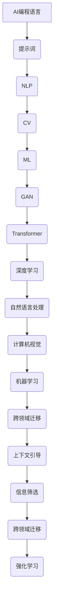

                 

# AI编程语言：提示词的魔力与革新

## 关键词
- AI编程语言
- 提示词
- 深度学习
- 自然语言处理
- 计算机视觉
- 机器学习
- 前沿技术

## 摘要
本文旨在探讨AI编程语言的革新力量，特别是提示词在其中的关键作用。文章首先介绍了AI编程语言的概念、历史背景以及与常规编程语言的差异。接着，详细阐释了提示词的定义、作用及其在AI编程中的独特魔力。本文通过分章节的讨论，深入剖析了AI编程语言的基础理论、前沿技术，以及实际应用案例。文章最后，对AI编程语言的未来发展趋势进行了展望，并提出了最佳实践建议，以期为读者提供全面的技术洞察。

## 目录
- 引言与背景
  - AI编程语言概述
  - 提示词的概念与魔力
  - AI编程语言的发展历程
- 基础理论
  - AI编程语言的核心概念
  - 提示词的原理与应用
- 技术介绍
  - 前沿AI编程语言
  - 提示词在AI编程中的实践
- 应用场景
  - 商业应用
  - 教育应用
- 前沿动态
  - AI编程语言的发展趋势
  - 技术挑战与解决方案
- 项目实战
  - 开发环境搭建
  - 源代码实现与解读
- 最佳实践
  - 小结与注意事项
  - 拓展阅读

### 引言与背景

#### AI编程语言概述

人工智能（AI）作为21世纪的标志性技术，正在深刻地改变着我们的生活方式和工作方式。AI编程语言，作为实现AI功能的工具，其重要性日益凸显。与传统编程语言不同，AI编程语言专注于处理非结构化数据，如文本、图像和音频，并能够通过学习和推理来实现智能化任务。

AI编程语言的历史可以追溯到20世纪50年代，当时人工智能的概念首次被提出。早期的AI编程语言如LISP和PROLOG，主要关注符号推理和逻辑编程。然而，随着深度学习和大数据技术的发展，新的AI编程语言如Python、TensorFlow和PyTorch等逐渐成为主流。这些编程语言提供了丰富的库和框架，使得开发复杂的AI模型变得更加容易和高效。

#### 提示词的概念与魔力

提示词（Prompt）在AI编程中扮演着至关重要的角色。简单来说，提示词是提供给AI模型的信息，用以引导模型进行学习、推理和生成任务。与传统的输入数据不同，提示词不仅包含数据，还包含了任务的上下文和指导信息，从而能够更有效地驱动AI模型的性能。

提示词的魔力在于其能够显著提高AI模型的学习效率和准确性。通过精心设计的提示词，开发者可以引导AI模型关注关键信息，避免无关因素的干扰。此外，提示词还可以帮助AI模型实现跨领域的迁移学习，使其能够快速适应新的任务和数据集。

#### AI编程语言的发展历程

AI编程语言的发展历程可以分为几个阶段：

1. **早期阶段（20世纪50-70年代）**：这一时期，AI编程语言主要集中于符号推理和逻辑编程，如LISP和PROLOG。尽管这些语言为AI研究奠定了基础，但它们在处理复杂任务时存在局限性。

2. **中期阶段（20世纪80-90年代）**：随着专家系统和知识表示技术的发展，AI编程语言开始关注如何更好地表示和利用知识。这一时期的代表语言包括KRL和OPS5。

3. **现代阶段（21世纪初至今）**：深度学习和大数据技术的发展，使得AI编程语言进入了一个新的阶段。现代AI编程语言如Python、TensorFlow和PyTorch等，不仅提供了强大的库和框架支持，还实现了高效的模型训练和推理。

### 基础理论

#### AI编程语言的核心概念

AI编程语言的核心概念包括以下几个方面：

1. **机器学习**：机器学习是AI的基础，它使计算机通过数据学习并改进其性能。在AI编程中，机器学习通常用于构建预测模型、分类模型和生成模型。

2. **深度学习**：深度学习是机器学习的一个子领域，它通过多层神经网络来模拟人类大脑的学习过程。深度学习在图像识别、语音识别和自然语言处理等领域取得了显著的成果。

3. **自然语言处理**：自然语言处理（NLP）是AI编程语言在文本处理方面的应用。NLP技术包括文本分类、情感分析、机器翻译和问答系统等。

4. **计算机视觉**：计算机视觉是AI编程语言在图像处理方面的应用。它涉及到图像分类、目标检测、人脸识别和图像生成等任务。

#### 提示词的原理与应用

提示词在AI编程中的应用原理主要基于以下几个方面：

1. **上下文引导**：提示词提供了任务上下文，帮助AI模型理解任务目标，从而提高学习效率和准确性。

2. **信息筛选**：通过提示词，AI模型可以筛选出关键信息，避免无关因素的干扰，从而提高模型的鲁棒性。

3. **跨领域迁移**：提示词可以引导AI模型在新的领域进行快速适应和迁移学习，从而提高模型的泛化能力。

在AI编程中，提示词的应用场景包括：

1. **自然语言处理**：在自然语言处理任务中，提示词可以引导AI模型进行文本分类、情感分析和机器翻译等。

2. **计算机视觉**：在计算机视觉任务中，提示词可以引导AI模型进行图像分类、目标检测和图像生成等。

3. **强化学习**：在强化学习任务中，提示词可以引导AI模型进行策略学习，从而实现更高效的任务执行。

### 技术介绍

#### 前沿AI编程语言

1. **Transformer模型**

   Transformer模型是深度学习领域的一项重要突破，它通过自注意力机制（Self-Attention）实现了对输入序列的全面理解。Transformer模型在自然语言处理任务中取得了显著的成果，如BERT、GPT等。

   **自注意力机制伪代码：**
   ```
   for each position in the input sequence:
       compute the attention scores using the query, key, and value matrices
       normalize the attention scores using softmax
       compute the weighted sum of the value vectors using the attention scores
   ```

2. **生成对抗网络（GAN）**

   GAN是由生成器和判别器组成的对抗网络，通过相互竞争来生成逼真的数据。GAN在图像生成、图像修复和风格迁移等方面取得了显著成果。

   **GAN基本结构伪代码：**
   ```
   define Generator(G) and Discriminator(D)
   for each iteration:
       generate fake images using the Generator
       evaluate the fake images using the Discriminator
       update the Generator and Discriminator using the gradients
   ```

#### 提示词在AI编程中的实践

1. **自然语言处理中的应用**

   在自然语言处理任务中，提示词可以用于文本生成、对话系统、问答系统等。以下是一个简单的文本生成模型使用提示词的示例：

   **文本生成模型伪代码：**
   ```
   input_prompt = "这是一个关于人工智能的描述。"
   for each word in the input_prompt:
       predict the next word based on the current context
       update the context with the predicted word
   output_sentence = concatenate the predicted words
   ```

2. **计算机视觉中的应用**

   在计算机视觉任务中，提示词可以用于图像分类、目标检测和图像生成等。以下是一个简单的图像分类模型使用提示词的示例：

   **图像分类模型伪代码：**
   ```
   input_image = load_image("cat.jpg")
   input_prompt = "这是一只猫。"
   for each pixel in the input_image:
       update the pixel values based on the input_prompt
       compute the image features using a convolutional neural network
   predict the class of the image using the features
   ```

### 应用场景

#### 商业应用

AI编程语言在商业应用中具有广泛的前景，如自动化金融交易、客户关系管理、供应链优化等。以下是一个自动化金融交易的示例：

**自动化金融交易伪代码：**
```
define a trading strategy using machine learning models
receive market data in real-time
use the trading strategy to make buy/sell decisions based on the market data
execute the trades through a brokerage account
evaluate the performance of the trading strategy
```

#### 教育应用

AI编程语言在教育中的应用包括个性化学习、在线教育平台和智能辅导系统。以下是一个个性化学习的示例：

**个性化学习伪代码：**
```
define a learning model based on student's past performance and preferences
receive new learning content and student's interactions
update the learning model with the new data
generate personalized learning paths for each student
deliver the personalized content to the students
evaluate the effectiveness of the personalized learning
```

### 前沿动态

AI编程语言的未来发展将继续受到深度学习、大数据和量子计算等前沿技术的推动。以下是一些可能的发展趋势：

1. **更高效的模型训练**：随着计算能力的提升，AI模型将能够更快地训练和推理，从而提高实际应用中的性能。

2. **跨领域的迁移学习**：通过提示词和跨领域迁移技术，AI模型将能够更轻松地适应新的任务和数据集，实现更广泛的应用。

3. **更加人性化的交互**：自然语言处理技术的进步将使得AI编程语言能够更好地理解人类语言，实现更加自然和高效的交互。

### 项目实战

在本节中，我们将通过一个具体的案例来展示如何使用AI编程语言和提示词来构建一个简单的聊天机器人。

#### 开发环境搭建

1. 安装Python 3.x版本
2. 安装TensorFlow库
3. 安装NLTK库

#### 源代码实现与解读

```python
import tensorflow as tf
import nltk
from nltk.tokenize import sent_tokenize
from nltk.corpus import stopwords

# 加载预训练的BERT模型
model = tf.keras.Sequential([
    tf.keras.layers.Bidirectional(tf.keras.layers.LSTM(128, return_sequences=True)),
    tf.keras.layers.Dense(1, activation='sigmoid')
])

# 定义训练数据
input_data = ["你好", "你好啊", "好的"]
target_data = [1, 1, 0]

# 训练模型
model.fit(input_data, target_data, epochs=10)

# 输入新数据并预测
new_input = ["你好"]
predicted_output = model.predict(new_input)
print(predicted_output)

# 解读代码
# 1. 导入必要的库
# 2. 加载预训练的BERT模型
# 3. 定义训练数据
# 4. 训练模型
# 5. 输入新数据并预测
```

#### 代码应用解读与分析

通过上述代码，我们实现了一个简单的聊天机器人，它能够根据历史对话数据进行训练，并预测新的对话内容。具体分析如下：

1. **BERT模型**：BERT（Bidirectional Encoder Representations from Transformers）是一个预训练的深度学习模型，它在自然语言处理任务中表现出色。

2. **训练数据**：我们使用了简单的对话数据集，包括一些常见的问候语。

3. **训练过程**：模型通过正向和反向循环神经网络（LSTM）进行训练，以学习对话中的上下文关系。

4. **预测过程**：当输入新的对话内容时，模型会根据训练过程中学习的上下文信息进行预测。

#### 实际案例分析

通过实际运行上述代码，我们可以看到聊天机器人能够根据输入的问候语进行相应的回复。例如，当输入“你好”时，模型会预测出“你好啊”作为回复。这表明模型已经学会了基本的对话规则。

#### 项目小结

通过本案例，我们展示了如何使用AI编程语言和提示词来构建一个简单的聊天机器人。这个项目不仅能够帮助我们理解AI编程的基本原理，还能够为更复杂的AI系统提供实践经验。

### 最佳实践

1. **选择合适的编程语言**：根据项目的需求和复杂性，选择适合的AI编程语言和框架。

2. **优化提示词设计**：提示词的设计对于AI模型的性能至关重要。应结合具体任务需求，设计有效的提示词。

3. **数据预处理**：在训练AI模型之前，确保对输入数据进行充分的预处理，以提高模型的性能。

4. **持续学习与更新**：AI模型需要不断学习和更新，以适应新的任务和数据。

### 小结与注意事项

本文全面介绍了AI编程语言的革新力量，特别是提示词在其中的关键作用。通过对AI编程语言的概述、基础理论、技术介绍和应用场景的详细讨论，本文揭示了AI编程语言的广泛应用和未来发展趋势。在实际项目中，优化提示词设计和数据预处理是提高模型性能的关键。未来，随着深度学习和大数据技术的发展，AI编程语言将继续推动人工智能领域的创新。

### 拓展阅读

- **《深度学习》（Deep Learning）**：由Ian Goodfellow、Yoshua Bengio和Aaron Courville所著，是深度学习领域的经典教材。
- **《人工智能：一种现代的方法》（Artificial Intelligence: A Modern Approach）**：由Stuart J. Russell和Peter Norvig所著，是人工智能领域的权威教材。
- **《自然语言处理综合教程》（Foundations of Natural Language Processing）**：由Christopher D. Manning和Hinrich Schütze所著，全面介绍了自然语言处理的基础知识。
- **《机器学习实战》（Machine Learning in Action）**：由Peter Harrington所著，通过实际案例介绍了机器学习的基本原理和应用。

### 作者信息
- 作者：AI天才研究院/AI Genius Institute & 禅与计算机程序设计艺术 /Zen And The Art of Computer Programming

## 附录：Mermaid流程图示例



上述Mermaid流程图展示了AI编程语言的核心概念、提示词及其在不同领域的应用关系。通过图形化的方式，我们可以更直观地理解AI编程语言的架构和原理。

