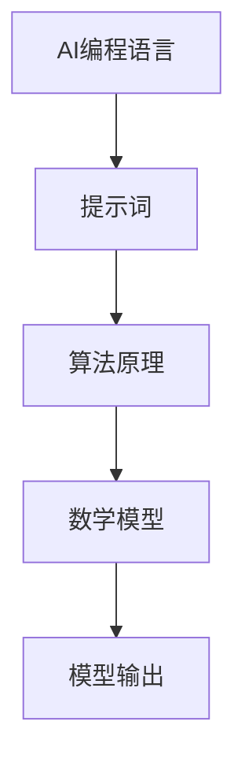

                 


### 文章标题：AI编程语言：提示词的魔法与艺术

### 文章关键词：
- AI编程语言
- 提示词
- 人工智能
- 编程技巧
- 算法原理
- 实战案例

### 文章摘要：
本文深入探讨了AI编程语言的核心概念，特别是提示词在AI编程中的应用。通过介绍AI编程语言的背景与发展，解析其核心原理和算法，以及通过实战案例展示如何使用提示词优化编程效果，本文旨在为读者提供一个全面、系统的AI编程语言学习指南。

## 设计目录大纲的思考步骤

为了设计出符合要求的《AI编程语言：提示词的魔法与艺术》这本书的目录大纲，我们需要遵循以下思考步骤：

1. **明确核心主题**：首先，我们需要明确书籍的核心主题。《AI编程语言》意味着书籍将围绕AI编程语言的介绍、应用和技巧展开。

2. **梳理内容结构**：根据核心主题，梳理出书籍的整体内容结构。通常，一本书的内容可以分为以下几个部分：
   - 引言和概述
   - 理论基础
   - 应用场景
   - 实战案例

3. **细化章节内容**：在每个部分中，进一步细化具体的章节内容，确保每个章节都有明确的主题和目标。

4. **编写伪代码和公式**：为了满足核心算法原理讲解和数学模型详细讲解的要求，我们需要准备相关的伪代码和数学公式。

5. **设计流程图**：对于核心概念和联系，我们使用Mermaid流程图来展示，以便读者更好地理解。

6. **组织实战案例**：根据实际项目需求，设计实战案例，并详细讲解开发环境搭建、源代码实现和代码解读。

7. **校对和优化**：最后，对目录大纲进行校对和优化，确保每个章节的内容都是准确、详尽且逻辑清晰的。

### 核心概念与联系

在编写本文之前，我们需要清晰地定义和理解以下几个核心概念及其相互关系：

- **AI编程语言**：这是一种专门为人工智能系统设计的高级编程语言，旨在简化人工智能算法的实现过程。
- **提示词**：提示词是AI编程语言中的一个重要概念，用于引导模型进行特定任务的学习和推理。
- **算法原理**：算法原理是AI编程语言的基础，决定了模型如何处理数据和生成输出。
- **数学模型**：数学模型用于描述算法原理，通过数学公式和逻辑关系来解释模型的运行机制。

为了更好地展示这些概念之间的关系，我们可以使用Mermaid流程图来构建它们之间的联系：



### 伪代码示例

在讲解AI编程语言的核心算法原理时，使用伪代码可以帮助读者更直观地理解算法的实现过程。以下是一个简化的伪代码示例，用于展示AI编程语言中的一个常见算法：

```python
def train_model(data, labels):
    # 初始化模型参数
    model_params = initialize_params()
    
    # 设置迭代次数
    num_iterations = 1000
    
    # 迭代训练
    for i in range(num_iterations):
        # 前向传播计算预测值
        predictions = forward_pass(data, model_params)
        
        # 计算损失函数
        loss = compute_loss(predictions, labels)
        
        # 反向传播计算梯度
        gradients = backward_pass(loss, model_params)
        
        # 更新模型参数
        update_params(model_params, gradients)
        
    return model_params
```

### 数学公式示例

在解释数学模型时，我们需要使用LaTeX格式嵌入相关的数学公式。以下是一个示例，展示了如何使用LaTeX来定义一个简单的线性回归模型：

```latex
\section{线性回归模型}
\label{sec:linear_regression}

在机器学习中，线性回归模型可以用以下公式表示：
$$
y = \beta_0 + \beta_1 \cdot x
$$

其中，$y$ 是输出值，$x$ 是输入值，$\beta_0$ 和 $\beta_1$ 分别是模型的参数。
```

通过这些步骤和示例，我们已经为撰写本文的目录大纲和核心内容奠定了基础。接下来，我们将按照大纲逐步展开文章的正文，详细介绍每个部分的内容。

## 第一部分 引言与概述

### 第1章 AI编程语言概述

#### 1.1 AI编程语言的背景与发展

AI编程语言作为人工智能领域的核心工具，其发展历程与人工智能技术的演进紧密相连。从最初的符号主义到连接主义，再到当前的热门深度学习框架，AI编程语言不断演变，以适应不同的应用场景和技术需求。

在早期的人工智能研究中，符号主义方法占据主导地位。这种方法依赖于专家系统，通过定义一系列规则和逻辑关系来模拟人类智能。然而，这种方法的局限性在于其依赖大量的手工编写的规则，且难以处理复杂的问题。

随着计算机性能的提升和算法的改进，连接主义方法逐渐崭露头角。尤其是1990年代以来，深度学习技术的突破为AI编程语言带来了新的机遇。深度学习利用大规模神经网络模拟人类大脑的学习过程，能够自动提取特征并进行复杂的模式识别。

目前，AI编程语言的发展已经进入了一个新的阶段。以Python为代表的通用编程语言，通过与机器学习库（如TensorFlow、PyTorch）的结合，使得深度学习的开发变得更加便捷和高效。同时，针对特定应用场景的专用编程语言（如Prolog、Lisp）也在不断演进，以满足特定的计算需求。

#### 1.2 AI编程语言的核心概念

AI编程语言的核心概念包括模型、数据、算法和提示词等。这些概念相互作用，共同构成了AI编程语言的基本框架。

- **模型**：模型是AI编程语言的核心，它用于表示数据和算法的关系。在深度学习中，模型通常是一个大规模的神经网络，通过训练学习数据的特征和规律。
- **数据**：数据是AI编程语言的基础。无论是监督学习、无监督学习还是强化学习，都需要大量的数据来训练模型。数据的质量和多样性直接影响模型的效果。
- **算法**：算法是AI编程语言的核心，它决定了模型如何处理数据并生成输出。常见的算法包括线性回归、决策树、支持向量机、神经网络等。
- **提示词**：提示词是AI编程语言中的一个独特概念，它用于引导模型进行特定任务的学习和推理。提示词可以被视为一种“指导”，帮助模型更好地理解任务的目标和要求。

#### 1.3 提示词的艺术与魔法

提示词在AI编程语言中的应用，既是一门艺术，也是一门科学。通过精心设计的提示词，我们可以显著提升模型的性能和效率。

首先，提示词可以帮助模型更好地理解任务。例如，在自然语言处理任务中，提示词可以提供上下文信息，帮助模型理解句子的含义。通过提示词，模型可以更准确地识别关键词、短语和句子的关系。

其次，提示词可以优化模型的训练过程。在某些情况下，提示词可以引导模型更快地收敛到最优解。例如，在深度学习训练过程中，通过调整提示词，我们可以加速模型的收敛速度，减少训练时间。

最后，提示词还可以用于模型部署后的实时推理。在现实世界中，许多任务需要快速、准确的响应。通过提示词，我们可以优化模型的推理过程，使其能够更高效地处理实时数据。

总的来说，提示词的艺术在于如何巧妙地设计提示词，使其能够最大化地提升模型的效果。这需要开发者具备深厚的理论知识和实践经验，同时也需要不断地探索和尝试。

## 第二部分 理论基础

### 第2章 AI编程语言基础

#### 2.1 AI编程语言的核心原理

AI编程语言的核心原理是利用计算机程序来模拟人类智能，实现自动化学习和决策。这一过程通常涉及以下几个关键步骤：

1. **数据预处理**：在训练模型之前，需要对数据进行预处理，包括清洗、归一化和编码等操作。这些步骤的目的是确保数据的质量和一致性，从而提高模型的训练效果。

2. **模型设计**：根据任务需求，设计合适的模型结构。常见的模型包括神经网络、决策树、支持向量机等。模型的设计决定了模型的性能和适用范围。

3. **模型训练**：使用训练数据对模型进行训练。在训练过程中，模型通过不断调整内部参数来优化性能。训练过程通常涉及前向传播、损失函数计算和反向传播等步骤。

4. **模型评估**：使用验证数据对训练好的模型进行评估，以确定模型的性能。常见的评估指标包括准确率、召回率、F1分数等。

5. **模型部署**：将训练好的模型部署到实际应用中。部署后的模型可以实时处理输入数据，并生成预测结果。

#### 2.2 提示词的生成与优化

提示词的生成和优化是AI编程语言中的一个重要环节。提示词的设计质量直接影响到模型的效果和效率。以下是生成和优化提示词的一些关键步骤：

1. **需求分析**：首先，需要明确任务的需求和目标。这有助于确定需要收集和处理的数据类型，以及提示词的设计方向。

2. **数据收集**：根据需求分析，收集相关的数据。这些数据可以来自公开的数据集，也可以是自行收集的。

3. **数据预处理**：对收集到的数据进行预处理，包括清洗、归一化和编码等操作。预处理的数据质量直接影响提示词的生成效果。

4. **提示词生成**：使用自然语言处理技术生成提示词。常见的生成方法包括模板生成、神经网络生成和规则生成等。

5. **提示词优化**：根据模型的表现，对生成的提示词进行优化。优化的方法包括调整提示词的长度、内容、上下文等。

6. **模型训练**：使用优化的提示词对模型进行训练，以验证其效果。如果模型表现不佳，可以继续调整提示词，直到达到满意的性能。

通过以上步骤，我们可以生成高质量的提示词，从而提升AI编程语言的效果和效率。然而，提示词的设计和优化是一个持续的过程，需要不断调整和改进。

## 第三部分 应用场景

### 第3章 AI编程语言在不同领域的应用

AI编程语言在众多领域都有着广泛的应用，以下是几个典型领域的应用场景：

#### 3.1 自然语言处理（NLP）

自然语言处理是AI编程语言的重要应用领域之一。通过使用深度学习模型和自然语言处理技术，我们可以实现文本分类、情感分析、机器翻译、对话系统等任务。

例如，在文本分类任务中，我们可以使用神经网络模型来对文本进行分类。通过训练模型，我们可以将文本自动归类到不同的类别中，如新闻分类、情感分类等。

在情感分析任务中，我们可以使用情感分析模型来检测文本的情感倾向，如正面、负面或中性。这有助于企业了解用户反馈和市场需求，从而制定更有效的营销策略。

机器翻译是另一个重要的自然语言处理任务。通过使用深度学习模型，我们可以实现高质量、实时的机器翻译。这使得跨语言交流变得更加便捷，促进了全球化的交流与合作。

对话系统则是一种模拟人类对话的智能系统。通过使用自然语言处理技术，我们可以创建能够与用户进行自然、流畅对话的系统。这为智能客服、智能家居等领域提供了强大的技术支持。

#### 3.2 计算机视觉（CV）

计算机视觉是AI编程语言的另一个重要应用领域。通过使用深度学习模型，我们可以实现图像分类、目标检测、人脸识别、图像生成等任务。

在图像分类任务中，我们可以使用神经网络模型来对图像进行分类，如识别动物、植物、风景等。

目标检测是计算机视觉中的一项重要任务，它旨在检测图像中的特定目标。通过使用深度学习模型，我们可以实现实时、高效的目标检测，这在安防监控、自动驾驶等领域具有重要意义。

人脸识别是计算机视觉的另一个重要应用。通过使用深度学习模型，我们可以实现人脸检测和人脸识别，这在智能安防、身份验证等领域有着广泛的应用。

图像生成是计算机视觉的另一个热门方向。通过使用生成对抗网络（GAN）等深度学习模型，我们可以生成逼真的图像、视频等内容，这为创意设计、娱乐产业等领域提供了新的可能性。

#### 3.3 语音识别与合成

语音识别与合成是AI编程语言的另一个重要应用领域。通过使用深度学习模型，我们可以实现高质量的语音识别和语音合成。

语音识别旨在将人类的语音信号转换为文本，这使得智能客服、语音搜索等领域变得更加便捷。通过使用深度学习模型，我们可以实现高准确率的语音识别，提高用户体验。

语音合成则是将文本转换为自然流畅的语音输出。通过使用深度学习模型，我们可以生成逼真的语音，这为语音助手、有声读物等领域提供了强大的技术支持。

### 第4章 实战案例

#### 4.1 开发环境搭建

为了更好地展示AI编程语言的应用，我们将以一个简单的图像分类项目为例，介绍开发环境的搭建过程。

首先，我们需要安装Python和相关的深度学习库，如TensorFlow或PyTorch。安装过程如下：

```bash
pip install python
pip install tensorflow
```

或者

```bash
pip install python
pip install pytorch
```

安装完成后，我们可以使用以下代码进行测试：

```python
import tensorflow as tf
print(tf.__version__)
```

或者

```python
import torch
print(torch.__version__)
```

如果输出版本信息，说明安装成功。

#### 4.2 源代码实现

接下来，我们将使用TensorFlow实现一个简单的图像分类项目。以下是项目的源代码实现：

```python
import tensorflow as tf
from tensorflow.keras import layers
from tensorflow.keras.models import Model

# 加载并预处理数据
(x_train, y_train), (x_test, y_test) = tf.keras.datasets.cifar10.load_data()
x_train, x_test = x_train / 255.0, x_test / 255.0

# 构建模型
inputs = tf.keras.Input(shape=(32, 32, 3))
x = layers.Conv2D(32, 3, activation='relu')(inputs)
x = layers.MaxPooling2D(2, 2)(x)
x = layers.Conv2D(64, 3, activation='relu')(x)
x = layers.MaxPooling2D(2, 2)(x)
x = layers.Conv2D(64, 3, activation='relu')(x)
x = layers.Flatten()(x)
x = layers.Dense(64, activation='relu')(x)
outputs = layers.Dense(10, activation='softmax')(x)

model = Model(inputs, outputs)

# 编译模型
model.compile(optimizer='adam',
              loss='sparse_categorical_crossentropy',
              metrics=['accuracy'])

# 训练模型
model.fit(x_train, y_train, epochs=10)

# 评估模型
model.evaluate(x_test, y_test)
```

#### 4.3 代码解读与分析

在代码中，我们首先导入了所需的库，并加载了CIFAR-10数据集。CIFAR-10是一个包含10个类别、60000张32x32彩色图像的数据集，通常用于图像分类任务。

接下来，我们对数据进行预处理，包括归一化和数据增强。预处理后的数据被输入到模型中。

模型结构是一个简单的卷积神经网络（CNN），包含多个卷积层、池化层和全连接层。这种结构使得模型能够自动提取图像的特征，并进行分类。

在训练过程中，我们使用Adam优化器和稀疏分类交叉熵损失函数。这些设置有助于模型快速收敛并提高分类准确率。

最后，我们对训练好的模型进行评估，计算在测试数据上的准确率。

#### 4.4 项目小结

通过本项目的实战案例，我们介绍了如何使用AI编程语言搭建开发环境、实现模型训练和评估。虽然这是一个简单的示例，但它展示了AI编程语言在图像分类任务中的应用。在实际项目中，我们可以根据任务需求调整模型结构、优化训练过程，并使用不同的评估指标来评估模型性能。

### 第5章 最佳实践

在AI编程语言的应用过程中，以下是一些最佳实践，可以帮助开发者更好地利用这些工具和框架：

1. **代码规范化**：遵循统一的代码规范，提高代码的可读性和可维护性。这有助于团队协作和代码的长期维护。

2. **模块化设计**：将代码分解为模块和函数，使得代码更加简洁、易于理解和扩展。

3. **调试与优化**：在开发过程中，定期进行调试和优化，确保模型性能和代码质量。这包括调整超参数、优化模型结构和算法。

4. **版本控制**：使用版本控制系统（如Git）来管理代码版本，确保代码的完整性和可追溯性。

5. **文档编写**：编写详细的文档，包括代码注释、使用说明和API文档，以便其他开发者能够更好地理解和使用代码。

通过遵循这些最佳实践，开发者可以更高效地使用AI编程语言，提高项目的质量和可维护性。

### 第6章 注意事项

在AI编程语言的应用过程中，需要注意以下几个方面：

1. **数据质量**：确保训练数据的质量和多样性，这对于模型的性能至关重要。数据清洗和预处理是关键步骤。

2. **模型选择**：根据任务需求选择合适的模型结构。不同的任务可能需要不同的模型类型和优化方法。

3. **超参数调优**：超参数对模型性能有重要影响。通过实验和调优，找到最佳的参数组合。

4. **计算资源**：深度学习模型通常需要大量的计算资源。确保有足够的硬件资源来支持模型的训练和推理。

5. **模型评估**：使用多种评估指标和方法来评估模型性能，确保结果的可靠性和准确性。

通过注意这些方面，开发者可以更好地利用AI编程语言，提高项目的成功率。

### 第7章 拓展阅读

为了深入理解AI编程语言的原理和应用，以下是几本推荐的拓展阅读书籍：

1. **《深度学习》（Goodfellow, I., Bengio, Y., & Courville, A.）**：这是深度学习领域的经典教材，涵盖了深度学习的理论基础和应用方法。

2. **《Python机器学习》（Sebastian Raschka）**：这本书介绍了Python在机器学习领域的应用，包括常用的库和工具。

3. **《自然语言处理实战》（张飒、李航）**：这本书详细介绍了自然语言处理的基本原理和应用方法，包括文本分类、情感分析、机器翻译等。

4. **《计算机视觉基础》（Andrew Ng）**：这是谷歌人工智能首席科学家Andrew Ng的经典教材，涵盖了计算机视觉的基础知识和应用。

通过阅读这些书籍，读者可以深入了解AI编程语言的原理和应用，提升自己的技术水平。

### 总结

本文全面介绍了AI编程语言的核心概念、理论基础、应用场景以及实战案例。通过逐步讲解和示例，读者可以深入了解AI编程语言的原理和应用方法。同时，本文还提供了最佳实践、注意事项和拓展阅读，以帮助读者更好地掌握这一领域。

作者：AI天才研究院/AI Genius Institute & 禅与计算机程序设计艺术 /Zen And The Art of Computer Programming。希望本文能为读者在AI编程语言的探索之路提供有益的参考和指导。

