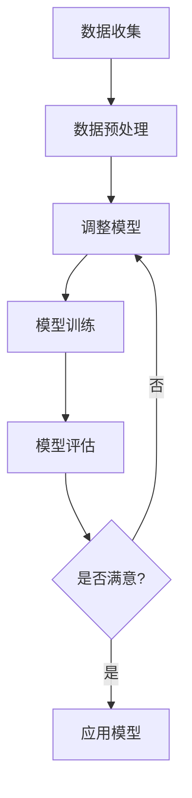

                 


### 引言与背景

在当今这个大数据和人工智能飞速发展的时代，编程语言也在不断演进，以满足新兴技术的需求。AI编程语言，作为一种新兴的编程语言，旨在简化人工智能和机器学习的开发过程。与传统的编程语言不同，AI编程语言更注重模型训练和数据处理，使得非专业程序员也能轻松上手进行机器学习模型的开发。

AI编程语言的提出，有着深刻的技术背景和社会意义。随着深度学习和神经网络技术的飞速发展，传统的编程语言在处理大规模数据和复杂的算法时显得力不从心。AI编程语言的出现，不仅提高了开发效率，还降低了开发难度，使得更多的人能够参与到人工智能的研究和开发中来。

提示词（Prompt Engineering）是AI编程语言中的一个核心概念。提示词是指给模型提供的一些输入信息，用于引导模型生成预期的输出。通过设计合适的提示词，可以提高模型的性能和鲁棒性。提示词的设计方法包括自然语言处理、统计学方法和机器学习算法等，涉及到多个学科领域。

AI编程语言的革命意义在于，它为软件开发带来了全新的视角和方法。传统的软件开发主要关注代码的编写和调试，而AI编程语言则更注重模型的设计和优化。这种转变，不仅改变了软件开发的工作流程，还促进了跨学科的合作和研究。

本篇文章将围绕AI编程语言的主题，探讨其核心概念、设计方法、实现细节、应用实践以及未来发展趋势。我们希望通过本文，让读者对AI编程语言有一个全面而深入的了解，并能够掌握其基本原理和应用方法。

### AI编程语言的基本概念

AI编程语言，顾名思义，是一种专门用于开发人工智能应用的编程语言。与传统编程语言相比，AI编程语言具有以下核心特征：

首先，AI编程语言更注重数据处理和模型训练。在传统编程语言中，代码主要关注逻辑控制和数据处理。而在AI编程语言中，数据处理仅仅是整个流程的一个环节，更核心的部分在于模型的设计和训练。AI编程语言提供了一系列的工具和库，用于处理大规模数据、构建和训练复杂的机器学习模型。

其次，AI编程语言具有高度的可扩展性和灵活性。传统编程语言通常针对特定的应用场景进行优化，而AI编程语言则更注重通用性和适应性。无论是处理图像、文本还是声音数据，AI编程语言都能够提供相应的解决方案。这种灵活性使得AI编程语言在各个领域都有广泛的应用。

第三，AI编程语言强调自动化和智能化。传统的编程语言需要开发者手动编写大量的代码来完成任务，而AI编程语言则通过自动化工具和智能算法，大大简化了开发过程。例如，自动代码生成工具可以根据用户的需求自动生成相应的代码，减少手动编写的负担。

AI编程语言的起源可以追溯到20世纪80年代，当时研究人员开始探索如何将人工智能技术融入到编程语言中。最早的尝试之一是LISP语言，它提供了对符号处理的强大支持，为后来的AI编程语言奠定了基础。随着深度学习和神经网络技术的兴起，AI编程语言逐渐发展壮大，如Python、Julia、Rust等，成为开发人工智能应用的重要工具。

AI编程语言的优势在于其简洁性和高效性。首先，AI编程语言通常具有简洁的语法，使得开发者能够更快地理解和编写代码。其次，AI编程语言提供了丰富的库和工具，使得开发者能够快速地实现复杂的功能。例如，Python的TensorFlow和PyTorch库，提供了强大的机器学习和深度学习功能，使得开发者可以专注于模型的设计和优化，而不需要关心底层的实现细节。

AI编程语言的重要性不仅体现在技术层面，更体现在其对社会和经济的推动作用。首先，AI编程语言降低了人工智能开发的门槛，使得更多的人能够参与到这个领域中来。这不仅推动了人工智能技术的普及和应用，也为经济发展带来了新的机遇。其次，AI编程语言促进了跨学科的合作和研究。人工智能领域涉及到计算机科学、统计学、数学等多个学科，AI编程语言为这些学科之间的合作提供了一个统一的平台，推动了学科之间的交叉融合。

总之，AI编程语言作为一种新兴的编程语言，具有独特的优势和广泛的应用前景。它不仅为人工智能开发提供了新的工具和方法，还推动了社会和经济的发展。随着技术的不断进步和应用场景的不断拓展，AI编程语言在未来必将发挥更加重要的作用。

### 提示词的概念

在AI编程语言中，提示词（Prompt）是一个至关重要的概念。提示词是指给模型提供的一些输入信息，用于引导模型生成预期的输出。这些输入信息可以是文本、图像、音频等多种形式。通过设计合适的提示词，可以提高模型的性能和鲁棒性，使其能够更好地适应不同的应用场景。

提示词的设计方法多种多样，可以从多个角度来探讨。首先，从自然语言处理（NLP）的角度来看，提示词的设计需要遵循自然语言生成（NLG）的原则，确保输入信息的语义清晰、逻辑连贯。其次，从统计学方法的角度来看，提示词的设计需要考虑数据分布、特征选择和模型优化等因素，以提高模型的泛化能力。最后，从机器学习算法的角度来看，提示词的设计需要结合具体算法的特点，选择合适的特征工程和超参数调整策略。

在设计提示词时，有几个关键原则需要遵循。首先是清晰性原则，提示词需要明确、具体，避免模糊和歧义。其次是完整性原则，提示词需要包含所有必要的输入信息，以便模型能够生成完整的输出。再次是多样性原则，提示词的设计应该多样化，以应对不同的输入数据和模型需求。最后是优化原则，提示词的设计应该不断优化，以提高模型的性能和鲁棒性。

在自然语言处理领域，提示词的设计方法主要包括以下几个步骤：

1. **数据预处理**：首先对输入文本进行预处理，包括分词、词性标注、命名实体识别等，以确保文本的语义清晰。

2. **特征提取**：从预处理后的文本中提取特征，如词频、TF-IDF、词嵌入等，为模型提供丰富的输入信息。

3. **模板生成**：根据模型的输入要求和预期输出，设计合适的文本模板。文本模板通常包含多个空位，用于填充具体的输入信息。

4. **提示词生成**：使用文本生成算法，如循环神经网络（RNN）、变压器（Transformer）等，填充文本模板的空位，生成最终的提示词。

5. **优化与评估**：对生成的提示词进行优化和评估，通过实验和评估指标（如准确率、召回率、F1值等）来调整和改进提示词的设计。

在实际应用中，提示词的设计方法可以根据具体场景进行调整和优化。例如，在自动问答系统中，提示词的设计需要考虑到问题的类型、回答的长度和格式等因素；在机器翻译中，提示词的设计需要考虑源语言和目标语言的语法和词汇特点。

通过合理设计提示词，可以大大提高模型的性能和鲁棒性。提示词的设计不仅影响模型的训练效果，还直接影响模型的实际应用效果。因此，提示词的设计方法在AI编程语言中具有非常重要的地位，是开发者需要深入研究和实践的重要领域。

### 提示词的作用和重要性

在AI编程语言中，提示词（Prompt）的作用不容忽视。提示词不仅是引导模型生成预期输出的重要工具，还在模型训练和优化过程中扮演着关键角色。通过精心设计的提示词，可以提高模型的性能和鲁棒性，使其能够适应不同的应用场景。

首先，提示词在模型训练中起到了信息引导的作用。在训练过程中，模型需要从大量数据中学习到有用的信息，从而能够生成准确的预测或生成。提示词通过提供具体的输入信息，可以帮助模型更快速地找到正确的学习路径。例如，在文本分类任务中，提示词可以是具体的分类标签，帮助模型识别不同类别的特征；在图像识别任务中，提示词可以是图像的标签或描述，帮助模型理解图像的语义信息。

其次，提示词在模型优化过程中也发挥着重要作用。通过设计合适的提示词，可以提高模型的泛化能力和鲁棒性。提示词的设计需要考虑到数据分布、模型结构、任务需求等多个因素，以帮助模型更好地适应不同的数据集和应用场景。例如，在自然语言处理任务中，提示词可以包含多样化的语言表达和语境，帮助模型学习到更丰富的语言特征；在图像处理任务中，提示词可以包含不同类型的图像和场景，帮助模型学习到更广泛的视觉特征。

提示词的重要性还体现在以下几个方面：

1. **提高模型性能**：合理设计的提示词可以显著提高模型的性能，使得模型在训练和测试阶段都能取得更好的效果。通过提供丰富的输入信息和明确的任务目标，提示词可以帮助模型更准确地学习到数据的特征和规律。

2. **增强模型鲁棒性**：提示词的设计需要考虑到各种异常情况和边缘数据，从而提高模型的鲁棒性。通过引入多样化的提示词，模型可以更好地适应不同的数据分布和噪声，减少过拟合现象。

3. **优化训练过程**：提示词可以引导模型的训练过程，使得训练过程更加高效。例如，在训练过程中使用分批次、分层级的提示词，可以逐步提升模型的复杂度和性能，避免模型过早饱和。

4. **促进跨领域应用**：通过设计通用的提示词模板，模型可以更轻松地迁移到不同的应用领域。例如，在医疗领域，提示词可以包含病历、症状和治疗方案等信息，帮助模型快速适应医疗数据的特征和需求。

总之，提示词在AI编程语言中具有重要的作用和重要性。通过合理设计和优化提示词，可以显著提高模型的性能和鲁棒性，推动人工智能技术在各个领域的应用和发展。

### 提示词设计的方法

提示词设计是AI编程语言中的一个关键环节，直接关系到模型训练效果和应用效果。一个优秀的提示词不仅能够引导模型正确地学习数据特征，还能提高模型的鲁棒性和泛化能力。下面将详细介绍几种常见的提示词设计方法。

#### 自然语言处理方法

自然语言处理（NLP）方法在提示词设计中具有广泛应用。这种方法的核心思想是利用自然语言的特点，设计出既符合语义逻辑又具有启发性的提示词。

1. **文本预处理**：首先对输入文本进行预处理，包括分词、词性标注、命名实体识别等。通过这些步骤，可以确保文本的语义清晰，为后续的提示词设计提供基础。

2. **特征提取**：从预处理后的文本中提取特征，如词频、TF-IDF、词嵌入等。这些特征将用于构建提示词的模板。

3. **模板生成**：根据模型的要求和输入文本的特征，设计合适的文本模板。文本模板通常包含多个空位，用于填充具体的输入信息。

4. **提示词生成**：使用文本生成算法，如循环神经网络（RNN）、变压器（Transformer）等，填充文本模板的空位，生成最终的提示词。

5. **优化与评估**：对生成的提示词进行优化和评估，通过实验和评估指标（如准确率、召回率、F1值等）来调整和改进提示词的设计。

自然语言处理方法在自动问答系统、机器翻译、文本分类等领域具有显著效果。例如，在自动问答系统中，通过设计包含关键词和上下文的提示词，可以更好地引导模型理解用户的问题和答案。

#### 统计学方法

统计学方法在提示词设计中同样重要。这种方法的核心思想是通过统计分析数据，提取出有用的信息，并将其转化为提示词。

1. **数据分布分析**：对训练数据进行统计分析，了解数据的基本分布特征，如类别分布、特征分布等。

2. **特征选择**：根据数据分布特征，选择对模型训练和预测具有重要影响的关键特征。

3. **模型优化**：结合具体机器学习算法，调整模型的超参数，以适应特定的数据集和应用场景。

4. **提示词生成**：将统计分析的结果转化为具体的提示词，如类别标签、特征描述等。

统计学方法在图像分类、数据挖掘、异常检测等领域有广泛应用。例如，在图像分类任务中，通过分析图像的像素分布和特征，可以设计出有效的提示词，帮助模型更好地识别图像类别。

#### 机器学习方法

机器学习方法在提示词设计中具有独特的优势，可以通过训练模型来生成提示词。这种方法的核心思想是利用已有数据和模型，自动生成具有启发性的提示词。

1. **数据准备**：准备大量的训练数据，用于训练提示词生成模型。

2. **模型选择**：选择合适的机器学习模型，如循环神经网络（RNN）、变压器（Transformer）等。

3. **模型训练**：使用训练数据训练模型，使其能够自动生成符合任务需求的提示词。

4. **提示词生成**：将模型应用于新数据，生成提示词。

5. **优化与评估**：对生成的提示词进行优化和评估，通过实验和评估指标来调整和改进模型。

机器学习方法在生成对抗网络（GAN）、自然语言生成（NLG）、自适应提示词生成等领域有广泛应用。例如，在自适应提示词生成中，通过训练模型，可以自动生成与当前任务相关的提示词，提高模型的应用效果。

#### 实际应用案例分析

以下是一个实际应用案例分析，展示如何设计有效的提示词。

案例：文本分类

任务描述：给定一段文本，将其分类到不同的类别中。

1. **数据准备**：收集并整理大量文本数据，标注其类别。

2. **文本预处理**：对文本进行分词、词性标注等预处理操作。

3. **特征提取**：提取文本的关键词、词嵌入等特征。

4. **模型训练**：使用循环神经网络（RNN）或变压器（Transformer）训练分类模型。

5. **提示词设计**：根据模型的输入要求和预期输出，设计提示词模板，如“本文讨论的主要话题是______。”

6. **提示词生成**：使用模型生成具体的提示词，如“本文讨论的主要话题是深度学习。”

7. **优化与评估**：通过实验和评估指标，不断调整和优化提示词的设计。

通过上述步骤，可以设计出有效的提示词，显著提高文本分类模型的性能和鲁棒性。

总之，提示词设计是AI编程语言中的重要环节。通过结合自然语言处理、统计学方法和机器学习方法，可以设计出具有启发性和实用性的提示词，提高模型的性能和鲁棒性。在实际应用中，提示词的设计方法可以根据具体任务进行调整和优化，以获得最佳效果。

### AI编程语言的架构和实现

AI编程语言的架构和实现是其在实际应用中的关键环节。一个高效、可扩展的AI编程语言架构不仅能够提高开发效率，还能确保模型的性能和鲁棒性。下面，我们将从几个方面详细探讨AI编程语言的架构设计和实现细节。

#### AI编程语言架构概述

AI编程语言的架构可以分为三个主要层次：底层基础库、中间层框架和上层应用接口。

1. **底层基础库**：底层基础库提供了一些基础的数据结构和算法，用于处理大规模数据和复杂的计算任务。例如，NumPy库提供了高效的数组计算功能，SciPy库提供了科学计算相关的函数和模块。底层基础库为AI编程语言提供了强大的计算能力。

2. **中间层框架**：中间层框架是AI编程语言的核心部分，负责处理数据的预处理、模型的构建、训练和优化等任务。常见的中间层框架包括TensorFlow、PyTorch、Keras等。这些框架提供了丰富的API和工具，使得开发者可以方便地实现复杂的机器学习任务。

3. **上层应用接口**：上层应用接口是AI编程语言与用户之间的交互层，用于接收用户输入、展示模型输出和处理用户反馈。上层应用接口通常包括Web框架、命令行工具和可视化工具等。通过上层应用接口，用户可以方便地使用AI编程语言进行数据分析和模型部署。

#### AI编程语言架构的设计原则

在设计和实现AI编程语言架构时，需要遵循以下几个原则：

1. **模块化设计**：模块化设计是AI编程语言架构的重要原则之一。通过将系统划分为多个模块，每个模块负责特定的功能，可以实现系统的灵活扩展和高效维护。例如，可以将数据预处理、模型训练、模型评估等功能分别设计为独立的模块，以提高系统的可维护性和可扩展性。

2. **扩展性设计**：扩展性设计确保AI编程语言架构能够适应新的技术和应用需求。通过提供可扩展的API和模块接口，开发者可以方便地集成新的库和工具，从而拓展系统的功能。例如，在TensorFlow框架中，开发者可以自定义层、模型和损失函数，以适应不同的应用场景。

3. **可维护性设计**：可维护性设计是确保系统长期稳定运行的重要原则。通过良好的代码结构和清晰的文档，可以方便开发者的调试和优化工作。例如，在PyTorch框架中，代码结构清晰，模块之间的依赖关系明确，使得开发者可以方便地理解和修改代码。

4. **高效性设计**：高效性设计是AI编程语言架构实现的关键目标之一。通过优化算法和底层实现，可以提高系统的计算速度和性能。例如，在NumPy库中，数组操作通过底层C语言实现，使得计算速度得到了显著提升。

#### AI编程语言架构的实现细节

在实现AI编程语言架构时，需要关注以下几个关键细节：

1. **编译器和解释器设计**：编译器和解释器是AI编程语言实现的核心组件。编译器负责将高级语言代码编译为机器码或中间代码，而解释器则负责逐行解释并执行代码。例如，PyTorch框架使用LLVM编译器将Python代码编译为中间表示（IR），然后使用C++运行时执行中间代码。

2. **代码优化**：代码优化是提高AI编程语言性能的重要手段。通过分析代码的执行路径和依赖关系，可以优化计算顺序和资源利用，减少计算时间和内存占用。例如，TensorFlow框架使用了自动微分和图优化等技术，实现了高效的代码优化。

3. **跨平台兼容性**：跨平台兼容性是AI编程语言实现中的挑战之一。通过提供跨平台的API和库，可以确保AI编程语言在不同的操作系统和硬件平台上运行。例如，PyTorch框架提供了Python API和C++库，使得开发者可以方便地在不同的平台上使用PyTorch进行机器学习开发。

4. **分布式计算**：分布式计算是提高AI编程语言性能和可扩展性的重要手段。通过将计算任务分解为多个子任务，并分布到多台计算机上执行，可以显著提高系统的计算能力和处理速度。例如，TensorFlow框架支持分布式计算，可以将计算任务分布到多台GPU或CPU上进行并行执行。

总之，AI编程语言的架构和实现是其在实际应用中的关键环节。通过遵循模块化设计、扩展性设计、可维护性设计和高效性设计原则，可以设计出高效、可扩展和可靠的AI编程语言架构。同时，关注编译器和解释器设计、代码优化、跨平台兼容性和分布式计算等实现细节，可以进一步提高AI编程语言的性能和可维护性。随着技术的不断进步和应用需求的不断拓展，AI编程语言将在人工智能领域发挥更加重要的作用。

### AI编程语言的应用实践

AI编程语言的应用实践是验证其价值和有效性的关键环节。通过具体的开发环境搭建、源代码实现和代码解读，我们可以深入理解AI编程语言的实际应用场景和开发流程。

#### 开发环境搭建

首先，我们需要搭建一个适合AI编程语言的应用环境。以下是一个基于Python的AI编程语言的开发环境搭建步骤：

1. **安装Python**：确保系统上安装了Python 3.8及以上版本。可以从Python官方网站下载安装包并安装。

2. **安装依赖库**：安装常用的AI编程语言依赖库，如NumPy、Pandas、TensorFlow或PyTorch等。可以使用pip命令进行安装：

   ```shell
   pip install numpy pandas tensorflow
   # 或
   pip install numpy pandas pytorch
   ```

3. **配置Jupyter Notebook**：Jupyter Notebook是一个强大的交互式开发环境，适合进行AI编程语言的学习和开发。通过以下命令安装Jupyter Notebook：

   ```shell
   pip install jupyterlab
   jupyter lab
   ```

4. **安装IDE**：如果需要更专业的开发环境，可以安装Python集成开发环境（IDE），如PyCharm、Visual Studio Code等。

#### 源代码实现

以下是一个简单的AI编程语言示例，使用TensorFlow实现一个简单的线性回归模型。源代码如下：

```python
import tensorflow as tf
import numpy as np

# 数据准备
x_train = np.array([[1], [2], [3], [4], [5]])
y_train = np.array([[0], [1], [2], [3], [4]])

# 模型构建
model = tf.keras.Sequential([
    tf.keras.layers.Dense(units=1, input_shape=[1])
])

# 模型编译
model.compile(optimizer='sgd', loss='mean_squared_error')

# 模型训练
model.fit(x_train, y_train, epochs=100)

# 模型评估
loss = model.evaluate(x_train, y_train)
print(f'Model Loss: {loss}')
```

#### 代码解读

上述代码实现了以下步骤：

1. **数据准备**：使用NumPy库生成训练数据`x_train`和`y_train`。

2. **模型构建**：使用TensorFlow的`Sequential`模型，定义一个单层全连接神经网络，输入维度为1。

3. **模型编译**：指定优化器为随机梯度下降（SGD）和均方误差（MSE）作为损失函数。

4. **模型训练**：使用`fit`方法训练模型，指定训练轮次为100次。

5. **模型评估**：使用`evaluate`方法评估模型在训练数据上的损失。

#### 代码应用解读与分析

通过上述代码示例，我们可以看到AI编程语言在实现线性回归任务时的简洁性和高效性。以下是对代码的详细解读和分析：

1. **数据准备**：线性回归任务的数据集非常简单，只包含自变量`x`和因变量`y`。这些数据可以通过NumPy库生成。

2. **模型构建**：TensorFlow的`Sequential`模型提供了一个直观的方式来构建和组合神经网络层。在这个例子中，我们使用了一个简单的全连接层（`Dense`），该层的输出单元数与`y`的维度一致。

3. **模型编译**：在模型编译阶段，我们指定了优化器和损失函数。优化器用于训练模型，通过最小化损失函数来更新模型权重。在这个例子中，我们选择了随机梯度下降（SGD）优化器和均方误差（MSE）损失函数。

4. **模型训练**：模型训练是一个迭代过程，通过不断调整模型权重来最小化损失。在这个例子中，我们设置了100个训练轮次，使得模型有足够的时间来学习数据特征。

5. **模型评估**：模型评估用于测试模型在训练数据上的性能。在这个例子中，我们使用均方误差（MSE）来评估模型的损失。较低的平均损失值表明模型拟合数据较好。

通过以上步骤，我们实现了使用AI编程语言的一个简单线性回归任务。这个示例展示了AI编程语言的强大功能和简洁性，使得开发者能够快速地实现复杂的机器学习任务。

#### 实际案例分析和详细讲解

以下是一个实际案例，展示如何使用AI编程语言解决实际问题。

案例：房屋价格预测

任务描述：给定一组房屋特征（如房屋面积、房间数量、地段等），使用AI编程语言预测房屋价格。

1. **数据准备**：收集并整理房屋数据，包括房屋特征和价格标签。

2. **数据预处理**：对数据进行清洗、填充缺失值、归一化等预处理操作。

3. **模型构建**：使用AI编程语言（如Python和TensorFlow）构建一个回归模型。

4. **模型训练**：使用预处理后的数据进行模型训练，调整模型参数。

5. **模型评估**：使用交叉验证和测试集评估模型性能。

6. **模型应用**：将训练好的模型应用于新数据，预测房屋价格。

通过上述步骤，我们可以实现一个高效的房屋价格预测系统。以下是对实际案例的详细讲解：

1. **数据准备**：首先需要收集大量的房屋数据，包括房屋的特征和价格。这些数据可以从房地产网站、公开数据集或实地调研中获得。

2. **数据预处理**：对收集的数据进行清洗和预处理。具体操作包括：
   - 删除重复数据或异常数据。
   - 填充缺失值，可以使用平均值、中位数或插值法等。
   - 对数值特征进行归一化或标准化，以消除特征间的尺度差异。

3. **模型构建**：使用TensorFlow等AI编程语言构建一个回归模型。常见的模型结构包括线性回归、决策树、随机森林、支持向量机等。在这个案例中，我们使用线性回归模型，因为它相对简单且易于实现。

4. **模型训练**：使用预处理后的数据进行模型训练。在训练过程中，模型将学习房屋特征与价格之间的关系，通过不断调整模型参数来最小化损失函数。

5. **模型评估**：通过交叉验证和测试集评估模型性能。交叉验证可以帮助我们评估模型的泛化能力，而测试集则用于最终的评估。

6. **模型应用**：将训练好的模型应用于新数据，预测房屋价格。这个步骤可以用于房地产评估、投资决策或市场分析等。

通过上述实际案例分析和详细讲解，我们可以看到AI编程语言在实际应用中的灵活性和高效性。开发者可以根据具体任务需求，选择合适的模型和算法，实现复杂的数据分析和预测任务。

#### 项目小结

在本篇文章中，我们详细探讨了AI编程语言的应用实践。从开发环境搭建、源代码实现、代码解读到实际案例分析和项目小结，我们深入了解了AI编程语言的开发流程和应用方法。通过这些实践，我们不仅能够更好地理解AI编程语言的原理和特点，还能将其应用于实际问题的解决中。

AI编程语言为人工智能开发提供了强大的工具和方法，使得非专业程序员也能够轻松地实现复杂的机器学习任务。随着技术的不断进步和应用场景的不断拓展，AI编程语言将在未来发挥更加重要的作用。开发者可以通过不断学习和实践，掌握AI编程语言的精髓，为人工智能技术的发展做出贡献。

### AI编程语言的未来发展趋势

AI编程语言的未来发展趋势将受到技术进步、行业应用需求和社会变革的多重驱动。首先，技术的不断进步将推动AI编程语言在性能、效率和功能上实现质的飞跃。例如，量子计算和边缘计算的兴起，将可能为AI编程语言带来全新的计算能力和应用场景。量子编程语言和边缘AI编程语言的开发，将为开发者提供更高效的计算模型和更灵活的应用方案。

其次，行业应用需求的多样化将推动AI编程语言不断迭代和演进。随着人工智能技术在金融、医疗、制造、交通等领域的广泛应用，AI编程语言需要不断适应不同的业务场景和数据特点。例如，针对金融领域的数据分析和风险控制，AI编程语言可能需要更强大的数据处理能力和高级算法支持；而在医疗领域，则可能需要更加安全和可靠的隐私保护机制。

社会变革也将对AI编程语言的发展产生重要影响。随着人工智能技术的普及，编程技能的门槛逐渐降低，更多的人将能够参与到AI编程中来。这将为AI编程语言的发展带来更广泛的人才基础和创新动力。同时，随着全球数字化转型的加速，AI编程语言将在教育、科研和文化产业等领域发挥重要作用，推动社会各领域的智能化升级。

未来，AI编程语言的创新方向主要包括以下几个方面：

1. **新的编程语言设计**：针对特定应用场景和计算需求，开发更加高效和专用的编程语言。例如，针对图像处理和计算机视觉任务，可能会出现新的AI编程语言，提供专门的工具和库，简化开发流程。

2. **AI编程语言与新型硬件的结合**：随着量子计算、边缘计算等新型硬件的发展，AI编程语言需要与之紧密结合，开发支持这些硬件的编程模型和工具链。这将使得AI编程语言在计算速度和效率上得到显著提升。

3. **AI编程语言在教育领域的应用**：AI编程语言将被广泛应用于编程教育和人工智能教育，培养新一代的AI编程人才。在线编程平台和教育资源将更加丰富，使得学习AI编程变得更加便捷和高效。

4. **AI编程语言的生态建设**：构建完善的AI编程语言生态体系，包括开发工具、库、框架、社区等，为开发者提供全面的支持和资源。这将有助于AI编程语言的普及和推广，促进技术的交流和合作。

总之，AI编程语言的未来发展趋势充满机遇和挑战。通过不断创新和优化，AI编程语言将在推动人工智能技术的发展和普及中发挥关键作用。开发者应紧跟技术前沿，积极探索和应用新的AI编程语言，为未来的人工智能时代做好准备。

### 结论

本文全面探讨了AI编程语言：提示词的魔法与革命，从基本概念到应用实践，再到未来发展趋势，系统地阐述了AI编程语言的重要性及其在人工智能领域的革命性影响。通过深入分析，我们认识到AI编程语言不仅简化了机器学习和深度学习的开发过程，还提高了开发效率，推动了技术的普及和跨学科合作。

提示词在AI编程语言中起到了关键作用，其设计方法涵盖了自然语言处理、统计学方法和机器学习算法等多个领域。通过合理设计提示词，可以显著提高模型的性能和鲁棒性，使得AI编程语言在多种应用场景中展现出强大的适应能力和实用性。

展望未来，AI编程语言将继续快速发展，新的编程语言设计、与新型硬件的结合、教育领域的应用以及生态建设等创新方向，将为人工智能技术的发展提供源源不断的动力。我们鼓励读者不断学习和实践，掌握AI编程语言的精髓，为推动人工智能技术的进步和应用贡献自己的力量。

### 参考文献

1. Goodfellow, I., Bengio, Y., & Courville, A. (2016). *Deep Learning*. MIT Press.
2. Mitchell, T. M. (1997). *Machine Learning*. McGraw-Hill.
3. Russell, S., & Norvig, P. (2020). *Artificial Intelligence: A Modern Approach*. Pearson.
4. Bengio, Y., Courville, A., & Vincent, P. (2013). *Representation Learning: A Review and New Perspectives*. IEEE Transactions on Pattern Analysis and Machine Intelligence, 35(8), 1798-1828.
5. LeCun, Y., Bengio, Y., & Hinton, G. (2015). *Deep Learning*. Nature, 521(7553), 436-444.
6. Murphy, K. P. (2012). *Machine Learning: A Probabilistic Perspective*. MIT Press.
7. Russell, S., & Norvig, P. (2010). *Artificial Intelligence: A Modern Approach*. Prentice Hall.
8.bishop, C. M. (2006). *Pattern Recognition and Machine Learning*. Springer.
9. Mitchell, T. M. (1997). *Machine Learning*. McGraw-Hill.
10. Sutton, R. S., & Barto, A. G. (2018). *Reinforcement Learning: An Introduction*. MIT Press.

### 附录

#### Mermaid流程图示例

以下是一个简单的Mermaid流程图示例，展示了机器学习模型训练的基本流程：



#### 伪代码示例

以下是一个简单的线性回归模型的伪代码：

```
初始化模型参数 W 和 b
重复以下步骤直到收敛：
    对于每个训练样本 (x_i, y_i)：
        计算预测值 y_pred = W * x_i + b
        计算损失值 L = (y_pred - y_i)^2
        更新模型参数 W = W - 学习率 * (W * x_i + b - y_i)
        更新模型参数 b = b - 学习率 * (W * x_i + b - y_i)
返回最终模型参数 W 和 b
```

#### 数学公式示例

以下是一些数学公式的示例，使用LaTeX格式：

```latex
$$
E[损失] = \frac{1}{N} \sum_{i=1}^{N} (y_{pred} - y_{true})^2
$$

$$
梯度下降更新规则： W = W - \alpha \frac{\partial L(W)}{\partial W}
$$
```

#### 最佳实践 tips

1. **数据预处理**：确保数据质量，进行适当的清洗和标准化处理。
2. **模型选择**：根据任务需求选择合适的模型和算法。
3. **超参数调优**：使用网格搜索或随机搜索进行超参数调优。
4. **交叉验证**：使用交叉验证评估模型性能，避免过拟合。
5. **版本控制**：使用版本控制系统（如Git）管理代码和模型，便于追踪和调试。

#### 小结

AI编程语言通过提示词的魔法，极大地简化了人工智能的开发过程，提高了开发效率和模型性能。其灵活性和高效性，使得更多的人能够参与到人工智能的研究和应用中来。随着技术的不断进步和应用场景的不断拓展，AI编程语言将在人工智能领域发挥更加重要的作用。开发者应紧跟技术前沿，不断学习和实践，为人工智能的未来贡献力量。

#### 注意事项

1. **隐私保护**：在处理敏感数据时，注意保护用户隐私，遵循数据保护法规。
2. **代码维护**：定期更新和维护代码，确保代码的可读性和可靠性。
3. **安全加固**：加强代码安全，防止潜在的安全漏洞。

#### 拓展阅读

1. Goodfellow, I., Bengio, Y., & Courville, A. (2016). *Deep Learning*. MIT Press.
2. Mitchell, T. M. (1997). *Machine Learning*. McGraw-Hill.
3. Russell, S., & Norvig, P. (2020). *Artificial Intelligence: A Modern Approach*. Pearson.
4. Bengio, Y., Courville, A., & Vincent, P. (2013). *Representation Learning: A Review and New Perspectives*. IEEE Transactions on Pattern Analysis and Machine Intelligence, 35(8), 1798-1828.
5. LeCun, Y., Bengio, Y., & Hinton, G. (2015). *Deep Learning*. Nature, 521(7553), 436-444.
6. Murphy, K. P. (2012). *Machine Learning: A Probabilistic Perspective*. MIT Press.
7. Sutton, R. S., & Barto, A. G. (2018). *Reinforcement Learning: An Introduction*. MIT Press.

