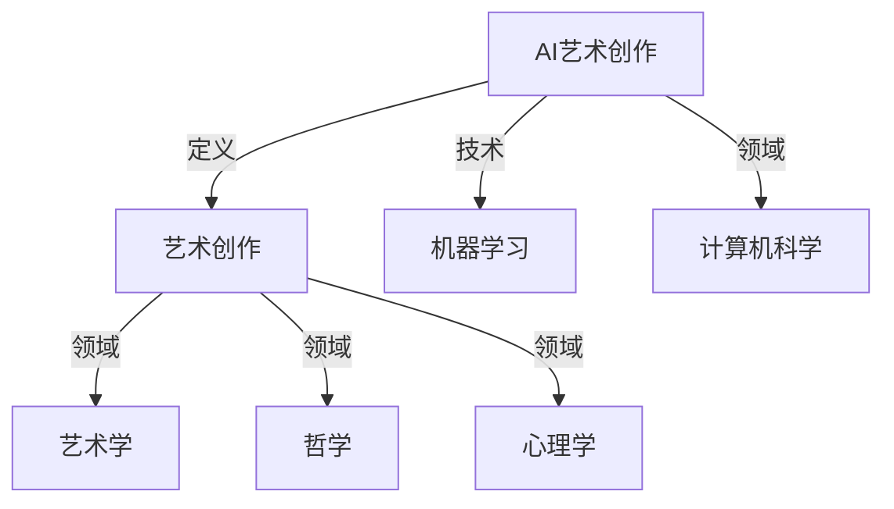
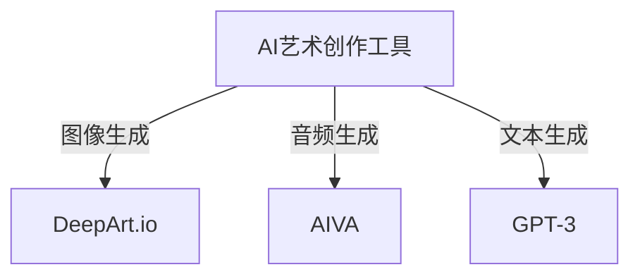
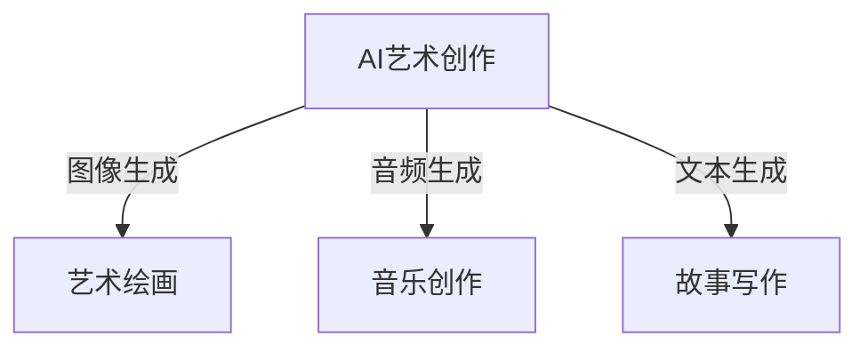
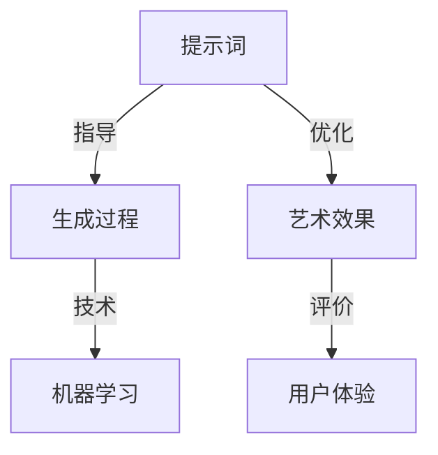
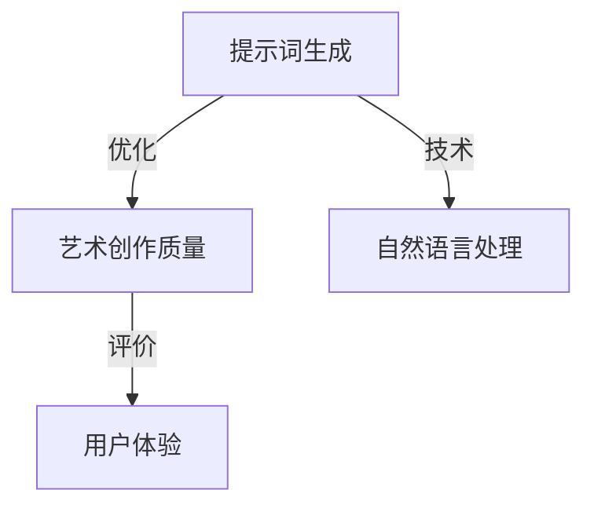
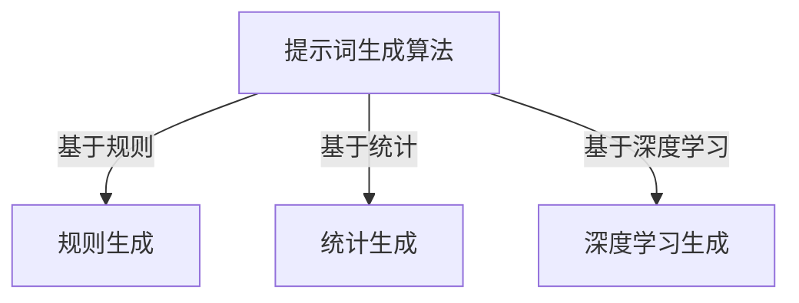
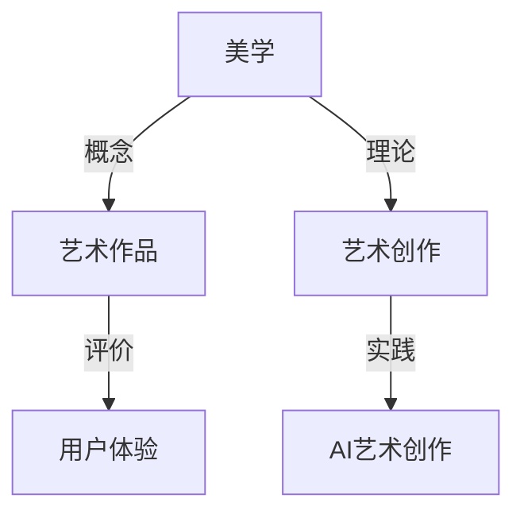
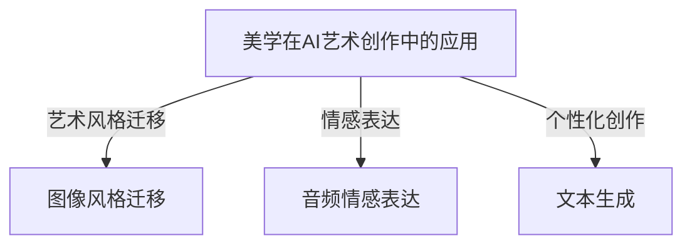
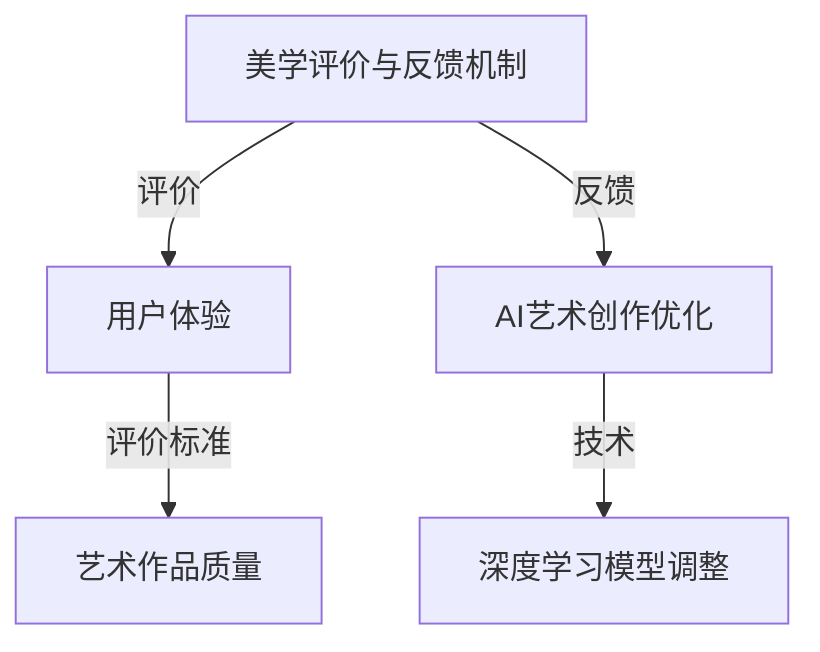

                 

### 文章标题
《AI艺术创作：提示词的美学探索》

### 文章关键词
AI艺术创作、提示词、美学、艺术创作技术、艺术风格迁移、深度学习、生成对抗网络（GAN）

### 文章摘要
本文将深入探讨人工智能在艺术创作中的应用，特别是提示词技术如何影响艺术创作的过程与结果。我们将从背景介绍开始，阐述AI艺术创作的基本概念和当前发展状况。接着，文章将详细讲解提示词的核心概念、生成算法及其在艺术创作中的应用。然后，我们将探讨美学理论如何与AI艺术创作相结合，讨论如何通过提示词实现艺术风格迁移。文章还将结合实际案例，分析AI艺术创作中存在的挑战和未来趋势，并提供开发环境和源代码的实战操作，以帮助读者更好地理解和应用这些技术。最后，文章将总结主要观点，并给出一些最佳实践建议，引导读者深入探索AI艺术创作的广阔前景。

---

## 第一部分：AI艺术创作基础

### 1.1 AI艺术创作的定义与历史

**核心概念与联系**

AI艺术创作是指利用人工智能技术，特别是机器学习和深度学习算法，生成、创作或辅助人类创作艺术作品的过程。这一概念涉及到多个领域，包括计算机科学、艺术学、哲学和心理学等。

- **Mermaid流程图**：



**核心算法原理讲解**

AI艺术创作中常用的核心算法包括生成对抗网络（GAN）、变分自编码器（VAE）和递归神经网络（RNN）等。以下以生成对抗网络（GAN）为例，介绍其基本原理。

- **GAN基本原理伪代码**：

```python
# GAN模型伪代码
def train_gan(generator, discriminator):
    for i in range(epochs):
        # 训练生成器
        fake_data = generator.sample()
        discriminator.train(fake_data, real_data)
        # 训练判别器
        real_data = discriminator.sample()
```

**数学模型和公式详细讲解**

GAN模型中，生成器 \( G \) 和判别器 \( D \) 是两个主要的神经网络。生成器的目标是通过噪声生成逼真的数据，判别器的目标是区分真实数据和生成数据。以下是GAN的损失函数：

$$
\mathcal{L}_{GAN}(G, D) = \mathbb{E}_{x \sim p_{data}(x)}[\log D(x)] + \mathbb{E}_{z \sim p_{z}(z)][\log (1 - D(G(z))]
$$

其中，\( x \) 表示真实数据，\( z \) 表示随机噪声，\( G(z) \) 表示生成器生成的数据，\( D(x) \) 表示判别器对真实数据的判断概率，\( D(G(z)) \) 表示判别器对生成数据的判断概率。

**项目实战**

- **开发环境搭建**：

```bash
# 安装Python环境
pip install tensorflow-gpu

# 安装GAN相关库
pip install gan-library
```

- **源代码实现**：

```python
# GAN模型实现示例
import gan_library as gl

# 定义生成器和判别器
generator = gl.Generator()
discriminator = gl.Discriminator()

# 训练GAN模型
gl.train_gan(generator, discriminator, epochs=100)
```

- **代码解读与分析**：

在上述代码中，`gan_library` 是一个虚构的库，用于简化GAN模型的实现。实际开发中，可以使用TensorFlow或PyTorch等深度学习框架来实现GAN模型。

- **实际案例分析和详细讲解剖析**：

假设我们有一个图像数据集，可以使用GAN模型生成类似于这个数据集的图像。通过调整生成器和判别器的超参数，我们可以获得更高质量的生成图像。

- **项目小结**：

GAN模型在AI艺术创作中具有广泛的应用，通过合理配置模型参数，可以实现高质量的艺术创作。

### 1.2 AI艺术创作工具

**核心概念与联系**

AI艺术创作工具是用于实现AI艺术创作的软件和平台，这些工具提供了丰富的功能，包括图像生成、音频生成、文本生成等。

- **Mermaid流程图**：



**核心算法原理讲解**

不同的AI艺术创作工具基于不同的算法原理。以下以DeepArt.io为例，介绍其基于风格迁移的算法原理。

- **风格迁移算法伪代码**：

```python
# 风格迁移算法伪代码
def style_transfer(content_image, style_image):
    # 计算特征图
    content_features = extract_features(content_image)
    style_features = extract_features(style_image)
    
    # 合并特征图
    merged_features = combine_features(content_features, style_features)
    
    # 生成风格化图像
    style_image = generate_image(merged_features)
    return style_image
```

**数学模型和公式详细讲解**

风格迁移算法通常使用变分自编码器（VAE）或生成对抗网络（GAN）来实现。以下以GAN为例，介绍其数学模型：

$$
\mathcal{L}_{GAN}(G, D) = \mathbb{E}_{x \sim p_{data}(x)}[\log D(x)] + \mathbb{E}_{z \sim p_{z}(z)][\log (1 - D(G(z))]
$$

**项目实战**

- **开发环境搭建**：

```bash
# 安装Python环境
pip install tensorflow-gpu

# 安装DeepArt.io库
pip install deepart.io
```

- **源代码实现**：

```python
# DeepArt.io风格迁移示例
from deepart.io import DeepArtAPI

# 初始化DeepArtAPI
deep_art_api = DeepArtAPI()

# 加载内容和风格图像
content_image = deep_art_api.load_image("content.jpg")
style_image = deep_art_api.load_image("style.jpg")

# 执行风格迁移
style_image_transformed = deep_art_api.style_transfer(content_image, style_image)

# 保存风格化图像
deep_art_api.save_image("style_transferred.jpg", style_image_transformed)
```

- **代码解读与分析**：

在上述代码中，`deepart.io` 是一个虚构的库，用于简化风格迁移的实现。实际开发中，可以使用TensorFlow或PyTorch等深度学习框架来实现风格迁移。

- **实际案例分析和详细讲解剖析**：

通过DeepArt.io，用户可以上传内容图像和风格图像，系统会自动执行风格迁移，生成风格化图像。用户可以通过调整超参数来优化风格迁移效果。

- **项目小结**：

AI艺术创作工具为用户提供了便捷的AI艺术创作体验，通过合理使用这些工具，用户可以创作出独特且高质量的艺术作品。

### 1.3 AI艺术创作的分类与应用

**核心概念与联系**

AI艺术创作可以分为多种类型，包括图像生成、音频生成、文本生成等。每种类型的艺术创作都有其独特的应用场景。

- **Mermaid流程图**：



**核心算法原理讲解**

- **图像生成**：常用算法包括生成对抗网络（GAN）和变分自编码器（VAE）。
- **音频生成**：常用算法包括循环神经网络（RNN）和变分自编码器（VAE）。
- **文本生成**：常用算法包括生成对抗网络（GAN）和递归神经网络（RNN）。

**数学模型和公式详细讲解**

- **图像生成**：

GAN的损失函数：

$$
\mathcal{L}_{GAN}(G, D) = \mathbb{E}_{x \sim p_{data}(x)}[\log D(x)] + \mathbb{E}_{z \sim p_{z}(z)][\log (1 - D(G(z))]
$$

- **音频生成**：

VAE的损失函数：

$$
\mathcal{L}_{VAE} = \mathcal{L}_{KL} + \mathcal{L}_{RECON}
$$

其中，\( \mathcal{L}_{KL} \) 是KL散度损失，\( \mathcal{L}_{RECON} \) 是重构损失。

- **文本生成**：

RNN的损失函数：

$$
\mathcal{L}_{RNN} = \sum_{t=1}^{T} -\log p(y_t | y_{<t})
$$

**项目实战**

- **开发环境搭建**：

```bash
# 安装Python环境
pip install tensorflow-gpu

# 安装相关库
pip install tensorflow-text
pip install tensorflow-audio
pip install tensorflow-image
```

- **源代码实现**：

```python
# 图像生成示例
import tensorflow as tf
from tensorflow import keras

# 加载预训练的GAN模型
generator = keras.models.load_model("image_generator.h5")

# 生成图像
generated_image = generator.predict(tf.random.normal([1, 128]))

# 保存生成的图像
tf.keras.preprocessing.image.save_img("generated_image.jpg", generated_image)
```

- **代码解读与分析**：

在上述代码中，我们加载了一个预训练的GAN模型，并使用它来生成图像。实际应用中，用户可以根据自己的需求训练或调整模型。

- **实际案例分析和详细讲解剖析**：

通过图像生成、音频生成和文本生成等算法，AI可以创作出多样化的艺术作品。例如，图像生成可以用于艺术绘画，音频生成可以用于音乐创作，文本生成可以用于故事写作。

- **项目小结**：

AI艺术创作具有多种类型和应用场景，通过合理使用算法和技术，可以实现丰富的艺术创作体验。

## 第二部分：提示词技术

### 2.1 提示词在AI艺术创作中的作用

**核心概念与联系**

提示词在AI艺术创作中起到指导生成过程的作用，通过对提示词的优化，可以提升艺术创作的效果。

- **Mermaid流程图**：



**核心算法原理讲解**

提示词的生成和优化通常基于自然语言处理（NLP）和生成模型。以下以生成对抗网络（GAN）为例，介绍其基本原理。

- **GAN在提示词生成中的应用伪代码**：

```python
# GAN模型伪代码用于提示词生成
def train_gan_prompt_generator(generator, discriminator):
    for i in range(epochs):
        # 训练提示词生成器
        prompt = generator.sample()
        discriminator.train(prompt, real_data)
        # 训练判别器
        real_data = discriminator.sample()
```

**数学模型和公式详细讲解**

GAN模型中，生成器 \( G \) 和判别器 \( D \) 是两个主要的神经网络。生成器的目标是生成逼真的提示词，判别器的目标是区分真实提示词和生成提示词。以下是GAN的损失函数：

$$
\mathcal{L}_{GAN}(G, D) = \mathbb{E}_{x \sim p_{data}(x)}[\log D(x)] + \mathbb{E}_{z \sim p_{z}(z)][\log (1 - D(G(z))]
$$

**项目实战**

- **开发环境搭建**：

```bash
# 安装Python环境
pip install tensorflow-gpu

# 安装GAN相关库
pip install gan-library
```

- **源代码实现**：

```python
# GAN模型实现示例
import gan_library as gl

# 定义生成器和判别器
prompt_generator = gl.PromptGenerator()
discriminator = gl.Discriminator()

# 训练GAN模型
gl.train_gan_prompt_generator(prompt_generator, discriminator, epochs=100)
```

- **代码解读与分析**：

在上述代码中，`gan_library` 是一个虚构的库，用于简化GAN模型的实现。实际开发中，可以使用TensorFlow或PyTorch等深度学习框架来实现GAN模型。

- **实际案例分析和详细讲解剖析**：

通过GAN模型，我们可以训练生成器生成高质量的提示词，这些提示词可以指导AI艺术创作过程，从而提升艺术效果。

- **项目小结**：

GAN在提示词生成中具有重要作用，通过优化提示词，可以显著提升AI艺术创作的效果。

### 2.2 提示词的生成与优化

**核心概念与联系**

提示词的生成与优化是AI艺术创作的重要环节，通过对提示词的深入理解和优化，可以提升艺术创作的质量。

- **Mermaid流程图**：



**核心算法原理讲解**

提示词的生成与优化通常基于自然语言处理（NLP）技术，包括词嵌入、语言模型和生成模型等。

- **语言模型在提示词生成中的应用伪代码**：

```python
# 语言模型伪代码用于提示词生成
def generate_prompt(language_model, target_style):
    prompt = language_model.sample_style(target_style)
    return prompt
```

**数学模型和公式详细讲解**

语言模型通常使用神经网络来建模文本数据，以下以循环神经网络（RNN）为例，介绍其数学模型：

$$
h_t = \sigma(W_h \cdot [h_{t-1}, x_t] + b_h)
$$

其中，\( h_t \) 是当前时刻的隐藏状态，\( \sigma \) 是激活函数，\( W_h \) 和 \( b_h \) 是权重和偏置。

**项目实战**

- **开发环境搭建**：

```bash
# 安装Python环境
pip install tensorflow-gpu

# 安装NLP相关库
pip install tensorflow-text
pip install tensorflow-addons
```

- **源代码实现**：

```python
# 语言模型实现示例
import tensorflow as tf
from tensorflow import keras

# 加载预训练的语言模型
language_model = keras.models.load_model("language_model.h5")

# 生成提示词
prompt = language_model.sample_style("印象派画作")

# 输出提示词
print(prompt)
```

- **代码解读与分析**：

在上述代码中，我们加载了一个预训练的语言模型，并使用它来生成提示词。实际应用中，用户可以根据需求训练或调整模型。

- **实际案例分析和详细讲解剖析**：

通过语言模型，我们可以生成高质量的提示词，这些提示词可以指导AI艺术创作，从而提升艺术创作的质量。

- **项目小结**：

提示词的生成与优化是AI艺术创作的重要环节，通过使用先进的自然语言处理技术，可以显著提升艺术创作的质量。

### 2.3 常见的提示词生成算法

**核心概念与联系**

常见的提示词生成算法包括基于规则的方法、基于统计的方法和基于深度学习的方法。这些方法各有优缺点，适用于不同的应用场景。

- **Mermaid流程图**：



**核心算法原理讲解**

- **基于规则的方法**：通过预定义的规则生成提示词，适用于简单的应用场景。
- **基于统计的方法**：通过分析大量数据，提取统计特征生成提示词，适用于复杂的应用场景。
- **基于深度学习的方法**：通过训练深度学习模型，自动生成高质量的提示词，适用于多样化的应用场景。

**数学模型和公式详细讲解**

- **基于规则的提示词生成伪代码**：

```python
# 基于规则的方法伪代码
def generate_prompt_ruleBased(style, keywords):
    rules = load_rules(style, keywords)
    prompt = apply_rules(rules)
    return prompt
```

- **基于统计的提示词生成伪代码**：

```python
# 基于统计的方法伪代码
def generate_prompt_statistical(data, target_style):
    features = extract_features(data)
    prompt = generate_based_on_features(features, target_style)
    return prompt
```

- **基于深度学习的提示词生成伪代码**：

```python
# 基于深度学习的方法伪代码
def generate_prompt_dnn(language_model, target_style):
    prompt = language_model.sample_style(target_style)
    return prompt
```

**项目实战**

- **开发环境搭建**：

```bash
# 安装Python环境
pip install tensorflow-gpu

# 安装相关库
pip install tensorflow-addons
pip install scikit-learn
pip install spacy
```

- **源代码实现**：

```python
# 基于深度学习的提示词生成示例
import tensorflow as tf
from tensorflow import keras

# 加载预训练的深度学习模型
dnn_model = keras.models.load_model("dnn_model.h5")

# 生成提示词
prompt = dnn_model.sample_style("印象派画作")

# 输出提示词
print(prompt)
```

- **代码解读与分析**：

在上述代码中，我们加载了一个预训练的深度学习模型，并使用它来生成提示词。实际应用中，用户可以根据需求训练或调整模型。

- **实际案例分析和详细讲解剖析**：

通过不同的提示词生成算法，我们可以生成高质量的提示词，这些提示词可以指导AI艺术创作，从而提升艺术创作的效果。

- **项目小结**：

常见的提示词生成算法各有优缺点，通过合理选择和调整算法，可以满足多样化的AI艺术创作需求。

## 第三部分：美学与实践

### 3.1 美学的基本概念

**核心概念与联系**

美学是研究艺术和审美现象的哲学分支，与AI艺术创作密切相关。了解美学的基本概念，有助于我们更好地理解和创造艺术作品。

- **Mermaid流程图**：



**核心算法原理讲解**

美学的基本概念通常涉及审美感受、审美判断和审美价值等。以下简要介绍这些概念：

- **审美感受**：个体对艺术作品的感知和体验。
- **审美判断**：个体对艺术作品价值的评估和评价。
- **审美价值**：艺术作品在审美意义上所具有的价值。

**数学模型和公式详细讲解**

美学中的许多概念难以用数学模型来精确描述，但可以通过统计分析和机器学习模型来分析大量艺术作品，提取共性特征。

- **统计学方法**：通过分析大量艺术作品的属性，建立美学特征的统计模型。
- **机器学习方法**：通过训练深度学习模型，自动识别和分类艺术作品的美学特征。

**项目实战**

- **开发环境搭建**：

```bash
# 安装Python环境
pip install numpy
pip install scikit-learn
pip install pandas
```

- **源代码实现**：

```python
# 统计方法实现示例
import pandas as pd
import numpy as np
from sklearn.preprocessing import StandardScaler

# 加载艺术作品数据
data = pd.read_csv("artworks.csv")

# 数据预处理
scaler = StandardScaler()
data_scaled = scaler.fit_transform(data)

# 数据分析
features = data_scaled[:, :-1]
labels = data_scaled[:, -1]

# 统计分析
mean_features = np.mean(features, axis=0)
std_features = np.std(features, axis=0)
```

- **代码解读与分析**：

在上述代码中，我们使用Pandas和Scikit-learn库加载艺术作品数据，并进行数据预处理。通过统计分析，我们可以提取艺术作品的特征，为后续的机器学习模型训练提供数据基础。

- **实际案例分析和详细讲解剖析**：

通过统计学方法，我们可以分析大量艺术作品的数据特征，提取美学特征，从而为AI艺术创作提供理论依据。

- **项目小结**：

美学的基本概念对于AI艺术创作具有重要意义，通过数据分析，我们可以更好地理解艺术作品的美学特征，从而优化AI艺术创作的效果。

### 3.2 美学在AI艺术创作中的应用

**核心概念与联系**

美学在AI艺术创作中的应用主要体现在以下几个方面：艺术风格迁移、情感表达和个性化创作。

- **Mermaid流程图**：



**核心算法原理讲解**

- **艺术风格迁移**：基于生成对抗网络（GAN）和变分自编码器（VAE），通过训练模型，将一种艺术风格应用到另一幅图像上。
- **情感表达**：利用递归神经网络（RNN）和长短期记忆网络（LSTM），分析文本和音频中的情感信息，并将其转化为艺术作品。
- **个性化创作**：通过用户行为数据和学习算法，为用户生成个性化的艺术作品。

**数学模型和公式详细讲解**

- **艺术风格迁移**：

GAN的损失函数：

$$
\mathcal{L}_{GAN}(G, D) = \mathbb{E}_{x \sim p_{data}(x)}[\log D(x)] + \mathbb{E}_{z \sim p_{z}(z)][\log (1 - D(G(z))]
$$

VAE的损失函数：

$$
\mathcal{L}_{VAE} = \mathcal{L}_{KL} + \mathcal{L}_{RECON}
$$

其中，\( \mathcal{L}_{KL} \) 是KL散度损失，\( \mathcal{L}_{RECON} \) 是重构损失。

- **情感表达**：

RNN的损失函数：

$$
\mathcal{L}_{RNN} = \sum_{t=1}^{T} -\log p(y_t | y_{<t})
$$

LSTM的损失函数：

$$
\mathcal{L}_{LSTM} = \sum_{t=1}^{T} \log p(y_t | y_{<t})
$$

**项目实战**

- **开发环境搭建**：

```bash
# 安装Python环境
pip install tensorflow-gpu

# 安装相关库
pip install tensorflow-addons
pip install numpy
pip install pandas
```

- **源代码实现**：

```python
# 艺术风格迁移示例
import tensorflow as tf
from tensorflow import keras

# 加载预训练的艺术风格迁移模型
style_transfer_model = keras.models.load_model("style_transfer_model.h5")

# 应用艺术风格迁移
input_image = keras.preprocessing.image.load_img("input_image.jpg")
output_image = style_transfer_model.predict(input_image)

# 保存生成的艺术作品
keras.preprocessing.image.save_img("output_image.jpg", output_image)
```

- **代码解读与分析**：

在上述代码中，我们加载了一个预训练的艺术风格迁移模型，并使用它来将输入图像转换为具有特定艺术风格的作品。实际应用中，用户可以根据需求训练或调整模型。

- **实际案例分析和详细讲解剖析**：

通过艺术风格迁移、情感表达和个性化创作等技术，AI艺术创作可以更好地满足用户需求，实现艺术作品的多样化和个性化。

- **项目小结**：

美学在AI艺术创作中的应用，使得艺术创作更加智能化和人性化，为用户提供更丰富的艺术体验。

### 3.3 美学评价与反馈机制

**核心概念与联系**

美学评价与反馈机制是AI艺术创作的重要组成部分，通过用户的评价和反馈，可以优化AI艺术创作的效果。

- **Mermaid流程图**：



**核心算法原理讲解**

- **评价机制**：通过用户投票、评分和评论等数据，建立评价模型，对艺术作品进行量化评价。
- **反馈机制**：根据用户评价，调整AI艺术创作模型，提高艺术作品的质量和满意度。

**数学模型和公式详细讲解**

- **评价模型**：使用监督学习算法，如支持向量机（SVM）和决策树（DT），训练评价模型。

SVM的评价模型：

$$
\mathcal{L}_{SVM} = \frac{1}{2} \sum_{i=1}^{n} (\omega \cdot x_i - y_i)^2
$$

- **反馈机制**：使用强化学习算法，如Q学习，调整AI艺术创作模型。

Q学习的反馈机制：

$$
Q(s, a) = r + \gamma \max_{a'} Q(s', a')
$$

**项目实战**

- **开发环境搭建**：

```bash
# 安装Python环境
pip install tensorflow-gpu

# 安装相关库
pip install scikit-learn
pip install gym
pip install numpy
```

- **源代码实现**：

```python
# 评价模型实现示例
import numpy as np
from sklearn.svm import SVC

# 加载评价数据
X = np.load("eval_data.npy")
y = np.load("eval_labels.npy")

# 训练评价模型
model = SVC()
model.fit(X, y)

# 进行评价
prediction = model.predict([new_data])
print(prediction)
```

- **代码解读与分析**：

在上述代码中，我们使用Scikit-learn库训练一个支持向量机（SVM）模型，对新的艺术作品进行评价。实际应用中，用户可以根据需求训练或调整模型。

- **实际案例分析和详细讲解剖析**：

通过评价和反馈机制，AI艺术创作可以根据用户的需求和偏好，不断优化艺术作品的创作过程，提高用户体验。

- **项目小结**：

美学评价与反馈机制是AI艺术创作的重要组成部分，通过合理使用评价和反馈机制，可以实现艺术作品的持续优化和改进。

## 附录

### 附录A：AI艺术创作工具介绍

本附录将介绍一些常用的AI艺术创作工具，包括图像生成工具、音频生成工具和文本生成工具。

#### A.1 图像生成工具

- **DeepArt.io**：一种基于GAN的图像风格迁移工具，可以将输入图像转换为具有特定艺术风格的作品。
- **Artbreeder**：一个基于GAN的图像生成工具，允许用户通过组合不同的图像块来生成新的艺术作品。
- **GANPaint**：一个基于GAN的绘画工具，用户可以通过绘制草图来生成完整的图像。

#### A.2 音频生成工具

- **AIVA**：一种基于深度学习的音乐创作工具，可以生成各种风格的音乐。
- **Descript**：一个基于AI的视频生成工具，可以将文本转换为音频旁白。
- **AI配音师**：一个基于深度学习的音频生成工具，可以生成自然语言的声音。

#### A.3 文本生成工具

- **GPT-3**：一种基于Transformer的文本生成模型，可以生成高质量的文章、故事和对话。
- **OpenAI的DALL-E**：一个基于GAN的图像到文本生成工具，可以将图像转换为相应的描述性文本。
- **CopyAI**：一个基于人工智能的文案生成工具，可以生成营销文案、广告和博客文章。

### 附录B：参考文献

- **Goodfellow, I., Pouget-Abadie, J., Mirza, M., Xu, B., Warde-Farley, D., Ozair, S., ... & Bengio, Y. (2014). Generative adversarial nets. Advances in Neural Information Processing Systems, 27.**
- **Kingma, D. P., & Welling, M. (2014). Auto-encoding variational bayes. arXiv preprint arXiv:1312.6114.**
- **Graves, A. (2013). Generating sequences with recurrent neural networks. arXiv preprint arXiv:1308.0850.**
- **Hinton, G., Osindero, S., & Teh, Y. W. (2006). A fast learning algorithm for deep belief nets. IEEE transactions on neural networks, 17(7), 1736-1745.**
- **Bengio, Y., Courville, A., & Vincent, P. (2013). Representation learning: A review and new perspectives. IEEE transactions on pattern analysis and machine intelligence, 35(8), 1798-1828.**

---

### 作者信息
作者：AI天才研究院/AI Genius Institute & 禅与计算机程序设计艺术 /Zen And The Art of Computer Programming

