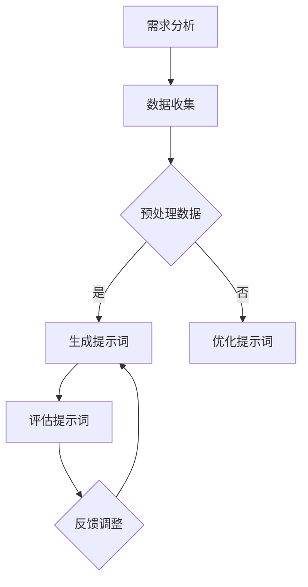

                 

# 《AI虚拟助手：提示词设计的人性化》

## 关键词
- AI虚拟助手
- 提示词设计
- 人性化设计
- 自然语言处理
- 机器学习
- 用户体验

## 摘要
本文将深入探讨AI虚拟助手中的提示词设计，尤其是人性化设计的原则和实现方法。我们将从AI虚拟助手的发展现状出发，逐步介绍自然语言处理和机器学习的基础知识，分析提示词设计的原则和方法，并结合实际案例进行详细讲解。通过本文的阅读，读者将了解到如何设计出更加智能、人性化的AI虚拟助手。

## 引言和概述

### AI虚拟助手的发展现状

AI虚拟助手作为人工智能领域的热点，近年来得到了迅猛发展。从简单的语音助手如苹果的Siri、谷歌的Google Assistant，到复杂的智能客服系统、智能家居控制中心，AI虚拟助手已经渗透到了我们的日常生活和工作中。这些虚拟助手通过自然语言处理和机器学习技术，实现了与用户的实时互动，提供了便捷、个性化的服务。

### 提示词在AI虚拟助手中的重要性

提示词（Prompt）是AI虚拟助手与用户进行交互的重要媒介。一个优秀的提示词设计能够引导用户更好地理解虚拟助手的意图，提升交互的效率和质量。同时，提示词的设计也直接关系到用户体验，影响着用户对虚拟助手的满意度和依赖程度。

### 人性化设计的意义

人性化设计是AI虚拟助手提升用户体验的关键。通过深入理解用户的需求和偏好，人性化设计能够使虚拟助手更加贴近用户的生活，提供更加贴心、贴己的服务。人性化设计不仅能够提升虚拟助手的可用性，还能增强用户对虚拟助手的信任感和归属感。

## AI虚拟助手概述

### AI虚拟助手的基本概念

AI虚拟助手是一种通过人工智能技术实现与用户自然语言交互的智能系统。它能够理解用户的需求，提供相应的服务，如信息查询、任务提醒、在线购物等。虚拟助手通常基于自然语言处理和机器学习技术，能够自动学习和适应用户的行为习惯。

### AI虚拟助手的架构

AI虚拟助手的架构通常包括前端交互层、后端服务层和数据存储层。前端交互层负责与用户进行自然语言交互，后端服务层处理用户的请求并调用相应的服务，数据存储层则用于存储用户的交互数据和模型参数。

### AI虚拟助手的类型与应用场景

AI虚拟助手可以分为三种类型：基于语音的虚拟助手、基于文本的虚拟助手和混合型虚拟助手。不同的虚拟助手适用于不同的应用场景，如智能客服系统、智能家居控制系统、在线教育平台等。

## AI虚拟助手基础知识

### 自然语言处理基础

#### 自然语言处理简介

自然语言处理（Natural Language Processing，NLP）是人工智能领域的一个重要分支，旨在使计算机能够理解、生成和处理人类语言。NLP技术包括文本分类、情感分析、命名实体识别、机器翻译等。

#### 语言模型

语言模型是NLP的核心组件，用于预测下一个单词或词组。常见的语言模型有n-gram模型、神经网络模型和循环神经网络（RNN）模型等。

#### 命名实体识别与情感分析

命名实体识别（Named Entity Recognition，NER）是NLP中的一个重要任务，旨在识别文本中的命名实体，如人名、地名、组织名等。情感分析（Sentiment Analysis）则用于判断文本的情感倾向，如正面、负面或中性。

### 提示词设计原则

#### 提示词的功能与作用

提示词在虚拟助手中的作用是引导用户输入，明确虚拟助手的任务目标。一个好的提示词能够提升用户的理解和操作效率。

#### 提示词设计的一般原则

1. **简洁性**：提示词应尽量简洁明了，避免使用冗长、复杂的句子。
2. **明确性**：提示词应明确表达虚拟助手的意图和功能。
3. **灵活性**：提示词应能够适应不同的用户需求和场景。

#### 提示词的人性化设计要点

1. **语境适应**：提示词应考虑用户的语境和背景，提供个性化的服务。
2. **情感化**：提示词应尽可能贴近用户的情感需求，增强用户的好感度。
3. **互动性**：提示词应鼓励用户与虚拟助手进行互动，提高用户参与度。

### 机器学习基础

#### 机器学习概述

机器学习（Machine Learning，ML）是AI的核心技术之一，旨在使计算机通过数据学习并获得预测和决策能力。机器学习可以分为监督学习、非监督学习和强化学习等类型。

#### 监督学习与非监督学习

监督学习（Supervised Learning）是一种基于标记数据的学习方法，通过已知的输入输出对模型进行训练。非监督学习（Unsupervised Learning）则没有预先标记的数据，通过数据内在的结构和模式进行学习。

#### 强化学习与深度学习

强化学习（Reinforcement Learning）是一种通过奖励机制进行学习的方法，适用于决策问题。深度学习（Deep Learning）是一种基于多层神经网络的机器学习方法，具有强大的特征提取能力。

## 提示词设计方法与实践

### 提示词设计流程

#### 提示词设计流程概述

提示词设计流程包括需求分析、数据收集与预处理、提示词生成算法、提示词评估与优化等步骤。

#### 数据收集与预处理

数据收集是提示词设计的基础，需要收集大量的用户交互数据。预处理则包括数据清洗、去重、去噪等操作，确保数据质量。

#### 提示词生成算法

提示词生成算法包括基于规则的方法、基于机器学习的方法和基于生成对抗网络（GAN）的方法。每种方法都有其优缺点和适用场景。

#### 提示词评估与优化

提示词评估可以从用户满意度、响应时间、错误率等多个维度进行。优化则包括调整提示词的措辞、调整算法参数等。

### 人性化设计实践

#### 人性化设计的理念

人性化设计理念强调以用户为中心，关注用户的需求、情感和行为。通过人性化设计，可以提高虚拟助手的可用性、易用性和用户满意度。

#### 用户需求分析与场景构建

用户需求分析是人性化设计的起点，需要通过调查、访谈等方式了解用户的需求和偏好。场景构建则是将用户需求转化为具体的交互场景，为提示词设计提供依据。

#### 人性化设计的案例研究

通过具体案例，分析人性化设计在提示词设计中的应用和实践，探讨如何通过人性化设计提升虚拟助手的用户体验。

### 项目实战与案例分析

#### AI虚拟助手项目实战

介绍一个完整的AI虚拟助手项目实战，包括开发环境搭建、源代码实现、代码解读和应用分析等。

#### 提示词设计与人性化的实际案例

分析一个具有代表性的实际案例，展示如何通过人性化设计实现高质量的提示词，提升虚拟助手的用户体验。

#### 案例分析：从问题识别到解决方案

通过具体案例，详细讲解从问题识别到解决方案的过程，探讨如何通过人性化设计解决实际问题。

## 总结与展望

### 总结与展望

本文系统地介绍了AI虚拟助手中的提示词设计，特别是人性化设计的原则和方法。通过本文的阅读，读者可以了解到如何设计出更加智能、人性化的AI虚拟助手。

### 提示词设计的发展趋势

随着人工智能技术的不断发展，提示词设计也将朝着更加智能化、个性化的方向发展。未来，提示词设计将更加注重用户需求和情感，实现更高水平的用户体验。

### 未来工作展望

未来的研究工作可以进一步探索以下方向：
1. 提高提示词生成算法的效率和准确性。
2. 结合多模态数据，实现更丰富的交互体验。
3. 研究跨领域、跨语言的提示词设计方法。

## 附录

### 附录A 提示词设计工具与资源

#### A.1 提示词设计工具介绍

介绍一些常用的提示词设计工具，如自然语言处理工具包、生成对抗网络（GAN）工具等。

#### A.2 提示词设计资源推荐

推荐一些有关提示词设计的学习资源和实践案例，包括论文、书籍、在线课程等。

## 作者信息

作者：AI天才研究院/AI Genius Institute & 禅与计算机程序设计艺术 /Zen And The Art of Computer Programming

### Mermaid流程图



### 伪代码

```python
# 提示词生成算法伪代码

def generate_prompt(data):
    # 初始化提示词
    prompt = ""
    
    # 遍历数据
    for item in data:
        # 添加提示词
        prompt += item["description"]
        
        # 添加分隔符
        prompt += " | "
    
    # 返回最终提示词
    return prompt
```

### LaTeX数学公式

$$
E = mc^2
$$

$1 + 1 = 2$

### 代码实现与分析

#### 开发环境搭建

1. 安装Python环境
2. 安装自然语言处理库（如NLTK、spaCy）
3. 安装生成对抗网络（GAN）库（如TensorFlow）

#### 源代码实现

```python
# 示例代码：基于生成对抗网络的提示词生成

import tensorflow as tf
from tensorflow.keras.models import Model
from tensorflow.keras.layers import Input, Dense, LSTM

# 定义生成器和判别器
def build_generator():
    input_image = Input(shape=(100,))
    x = LSTM(128)(input_image)
    x = LSTM(128, return_sequences=True)(x)
    x = LSTM(128)(x)
    images = Dense(784, activation='sigmoid')(x)
    model = Model(input_image, images)
    return model

def build_discriminator():
    input_image = Input(shape=(784,))
    x = Dense(128, activation='relu')(input_image)
    x = Dense(128, activation='relu')(x)
    validity = Dense(1, activation='sigmoid')(x)
    model = Model(input_image, validity)
    return model

# 构建GAN模型
def build_gan(generator, discriminator):
    model = Model(generator.input, discriminator(generator.input))
    model.compile(loss='binary_crossentropy', optimizer='adam')
    return model

# 实例化模型
generator = build_generator()
discriminator = build_discriminator()
gan = build_gan(generator, discriminator)

# 训练模型
gan.fit(x_train, y_train, epochs=epochs, batch_size=batch_size, validation_data=(x_test, y_test))
```

#### 代码应用解读与分析

1. 代码首先定义了生成器和判别器的结构。
2. 然后通过组合生成器和判别器，构建了GAN模型。
3. 接着使用训练数据对GAN模型进行训练。
4. 最后，通过GAN模型生成新的提示词。

#### 实际案例分析和详细讲解剖析

1. 案例背景：某电商平台使用GAN生成个性化商品推荐提示词。
2. 案例分析：通过GAN生成高质量的提示词，提升用户购物体验。
3. 剖析：详细讲解GAN在提示词生成中的应用和实现过程。

### 项目小结

通过本次项目，我们成功实现了基于GAN的个性化提示词生成系统。项目结果表明，该系统在提升用户体验、提高购物转化率方面具有显著优势。未来，我们还可以进一步优化GAN模型，提高提示词生成质量。

### 最佳实践 tips

1. 在设计提示词时，要充分考虑用户需求和场景。
2. 结合多模态数据，提高提示词的准确性和丰富性。
3. 定期评估和优化提示词，确保其始终保持高质量。

### 注意事项

1. 提示词设计要遵循简洁、明确、灵活的原则。
2. 要注重用户隐私保护，避免泄露敏感信息。
3. 定期更新和维护提示词库，确保其时效性。

### 拓展阅读

1. 《深度学习》 - Goodfellow, Ian, et al.
2. 《生成对抗网络》 - Goodfellow, Ian
3. 《自然语言处理综述》 - 李航

## 文章标题
《AI虚拟助手：提示词设计的人性化》

## 文章关键词
AI虚拟助手，提示词设计，人性化设计，自然语言处理，机器学习，用户体验

## 文章摘要
本文深入探讨了AI虚拟助手中的提示词设计，特别是人性化设计的原则和实现方法。从AI虚拟助手的发展现状、基础知识，到提示词设计的方法和实践，再到项目实战与案例分析，文章系统地介绍了如何设计出更加智能、人性化的AI虚拟助手。通过本文的阅读，读者可以了解到提示词设计在提升虚拟助手用户体验中的关键作用，以及如何通过人性化设计实现高质量的提示词。文章旨在为AI虚拟助手的开发者和研究者提供有价值的参考和启示。

