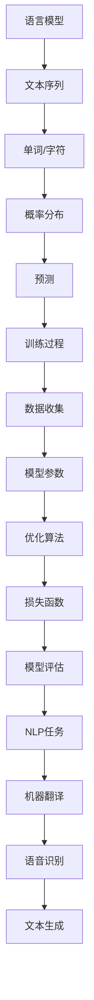

                 


# 文章标题
AI语言模型的上下文感知提示词生成

> 关键词：上下文感知，提示词生成，AI语言模型，深度学习，自然语言处理，项目实战

> 摘要：本文将深入探讨AI语言模型中的上下文感知提示词生成技术。首先，我们将介绍AI语言模型的基础知识，包括定义、发展历程、基本原理和常用架构。接着，我们将阐述上下文感知的定义、重要性以及上下文感知的机制和核心算法。随后，我们将详细讨论提示词生成的方法、优化策略以及具体案例分析。最后，我们将通过一个实际项目来展示如何实现上下文感知提示词生成，并进行评估和优化。

## 目录大纲设计思路

### 1. 确定章节主题

根据书名《AI语言模型的上下文感知提示词生成》，章节主题可以分为以下几部分：

1. AI语言模型基础
2. 语言模型上下文感知原理
3. 提示词生成方法
4. 项目实战

### 2. 设计章节内容

#### 第1章 AI语言模型基础

1. 1.1 语言模型的定义与发展
   - 语言模型的定义
   - 语言模型的发展历程
   - 语言模型的重要性

2. 1.2 语言模型的基本原理
   - 语言模型的目标
   - 语言模型的核心算法
   - 语言模型的训练过程

3. 1.3 语言模型的常用架构
   - n-gram模型
   - 随机森林模型
   - 支持向量机模型
   - 深度神经网络模型

4. 1.4 语言模型的应用场景
   - 自然语言处理
   - 机器翻译
   - 语音识别
   - 文本生成

#### 第2章 语言模型上下文感知原理

1. 2.1 上下文感知的定义与重要性
   - 上下文感知的定义
   - 上下文感知的重要性

2. 2.2 上下文感知的机制
   - 上下文信息的获取
   - 上下文信息的处理
   - 上下文信息的利用

3. 2.3 上下文感知的核心算法
   - 局部上下文感知算法
   - 全局上下文感知算法
   - 融合上下文感知算法

#### 第3章 提示词生成方法

1. 3.1 提示词的定义与作用
   - 提示词的定义
   - 提示词的作用

2. 3.2 提示词生成的基本方法
   - 基于规则的方法
   - 基于数据的方法
   - 基于机器学习的方法

3. 3.3 提示词生成的优化策略
   - 提高生成质量的方法
   - 提高生成效率的方法
   - 多样性优化策略

4. 3.4 提示词生成的案例分析
   - 案例一：文本摘要
   - 案例二：机器翻译
   - 案例三：问答系统

#### 第4章 项目实战

1. 4.1 项目背景与目标
   - 项目背景
   - 项目目标

2. 4.2 项目技术栈与工具选择
   - 技术栈介绍
   - 工具选择

3. 4.3 项目实现与代码解读
   - 语言模型实现
   - 提示词生成实现
   - 代码解读

4. 4.4 项目评估与优化
   - 评估方法
   - 优化策略

## 最终目录大纲

```
# 第1章 AI语言模型基础

## 1.1 语言模型的定义与发展

### 1.1.1 语言模型的定义

### 1.1.2 语言模型的发展历程

### 1.1.3 语言模型的重要性

## 1.2 语言模型的基本原理

### 1.2.1 语言模型的目标

### 1.2.2 语言模型的核心算法

### 1.2.3 语言模型的训练过程

## 1.3 语言模型的常用架构

### 1.3.1 n-gram模型

### 1.3.2 随机森林模型

### 1.3.3 支持向量机模型

### 1.3.4 深度神经网络模型

## 1.4 语言模型的应用场景

### 1.4.1 自然语言处理

### 1.4.2 机器翻译

### 1.4.3 语音识别

### 1.4.4 文本生成

## 1.5 核心概念与联系

### 1.5.1 Mermaid流程图展示

## 1.6 附加内容

### 1.6.1 深度学习基础

### 1.6.2 自然语言处理工具

# 第2章 语言模型上下文感知原理

## 2.1 上下文感知的定义与重要性

### 2.1.1 上下文感知的定义

### 2.1.2 上下文感知的重要性

## 2.2 上下文感知的机制

### 2.2.1 上下文信息的获取

### 2.2.2 上下文信息的处理

### 2.2.3 上下文信息的利用

## 2.3 上下文感知的核心算法

### 2.3.1 局部上下文感知算法

### 2.3.2 全局上下文感知算法

### 2.3.3 融合上下文感知算法

## 2.4 核心算法原理讲解

### 2.4.1 伪代码展示

## 2.5 数学模型和数学公式

### 2.5.1 模型公式展示

### 2.5.2 公式详细讲解

### 2.5.3 举例说明

# 第3章 提示词生成方法

## 3.1 提示词的定义与作用

### 3.1.1 提示词的定义

### 3.1.2 提示词的作用

## 3.2 提示词生成的基本方法

### 3.2.1 基于规则的方法

### 3.2.2 基于数据的方法

### 3.2.3 基于机器学习的方法

## 3.3 提示词生成的优化策略

### 3.3.1 提高生成质量的方法

### 3.3.2 提高生成效率的方法

### 3.3.3 多样性优化策略

## 3.4 提示词生成的案例分析

### 3.4.1 案例一：文本摘要

### 3.4.2 案例二：机器翻译

### 3.4.3 案例三：问答系统

## 3.5 核心算法原理讲解

### 3.5.1 伪代码展示

## 3.6 数学模型和数学公式

### 3.6.1 模型公式展示

### 3.6.2 公式详细讲解

### 3.6.3 举例说明

# 第4章 项目实战

## 4.1 项目背景与目标

### 4.1.1 项目背景

### 4.1.2 项目目标

## 4.2 项目技术栈与工具选择

### 4.2.1 技术栈介绍

### 4.2.2 工具选择

## 4.3 项目实现与代码解读

### 4.3.1 语言模型实现

### 4.3.2 提示词生成实现

### 4.3.3 代码解读

## 4.4 项目评估与优化

### 4.4.1 评估方法

### 4.4.2 优化策略

## 4.5 项目小结

### 4.5.1 最佳实践 tips

### 4.5.2 小结

### 4.5.3 注意事项

### 4.5.4 拓展阅读

----------------------------------------------------------------

在接下来的章节中，我们将分别对上述内容进行详细讨论。首先，我们将介绍AI语言模型的基础知识，包括其定义、发展历程、基本原理和常用架构。接着，我们将探讨上下文感知的定义、重要性以及上下文感知的机制和核心算法。然后，我们将详细阐述提示词生成的方法、优化策略以及具体案例分析。最后，我们将通过一个实际项目来展示如何实现上下文感知提示词生成，并进行评估和优化。

### 第1章 AI语言模型基础

#### 1.1 语言模型的定义与发展

**1.1.1 语言模型的定义**

语言模型（Language Model）是自然语言处理（Natural Language Processing, NLP）领域中的一个基础性工具，用于预测一段文本序列中下一个单词或字符的概率分布。简单来说，语言模型能够帮助我们理解文本数据，并提供合理的预测结果。

语言模型的核心目标是通过学习大量的文本数据，捕捉语言中的统计规律，从而对未知的文本进行合理的预测。这种预测可以是下一个单词、下一个字符，甚至是一个句子或段落。

**1.1.2 语言模型的发展历程**

语言模型的发展可以分为几个阶段：

1. **基于规则的语言模型**：最早的模型是采用规则驱动的方式，通过编写复杂的语法规则来模拟自然语言的规律。这种方法受限于规则的数量和复杂性，难以处理大规模的语言数据。

2. **统计语言模型**：随着计算能力的提升和数据规模的增大，统计语言模型开始兴起。这种模型主要依赖于大量的文本数据，通过统计方法来发现语言中的规律。经典的统计语言模型包括n-gram模型和决策树模型。

3. **基于神经网络的语言模型**：近年来，随着深度学习技术的发展，基于神经网络的语言模型（如RNN、LSTM、Transformer等）成为主流。这些模型通过多层神经网络结构，能够捕捉到更复杂的语言特征，并取得显著的性能提升。

**1.1.3 语言模型的重要性**

语言模型在自然语言处理领域具有重要地位，其应用场景广泛，包括但不限于：

1. **文本生成**：自动生成文本，如文章、新闻、对话等。

2. **文本分类**：对文本进行分类，如情感分析、垃圾邮件检测等。

3. **机器翻译**：将一种语言的文本翻译成另一种语言。

4. **语音识别**：将语音信号转换为文本。

5. **问答系统**：根据用户的问题提供合适的答案。

6. **文本摘要**：将长文本简化为摘要，提高信息检索效率。

#### 1.2 语言模型的基本原理

**1.2.1 语言模型的目标**

语言模型的主要目标是预测下一个词或字符，从而实现文本的生成和推理。具体来说，给定一个文本序列，语言模型需要预测该序列的下一个词或字符。

**1.2.2 语言模型的核心算法**

语言模型的核心算法是概率分布的预测。具体来说，给定一个文本序列，语言模型需要计算下一个词或字符出现的概率分布。这可以通过以下公式表示：

\[ P(\text{word}_t | \text{context}) = \frac{P(\text{context}, \text{word}_t)}{P(\text{context})} \]

其中，\(\text{word}_t\)表示下一个词或字符，\(\text{context}\)表示当前文本序列。

**1.2.3 语言模型的训练过程**

语言模型的训练过程主要分为两个步骤：

1. **数据收集**：收集大量的文本数据，这些数据可以是各种文本来源，如书籍、新闻、网页等。

2. **模型训练**：使用收集到的文本数据，通过训练算法来调整模型参数，使其能够预测文本序列的概率分布。常见的训练算法包括基于统计的方法和基于神经网络的方法。

训练过程通常涉及以下步骤：

1. **数据预处理**：对文本数据进行分析，如分词、去停用词、词向量化等。

2. **损失函数**：定义一个损失函数，用于衡量预测概率分布和实际分布之间的差距。

3. **优化算法**：使用优化算法（如梯度下降、Adam等）来调整模型参数，以最小化损失函数。

4. **模型评估**：使用测试集来评估模型的性能，常用的评价指标包括困惑度（Perplexity）和准确性（Accuracy）。

#### 1.3 语言模型的常用架构

**1.3.1 n-gram模型**

n-gram模型是最早的统计语言模型之一。它将文本序列划分为n个连续的单词或字符，并假设当前词或字符只与前面的n-1个词或字符有关。n-gram模型的基本思想是计算每个n-gram的概率，并使用这些概率来预测下一个词或字符。

**1.3.2 随机森林模型**

随机森林（Random Forest）是一种基于决策树 ensemble 的集成学习方法。它通过构建多棵决策树，并对预测结果进行投票来提高模型的准确性。在语言模型中，随机森林可以用来构建基于特征的文本分类模型。

**1.3.3 支持向量机模型**

支持向量机（Support Vector Machine, SVM）是一种监督学习算法，主要用于文本分类。它通过找到一个最佳的超平面，将不同类别的文本数据分隔开来。在语言模型中，SVM可以用来进行文本分类任务。

**1.3.4 深度神经网络模型**

深度神经网络（Deep Neural Network, DNN）是一种多层神经网络结构，可以用来模拟复杂的函数关系。在语言模型中，DNN可以用来进行文本的生成、分类和推理任务。近年来，基于深度学习的语言模型（如RNN、LSTM、Transformer等）取得了显著的成功。

#### 1.4 语言模型的应用场景

**1.4.1 自然语言处理**

自然语言处理（NLP）是语言模型的主要应用领域之一。语言模型在NLP中的任务包括文本分类、情感分析、实体识别、关系抽取等。通过使用语言模型，NLP系统可以更好地理解和处理自然语言数据。

**1.4.2 机器翻译**

机器翻译（Machine Translation）是将一种语言的文本翻译成另一种语言的过程。语言模型在机器翻译中起着关键作用，通过预测下一个词或字符，可以生成高质量的翻译结果。

**1.4.3 语音识别**

语音识别（Speech Recognition）是将语音信号转换为文本的过程。语言模型在语音识别中用于预测下一个词或字符，从而提高识别的准确性。

**1.4.4 文本生成**

文本生成（Text Generation）是语言模型的另一个重要应用领域。通过使用语言模型，可以自动生成文章、新闻、对话等文本内容。

#### 1.5 核心概念与联系

在理解语言模型的基础上，我们需要关注一些核心概念及其之间的联系。以下是一个使用Mermaid绘制的流程图，展示了这些核心概念之间的关系：



这个流程图展示了从语言模型的核心概念到实际应用场景的整个过程。语言模型通过学习大量的文本数据，生成概率分布，并用于预测下一个词或字符。这些预测结果可以应用于各种NLP任务，如文本分类、情感分析、实体识别等。

#### 1.6 附加内容

**1.6.1 深度学习基础**

深度学习（Deep Learning）是近年来发展迅速的一个领域，它在许多应用中取得了显著的成果。以下是深度学习的一些基础概念：

1. **神经网络**：神经网络是深度学习的基础，它由多个神经元组成，通过学习数据来模拟复杂的函数关系。

2. **反向传播算法**：反向传播算法是一种用于训练神经网络的优化算法，它通过不断调整网络参数，使输出结果更接近真实值。

3. **激活函数**：激活函数是神经网络中的一个关键组件，它用于引入非线性关系，使神经网络能够处理更复杂的任务。

4. **优化算法**：优化算法用于调整网络参数，以最小化损失函数。常见的优化算法包括梯度下降、Adam等。

**1.6.2 自然语言处理工具**

自然语言处理（NLP）工具是进行NLP任务的重要辅助工具。以下是几种常用的NLP工具：

1. **NLTK**：NLTK是一个广泛使用的Python NLP库，它提供了丰富的文本处理功能，如分词、词性标注、命名实体识别等。

2. **spaCy**：spaCy是一个高效且易于使用的NLP库，它支持多种语言，并提供了一系列先进的文本处理功能。

3. **Transformer**：Transformer是一种基于自注意力机制的深度学习模型，它在许多NLP任务中都取得了优异的性能。

4. **BERT**：BERT是一种预训练语言模型，它通过在大规模文本数据上进行预训练，然后在不同任务上进行微调，取得了许多NLP任务的最好性能。

### 第2章 语言模型上下文感知原理

#### 2.1 上下文感知的定义与重要性

**2.1.1 上下文感知的定义**

上下文感知（Context Awareness）是指语言模型在生成文本时，能够根据当前的环境或上下文信息，动态调整其行为和输出。上下文感知的核心目标是使语言模型能够更好地理解文本的局部和全局语境，从而生成更合理和自然的文本。

**2.1.2 上下文感知的重要性**

上下文感知在语言模型中具有重要意义，原因如下：

1. **提高生成质量**：上下文感知使语言模型能够根据上下文信息来调整生成文本的语法、语义和风格，从而提高生成文本的质量。

2. **增强理解能力**：上下文感知使语言模型能够更好地理解文本的局部和全局语境，从而提高其理解和推理能力。

3. **扩展应用范围**：上下文感知使语言模型能够应用于更广泛的场景，如对话系统、机器翻译、文本摘要等。

#### 2.2 上下文感知的机制

**2.2.1 上下文信息的获取**

上下文信息的获取是上下文感知机制的核心。语言模型需要从输入文本中提取上下文信息，并将其用于生成文本。常见的上下文信息获取方法包括：

1. **局部上下文**：局部上下文是指当前词或字符周围的一定范围内的词或字符。通过分析局部上下文，语言模型可以捕捉到文本的局部语境。

2. **全局上下文**：全局上下文是指整个输入文本的上下文信息。通过分析全局上下文，语言模型可以捕捉到文本的全局语境。

**2.2.2 上下文信息的处理**

上下文信息的处理是指语言模型如何利用上下文信息来生成文本。常见的上下文信息处理方法包括：

1. **词向量化**：词向量化是将词转换为高维向量表示，以便于计算和处理。词向量化有助于捕捉词与词之间的关系，从而提高上下文信息的利用效果。

2. **编码器-解码器结构**：编码器-解码器结构是一种常见的上下文信息处理方法，它通过编码器将输入文本编码为上下文向量，并通过解码器生成输出文本。

**2.2.3 上下文信息的利用**

上下文信息的利用是指语言模型如何根据上下文信息来调整生成文本。常见的上下文信息利用方法包括：

1. **注意力机制**：注意力机制是一种用于捕捉重要上下文信息的机制，它使语言模型能够动态关注文本中的重要信息。

2. **上下文向量**：上下文向量是将上下文信息编码为高维向量表示，以便于计算和处理。通过上下文向量，语言模型可以更好地利用上下文信息。

#### 2.3 上下文感知的核心算法

**2.3.1 局部上下文感知算法**

局部上下文感知算法主要通过分析当前词或字符周围的局部上下文信息来生成文本。常见的方法包括：

1. **n-gram模型**：n-gram模型是一种基于局部上下文的统计语言模型，它通过计算相邻词或字符的概率分布来生成文本。

2. **决策树模型**：决策树模型是一种基于特征的分类算法，它通过分析当前词或字符的局部上下文特征来生成文本。

**2.3.2 全局上下文感知算法**

全局上下文感知算法主要通过分析整个输入文本的全局上下文信息来生成文本。常见的方法包括：

1. **编码器-解码器模型**：编码器-解码器模型是一种基于全局上下文的深度学习模型，它通过编码器将输入文本编码为上下文向量，并通过解码器生成输出文本。

2. **Transformer模型**：Transformer模型是一种基于自注意力机制的深度学习模型，它通过全局上下文信息来生成文本，并在许多NLP任务中取得了优异的性能。

**2.3.3 融合上下文感知算法**

融合上下文感知算法是指将局部上下文感知算法和全局上下文感知算法结合起来，以利用不同上下文层次的信息。常见的方法包括：

1. **多层感知器**：多层感知器是一种基于局部和全局上下文的深度学习模型，它通过多层神经网络结构来融合不同上下文层次的信息。

2. **卷积神经网络**：卷积神经网络（CNN）是一种基于局部上下文的深度学习模型，它可以用于捕捉文本中的局部特征。通过结合全局上下文信息，CNN可以进一步提高文本生成质量。

#### 2.4 核心算法原理讲解

**2.4.1 局部上下文感知算法**

局部上下文感知算法主要通过分析当前词或字符周围的局部上下文信息来生成文本。以下是一个简单的n-gram模型伪代码：

```python
# 输入：一个文本序列words
# 输出：生成一个文本序列
def generate_text(words):
    context = ""
    for word in words:
        # 计算当前词的概率分布
        prob_dist = calculate_prob_dist(word, context)
        # 从概率分布中采样下一个词
        next_word = sample_word(prob_dist)
        # 更新上下文
        context += " " + word
        # 输出当前词
        print(word)
```

在这个伪代码中，`calculate_prob_dist`函数用于计算当前词的概率分布，`sample_word`函数用于从概率分布中采样下一个词。

**2.4.2 全局上下文感知算法**

全局上下文感知算法主要通过分析整个输入文本的全局上下文信息来生成文本。以下是一个简单的编码器-解码器模型伪代码：

```python
# 输入：一个编码器模型和一个解码器模型
# 输入：一个文本序列
# 输出：生成一个文本序列
def generate_text(encoder, decoder, text):
    # 编码器将输入文本编码为上下文向量
    context_vector = encoder(text)
    # 解码器根据上下文向量生成输出文本
    generated_text = decoder(context_vector)
    return generated_text
```

在这个伪代码中，`encoder`和`decoder`是编码器和解码器的模型，`context_vector`是编码器生成的上下文向量，`generated_text`是解码器生成的输出文本。

**2.4.3 融合上下文感知算法**

融合上下文感知算法主要通过结合局部和全局上下文信息来生成文本。以下是一个简单

