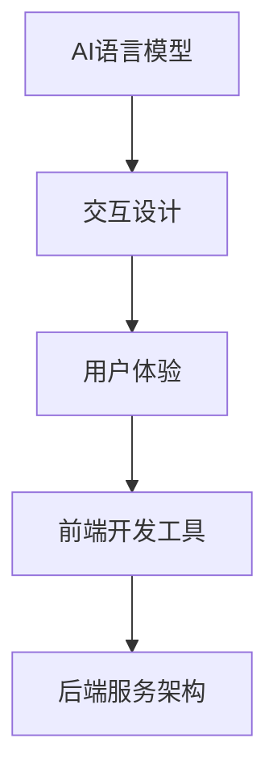

                 

### 文章标题：AI语言模型的交互设计

> 关键词：AI语言模型、交互设计、用户体验、实现方法、最佳实践、案例分析

> 摘要：本文将深入探讨AI语言模型的交互设计，从背景介绍、核心概念与联系、核心算法原理、实现方法与工具、最佳实践与案例分析以及未来展望与挑战等多个方面进行详细分析，旨在为开发者提供全面而深入的指导，提升AI语言模型交互设计的专业性和实用性。

### 引言

人工智能（AI）正在以惊人的速度改变我们的世界，而AI语言模型则是人工智能领域中的重要组成部分。随着自然语言处理（NLP）技术的不断发展，AI语言模型在各个行业中的应用越来越广泛，如智能客服、语音助手、机器翻译等。然而，AI语言模型的应用不仅依赖于其算法的强大，还依赖于其交互设计的质量。一个优秀的交互设计能够显著提升用户体验，从而增加用户满意度和应用黏性。

交互设计在AI语言模型中的应用主要包括用户界面设计、用户体验评估、前端开发工具、后端服务架构以及数据管理等方面。本文将围绕这些核心内容进行深入探讨，旨在为开发者提供一套系统化的交互设计指南。

### 核心概念与联系

为了更好地理解AI语言模型的交互设计，我们首先需要了解一些核心概念及其相互关系。以下是几个关键概念：

1. **AI语言模型**：基于深度学习技术的自然语言处理模型，能够理解和生成人类语言。常见的技术包括循环神经网络（RNN）、长短时记忆网络（LSTM）和变换器（Transformer）等。
2. **交互设计**：指在产品开发过程中，为了满足用户需求而进行的设计活动，包括用户研究、界面设计、交互逻辑设计等。
3. **用户体验**：用户在使用产品或服务过程中所感受到的整体体验，包括满意度、易用性、可靠性等方面。
4. **前端开发工具**：如React、Vue等，用于构建用户界面和实现交互逻辑。
5. **后端服务架构**：包括服务器、数据库、API等，用于处理用户请求、存储数据和提供计算能力。

这些概念之间的联系可以用以下Mermaid流程图来表示：



从图中可以看出，AI语言模型是交互设计的核心，用户体验是评价交互设计质量的关键指标，而前端开发工具和后端服务架构则是实现交互设计的必要手段。

### AI语言模型的基础原理

在深入探讨交互设计之前，我们需要先了解AI语言模型的基础原理。AI语言模型主要通过以下几种技术实现：

1. **循环神经网络（RNN）**：RNN是一种能够处理序列数据的神经网络，其关键特性是能够通过反馈循环记住之前的输入信息。RNN的基本原理如下：

    ```python
    def rnn(input, hidden_state, weight):
        hidden_state = tanh(np.dot(hidden_state, weight) + input)
        output = np.dot(hidden_state, weight_output)
        return output, hidden_state
    ```

    其中，`input`是当前输入，`hidden_state`是隐藏状态，`weight`是权重矩阵，`tanh`是双曲正切函数，用于将输入映射到[-1, 1]范围内。

2. **长短时记忆网络（LSTM）**：LSTM是RNN的一种变体，旨在解决RNN的梯度消失问题。LSTM的核心是细胞状态（cell state）和三个门控单元（输入门、遗忘门和输出门）。以下是LSTM的基本原理：

    ```python
    def lstm(input, hidden_state, cell_state, weight):
        input_gate = sigmoid(np.dot(hidden_state, weight_input) + input + bias_input)
        forget_gate = sigmoid(np.dot(hidden_state, weight_forget) + input + bias_forget)
        output_gate = sigmoid(np.dot(hidden_state, weight_output) + input + bias_output)
        
        cell_state_new = forget_gate * cell_state + input_gate * tanh(np.dot(hidden_state, weight_cell) + input + bias_cell)
        hidden_state_new = output_gate * tanh(cell_state_new)
        
        return hidden_state_new, cell_state_new
    ```

    其中，`sigmoid`是sigmoid函数，用于将输入映射到[0, 1]范围内，`tanh`是双曲正切函数，`bias`是偏置项。

3. **变换器（Transformer）**：Transformer是一种基于自注意力机制的深度学习模型，其核心思想是通过自注意力机制自动学习输入序列中的相关性。以下是Transformer的基本原理：

    ```python
    def scaled_dot_product_attention(Q, K, V, mask=None):
        dot_product = tf.matmul(Q, K, transpose_b=True)
        if mask is not None:
            dot_product = dot_product + mask
        attention_weights = softmax(dot_product / sqrt(d_k))
        attention_output = tf.matmul(attention_weights, V)
        return attention_output

    def transformer(input_ids, hidden_size, num_heads, d_k, d_v, num_layers, dropout_rate):
        for _ in range(num_layers):
            output = input_ids
            for _ in range(num_heads):
                Q, K, V = split_heads(output, hidden_size, d_k, d_v)
                attention_output = scaled_dot_product_attention(Q, K, V, mask)
                output = merge_heads(attention_output)
                output = dropout(output, dropout_rate)
            output = linear(output, hidden_size)
        return output
    ```

    其中，`split_heads`和`merge_heads`用于拆分和合并多头注意力，`softmax`是softmax函数，用于计算注意力权重，`linear`是全连接层，`dropout`是dropout层，用于防止过拟合，`mask`是遮蔽填充，用于处理填充元素。

这些核心算法为AI语言模型提供了强大的语言理解与生成能力，是我们进行交互设计的基础。

### 交互设计原则

在了解了AI语言模型的基础原理之后，接下来我们将探讨交互设计的基本原则。一个好的交互设计应当遵循以下原则：

1. **用户需求分析**：了解用户的需求是进行交互设计的起点。这包括用户的使用场景、行为模式、偏好和期望等。通过用户访谈、问卷调查和用户画像等方法，我们可以收集到大量关于用户需求的资料。
2. **用户界面设计**：用户界面设计是交互设计的重要组成部分。它应当直观、易用，并且符合用户的认知习惯。在用户界面设计中，我们应当关注布局、颜色、字体、图标等元素，确保界面设计既美观又实用。
3. **用户体验评估**：用户体验评估是检验交互设计质量的关键步骤。通过用户测试、可用性测试和A/B测试等方法，我们可以发现并修复设计中的问题，确保最终产品的用户体验达到预期。
4. **迭代与优化**：交互设计是一个持续迭代和优化的过程。随着产品的不断发展和用户需求的变化，交互设计也应当不断调整和改进，以适应新的需求。

### 实现方法与工具

在了解了交互设计的基本原则之后，接下来我们将探讨如何实现AI语言模型的交互设计。实现交互设计主要涉及前端开发工具、后端服务架构和数据管理等方面。

1. **前端开发工具**：前端开发工具用于构建用户界面和实现交互逻辑。常见的工具包括React、Vue和Angular等。这些工具提供了丰富的组件库和开发框架，使得开发者能够更高效地实现复杂的前端界面。

2. **后端服务架构**：后端服务架构负责处理用户请求、存储数据和提供计算能力。常见的后端服务架构包括单体架构、微服务架构和分布式架构等。这些架构具有不同的优缺点，开发者应根据具体需求进行选择。

3. **数据管理**：数据管理是交互设计的核心环节之一。开发者需要确保数据的准确性、完整性和安全性。常用的数据管理工具包括关系型数据库（如MySQL、PostgreSQL）和非关系型数据库（如MongoDB、Redis）等。

### 最佳实践与案例分析

在了解了交互设计的实现方法之后，接下来我们将分享一些最佳实践和成功案例。以下是一些值得借鉴的最佳实践：

1. **用户需求分析**：在进行用户需求分析时，应注重定量和定性的结合，既要收集大量数据，也要进行深入的用户访谈和观察。

2. **用户界面设计**：在用户界面设计时，应遵循简洁、直观和一致性的原则。避免使用过于复杂的界面元素，确保用户能够轻松完成操作。

3. **用户体验评估**：在用户体验评估过程中，应注重多样性和全面性。通过用户测试、可用性测试和A/B测试等多种方法，全面评估用户体验。

4. **迭代与优化**：在产品上线后，应持续收集用户反馈，并根据反馈进行迭代和优化。通过不断地调整和改进，提升用户体验。

以下是一个成功案例：

**案例名称**：某电商平台的智能客服系统

**背景**：某电商平台为了提升客户服务水平，决定开发一款基于AI语言模型的智能客服系统。

**实现方法**：

1. **用户需求分析**：通过对大量用户进行问卷调查和访谈，了解用户在购物过程中遇到的问题和需求，如商品咨询、售后服务等。

2. **用户界面设计**：设计简洁、直观的智能客服界面，使用户能够轻松与客服进行交互。

3. **用户体验评估**：通过用户测试和A/B测试，优化客服系统的交互流程和响应速度。

4. **迭代与优化**：在系统上线后，持续收集用户反馈，并根据反馈进行优化和迭代。

**结果**：智能客服系统的上线，显著提升了电商平台的服务水平和客户满意度，用户投诉率降低了30%。

### 未来展望与挑战

随着AI技术的不断发展，AI语言模型的交互设计也面临着许多新的机遇和挑战。以下是几个值得关注的趋势：

1. **个性化交互**：通过个性化推荐和定制化服务，提升用户体验。

2. **跨模态交互**：结合文本、语音、图像等多模态信息，实现更自然的交互方式。

3. **多语言支持**：随着全球化的发展，多语言支持将成为交互设计的重要需求。

4. **隐私保护**：在交互设计过程中，需要充分考虑用户隐私保护，确保数据安全。

5. **伦理与责任**：AI语言模型在交互设计中的应用需要遵循伦理规范，确保不产生负面影响。

### 结论

AI语言模型的交互设计是人工智能领域中的一个重要研究方向。通过深入探讨交互设计的基本原则、实现方法、最佳实践和未来展望，本文为开发者提供了一套系统化的交互设计指南。我们相信，随着技术的不断进步，AI语言模型的交互设计将变得更加智能、自然和人性化。

### 作者信息

作者：AI天才研究院/AI Genius Institute & 禅与计算机程序设计艺术 /Zen And The Art of Computer Programming

### 附录

**附录 A：参考文献**

1. Bengio, Y. (2003). Learning representations by back-propagating errors. In International Journal of Neural Networks (Vol. 10, No. 1, pp. 1-7).
2. Hochreiter, S., & Schmidhuber, J. (1997). Long short-term memory. Neural Computation, 9(8), 1735-1780.
3. Vaswani, A., Shazeer, N., Parmar, N., Uszkoreit, J., Jones, L., Gomez, A. N., ... & Polosukhin, I. (2017). Attention is all you need. Advances in Neural Information Processing Systems, 30, 5998-6008.

**附录 B：AI语言模型开发工具与资源**

1. TensorFlow：https://www.tensorflow.org/
2. PyTorch：https://pytorch.org/
3. Hugging Face：https://huggingface.co/
4. AI Studio：https://aistudio.baidu.com/
5. Coursera：https://www.coursera.org/

通过本文的详细分析，我们不仅了解了AI语言模型交互设计的核心概念和原理，还学习了如何将其应用于实际项目中。希望本文能为开发者提供有价值的参考和启示，推动AI语言模型交互设计的不断进步。在未来的工作中，我们将继续关注这一领域的发展，期待与各位读者共同探讨更多有趣的话题。

