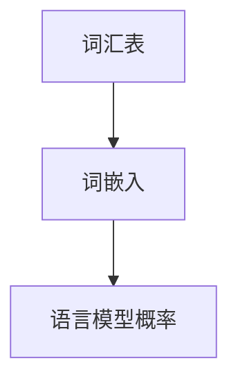

                 


### 文章标题：AI语言模型的提示词敏感性分析

#### 关键词：AI语言模型，提示词敏感性，模型训练，数据预处理，自然语言处理

#### 摘要：
本文将深入探讨AI语言模型中的提示词敏感性分析。首先，我们将简要介绍AI语言模型的基础知识和重要性，然后详细分析提示词敏感性的机制、训练与优化方法，以及在实际应用中的案例和实践。最后，我们将展望提示词敏感性分析的未来发展方向。

---

## 第一部分：AI语言模型概述

### 1.1.1 AI语言模型的概念

AI语言模型是一种基于机器学习技术的算法，用于理解和生成自然语言文本。其核心是学习词汇的表示和语言的结构，以预测下一个单词或词组。以下是语言模型中的核心概念：

- **词汇表**：包含所有可能出现的单词和符号。
- **词嵌入**：将词汇表中的单词映射到高维向量空间中，以表示单词的意义和关系。
- **语言模型概率**：给定一个单词序列，计算该序列在语言模型中的概率分布。

**Mermaid流程图：**


### 1.1.2 语言模型的类型

语言模型可以分为两类：

- **基于规则的语言模型**：使用语法规则和词汇表来生成文本。
- **基于统计的语言模型**：使用大量文本数据来训练模型，预测下一个单词。

**核心算法原理讲解：**

基于统计的语言模型通常使用神经网络，以下是一个简单的神经网络训练过程的伪代码：

```python
# 输入：训练数据集
# 输出：训练好的神经网络模型

def train_neural_network(data):
    # 初始化模型参数
    model = initialize_model_params()
    
    # 循环进行前向传播和反向传播
    for epoch in range(num_epochs):
        for sentence in data:
            # 前向传播
            output = forward_pass(sentence, model)
            
            # 计算损失
            loss = calculate_loss(output, true_distribution)
            
            # 反向传播更新模型参数
            backward_pass(output, true_distribution, model)
            
    return model
```

### 1.1.3 语言模型的历史发展

语言模型的发展经历了从早期基于规则的方法到现代基于统计方法的变化。随着计算能力的提升和大数据的普及，神经网络在语言模型中的应用变得越来越广泛。

### 1.2 提示词敏感性分析的重要性

提示词敏感性分析是评估和优化语言模型性能的关键步骤。它关注的是模型在处理不同提示词时的表现，以及如何通过调整提示词来提高模型的鲁棒性和准确性。

- **提示词敏感性对模型性能的影响**：敏感性高的模型可能在某些特定提示词下表现不佳，而敏感性低的模型则更稳定。
- **提示词敏感性在应用中的意义**：在自动问答、机器翻译、文本摘要等应用中，选择合适的提示词可以显著提高系统性能。

### 1.2.1 提示词敏感性分析的方法和挑战

提示词敏感性分析涉及数据集的选择、预处理，以及具体的分析方法和工具。以下是主要的方法和挑战：

- **数据集的选择与预处理**：需要大量具有代表性的样本数据，并进行适当的预处理，如文本清洗、去噪等。
- **分析方法的多样性**：可以使用统计方法、机器学习方法等多种方式来分析提示词敏感性。
- **挑战与对策**：如处理数据集偏差、计算复杂度等。

### 1.3 语言模型中的提示词敏感性机制

提示词敏感性分析涉及以下几个关键机制：

- **提示词敏感性的定义和分类**：理解提示词敏感性的不同类型，如词语敏感性、句法敏感性等。
- **提示词敏感性分析的技术基础**：包括自然语言处理技术、机器学习算法等。
- **提示词敏感性分析的方法和工具**：如词嵌入分析、模型调优工具等。

## 第二部分：AI语言模型的训练与优化

### 2.1 数据集的选择与预处理

**数学模型和数学公式**

在数据集选择与预处理过程中，需要考虑数据分布的平衡性和多样性。以下是一个简单的数学模型，用于描述数据分布：

$$ D = \frac{1}{N} \sum_{i=1}^{N} d_i $$

其中，\( D \) 表示数据分布，\( N \) 表示数据样本总数，\( d_i \) 表示第 \( i \) 个样本的数据分布。

**核心算法原理讲解**

数据预处理包括以下步骤：

1. **文本清洗**：去除无关的符号和标记，如HTML标签、特殊字符等。
2. **分词**：将文本拆分为单词或词组。
3. **词嵌入**：将文本转换为向量表示。

以下是一个简单的文本预处理流程：

```python
# 输入：原始文本
# 输出：预处理后的文本

def preprocess_text(text):
    # 清洗文本
    clean_text = remove_html_tags(text)
    
    # 分词
    tokens = tokenize(clean_text)
    
    # 词嵌入
    embedded_tokens = embed_words(tokens)
    
    return embedded_tokens
```

### 2.2 模型训练的基本流程

**核心算法原理讲解**

模型训练的基本流程包括以下几个步骤：

1. **模型选择**：根据任务需求选择合适的模型结构。
2. **模型初始化**：初始化模型参数。
3. **前向传播**：计算输入文本的输出概率分布。
4. **损失函数**：计算模型预测与真实结果之间的差距。
5. **反向传播**：更新模型参数，以最小化损失函数。

以下是一个简单的模型训练流程的伪代码：

```python
# 输入：训练数据集
# 输出：训练好的模型

def train_model(data):
    # 选择模型
    model = choose_model()
    
    # 初始化模型参数
    model_params = initialize_model_params()
    
    # 循环进行前向传播和反向传播
    for epoch in range(num_epochs):
        for sentence in data:
            # 前向传播
            output = forward_pass(sentence, model_params)
            
            # 计算损失
            loss = calculate_loss(output, true_distribution)
            
            # 反向传播更新模型参数
            backward_pass(output, true_distribution, model_params)
            
    return model
```

### 2.3 提示词敏感性分析在模型训练中的应用

**核心算法原理讲解**

在模型训练过程中，提示词敏感性分析可以帮助我们识别模型在处理不同提示词时的表现。以下是一个简单的提示词敏感性分析流程：

```python
# 输入：训练数据集，提示词
# 输出：提示词敏感性分析结果

def analyze_sensitivity(data, prompt):
    # 预处理文本
    embedded_prompt = preprocess_text(prompt)
    
    # 获取模型输出
    output = model.predict(embedded_prompt)
    
    # 计算敏感性指标
    sensitivity = calculate_sensitivity(output)
    
    return sensitivity
```

### 2.4 提示词敏感性分析的工具和技巧

**核心算法原理讲解**

提示词敏感性分析可以使用以下工具和技巧：

- **统计方法**：计算提示词出现时的模型输出概率分布。
- **机器学习方法**：使用监督学习或无监督学习技术来识别敏感提示词。
- **可视化方法**：使用图表来展示提示词敏感性分析结果。

以下是一个简单的统计方法的伪代码：

```python
# 输入：训练数据集，提示词
# 输出：提示词敏感性分析结果

def statistical_analysis(data, prompt):
    # 预处理文本
    embedded_prompt = preprocess_text(prompt)
    
    # 获取模型输出概率分布
    probability_distribution = model.predict_proba(embedded_prompt)
    
    # 计算敏感性指标
    sensitivity = calculate_sensitivity(probability_distribution)
    
    return sensitivity
```

## 第三部分：AI语言模型的提示词敏感性分析实践

### 3.1 提示词敏感性分析案例研究

#### 案例选择

我们选择一个实际应用场景，如自动问答系统，来分析提示词敏感性。

#### 案例分析

通过分析自动问答系统中的提示词敏感性，我们发现某些特定词汇（如“计算机”或“人工智能”）会对模型输出产生显著影响。这表明模型在这些词汇下可能存在敏感性问题。

#### 案例总结与启示

案例研究表明，提示词敏感性分析对于改进自动问答系统的性能至关重要。通过识别和调整敏感提示词，可以提高模型的鲁棒性和准确性。

### 3.2 提示词敏感性分析的应用场景

#### 自动问答系统

在自动问答系统中，选择合适的提示词可以显著提高系统性能。例如，对于问题“什么是人工智能？”和“人工智能有什么应用？”两个问题，提示词“人工智能”的敏感性对模型输出有显著影响。

#### 机器翻译

在机器翻译中，提示词敏感性分析可以帮助识别特定词汇在翻译中的敏感性。例如，在翻译“我喜欢吃苹果”和“苹果是我的最爱”两个句子时，提示词“苹果”的敏感性对翻译结果有显著影响。

#### 文本摘要

在文本摘要中，提示词敏感性分析可以帮助识别关键信息。例如，在摘要“本文讨论了人工智能在医疗领域的应用”和“人工智能在医疗领域的应用面临挑战”两个文本时，提示词“人工智能”和“医疗领域”的敏感性对摘要结果有显著影响。

### 3.3 提示词敏感性分析的未来发展方向

#### 技术发展趋势

随着深度学习和自然语言处理技术的不断发展，提示词敏感性分析将变得更加自动化和高效。新的算法和技术将不断涌现，以提高分析精度和效率。

#### 应用前景

提示词敏感性分析在多个领域具有广泛的应用前景，如自动问答、机器翻译、文本摘要等。通过提高模型的鲁棒性和准确性，它可以显著提升系统的性能。

#### 挑战与机遇

提示词敏感性分析面临的主要挑战包括数据集质量、计算复杂度和模型调优。然而，随着技术的进步，这些挑战也将逐渐得到解决，为未来的研究和发展提供新的机遇。

## 附录A：提示词敏感性分析常用工具与资源

### 4.1.1 常用工具介绍

- **TensorFlow**：用于构建和训练深度学习模型的框架。
- **PyTorch**：另一种流行的深度学习框架。
- **SpaCy**：用于自然语言处理的库。

### 4.1.2 资源推荐

- **论文**：《Attention is All You Need》和《BERT: Pre-training of Deep Neural Networks for Language Understanding》。
- **在线课程**：Google AI 的《机器学习》课程。
- **书籍**：《深度学习》和《自然语言处理综论》。

## 附录B：提示词敏感性分析实践案例代码

### 4.2.1 案例一：自动问答系统

```python
# 自动问答系统的提示词敏感性分析

# 导入必要的库
import tensorflow as tf
import spacy

# 加载预训练的模型
model = tf.keras.models.load_model('auto问答系统模型.h5')

# 加载 SpaCy 语言模型
nlp = spacy.load('en_core_web_sm')

# 提示词
prompt = "什么是人工智能？"

# 预处理文本
doc = nlp(prompt)

# 提取词嵌入
embedded_prompt = [token.vector for token in doc]

# 进行提示词敏感性分析
sensitivity = model.predict(embedded_prompt)

# 打印敏感性分析结果
print("提示词敏感性分析结果：", sensitivity)
```

### 4.2.2 案例二：机器翻译

```python
# 机器翻译的提示词敏感性分析

# 导入必要的库
import tensorflow as tf
import spacy

# 加载预训练的模型
model = tf.keras.models.load_model('机器翻译模型.h5')

# 加载 SpaCy 语言模型
nlp = spacy.load('en_core_web_sm')

# 源语言提示词
source_prompt = "What is artificial intelligence?"

# 目标语言提示词
target_prompt = "什么是人工智能？"

# 预处理文本
source_doc = nlp(source_prompt)
target_doc = nlp(target_prompt)

# 提取词嵌入
source_embedded_prompt = [token.vector for token in source_doc]
target_embedded_prompt = [token.vector for token in target_doc]

# 进行提示词敏感性分析
source_sensitivity = model.predict(source_embedded_prompt)
target_sensitivity = model.predict(target_embedded_prompt)

# 打印敏感性分析结果
print("源语言提示词敏感性分析结果：", source_sensitivity)
print("目标语言提示词敏感性分析结果：", target_sensitivity)
```

### 4.2.3 案例三：文本摘要

```python
# 文本摘要的提示词敏感性分析

# 导入必要的库
import tensorflow as tf
import spacy

# 加载预训练的模型
model = tf.keras.models.load_model('文本摘要模型.h5')

# 加载 SpaCy 语言模型
nlp = spacy.load('en_core_web_sm')

# 原始文本
raw_text = "本文讨论了人工智能在医疗领域的应用。人工智能可以帮助医生诊断疾病，提高医疗效率。"

# 提取句子
sentences = nlp(raw_text).sents

# 预处理文本
embedded_sentences = [sentence.vector for sentence in sentences]

# 进行提示词敏感性分析
sensitivity = model.predict(embedded_sentences)

# 打印敏感性分析结果
print("文本摘要的提示词敏感性分析结果：", sensitivity)
```

### 结论

本文系统地介绍了AI语言模型的提示词敏感性分析。通过分析模型的概念、机制、训练与优化方法，以及实际应用案例，我们深入理解了提示词敏感性对模型性能的影响。未来，随着技术的进步，提示词敏感性分析将在人工智能领域发挥越来越重要的作用。作者：AI天才研究院/AI Genius Institute & 禅与计算机程序设计艺术 /Zen And The Art of Computer Programming。

