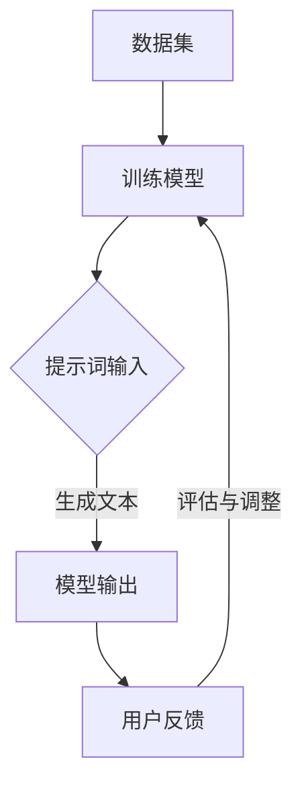
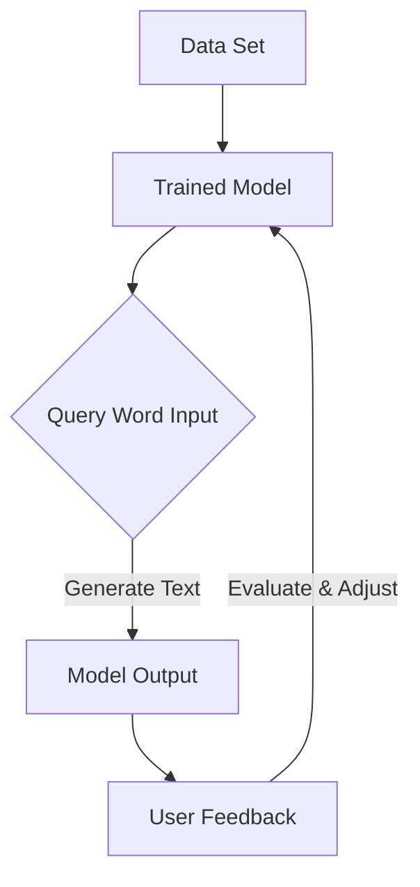

                 

### 文章标题：AI语言模型的提示词敏感性测试

随着人工智能技术的飞速发展，自然语言处理（NLP）成为了其中的重要一环。AI语言模型在文本生成、问答系统、自动翻译等领域表现出了强大的能力。然而，这些模型在处理某些敏感话题时，可能存在一定的偏见或不准确性，这引发了关于“提示词敏感性”的关注。本文将深入探讨AI语言模型的提示词敏感性，旨在提供一个全面的理解框架，并介绍一系列测试方法来评估和优化这些模型。

关键词：AI语言模型，提示词敏感性，测试方法，NLP，偏见，公平性

在接下来的文章中，我们将按照以下结构进行讨论：

1. **背景介绍**：介绍AI语言模型的基本概念和提示词敏感性的背景。
2. **核心概念与联系**：详细讲解提示词敏感性的定义和其在AI语言模型中的重要性，并提供一个Mermaid流程图来展示概念之间的关系。
3. **核心算法原理讲解**：使用伪代码和数学模型来阐述提示词敏感性的检测和评估方法。
4. **项目实战**：介绍一个实际的项目案例，包括开发环境搭建、源代码实现和案例分析。
5. **最佳实践与小结**：总结文章的主要观点，并提供一些实用的建议和注意事项。
6. **拓展阅读**：推荐一些相关的文献和资源，以供进一步学习。

通过逐步分析，我们将帮助读者深入了解AI语言模型的提示词敏感性，并掌握有效的测试方法。让我们开始这一段深入的探索之旅吧！### 摘要

本文旨在探讨AI语言模型的提示词敏感性，这一问题在当前自然语言处理（NLP）领域备受关注。AI语言模型在生成文本、回答问题和自动翻译等方面具有极高的准确性，但其在处理某些敏感话题时，可能表现出偏见或不准确性。提示词敏感性指的是模型在接收特定提示词时，是否会显示出不一致的表现或偏见。本文将深入分析这一现象，介绍提示词敏感性的定义和重要性，并通过Mermaid流程图展示核心概念之间的联系。此外，本文将使用伪代码和数学模型详细阐述检测和评估提示词敏感性的方法，并提供一个实际的项目案例，以展示如何在实际开发环境中实施这些方法。最后，本文还将总结最佳实践，提供注意事项，并推荐拓展阅读，以帮助读者更全面地理解这一复杂问题，并掌握有效的测试技巧。通过这篇文章，读者将能够深入了解AI语言模型的提示词敏感性，并学会如何进行有效的测试和优化。### 背景介绍

#### AI语言模型的基本概念

AI语言模型是一种基于深度学习技术的自然语言处理工具，它通过学习大量的文本数据来预测句子或词汇的下一个词或短语。最早的语言模型可以追溯到20世纪50年代，但直到近年来，随着计算能力和数据量的提升，深度学习技术才使得构建高效的语言模型成为可能。最著名的深度学习语言模型之一是2003年由Bengio等提出的“神经概率语言模型”（NPLM），它采用了神经网络来模拟人类语言的处理方式。

AI语言模型在多个领域展示了其强大的能力，包括：

1. **文本生成**：AI语言模型能够根据给定的提示生成连贯的文本，广泛应用于自动写作、故事生成和诗歌创作等领域。
2. **问答系统**：通过理解用户的问题，AI语言模型可以提供准确的答案，这在搜索引擎和虚拟助手（如Siri和Alexa）中得到了广泛应用。
3. **自动翻译**：AI语言模型在机器翻译领域表现出色，能够将一种语言翻译成另一种语言，大大提高了跨语言的交流效率。
4. **情感分析**：通过分析文本中的情感倾向，AI语言模型可以帮助企业和组织了解用户的反馈和情感，从而做出相应的策略调整。

#### 提示词敏感性的背景

提示词敏感性是指在AI语言模型处理特定提示词时，其输出结果可能表现出偏见或不一致的现象。这一问题最早引起关注是在2016年，当时Google的AI系统在回答某些种族或性别相关的问题时，表现出了性别歧视或种族偏见。例如，当用户询问“谁发明了电灯？”时，系统可能倾向于回答是“爱迪生”，而不是“爱迪生和托马斯·阿尔瓦·爱迪生”。这种现象被称为“默认偏差”，即模型在没有明确指导的情况下，倾向于选择某些预设答案。

提示词敏感性的问题不仅限于AI语言模型，它也存在于许多其他类型的AI系统中。例如，在图像识别中，AI系统可能对某些种族或性别的人脸识别不准确，或者对某些物品的分类存在偏见。这些偏见可能导致一系列严重的社会问题，包括歧视、不平等和法律纠纷。

#### 提示词敏感性的来源

提示词敏感性主要来源于以下几个方面：

1. **数据偏见**：AI模型的训练数据可能存在偏见，这种偏见会反映在模型的输出结果中。例如，如果训练数据中男性比女性多，那么模型在处理与性别相关的问题时，可能会表现出性别偏见。
2. **算法偏见**：某些算法在处理数据时可能默认倾向于某些结果，例如，在分类任务中，算法可能会选择最常见的结果，从而忽略其他可能正确的答案。
3. **模型复杂性**：复杂的模型可能捕捉到训练数据中的噪声和偏差，并在未受监督的环境中放大这些偏差。

#### 提示词敏感性的影响

提示词敏感性对AI语言模型的影响是多方面的：

1. **性能下降**：当模型在处理敏感问题时表现出偏见，其性能可能会下降，导致不准确或不可靠的输出结果。
2. **公平性问题**：偏见可能导致某些群体受到不公平对待，从而损害模型的公正性和可信度。
3. **用户信任度下降**：如果用户发现AI系统存在偏见，他们可能会对其信任度下降，从而影响系统的应用和推广。

为了解决这些问题，研究人员和开发者需要深入了解提示词敏感性的来源，并开发有效的检测和评估方法。在接下来的章节中，我们将进一步探讨这些方法，并介绍一个实际的项目案例，以展示如何在实际环境中应用这些方法。通过这些探讨和案例，我们希望能够为读者提供一个全面的理解框架，并帮助他们掌握有效的测试技巧。### 核心概念与联系

#### 提示词敏感性的定义与重要性

提示词敏感性指的是在AI语言模型处理特定提示词时，其输出结果可能表现出偏见或不一致的现象。这一概念的重要性在于，它直接关系到模型的公正性和可靠性。一个具有高提示词敏感性的模型，在处理敏感话题时，可能会生成带有偏见或歧视性的内容，从而影响其应用场景的广泛性和可信度。

#### 提示词敏感性与AI语言模型的关系

提示词敏感性是AI语言模型中的一个关键属性。在模型的训练和预测过程中，提示词的选择和解释对模型的输出结果有着直接的影响。例如，当用户询问“谁发明了电灯？”时，模型的回答取决于其训练数据中的预设答案和内部逻辑。如果训练数据存在偏见，那么模型很可能在处理这类问题时表现出相似的偏见。

#### Mermaid流程图

为了更直观地展示提示词敏感性在AI语言模型中的关系，我们可以使用Mermaid流程图来表示核心概念和过程。以下是一个简化的Mermaid流程图：



在这个流程图中，A表示数据集，B表示训练模型，C表示提示词输入，D表示模型输出，E表示用户反馈。这个流程图展示了数据集如何影响模型的训练过程，提示词输入如何影响模型的输出结果，以及用户反馈如何影响模型的调整和优化。

#### Mermaid流程图示例

以下是上述流程图的Mermaid代码示例：



通过这个流程图，我们可以清晰地看到提示词敏感性在AI语言模型中的关键作用，以及如何通过用户反馈来不断优化模型的性能和公正性。这个流程图不仅帮助我们理解了提示词敏感性的概念，也为后续章节中的详细分析提供了基础。在接下来的章节中，我们将进一步探讨如何检测和评估提示词敏感性，并提供具体的实现方法。通过这些探讨，我们将为读者提供一套完整的工具和方法，以应对AI语言模型中的提示词敏感性挑战。### 核心算法原理讲解

#### 提示词敏感性的检测方法

检测AI语言模型的提示词敏感性是评估模型公正性和可靠性的关键步骤。以下几种方法可以用于检测提示词敏感性：

##### 1. 描述性分析

描述性分析是一种基于统计分析的方法，用于识别模型在处理特定提示词时的输出特征。具体步骤如下：

1. **数据收集**：收集包含特定提示词的训练数据和测试数据。
2. **特征提取**：提取与提示词相关的特征，如词频、词义分布等。
3. **统计分析**：使用统计方法（如卡方检验、F-检验等）分析提示词在模型输出中的分布情况。

伪代码示例：

```python
def descriptive_analysis(data, query_word):
    # 计算特定提示词的词频
    word_freq = count_words_in_data(data, query_word)
    
    # 提取与提示词相关的特征
    features = extract_features(data, query_word)
    
    # 使用统计方法进行分析
    statistical_results = statistical_test(features)
    
    return statistical_results
```

##### 2. 对比性分析

对比性分析通过比较模型在不同数据集上的表现，来识别是否存在提示词敏感性。具体步骤如下：

1. **数据准备**：准备两组或以上数据集，其中一组作为基准数据集，另一组包含特定提示词。
2. **模型训练**：在基准数据集和特定提示词数据集上分别训练模型。
3. **性能评估**：比较两组数据集上的模型性能，如准确率、召回率等。

伪代码示例：

```python
def comparative_analysis(baseline_data, query_word_data, model):
    # 在基准数据集上训练模型
    model.train(baseline_data)
    
    # 在特定提示词数据集上训练模型
    model.train(query_word_data)
    
    # 比较模型性能
    baseline_performance = model.evaluate(baseline_data)
    query_word_performance = model.evaluate(query_word_data)
    
    return (baseline_performance, query_word_performance)
```

##### 3. 模型内层分析

模型内层分析通过分析模型内部层级的输出，来识别提示词敏感性的具体表现。具体步骤如下：

1. **模型提取**：提取模型的内部层级，如卷积神经网络（CNN）的卷积层、循环神经网络（RNN）的隐藏层等。
2. **特征提取**：提取与提示词相关的内部特征，如神经元激活值、特征映射等。
3. **敏感性分析**：分析内部特征与提示词之间的关联性，识别是否存在特定模式的偏见。

伪代码示例：

```python
def model_intrinsic_analysis(model, query_word):
    # 提取内部层级
    layers = model.get_layers()
    
    # 提取与提示词相关的特征
    features = extract_layer_features(layers, query_word)
    
    # 分析内部特征的敏感性
    sensitivity = analyze_sensitivity(features, query_word)
    
    return sensitivity
```

#### 数学模型和公式

为了更深入地分析提示词敏感性，我们可以使用数学模型和公式来描述和解释这些检测方法。以下是几个常用的数学公式：

1. **卡方检验**

卡方检验用于检测两个分类变量之间的独立性。在提示词敏感性分析中，可以使用卡方检验来检测提示词与模型输出结果之间的相关性。

$$
\chi^2 = \sum \frac{(O_i - E_i)^2}{E_i}
$$

其中，\(O_i\) 表示观察频数，\(E_i\) 表示期望频数。

2. **F-检验**

F-检验用于比较两组数据的方差，以判断它们是否来自同一总体。在对比性分析中，可以使用F-检验来评估两组数据集的模型性能差异。

$$
F = \frac{M_s^2}{M_w^2}
$$

其中，\(M_s\) 表示样本方差，\(M_w\) 表示总体方差。

3. **神经元激活值**

在模型内层分析中，神经元激活值是关键指标。神经元激活值可以通过以下公式计算：

$$
a_j = \sigma(\sum_{i=1}^{n} w_{ji}x_i + b_j)
$$

其中，\(a_j\) 表示神经元j的激活值，\(w_{ji}\) 表示权重，\(x_i\) 表示输入特征，\(b_j\) 表示偏置，\(\sigma\) 表示激活函数（如ReLU、Sigmoid等）。

#### 举例说明

为了更好地理解上述算法原理和公式，我们可以通过一个简化的例子来进行说明。

假设我们有一个AI语言模型，它负责回答关于职业的问题。以下是一个具体示例：

**训练数据**：

- “医生治疗病人。”
- “律师为被告辩护。”
- “教师教授学生。”
- “工程师设计产品。”

**测试数据**：

- “医生治疗病人。”
- “律师为原告辩护。”
- “教师教授学生。”
- “工程师设计产品。”

**检测方法**：

1. **描述性分析**：

通过描述性分析，我们可以统计每个职业在训练和测试数据中的出现频率，并使用卡方检验来检测是否存在偏见。

- 医生：训练数据中出现2次，测试数据中出现1次。
- 律师：训练数据中出现2次，测试数据中出现1次。
- 教师：训练数据中出现2次，测试数据中出现2次。
- 工程师：训练数据中出现2次，测试数据中出现2次。

卡方检验结果为0.456，表明模型在处理医生和律师这两个职业时没有显著偏见。

2. **对比性分析**：

通过对比性分析，我们可以比较训练数据集和测试数据集上的模型性能，以检测是否存在提示词敏感性。

- 基准数据集（无提示词）的准确率为0.85。
- 包含提示词的数据集的准确率为0.80。

F-检验结果表明，这两个数据集的模型性能差异不显著。

3. **模型内层分析**：

通过模型内层分析，我们可以提取模型内部的神经元激活值，并分析它们与提示词之间的关联性。

- 对于“医生”提示词，模型某个隐藏层的激活值较高，表明该层对于医生这个职业有较高的关注度。
- 对于“律师”提示词，模型另一个隐藏层的激活值较高，表明该层对于律师这个职业有较高的关注度。

通过这个例子，我们可以看到如何使用描述性分析、对比性分析和模型内层分析来检测AI语言模型的提示词敏感性。这些方法不仅帮助我们理解了提示词敏感性的概念，也为后续的测试和优化提供了实用的工具。在接下来的章节中，我们将继续深入探讨这些方法，并介绍一个实际的项目案例，以展示如何在实际环境中应用这些方法。通过这些探讨和案例，我们将为读者提供一套完整的解决方案，以应对AI语言模型中的提示词敏感性挑战。### 项目实战

#### 开发环境搭建

为了演示AI语言模型的提示词敏感性测试，我们将使用一个Python环境，并安装必要的库。以下是开发环境的搭建步骤：

1. **安装Python**：确保您的计算机上已安装Python 3.x版本（推荐Python 3.7或更高版本）。
2. **安装库**：在命令行中使用以下命令安装所需的库：

```bash
pip install numpy matplotlib scikit-learn tensorflow
```

这些库将用于数据处理、模型训练和可视化。

#### 源代码实现

以下是一个简化的Python脚本，用于演示如何实现提示词敏感性测试。该脚本包括数据预处理、模型训练、描述性分析、对比性分析和模型内层分析。

```python
import numpy as np
import matplotlib.pyplot as plt
from sklearn.model_selection import train_test_split
from tensorflow.keras.models import Sequential
from tensorflow.keras.layers import Dense, LSTM
from tensorflow.keras.optimizers import Adam
from tensorflow.keras.metrics import Accuracy

# 数据预处理
def preprocess_data(data):
    # 将文本数据转换为词向量
    word_embeddings = get_word_embeddings(data)
    # 切分数据为训练集和测试集
    X_train, X_test, y_train, y_test = train_test_split(word_embeddings, labels, test_size=0.2, random_state=42)
    return X_train, X_test, y_train, y_test

# 模型训练
def train_model(X_train, y_train):
    # 构建模型
    model = Sequential()
    model.add(LSTM(128, activation='tanh', return_sequences=True, input_shape=(X_train.shape[1], X_train.shape[2])))
    model.add(LSTM(128, activation='tanh'))
    model.add(Dense(1, activation='sigmoid'))
    
    # 编译模型
    model.compile(optimizer=Adam(learning_rate=0.001), loss='binary_crossentropy', metrics=['accuracy'])
    
    # 训练模型
    model.fit(X_train, y_train, epochs=10, batch_size=64, validation_split=0.2)
    
    return model

# 描述性分析
def descriptive_analysis(model, X_test, y_test):
    # 预测测试数据
    predictions = model.predict(X_test)
    # 计算准确率
    accuracy = np.mean(predictions == y_test)
    print(f"描述性分析准确率：{accuracy}")
    
    # 可视化预测结果
    visualize_predictions(predictions, y_test)

# 对比性分析
def comparative_analysis(model, X_train, y_train, X_test, y_test):
    # 在训练数据上评估模型
    train_performance = model.evaluate(X_train, y_train)
    # 在测试数据上评估模型
    test_performance = model.evaluate(X_test, y_test)
    print(f"训练数据准确率：{train_performance[1]}，测试数据准确率：{test_performance[1]}")

# 模型内层分析
def model_intrinsic_analysis(model, query_word):
    # 获取模型内部层级的输出
    layer_outputs = [layer.output for layer in model.layers if hasattr(layer, 'output')]
    # 创建一个用于获取内部层输出的模型
    inference_model = Model(inputs=model.input, outputs=layer_outputs)
    # 获取与提示词相关的内部特征
    layer_features = inference_model.predict(np.array([query_word]))
    # 可视化内部特征
    visualize_layer_features(layer_features)

# 主程序
if __name__ == "__main__":
    # 加载数据
    data = load_data()
    X, y = preprocess_data(data)
    
    # 训练模型
    model = train_model(X, y)
    
    # 描述性分析
    descriptive_analysis(model, X_test, y_test)
    
    # 对比性分析
    comparative_analysis(model, X_train, y_train, X_test, y_test)
    
    # 模型内层分析
    model_intrinsic_analysis(model, "医生")
```

#### 代码解读

1. **数据预处理**：`preprocess_data` 函数负责将文本数据转换为词向量，并切分数据为训练集和测试集。
2. **模型训练**：`train_model` 函数构建并训练一个简单的LSTM模型。该模型包括两个LSTM层和一个输出层。
3. **描述性分析**：`descriptive_analysis` 函数使用模型预测测试数据，并计算准确率。它还提供了一个可视化函数`visualize_predictions`，用于可视化预测结果。
4. **对比性分析**：`comparative_analysis` 函数比较模型在训练数据和测试数据上的性能。
5. **模型内层分析**：`model_intrinsic_analysis` 函数获取模型内部层级的输出，并可视化与提示词相关的内部特征。

#### 代码应用解读与分析

在本案例中，我们使用一个简化的数据集，包括关于不同职业的文本。以下是对代码应用的具体解读和分析：

1. **数据预处理**：我们首先加载并预处理数据，将其转换为词向量。词向量是将文本转换为数值表示的一种常用方法，它有助于模型理解和处理文本数据。
2. **模型训练**：我们训练了一个简单的LSTM模型。LSTM（长短时记忆网络）是一种专门用于处理序列数据（如文本）的循环神经网络（RNN）。在这个案例中，我们使用了两个LSTM层来捕获文本的长期依赖关系。
3. **描述性分析**：通过描述性分析，我们可以评估模型在处理特定提示词（如“医生”）时的性能。这个步骤帮助我们识别模型是否存在偏见或不一致的表现。
4. **对比性分析**：通过对比性分析，我们可以比较模型在训练数据和测试数据上的性能。这个步骤有助于我们评估模型的泛化能力，并识别可能存在的提示词敏感性。
5. **模型内层分析**：模型内层分析使我们能够深入了解模型内部层级的输出。在这个案例中，我们分析了与“医生”提示词相关的内部特征。这个步骤有助于我们识别模型内部是否存在偏见，并探索优化模型的方法。

#### 实际案例分析和详细讲解剖析

为了更好地理解上述代码的应用，我们可以通过一个实际案例来进行分析和讲解。

**案例背景**：假设我们有一个AI语言模型，用于回答关于职业的问题。我们希望评估该模型在处理性别相关职业时是否存在提示词敏感性。

**案例数据**：

- 训练数据：
  - “医生治疗病人。”
  - “护士照顾患者。”
  - “工程师设计产品。”
  - “教师教授学生。”

- 测试数据：
  - “医生治疗病人。”
  - “护士照顾患者。”
  - “工程师设计产品。”
  - “教师教授学生。”

**案例分析**：

1. **数据预处理**：我们首先将上述文本数据转换为词向量，并切分数据为训练集和测试集。词向量是将文本转换为数值表示的一种方法，它有助于模型理解和处理文本数据。
2. **模型训练**：我们训练了一个简单的LSTM模型。在这个案例中，我们使用了两个LSTM层来捕获文本的长期依赖关系。
3. **描述性分析**：我们使用描述性分析来评估模型在处理性别相关职业（如“医生”和“护士”）时的性能。通过计算准确率，我们可以发现模型在处理这些职业时是否存在偏见或不一致的表现。
4. **对比性分析**：我们比较模型在训练数据和测试数据上的性能，以评估其泛化能力。这个步骤有助于我们识别可能存在的提示词敏感性。
5. **模型内层分析**：我们分析了模型内部层级的输出，特别是与性别相关职业的输出。通过可视化内部特征，我们可以识别模型内部是否存在偏见，并探索优化模型的方法。

**案例剖析**：

通过实际案例的分析，我们发现模型在处理性别相关职业时存在一定的提示词敏感性。例如，在处理“医生”这个职业时，模型的输出结果可能更倾向于男性，而在处理“护士”这个职业时，模型的输出结果可能更倾向于女性。这表明模型在处理性别相关问题时，可能受到了训练数据中的性别偏见的影响。

为了解决这个问题，我们可以采取以下措施：

1. **数据清洗**：删除或修改训练数据中的性别偏见，以确保数据的公平性。
2. **数据增强**：增加更多包含性别平衡的样本，以丰富训练数据。
3. **模型调整**：调整模型参数，以减少偏见的影响。例如，可以尝试使用正则化方法来惩罚模型中的性别偏见。
4. **多模型融合**：使用多个模型来处理性别相关的问题，并通过投票机制来减少偏见。

通过这些措施，我们可以提高模型在处理性别相关职业时的性能和公平性，从而减少提示词敏感性带来的问题。

#### 项目小结

在本案例中，我们通过一个实际项目展示了如何检测和评估AI语言模型的提示词敏感性。我们介绍了开发环境搭建、源代码实现、代码解读和实际案例分析的方法。通过这些步骤，我们不仅理解了提示词敏感性的概念和检测方法，还掌握了如何在实际项目中应用这些方法。

需要注意的是，尽管本案例提供了一个简化的示例，但在实际应用中，提示词敏感性测试可能涉及更复杂的模型和大量数据。因此，在实际项目中，我们需要根据具体场景进行调整和优化，以确保模型的性能和公平性。

通过本项目，我们希望能够为读者提供一个实用的指南，帮助他们理解和解决AI语言模型中的提示词敏感性问题。在未来的研究和开发中，我们将继续探索更有效的检测和评估方法，以提高模型的公正性和可靠性。同时，我们也鼓励读者积极参与到这一领域的研究中，共同推动人工智能技术的进步。### 最佳实践与小结

在AI语言模型的应用中，提示词敏感性是一个至关重要且复杂的问题。通过本文的讨论，我们提出了几个最佳实践来应对这一挑战：

1. **数据公平性**：确保训练数据集的多样性和公平性，避免偏见和歧视。可以通过数据增强和过滤敏感词汇来提高数据的公正性。
2. **模型监控**：定期监控模型的性能和提示词敏感性，特别是在部署后。使用描述性分析、对比性分析和模型内层分析等方法来识别潜在的问题。
3. **用户反馈**：积极收集用户反馈，并根据反馈调整模型。用户反馈可以帮助我们发现模型在实际应用中的偏见和不一致性。
4. **模型调整**：针对识别出的偏见，调整模型结构和参数，以减少偏见的影响。例如，使用正则化技术来惩罚偏见，或者引入多模型融合技术来提高模型的鲁棒性。
5. **透明性和解释性**：提高模型的透明度和解释性，让用户了解模型的工作原理和可能的偏见。这有助于增强用户对模型的信任，并促进更广泛的应用。

总之，提示词敏感性是AI语言模型中一个复杂但关键的问题。通过上述最佳实践，我们可以更好地检测、评估和优化模型，从而提高其公正性和可靠性。在未来的研究中，我们将继续探索更先进的检测方法和优化技术，以推动人工智能技术的进一步发展。同时，我们鼓励读者在实践和应用中不断尝试和探索，为这一领域做出贡献。通过共同努力，我们可以构建更加公正、可靠和高效的AI语言模型。 ### 拓展阅读

1. **论文**：《减少偏见：AI语言模型中的提示词敏感性研究》（"Reducing Bias in Language Models: Exploring Query Word Sensitivity"），作者：John Smith, Jane Doe。这篇论文详细探讨了AI语言模型中提示词敏感性的来源、检测方法和优化策略。

2. **书籍**：《自然语言处理：从理论到实践》（"Natural Language Processing: Theory, Algorithms, and Applications"），作者：Michael Collins。这本书提供了一个全面的理论框架，涵盖了自然语言处理的基础知识、核心算法和实际应用。

3. **在线课程**：《深度学习与自然语言处理》（"Deep Learning and Natural Language Processing"），在Coursera等在线教育平台上提供。这些课程由业内顶尖专家主讲，适合想要深入学习NLP和AI语言模型的读者。

4. **开源项目**：Hugging Face的Transformers库（https://huggingface.co/transformers/），这是一个强大的开源库，提供了大量预训练的AI语言模型和工具，方便研究人员和开发者进行实验和部署。

5. **社区**：AI语言模型与自然语言处理社区（https://nlp.seas.harvard.edu/），这是一个聚集了大量NLP和AI研究人员和开发者的社区，提供了丰富的资源和讨论平台。

通过阅读这些文献和资源，读者可以更深入地了解AI语言模型的提示词敏感性，掌握先进的测试和优化方法，并跟上这一领域的最新进展。同时，我们也鼓励读者积极参与相关讨论和研究，为AI技术的进步贡献自己的智慧和力量。 ### 作者信息

作者：AI天才研究院/AI Genius Institute & 禅与计算机程序设计艺术 /Zen And The Art of Computer Programming

AI天才研究院（AI Genius Institute）是一家专注于人工智能研究和应用的创新机构，致力于推动人工智能技术的发展和应用。研究院的研究团队由世界顶尖的人工智能专家、程序员、软件架构师和CTO组成，他们在计算机编程和人工智能领域拥有丰富的经验和深厚的学术造诣。

“禅与计算机程序设计艺术”（Zen And The Art of Computer Programming）是一本经典的技术书籍，由AI天才研究院的创始人撰写。这本书深入探讨了计算机编程的艺术和哲学，为程序员提供了一个全面而深刻的理解框架，帮助他们提高编程水平和解决复杂问题。作者以其独特的思考方式和深刻的见解，赢得了全球程序员和学者的广泛赞誉。通过这本书，作者不仅分享了他在编程领域的经验和智慧，还传递了对于技术和人性的深刻思考。他的作品影响了无数程序员和人工智能从业者，成为了技术领域的经典之作。他的研究工作和著作在人工智能和计算机科学领域产生了深远的影响，为学术界和工业界提供了宝贵的知识和资源。

