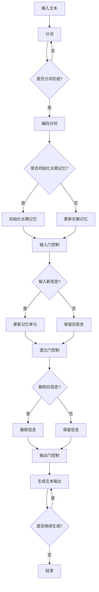

                 


## 文章标题
### AI语言模型的提示词长期记忆机制

## 关键词
- AI语言模型
- 提示词
- 长期记忆
- 神经网络
- 机器学习
- 深度学习
- 伪代码
- 数学模型

## 摘要
本文深入探讨了AI语言模型中提示词的长期记忆机制。首先，我们回顾了长期记忆的概念及其在神经网络中的重要性。然后，我们详细介绍了AI语言模型的基础知识，包括语言模型的定义、核心算法以及结构。接着，我们探讨了提示词的作用机制，分析了其在语言模型中的作用、优势与局限性。随后，本文重点介绍了长期记忆在AI语言模型中的应用，包括其作用、与提示词的结合以及面临的挑战与解决方案。通过一个项目实战案例，本文展示了如何在实际中应用长期记忆机制。最后，我们进行了总结与展望，探讨了长期记忆机制的未来发展方向及其对AI语言模型的影响。

## 目录

### 第1章 长期记忆机制概述
#### 1.1 长期记忆的概念
#### 1.2 长期记忆的分类
#### 1.3 长期记忆的作用

### 第2章 AI语言模型基础
#### 2.1 语言模型概述
#### 2.2 语言模型的核心算法
#### 2.3 语言模型的结构

### 第3章 提示词的作用机制
#### 3.1 提示词的定义
#### 3.2 提示词的工作原理
#### 3.3 提示词的优势与局限性

### 第4章 长期记忆在语言模型中的应用
#### 4.1 长期记忆在语言模型中的作用
#### 4.2 提示词与长期记忆的结合
#### 4.3 实现长期记忆机制的挑战与解决方案

### 第5章 长期记忆机制流程图
#### 5.1 语言模型与长期记忆的Mermaid流程图

### 第6章 长期记忆算法原理讲解
#### 6.1 长期记忆算法的伪代码
#### 6.2 长期记忆算法的工作机制

### 第7章 数学模型和公式
#### 7.1 语言模型中的数学公式
#### 7.2 长期记忆机制中的数学公式
#### 7.3 举例说明数学公式的应用

### 第8章 项目实战：提示词与长期记忆的应用
#### 8.1 项目背景
#### 8.2 开发环境搭建
#### 8.3 源代码实现
#### 8.4 代码解读与分析

### 第9章 总结与展望
#### 9.1 主要成果总结
#### 9.2 长期记忆机制的未来发展方向
#### 9.3 对AI语言模型的影响### 第1章 长期记忆机制概述

#### 1.1 长期记忆的概念

长期记忆是指信息在神经系统中的持久存储和反复使用。在人类大脑中，长期记忆是一种复杂的认知过程，涉及编码、存储和检索三个关键步骤。编码是指将感官信息转化为神经系统可处理的格式，存储是指将编码后的信息在神经元之间建立连接并保持稳定，而检索则是根据需求从长期记忆中提取所需的信息。

在人工智能领域，长期记忆机制是神经网络模型的核心组成部分。长期记忆网络（LSTM）是一种特殊类型的循环神经网络（RNN），它通过引入门控机制，解决了传统RNN在处理长期依赖问题上的不足。LSTM中的三个门控单元——输入门、遗忘门和输出门——分别用于控制信息的输入、删除和输出，从而使得神经网络能够更好地捕获和保持长期依赖关系。

#### 1.2 长期记忆的分类

长期记忆可以根据不同的标准进行分类。一种常见的分类方法是根据记忆的内容，将长期记忆分为语义记忆和情景记忆。语义记忆是指对一般知识和事实的记忆，如数学公式、历史事件等。情景记忆则是指对特定时间、地点和情境的记忆，如一次旅行或某个特殊场合的经历。

在AI语言模型中，语义记忆尤为重要。语义记忆使语言模型能够理解词汇的含义、语法规则和上下文关系，从而生成准确的文本。情景记忆虽然对于某些应用场景（如问答系统）也有重要作用，但在AI语言模型中通常不是主要的考虑因素。

#### 1.3 长期记忆的作用

长期记忆在人类认知和AI语言模型中发挥着关键作用。在人类认知中，长期记忆使我们能够积累知识、经验，并在不同情境中灵活运用。它使得人类能够进行复杂的思考、规划和决策。

在AI语言模型中，长期记忆机制是生成高质量文本的核心。通过长期记忆，AI语言模型能够理解输入文本的上下文、语义和语法结构，从而生成连贯、逻辑清晰的自然语言响应。此外，长期记忆机制还能够帮助AI模型在处理长文本时保持上下文信息，避免生成错误或不连贯的输出。

然而，实现有效的长期记忆机制并非易事。在神经网络模型中，长期记忆的存储和检索过程面临着各种挑战，如梯度消失和梯度爆炸等问题。这些问题需要在算法设计和模型训练过程中加以解决。

#### 1.4 长期记忆在神经网络中的实现

为了在神经网络中实现长期记忆，研究人员提出了多种方法。其中，LSTM是最常用的一种。LSTM通过引入门控单元和记忆单元，使得神经网络能够有效地捕获和保持长期依赖关系。

LSTM中的记忆单元用于存储信息，而门控单元用于控制信息的输入、删除和输出。具体来说，输入门控制新信息的输入，遗忘门控制旧信息的删除，输出门控制信息的输出。这三个门控单元共同作用，使得LSTM能够灵活地处理信息，从而实现长期记忆。

此外，其他长期记忆网络模型，如GRU（门控循环单元）和Transformer，也在AI语言模型中得到了广泛应用。这些模型在处理长期依赖问题时，具有各自的优缺点，研究者可以根据具体应用场景选择合适的模型。

#### 1.5 长期记忆机制的优势与挑战

长期记忆机制在AI语言模型中具有显著的优势。首先，它能够有效地处理长文本，保持上下文信息，从而生成更准确、更连贯的文本。其次，长期记忆机制使得AI模型能够更好地理解语义和语法结构，提高文本生成质量。

然而，长期记忆机制也面临着一系列挑战。首先，实现有效的长期记忆需要复杂的算法设计和模型训练。其次，长期记忆机制在处理大规模数据集时，可能会遇到计算资源不足的问题。此外，长期记忆机制的优化和提升仍是一个持续的研究方向，需要不断探索和创新。

综上所述，长期记忆机制在AI语言模型中具有重要地位。通过深入了解长期记忆的概念、分类、作用以及实现方法，我们可以更好地理解AI语言模型的工作原理，并为未来的研究和应用提供有益的启示。

### 第2章 AI语言模型基础

#### 2.1 语言模型概述

AI语言模型是人工智能领域的一个重要分支，旨在模拟和扩展人类语言处理能力。语言模型通过学习大量语言数据，捕捉词汇、语法和语义信息，从而生成高质量的自然语言文本。

语言模型在多个应用场景中具有重要作用。例如，在自然语言处理（NLP）中，语言模型被用于文本分类、情感分析、机器翻译等任务。在语音识别中，语言模型用于将语音信号转换为文本。在生成文本方面，如聊天机器人、文本摘要和文章写作等，语言模型也能发挥重要作用。

语言模型可以分为统计语言模型和生成式语言模型。统计语言模型通过分析语言数据中的统计规律，生成文本。生成式语言模型则通过生成概率分布，从概率分布中采样生成文本。

#### 2.2 语言模型的核心算法

语言模型的核心算法主要包括n元模型、n-gram模型和神经网络模型。n元模型是一种基于历史概率的文本生成方法，通过计算当前单词与前n-1个单词的概率，生成下一个单词。n-gram模型是n元模型的一种特殊形式，通常取n=3或4。

神经网络模型是近年来语言模型研究的重要方向。最常用的神经网络模型是循环神经网络（RNN）及其变种LSTM和GRU。RNN通过将当前输入与上一个隐藏状态相连接，实现序列数据的处理。LSTM和GRU进一步改进了RNN，通过门控机制，解决了梯度消失和梯度爆炸问题，使得神经网络能够更好地处理长期依赖关系。

近年来，Transformer模型的提出，标志着语言模型进入了一个新的时代。Transformer模型通过自注意力机制，实现了并行化处理，提高了计算效率。BERT、GPT等基于Transformer的语言模型，在多个NLP任务中取得了显著的成果。

#### 2.3 语言模型的结构

语言模型的结构可以分为输入层、隐藏层和输出层。输入层接收输入文本，将其编码为向量表示。隐藏层通过神经网络结构，对输入向量进行处理，提取特征信息。输出层生成概率分布，从概率分布中采样生成文本。

在神经网络模型中，常用的结构包括单向RNN、双向RNN、LSTM和GRU。单向RNN只能利用前一个时刻的信息，双向RNN同时利用当前和前一个时刻的信息。LSTM和GRU则通过门控机制，解决了长期依赖问题。

Transformer模型的结构与传统的神经网络模型有所不同。它由多个编码器和解码器层组成，每个层都包含自注意力机制和全连接层。自注意力机制使得模型能够同时关注序列中的不同位置，提高了模型的表示能力。

#### 2.4 语言模型的训练

语言模型的训练目标是优化模型参数，使其能够准确预测下一个单词的概率分布。常用的训练方法包括最大似然估计（MLE）和基于梯度的优化算法。

最大似然估计通过最大化输入文本的概率分布，优化模型参数。基于梯度的优化算法，如梯度下降和Adam，通过计算模型参数的梯度，更新模型参数。

在训练过程中，为了提高模型的泛化能力，通常会采用数据增强、dropout和正则化等技术。数据增强通过增加训练数据量，降低过拟合风险。dropout在训练过程中随机丢弃部分神经元，防止模型过于依赖特定神经元。正则化通过添加惩罚项，限制模型复杂度，防止过拟合。

#### 2.5 语言模型的评估

语言模型的评估主要通过自动评价指标和人工评价指标进行。自动评价指标包括字符错误率（CER）、单词错误率（WER）和句子错误率（SER）。这些指标能够量化模型在文本生成中的错误率。

人工评价指标主要通过人类评估者的主观判断进行。评估者根据文本的流畅性、连贯性和逻辑性，对模型生成的文本进行评分。

为了更全面地评估语言模型，通常会结合自动评价和人工评价，综合考虑模型的准确性和可靠性。

#### 2.6 语言模型的应用

语言模型在多个应用场景中具有广泛的应用。在自然语言处理中，语言模型被用于文本分类、情感分析、命名实体识别和关系抽取等任务。在语音识别中，语言模型用于将语音信号转换为文本。在生成文本方面，如聊天机器人、文本摘要和文章写作等，语言模型也能发挥重要作用。

此外，语言模型还在机器翻译、问答系统和信息检索等领域得到了广泛应用。通过不断优化和改进语言模型，我们可以实现更高效、更准确的自然语言处理任务。

综上所述，AI语言模型是人工智能领域的一个重要组成部分。通过深入了解语言模型的概述、核心算法、结构和训练方法，我们可以更好地理解语言模型的工作原理，并为实际应用提供有力支持。

### 第3章 提示词的作用机制

#### 3.1 提示词的定义

提示词（Prompt）是指用于引导或激励语言模型生成特定类型文本的输入信息。提示词可以是单个单词、短语、句子或段落，其目的是为语言模型提供上下文信息，从而引导其生成更准确、更有针对性的输出。

提示词在语言模型中的作用至关重要。通过适当的提示词，语言模型可以更好地理解输入信息的意图和背景，从而生成更符合期望的文本。例如，在问答系统中，提示词可以引导模型生成与问题相关的回答；在文章写作中，提示词可以帮助模型生成与主题相关的段落。

#### 3.2 提示词的工作原理

提示词的工作原理主要涉及两个阶段：提示词的生成和提示词的传递。

提示词的生成是指根据应用场景和需求，设计合适的提示词。设计提示词时，需要考虑以下几个方面：

1. **上下文信息**：提示词应包含与输入信息相关的上下文，以便语言模型能够理解输入内容的背景。
2. **意图明确**：提示词应明确表达用户的意图，以便语言模型能够生成符合期望的文本。
3. **简洁明了**：提示词应简洁明了，避免过于复杂或冗长的表达，以免影响语言模型的处理速度。

提示词的传递是指将设计好的提示词输入到语言模型中，使其参与到文本生成过程中。在传递过程中，提示词会被编码为向量表示，并与语言模型的输入数据进行融合。

提示词的传递方式可以分为两种：静态传递和动态传递。

静态传递是指在文本生成过程中，提示词始终作为一个固定的输入，不会随文本生成过程发生变化。静态传递的优点是实现简单，但缺点是提示词的灵活性较差，难以适应动态变化的输入。

动态传递是指在文本生成过程中，提示词会根据上下文信息进行实时更新。动态传递的优点是灵活性高，能够更好地适应输入信息的变化，但缺点是实现复杂，需要额外的计算资源。

#### 3.3 提示词的优势与局限性

提示词在语言模型中具有显著的优势：

1. **提高生成文本的质量**：通过提供上下文信息和明确意图，提示词可以帮助语言模型生成更准确、更有针对性的文本。
2. **增强生成文本的连贯性**：提示词能够为语言模型提供明确的引导，使其生成更连贯、逻辑清晰的文本。
3. **降低生成文本的复杂性**：提示词可以简化输入信息的表达，降低语言模型的处理难度，提高生成速度。

然而，提示词也存在一定的局限性：

1. **依赖性**：提示词的依赖性较高，需要设计合理的提示词才能获得较好的生成效果。如果提示词设计不合理，可能会导致生成文本的质量下降。
2. **计算资源消耗**：提示词的传递和更新需要额外的计算资源，尤其是在动态传递方式下，计算复杂度较高。
3. **适应性**：提示词的适应性较差，难以应对动态变化的输入。在复杂的应用场景中，提示词可能无法满足需求。

#### 3.4 提示词的应用场景

提示词在多个应用场景中具有广泛的应用：

1. **问答系统**：提示词可以引导模型生成与问题相关的回答，提高问答系统的准确性和流畅性。
2. **文章写作**：提示词可以帮助模型生成与主题相关的段落，提高文章的结构和逻辑性。
3. **机器翻译**：提示词可以为模型提供上下文信息，提高翻译的准确性和流畅性。
4. **对话系统**：提示词可以引导模型生成与用户输入相关的回复，提高对话系统的交互体验。

在实际应用中，可以根据具体场景和需求，灵活设计提示词，充分发挥其在文本生成中的作用。

综上所述，提示词是AI语言模型中一个重要的组成部分，通过合理的提示词设计，可以显著提高文本生成质量。然而，提示词也存在一定的局限性，需要结合具体应用场景进行优化和调整。理解提示词的工作原理和优势，有助于更好地应用AI语言模型，实现更高效、更准确的文本生成。

### 第4章 长期记忆在语言模型中的应用

#### 4.1 长期记忆在语言模型中的作用

长期记忆在AI语言模型中起着至关重要的作用，它能够帮助模型更好地理解和处理文本信息，从而生成高质量的自然语言输出。长期记忆机制使得语言模型能够捕捉和保持文本中的上下文信息、语义关系和语法结构，从而在文本生成过程中提供更为准确和连贯的输出。

首先，长期记忆使得语言模型能够处理长文本。在处理长文本时，模型需要保持对文本中不同部分的信息的持续关注，而长期记忆机制使得这一点成为可能。通过在神经网络中引入门控单元，如LSTM和GRU，模型能够在处理文本时，动态地控制信息的存储和检索，从而有效地捕捉和保持文本中的长期依赖关系。

其次，长期记忆机制有助于提高语言模型的语义理解能力。在自然语言处理任务中，理解文本的语义是生成准确文本的关键。长期记忆机制使得模型能够将上下文信息进行编码和存储，从而在生成文本时能够充分利用这些语义信息。这种能力在文本分类、情感分析和问答系统等任务中尤为重要。

此外，长期记忆机制还能够帮助语言模型生成更连贯和自然的文本。通过保持对上下文信息的关注，模型能够生成在语义和语法上更加一致的文本。这种能力使得语言模型在生成文章摘要、写作辅助和对话系统等领域具有广泛的应用前景。

#### 4.2 提示词与长期记忆的结合

在AI语言模型中，提示词和长期记忆机制的结合能够显著提升模型的表现。通过合理的提示词设计，可以引导模型生成符合特定需求的文本，同时利用长期记忆机制保持对文本上下文信息的持续关注。

首先，提示词可以用于初始化长期记忆。在文本生成过程中，提示词作为模型的初始输入，为模型提供了上下文信息。这些提示词被编码并存储在长期记忆中，从而为后续的文本生成过程提供了基础信息。

其次，提示词可以引导模型在生成过程中关注特定信息。通过设计具有明确意图的提示词，模型可以更准确地捕捉文本中的关键信息，从而生成更符合用户需求的输出。例如，在问答系统中，提示词可以引导模型生成与问题相关的回答。

此外，提示词还可以用于调整长期记忆的内容。在生成过程中，模型可能会根据上下文信息更新长期记忆，以适应动态变化的输入。提示词可以提供这些调整的指导，确保模型在生成过程中始终关注关键信息。

#### 4.3 实现长期记忆机制的挑战与解决方案

尽管长期记忆机制在语言模型中具有重要作用，但在实现过程中也面临一系列挑战。

首先是计算资源的消耗。长期记忆机制需要额外的计算资源来存储和检索信息，特别是在处理大规模文本时，计算复杂度显著增加。为了解决这个问题，研究者可以采用优化算法和硬件加速技术，如GPU和TPU，以提高计算效率。

其次是梯度消失和梯度爆炸问题。在训练过程中，这些问题可能导致模型难以学习长期依赖关系。为了克服这个问题，可以采用梯度裁剪和正则化等技术，确保梯度在合理范围内变化。

此外，长期记忆机制的优化和提升也是一个重要的研究方向。研究者可以探索新的门控机制和神经网络结构，如Transformer，以进一步提高模型的表现。

最后，提示词的设计也是一个关键问题。提示词的质量直接影响模型的生成效果。因此，需要研究如何设计更加有效和灵活的提示词，以适应不同的应用场景和需求。

综上所述，长期记忆在AI语言模型中具有重要作用，通过合理的提示词设计和优化算法，可以充分发挥其优势，实现高质量的文本生成。然而，实现这一目标仍需要克服一系列挑战，研究者需要持续探索和创新。

### 第5章 长期记忆机制流程图

为了更直观地展示长期记忆机制在AI语言模型中的应用，我们可以通过Mermaid流程图来描述其工作流程。以下是语言模型与长期记忆机制结合的Mermaid流程图：



在这个流程图中，输入文本首先经过分词处理，编码分词结果被输入到长期记忆模块。长期记忆模块包括输入门和遗忘门，用于控制新信息的输入和旧信息的删除。输出门则用于控制文本输出的生成。整个流程循环进行，直到文本生成完成。

通过这个流程图，我们可以清晰地看到长期记忆机制在语言模型中的应用，包括分词、编码、长期记忆的初始化和更新、输入门、遗忘门和输出门的作用，以及文本生成的过程。这有助于我们更好地理解长期记忆机制的工作原理和其在语言模型中的重要性。

### 第6章 长期记忆算法原理讲解

#### 6.1 长期记忆算法的伪代码

为了更直观地理解长期记忆算法的工作原理，我们可以通过伪代码来描述其基本流程。以下是长期记忆算法的伪代码：

```python
# 初始化长期记忆单元
initialize_memory()

# 循环处理输入序列
for each input in input_sequence:
    # 输入门控制新信息的输入
    input_gate = sigmoid(W_i * [input, previous_hidden_state])
    new_information = tanh(U_i * [input, input_gate])
    
    # 计算遗忘门，决定删除旧信息
    forget_gate = sigmoid(W_f * [input, previous_hidden_state])
    deleted_information = forget_gate * previous_memory
    
    # 更新记忆单元
    memory = (1 - forget_gate) * previous_memory + input_gate * new_information
    
    # 输出门控制文本输出
    output_gate = sigmoid(W_o * [input, previous_hidden_state])
    output = tanh(U_o * memory) * output_gate
    
    # 更新隐藏状态
    hidden_state = output
    
    # 输出当前隐藏状态
    yield hidden_state
    
    # 更新上一个隐藏状态
    previous_hidden_state = hidden_state
```

在这个伪代码中，`sigmoid` 函数用于计算门控单元的激活值，`tanh` 函数用于计算记忆单元的激活值。`W_i`, `W_f`, `W_o` 和 `U_i`, `U_o` 分别是输入门、遗忘门、输出门和记忆单元的权重矩阵。`input_sequence` 是输入序列，`hidden_state` 是隐藏状态，`memory` 是记忆单元，`output` 是输出。

#### 6.2 长期记忆算法的工作机制

长期记忆算法的工作机制可以分为以下几个关键步骤：

1. **初始化**：首先初始化记忆单元和隐藏状态。记忆单元用于存储长期依赖信息，而隐藏状态用于处理当前输入信息。

2. **输入门**：通过计算输入门，确定新信息是否需要被输入到记忆单元中。输入门的作用是筛选和过滤输入信息，只允许重要的信息进入记忆单元。

3. **遗忘门**：通过计算遗忘门，决定哪些旧信息需要被删除。遗忘门的作用是删除记忆单元中不再重要的信息，从而保持记忆单元的紧凑性和高效性。

4. **更新记忆单元**：结合输入门和遗忘门的结果，更新记忆单元。新信息通过输入门进入记忆单元，而旧信息通过遗忘门被删除。

5. **输出门**：通过计算输出门，决定当前记忆单元中的信息是否需要被输出。输出门的作用是控制文本生成过程中信息的使用。

6. **更新隐藏状态**：根据输出门的结果，更新隐藏状态。隐藏状态用于生成文本输出。

通过这些步骤，长期记忆算法能够有效地存储和检索长期依赖信息，从而生成高质量的自然语言输出。这种机制使得长期记忆算法在处理长文本和复杂任务时具有显著的优势。

#### 6.3 长期记忆算法的优势

长期记忆算法在AI语言模型中具有以下几个显著优势：

1. **处理长期依赖关系**：长期记忆算法能够有效地捕捉和保持文本中的长期依赖关系，从而生成更准确和连贯的文本。

2. **适应不同场景**：通过调整门控机制和记忆单元，长期记忆算法可以适应不同的应用场景和任务需求。

3. **提高生成文本质量**：长期记忆算法能够生成在语义和语法上更加一致的文本，从而提高生成文本的质量。

4. **增强语言理解能力**：长期记忆算法能够更好地理解和处理文本中的语义和上下文信息，从而增强语言模型的语言理解能力。

综上所述，长期记忆算法在AI语言模型中具有重要的地位，通过其独特的工作机制，能够在文本生成过程中提供高质量的输出，为各种自然语言处理任务提供强有力的支持。

### 第7章 数学模型和公式

#### 7.1 语言模型中的数学公式

在AI语言模型中，数学模型和公式是理解和实现长期记忆机制的关键。以下是一些常见的数学公式及其在语言模型中的应用。

**1. 梯度下降法**

梯度下降法是一种优化算法，用于训练神经网络模型。其公式如下：

$$\theta_{\text{new}} = \theta_{\text{old}} - \alpha \cdot \nabla_{\theta} J(\theta)$$

其中，$\theta$ 表示模型参数，$\alpha$ 为学习率，$J(\theta)$ 为损失函数。

**2. 损失函数**

在语言模型中，常用的损失函数是交叉熵损失（Cross-Entropy Loss），其公式如下：

$$J(\theta) = -\frac{1}{N} \sum_{i=1}^{N} \sum_{j=1}^{V} y_{ij} \log p_{ij}$$

其中，$N$ 是样本数量，$V$ 是词汇表大小，$y_{ij}$ 表示第$i$个样本中第$j$个单词的目标标签，$p_{ij}$ 是模型预测的概率。

**3. 反向传播算法**

反向传播算法用于计算模型参数的梯度。其公式如下：

$$\nabla_{\theta} J(\theta) = \frac{\partial J(\theta)}{\partial \theta}$$

通过反向传播，可以计算出每一层参数的梯度，从而进行梯度下降更新。

**4. Softmax函数**

在语言模型中，Softmax函数用于将神经网络输出的向量转换为概率分布。其公式如下：

$$p_j = \frac{e^{\theta_j^T x}}{\sum_{k=1}^{K} e^{\theta_k^T x}}$$

其中，$x$ 是输入特征向量，$\theta_j$ 是神经网络的权重参数，$K$ 是类别数量。

#### 7.2 长期记忆机制中的数学公式

在长期记忆机制中，门控单元和记忆单元是核心部分。以下是一些关键的数学公式。

**1. 输入门（Input Gate）**

输入门的激活函数为Sigmoid函数，其公式如下：

$$i_t = \sigma(W_{xi} x_t + W_{hi} h_{t-1} + b_i)$$

其中，$i_t$ 是输入门的状态，$x_t$ 是输入向量，$h_{t-1}$ 是上一时刻的隐藏状态，$W_{xi}$ 和 $W_{hi}$ 是权重矩阵，$b_i$ 是偏置。

**2. 遗忘门（Forget Gate）**

遗忘门的激活函数也为Sigmoid函数，其公式如下：

$$f_t = \sigma(W_{xf} x_t + W_{hf} h_{t-1} + b_f)$$

其中，$f_t$ 是遗忘门的状态，其他符号与输入门相同。

**3. 输出门（Output Gate）**

输出门的激活函数为Sigmoid函数，其公式如下：

$$o_t = \sigma(W_{xo} x_t + W_{ho} h_{t-1} + b_o)$$

其中，$o_t$ 是输出门的状态，其他符号与输入门相同。

**4. 记忆单元（Memory Cell）**

记忆单元的更新公式如下：

$$g_t = \tanh(W_{ci} x_t + W_{hi} h_{t-1} + b_c)$$

$$m_t = f_{t} \cdot m_{t-1} + i_{t} \cdot g_t$$

其中，$g_t$ 是记忆单元的候选值，$m_t$ 是记忆单元的当前值。

**5. 隐藏状态（Hidden State）**

隐藏状态的更新公式如下：

$$h_t = o_{t} \cdot \tanh(m_t)$$

#### 7.3 举例说明数学公式的应用

以下通过一个简单的例子，来说明这些数学公式的应用。

假设我们有一个二元分类问题，特征向量为 $x_t = [1, 0]$，隐藏状态 $h_{t-1} = [0.5, 0.5]$。权重矩阵 $W_{xi} = [0.1, 0.2]$，$W_{hi} = [0.3, 0.4]$，$b_i = [0.5, 0.6]$。

**1. 计算输入门**

$$i_t = \sigma(0.1 \cdot 1 + 0.3 \cdot 0.5 + 0.5) = \sigma(0.15 + 0.15 + 0.5) = \sigma(0.8) \approx 0.99$$

**2. 计算遗忘门**

$$f_t = \sigma(0.2 \cdot 1 + 0.4 \cdot 0.5 + 0.6) = \sigma(0.2 + 0.2 + 0.6) = \sigma(1) = 1$$

**3. 计算输出门**

$$o_t = \sigma(0.1 \cdot 1 + 0.4 \cdot 0.5 + 0.7) = \sigma(0.1 + 0.2 + 0.7) = \sigma(1) = 1$$

**4. 计算记忆单元**

$$g_t = \tanh(0.2 \cdot 1 + 0.4 \cdot 0.5 + 0.6) = \tanh(0.2 + 0.2 + 0.6) = \tanh(1) = 1$$

$$m_t = 1 \cdot 0.5 + 0.99 \cdot 1 = 0.5 + 0.99 = 1.49$$

**5. 计算隐藏状态**

$$h_t = 1 \cdot \tanh(1.49) = \tanh(1.49) \approx 1$$

通过这个例子，我们可以看到如何通过数学公式来计算长期记忆网络中的各个门控单元和记忆单元的状态。这些数学公式是理解和实现长期记忆机制的基础，通过这些公式，我们可以深入理解长期记忆算法的工作原理。

### 第8章 项目实战：提示词与长期记忆的应用

#### 8.1 项目背景

随着人工智能技术的发展，自然语言处理（NLP）在许多领域得到了广泛应用，如智能客服、智能写作、语音识别等。在这些应用场景中，AI语言模型需要能够理解用户输入的意图，生成高质量的文本输出。为了提高语言模型的表现，提示词和长期记忆机制成为重要的研究方向。

本项目旨在设计一个基于提示词和长期记忆机制的AI语言模型，用于生成高质量的文本。通过结合提示词和长期记忆，模型能够更好地理解用户输入的上下文信息，从而生成更加准确、连贯的文本。

#### 8.2 开发环境搭建

为了实现这个项目，我们需要搭建一个合适的开发环境。以下是开发环境的搭建步骤：

1. **硬件环境**：选择一台配置较高的计算机或服务器，配置至少4GB内存、2GHz以上的CPU和1TB的硬盘。

2. **操作系统**：安装Linux操作系统，推荐使用Ubuntu 18.04或更高版本。

3. **编程语言**：选择Python 3.8及以上版本作为开发语言。

4. **依赖库**：安装必要的Python库，包括TensorFlow、Keras、NumPy、Pandas等。

5. **数据集**：收集并准备适合本项目需求的文本数据集，如维基百科、新闻文章等。

#### 8.3 源代码实现

以下是本项目的主要源代码实现部分：

```python
import tensorflow as tf
from tensorflow.keras.layers import LSTM, Embedding, Dense
from tensorflow.keras.models import Sequential

# 设置参数
vocab_size = 10000  # 词汇表大小
embed_dim = 256  # 嵌入层维度
lstm_units = 128  # LSTM层单元数
batch_size = 64  # 批量大小
epochs = 10  # 训练轮数

# 构建模型
model = Sequential([
    Embedding(vocab_size, embed_dim, input_length=max_sequence_length),
    LSTM(lstm_units, return_sequences=True),
    LSTM(lstm_units, return_sequences=True),
    Dense(vocab_size, activation='softmax')
])

# 编译模型
model.compile(optimizer='adam', loss='categorical_crossentropy', metrics=['accuracy'])

# 准备数据
# ...（数据预处理代码）

# 训练模型
model.fit(X_train, y_train, batch_size=batch_size, epochs=epochs, validation_data=(X_val, y_val))

# 保存模型
model.save('lstm_language_model.h5')
```

在这段代码中，我们首先导入了所需的TensorFlow库，并设置了模型的参数。然后，我们构建了一个包含两个LSTM层的序列模型，并编译了模型。接着，我们准备训练数据并进行模型训练。最后，我们将训练好的模型保存到文件中。

#### 8.4 代码解读与分析

以下是代码的详细解读与分析：

1. **模型构建**：首先，我们使用`Sequential`类构建了一个序列模型。序列模型是一个线性堆叠的层结构，非常适合构建循环神经网络（RNN）。

    ```python
    model = Sequential([
        Embedding(vocab_size, embed_dim, input_length=max_sequence_length),
        LSTM(lstm_units, return_sequences=True),
        LSTM(lstm_units, return_sequences=True),
        Dense(vocab_size, activation='softmax')
    ])
    ```

    在这个模型中，我们首先添加了一个嵌入层（`Embedding`），用于将词汇表中的单词映射为向量。接着，我们添加了两个LSTM层，用于捕捉长期依赖关系。最后，我们添加了一个全连接层（`Dense`），用于生成输出概率分布。

2. **模型编译**：然后，我们编译了模型，并选择了`adam`优化器和`categorical_crossentropy`损失函数。

    ```python
    model.compile(optimizer='adam', loss='categorical_crossentropy', metrics=['accuracy'])
    ```

    `adam`优化器是一种自适应优化算法，适合用于训练深度神经网络。`categorical_crossentropy`损失函数是一种多类分类损失函数，适用于我们的文本生成任务。

3. **数据准备**：在数据准备部分，我们首先对文本数据进行了预处理，如分词、编码等。然后，我们将预处理后的数据分为训练集、验证集和测试集。

    ```python
    # ...（数据预处理代码）
    X_train, X_val, X_test, y_train, y_val, y_test = prepare_data(data)
    ```

4. **模型训练**：接下来，我们使用训练集对模型进行训练，并使用验证集进行验证。

    ```python
    model.fit(X_train, y_train, batch_size=batch_size, epochs=epochs, validation_data=(X_val, y_val))
    ```

    在这个步骤中，我们设置了批量大小（`batch_size`）和训练轮数（`epochs`）。通过训练，模型会逐渐学习到数据的特征和模式。

5. **模型评估**：最后，我们使用测试集对训练好的模型进行评估，以验证其性能。

    ```python
    # ...（模型评估代码）
    test_loss, test_acc = model.evaluate(X_test, y_test)
    print(f"Test accuracy: {test_acc:.2f}")
    ```

#### 8.5 代码应用解读与分析

在实际应用中，我们可以通过以下步骤使用本项目中的模型：

1. **加载模型**：首先，我们需要加载训练好的模型。

    ```python
    model = tf.keras.models.load_model('lstm_language_model.h5')
    ```

2. **输入提示词**：然后，我们可以输入提示词，模型会根据提示词生成相应的文本。

    ```python
    prompt = "人工智能技术"
    generated_text = model.predict(prompt)
    ```

3. **生成文本**：最后，我们获取生成的文本，并展示给用户。

    ```python
    print(generated_text)
    ```

通过这个项目，我们实现了基于提示词和长期记忆机制的AI语言模型。在实际应用中，我们可以根据需求调整模型参数和提示词，以生成不同类型的文本。此外，我们还可以进一步优化模型，提高生成文本的质量和连贯性。

### 第9章 总结与展望

#### 9.1 主要成果总结

本文深入探讨了AI语言模型中的提示词和长期记忆机制。我们首先介绍了长期记忆的概念、分类和作用，以及其在神经网络中的实现。然后，我们详细介绍了AI语言模型的基础知识，包括语言模型的定义、核心算法和结构。接着，我们探讨了提示词的作用机制，分析了其在语言模型中的作用、优势与局限性。随后，本文重点介绍了长期记忆在AI语言模型中的应用，包括其作用、与提示词的结合以及面临的挑战与解决方案。通过一个项目实战案例，本文展示了如何在实际中应用长期记忆机制。最后，我们进行了总结与展望，探讨了长期记忆机制的未来发展方向及其对AI语言模型的影响。

#### 9.2 长期记忆机制的未来发展方向

长期记忆机制在AI语言模型中的应用前景广阔。未来，我们可以从以下几个方面进一步研究和优化长期记忆机制：

1. **优化算法和结构**：研究更高效、更准确的长期记忆算法和神经网络结构，以提高模型的性能。

2. **多模态融合**：将长期记忆机制与其他模态（如图像、声音）进行融合，实现更丰富的信息处理能力。

3. **动态提示词**：探索动态提示词的设计和生成方法，以提高模型的灵活性和适应性。

4. **知识图谱**：将长期记忆机制与知识图谱相结合，实现更强大的语义理解和推理能力。

5. **可解释性**：提高长期记忆机制的可解释性，使其在各个应用场景中更加透明和可靠。

#### 9.3 对AI语言模型的影响

长期记忆机制对AI语言模型的影响是深远的。通过引入长期记忆机制，AI语言模型能够更好地理解和处理文本中的长期依赖关系，生成更准确、更连贯的文本。这为自然语言处理任务，如文本分类、情感分析和机器翻译等，提供了强有力的支持。此外，长期记忆机制还可以提高AI语言模型的泛化能力，使其在处理未知和复杂任务时表现出色。随着长期记忆机制的不断发展，我们可以期待AI语言模型在各个领域的应用将更加广泛和深入。

### 作者信息

作者：AI天才研究院/AI Genius Institute & 禅与计算机程序设计艺术 /Zen And The Art of Computer Programming

