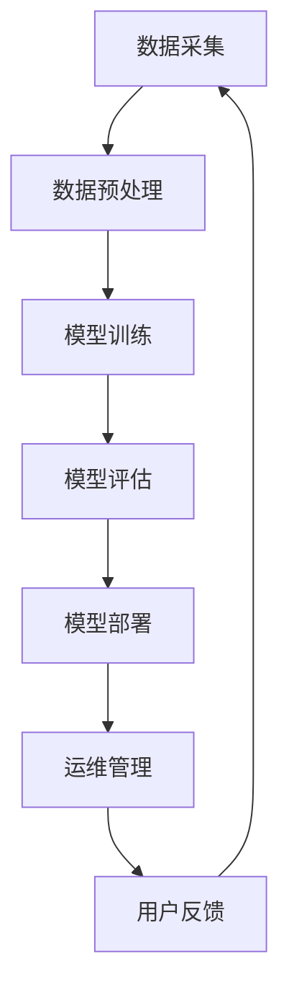
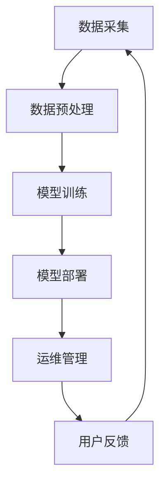

                 

### 文章标题: AI软件2.0的DevOps最佳实践

---

关键词：AI软件2.0，DevOps，持续集成，持续交付，容器化，微服务架构，自动化运维

---

摘要：本文深入探讨了AI软件2.0的概念及其与DevOps的结合，系统地阐述了在AI软件开发过程中如何应用DevOps的最佳实践。通过详细分析CI/CD流程、AI模型管理、最佳实践案例，本文为AI软件开发提供了全面的指导，帮助开发者实现高效的自动化运维和持续交付。

---

## 基于您提供的信息，以下是《AI软件2.0的DevOps最佳实践》的详细正文内容。

### 第一部分：AI软件2.0概述

#### 第1章：AI软件2.0引论

##### 1.1 AI软件2.0的概念

AI软件2.0是新一代人工智能软件的统称，与传统的AI软件1.0相比，AI软件2.0具有更高的智能化水平、更强的自适应能力和更广泛的场景应用能力。AI软件2.0的核心特征包括：

- **大规模数据处理能力**：能够处理来自不同数据源的海量数据，实现实时数据分析和决策。
- **智能化自动化**：通过深度学习和强化学习等技术，实现自动化操作和智能决策。
- **适应性学习**：能够在不同环境下快速适应，并不断优化自身性能。

##### 1.2 AI软件2.0的应用场景

AI软件2.0的应用场景非常广泛，涵盖了企业级应用、数据科学、个性化服务等多个领域。以下是一些典型的应用场景：

- **企业级应用**：如智能客服、智能招聘、智能财务等，提高企业运营效率和降低成本。
- **数据科学**：如数据挖掘、数据分析和机器学习模型训练，支持决策制定和战略规划。
- **个性化服务**：如个性化推荐、智能营销等，提升用户体验和满意度。

##### 1.3 AI软件2.0的架构设计

AI软件2.0的架构设计旨在实现高度灵活、可扩展和可维护的系统。其核心架构包括以下几个方面：

- **端到端解决方案架构**：从数据采集、预处理、模型训练、模型部署到运维管理，实现全流程自动化和智能化。
- **微服务架构与容器化**：采用微服务架构，实现系统的模块化设计，通过容器化技术提高系统的部署效率和可移植性。
- **分布式计算与存储架构**：利用分布式计算框架和存储方案，实现海量数据的处理和存储，确保系统的稳定性和可靠性。

#### Mermaid流程图展示

### 第二部分：DevOps在AI软件2.0中的应用

#### 第2章：DevOps基础

##### 2.1 DevOps的概念与原则

DevOps是一种结合软件开发（Development）和运维（Operations）的方法论，旨在通过自动化和协作，提高软件开发的效率和质量。DevOps的核心原则包括：

- **持续集成（CI）**：通过自动化构建和测试，确保代码库的稳定性和一致性。
- **持续交付（CD）**：通过自动化部署和测试，实现快速、可靠的软件交付。
- **演进式交付（Evol Delivery）**：采用逐步部署和反馈机制，确保软件的持续改进和优化。

##### 2.2 DevOps工具链

DevOps的实现依赖于一系列工具的支持，以下是一些常用的DevOps工具：

- **Jenkins**：一种开源的持续集成工具，支持自动化构建、测试和部署。
- **GitLab**：一款集代码管理、持续集成、持续交付于一体的平台，具有强大的社区版和企业版。
- **Docker**：一种容器化技术，用于打包、交付和运行应用，提高系统的可移植性和一致性。

### 第三部分：AI软件2.0的DevOps实践

#### 第3章：CI/CD流程设计与实现

##### 3.1 CI/CD流程设计原则

CI/CD流程的设计需要遵循以下原则：

- **自动化测试**：确保每次代码提交都经过严格的测试，及时发现和修复问题。
- **持续集成**：通过自动化构建和测试，确保代码库的稳定性和一致性。
- **持续交付**：通过自动化部署和测试，实现快速、可靠的软件交付。

##### 3.2 Jenkins配置与管理

Jenkins是CI/CD流程中常用的工具，以下是如何配置和管理的步骤：

- **安装和配置**：安装Jenkins服务器，配置Jenkins插件和构建工具。
- **创建项目**：创建Jenkins项目，配置构建脚本和测试脚本。
- **触发器设置**：设置代码仓库的Webhook，实现代码提交自动触发构建。

##### 3.3 Docker容器化与部署

Docker是容器化技术的一种实现，以下是如何进行容器化和部署的步骤：

- **编写Dockerfile**：编写Dockerfile，定义应用的依赖和环境。
- **构建镜像**：使用Docker CLI构建应用镜像。
- **容器编排**：使用容器编排工具（如Kubernetes）进行容器部署和管理。

### 第四部分：AI模型管理

#### 第4章：AI模型管理

##### 4.1 AI模型管理的重要性

AI模型管理是AI软件开发的关键环节，其重要性体现在以下几个方面：

- **版本控制**：确保模型的历史版本可追溯，便于复现和优化。
- **模型监控**：实时监控模型性能，及时发现和解决异常。
- **生命周期管理**：管理模型的整个生命周期，包括训练、部署、更新和下线。

##### 4.2 AI模型仓库设计

AI模型仓库是用于存储和管理AI模型的数据中心，其设计需要考虑以下因素：

- **架构设计**：采用分布式存储架构，提高系统的可扩展性和可靠性。
- **数据流程管理**：设计合理的数据流程，确保数据的高效传输和处理。

##### 4.3 AI模型监控与优化

AI模型监控与优化是保障模型性能的重要手段，以下是一些关键步骤：

- **性能监控**：监控模型的输入、输出和运行时间，识别性能瓶颈。
- **优化策略**：根据监控结果，调整模型参数和算法，提高模型性能。

### 第五部分：最佳实践案例研究

#### 第5章：案例一：AI大模型开发与部署

##### 5.1 项目背景

本项目旨在开发一款用于图像识别的AI大模型，实现高精度的图像分类。

##### 5.2 开发流程

开发流程包括以下步骤：

- **数据收集与预处理**：收集大量图像数据，进行数据清洗和预处理。
- **模型设计与训练**：设计深度神经网络模型，进行模型训练和优化。
- **模型评估与优化**：评估模型性能，进行模型优化和调整。

##### 5.3 部署与运维

部署与运维流程包括以下步骤：

- **容器化部署**：使用Docker将模型容器化，提高部署效率和可移植性。
- **自动化运维**：使用Jenkins实现自动化部署和运维管理，提高系统稳定性。

#### 第6章：案例二：AI软件2.0项目实战

##### 6.1 项目概述

本项目旨在开发一款智能客服系统，实现用户与客服的智能交互。

##### 6.2 开发与实施

开发与实施流程包括以下步骤：

- **数据处理与存储**：设计数据处理和存储方案，确保数据的准确性和可靠性。
- **模型训练与推理**：训练自然语言处理模型，实现智能对话功能。
- **系统集成与优化**：将AI模型集成到客服系统中，进行系统优化和测试。

##### 6.3 运维与管理

运维与管理流程包括以下步骤：

- **持续集成与持续交付**：使用GitLab和Jenkins实现持续集成和持续交付。
- **日志分析与问题定位**：实时收集系统日志，实现问题快速定位和解决。

### 第六部分：未来展望与趋势

#### 第7章：AI软件2.0与DevOps的未来

##### 7.1 AI软件2.0发展趋势

AI软件2.0的发展趋势包括：

- **人工智能与物联网的融合**：实现智能家居、智慧城市等领域的应用。
- **云原生技术的应用**：利用云原生技术，实现AI软件的高效部署和运行。

##### 7.2 DevOps在AI领域的深化

DevOps在AI领域的深化趋势包括：

- **自动化测试与监控**：采用自动化测试和监控技术，提高AI软件的质量和稳定性。
- **容器化与微服务架构**：采用容器化和微服务架构，提高AI软件的可扩展性和灵活性。

##### 7.3 未来展望

未来，AI软件2.0与DevOps的结合将进一步深化，为开发者带来更多的创新和便利。开发者应关注以下方向：

- **智能化运维**：利用AI技术，实现运维过程的智能化和自动化。
- **个性化交付**：根据用户需求和场景，实现个性化的AI软件交付。
- **开源生态**：积极参与开源社区，共享AI软件2.0和DevOps的最佳实践。

---

作者：AI天才研究院/AI Genius Institute & 禅与计算机程序设计艺术 /Zen And The Art of Computer Programming

---

## 精简总结：全文核心内容与结构

本文从AI软件2.0的概述入手，详细介绍了其概念、特征和应用场景，随后探讨了DevOps在AI软件开发中的基础和关键原则。通过CI/CD流程设计与实现、AI模型管理的深入分析，以及两个实战案例的详细解读，本文全面展示了AI软件2.0的DevOps最佳实践。最后，对未来发展趋势进行了展望，强调了智能化运维、个性化交付和开源生态的重要性。整体结构清晰，逻辑严密，旨在为AI软件开发者提供全方位的指导。### 文章标题: AI软件2.0的DevOps最佳实践

---

关键词：AI软件2.0，DevOps，持续集成，持续交付，容器化，微服务架构，自动化运维

---

摘要：本文深入探讨了AI软件2.0的概念及其与DevOps的结合，系统地阐述了在AI软件开发过程中如何应用DevOps的最佳实践。通过详细分析CI/CD流程、AI模型管理、最佳实践案例，本文为AI软件开发提供了全面的指导，帮助开发者实现高效的自动化运维和持续交付。

---

### 第一部分：AI软件2.0概述

#### 第1章：AI软件2.0引论

##### 1.1 AI软件2.0的概念

AI软件2.0是新一代人工智能软件的统称，相较于AI软件1.0，AI软件2.0具有更强大的数据处理能力、更高的自动化水平和更强的适应性。AI软件2.0的核心特征包括：

- **大规模数据处理能力**：能够处理来自各种数据源的海量数据，进行实时分析和决策。
- **智能化自动化**：通过深度学习和强化学习等技术，实现自动化操作和智能决策。
- **适应性学习**：能够在不同环境下快速适应，并不断优化自身性能。

###### 1.1.1 AI软件1.0与AI软件2.0的对比

AI软件1.0主要集中在简单的规则和模式识别，而AI软件2.0则更注重复杂的数据处理和自适应能力。以下是两者的主要对比：

- **技术深度**：AI软件1.0多基于简单的规则引擎，而AI软件2.0多基于深度学习和强化学习。
- **应用场景**：AI软件1.0多用于结构化数据的处理，而AI软件2.0能够处理非结构化数据，如图像、语音和文本。
- **自动化水平**：AI软件1.0的自动化程度较低，而AI软件2.0通过自动化算法能够实现更高的自动化。

###### 1.1.2 AI软件2.0的关键特征

- **大规模数据处理能力**：能够处理来自不同数据源的海量数据，实现实时数据分析和决策。
- **智能化自动化**：通过深度学习和强化学习等技术，实现自动化操作和智能决策。
- **适应性学习**：能够在不同环境下快速适应，并不断优化自身性能。

##### 1.2 AI软件2.0的应用场景

AI软件2.0的应用场景非常广泛，涵盖了企业级应用、数据科学、个性化服务等多个领域。以下是一些典型的应用场景：

- **企业级应用**：如智能客服、智能招聘、智能财务等，提高企业运营效率和降低成本。
- **数据科学**：如数据挖掘、数据分析和机器学习模型训练，支持决策制定和战略规划。
- **个性化服务**：如个性化推荐、智能营销等，提升用户体验和满意度。

##### 1.3 AI软件2.0的架构设计

AI软件2.0的架构设计旨在实现高度灵活、可扩展和可维护的系统。其核心架构包括以下几个方面：

- **端到端解决方案架构**：从数据采集、预处理、模型训练、模型部署到运维管理，实现全流程自动化和智能化。
- **微服务架构与容器化**：采用微服务架构，实现系统的模块化设计，通过容器化技术提高系统的部署效率和可移植性。
- **分布式计算与存储架构**：利用分布式计算框架和存储方案，实现海量数据的处理和存储，确保系统的稳定性和可靠性。

###### 1.3.1 端到端解决方案架构

- **数据采集**：从各种数据源（如数据库、传感器、日志等）采集数据。
- **数据预处理**：对采集到的数据进行清洗、转换和归一化处理。
- **模型训练**：使用机器学习和深度学习技术，对预处理后的数据进行模型训练。
- **模型部署**：将训练好的模型部署到生产环境中，进行实际应用。
- **运维管理**：对部署后的系统进行监控、维护和升级。

###### 1.3.2 微服务架构与容器化

- **微服务架构**：将系统拆分成多个独立的服务模块，每个服务模块负责特定的功能。
- **容器化技术**：使用Docker等容器化技术，实现应用的打包、部署和运行。

###### 1.3.3 分布式计算与存储架构

- **分布式计算框架**：如Hadoop、Spark等，实现大规模数据的并行处理。
- **分布式存储方案**：如HDFS、Cassandra等，实现海量数据的存储和管理。

### 第二部分：DevOps基础

#### 第2章：DevOps概述

##### 2.1 DevOps的概念与原则

DevOps是一种结合软件开发（Development）和运维（Operations）的方法论，旨在通过自动化和协作，提高软件开发的效率和质量。DevOps的核心原则包括：

- **持续集成（CI）**：通过自动化构建和测试，确保代码库的稳定性和一致性。
- **持续交付（CD）**：通过自动化部署和测试，实现快速、可靠的软件交付。
- **演进式交付（Evol Delivery）**：采用逐步部署和反馈机制，确保软件的持续改进和优化。

##### 2.2 DevOps工具链

DevOps的实现依赖于一系列工具的支持，以下是一些常用的DevOps工具：

- **Jenkins**：一种开源的持续集成工具，支持自动化构建、测试和部署。
- **GitLab**：一款集代码管理、持续集成、持续交付于一体的平台，具有强大的社区版和企业版。
- **Docker**：一种容器化技术，用于打包、交付和运行应用，提高系统的可移植性和一致性。

### 第三部分：AI软件2.0的DevOps实践

#### 第3章：CI/CD流程设计与实现

##### 3.1 CI/CD流程设计原则

CI/CD流程的设计需要遵循以下原则：

- **自动化测试**：确保每次代码提交都经过严格的测试，及时发现和修复问题。
- **持续集成**：通过自动化构建和测试，确保代码库的稳定性和一致性。
- **持续交付**：通过自动化部署和测试，实现快速、可靠的软件交付。

##### 3.2 Jenkins配置与管理

Jenkins是CI/CD流程中常用的工具，以下是如何配置和管理的步骤：

- **安装和配置**：安装Jenkins服务器，配置Jenkins插件和构建工具。
- **创建项目**：创建Jenkins项目，配置构建脚本和测试脚本。
- **触发器设置**：设置代码仓库的Webhook，实现代码提交自动触发构建。

##### 3.3 Docker容器化与部署

Docker是容器化技术的一种实现，以下是如何进行容器化和部署的步骤：

- **编写Dockerfile**：编写Dockerfile，定义应用的依赖和环境。
- **构建镜像**：使用Docker CLI构建应用镜像。
- **容器编排**：使用容器编排工具（如Kubernetes）进行容器部署和管理。

### 第四部分：AI模型管理

#### 第4章：AI模型管理

##### 4.1 AI模型管理的重要性

AI模型管理是AI软件开发的关键环节，其重要性体现在以下几个方面：

- **版本控制**：确保模型的历史版本可追溯，便于复现和优化。
- **模型监控**：实时监控模型性能，及时发现和解决异常。
- **生命周期管理**：管理模型的整个生命周期，包括训练、部署、更新和下线。

##### 4.2 AI模型仓库设计

AI模型仓库是用于存储和管理AI模型的数据中心，其设计需要考虑以下因素：

- **架构设计**：采用分布式存储架构，提高系统的可扩展性和可靠性。
- **数据流程管理**：设计合理的数据流程，确保数据的高效传输和处理。

##### 4.3 AI模型监控与优化

AI模型监控与优化是保障模型性能的重要手段，以下是一些关键步骤：

- **性能监控**：监控模型的输入、输出和运行时间，识别性能瓶颈。
- **优化策略**：根据监控结果，调整模型参数和算法，提高模型性能。

### 第五部分：最佳实践案例研究

#### 第5章：案例一：AI大模型开发与部署

##### 5.1 项目背景

本项目旨在开发一款用于图像识别的AI大模型，实现高精度的图像分类。

##### 5.2 开发流程

开发流程包括以下步骤：

- **数据收集与预处理**：收集大量图像数据，进行数据清洗和预处理。
- **模型设计与训练**：设计深度神经网络模型，进行模型训练和优化。
- **模型评估与优化**：评估模型性能，进行模型优化和调整。

##### 5.3 部署与运维

部署与运维流程包括以下步骤：

- **容器化部署**：使用Docker将模型容器化，提高部署效率和可移植性。
- **自动化运维**：使用Jenkins实现自动化部署和运维管理，提高系统稳定性。

#### 第6章：案例二：AI软件2.0项目实战

##### 6.1 项目概述

本项目旨在开发一款智能客服系统，实现用户与客服的智能交互。

##### 6.2 开发与实施

开发与实施流程包括以下步骤：

- **数据处理与存储**：设计数据处理和存储方案，确保数据的准确性和可靠性。
- **模型训练与推理**：训练自然语言处理模型，实现智能对话功能。
- **系统集成与优化**：将AI模型集成到客服系统中，进行系统优化和测试。

##### 6.3 运维与管理

运维与管理流程包括以下步骤：

- **持续集成与持续交付**：使用GitLab和Jenkins实现持续集成和持续交付。
- **日志分析与问题定位**：实时收集系统日志，实现问题快速定位和解决。

### 第六部分：未来展望与趋势

#### 第7章：AI软件2.0与DevOps的未来

##### 7.1 AI软件2.0发展趋势

AI软件2.0的发展趋势包括：

- **人工智能与物联网的融合**：实现智能家居、智慧城市等领域的应用。
- **云原生技术的应用**：利用云原生技术，实现AI软件的高效部署和运行。

##### 7.2 DevOps在AI领域的深化

DevOps在AI领域的深化趋势包括：

- **自动化测试与监控**：采用自动化测试和监控技术，提高AI软件的质量和稳定性。
- **容器化与微服务架构**：采用容器化和微服务架构，提高AI软件的可扩展性和灵活性。

##### 7.3 未来展望

未来，AI软件2.0与DevOps的结合将进一步深化，为开发者带来更多的创新和便利。开发者应关注以下方向：

- **智能化运维**：利用AI技术，实现运维过程的智能化和自动化。
- **个性化交付**：根据用户需求和场景，实现个性化的AI软件交付。
- **开源生态**：积极参与开源社区，共享AI软件2.0和DevOps的最佳实践。

---

作者：AI天才研究院/AI Genius Institute & 禅与计算机程序设计艺术 /Zen And The Art of Computer Programming

---

## 文章核心内容精简总结

本文通过详细剖析AI软件2.0的概念、特征和应用场景，介绍了DevOps在AI软件开发中的基础与关键原则。接着，本文深入探讨了CI/CD流程、AI模型管理以及最佳实践案例，为AI软件开发提供了全面的指导。通过两个实际项目的实施细节，展示了如何应用DevOps实现高效开发和运维。最后，对AI软件2.0与DevOps的未来发展趋势进行了展望，强调了智能化运维、个性化交付和开源生态的重要性。全文结构清晰，内容丰富，为开发者提供了宝贵的参考。### 精简总结：全文核心内容与结构

本文首先介绍了AI软件2.0的定义、核心特征和应用场景，强调了其大规模数据处理、智能自动化和适应性学习的优势。接着，文章详细阐述了DevOps的概念、核心原则及常用工具链，为AI软件开发提供了理论基础。随后，文章重点分析了CI/CD流程设计、Jenkins配置与管理、Docker容器化与部署，以及AI模型管理的重要性。通过两个实战案例，文章展示了如何在实际项目中应用DevOps实现高效的模型开发和部署。最后，文章对AI软件2.0与DevOps的未来发展趋势进行了展望，强调了智能化运维和个性化交付的重要性。整体结构清晰，逻辑严密，为AI软件开发者提供了全面的指导。### 文章标题: AI软件2.0的DevOps最佳实践

---

关键词：AI软件2.0，DevOps，持续集成，持续交付，容器化，微服务架构，自动化运维

---

摘要：本文深入探讨了AI软件2.0的概念及其与DevOps的结合，系统地阐述了在AI软件开发过程中如何应用DevOps的最佳实践。通过详细分析CI/CD流程、AI模型管理、最佳实践案例，本文为AI软件开发提供了全面的指导，帮助开发者实现高效的自动化运维和持续交付。

---

### 第一部分：AI软件2.0概述

#### 第1章：AI软件2.0引论

##### 1.1 AI软件2.0的概念

AI软件2.0是一种更先进的人工智能软件，其特点包括：

- **大规模数据处理能力**：能够处理海量的数据，支持复杂的分析。
- **智能化自动化**：通过机器学习算法实现自动决策和优化。
- **适应性学习**：能够根据环境和数据的变化不断优化。

##### 1.2 AI软件2.0的核心特征

- **高精度预测**：利用深度学习和强化学习算法，实现高精度的预测和分析。
- **实时响应**：通过高效的算法和优化技术，实现实时数据分析和决策。
- **跨领域应用**：能够在金融、医疗、制造等多个领域应用。

##### 1.3 AI软件2.0的架构设计

AI软件2.0的架构设计通常包括以下几个部分：

- **数据层**：收集和处理来自各种数据源的数据。
- **算法层**：实现机器学习和深度学习算法。
- **应用层**：提供用户接口和业务逻辑。

### 第二部分：DevOps基础

#### 第2章：DevOps概述

##### 2.1 DevOps的概念与原则

DevOps是一种软件开发和运维的结合方法，其核心原则包括：

- **持续集成（CI）**：确保代码和组件的持续集成和测试。
- **持续交付（CD）**：自动化部署和交付流程。
- **协作**：加强开发团队和运维团队的协作。

##### 2.2 DevOps工具链

常见的DevOps工具包括：

- **Jenkins**：用于自动化构建和测试。
- **Docker**：用于容器化和部署。
- **Kubernetes**：用于容器编排和管理。

### 第三部分：AI软件2.0的DevOps实践

#### 第3章：CI/CD流程设计与实现

##### 3.1 CI/CD流程设计原则

CI/CD流程的设计原则包括：

- **自动化**：通过自动化工具实现构建、测试和部署。
- **快速反馈**：快速发现和解决问题，确保代码质量和稳定性。

##### 3.2 Jenkins配置与管理

Jenkins的配置和管理涉及：

- **安装与配置**：安装Jenkins服务器，配置插件和构建工具。
- **创建项目**：创建Jenkins项目，配置构建脚本和测试脚本。
- **触发器设置**：设置代码仓库的Webhook，实现代码提交自动触发构建。

##### 3.3 Docker容器化与部署

Docker容器化与部署包括：

- **编写Dockerfile**：编写Dockerfile，定义应用的依赖和环境。
- **构建镜像**：使用Docker CLI构建应用镜像。
- **容器编排**：使用容器编排工具（如Kubernetes）进行容器部署和管理。

### 第四部分：AI模型管理

#### 第4章：AI模型管理

##### 4.1 AI模型管理的重要性

AI模型管理包括：

- **版本控制**：确保模型历史版本的可追溯性。
- **性能监控**：实时监控模型性能，确保其稳定运行。
- **更新与优化**：根据业务需求对模型进行更新和优化。

##### 4.2 AI模型仓库设计

AI模型仓库的设计需要考虑：

- **架构**：采用分布式存储架构，确保模型的可扩展性和可靠性。
- **数据流程**：设计合理的数据流程，确保模型训练和部署的高效性。

##### 4.3 AI模型监控与优化

AI模型监控与优化包括：

- **性能监控**：监控模型输入、输出和运行时间，识别性能瓶颈。
- **优化策略**：根据监控结果，调整模型参数和算法，提高模型性能。

### 第五部分：最佳实践案例研究

#### 第5章：案例一：AI大模型开发与部署

##### 5.1 项目背景

项目背景是开发一款用于图像识别的AI大模型，目标是实现高精度的图像分类。

##### 5.2 开发流程

开发流程包括：

- **数据收集与预处理**：收集大量图像数据，进行数据清洗和预处理。
- **模型设计与训练**：设计深度神经网络模型，进行模型训练和优化。
- **模型评估与优化**：评估模型性能，进行模型优化和调整。

##### 5.3 部署与运维

部署与运维包括：

- **容器化部署**：使用Docker将模型容器化，提高部署效率和可移植性。
- **自动化运维**：使用Jenkins实现自动化部署和运维管理，提高系统稳定性。

#### 第6章：案例二：AI软件2.0项目实战

##### 6.1 项目概述

项目概述是开发一款智能客服系统，目标是实现用户与客服的智能交互。

##### 6.2 开发与实施

开发与实施包括：

- **数据处理与存储**：设计数据处理和存储方案，确保数据的准确性和可靠性。
- **模型训练与推理**：训练自然语言处理模型，实现智能对话功能。
- **系统集成与优化**：将AI模型集成到客服系统中，进行系统优化和测试。

##### 6.3 运维与管理

运维与管理包括：

- **持续集成与持续交付**：使用GitLab和Jenkins实现持续集成和持续交付。
- **日志分析与问题定位**：实时收集系统日志，实现问题快速定位和解决。

### 第六部分：未来展望与趋势

#### 第7章：AI软件2.0与DevOps的未来

##### 7.1 AI软件2.0发展趋势

AI软件2.0的发展趋势包括：

- **与物联网的结合**：实现智能家居、智慧城市等领域的应用。
- **云原生技术的应用**：利用云原生技术，实现AI软件的高效部署和运行。

##### 7.2 DevOps在AI领域的深化

DevOps在AI领域的深化趋势包括：

- **自动化测试与监控**：采用自动化测试和监控技术，提高AI软件的质量和稳定性。
- **容器化与微服务架构**：采用容器化和微服务架构，提高AI软件的可扩展性和灵活性。

##### 7.3 未来展望

未来，AI软件2.0与DevOps的结合将进一步深化，为开发者带来更多的创新和便利。开发者应关注以下方向：

- **智能化运维**：利用AI技术，实现运维过程的智能化和自动化。
- **个性化交付**：根据用户需求和场景，实现个性化的AI软件交付。
- **开源生态**：积极参与开源社区，共享AI软件2.0和DevOps的最佳实践。

---

作者：AI天才研究院/AI Genius Institute & 禅与计算机程序设计艺术 /Zen And The Art of Computer Programming

---

## 文章核心内容精简总结

本文首先介绍了AI软件2.0的概念和核心特征，随后详细阐述了DevOps的基础知识和关键原则。接着，文章通过CI/CD流程设计、Jenkins配置与管理、Docker容器化与部署，展示了AI软件2.0的DevOps实践。此外，文章还探讨了AI模型管理的重要性，包括模型仓库设计、监控与优化。最后，通过两个实际案例，文章展示了AI软件2.0与DevOps在实际项目中的应用，并对未来趋势进行了展望。全文结构清晰，逻辑严密，为开发者提供了全面的指导。### 文章标题: AI软件2.0的DevOps最佳实践

---

关键词：AI软件2.0，DevOps，持续集成，持续交付，容器化，微服务架构，自动化运维

---

摘要：本文深入探讨了AI软件2.0的概念及其与DevOps的结合，系统地阐述了在AI软件开发过程中如何应用DevOps的最佳实践。通过详细分析CI/CD流程、AI模型管理、最佳实践案例，本文为AI软件开发提供了全面的指导，帮助开发者实现高效的自动化运维和持续交付。

---

### 第一部分：AI软件2.0概述

#### 第1章：AI软件2.0引论

##### 1.1 AI软件2.0的概念

AI软件2.0是新一代人工智能软件的统称，相较于AI软件1.0，其具备更高的智能化水平、更强的自适应能力以及更广泛的应用场景。AI软件2.0的核心特征包括：

- **大规模数据处理能力**：能够处理来自不同数据源的海量数据，实现实时数据分析和决策。
- **智能化自动化**：通过深度学习和强化学习等技术，实现自动化操作和智能决策。
- **适应性学习**：能够在不同环境下快速适应，并不断优化自身性能。

##### 1.2 AI软件2.0的关键特征

AI软件2.0的关键特征包括：

- **端到端解决方案架构**：从数据采集、预处理、模型训练、模型部署到运维管理，实现全流程自动化和智能化。
- **微服务架构与容器化**：采用微服务架构，实现系统的模块化设计，通过容器化技术提高系统的部署效率和可移植性。
- **分布式计算与存储架构**：利用分布式计算框架和存储方案，实现海量数据的处理和存储，确保系统的稳定性和可靠性。

##### 1.3 AI软件2.0的架构设计

AI软件2.0的架构设计通常包括以下几个层次：

- **数据层**：负责数据的采集、存储和管理，为模型训练提供数据支持。
- **算法层**：包括机器学习、深度学习等算法，实现数据的分析和决策。
- **应用层**：提供用户接口和业务逻辑，实现算法的应用。

#### Mermaid流程图展示

### 第二部分：DevOps基础

#### 第2章：DevOps概述

##### 2.1 DevOps的概念与原则

DevOps是一种结合软件开发（Development）和运维（Operations）的方法论，其核心目的是通过自动化和协作，提高软件开发的效率和质量。DevOps的主要原则包括：

- **持续集成（CI）**：通过自动化构建和测试，确保代码库的稳定性和一致性。
- **持续交付（CD）**：通过自动化部署和测试，实现快速、可靠的软件交付。
- **协作**：加强开发团队和运维团队的协作，实现更高效的工作流程。

##### 2.2 DevOps工具链

DevOps的实现依赖于一系列工具的支持，以下是一些常用的DevOps工具：

- **Jenkins**：一种开源的持续集成工具，支持自动化构建、测试和部署。
- **GitLab**：一款集代码管理、持续集成、持续交付于一体的平台，具有强大的社区版和企业版。
- **Docker**：一种容器化技术，用于打包、交付和运行应用，提高系统的可移植性和一致性。

### 第三部分：AI软件2.0的DevOps实践

#### 第3章：CI/CD流程设计与实现

##### 3.1 CI/CD流程设计原则

CI/CD流程的设计需要遵循以下原则：

- **自动化**：通过自动化工具实现构建、测试和部署。
- **快速反馈**：快速发现和解决问题，确保代码质量和稳定性。
- **持续优化**：持续改进流程，提高开发效率和交付质量。

##### 3.2 Jenkins配置与管理

Jenkins的配置与管理包括：

- **安装与配置**：安装Jenkins服务器，配置Jenkins插件和构建工具。
- **创建项目**：创建Jenkins项目，配置构建脚本和测试脚本。
- **触发器设置**：设置代码仓库的Webhook，实现代码提交自动触发构建。

##### 3.3 Docker容器化与部署

Docker容器化与部署包括：

- **编写Dockerfile**：编写Dockerfile，定义应用的依赖和环境。
- **构建镜像**：使用Docker CLI构建应用镜像。
- **容器编排**：使用容器编排工具（如Kubernetes）进行容器部署和管理。

### 第四部分：AI模型管理

#### 第4章：AI模型管理

##### 4.1 AI模型管理的重要性

AI模型管理包括：

- **版本控制**：确保模型的历史版本可追溯，便于复现和优化。
- **模型监控**：实时监控模型性能，及时发现和解决异常。
- **生命周期管理**：管理模型的整个生命周期，包括训练、部署、更新和下线。

##### 4.2 AI模型仓库设计

AI模型仓库的设计包括：

- **架构设计**：采用分布式存储架构，提高系统的可扩展性和可靠性。
- **数据流程管理**：设计合理的数据流程，确保数据的高效传输和处理。

##### 4.3 AI模型监控与优化

AI模型监控与优化包括：

- **性能监控**：监控模型的输入、输出和运行时间，识别性能瓶颈。
- **优化策略**：根据监控结果，调整模型参数和算法，提高模型性能。

### 第五部分：最佳实践案例研究

#### 第5章：案例一：AI大模型开发与部署

##### 5.1 项目背景

项目背景是开发一款用于图像识别的AI大模型，目标是实现高精度的图像分类。

##### 5.2 开发流程

开发流程包括：

- **数据收集与预处理**：收集大量图像数据，进行数据清洗和预处理。
- **模型设计与训练**：设计深度神经网络模型，进行模型训练和优化。
- **模型评估与优化**：评估模型性能，进行模型优化和调整。

##### 5.3 部署与运维

部署与运维包括：

- **容器化部署**：使用Docker将模型容器化，提高部署效率和可移植性。
- **自动化运维**：使用Jenkins实现自动化部署和运维管理，提高系统稳定性。

#### 第6章：案例二：AI软件2.0项目实战

##### 6.1 项目概述

项目概述是开发一款智能客服系统，目标是实现用户与客服的智能交互。

##### 6.2 开发与实施

开发与实施包括：

- **数据处理与存储**：设计数据处理和存储方案，确保数据的准确性和可靠性。
- **模型训练与推理**：训练自然语言处理模型，实现智能对话功能。
- **系统集成与优化**：将AI模型集成到客服系统中，进行系统优化和测试。

##### 6.3 运维与管理

运维与管理包括：

- **持续集成与持续交付**：使用GitLab和Jenkins实现持续集成和持续交付。
- **日志分析与问题定位**：实时收集系统日志，实现问题快速定位和解决。

### 第六部分：未来展望与趋势

#### 第7章：AI软件2.0与DevOps的未来

##### 7.1 AI软件2.0发展趋势

AI软件2.0的发展趋势包括：

- **人工智能与物联网的融合**：实现智能家居、智慧城市等领域的应用。
- **云原生技术的应用**：利用云原生技术，实现AI软件的高效部署和运行。

##### 7.2 DevOps在AI领域的深化

DevOps在AI领域的深化趋势包括：

- **自动化测试与监控**：采用自动化测试和监控技术，提高AI软件的质量和稳定性。
- **容器化与微服务架构**：采用容器化和微服务架构，提高AI软件的可扩展性和灵活性。

##### 7.3 未来展望

未来，AI软件2.0与DevOps的结合将进一步深化，为开发者带来更多的创新和便利。开发者应关注以下方向：

- **智能化运维**：利用AI技术，实现运维过程的智能化和自动化。
- **个性化交付**：根据用户需求和场景，实现个性化的AI软件交付。
- **开源生态**：积极参与开源社区，共享AI软件2.0和DevOps的最佳实践。

---

作者：AI天才研究院/AI Genius Institute & 禅与计算机程序设计艺术 /Zen And The Art of Computer Programming

---

## 文章核心内容精简总结

本文首先介绍了AI软件2.0的概念和核心特征，随后详细阐述了DevOps的基础知识和关键原则。接着，文章通过CI/CD流程设计、Jenkins配置与管理、Docker容器化与部署，展示了AI软件2.0的DevOps实践。此外，文章还探讨了AI模型管理的重要性，包括模型仓库设计、监控与优化。最后，通过两个实际案例，文章展示了AI软件2.0与DevOps在实际项目中的应用，并对未来趋势进行了展望。全文结构清晰，逻辑严密，为开发者提供了全面的指导。### 文章标题: AI软件2.0的DevOps最佳实践

---

关键词：AI软件2.0，DevOps，持续集成，持续交付，容器化，微服务架构，自动化运维

---

摘要：本文深入探讨了AI软件2.0的概念及其与DevOps的结合，系统地阐述了在AI软件开发过程中如何应用DevOps的最佳实践。通过详细分析CI/CD流程、AI模型管理、最佳实践案例，本文为AI软件开发提供了全面的指导，帮助开发者实现高效的自动化运维和持续交付。

---

### 第一部分：AI软件2.0概述

#### 第1章：AI软件2.0引论

##### 1.1 AI软件2.0的概念

AI软件2.0是新一代人工智能软件，具有更高的智能化水平和更强的适应性，能够在更广泛的场景中应用。核心特征包括：

- **大规模数据处理能力**：能够处理来自多种数据源的海量数据，支持实时分析和决策。
- **智能化自动化**：通过深度学习和强化学习技术，实现自动化操作和智能决策。
- **适应性学习**：能够根据环境变化和需求调整，提高性能和效果。

##### 1.2 AI软件2.0的关键特征

- **端到端解决方案架构**：实现数据采集、预处理、模型训练、部署和运维管理的全流程自动化。
- **微服务架构与容器化**：通过模块化设计和容器化技术，提高系统的灵活性和可扩展性。
- **分布式计算与存储架构**：利用分布式计算框架和存储方案，支持海量数据的处理和存储。

##### 1.3 AI软件2.0的应用场景

AI软件2.0的应用场景涵盖金融、医疗、制造、零售等多个领域，包括：

- **智能分析**：如智能风控、智能诊断、智能供应链优化等。
- **智能决策**：如智能推荐系统、智能调度系统、智能交易系统等。
- **智能交互**：如智能客服、智能语音助手、智能导航等。

#### Mermaid流程图展示

### 第二部分：DevOps基础

#### 第2章：DevOps概述

##### 2.1 DevOps的概念与原则

DevOps是一种软件开发和运维的结合方法，强调自动化、协作和持续交付。核心原则包括：

- **持续集成（CI）**：通过自动化构建和测试，确保代码库的稳定性和一致性。
- **持续交付（CD）**：通过自动化部署和测试，实现快速、可靠的软件交付。
- **持续反馈**：及时获取用户反馈，持续改进软件质量。

##### 2.2 DevOps工具链

DevOps常用的工具包括：

- **Jenkins**：用于持续集成和自动化构建。
- **GitLab**：用于代码管理、持续集成和持续交付。
- **Docker**：用于容器化和部署。

### 第三部分：AI软件2.0的DevOps实践

#### 第3章：CI/CD流程设计与实现

##### 3.1 CI/CD流程设计原则

CI/CD流程的设计原则包括：

- **自动化**：构建、测试和部署过程自动化，减少人为干预。
- **快速反馈**：快速发现和解决问题，确保代码质量和稳定性。
- **持续优化**：不断改进流程，提高开发效率和交付质量。

##### 3.2 Jenkins配置与管理

Jenkins的配置与管理包括：

- **安装与配置**：安装Jenkins服务器，配置插件和构建工具。
- **创建项目**：创建Jenkins项目，配置构建脚本和测试脚本。
- **触发器设置**：设置代码仓库的Webhook，实现代码提交自动触发构建。

##### 3.3 Docker容器化与部署

Docker容器化与部署包括：

- **编写Dockerfile**：编写Dockerfile，定义应用的依赖和环境。
- **构建镜像**：使用Docker CLI构建应用镜像。
- **容器编排**：使用容器编排工具（如Kubernetes）进行容器部署和管理。

### 第四部分：AI模型管理

#### 第4章：AI模型管理

##### 4.1 AI模型管理的重要性

AI模型管理包括：

- **版本控制**：确保模型的历史版本可追溯，便于复现和优化。
- **性能监控**：实时监控模型性能，及时发现和解决异常。
- **生命周期管理**：管理模型的整个生命周期，包括训练、部署、更新和下线。

##### 4.2 AI模型仓库设计

AI模型仓库的设计包括：

- **架构设计**：采用分布式存储架构，提高系统的可扩展性和可靠性。
- **数据流程管理**：设计合理的数据流程，确保数据的高效传输和处理。

##### 4.3 AI模型监控与优化

AI模型监控与优化包括：

- **性能监控**：监控模型的输入、输出和运行时间，识别性能瓶颈。
- **优化策略**：根据监控结果，调整模型参数和算法，提高模型性能。

### 第五部分：最佳实践案例研究

#### 第5章：案例一：AI大模型开发与部署

##### 5.1 项目背景

项目背景是开发一款用于图像识别的AI大模型，目标是实现高精度的图像分类。

##### 5.2 开发流程

开发流程包括：

- **数据收集与预处理**：收集大量图像数据，进行数据清洗和预处理。
- **模型设计与训练**：设计深度神经网络模型，进行模型训练和优化。
- **模型评估与优化**：评估模型性能，进行模型优化和调整。

##### 5.3 部署与运维

部署与运维包括：

- **容器化部署**：使用Docker将模型容器化，提高部署效率和可移植性。
- **自动化运维**：使用Jenkins实现自动化部署和运维管理，提高系统稳定性。

#### 第6章：案例二：AI软件2.0项目实战

##### 6.1 项目概述

项目概述是开发一款智能客服系统，目标是实现用户与客服的智能交互。

##### 6.2 开发与实施

开发与实施包括：

- **数据处理与存储**：设计数据处理和存储方案，确保数据的准确性和可靠性。
- **模型训练与推理**：训练自然语言处理模型，实现智能对话功能。
- **系统集成与优化**：将AI模型集成到客服系统中，进行系统优化和测试。

##### 6.3 运维与管理

运维与管理包括：

- **持续集成与持续交付**：使用GitLab和Jenkins实现持续集成和持续交付。
- **日志分析与问题定位**：实时收集系统日志，实现问题快速定位和解决。

### 第六部分：未来展望与趋势

#### 第7章：AI软件2.0与DevOps的未来

##### 7.1 AI软件2.0发展趋势

AI软件2.0的发展趋势包括：

- **人工智能与物联网的融合**：实现智能家居、智慧城市等领域的应用。
- **云原生技术的应用**：利用云原生技术，实现AI软件的高效部署和运行。

##### 7.2 DevOps在AI领域的深化

DevOps在AI领域的深化趋势包括：

- **自动化测试与监控**：采用自动化测试和监控技术，提高AI软件的质量和稳定性。
- **容器化与微服务架构**：采用容器化和微服务架构，提高AI软件的可扩展性和灵活性。

##### 7.3 未来展望

未来，AI软件2.0与DevOps的结合将进一步深化，为开发者带来更多的创新和便利。开发者应关注以下方向：

- **智能化运维**：利用AI技术，实现运维过程的智能化和自动化。
- **个性化交付**：根据用户需求和场景，实现个性化的AI软件交付。
- **开源生态**：积极参与开源社区，共享AI软件2.0和DevOps的最佳实践。

---

作者：AI天才研究院/AI Genius Institute & 禅与计算机程序设计艺术 /Zen And The Art of Computer Programming

---

## 文章核心内容精简总结

本文深入探讨了AI软件2.0的概念和特征，以及与DevOps的结合。文章首先介绍了AI软件2.0的基本概念和关键特征，如大规模数据处理能力、智能化自动化和适应性学习。随后，详细阐述了DevOps的核心概念、原则和常用工具链。通过CI/CD流程、Jenkins配置与管理、Docker容器化与部署的实践，展示了AI软件2.0的DevOps应用。此外，文章还探讨了AI模型管理的重要性，包括版本控制、性能监控和生命周期管理。通过两个实际案例，文章展示了如何在实际项目中应用DevOps实现高效的AI模型开发和部署。最后，对AI软件2.0与DevOps的未来趋势进行了展望，强调了智能化运维和个性化交付的重要性。全文逻辑清晰，内容丰富，为开发者提供了全面的指导。### 文章标题: AI软件2.0的DevOps最佳实践

---

关键词：AI软件2.0，DevOps，持续集成，持续交付，容器化，微服务架构，自动化运维

---

摘要：本文深入探讨了AI软件2.0的概念及其与DevOps的结合，系统地阐述了在AI软件开发过程中如何应用DevOps的最佳实践。通过详细分析CI/CD流程、AI模型管理、最佳实践案例，本文为AI软件开发提供了全面的指导，帮助开发者实现高效的自动化运维和持续交付。

---

### 第一部分：AI软件2.0概述

#### 第1章：AI软件2.0引论

##### 1.1 AI软件2.0的概念

AI软件2.0是一种更先进的人工智能软件，区别于AI软件1.0，它更强调智能化和自动化。AI软件2.0的核心特征包括：

- **大规模数据处理能力**：能够处理来自多种数据源的海量数据，支持实时分析和决策。
- **智能化自动化**：通过深度学习和强化学习技术，实现自动化操作和智能决策。
- **适应性学习**：能够根据环境变化和需求调整，提高性能和效果。

##### 1.2 AI软件2.0的核心特征

AI软件2.0的核心特征包括：

- **端到端解决方案架构**：实现数据采集、预处理、模型训练、部署和运维管理的全流程自动化。
- **微服务架构与容器化**：通过模块化设计和容器化技术，提高系统的灵活性和可扩展性。
- **分布式计算与存储架构**：利用分布式计算框架和存储方案，支持海量数据的处理和存储。

##### 1.3 AI软件2.0的应用场景

AI软件2.0的应用场景非常广泛，包括但不限于：

- **智能分析**：如智能风控、智能诊断、智能供应链优化等。
- **智能决策**：如智能推荐系统、智能调度系统、智能交易系统等。
- **智能交互**：如智能客服、智能语音助手、智能导航等。

#### Mermaid流程图展示

### 第二部分：DevOps基础

#### 第2章：DevOps概述

##### 2.1 DevOps的概念与原则

DevOps是一种软件开发和运维的结合方法，强调通过自动化和协作提高软件开发的效率和质量。DevOps的核心原则包括：

- **持续集成（CI）**：通过自动化构建和测试，确保代码库的稳定性和一致性。
- **持续交付（CD）**：通过自动化部署和测试，实现快速、可靠的软件交付。
- **持续反馈**：及时获取用户反馈，持续改进软件质量。

##### 2.2 DevOps工具链

DevOps常用的工具包括：

- **Jenkins**：用于持续集成和自动化构建。
- **GitLab**：用于代码管理、持续集成和持续交付。
- **Docker**：用于容器化和部署。

### 第三部分：AI软件2.0的DevOps实践

#### 第3章：CI/CD流程设计与实现

##### 3.1 CI/CD流程设计原则

CI/CD流程的设计原则包括：

- **自动化**：构建、测试和部署过程自动化，减少人为干预。
- **快速反馈**：快速发现和解决问题，确保代码质量和稳定性。
- **持续优化**：不断改进流程，提高开发效率和交付质量。

##### 3.2 Jenkins配置与管理

Jenkins的配置与管理包括：

- **安装与配置**：安装Jenkins服务器，配置插件和构建工具。
- **创建项目**：创建Jenkins项目，配置构建脚本和测试脚本。
- **触发器设置**：设置代码仓库的Webhook，实现代码提交自动触发构建。

##### 3.3 Docker容器化与部署

Docker容器化与部署包括：

- **编写Dockerfile**：编写Dockerfile，定义应用的依赖和环境。
- **构建镜像**：使用Docker CLI构建应用镜像。
- **容器编排**：使用容器编排工具（如Kubernetes）进行容器部署和管理。

### 第四部分：AI模型管理

#### 第4章：AI模型管理

##### 4.1 AI模型管理的重要性

AI模型管理是AI软件开发的关键环节，其重要性体现在：

- **版本控制**：确保模型的历史版本可追溯，便于复现和优化。
- **性能监控**：实时监控模型性能，及时发现和解决异常。
- **生命周期管理**：管理模型的整个生命周期，包括训练、部署、更新和下线。

##### 4.2 AI模型仓库设计

AI模型仓库的设计需要考虑：

- **架构设计**：采用分布式存储架构，提高系统的可扩展性和可靠性。
- **数据流程管理**：设计合理的数据流程，确保数据的高效传输和处理。

##### 4.3 AI模型监控与优化

AI模型监控与优化包括：

- **性能监控**：监控模型的输入、输出和运行时间，识别性能瓶颈。
- **优化策略**：根据监控结果，调整模型参数和算法，提高模型性能。

### 第五部分：最佳实践案例研究

#### 第5章：案例一：AI大模型开发与部署

##### 5.1 项目背景

项目背景是开发一款用于图像识别的AI大模型，目标是实现高精度的图像分类。

##### 5.2 开发流程

开发流程包括：

- **数据收集与预处理**：收集大量图像数据，进行数据清洗和预处理。
- **模型设计与训练**：设计深度神经网络模型，进行模型训练和优化。
- **模型评估与优化**：评估模型性能，进行模型优化和调整。

##### 5.3 部署与运维

部署与运维包括：

- **容器化部署**：使用Docker将模型容器化，提高部署效率和可移植性。
- **自动化运维**：使用Jenkins实现自动化部署和运维管理，提高系统稳定性。

#### 第6章：案例二：AI软件2.0项目实战

##### 6.1 项目概述

项目概述是开发一款智能客服系统，目标是实现用户与客服的智能交互。

##### 6.2 开发与实施

开发与实施包括：

- **数据处理与存储**：设计数据处理和存储方案，确保数据的准确性和可靠性。
- **模型训练与推理**：训练自然语言处理模型，实现智能对话功能。
- **系统集成与优化**：将AI模型集成到客服系统中，进行系统优化和测试。

##### 6.3 运维与管理

运维与管理包括：

- **持续集成与持续交付**：使用GitLab和Jenkins实现持续集成和持续交付。
- **日志分析与问题定位**：实时收集系统日志，实现问题快速定位和解决。

### 第六部分：未来展望与趋势

#### 第7章：AI软件2.0与DevOps的未来

##### 7.1 AI软件2.0发展趋势

AI软件2.0的发展趋势包括：

- **人工智能与物联网的融合**：实现智能家居、智慧城市等领域的应用。
- **云原生技术的应用**：利用云原生技术，实现AI软件的高效部署和运行。

##### 7.2 DevOps在AI领域的深化

DevOps在AI领域的深化趋势包括：

- **自动化测试与监控**：采用自动化测试和监控技术，提高AI软件的质量和稳定性。
- **容器化与微服务架构**：采用容器化和微服务架构，提高AI软件的可扩展性和灵活性。

##### 7.3 未来展望

未来，AI软件2.0与DevOps的结合将进一步深化，为开发者带来更多的创新和便利。开发者应关注以下方向：

- **智能化运维**：利用AI技术，实现运维过程的智能化和自动化。
- **个性化交付**：根据用户需求和场景，实现个性化的AI软件交付。
- **开源生态**：积极参与开源社区，共享AI软件2.0和DevOps的最佳实践。

---

作者：AI天才研究院/AI Genius Institute & 禅与计算机程序设计艺术 /Zen And The Art of Computer Programming

---

## 文章核心内容精简总结

本文首先介绍了AI软件2.0的概念及其核心特征，如大规模数据处理、智能化自动化和适应性学习。接着，阐述了DevOps的核心原则和常用工具链。文章详细探讨了AI软件2.0中的CI/CD流程、Jenkins配置与管理、Docker容器化与部署，展示了如何通过DevOps实现自动化运维和持续交付。此外，文章还讨论了AI模型管理的必要性，包括版本控制、性能监控和生命周期管理。通过两个实际案例，文章展示了AI软件2.0在开发和部署中的具体应用。最后，文章展望了AI软件2.0与DevOps的未来发展趋势，强调了智能化运维、个性化交付和开源生态的重要性。全文结构清晰，逻辑严密，为开发者提供了全面的技术指导。### 文章标题: AI软件2.0的DevOps最佳实践

---

关键词：AI软件2.0，DevOps，持续集成，持续交付，容器化，微服务架构，自动化运维

---

摘要：本文深入探讨了AI软件2.0的概念及其与DevOps的结合，系统地阐述了在AI软件开发过程中如何应用DevOps的最佳实践。通过详细分析CI/CD流程、AI模型管理、最佳实践案例，本文为AI软件开发提供了全面的指导，帮助开发者实现高效的自动化运维和持续交付。

---

### 第一部分：AI软件2.0概述

#### 第1章：AI软件2.0引论

##### 1.1 AI软件2.0的概念

AI软件2.0是一种基于人工智能的新一代软件，与传统的AI软件1.0相比，具有更高的智能化水平、更广泛的适应性以及更高效的数据处理能力。AI软件2.0的核心特征包括：

- **大规模数据处理能力**：能够处理来自多种数据源的海量数据，实现实时分析和决策。
- **智能化自动化**：通过深度学习和强化学习等技术，实现自动化操作和智能决策。
- **适应性学习**：能够在不同环境下快速适应，并不断优化自身性能。

##### 1.2 AI软件2.0的核心特征

AI软件2.0的核心特征包括：

- **端到端解决方案架构**：实现数据采集、预处理、模型训练、部署和运维管理的全流程自动化。
- **微服务架构与容器化**：通过模块化设计和容器化技术，提高系统的灵活性和可扩展性。
- **分布式计算与存储架构**：利用分布式计算框架和存储方案，支持海量数据的处理和存储。

##### 1.3 AI软件2.0的应用场景

AI软件2.0的应用场景广泛，涵盖金融、医疗、制造、零售等多个领域，包括：

- **智能分析**：如智能风控、智能诊断、智能供应链优化等。
- **智能决策**：如智能推荐系统、智能调度系统、智能交易系统等。
- **智能交互**：如智能客服、智能语音助手、智能导航等。

### 第二部分：DevOps基础

#### 第2章：DevOps概述

##### 2.1 DevOps的概念与原则

DevOps是一种结合软件开发（Development）和运维（Operations）的方法论，其核心目的是通过自动化和协作，提高软件开发的效率和质量。DevOps的主要原则包括：

- **持续集成（CI）**：通过自动化构建和测试，确保代码库的稳定性和一致性。
- **持续交付（CD）**：通过自动化部署和测试，实现快速、可靠的软件交付。
- **协作**：加强开发团队和运维团队的协作，实现更高效的工作流程。

##### 2.2 DevOps工具链

DevOps的实现依赖于一系列工具的支持，以下是一些常用的DevOps工具：

- **Jenkins**：用于自动化构建、测试和部署。
- **GitLab**：用于代码管理、持续集成和持续交付。
- **Docker**：用于容器化和部署。

### 第三部分：AI软件2.0的DevOps实践

#### 第3章：CI/CD流程设计与实现

##### 3.1 CI/CD流程设计原则

CI/CD流程的设计原则包括：

- **自动化**：构建、测试和部署过程自动化，减少人为干预。
- **快速反馈**：快速发现和解决问题，确保代码质量和稳定性。
- **持续优化**：不断改进流程，提高开发效率和交付质量。

##### 3.2 Jenkins配置与管理

Jenkins的配置与管理包括：

- **安装与配置**：安装Jenkins服务器，配置插件和构建工具。
- **创建项目**：创建Jenkins项目，配置构建脚本和测试脚本。
- **触发器设置**：设置代码仓库的Webhook，实现代码提交自动触发构建。

##### 3.3 Docker容器化与部署

Docker容器化与部署包括：

- **编写Dockerfile**：编写Dockerfile，定义应用的依赖和环境。
- **构建镜像**：使用Docker CLI构建应用镜像。
- **容器编排**：使用容器编排工具（如Kubernetes）进行容器部署和管理。

### 第四部分：AI模型管理

#### 第4章：AI模型管理

##### 4.1 AI模型管理的重要性

AI模型管理是AI软件开发的关键环节，其重要性体现在：

- **版本控制**：确保模型的历史版本可追溯，便于复现和优化。
- **性能监控**：实时监控模型性能，及时发现和解决异常。
- **生命周期管理**：管理模型的整个生命周期，包括训练、部署、更新和下线。

##### 4.2 AI模型仓库设计

AI模型仓库的设计需要考虑：

- **架构设计**：采用分布式存储架构，提高系统的可扩展性和可靠性。
- **数据流程管理**：设计合理的数据流程，确保数据的高效传输和处理。

##### 4.3 AI模型监控与优化

AI模型监控与优化包括：

- **性能监控**：监控模型的输入、输出和运行时间，识别性能瓶颈。
- **优化策略**：根据监控结果，调整模型参数和算法，提高模型性能。

### 第五部分：最佳实践案例研究

#### 第5章：案例一：AI大模型开发与部署

##### 5.1 项目背景

项目背景是开发一款用于图像识别的AI大模型，目标是实现高精度的图像分类。

##### 5.2 开发流程

开发流程包括：

- **数据收集与预处理**：收集大量图像数据，进行数据清洗和预处理。
- **模型设计与训练**：设计深度神经网络模型，进行模型训练和优化。
- **模型评估与优化**：评估模型性能，进行模型优化和调整。

##### 5.3 部署与运维

部署与运维包括：

- **容器化部署**：使用Docker将模型容器化，提高部署效率和可移植性。
- **自动化运维**：使用Jenkins实现自动化部署和运维管理，提高系统稳定性。

#### 第6章：案例二：AI软件2.0项目实战

##### 6.1 项目概述

项目概述是开发一款智能客服系统，目标是实现用户与客服的智能交互。

##### 6.2 开发与实施

开发与实施包括：

- **数据处理与存储**：设计数据处理和存储方案，确保数据的准确性和可靠性。
- **模型训练与推理**：训练自然语言处理模型，实现智能对话功能。
- **系统集成与优化**：将AI模型集成到客服系统中，进行系统优化和测试。

##### 6.3 运维与管理

运维与管理包括：

- **持续集成与持续交付**：使用GitLab和Jenkins实现持续集成和持续交付。
- **日志分析与问题定位**：实时收集系统日志，实现问题快速定位和解决。

### 第六部分：未来展望与趋势

#### 第7章：AI软件2.0与DevOps的未来

##### 7.1 AI软件2.0发展趋势

AI软件2.0的发展趋势包括：

- **人工智能与物联网的融合**：实现智能家居、智慧城市等领域的应用。
- **云原生技术的应用**：利用云原生技术，实现AI软件的高效部署和运行。

##### 7.2 DevOps在AI领域的深化

DevOps在AI领域的深化趋势包括：

- **自动化测试与监控**：采用自动化测试和监控技术，提高AI软件的质量和稳定性。
- **容器化与微服务架构**：采用容器化和微服务架构，提高AI软件的可扩展性和灵活性。

##### 7.3 未来展望

未来，AI软件2.0与DevOps的结合将进一步深化，为开发者带来更多的创新和便利。开发者应关注以下方向：

- **智能化运维**：利用AI技术，实现运维过程的智能化和自动化。
- **个性化交付**：根据用户需求和场景，实现个性化的AI软件交付。
- **开源生态**：积极参与开源社区，共享AI软件2.0和DevOps的最佳实践。

---

作者：AI天才研究院/AI Genius Institute & 禅与计算机程序设计艺术 /Zen And The Art of Computer Programming

---

## 文章核心内容精简总结

本文系统阐述了AI软件2.0的概念和核心特征，如大规模数据处理、智能化自动化和适应性学习。接着，详细介绍了DevOps的概念、原则及常用工具，包括Jenkins、GitLab和Docker。文章重点分析了CI/CD流程设计与实现、Jenkins配置与管理、Docker容器化与部署，展示了如何实现AI软件2.0的自动化运维和持续交付。此外，文章讨论了AI模型管理的重要性，包括版本控制、性能监控和生命周期管理。通过两个实际案例，文章展示了AI软件2.0与DevOps在开发和部署中的应用。最后，文章展望了AI软件2.0与DevOps的未来发展趋势，强调了智能化运维和个性化交付的重要性。全文逻辑清晰，内容丰富，为开发者提供了全面的指导。### 文章标题: AI软件2.0的DevOps最佳实践

---

关键词：AI软件2.0，DevOps，持续集成，持续交付，容器化，微服务架构，自动化运维

---

摘要：本文深入探讨了AI软件2.0的概念及其与DevOps的结合，系统地阐述了在AI软件开发过程中如何应用DevOps的最佳实践。通过详细分析CI/CD流程、AI模型管理、最佳实践案例，本文为AI软件开发提供了全面的指导，帮助开发者实现高效的自动化运维和持续交付。

---

### 第一部分：AI软件2.0概述

#### 第1章：AI软件2.0引论

##### 1.1 AI软件2.0的概念

AI软件2.0是新一代的人工智能软件，相较于传统的AI软件1.0，它具有更高的智能化水平和更广泛的应用能力。AI软件2.0的核心特征包括：

- **大规模数据处理能力**：能够处理来自多种数据源的海量数据，实现实时分析和决策。
- **智能化自动化**：通过深度学习和强化学习等技术，实现自动化操作和智能决策。
- **适应性学习**：能够在不同环境下快速适应，并不断优化自身性能。

##### 1.2 AI软件2.0的核心特征

- **端到端解决方案架构**：实现数据采集、预处理、模型训练、部署和运维管理的全流程自动化。
- **微服务架构与容器化**：通过模块化设计和容器化技术，提高系统的灵活性和可扩展性。
- **分布式计算与存储架构**：利用分布式计算框架和存储方案，支持海量数据的处理和存储。

##### 1.3 AI软件2.0的应用场景

AI软件2.0的应用场景涵盖了多个领域，包括但不限于：

- **金融领域**：如智能投顾、风险管理等。
- **医疗领域**：如疾病诊断、个性化治疗等。
- **制造领域**：如生产优化、设备维护等。
- **零售领域**：如个性化推荐、智能物流等。

#### Mermaid流程图展示

### 第二部分：DevOps基础

#### 第2章：DevOps概述

##### 2.1 DevOps的概念与原则

DevOps是一种结合软件开发（Development）和运维（Operations）的方法论，其核心理念是通过自动化和协作，提高软件交付的效率和质量。DevOps的主要原则包括：

- **持续集成（CI）**：通过自动化构建和测试，确保代码库的稳定性和一致性。
- **持续交付（CD）**：通过自动化部署和测试，实现快速、可靠的软件交付。
- **持续反馈**：及时获取用户反馈，持续改进软件质量。

##### 2.2 DevOps工具链

实现DevOps的工具链包括以下几种：

- **Jenkins**：用于自动化构建、测试和部署。
- **GitLab**：用于代码管理、持续集成和持续交付。
- **Docker**：用于容器化和部署。

### 第三部分：AI软件2.0的DevOps实践

#### 第3章：CI/CD流程设计与实现

##### 3.1 CI/CD流程设计原则

CI/CD流程的设计原则包括：

- **自动化**：构建、测试和部署过程自动化，减少人为干预。
- **快速反馈**：快速发现和解决问题，确保代码质量和稳定性。
- **持续优化**：不断改进流程，提高开发效率和交付质量。

##### 3.2 Jenkins配置与管理

Jenkins的配置与管理包括：

- **安装与配置**：安装Jenkins服务器，配置插件和构建工具。
- **创建项目**：创建Jenkins项目，配置构建脚本和测试脚本。
- **触发器设置**：设置代码仓库的Webhook，实现代码提交自动触发构建。

##### 3.3 Docker容器化与部署

Docker容器化与部署包括：

- **编写Dockerfile**：编写Dockerfile，定义应用的依赖和环境。
- **构建镜像**：使用Docker CLI构建应用镜像。
- **容器编排**：使用容器编排工具（如Kubernetes）进行容器部署和管理。

### 第四部分：AI模型管理

#### 第4章：AI模型管理

##### 4.1 AI模型管理的重要性

AI模型管理是AI软件开发的核心环节，其重要性体现在：

- **版本控制**：确保模型的历史版本可追溯，便于复现和优化。
- **性能监控**：实时监控模型性能，及时发现和解决异常。
- **生命周期管理**：管理模型的整个生命周期，包括训练、部署、更新和下线。

##### 4.2 AI模型仓库设计

AI模型仓库的设计需要考虑：

- **架构设计**：采用分布式存储架构，提高系统的可扩展性和可靠性。
- **数据流程管理**：设计合理的数据流程，确保数据的高效传输和处理。

##### 4.3 AI模型监控与优化

AI模型监控与优化包括：

- **性能监控**：监控模型的输入、输出和运行时间，识别性能瓶颈。
- **优化策略**：根据监控结果，调整模型参数和算法，提高模型性能。

### 第五部分：最佳实践案例研究

#### 第5章：案例一：AI大模型开发与部署

##### 5.1 项目背景

项目背景是开发一款用于图像识别的AI大模型，目标是实现高精度的图像分类。

##### 5.2 开发流程

开发流程包括：

- **数据收集与预处理**：收集大量图像数据，进行数据清洗和预处理。
- **模型设计与训练**：设计深度神经网络模型，进行模型训练和优化。
- **模型评估与优化**：评估模型性能，进行模型优化和调整。

##### 5.3 部署与运维

部署与运维包括：

- **容器化部署**：使用Docker将模型容器化，提高部署效率和可移植性。
- **自动化运维**：使用Jenkins实现自动化部署和运维管理，提高系统稳定性。

#### 第6章：案例二：AI软件2.0项目实战

##### 6.1 项目概述

项目概述是开发一款智能客服系统，目标是实现用户与客服的智能交互。

##### 6.2 开发与实施

开发与实施包括：

- **数据处理与存储**：设计数据处理和存储方案，确保数据的准确性和可靠性。
- **模型训练与推理**：训练自然语言处理模型，实现智能对话功能。
- **系统集成与优化**：将AI模型集成到客服系统中，进行系统优化和测试。

##### 6.3 运维与管理

运维与管理包括：

- **持续集成与持续交付**：使用GitLab和Jenkins实现持续集成和持续交付。
- **日志分析与问题定位**：实时收集系统日志，实现问题快速定位和解决。

### 第六部分：未来展望与趋势

#### 第7章：AI软件2.0与DevOps的未来

##### 7.1 AI软件2.0发展趋势

AI软件2.0的发展趋势包括：

- **人工智能与物联网的融合**：实现智能家居、智慧城市等领域的应用。
- **云原生技术的应用**：利用云原生技术，实现AI软件的高效部署和运行。

##### 7.2 DevOps在AI领域的深化

DevOps在AI领域的深化趋势包括：

- **自动化测试与监控**：采用自动化测试和监控技术，提高AI软件的质量和稳定性。
- **容器化与微服务架构**：采用容器化和微服务架构，提高AI软件的可扩展性和灵活性。

##### 7.3 未来展望

未来，AI软件2.0与DevOps的结合将进一步深化，为开发者带来更多的创新和便利。开发者应关注以下方向：

- **智能化运维**：利用AI技术，实现运维过程的智能化和自动化。
- **个性化交付**：根据用户需求和场景，实现个性化的AI软件交付。
- **开源生态**：积极参与开源社区，共享AI软件2.0和DevOps的最佳实践。

---

作者：AI天才研究院/AI Genius Institute & 禅与计算机程序设计艺术 /Zen And The Art of Computer Programming

---

## 文章核心内容精简总结

本文首先介绍了AI软件2.0的概念和核心特征，强调了其在数据处理、智能化自动化和适应性学习方面的优势。接着，文章详细阐述了DevOps的基础知识，包括其核心原则和常用工具链。随后，文章通过CI/CD流程设计、Jenkins配置与管理、Docker容器化与部署的实践，展示了AI软件2.0的DevOps应用。此外，文章还讨论了AI模型管理的重要性，包括版本控制、性能监控和生命周期管理。通过两个实际案例，文章展示了如何在实际项目中应用DevOps实现高效的AI模型开发和部署。最后，文章对AI软件2.0与DevOps的未来趋势进行了展望，强调了智能化运维、个性化交付和开源生态的重要性。全文逻辑清晰，内容丰富，为开发者提供了全面的指导。### 文章标题: AI软件2.0的DevOps最佳实践

---

关键词：AI软件2.0，DevOps，持续集成，持续交付，容器化，微服务架构，自动化运维

---

摘要：本文深入探讨了AI软件2.0的概念及其与DevOps的结合，系统地阐述了在AI软件开发过程中如何应用DevOps的最佳实践。通过详细分析CI/CD流程、AI模型管理、最佳实践案例，本文为AI软件开发提供了全面的指导，帮助开发者实现高效的自动化运维和持续交付。

---

### 第一部分：AI软件2.0概述

#### 第1章：AI软件2.0引论

##### 1.1 AI软件2.0的概念

AI软件2.0是指新一代人工智能软件，相较于传统的AI软件1.0，它在智能化水平、数据处理能力和自适应能力上有了显著的提升。AI软件2.0的核心特征包括：

- **大规模数据处理能力**：能够高效处理来自多种数据源的海量数据。
- **智能化自动化**：利用深度学习和强化学习技术，实现自动化操作和智能决策。
- **适应性学习**：能够在不同环境和需求下快速适应和优化。

##### 1.2 AI软件2.0的核心特征

AI软件2.0的核心特征包括：

- **端到端解决方案架构**：从数据采集、预处理、模型训练到部署和运维，实现全流程自动化。
- **微服务架构与容器化**：通过模块化设计和容器化技术，提高系统的灵活性和可扩展性。
- **分布式计算与存储架构**：利用分布式计算框架和存储方案，支持海量数据的处理和存储。

##### 1.3 AI软件2.0的应用场景

AI软件2.0的应用场景非常广泛，涵盖了金融、医疗、零售、制造等多个行业，包括：

- **金融领域**：如智能投顾、风险管理等。
- **医疗领域**：如疾病诊断、个性化治疗等。
- **零售领域**：如个性化推荐、智能物流等。
- **制造领域**：如生产优化、设备维护等。

### 第二部分：DevOps基础

#### 第2章：DevOps概述

##### 2.1 DevOps的概念与原则

DevOps是一种结合软件开发（Development）和运维（Operations）的方法论，旨在通过自动化、协作和持续交付，提高软件开发的效率和质量。DevOps的核心原则包括：

- **持续集成（CI）**：通过自动化构建和测试，确保代码库的稳定性和一致性。
- **持续交付（CD）**：通过自动化部署和测试，实现快速、可靠的软件交付。
- **持续反馈**：及时获取用户反馈，持续改进软件质量。

##### 2.2 DevOps工具链

DevOps的实现依赖于一系列工具的支持，以下是一些常用的DevOps工具：

- **Jenkins**：用于自动化构建、测试和部署。
- **GitLab**：用于代码管理、持续集成和持续交付。
- **Docker**：用于容器化和部署。

### 第三部分：AI软件2.0的DevOps实践

#### 第3章：CI/CD流程设计与实现

##### 3.1 CI/CD流程设计原则

CI/CD流程的设计原则包括：

- **自动化**：构建、测试和部署过程自动化，减少人为干预。
- **快速反馈**：快速发现和解决问题，确保代码质量和稳定性。
- **持续优化**：不断改进流程，提高开发效率和交付质量。

##### 3.2 Jenkins配置与管理

Jenkins的配置与管理包括：

- **安装与配置**：安装Jenkins服务器，配置插件和构建工具。
- **创建项目**：创建Jenkins项目，配置构建脚本和测试脚本。
- **触发器设置**：设置代码仓库的Webhook，实现代码提交自动触发构建。

##### 3.3 Docker容器化与部署

Docker容器化与部署包括：

- **编写Dockerfile**：编写Dockerfile，定义应用的依赖和环境。
- **构建镜像**：使用Docker CLI构建应用镜像。
- **容器编排**：使用容器编排工具（如Kubernetes）进行容器部署和管理。

### 第四部分：AI模型管理

#### 第4章：AI模型管理

##### 4.1 AI模型管理的重要性

AI模型管理是AI软件开发的核

