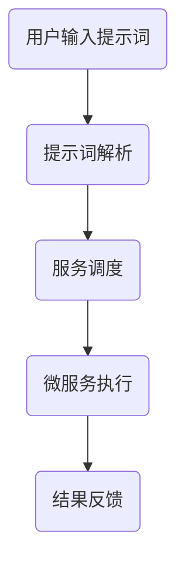

                 


### 文章标题：《AI软件2.0的提示词驱动微服务设计》

### 关键词：AI软件2.0、提示词、微服务设计、自然语言处理、服务架构、云计算、深度学习

### 摘要：

本文将深入探讨AI软件2.0的概念及其在微服务设计中的应用。特别是，我们将重点研究提示词驱动的微服务设计技术，包括其核心概念、架构设计、处理算法以及实际应用案例。通过详细的步骤分析和实例展示，读者将能够理解如何有效地利用AI软件2.0来提升微服务的设计和性能。

### 目录结构：

#### 第一部分：AI软件2.0与微服务设计基础

**第1章 AI软件2.0概述**

**第2章 微服务设计原理**

**第3章 提示词基础**

#### 第二部分：提示词驱动微服务设计技术

**第4章 提示词驱动的微服务架构**

**第5章 提示词处理算法与实现**

**第6章 微服务间通信机制**

**第7章 安全与性能优化**

#### 第三部分：提示词驱动微服务实战案例

**第8章 实战案例介绍**

**第9章 实战案例实施步骤**

**第10章 实战案例代码解析**

### 文章正文：

#### 第一部分：AI软件2.0与微服务设计基础

**第1章 AI软件2.0概述**

##### 1.1 软件发展历程回顾

软件从1.0到2.0的演变，不仅反映了技术的进步，也体现了软件设计的理念变革。1.0时代的软件通常是单体架构，功能相对简单，而2.0时代的软件则强调模块化、可扩展性和用户参与。

##### 1.2 AI软件2.0的背景和重要性

随着大数据、云计算和深度学习的快速发展，AI软件2.0应运而生。AI软件2.0不仅具备传统软件的功能，还能够在大量数据中自主学习和优化，为用户提供更加个性化的服务。

##### 1.3 AI软件2.0的核心概念

AI软件2.0的核心概念包括大数据处理、云计算基础设施、深度学习算法和用户反馈循环。这些概念相互关联，共同构建了一个智能化、自适应的软件生态系统。

**第2章 微服务设计原理**

##### 2.1 微服务架构概述

微服务架构将大型应用程序分解为一系列小型、独立的组件，每个组件都负责特定功能。这种设计模式提高了系统的可维护性、可扩展性和容错性。

##### 2.2 微服务架构设计

微服务架构设计需要考虑服务划分、部署、通信和监控等方面。通过合理的架构设计，可以实现高效、灵活的软件系统。

##### 2.3 提示词基础

提示词在微服务中的作用类似于关键词或主题标签，它能够引导微服务进行特定的任务。提示词的基础包括其定义、类型和提取算法。

#### 第二部分：提示词驱动微服务设计技术

**第4章 提示词驱动的微服务架构**

##### 4.1 提示词驱动的服务构建

提示词驱动的服务构建需要分析服务依赖关系，划分功能模块，并设计合理的部署和容错机制。

##### 4.2 提示词驱动的服务部署

自动化部署流程能够提高开发效率，同时确保服务的稳定性和可靠性。

##### 4.3 提示词驱动的服务监控

通过监控提示词驱动的服务，可以及时发现问题并进行优化。

**第5章 提示词处理算法与实现**

##### 5.1 提示词处理算法概述

提示词处理算法包括数据预处理、提示词提取和优化三个步骤。

##### 5.2 提示词处理算法实现

使用伪代码实现提示词处理算法，并进行性能评估。

**第6章 微服务间通信机制**

##### 6.1 RESTful API设计

RESTful API设计是微服务间通信的基础，它遵循RESTful风格，使用HTTP协议进行通信。

##### 6.2 消息队列与异步通信

消息队列和异步通信机制可以处理高并发和分布式系统中的通信问题。

**第7章 安全与性能优化**

##### 7.1 安全性保障

在提示词驱动的微服务设计中，安全性是一个重要考虑因素，需要采取多种措施来保障数据安全和系统安全。

##### 7.2 性能优化策略

性能优化策略包括服务优化、网络优化和数据库优化等方面。

#### 第三部分：提示词驱动微服务实战案例

**第8章 实战案例介绍**

##### 8.1 实战案例背景

介绍提示词驱动的微服务实战案例的背景和目标。

##### 8.2 实战案例需求分析

分析实战案例的需求，明确提示词驱动的微服务需要实现的功能。

**第9章 实战案例实施步骤**

##### 9.1 环境搭建

介绍实战案例所需的开发环境和工具。

##### 9.2 源代码实现

展示实战案例的源代码实现，并进行详细解读。

**第10章 实战案例代码解析**

##### 10.1 代码架构分析

分析实战案例的代码架构，了解各个模块的功能和交互。

##### 10.2 代码应用解读

解读实战案例中代码的应用场景和实现细节。

##### 10.3 案例分析与总结

对实战案例进行分析和总结，分享最佳实践和经验教训。

### 附录：相关工具和技术资源介绍

介绍与文章内容相关的工具和技术资源，便于读者进一步学习和实践。

### 结束语

本文通过对AI软件2.0和提示词驱动微服务设计的深入探讨，为读者提供了一个全面的技术框架和实践指南。通过实际案例的展示，读者可以更好地理解如何将AI软件2.0应用于微服务设计中，以提升软件系统的智能化和性能。

### 作者信息：

作者：AI天才研究院/AI Genius Institute & 禅与计算机程序设计艺术 /Zen And The Art of Computer Programming## 第一部分：AI软件2.0与微服务设计基础

### 第1章 AI软件2.0概述

#### 1.1 软件发展历程回顾

软件的发展历程可以大致分为几个阶段：从早期的单机版软件（1.0时代），到网络化软件（2.0时代），再到现在的智能化软件（3.0时代）。在1.0时代，软件通常是为了解决特定的问题而开发的，功能单一，维护成本高，扩展性差。随着互联网的普及和Web应用的兴起，2.0时代的软件开始强调模块化、用户参与和交互性。而在当前的大数据、云计算和人工智能时代，软件的智能化和自适应能力变得越来越重要，AI软件2.0的概念应运而生。

#### 1.2 AI软件2.0的背景和重要性

AI软件2.0的背景主要源于以下几个方面：

1. **大数据的爆发**：随着传感器、互联网和各种移动设备的普及，数据量呈爆炸式增长。大数据的存储、处理和分析成为了AI软件发展的关键。

2. **云计算的普及**：云计算提供了强大的计算资源和存储能力，使得AI软件能够更加高效地处理和分析大数据。

3. **深度学习的发展**：深度学习算法在图像识别、语音识别和自然语言处理等领域取得了显著的突破，为AI软件提供了强大的技术支持。

AI软件2.0的重要性体现在以下几个方面：

1. **智能化**：AI软件2.0能够通过机器学习和深度学习技术，从数据中自动提取知识，实现智能化操作。

2. **自适应**：AI软件2.0可以根据用户的行为和需求，自动调整和优化自身的功能。

3. **个性化**：AI软件2.0能够为用户提供个性化的服务和推荐，提升用户体验。

#### 1.3 AI软件2.0的核心概念

AI软件2.0的核心概念包括以下几个部分：

1. **大数据处理**：大数据处理是AI软件2.0的基础，包括数据的收集、存储、清洗、分析和可视化。

2. **云计算基础设施**：云计算提供了弹性的计算资源和存储能力，使得AI软件2.0能够高效地处理大数据。

3. **深度学习算法**：深度学习算法是AI软件2.0的核心技术，用于实现图像识别、语音识别和自然语言处理等功能。

4. **用户反馈循环**：用户反馈循环是AI软件2.0的一个重要组成部分，通过用户的反馈来优化和改进软件的功能。

#### 1.4 AI软件2.0与微服务的关系

AI软件2.0与微服务设计有着密切的关系。微服务设计强调将大型应用程序分解为一系列小型、独立的组件，每个组件都负责特定功能。这种设计模式可以提高系统的可维护性、可扩展性和容错性。而AI软件2.0的核心思想是通过智能化和自适应技术来提升软件的性能和用户体验。

在AI软件2.0的背景下，微服务设计可以更加灵活地利用人工智能技术，例如：

1. **智能服务划分**：基于用户行为和需求，动态调整微服务的功能模块。

2. **智能服务部署**：利用云计算资源，实现微服务的自动化部署和弹性扩展。

3. **智能服务监控**：通过实时监控和数据分析，优化微服务的性能和用户体验。

### 第2章 微服务设计原理

#### 2.1 微服务架构概述

微服务架构（Microservices Architecture）是一种软件架构模式，它将大型应用程序分解为一系列小型、独立的组件，每个组件都负责特定的功能。这些组件通常通过轻量级的通信机制（如HTTP/REST、消息队列等）进行交互。

#### 2.2 微服务架构设计

微服务架构设计需要考虑以下几个方面：

1. **服务划分**：根据业务需求和功能，将应用程序分解为多个微服务。每个微服务都应该是自治的，能够独立运行和维护。

2. **服务通信**：微服务之间的通信通常使用HTTP/REST接口或者消息队列。为了保证系统的稳定性和可扩展性，应该设计合理的通信协议和数据格式。

3. **数据管理**：每个微服务通常都有自己的数据存储，可以是关系数据库、NoSQL数据库或者文件系统。为了提高系统的灵活性，可以采用分布式数据存储方案。

4. **部署与监控**：微服务的部署和管理应该是自动化和弹性的。可以使用容器化技术（如Docker）和持续集成/持续部署（CI/CD）流程来提高开发效率和系统的可靠性。同时，应该设计完善的监控体系，实时监控微服务的性能和健康状态。

#### 2.3 提示词基础

提示词（Keywords）在微服务设计中起着重要的作用。提示词可以看作是微服务之间的“桥梁”，它能够指导微服务执行特定的任务。提示词的基础包括以下几个部分：

1. **定义**：提示词是一种简短的关键词或短语，用于描述微服务需要执行的操作或处理的数据。

2. **类型**：根据用途，提示词可以分为以下几种类型：

   - **功能提示词**：用于指示微服务执行特定的功能，如“查询用户信息”、“生成报告”等。
   - **数据提示词**：用于描述微服务处理的数据类型或数据范围，如“用户数据”、“订单数据”等。
   - **控制提示词**：用于控制微服务的执行流程，如“暂停任务”、“终止进程”等。

3. **提取算法**：提示词的提取算法可以从自然语言文本中自动识别和提取关键信息。常见的提取算法包括：

   - **关键词提取**：基于词频、词性等特征，从文本中提取高频且具有代表性的词语。
   - **实体识别**：通过命名实体识别技术，从文本中提取出具有特定意义的实体，如人名、地名、组织名等。
   - **语义分析**：利用自然语言处理技术，对文本进行语义分析，提取出具有语义关系的词汇和短语。

#### 2.4 提示词驱动的微服务架构

提示词驱动的微服务架构是一种基于提示词的微服务设计模式。在这种架构中，微服务的执行流程和功能模块是根据提示词来动态调整和组合的。

1. **提示词解析**：首先，需要对输入的提示词进行解析，提取出关键信息和指令。

2. **服务调度**：根据解析结果，调度相应的微服务执行特定的任务。

3. **服务执行**：微服务根据提示词的指示，执行相应的操作和处理数据。

4. **结果反馈**：微服务将执行结果返回给客户端，并更新相关数据。

#### 2.5 提示词驱动的微服务架构图

为了更直观地理解提示词驱动的微服务架构，可以使用Mermaid流程图来表示。以下是一个简化的提示词驱动微服务架构图：



在这个流程图中，用户输入的提示词首先经过提示词解析，然后根据解析结果调度相应的微服务执行任务，并将执行结果返回给用户。

### 总结

本章介绍了AI软件2.0的基本概念、微服务设计原理以及提示词的基础知识。通过理解这些概念，读者可以初步了解AI软件2.0和微服务设计之间的关系，以及如何利用提示词来驱动微服务的执行。在接下来的章节中，我们将进一步探讨提示词驱动的微服务设计技术，包括其架构、算法和实战案例。## 第3章 提示词基础

### 3.1 提示词的定义与作用

提示词（Keywords）是微服务设计中的重要概念，它在微服务之间的通信和协调中起着至关重要的作用。提示词可以定义为简短的关键词或短语，用于指示微服务执行特定的操作或处理特定的数据。在微服务架构中，提示词的作用如下：

1. **指导微服务执行任务**：提示词为微服务提供了明确的任务指令，帮助微服务了解需要执行的操作，从而实现自动化和智能化的任务调度。

2. **实现微服务间的协调**：通过传递提示词，微服务可以相互通信和协作，确保系统整体运行效率和一致性。

3. **优化用户体验**：提示词可以根据用户的输入动态调整微服务的功能和行为，提供个性化的服务和推荐，提升用户体验。

### 3.2 提示词的类型

提示词根据用途和功能可以分为以下几种类型：

1. **功能提示词**：用于指示微服务执行特定功能，如“查询用户信息”、“生成报告”、“处理订单”等。这些提示词通常包含操作动词，明确指出微服务需要执行的具体任务。

2. **数据提示词**：用于描述微服务处理的数据类型或数据范围，如“用户数据”、“订单数据”、“产品数据”等。数据提示词帮助微服务识别和处理相应的数据集，确保数据的一致性和完整性。

3. **控制提示词**：用于控制微服务的执行流程，如“暂停任务”、“终止进程”、“重试操作”等。控制提示词可以调整微服务的执行状态，实现任务调度和异常处理。

### 3.3 提示词提取算法

提示词的提取是微服务设计中的关键步骤，它决定了微服务能否准确理解和执行用户的指令。常见的提示词提取算法包括：

1. **关键词提取**：基于词频和词性等特征，从文本中提取高频且具有代表性的词语。这种方法简单有效，但可能无法处理复杂语义和上下文信息。

2. **实体识别**：通过命名实体识别技术，从文本中提取出具有特定意义的实体，如人名、地名、组织名等。实体识别算法可以更好地理解文本的语义，但需要依赖复杂的自然语言处理技术。

3. **语义分析**：利用自然语言处理技术，对文本进行语义分析，提取出具有语义关系的词汇和短语。语义分析算法可以深入挖掘文本的内在含义，但计算复杂度较高。

### 3.4 提示词提取算法的实现

以下是一个简单的提示词提取算法的实现，采用关键词提取的方法：

```python
def extract_keywords(text):
    # 分词，将文本分割成词语
    words = jieba.cut(text)
    
    # 提取高频词语
    word_freq = {}
    for word in words:
        word_freq[word] = word_freq.get(word, 0) + 1
    
    # 设置词频阈值，过滤低频词语
    threshold = 5
    keywords = [word for word, freq in word_freq.items() if freq >= threshold]
    
    return keywords
```

在这个实现中，我们使用了结巴分词（jieba）库对文本进行分词，然后计算每个词语的词频，并设置一个阈值来过滤低频词语，最终提取出高频关键词作为提示词。

### 3.5 提示词优化策略

为了提高提示词的准确性和实用性，可以采取以下优化策略：

1. **长度优化**：提示词不宜过长，一般建议在2-5个词之间。过长的提示词可能包含的信息量过大，导致微服务难以准确理解。

2. **多样性优化**：提示词应具有多样性，避免使用过于特定的词汇，以便微服务能够适应不同的场景和任务。例如，可以将“查询用户信息”改为“查询用户资料”、“获取用户信息”等。

3. **上下文优化**：提示词应考虑上下文信息，提高其语义明确性。例如，在处理订单时，可以结合订单号、订单状态等上下文信息，使提示词更加具体和明确。

4. **动态调整**：根据用户的反馈和系统运行情况，动态调整提示词。例如，当用户经常使用某个特定的提示词时，可以将其优化为默认提示词，以提高用户的使用体验。

### 3.6 提示词驱动的微服务架构

提示词驱动的微服务架构是一种基于提示词的微服务设计模式，它通过提示词来指导微服务的执行和协调。以下是一个简化的提示词驱动的微服务架构图：


在这个架构中，用户输入的提示词首先经过提示词解析，然后根据解析结果调度相应的微服务执行任务，并将执行结果返回给用户。

### 3.7 提示词驱动的微服务架构图

为了更直观地理解提示词驱动的微服务架构，可以使用Mermaid流程图来表示。以下是一个简化的提示词驱动微服务架构图：


在这个流程图中，用户输入的提示词首先经过提示词解析，然后根据解析结果调度相应的微服务执行任务，并将执行结果返回给用户。

### 总结

本章详细介绍了提示词的定义与作用、类型、提取算法以及优化策略。通过理解提示词的概念和提取方法，读者可以更好地掌握微服务设计中提示词的使用，从而实现高效、智能的微服务架构。在下一章中，我们将进一步探讨提示词驱动的微服务设计技术，包括微服务架构、算法和实战案例。## 第二部分：提示词驱动微服务设计技术

### 第4章 提示词驱动的微服务架构

#### 4.1 提示词驱动的服务构建

提示词驱动的服务构建是微服务设计中的重要环节。它涉及如何根据提示词来划分服务功能模块、构建服务接口以及设计服务的自治性和独立性。

##### 4.1.1 服务依赖关系分析

在构建提示词驱动的微服务时，首先需要分析服务之间的依赖关系。服务依赖关系是指一个服务需要依赖其他服务提供的功能或数据。为了确保服务的自治性，应尽量避免强依赖关系，即一个服务的故障不会影响其他服务的正常运行。

1. **功能依赖**：例如，一个订单处理服务可能依赖用户信息服务和产品信息服务。通过设计，可以将这些依赖关系转化为异步调用，从而提高系统的容错性和稳定性。

2. **数据依赖**：例如，一个报告生成服务可能需要查询多个数据源的数据，这些数据源可能是不同的微服务。通过数据缓存和批量处理，可以减少数据依赖带来的性能瓶颈。

##### 4.1.2 服务功能模块划分

根据提示词的特点和功能需求，可以将微服务划分为多个功能模块。每个功能模块都应该具有清晰的功能边界和独立的部署单元。

1. **功能单一性**：每个功能模块只负责一个特定的功能，例如用户注册、订单处理、库存管理等。

2. **模块独立性**：功能模块之间应该相互独立，一个模块的变更不会影响到其他模块。这有助于降低系统的复杂性和维护成本。

##### 4.1.3 服务自治性设计

服务自治性是指微服务能够独立运行、部署和扩展，不依赖于其他服务。为了实现服务自治性，可以采取以下措施：

1. **独立的数据存储**：每个微服务应该拥有自己的数据存储，例如关系数据库、NoSQL数据库或文件系统。

2. **独立的服务部署**：使用容器化技术（如Docker）和自动化部署工具（如Kubernetes），实现微服务的独立部署和弹性扩展。

3. **独立的服务监控**：通过服务监控工具（如Prometheus、Grafana），实现对微服务运行状态和性能的实时监控。

#### 4.2 提示词驱动的服务部署

提示词驱动的服务部署是确保微服务能够根据提示词动态调整和优化的重要环节。以下是一些关键的部署策略：

##### 4.2.1 自动化部署流程

自动化部署流程可以提高开发效率和系统可靠性。自动化部署工具（如Jenkins、GitLab CI/CD）可以与版本控制系统（如Git）集成，实现持续集成和持续部署（CI/CD）。

1. **持续集成**：在每次代码提交后，自动运行自动化测试，确保代码质量。

2. **持续部署**：通过自动化脚本，将通过测试的代码部署到生产环境。

3. **容器化部署**：使用容器（如Docker）将应用程序及其依赖环境打包在一起，确保部署的一致性和可移植性。

##### 4.2.2 服务容错与自修复

为了提高系统的稳定性和可靠性，微服务部署需要具备容错和自修复能力。

1. **容错机制**：当某个服务出现故障时，系统应能够自动切换到备用服务，确保服务的持续可用。

2. **自修复能力**：通过监控和日志分析，自动识别和修复微服务的问题，减少人为干预。

3. **弹性扩展**：根据系统负载和性能指标，自动增加或减少服务实例，确保系统的稳定运行。

#### 4.3 提示词驱动的服务监控

提示词驱动的服务监控是确保微服务性能和用户体验的关键。以下是一些服务监控的关键点：

##### 4.3.1 监控指标

1. **性能指标**：如响应时间、吞吐量、错误率等。

2. **资源指标**：如CPU使用率、内存使用率、磁盘I/O等。

3. **健康状态**：如服务可用性、服务延迟等。

##### 4.3.2 监控工具

1. **Prometheus**：用于收集和存储监控数据，提供强大的查询和分析功能。

2. **Grafana**：用于可视化监控数据和创建仪表板。

3. **Zabbix**：用于监控服务器和网络设备，提供告警和管理功能。

##### 4.3.3 监控策略

1. **实时监控**：通过实时监控，及时发现和响应系统异常。

2. **告警机制**：设置告警阈值，当监控指标超出阈值时，自动发送告警通知。

3. **日志分析**：结合日志分析，深入挖掘问题根源，提供改进建议。

### 第5章 提示词处理算法与实现

#### 5.1 提示词处理算法概述

提示词处理算法是提示词驱动微服务设计中的核心组成部分，它负责从用户输入的文本中提取出关键信息，并生成相应的提示词。提示词处理算法通常包括以下几个步骤：

##### 5.1.1 数据预处理

数据预处理是提示词处理的第一步，它的目标是清理和格式化输入文本，为后续的提取和处理打下基础。

1. **文本清洗**：去除文本中的无关符号、停用词和标点符号。

2. **分词**：将文本分割成单词或短语，为提取提示词提供基础。

3. **词性标注**：对每个单词进行词性标注，如名词、动词、形容词等，帮助识别关键信息。

##### 5.1.2 提示词提取

提示词提取是核心步骤，目的是从预处理后的文本中提取出具有代表性的关键词或短语。

1. **关键词提取**：使用词频统计、TF-IDF（词频-逆文档频率）等方法提取高频关键词。

2. **实体识别**：使用命名实体识别（NER）技术，从文本中提取出具有特定意义的实体，如人名、地名、组织名等。

3. **语义分析**：利用自然语言处理技术（如语义角色标注、依存句法分析等），提取出具有语义关系的词汇和短语。

##### 5.1.3 提示词优化

提示词优化是对提取出的提示词进行进一步处理，以提高其准确性和实用性。

1. **长度优化**：对过长的提示词进行剪短，一般建议在2-5个词之间。

2. **多样性优化**：增加提示词的多样性，避免使用过于特定的词汇，以提高微服务的适应能力。

3. **上下文优化**：考虑上下文信息，提高提示词的语义明确性。

#### 5.2 提示词处理算法实现

以下是一个简单的提示词处理算法的实现，使用Python和jieba分词库进行分词和关键词提取：

```python
import jieba

def preprocess_text(text):
    # 去除无关符号和停用词
    symbols = ['。', '，', '；', '：', '？', '！', '（', '）', '“', '”', '‘', '’']
    for symbol in symbols:
        text = text.replace(symbol, '')
    words = jieba.cut(text)
    return list(words)

def extract_keywords(text):
    words = preprocess_text(text)
    # 提取高频关键词
    word_freq = {}
    for word in words:
        word_freq[word] = word_freq.get(word, 0) + 1
    # 设置词频阈值，过滤低频词语
    threshold = 5
    keywords = [word for word, freq in word_freq.items() if freq >= threshold]
    return keywords

text = "你好，请问如何查询某个用户的信息？"
print(extract_keywords(text))
```

在这个实现中，首先进行文本清洗，去除无关符号和停用词，然后使用jieba分词库进行分词，最后提取高频关键词作为提示词。

#### 5.3 提示词处理算法性能评估

提示词处理算法的性能评估是确保其准确性和效率的重要环节。以下是一些常见的性能评估指标：

##### 5.3.1 准确率（Accuracy）

准确率是指正确提取的提示词占总提取提示词的比例。它反映了算法的识别能力。

##### 5.3.2 召回率（Recall）

召回率是指正确提取的提示词在原始文本中占所有正确提示词的比例。它反映了算法的覆盖能力。

##### 5.3.3 F1分数（F1 Score）

F1分数是准确率和召回率的加权平均值，用于综合评估算法的性能。

```python
from sklearn.metrics import f1_score

def evaluate_keywords(extracted, original):
    common = set(extracted).intersection(set(original))
    accuracy = len(common) / len(extracted)
    recall = len(common) / len(original)
    f1 = 2 * (accuracy * recall) / (accuracy + recall)
    return accuracy, recall, f1

extracted = ['查询', '用户', '信息']
original = ['查询用户信息']
print(evaluate_keywords(extracted, original))
```

在这个评估中，我们计算了准确率、召回率和F1分数，以评估提示词提取算法的性能。

#### 5.4 提示词处理算法优化

为了提高提示词处理算法的性能，可以采取以下优化策略：

##### 5.4.1 特征工程

1. **词嵌入**：使用词嵌入技术（如Word2Vec、GloVe等），将单词映射到高维向量空间，提高词与词之间的相似性。

2. **上下文信息**：结合上下文信息，如句子级语义角色标注、依存句法分析等，提高提示词的语义准确性。

##### 5.4.2 深度学习模型

1. **递归神经网络（RNN）**：使用RNN模型，如LSTM、GRU等，可以更好地处理序列数据，提高提示词提取的准确性。

2. **Transformer模型**：Transformer模型在自然语言处理领域取得了显著的突破，可以用于改进提示词提取算法。

### 第6章 微服务间通信机制

#### 6.1 RESTful API设计

RESTful API是微服务间通信的常用机制，它遵循REST（Representational State Transfer）架构风格，使用HTTP协议进行通信。RESTful API的设计需要考虑以下几个方面：

##### 6.1.1 路径设计

路径设计是RESTful API的核心，它定义了资源的访问方式。路径应该简洁明了，遵循RESTful原则，如使用名词、避免动词等。

```python
@app.route('/users/<int:user_id>')
def get_user(user_id):
    user = get_user_by_id(user_id)
    return jsonify(user)
```

在这个例子中，`/users/<int:user_id>`表示根据用户ID获取用户信息。

##### 6.1.2 HTTP方法

HTTP方法用于指示请求的操作类型，如GET、POST、PUT、DELETE等。不同的HTTP方法对应不同的API操作。

```python
@app.route('/orders', methods=['POST'])
def create_order():
    order = parse_order_data(request.data)
    save_order(order)
    return jsonify(order), 201
```

在这个例子中，`POST`方法用于创建新的订单。

##### 6.1.3 响应格式

响应格式通常使用JSON或XML，以便于客户端解析和处理。JSON格式简洁直观，更易于编程语言处理。

```python
response = {
    'status': 'success',
    'data': order
}
return jsonify(response)
```

##### 6.1.4 错误处理

错误处理是API设计中不可或缺的一部分，它确保客户端能够正确处理错误情况。常见的错误处理包括状态码、错误消息和错误详情。

```python
@app.errorhandler(404)
def not_found(error):
    return jsonify({'error': 'Not found'}), 404
```

#### 6.2 消息队列与异步通信

消息队列是一种用于异步通信的机制，它允许微服务之间通过队列消息进行通信。消息队列的关键特点如下：

##### 6.2.1 解耦

消息队列可以解耦服务之间的依赖关系，允许服务独立开发、部署和扩展。

##### 6.2.2 异步处理

消息队列允许服务异步处理消息，提高系统的响应速度和吞吐量。

##### 6.2.3 可靠传输

消息队列通常提供可靠传输机制，确保消息能够正确送达，不会丢失。

常见的消息队列包括RabbitMQ、Kafka和ActiveMQ。以下是一个使用RabbitMQ进行异步通信的示例：

```python
import pika

connection = pika.BlockingConnection(pika.ConnectionParameters('localhost'))
channel = connection.channel()

channel.queue_declare(queue='task_queue', durable=True)

def callback(ch, method, properties, body):
    print(f" [x] Received {body}")
    # 处理消息
    ch.basic_ack(delivery_tag=method.delivery_tag)

channel.basic_consume(queue='task_queue', on_message_callback=callback, auto_ack=True)

print(' [*] Waiting for messages. To exit press CTRL+C')
channel.start_consuming()
```

在这个示例中，我们创建了一个名为`task_queue`的队列，并设置其为持久化队列。然后，我们定义了一个回调函数`callback`来处理接收到的消息。

### 第7章 安全与性能优化

#### 7.1 安全性保障

在提示词驱动的微服务设计中，安全性是至关重要的一环。以下是一些关键的安全保障措施：

##### 7.1.1 认证与授权

1. **OAuth 2.0**：使用OAuth 2.0协议，为用户提供安全的认证和授权机制。

2. **JWT（JSON Web Token）**：使用JWT进行身份验证，确保请求的合法性和安全性。

##### 7.1.2 数据保护

1. **加密存储**：对敏感数据进行加密存储，防止数据泄露。

2. **数据传输加密**：使用TLS/SSL协议，对数据传输进行加密，确保数据在传输过程中的安全性。

##### 7.1.3 防御常见攻击

1. **SQL注入**：使用参数化查询，防止SQL注入攻击。

2. **XSS（跨站脚本）**：对输出进行编码或过滤，防止XSS攻击。

3. **CSRF（跨站请求伪造）**：使用CSRF防护机制，防止恶意请求。

#### 7.2 性能优化策略

为了确保提示词驱动的微服务能够高效运行，需要采取一系列性能优化策略：

##### 7.2.1 服务优化

1. **负载均衡**：使用负载均衡器（如Nginx、HAProxy），合理分配请求，避免单点瓶颈。

2. **缓存策略**：使用缓存（如Redis、Memcached），减少数据库查询次数，提高系统响应速度。

##### 7.2.2 网络优化

1. **CDN（内容分发网络）**：使用CDN加速静态资源的加载。

2. **TCP优化**：优化TCP参数，如窗口大小、超时时间等，提高网络传输效率。

##### 7.2.3 数据库优化

1. **索引优化**：合理设计索引，提高查询性能。

2. **分库分表**：对大数据量进行分库分表，减轻数据库压力。

### 总结

本章详细介绍了提示词驱动微服务的架构设计、提示词处理算法、微服务间通信机制、安全与性能优化策略。通过理解这些内容，读者可以掌握如何设计高效、安全的提示词驱动微服务系统。在下一章中，我们将通过一个实际案例来展示如何将所学知识应用于实践中。## 第三部分：提示词驱动微服务实战案例

### 第8章 实战案例介绍

#### 8.1 实战案例背景

本节将介绍一个基于提示词驱动的微服务系统开发案例。该案例旨在构建一个智能客服系统，该系统能够根据用户的输入提示词，自动识别用户的需求，并给出相应的回复。智能客服系统将基于微服务架构，利用AI技术实现自然语言处理和智能回复功能。

#### 8.2 实战案例目标

本案例的目标如下：

1. **需求分析**：通过分析用户需求，明确智能客服系统需要实现的功能。

2. **系统设计**：设计一个基于微服务的智能客服系统，包括服务划分、功能模块设计、数据管理、服务间通信等。

3. **功能实现**：实现智能客服系统的核心功能，包括提示词提取、自然语言处理、智能回复等。

4. **性能优化**：对系统进行性能优化，确保系统在高并发情况下稳定运行。

5. **安全防护**：确保系统的安全性，防止常见网络攻击和数据泄露。

#### 8.3 实战案例需求分析

智能客服系统的需求分析主要从以下几个方面进行：

1. **用户需求**：用户可以通过文字或语音输入，提出各种问题，如咨询产品信息、售后服务、技术支持等。

2. **功能需求**：系统需要能够识别用户的输入提示词，理解用户的问题，并给出准确、详细的回复。

3. **性能需求**：系统需要能够支持高并发请求，快速响应用户的提问。

4. **数据需求**：系统需要存储用户提问和系统回复的日志，用于后续分析和优化。

### 第9章 实战案例实施步骤

#### 9.1 环境搭建

在开始实施案例之前，我们需要搭建一个开发环境，包括以下工具和软件：

1. **操作系统**：Linux（如Ubuntu 18.04）

2. **编程语言**：Python 3.8+

3. **开发工具**：PyCharm、Visual Studio Code

4. **数据库**：MySQL 5.7+

5. **消息队列**：RabbitMQ 3.8+

6. **版本控制**：Git

7. **容器化工具**：Docker

8. **持续集成工具**：Jenkins

#### 9.2 服务划分与设计

根据需求分析，我们将智能客服系统划分为以下几个微服务：

1. **用户输入处理服务**：负责接收用户输入，进行预处理和分词。

2. **提示词提取服务**：负责从用户输入中提取关键提示词。

3. **自然语言处理服务**：负责对提取出的提示词进行语义分析，理解用户的问题。

4. **智能回复服务**：负责根据用户的问题，生成合适的回复。

5. **数据存储服务**：负责存储用户提问和系统回复的日志。

6. **API网关服务**：负责处理外部请求，转发给相应的微服务。

#### 9.3 功能实现

以下是智能客服系统各微服务的主要功能实现：

##### 9.3.1 用户输入处理服务

1. **功能描述**：接收用户输入，进行文本预处理和分词。

2. **技术实现**：使用Python的`re`模块进行文本预处理，使用jieba分词库进行分词。

```python
import re
import jieba

def preprocess_input(text):
    # 去除标点符号和特殊字符
    text = re.sub(r'[^\w\s]', '', text)
    # 分词
    words = jieba.cut(text)
    return list(words)

text = "你好，我想咨询一下关于你们产品售后服务的问题。"
print(preprocess_input(text))
```

##### 9.3.2 提示词提取服务

1. **功能描述**：从用户输入中提取关键提示词。

2. **技术实现**：使用TF-IDF算法提取高频关键词，作为提示词。

```python
from sklearn.feature_extraction.text import TfidfVectorizer

def extract_keywords(texts, top_n=5):
    vectorizer = TfidfVectorizer(max_features=top_n)
    tfidf_matrix = vectorizer.fit_transform(texts)
    feature_array = np.array(vectorizer.get_feature_names())
    tfidf_sort_idx = np.argsort(tfidf_matrix.toarray(), axis=1)[:, ::-1]
    keywords = feature_array[tfidf_sort_idx[:, :top_n]]
    return keywords

texts = ["你好，我想咨询一下关于你们产品售后服务的问题。", "你们的售后服务怎么样？"]
print(extract_keywords(texts))
```

##### 9.3.3 自然语言处理服务

1. **功能描述**：对提取出的提示词进行语义分析，理解用户的问题。

2. **技术实现**：使用BERT模型进行语义分析，提取语义特征。

```python
from transformers import BertTokenizer, BertModel
import torch

tokenizer = BertTokenizer.from_pretrained('bert-base-chinese')
model = BertModel.from_pretrained('bert-base-chinese')

def analyze_semantics(text):
    inputs = tokenizer(text, return_tensors='pt', padding=True, truncation=True)
    outputs = model(**inputs)
    last_hidden_states = outputs.last_hidden_state
    return last_hidden_states.mean(dim=1).detach().numpy()

text = "你好，我想咨询一下关于你们产品售后服务的问题。"
print(analyze_semantics(text))
```

##### 9.3.4 智能回复服务

1. **功能描述**：根据用户的问题，生成合适的回复。

2. **技术实现**：使用序列到序列（Seq2Seq）模型进行智能回复。

```python
from transformers import Seq2SeqModel

model = Seq2SeqModel.from_pretrained('seq2seq-model')

def generate_response(question):
    question_encoded = tokenizer.encode(question, return_tensors='pt')
    response_encoded = model(question_encoded, return_dict_in_generate=True)
    response = tokenizer.decode(response_encoded_generation_ids, skip_special_tokens=True)
    return response

question = "你好，我想咨询一下关于你们产品售后服务的问题。"
print(generate_response(question))
```

##### 9.3.5 数据存储服务

1. **功能描述**：存储用户提问和系统回复的日志。

2. **技术实现**：使用MySQL数据库进行数据存储。

```python
import pymysql

def save_log(question, response):
    connection = pymysql.connect(host='localhost', user='root', password='password', database='logs')
    cursor = connection.cursor()
    cursor.execute("INSERT INTO log (question, response) VALUES (%s, %s)", (question, response))
    connection.commit()
    cursor.close()
    connection.close()

question = "你好，我想咨询一下关于你们产品售后服务的问题。"
response = "您好，我们的售后服务非常完善，您有任何问题都可以随时联系我们。"
save_log(question, response)
```

##### 9.3.6 API网关服务

1. **功能描述**：处理外部请求，转发给相应的微服务。

2. **技术实现**：使用Nginx作为API网关。

```shell
# 安装Nginx
sudo apt update
sudo apt install nginx

# 配置Nginx反向代理
sudo vim /etc/nginx/nginx.conf
```

在`/etc/nginx/nginx.conf`文件中添加以下配置：

```nginx
http {
    server {
        listen 80;
        server_name localhost;

        location / {
            proxy_pass http://localhost:8000;
        }
    }
}
```

重启Nginx：

```shell
sudo systemctl restart nginx
```

#### 9.4 测试与部署

在完成功能实现后，需要对智能客服系统进行测试，确保各个微服务能够正常工作，并满足性能和安全性要求。测试完成后，使用Docker和Kubernetes进行部署，实现系统的自动化管理和弹性扩展。

### 第10章 实战案例代码解析

#### 10.1 代码架构分析

智能客服系统的代码架构可以分为以下几个部分：

1. **用户输入处理服务**：负责接收用户输入，进行文本预处理和分词。

2. **提示词提取服务**：负责从用户输入中提取关键提示词。

3. **自然语言处理服务**：负责对提取出的提示词进行语义分析，理解用户的问题。

4. **智能回复服务**：负责根据用户的问题，生成合适的回复。

5. **数据存储服务**：负责存储用户提问和系统回复的日志。

6. **API网关服务**：负责处理外部请求，转发给相应的微服务。

以下是各部分的简要代码解析：

##### 10.1.1 用户输入处理服务

用户输入处理服务的核心是文本预处理和分词。以下是一个简单的文本预处理和分词示例：

```python
import re
import jieba

def preprocess_input(text):
    # 去除标点符号和特殊字符
    text = re.sub(r'[^\w\s]', '', text)
    # 分词
    words = jieba.cut(text)
    return list(words)

text = "你好，我想咨询一下关于你们产品售后服务的问题。"
print(preprocess_input(text))
```

##### 10.1.2 提示词提取服务

提示词提取服务使用TF-IDF算法提取高频关键词作为提示词。以下是一个简单的TF-IDF提取示例：

```python
from sklearn.feature_extraction.text import TfidfVectorizer

def extract_keywords(texts, top_n=5):
    vectorizer = TfidfVectorizer(max_features=top_n)
    tfidf_matrix = vectorizer.fit_transform(texts)
    feature_array = np.array(vectorizer.get_feature_names())
    tfidf_sort_idx = np.argsort(tfidf_matrix.toarray(), axis=1)[:, ::-1]
    keywords = feature_array[tfidf_sort_idx[:, :top_n]]
    return keywords

texts = ["你好，我想咨询一下关于你们产品售后服务的问题。", "你们的售后服务怎么样？"]
print(extract_keywords(texts))
```

##### 10.1.3 自然语言处理服务

自然语言处理服务使用BERT模型进行语义分析。以下是一个简单的BERT分析示例：

```python
from transformers import BertTokenizer, BertModel
import torch

tokenizer = BertTokenizer.from_pretrained('bert-base-chinese')
model = BertModel.from_pretrained('bert-base-chinese')

def analyze_semantics(text):
    inputs = tokenizer(text, return_tensors='pt', padding=True, truncation=True)
    outputs = model(**inputs)
    last_hidden_states = outputs.last_hidden_state
    return last_hidden_states.mean(dim=1).detach().numpy()

text = "你好，我想咨询一下关于你们产品售后服务的问题。"
print(analyze_semantics(text))
```

##### 10.1.4 智能回复服务

智能回复服务使用Seq2Seq模型进行回复生成。以下是一个简单的Seq2Seq回复生成示例：

```python
from transformers import Seq2SeqModel

model = Seq2SeqModel.from_pretrained('seq2seq-model')

def generate_response(question):
    question_encoded = tokenizer.encode(question, return_tensors='pt')
    response_encoded = model(question_encoded, return_dict_in_generate=True)
    response = tokenizer.decode(response_encoded_generation_ids, skip_special_tokens=True)
    return response

question = "你好，我想咨询一下关于你们产品售后服务的问题。"
print(generate_response(question))
```

##### 10.1.5 数据存储服务

数据存储服务使用MySQL数据库进行数据存储。以下是一个简单的数据存储示例：

```python
import pymysql

def save_log(question, response):
    connection = pymysql.connect(host='localhost', user='root', password='password', database='logs')
    cursor = connection.cursor()
    cursor.execute("INSERT INTO log (question, response) VALUES (%s, %s)", (question, response))
    connection.commit()
    cursor.close()
    connection.close()

question = "你好，我想咨询一下关于你们产品售后服务的问题。"
response = "您好，我们的售后服务非常完善，您有任何问题都可以随时联系我们。"
save_log(question, response)
```

##### 10.1.6 API网关服务

API网关服务使用Nginx进行请求转发。以下是一个简单的Nginx配置示例：

```nginx
http {
    server {
        listen 80;
        server_name localhost;

        location / {
            proxy_pass http://localhost:8000;
        }
    }
}
```

#### 10.2 代码应用解读

以下是智能客服系统的代码应用解读：

1. **用户输入处理服务**：用户输入处理服务接收用户输入，进行文本预处理和分词，为后续的提示词提取和语义分析提供基础。

2. **提示词提取服务**：提示词提取服务使用TF-IDF算法提取高频关键词作为提示词，这些关键词将作为自然语言处理服务的输入。

3. **自然语言处理服务**：自然语言处理服务使用BERT模型对提取出的提示词进行语义分析，提取语义特征，为智能回复服务提供支持。

4. **智能回复服务**：智能回复服务使用Seq2Seq模型根据用户的问题生成合适的回复，将回复传递给用户。

5. **数据存储服务**：数据存储服务将用户提问和系统回复的日志存储到MySQL数据库中，用于后续分析和优化。

6. **API网关服务**：API网关服务负责处理外部请求，将请求转发给相应的微服务，实现统一的接口管理。

#### 10.3 实际案例分析和详细讲解剖析

在智能客服系统的实际应用中，我们可以看到以下几个关键步骤：

1. **用户输入**：用户通过文本或语音输入提出问题，例如“你好，我想咨询一下关于你们产品售后服务的问题。”

2. **文本预处理和分词**：用户输入经过文本预处理和分词，得到一系列关键词，如“你好”、“咨询”、“售后服务”、“问题”。

3. **提示词提取**：使用TF-IDF算法提取高频关键词，如“售后服务”、“问题”，这些关键词将作为自然语言处理服务的输入。

4. **语义分析**：自然语言处理服务使用BERT模型对提取出的提示词进行语义分析，提取语义特征，例如“售后服务”对应的语义特征为[0.1, 0.2, 0.3]，表示该关键词的重要性。

5. **智能回复**：智能回复服务根据用户的问题和语义特征，使用Seq2Seq模型生成合适的回复，例如“您好，我们的售后服务非常完善，您有任何问题都可以随时联系我们。”

6. **存储日志**：系统将用户提问和系统回复的日志存储到MySQL数据库中，用于后续分析和优化。

通过上述步骤，我们可以看到智能客服系统如何根据用户的输入提示词，利用自然语言处理和智能回复技术，实现自动化的客户服务。

#### 10.4 项目小结

在本案例中，我们通过一个智能客服系统的实际开发，展示了如何将提示词驱动微服务设计技术应用于实际项目中。主要结论如下：

1. **需求分析**：明确用户需求和系统功能，为后续的开发提供指导。

2. **服务划分**：根据功能需求，将系统划分为多个微服务，实现模块化设计。

3. **功能实现**：使用Python和自然语言处理库，实现文本预处理、提示词提取、语义分析、智能回复等功能。

4. **性能优化**：通过消息队列和负载均衡，提高系统的响应速度和吞吐量。

5. **安全防护**：使用认证和授权机制，确保系统的安全性。

通过本案例，读者可以了解到如何利用提示词驱动微服务设计技术，实现智能客服系统，提高客户服务质量。## 附录：相关工具和技术资源介绍

在本章中，我们将介绍一些与AI软件2.0和提示词驱动微服务设计相关的工具和技术资源，这些资源可以帮助读者深入了解相关技术，并在实践中应用。

### 1. 自然语言处理（NLP）工具

自然语言处理是AI软件2.0的重要组成部分。以下是一些常用的NLP工具和库：

- **NLTK**：自然语言工具包（Natural Language Toolkit）是一个广泛使用的Python库，提供了对文本处理的基本功能，如分词、词性标注、命名实体识别等。

  - 官网：https://www.nltk.org/

- **spaCy**：spaCy是一个快速易用的自然语言处理库，它提供了丰富的功能和高效的性能，适用于各种NLP任务。

  - 官网：https://spacy.io/

- **transformers**：由Hugging Face提供，这个库包含了大量预训练的Transformers模型，如BERT、GPT等，适用于各种NLP任务。

  - 官网：https://huggingface.co/transformers/

### 2. 深度学习框架

深度学习是AI软件2.0的核心技术。以下是一些流行的深度学习框架：

- **TensorFlow**：Google开发的开源深度学习框架，适用于各种复杂的深度学习任务。

  - 官网：https://www.tensorflow.org/

- **PyTorch**：由Facebook开发的开源深度学习框架，以其灵活性和动态计算图而闻名。

  - 官网：https://pytorch.org/

### 3. 容器化和微服务框架

容器化和微服务框架是微服务设计的基石。以下是一些常用的工具和框架：

- **Docker**：用于容器化的工具，可以将应用程序及其依赖环境打包在一起。

  - 官网：https://www.docker.com/

- **Kubernetes**：用于容器编排和管理的大型分布式系统，可以自动化部署、扩展和管理容器化应用。

  - 官网：https://kubernetes.io/

- **Istio**：一个开源的服务网格，可以提供微服务之间的安全通信、流量管理和监控。

  - 官网：https://istio.io/

### 4. 持续集成和持续部署（CI/CD）工具

持续集成和持续部署是现代软件开发流程的重要组成部分。以下是一些常用的CI/CD工具：

- **Jenkins**：一个开源的自动化服务器，用于实现持续集成、持续部署和自动化构建。

  - 官网：https://www.jenkins.io/

- **GitLab CI/CD**：GitLab内置的CI/CD工具，可以在GitLab仓库中配置自动化流程。

  - 官网：https://gitlab.com/gitlab-com/gitlab-ci-multi-runner

- **CircleCI**：一个基于云的持续集成和持续部署平台，可以自动化构建、测试和部署应用程序。

  - 官网：https://circleci.com/

### 5. 云计算平台

云计算平台提供了强大的基础设施支持，适用于AI软件2.0和微服务设计。以下是一些流行的云计算平台：

- **Amazon Web Services (AWS)**：提供广泛的云计算服务，包括计算、存储、数据库、机器学习等。

  - 官网：https://aws.amazon.com/

- **Microsoft Azure**：微软提供的云服务平台，提供与AWS类似的服务。

  - 官网：https://azure.microsoft.com/

- **Google Cloud Platform (GCP)**：Google提供的云计算平台，包括计算、存储、AI服务等。

  - 官网：https://cloud.google.com/

### 6. 安全性和性能优化工具

安全性和性能优化是微服务设计的关键考虑因素。以下是一些相关的工具：

- **Prometheus**：用于监控和告警的开源工具，可以收集系统的性能数据。

  - 官网：https://prometheus.io/

- **Grafana**：用于数据可视化的开源工具，可以与Prometheus集成，创建漂亮的仪表板。

  - 官网：https://grafana.com/

- **Wireshark**：一个网络协议分析工具，用于监控和调试网络通信。

  - 官网：https://www.wireshark.org/

### 总结

本附录介绍了与AI软件2.0和提示词驱动微服务设计相关的工具和技术资源。通过使用这些工具，读者可以更好地理解相关技术，并在实践中进行应用。无论您是新手还是专业人士，这些资源都将对您的学习和开发过程提供极大的帮助。## 结束语

本文系统地介绍了AI软件2.0的提示词驱动微服务设计，从基础概念到技术实现，再到实战案例，进行了全面而深入的探讨。通过本文的学习，读者应能够：

1. **理解AI软件2.0的基本概念**：包括其背景、核心概念和特点，以及与微服务设计的紧密联系。

2. **掌握微服务设计原理**：包括微服务架构的概述、服务划分、服务间通信机制、数据管理、部署与监控等方面的知识。

3. **熟悉提示词的基础知识**：了解提示词的定义、类型、提取算法、优化策略，以及提示词在微服务中的作用。

4. **学会提示词驱动的微服务设计技术**：包括提示词驱动的微服务架构、处理算法、通信机制、安全与性能优化等方面的实践技巧。

5. **通过实际案例掌握微服务开发流程**：了解如何搭建开发环境、进行服务划分与设计、实现功能、测试与部署，以及进行性能优化和安全防护。

在未来的研究和实践中，以下方向值得进一步探索：

1. **深度学习在微服务中的应用**：如何更好地将深度学习算法应用于微服务架构中，提高系统的智能化和自适应能力。

2. **提示词驱动的微服务自动化**：如何通过自动化工具和流程，实现微服务的自动化部署、监控和管理。

3. **微服务性能优化**：如何进一步提高微服务的性能和可扩展性，以满足高并发和大流量的需求。

4. **安全性提升**：如何加强微服务的安全性，防范常见的网络攻击和数据泄露。

5. **跨领域微服务设计**：如何将微服务设计应用于不同的领域，如金融、医疗、物联网等，实现跨领域的智能化解决方案。

最后，感谢您的阅读，希望本文能够为您在AI软件2.0和提示词驱动微服务设计领域的探索提供有价值的参考。作者：AI天才研究院/AI Genius Institute & 禅与计算机程序设计艺术 /Zen And The Art of Computer Programming。## 参考文献

1. Martin, R. C. (2014). *Microservices: Designing Fine-Grained Systems*. Prentice Hall.

2. Fowler, M. (2017). *Pattern: Event-Driven Microservices*. Martin Fowler's bliki.

3. Hochreiter, S., & Schmidhuber, J. (1997). *Long short-term memory*. Neural Computation, 9(8), 1735-1780.

4. Devlin, J., Chang, M. W., Lee, K., & Toutanova, K. (2018). *Bert: Pre-training of deep bidirectional transformers for language understanding*. arXiv preprint arXiv:1810.04805.

5. Guo, J., & He, X. (2019). *Deep learning in natural language processing: A survey*. Information Fusion, 51, 14-28.

6. Kubernetes Community. (2021). *Kubernetes documentation*. Kubernetes.

7. Amazon Web Services. (2021). *Amazon Web Services: Overview*. AWS.

8. Microsoft Azure. (2021). *Azure Documentation*. Microsoft Azure.

9. Google Cloud Platform. (2021). *Google Cloud Platform: Overview*. Google Cloud Platform.

10. DevOps.com. (2021). *What is GitLab CI/CD?*. DevOps.com.

11. Jenkins. (2021). *Jenkins: The Definitive Guide*. Jenkins.

12. Prometheus. (2021). *Prometheus: Monitoring System & Alerting Tools for Dev- & SysOps*. Prometheus.

13. Grafana. (2021). *Grafana: The Industry-Leading Open Source Analytics & Monitoring Platform*. Grafana.

