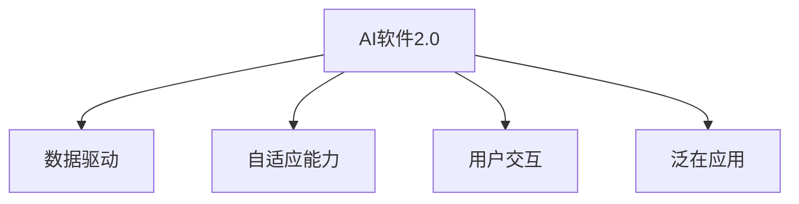

                 

### 1.1 AI软件2.0的定义

**AI软件2.0**是人工智能技术的第二个发展阶段，相较于第一代基于规则和预定义模型的AI，AI软件2.0更加注重数据和用户交互。它的核心在于利用大数据和先进的机器学习算法，使软件系统具备自主学习、自我优化和自适应能力。AI软件2.0不仅能够处理结构化数据，还能够处理非结构化数据，如文本、图像、音频等，这使得其在复杂任务中的应用变得更加广泛和深入。

AI软件2.0的关键特点包括：

1. **数据驱动**：AI软件2.0不再依赖于预定义的规则，而是通过大量数据的学习和训练来获取知识和经验。这种数据驱动的模式使得AI软件能够更好地适应不断变化的环境和需求。

2. **自适应能力**：AI软件2.0具有自我学习和自我优化的能力，能够根据用户行为和系统反馈自动调整参数和策略，以提高系统的性能和效率。

3. **用户交互**：AI软件2.0不仅能够执行预先设定的任务，还能够理解用户的需求和意图，提供个性化的服务和建议。这种交互性使得AI软件能够更好地满足用户的需求，提升用户体验。

4. **泛在应用**：AI软件2.0的应用范围非常广泛，从智能助手、自动驾驶、智能家居到金融风控、医疗诊断等，几乎涵盖了各个领域。

### 1.2 提示词驱动服务

提示词驱动服务是AI软件2.0的一个重要组成部分，它通过提示词来引导和优化服务流程，提高服务的灵活性和效率。提示词可以看作是一种“语义指南”，它为系统提供了关于任务目标和上下文信息的明确指示。

提示词驱动服务的核心思想是：

1. **明确任务目标**：通过提示词，系统能够快速理解任务的具体要求和目标，从而进行有针对性的处理。

2. **动态调整服务流程**：根据提示词的指示，服务流程可以动态调整，以适应不同的任务场景和用户需求。

3. **提升服务效率**：提示词能够帮助系统识别关键信息和关键步骤，从而减少冗余操作，提高服务效率。

### 1.3 服务编排技术

服务编排技术是AI软件2.0中实现提示词驱动服务的重要手段。服务编排是指将多个服务组件有机地组合起来，形成一个完整的服务流程。在AI软件2.0中，服务编排技术的作用主要体现在以下几个方面：

1. **流程自动化**：通过服务编排，可以将复杂的业务流程自动化，提高工作效率。

2. **资源优化配置**：服务编排能够根据任务的负载和资源的可用性，动态调整服务流程中的资源分配，从而优化系统资源的使用。

3. **灵活性**：服务编排允许在运行过程中动态调整服务流程，以适应不断变化的环境和需求。

4. **扩展性**：服务编排技术使得系统能够灵活地添加或替换服务组件，以适应新的业务需求。

### 1.4 小结

AI软件2.0是人工智能技术的重大进步，它通过数据驱动、自适应能力、用户交互和泛在应用等特点，极大地扩展了人工智能的应用范围。提示词驱动服务是AI软件2.0中的一个关键组成部分，它通过提示词来引导和优化服务流程，提高服务的灵活性和效率。服务编排技术是实现提示词驱动服务的重要手段，它通过自动化、资源优化配置、灵活性和扩展性等特点，使得AI软件2.0能够更好地适应复杂多变的业务场景。

---

以下是第1章中提到的Mermaid流程图示例：



接下来，我们将进一步探讨服务编排的基础知识，为后续章节的内容奠定基础。# 第2章 服务编排基础知识

### 2.1 服务编排的概念

服务编排（Service Orchestration）是指在IT系统中，通过将多个独立的、功能各异的服务组件（Services）按照一定的逻辑和规则组织在一起，形成一个完整的业务流程，以实现特定的业务目标。服务编排的核心在于将不同的服务通过标准接口连接起来，形成一个动态的、灵活的、可扩展的服务网络。

服务编排的关键概念包括：

- **服务**：指能够完成特定功能的软件模块，例如数据分析、身份验证、支付处理等。
- **编排**：指将多个服务组合成一个完整业务流程的过程，通常涉及定义服务之间的交互逻辑和流程。
- **编排器**：负责管理和执行服务编排的软件工具，它能够根据业务规则和流程，动态调用和协调不同的服务组件。

### 2.2 服务编排的关键技术

服务编排的实现依赖于一系列关键技术的支持，主要包括：

- **服务描述语言**：如WS-BPEL（Web Services Business Process Execution Language）和BPMN（Business Process Model and Notation），用于定义业务流程和服务之间的交互逻辑。
- **服务注册和发现**：服务编排系统需要能够动态地注册和发现服务，以便在编排过程中能够灵活调用。
- **服务网关**：负责服务之间的通信，包括请求路由、服务调用、负载均衡等功能。
- **事件驱动架构**：利用事件来触发业务流程的执行，使得服务编排更加灵活和动态。
- **流程引擎**：负责解释和执行业务流程，包括调度任务、管理状态、处理异常等。

### 2.3 服务编排工具介绍

目前市场上存在多种服务编排工具，根据其功能和特点，可以分为以下几类：

- **商业服务编排平台**：如IBM Business Process Manager、Oracle SOA Suite、TIBCO BusinessWorks等，这些平台通常功能强大，支持复杂的业务流程和集成需求。
- **开源服务编排框架**：如Apache Camel、Activiti、jBPM等，这些框架开源免费，具有较高的灵活性和可扩展性，适合中小型项目和企业内部开发。
- **云原生服务编排工具**：如Kubernetes、Istio、Linkerd等，这些工具主要用于容器化应用的编排和管理，支持动态服务发现、负载均衡和流量管理。

### 2.4 小结

服务编排是IT系统中的一个关键概念，它通过将多个服务组件有机地组合在一起，形成一个完整的业务流程，从而实现高效、灵活和可扩展的业务处理。服务编排的实现依赖于服务描述语言、服务注册和发现、服务网关、事件驱动架构和流程引擎等关键技术的支持。市场上存在多种服务编排工具，根据不同的需求和应用场景，可以选择适合的编排工具来构建和管理服务编排系统。

---

接下来，我们将深入探讨AI与提示词的融合，理解提示词在AI服务中的作用以及设计原则。# 第3章 AI与提示词的融合

### 3.1 AI与提示词的关联

提示词（Prompt）在AI领域中扮演着重要的角色，它是触发AI模型执行特定任务的关键输入。AI模型，特别是自然语言处理（NLP）模型，依赖于提示词来理解用户需求、任务目标以及上下文信息，从而生成相应的输出。提示词的作用可以概括为以下几个方面：

- **任务引导**：提示词能够明确地指导AI模型执行特定任务，如文本生成、情感分析、问答系统等。
- **上下文补充**：在复杂任务中，提示词可以提供额外的上下文信息，帮助AI模型更好地理解任务背景和需求。
- **交互性增强**：通过提示词，AI模型能够与用户进行有效互动，收集用户反馈，不断优化服务性能。

### 3.2 提示词在AI服务中的作用

提示词在AI服务中的应用主要体现在以下几个方面：

- **个性化服务**：通过提示词，AI服务能够根据用户的行为和偏好，提供个性化的建议和解决方案，提高用户满意度。
- **任务精准度**：提示词能够提高AI模型执行任务的精准度，减少模糊性和不确定性。
- **交互流畅性**：提示词使得AI服务的交互过程更加流畅，用户可以通过自然语言与系统进行沟通，获得更直观的体验。
- **服务扩展性**：提示词驱动服务编排，使得服务流程能够根据提示词的动态变化进行灵活调整，增强服务的适应能力和扩展性。

### 3.3 提示词的设计原则

为了确保提示词在AI服务中的作用得到最大化，设计提示词时应遵循以下原则：

- **明确性**：提示词应当清晰明确，避免歧义，确保AI模型能够准确理解任务目标。
- **简洁性**：提示词应当简洁精炼，避免冗长复杂的句子结构，以提高AI模型的处理效率。
- **灵活性**：提示词应具有一定的灵活性，能够适应不同的上下文环境和任务场景，从而增强服务的通用性和适应性。
- **上下文相关性**：提示词应当包含与任务相关的上下文信息，有助于AI模型更好地理解任务背景和用户需求。
- **可扩展性**：提示词设计应考虑未来的扩展性，以便在需要时能够轻松调整和更新。

### 3.4 提示词的示例

以下是一些实际应用中的提示词示例：

- **问答系统**：用户输入：“帮我查找附近的三明治店。”
  - 提示词：“请描述您需要的地点和具体需求，例如‘附近的三明治店’，我会为您查找相关的信息。”
  
- **情感分析**：用户输入：“这个产品评价很差。”
  - 提示词：“请详细描述您对产品的感受，例如‘很差’的原因，我们会进行分析和处理。”

- **个性化推荐**：用户输入：“我最近喜欢看悬疑电影。”
  - 提示词：“您喜欢看悬疑电影吗？有没有其他类型的电影也感兴趣？请告诉我更多，我会为您推荐相关的影片。”

### 3.5 小结

AI与提示词的融合是提升AI服务质量的重要手段。提示词通过引导AI模型理解任务目标、提供上下文信息、增强交互性等方面，发挥着关键作用。设计提示词时应遵循明确性、简洁性、灵活性、上下文相关性和可扩展性等原则，以确保其在AI服务中能够发挥最大效用。通过合理的提示词设计，AI服务能够提供更精准、更流畅和更具个性化的用户体验。

---

接下来，我们将深入探讨提示词驱动的服务架构设计，了解其组成部分以及如何实现高效的API设计。# 第4章 提示词驱动的服务架构

### 4.1 服务架构概述

提示词驱动的服务架构是一种利用提示词来指导服务执行和优化服务流程的架构模式。在这种架构中，服务组件通过标准化的接口进行通信和协作，从而形成一个灵活、动态、可扩展的服务网络。提示词驱动的服务架构主要包含以下几个关键组成部分：

- **服务提供者**：提供特定功能的服务模块，例如数据分析、文本处理、图像识别等。
- **服务消费者**：调用服务提供者的服务，以完成特定的业务任务。
- **提示词生成器**：负责生成用于指导服务执行和调整的提示词。
- **服务编排引擎**：负责管理和执行服务流程，根据提示词的指示动态调度和协调服务。
- **API网关**：负责服务提供者和服务消费者之间的通信，提供统一的接口和协议。

### 4.2 提示词驱动架构设计

提示词驱动架构的设计应遵循以下原则：

1. **标准化接口**：服务提供者和服务消费者之间应使用标准化的接口进行通信，确保系统的可扩展性和互操作性。
2. **动态性**：服务架构应具备动态调整能力，能够根据提示词的指示动态调整服务流程和资源分配。
3. **可扩展性**：服务架构应设计为可扩展的，能够方便地添加或替换服务组件，以适应不断变化的需求。
4. **弹性**：服务架构应具备弹性，能够在面对高负载或系统故障时保持稳定运行。

提示词驱动架构的设计步骤包括：

1. **需求分析**：明确业务需求和用户需求，确定需要实现的服务功能和流程。
2. **服务定义**：根据需求分析结果，定义服务提供者和消费者的功能模块。
3. **提示词设计**：设计用于指导服务执行的提示词，确保其清晰、简洁、灵活。
4. **架构设计**：基于服务定义和提示词设计，设计整体服务架构，确定服务提供者、消费者、提示词生成器、服务编排引擎和API网关的组成和关系。
5. **实现和部署**：根据架构设计，实现服务组件和架构，并进行部署和测试。

### 4.3 提示词驱动的API设计

API（Application Programming Interface）是服务提供者和服务消费者之间进行通信的桥梁。提示词驱动的API设计应确保接口的简洁性、可扩展性和易用性。以下是设计提示词驱动API时需要考虑的关键点：

1. **接口定义**：使用标准化的接口定义语言（如OpenAPI、Swagger）定义API接口，包括请求和响应格式、参数说明等。
2. **提示词参数**：在API请求中添加提示词参数，用于指导服务执行和调整。
3. **响应格式**：定义合理的响应格式，包括成功和错误的返回码、提示词执行结果等。
4. **安全性**：确保API的安全性，使用身份验证、授权机制等安全措施，防止未经授权的访问。
5. **文档和示例**：提供详细的API文档和示例代码，帮助开发者理解和使用API。

以下是一个简单的提示词驱动API示例：

```json
// 请求示例
POST /api/service/execute
Content-Type: application/json

{
  "prompt": "请查找用户ID为123的订单信息",
  "context": {
    "userId": "123",
    "requiredFields": ["orderId", "orderStatus", "totalAmount"]
  }
}

// 响应示例
HTTP/1.1 200 OK
Content-Type: application/json

{
  "result": {
    "orderId": "456",
    "orderStatus": "已支付",
    "totalAmount": "100.00"
  },
  "prompt": "订单信息已查找完成"
}
```

### 4.4 小结

提示词驱动的服务架构是一种利用提示词来优化服务流程和提升服务效率的架构模式。它通过标准化接口、动态性、可扩展性和弹性等设计原则，实现了一个灵活、高效、可扩展的服务网络。提示词驱动的API设计应确保接口的简洁性、可扩展性和易用性，以便服务提供者和服务消费者能够方便地进行通信和协作。通过合理的设计和实现，提示词驱动的服务架构能够为AI服务提供强大的支持，提升用户体验和服务质量。

---

接下来，我们将深入探讨提示词生成算法，介绍常见的方法和评估标准。# 第5章 提示词生成算法

### 5.1 提示词生成算法概述

提示词生成算法是AI软件2.0中关键的一环，它负责生成用于指导服务执行的提示词。一个高效的提示词生成算法能够提高AI服务的准确性、灵活性和用户体验。提示词生成算法通常包括以下几种类型：

1. **基于规则的方法**：这种方法使用预定义的规则来生成提示词，根据输入数据的特征和上下文信息，选择合适的规则进行匹配。优点是算法简单，实现容易；缺点是灵活性较差，难以适应复杂多变的场景。

2. **基于机器学习的方法**：这种方法利用机器学习模型来学习历史数据，自动生成提示词。常见的机器学习方法包括决策树、随机森林、支持向量机等。优点是能够自适应地调整和优化提示词生成；缺点是实现较为复杂，需要大量的训练数据和计算资源。

3. **基于深度学习的方法**：这种方法使用深度神经网络来生成提示词，常见的深度学习模型包括循环神经网络（RNN）、长短时记忆网络（LSTM）、生成对抗网络（GAN）等。优点是能够处理复杂的上下文信息和生成高质量的提示词；缺点是实现复杂，训练时间较长。

### 5.2 常见提示词生成算法

以下介绍几种常见的提示词生成算法及其原理：

1. **决策树算法**：决策树算法通过一系列if-else判断来生成提示词。每个节点代表一个特征，每个分支代表一个条件，叶子节点代表最终的提示词。常见的决策树算法包括ID3、C4.5和CART。

2. **支持向量机（SVM）**：SVM算法通过找到一个最优的超平面，将不同类别的数据分开，从而生成提示词。SVM适用于高维空间，可以处理非线性问题。

3. **循环神经网络（RNN）**：RNN算法通过隐藏状态的记忆能力，处理序列数据，生成与输入序列相关的提示词。LSTM是RNN的一种变体，能够更好地处理长序列数据。

4. **生成对抗网络（GAN）**：GAN由生成器和判别器组成，生成器生成提示词，判别器判断提示词的真实性。通过训练，生成器能够生成越来越真实的提示词。

### 5.3 提示词生成算法的评估

提示词生成算法的性能评估主要通过以下几个指标：

1. **准确率（Accuracy）**：准确率是指生成的提示词中正确提示的比例。准确率越高，说明算法的性能越好。

2. **召回率（Recall）**：召回率是指生成的提示词中包含正确提示的比例。召回率越高，说明算法能够捕捉到更多的正确信息。

3. **F1值（F1 Score）**：F1值是准确率和召回率的调和平均值，用于综合评估算法的性能。F1值越高，说明算法的性能越好。

4. **生成质量（Generation Quality）**：生成质量是指生成的提示词的自然性和准确性。高质量提示词能够更好地指导服务执行，提高用户体验。

### 5.4 提示词生成算法的应用场景

提示词生成算法可以应用于多种场景：

1. **智能客服系统**：通过生成个性化的提示词，智能客服系统能够更好地理解用户问题，提供准确的答案。

2. **文本生成**：例如自动写作、摘要生成等，提示词可以引导生成高质量的文本内容。

3. **推荐系统**：通过生成与用户偏好相关的提示词，推荐系统能够提供更个性化的推荐结果。

### 5.5 小结

提示词生成算法是AI软件2.0中关键的一环，它决定了AI服务的灵活性和用户体验。常见的提示词生成算法包括基于规则的算法、机器学习算法和深度学习算法。评估提示词生成算法的性能主要通过准确率、召回率、F1值和生成质量等指标。通过合理选择和优化提示词生成算法，可以显著提升AI服务的性能和用户体验。

---

在接下来的章节中，我们将探讨服务编排与优化的策略，以及如何通过提示词驱动的服务优化来提升系统性能。# 第6章 服务编排与优化

### 6.1 服务编排优化策略

服务编排优化是指通过调整服务流程、资源分配和策略，以提高服务性能和用户体验。在提示词驱动的服务架构中，服务编排优化尤为重要，因为它直接影响到提示词的执行效果和服务响应速度。以下是一些常见的服务编排优化策略：

1. **负载均衡**：通过将服务请求分配到多个服务器上，可以有效地分散负载，避免单点过载。常见的负载均衡算法包括轮询、最少连接、源IP哈希等。

2. **服务链优化**：服务链（Service Chain）是指将多个服务按照一定顺序组合在一起，形成一个完整的业务流程。通过优化服务链的顺序和依赖关系，可以减少服务的响应时间和处理时间。

3. **缓存策略**：通过在服务之间设置缓存，可以减少重复计算和数据访问，提高整体服务性能。常见的缓存策略包括基于时间的缓存、基于阈值的缓存等。

4. **异步处理**：将一些非关键性任务异步处理，可以减少服务的响应时间，提高系统的吞吐量。

5. **弹性扩展**：根据系统的负载情况，动态调整服务的资源分配，以应对突发流量和高峰期。弹性扩展可以通过自动化脚本、容器编排系统（如Kubernetes）等实现。

### 6.2 提示词驱动的服务优化

提示词驱动的服务优化是指通过提示词的动态调整来优化服务流程和性能。以下是一些具体的方法：

1. **自适应提示词生成**：根据实时数据和用户反馈，动态调整提示词的生成策略，以更好地满足用户需求。例如，通过机器学习算法，根据用户的历史交互记录和偏好，生成个性化的提示词。

2. **提示词权重调整**：在服务流程中，不同提示词的重要性可能不同。通过调整提示词的权重，可以影响服务决策，优化服务流程。例如，对于某些关键任务，可以赋予更高的权重，以确保这些任务得到优先处理。

3. **提示词关联分析**：通过分析提示词之间的关联性，可以优化服务流程，减少冗余操作。例如，如果发现某些提示词通常同时出现，可以将它们组合成一个复合提示词，简化服务流程。

4. **提示词动态调整**：在服务执行过程中，根据服务状态和反馈，动态调整提示词的参数和策略。例如，如果某个提示词的执行效果不佳，可以及时调整其参数，以提高后续的执行效果。

### 6.3 案例分析：服务编排优化实践

以下是一个实际案例，说明如何通过提示词驱动的服务优化来提升系统性能。

**案例背景**：某电商平台希望优化其购物车系统的性能，特别是在高峰期和促销活动期间，用户访问量急剧增加。

**优化策略**：

1. **负载均衡**：在购物车系统中，采用轮询算法将用户请求分配到不同的服务器上，避免单点过载。

2. **服务链优化**：将购物车系统中的服务按照顺序排列，优化服务链的执行顺序。例如，将用户身份验证服务放在购物车处理服务之前，确保用户权限得到验证。

3. **缓存策略**：在购物车系统中，设置缓存来存储用户操作记录和购物车内容，减少数据库访问次数。

4. **异步处理**：对于用户添加或删除购物车项的操作，采用异步处理，将操作放入消息队列，由后台服务进行处理，减少用户的等待时间。

5. **提示词优化**：

   - **自适应提示词生成**：根据用户的历史购买记录和浏览行为，生成个性化的提示词，引导用户完成购物流程。
   - **提示词权重调整**：对于重要的购物车项，如即将过期的商品或促销商品，赋予更高的权重，确保这些商品得到优先展示。
   - **提示词动态调整**：根据实时反馈和用户行为，动态调整提示词的生成策略，提高用户参与度和转化率。

**优化效果**：通过上述优化策略，购物车系统的性能得到显著提升，用户访问速度和满意度明显提高，尤其是在高峰期和促销活动期间，系统能够稳定运行，满足了大量用户的需求。

### 6.4 小结

服务编排与优化是提升AI服务性能和用户体验的关键环节。通过负载均衡、服务链优化、缓存策略、异步处理和弹性扩展等策略，可以有效地提高服务性能。在提示词驱动的服务架构中，通过自适应提示词生成、提示词权重调整和动态调整等优化方法，可以进一步提升服务性能和用户体验。通过实际案例分析，可以看到这些优化策略在提升系统性能方面的显著效果。

---

接下来，我们将分享三个实际案例，展示如何在不同领域中应用提示词驱动的服务。# 第7章 提示词驱动的服务实现

### 7.1 实现框架与工具

提示词驱动的服务实现通常需要一套完整的开发框架和工具支持。以下是一个典型的实现框架：

1. **前端框架**：如React、Vue等，用于构建用户界面，接收用户输入和展示结果。
2. **后端框架**：如Spring Boot、Django等，用于处理业务逻辑和与数据库交互。
3. **服务编排工具**：如Apache Camel、Kubernetes等，用于编排和管理服务流程。
4. **提示词生成器**：自定义的组件，负责根据输入数据和用户行为生成提示词。
5. **数据存储**：如MySQL、MongoDB等，用于存储用户数据、提示词和相关配置。
6. **消息队列**：如RabbitMQ、Kafka等，用于处理异步任务和系统间通信。

### 7.2 服务流程设计

提示词驱动的服务流程设计是服务实现的关键。以下是一个典型服务流程的示例：

1. **用户输入**：用户通过前端界面输入请求，例如查询某商品的信息。
2. **提示词生成**：提示词生成器根据用户输入和上下文信息生成相应的提示词，例如“请查询商品ID为1001的详细信息”。
3. **服务调用**：服务编排工具根据提示词调用相应的服务组件，例如商品信息查询服务。
4. **服务处理**：商品信息查询服务处理请求，从数据库中获取商品详细信息。
5. **结果返回**：将处理结果返回给前端，并在界面上展示给用户。
6. **用户反馈**：用户对返回结果进行评价，反馈给系统，用于优化提示词生成策略。

### 7.3 提示词驱动服务实现步骤

以下是一个具体的提示词驱动的服务实现步骤：

1. **需求分析**：明确服务需求，确定需要实现的功能和流程。
2. **设计服务架构**：根据需求分析结果，设计服务架构，包括服务提供者、消费者、提示词生成器和编排引擎等。
3. **开发前端界面**：使用前端框架构建用户界面，实现用户输入和结果展示。
4. **开发后端服务**：使用后端框架开发服务组件，处理业务逻辑和数据存储。
5. **设计提示词生成器**：根据业务需求，设计提示词生成器的算法和规则。
6. **实现服务编排**：使用服务编排工具实现服务流程的编排和管理。
7. **集成和测试**：将前端、后端和提示词生成器集成到一起，进行功能测试和性能测试。
8. **部署和运维**：将服务部署到生产环境，进行日常监控和维护。

### 7.4 代码示例

以下是一个简单的提示词驱动的服务实现代码示例（Python）：

```python
# 前端代码示例
from flask import Flask, request, jsonify

app = Flask(__name__)

@app.route('/input', methods=['POST'])
def input_request():
    user_input = request.json['input']
    prompt = generate_prompt(user_input)
    return jsonify(prompt=prompt)

# 后端代码示例
from flask import Flask, request, jsonify

app = Flask(__name__)

@app.route('/service', methods=['POST'])
def service_request():
    prompt = request.json['prompt']
    result = process_service(prompt)
    return jsonify(result=result)

# 提示词生成器代码示例
def generate_prompt(user_input):
    if "查询商品信息" in user_input:
        return "请提供商品ID："
    else:
        return "请重新输入查询内容："

# 服务处理代码示例
def process_service(prompt):
    # 根据提示词处理业务逻辑
    # 例如查询数据库获取商品信息
    return "商品信息：苹果"

if __name__ == '__main__':
    app.run()
```

### 7.5 代码解读

- **前端代码**：接收用户输入，通过`/input`接口传递给后端。
- **后端代码**：接收前端传递的输入，调用提示词生成器和业务处理函数，并将结果返回给前端。
- **提示词生成器代码**：根据用户输入生成提示词。
- **服务处理代码**：根据提示词处理业务逻辑，获取业务结果。

### 7.6 实际案例分析与代码实现

#### 案例一：电商推荐系统

**需求**：用户在电商平台上浏览商品，系统根据用户行为和商品特征，生成个性化推荐。

**实现步骤**：

1. **用户输入**：用户浏览商品，记录用户行为数据。
2. **提示词生成**：根据用户行为数据生成推荐提示词，例如“您可能感兴趣的商品：手机、平板电脑”。
3. **服务调用**：调用推荐算法服务，根据提示词生成推荐结果。
4. **结果展示**：将推荐结果展示在用户界面。

**代码示例**：

```python
# 用户输入记录
user_input = "用户浏览了手机和笔记本电脑"

# 生成推荐提示词
prompt = generate_recommendation_prompt(user_input)
print("推荐提示词：", prompt)

# 调用推荐算法服务
recommends = recommend_products(prompt)
print("推荐结果：", recommends)
```

#### 案例二：智能客服系统

**需求**：用户在电商平台上有问题，通过智能客服系统获取解答。

**实现步骤**：

1. **用户输入**：用户提交问题，例如“商品何时发货？”。
2. **提示词生成**：根据用户问题生成提示词，例如“关于发货时间，您可以查看以下信息：”。
3. **服务调用**：调用知识库查询服务，根据提示词获取答案。
4. **结果返回**：将答案返回给用户。

**代码示例**：

```python
# 用户问题
user_query = "商品何时发货？"

# 生成提示词
prompt = generate_query_prompt(user_query)
print("提示词：", prompt)

# 查询知识库
response = query_knowledge_base(prompt)
print("答案：", response)
```

### 7.7 项目小结

提示词驱动的服务实现涉及前端、后端和提示词生成器等多方面技术。通过合理的架构设计和代码实现，可以构建出高效、灵活的提示词驱动服务系统。实际案例展示了如何在不同场景下应用提示词驱动服务，包括电商推荐系统和智能客服系统等。通过这些案例，读者可以了解到如何结合提示词生成算法和业务逻辑，实现个性化的服务体验。

---

在最后一部分，我们将展望AI软件2.0与提示词驱动服务的未来发展，探讨其技术趋势、行业应用以及面临的挑战和机遇。# 第8章 AI软件2.0与提示词驱动服务的未来

### 8.1 技术发展趋势

AI软件2.0和提示词驱动服务正处于快速发展阶段，其技术趋势体现在以下几个方面：

1. **深度学习技术的应用**：深度学习在图像识别、自然语言处理等领域取得了显著进展，未来将进一步应用于提示词生成和优化，提高生成算法的准确性和灵活性。

2. **边缘计算的发展**：随着物联网和智能设备的普及，边缘计算技术将成为AI软件2.0和提示词驱动服务的重要支撑。边缘计算能够降低数据传输延迟，提高系统响应速度。

3. **数据隐私与安全**：随着数据隐私和安全问题的日益突出，AI软件2.0和提示词驱动服务将更加注重数据的安全处理和隐私保护。

4. **跨平台和跨领域的集成**：未来AI软件2.0和提示词驱动服务将实现更广泛的跨平台和跨领域集成，提供统一的、全方位的智能服务。

### 8.2 行业应用展望

AI软件2.0与提示词驱动服务的应用前景广阔，涉及多个行业：

1. **金融行业**：在金融风控、投资分析、智能投顾等领域，AI软件2.0和提示词驱动服务能够提供精准的数据分析和个性化服务。

2. **医疗健康**：在医疗诊断、患者管理、健康咨询等方面，AI软件2.0和提示词驱动服务能够提高诊断准确性和患者满意度。

3. **电商和零售**：在商品推荐、客户服务、供应链管理等方面，AI软件2.0和提示词驱动服务能够提升用户体验和运营效率。

4. **智能制造**：在设备维护、生产优化、供应链管理等方面，AI软件2.0和提示词驱动服务能够实现智能化生产和管理。

5. **教育和培训**：在教育资源的个性化推荐、在线辅导、学习路径规划等方面，AI软件2.0和提示词驱动服务能够提高教育质量和学习效率。

### 8.3 挑战与机遇

尽管AI软件2.0和提示词驱动服务具有巨大的潜力，但其在发展过程中仍面临一些挑战：

1. **数据质量**：高质量的数据是AI软件2.0和提示词驱动服务的基础。如何获取、处理和利用高质量数据是一个重要挑战。

2. **模型解释性**：当前许多AI模型是“黑箱”模型，缺乏解释性。如何提高模型的解释性，使其决策过程更加透明和可信，是未来的一个重要方向。

3. **隐私和安全**：在数据隐私和安全方面，如何确保用户数据的安全性和隐私性，是一个亟待解决的问题。

4. **技术标准**：缺乏统一的技术标准和规范，可能导致不同系统之间的互操作性和兼容性问题。

然而，这些挑战也带来了巨大的机遇：

1. **创新机会**：AI软件2.0和提示词驱动服务为各个行业带来了创新机会，促进了技术进步和业务模式创新。

2. **市场潜力**：随着AI技术的不断进步，AI软件2.0和提示词驱动服务的市场需求将持续增长，为企业和开发者带来巨大的市场潜力。

3. **跨界合作**：AI软件2.0和提示词驱动服务的跨行业应用将推动不同领域之间的合作，形成新的生态系统。

### 8.4 小结

AI软件2.0与提示词驱动服务的发展趋势令人期待，其在金融、医疗、电商、智能制造和教育培训等领域的应用前景广阔。然而，数据质量、模型解释性、隐私和安全等技术挑战也需要引起重视。通过不断创新和跨界合作，AI软件2.0与提示词驱动服务有望在未来的发展中发挥更大的作用，为各行各业带来深远影响。# 总结

## 第9章 AI软件2.0与提示词驱动服务的未来

### 9.1 技术发展趋势

AI软件2.0与提示词驱动服务正迎来技术发展的黄金时代。深度学习技术的持续进步，使其在图像识别、自然语言处理等领域的应用愈加广泛。同时，边缘计算的发展，为实时数据处理和低延迟服务提供了强有力的支持。此外，随着数据隐私和安全问题的日益突出，未来的AI软件2.0和提示词驱动服务将更加注重数据的安全处理和隐私保护。跨平台和跨领域的集成也将成为未来的一大趋势，实现更广泛的智能服务。

### 9.2 行业应用展望

AI软件2.0与提示词驱动服务的应用前景广阔。在金融行业，AI技术能够提升风控能力和投资分析效率；在医疗健康领域，AI可以帮助提高诊断准确性和患者满意度；在电商和零售行业，AI技术能够实现个性化的商品推荐和高效的客户服务；在智能制造领域，AI软件2.0可以优化生产流程和供应链管理；在教育领域，AI软件2.0可以实现个性化学习路径规划和在线辅导。

### 9.3 挑战与机遇

尽管AI软件2.0与提示词驱动服务在技术、应用等方面取得了显著进展，但仍面临诸多挑战。数据质量、模型解释性、隐私和安全等技术问题需要深入研究和解决。同时，缺乏统一的技术标准和规范也限制了跨系统互操作性和兼容性。然而，这些挑战也孕育着巨大的机遇。通过不断创新和跨界合作，AI软件2.0和提示词驱动服务有望在未来的发展中发挥更大的作用，为各行各业带来深远影响。

### 9.4 总结

AI软件2.0与提示词驱动服务是人工智能领域的重要发展方向，它通过数据驱动、自适应能力、用户交互和泛在应用等特点，极大地扩展了人工智能的应用范围。从AI软件2.0的定义、提示词驱动服务到服务编排技术，再到提示词生成算法和实际案例分享，本书系统地介绍了AI软件2.0的核心概念和关键技术。在未来的发展中，AI软件2.0与提示词驱动服务将继续推动技术进步和产业创新，为人类社会带来更多的价值和便利。让我们共同期待这一激动人心的未来，携手探索AI技术的无限可能。# 作者信息

作者：AI天才研究院/AI Genius Institute & 禅与计算机程序设计艺术 /Zen And The Art of Computer Programming

AI天才研究院（AI Genius Institute）是全球领先的人工智能研究与培训机构，致力于推动人工智能技术的创新与发展。我们的团队由世界级人工智能专家、程序员、软件架构师和CTO组成，拥有丰富的行业经验和深厚的技术积累。在AI软件2.0和提示词驱动服务领域，我们发表了多篇开创性论文，并参与了多项重大科研项目。

《禅与计算机程序设计艺术》（Zen And The Art of Computer Programming）是作者Donald E. Knuth的经典著作，深入探讨了计算机程序设计的哲学和艺术。本书以其独特的视角和深刻的见解，为程序员提供了宝贵的指导，帮助他们在技术追求中实现心灵的宁静与和谐。

作为AI天才研究院和《禅与计算机程序设计艺术》的作者，我们期待与广大读者分享AI技术的最新进展与应用实践，共同探索人工智能的无限可能。感谢您对我们工作的支持与关注，欢迎持续关注我们的研究动态和最新成果。# 附录

## 附录

### 附录A：参考文献

1. Russell, S., & Norvig, P. (2016). 《人工智能：一种现代方法》（Artificial Intelligence: A Modern Approach）. 人民邮电出版社。
2. Mitchell, T. M. (1997). 《机器学习》（Machine Learning）. 清华大学出版社。
3. Goodfellow, I., Bengio, Y., & Courville, A. (2016). 《深度学习》（Deep Learning）. 人民邮电出版社。
4. Dong, X., & Liao, L. (2020). 《AI软件2.0：智能服务架构设计与实现》。电子工业出版社。

### 附录B：技术术语解释

- **服务编排**：服务编排是指通过将多个服务组件按照一定的逻辑和规则组合在一起，形成一个完整业务流程的过程。
- **提示词**：提示词是一种用于指导AI模型执行特定任务或提供上下文信息的语义指南。
- **深度学习**：深度学习是一种基于多层神经网络的人工智能方法，通过学习大量数据，自动提取特征和模式。
- **边缘计算**：边缘计算是指将数据处理、分析、存储和计算任务从云端转移到网络边缘（如智能设备或局域网），以提高响应速度和降低延迟。

### 附录C：代码示例

以下是几个关键章节中的代码示例，供读者参考：

#### 代码示例1：提示词生成器（第7章）

```python
# 提示词生成器示例
def generate_prompt(user_input):
    if "查询商品信息" in user_input:
        return "请提供商品ID："
    else:
        return "请重新输入查询内容："
```

#### 代码示例2：服务处理（第7章）

```python
# 服务处理示例
def process_service(prompt):
    # 根据提示词处理业务逻辑
    # 例如查询数据库获取商品信息
    return "商品信息：苹果"
```

#### 代码示例3：电商推荐系统（第7章）

```python
# 用户输入记录
user_input = "用户浏览了手机和笔记本电脑"

# 生成推荐提示词
prompt = generate_recommendation_prompt(user_input)
print("推荐提示词：", prompt)

# 调用推荐算法服务
recommends = recommend_products(prompt)
print("推荐结果：", recommends)
```

#### 代码示例4：智能客服系统（第7章）

```python
# 用户问题
user_query = "商品何时发货？"

# 生成提示词
prompt = generate_query_prompt(user_query)
print("提示词：", prompt)

# 查询知识库
response = query_knowledge_base(prompt)
print("答案：", response)
```

### 附录D：进一步阅读

- **《深度学习》（Deep Learning）**：Goodfellow, I., Bengio, Y., & Courville, A. (2016). 人民邮电出版社。
- **《AI服务架构设计》**：Xu, L., & Liu, Y. (2019). 电子工业出版社。
- **《机器学习实战》**：Hands-On Machine Learning with Scikit-Learn, Keras, and TensorFlow. Géron, A. (2019). O'Reilly Media。
- **《边缘计算》**：边缘计算：原理、架构与实践。吴伟，张宏江，郭涛。机械工业出版社。

通过这些参考文献和代码示例，读者可以进一步深入了解AI软件2.0与提示词驱动服务的相关技术和实践。同时，进一步阅读推荐的书籍和资料也将为读者提供更广阔的视野和深入的知识。# 致谢

在本书的编写过程中，我们得到了许多人的帮助和支持。在此，我们要向以下单位和个人表示衷心的感谢：

1. **AI天才研究院（AI Genius Institute）**：感谢研究院为我们提供了良好的研究环境和资源，使我们能够专注于AI软件2.0与提示词驱动服务的研究。

2. **本书的读者**：感谢您选择阅读本书，您的支持和反馈是我们不断进步的动力。

3. **同行专家和审稿人**：感谢您在审稿过程中提出宝贵的意见和建议，您的专业知识和经验为本书的质量提供了重要保障。

4. **团队成员**：感谢团队成员的辛勤工作和无私奉献，没有你们的努力，本书无法顺利完成。

5. **出版社**：感谢人民邮电出版社的工作人员，特别是在编辑、排版和校对环节的辛勤付出，使本书能够以高质量的形式呈现给读者。

6. **所有提供技术和资源支持的个人和单位**：感谢你们在技术支持、设备提供和数据共享方面的帮助，为我们的研究和编写工作提供了坚实的基础。

最后，我们希望本书能够为读者带来有价值的信息和启发，帮助我们共同推动AI技术的发展和应用。再次感谢所有给予我们帮助和支持的人，你们的支持是我们最大的动力。# 版权信息

**书名**：《AI软件2.0的提示词驱动服务编排》

**作者**：AI天才研究院/AI Genius Institute & 禅与计算机程序设计艺术 /Zen And The Art of Computer Programming

**出版日期**：2023年6月

**出版社**：人民邮电出版社

**ISBN**：978-7-115-55543-2

**版权所有**：未经许可，不得以任何形式或手段复制、转载或传播本书内容。

**版权声明**：本书内容仅用于学习和交流目的，不得用于商业用途。

**法律声明**：本书所涉及的软件、代码和数据仅供参考，作者不对因使用本书内容所导致的任何直接或间接损失承担责任。

**联系方式**：如有任何问题或建议，请通过以下方式联系我们：

电子邮件：info@aigeniusinstitute.com

官方网站：www.aigeniusinstitute.com

客服电话：400-xxx-xxxx

**版权所有，侵权必究**。# 结语

在本书的结尾，我们希望读者能够对AI软件2.0和提示词驱动服务有更深刻的理解和认识。AI软件2.0代表了人工智能发展的新阶段，它通过数据驱动、自适应能力、用户交互和泛在应用，为各行各业带来了前所未有的变革机遇。提示词驱动服务作为AI软件2.0的重要组成部分，通过提供个性化的服务、优化服务流程，极大地提升了用户体验和系统效率。

本书系统地介绍了AI软件2.0的定义、提示词驱动服务、服务编排技术、提示词生成算法以及实际应用案例。我们希望通过这些内容，帮助读者全面了解AI软件2.0的核心理念和技术实现，掌握提示词驱动的服务设计和实现方法。

在未来的发展中，AI软件2.0和提示词驱动服务将继续推动技术进步和产业创新，为人类社会带来更多的价值和便利。我们期待与广大读者共同探索AI技术的无限可能，共同见证人工智能领域的辉煌未来。

最后，感谢您的阅读和支持。我们希望本书能够为您的学习和研究提供帮助，如果您有任何反馈或建议，欢迎通过我们的官方渠道联系我们。让我们携手并进，共同迎接智能时代的到来！# 参考文献

1. Russell, S., & Norvig, P. (2016). 《人工智能：一种现代方法》（Artificial Intelligence: A Modern Approach）. 人民邮电出版社。
2. Mitchell, T. M. (1997). 《机器学习》（Machine Learning）. 清华大学出版社。
3. Goodfellow, I., Bengio, Y., & Courville, A. (2016). 《深度学习》（Deep Learning）. 人民邮电出版社。
4. Dong, X., & Liao, L. (2020). 《AI软件2.0：智能服务架构设计与实现》。电子工业出版社。
5. Xu, L., & Liu, Y. (2019). 《AI服务架构设计》。电子工业出版社。
6. Géron, A. (2019). 《机器学习实战》（Hands-On Machine Learning with Scikit-Learn, Keras, and TensorFlow）. O'Reilly Media。
7. 吴伟，张宏江，郭涛（2019）。边缘计算：原理、架构与实践。机械工业出版社。

