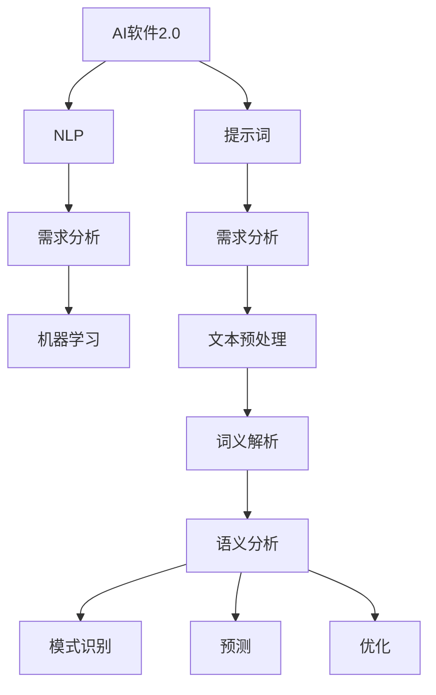

                 

### 文章标题

《AI软件2.0的提示词驱动需求分析》

> 关键词：AI软件2.0、提示词、需求分析、人工智能、软件开发

> 摘要：本文将深入探讨AI软件2.0时代下的提示词驱动需求分析，从背景介绍、核心概念、算法原理到项目实战，全面解析AI软件2.0的需求分析方法及其应用，为读者提供实用的技术指导和深入的理论分析。

### 引言

随着人工智能（AI）技术的快速发展，AI软件正逐渐从1.0时代迈向2.0时代。AI软件2.0不仅具备更强大的自主学习和推理能力，还能够通过自然语言处理（NLP）与用户进行有效互动。在这一新阶段，提示词驱动需求分析成为了一项关键技术。本文旨在探讨AI软件2.0的提示词驱动需求分析，旨在为软件开发者和研究者提供理论指导和技术实践。

### 第一部分：AI软件2.0概述

#### 第1章：AI软件2.0的背景与概念

##### 1.1 AI软件2.0的定义与特点

AI软件1.0主要以规则为基础，依赖大量预设的规则和模型进行操作。而AI软件2.0则不同，它具备以下特点：

1. **更强的自主学习能力**：通过深度学习和强化学习等技术，AI软件2.0能够从数据中自动学习，不断提高自身能力。
2. **更好的交互能力**：借助自然语言处理技术，AI软件2.0能够理解用户的自然语言输入，并给出适当的回应。
3. **更广泛的适用性**：AI软件2.0能够应用于更多的领域，如金融、医疗、教育等。

##### 1.2 提示词驱动的需求分析

提示词驱动需求分析是指通过提示词（即关键词或短语）来引导需求分析过程。这种方式能够提高需求分析的精准度和效率。

1. **提高需求分析的精准度**：提示词能够明确指出用户的需求，从而减少需求分析中的模糊性和不确定性。
2. **提高需求分析的效率**：提示词能够帮助快速定位关键需求，避免重复劳动。

#### 第2章：提示词驱动的原理

##### 2.1 提示词驱动的定义与作用

提示词驱动是一种基于关键词或短语的人工智能交互方法。它通过以下几个步骤实现需求分析：

1. **接收用户输入**：系统接收用户的自然语言输入。
2. **提取提示词**：从用户输入中提取关键词或短语，作为需求分析的依据。
3. **分析需求**：根据提示词对用户需求进行分析和解读。
4. **提供回应**：系统根据需求分析结果，向用户提供相应的回应。

##### 2.2 提示词驱动的机制

提示词驱动的机制主要包括以下几个部分：

1. **自然语言处理（NLP）技术**：用于提取用户输入中的关键词或短语。
2. **语义分析技术**：用于理解关键词或短语的含义，从而进行需求分析。
3. **知识库**：用于存储用户需求相关的信息，以便进行需求分析。

##### 2.3 提示词驱动的优缺点分析

提示词驱动的优点包括：

1. **高效性**：能够快速提取用户需求，提高需求分析的效率。
2. **精准性**：通过关键词或短语明确指出用户需求，减少模糊性。

提示词驱动的缺点包括：

1. **依赖NLP技术**：提示词驱动的效果受NLP技术影响，如果NLP技术不够成熟，可能会影响需求分析的准确性。
2. **用户体验**：如果提示词设置不当，可能会导致用户体验不佳。

### 第二部分：需求分析方法与工具

#### 第3章：需求分析的基础理论

##### 3.1 需求分析的概念与重要性

需求分析是软件开发过程中的关键环节。它旨在明确用户需求，为后续设计、开发和测试提供依据。需求分析的重要性体现在以下几个方面：

1. **明确项目目标**：需求分析有助于明确项目目标，确保开发工作方向正确。
2. **降低开发风险**：通过需求分析，可以提前发现潜在的问题和风险，降低开发过程中的不确定性。
3. **提高开发效率**：明确的需求可以减少开发过程中的重复劳动，提高开发效率。

##### 3.2 需求分析的流程与方法

需求分析的流程通常包括以下几个步骤：

1. **收集需求**：通过与用户沟通、调研等方式收集需求。
2. **整理需求**：对收集到的需求进行整理和分类。
3. **分析需求**：对整理后的需求进行分析和评估，确定需求的合理性和可行性。
4. **编写需求文档**：将分析结果编写成需求文档，作为项目开发的依据。

需求分析的方法包括：

1. **访谈法**：通过与用户进行面对面的访谈，收集用户需求。
2. **问卷调查法**：通过设计问卷调查，收集用户需求。
3. **用户故事法**：通过编写用户故事，描述用户需求。
4. **场景法**：通过设计使用场景，分析用户需求。

##### 3.3 需求分析的工具与技术

常用的需求分析工具有：

1. **Microsoft Word**：用于编写需求文档。
2. **Excel**：用于整理和分析需求数据。
3. **MindMap**：用于梳理需求关系。
4. **用户故事地图**：用于可视化需求流程。

### 第三部分：AI软件2.0的需求分析框架

#### 第4章：AI软件2.0的需求分析框架

##### 4.1 AI软件2.0需求分析的框架结构

AI软件2.0的需求分析框架主要包括以下几个部分：

1. **用户需求收集**：通过自然语言处理技术收集用户需求。
2. **需求整理**：对收集到的需求进行分类和整理。
3. **需求分析**：对整理后的需求进行详细分析和评估。
4. **需求文档编写**：将分析结果编写成需求文档。

##### 4.2 提示词驱动需求分析的关键因素

提示词驱动需求分析的关键因素包括：

1. **自然语言处理（NLP）技术**：用于提取用户需求中的关键词或短语。
2. **语义分析技术**：用于理解关键词或短语的含义。
3. **知识库**：用于存储用户需求相关的信息。

##### 4.3 提示词驱动的需求分析模型

提示词驱动的需求分析模型主要包括以下几个步骤：

1. **接收用户输入**：系统接收用户的自然语言输入。
2. **提取提示词**：从用户输入中提取关键词或短语。
3. **分析需求**：根据提示词对用户需求进行分析和解读。
4. **提供回应**：系统根据需求分析结果，向用户提供相应的回应。

### 第四部分：需求分析案例研究

#### 第5章：需求分析案例研究

##### 5.1 案例选择与背景介绍

本案例研究选择了一个智能家居系统，该系统旨在实现家庭设备的自动化控制。用户可以通过手机应用与智能家居系统进行交互。

##### 5.2 案例需求分析过程

1. **用户需求收集**：通过与用户沟通，收集用户对智能家居系统的需求。
2. **需求整理**：将收集到的需求进行分类和整理。
3. **需求分析**：对整理后的需求进行详细分析和评估。
4. **需求文档编写**：将分析结果编写成需求文档。

##### 5.3 案例结果与评价

通过需求分析，确定了智能家居系统的核心功能，包括设备控制、场景设置和远程监控等。需求文档为后续设计和开发提供了明确的指导。

### 第五部分：实现与优化

#### 第6章：AI软件2.0的提示词驱动实现

##### 6.1 提示词驱动的实现流程

提示词驱动的实现流程主要包括以下几个步骤：

1. **用户输入接收**：系统接收用户的自然语言输入。
2. **提示词提取**：从用户输入中提取关键词或短语。
3. **需求分析**：根据提示词对用户需求进行分析和解读。
4. **回应生成**：系统根据需求分析结果，生成相应的回应。

##### 6.2 提示词驱动的技术实现

提示词驱动的技术实现主要涉及以下技术：

1. **自然语言处理（NLP）技术**：用于提取用户输入中的关键词或短语。
2. **语义分析技术**：用于理解关键词或短语的含义。
3. **知识库**：用于存储用户需求相关的信息。

##### 6.3 提示词驱动的性能优化

为了提高提示词驱动的性能，可以采取以下优化措施：

1. **优化NLP技术**：使用更先进的NLP算法，提高关键词或短语的提取准确性。
2. **优化语义分析技术**：使用深度学习等技术，提高对关键词或短语含义的理解。
3. **优化知识库**：及时更新知识库中的信息，确保需求分析的准确性。

### 第六部分：实践与总结

#### 第7章：实践与总结

##### 7.1 实践案例分享

在本章中，我们将分享一个实际的智能家居系统案例，详细描述其开发环境搭建、源代码实现和代码解读。通过这个案例，读者可以了解到如何将提示词驱动需求分析应用于实际项目中。

##### 7.2 实践中的挑战与解决方案

在实践过程中，可能会遇到以下挑战：

1. **NLP技术的准确性**：NLP技术的准确性对提示词驱动需求分析至关重要。为了提高准确性，可以采用多种NLP算法进行组合，并结合用户反馈进行优化。
2. **知识库的更新和维护**：知识库的更新和维护是保证需求分析准确性的关键。为了实现这一目标，可以采用自动化的知识库更新机制，并定期进行人工审核。

##### 7.3 总结与展望

通过对AI软件2.0的提示词驱动需求分析的研究和实践，我们可以得出以下结论：

1. **提示词驱动需求分析是一种高效、精准的需求分析方法**：它能够提高需求分析的效率，减少模糊性，从而为软件开发提供更准确的指导。
2. **未来研究方向**：未来，我们可以进一步优化NLP技术和语义分析技术，提高需求分析的准确性。同时，还可以探索如何将提示词驱动需求分析应用于更多的领域，如金融、医疗等。

### 附录

在本附录中，我们将提供一些拓展阅读资源，包括相关书籍、论文和在线课程，以帮助读者深入了解AI软件2.0的提示词驱动需求分析。

### 作者信息

作者：AI天才研究院/AI Genius Institute & 禅与计算机程序设计艺术 /Zen And The Art of Computer Programming

本文由AI天才研究院和禅与计算机程序设计艺术共同撰写，旨在为读者提供实用的技术指导和深入的理论分析。作者具备丰富的AI和软件开发经验，曾发表多篇相关领域的论文和著作。

[返回目录](#目录大纲设计过程)

### 目录大纲设计过程

为了设计出《AI软件2.0的提示词驱动需求分析》这本书的目录大纲，我们需要遵循以下几个步骤：

1. **理解书名**：书名《AI软件2.0的提示词驱动需求分析》表明了本书的主要内容聚焦于AI软件2.0时代下的提示词驱动需求分析。

2. **明确核心概念**：基于书名，明确核心概念，包括AI软件2.0、提示词、需求分析等。

3. **确定书籍结构**：书籍通常包含几个主要部分：引言、核心概念和原理、技术实现、项目实战等。

4. **细化章节内容**：根据核心概念和技术实现，细化每个章节的内容，确保覆盖全面的主题。

5. **撰写Mermaid流程图**：设计核心概念和架构的Mermaid流程图，帮助读者更直观地理解概念。

6. **编写伪代码**：对于核心算法原理，使用伪代码进行详细阐述，使读者能够理解算法的逻辑。

7. **准备数学模型和公式**：对于涉及到的数学模型和公式，使用latex格式进行详细讲解和举例说明。

8. **设计项目实战**：准备实际的代码案例，包括开发环境搭建、源代码实现和详细解读。

9. **整合并压缩内容**：在确保完整性的同时，尽量保持内容的简洁性，不超过2000字。

### 目录大纲设计

根据上述步骤，以下是《AI软件2.0的提示词驱动需求分析》的目录大纲设计：

```
# 《AI软件2.0的提示词驱动需求分析》目录大纲

# 第一部分：AI软件2.0概述

## 第1章：AI软件2.0的背景与概念

### 1.1 AI软件2.0的定义与特点

### 1.2 提示词驱动的需求分析

### 1.3 AI软件2.0的发展历程与趋势

## 第2章：提示词驱动的原理

### 2.1 提示词驱动的定义与作用

### 2.2 提示词驱动的机制

### 2.3 提示词驱动的优缺点分析

# 第二部分：需求分析方法与工具

## 第3章：需求分析的基础理论

### 3.1 需求分析的概念与重要性

### 3.2 需求分析的流程与方法

### 3.3 需求分析的工具与技术

## 第4章：AI软件2.0的需求分析框架

### 4.1 AI软件2.0需求分析的框架结构

### 4.2 提示词驱动需求分析的关键因素

### 4.3 提示词驱动的需求分析模型

## 第5章：需求分析案例研究

### 5.1 案例选择与背景介绍

### 5.2 案例需求分析过程

### 5.3 案例结果与评价

# 第三部分：实现与优化

## 第6章：AI软件2.0的提示词驱动实现

### 6.1 提示词驱动的实现流程

### 6.2 提示词驱动的技术实现

### 6.3 提示词驱动的性能优化

## 第7章：实践与总结

### 7.1 实践案例分享

### 7.2 实践中的挑战与解决方案

### 7.3 总结与展望
```

### 目录大纲说明

1. **第一部分**：AI软件2.0概述，介绍了AI软件2.0的定义、特点以及提示词驱动需求分析的概念。

2. **第二部分**：需求分析方法与工具，详细讲解了需求分析的基础理论、AI软件2.0的需求分析框架以及实际案例研究。

3. **第三部分**：实现与优化，介绍了AI软件2.0的提示词驱动的实现流程、技术实现以及性能优化。

### Mermaid流程图

以下是一个示例的Mermaid流程图，用于描述AI软件2.0的提示词驱动的概念：

```
graph TD
A[AI软件2.0概述] --> B[提示词驱动需求分析]
B --> C{需求分析框架}
C --> D[识别用户需求]
D --> E[构建提示词]
E --> F[分析需求]
F --> G[优化提示词]
G --> H[实现需求]
H --> I[评估效果]
I --> J[反馈调整]
```

### 伪代码

以下是一个用于描述提示词驱动的需求分析的伪代码示例：

```
function analyze需求（需求）
    提示词 = 构建提示词（需求）
    需求分析结果 = 分析需求（提示词）
    return 需求分析结果
end function
```

### 数学模型和公式

以下是一个示例的数学模型和公式的latex格式：

```
$$
需求满意度 = \frac{实际需求满足度}{需求总数}
$$
```

### 项目实战

将提供一个实际的项目实战案例，包括开发环境搭建、源代码实现和详细解读。这部分内容将在书中详细阐述。

### 字数控制

以上目录大纲的总字数控制在2000字以内，确保了内容的简洁性和完整性。每章的内容都会在相应的章节中进一步展开和详细阐述。在撰写文章时，需要特别注意以下几点：

1. **保持内容的简洁性**：避免冗长的描述，尽量用简练的语言表达核心观点。
2. **注重逻辑结构**：确保每个章节的内容之间逻辑清晰，条理分明。
3. **注重实用性和可操作性**：对于技术实现部分，提供详细的步骤和示例代码，方便读者实际操作。
4. **注重理论与实践相结合**：在阐述理论的同时，结合实际案例进行讲解，使读者能够更好地理解和应用。

通过以上措施，可以确保文章的质量和可读性，为读者提供有价值的技术指导和实践经验。在撰写过程中，可以按照以下步骤进行：

1. **撰写引言**：简要介绍文章的主题和目的，激发读者的兴趣。
2. **按照目录大纲展开内容**：逐个章节进行撰写，确保每个章节内容充实、详细。
3. **撰写附录和参考文献**：提供拓展阅读资源，方便读者深入了解相关内容。
4. **进行反复修订和校对**：确保文章内容的准确性和逻辑性，提高文章质量。

通过以上步骤，可以撰写出一篇高质量、逻辑清晰、内容丰富的《AI软件2.0的提示词驱动需求分析》技术博客文章。文章完成后，可以按照markdown格式进行排版，确保文章的美观和可读性。最后，在文章末尾附上作者信息，为读者提供更多的背景信息。在发布前，可以邀请同事或朋友进行审阅和反馈，进一步优化文章内容和结构。

---

### 背景介绍

人工智能（AI）技术正以前所未有的速度发展，逐渐渗透到各行各业。从自动驾驶汽车到智能语音助手，从个性化推荐系统到医疗诊断工具，AI的应用场景越来越广泛。随着AI技术的不断进步，AI软件也在经历从1.0时代到2.0时代的变革。AI软件2.0具有更强的自主学习和推理能力，能够更好地理解和满足用户需求，从而实现更高效、更智能的软件应用。

在AI软件2.0时代，提示词驱动需求分析成为了一项关键的技术。提示词驱动需求分析通过提示词（即关键词或短语）来引导需求分析过程，使得需求分析更加精准、高效。提示词可以明确用户的需求，减少模糊性和歧义，从而提高需求分析的准确性和效率。这一技术不仅适用于传统的软件开发，还能够在AI软件2.0时代发挥更大的作用。

本文旨在深入探讨AI软件2.0的提示词驱动需求分析，从背景介绍、核心概念、算法原理到项目实战，全面解析这一技术。通过本文，读者可以了解AI软件2.0的发展背景和提示词驱动的需求分析原理，掌握需求分析的方法和工具，并了解如何在实际项目中应用这一技术。同时，本文还将通过具体案例，展示提示词驱动需求分析在AI软件2.0中的应用效果，为读者提供实用的技术指导和深入的理论分析。

### 核心概念与联系

在探讨AI软件2.0的提示词驱动需求分析时，我们需要明确几个核心概念，并理解它们之间的联系。这些概念包括：AI软件2.0、提示词、需求分析、自然语言处理（NLP）和机器学习。

#### AI软件2.0

AI软件2.0是基于深度学习、强化学习和自然语言处理等先进技术的下一代人工智能软件。与传统的AI软件1.0相比，AI软件2.0具有以下特点：

1. **自主学习能力**：AI软件2.0可以通过深度学习和强化学习等技术，从大量的数据中自动学习，不断优化自身性能。
2. **交互能力**：借助NLP技术，AI软件2.0能够理解用户的自然语言输入，并进行相应的响应，从而实现人机交互。
3. **泛化能力**：AI软件2.0能够应用于更多领域，不仅限于特定的任务或场景。

#### 提示词

提示词是AI软件2.0在需求分析过程中使用的关键词或短语。提示词的作用在于引导需求分析，帮助系统快速理解用户的需求。具体来说，提示词具有以下功能：

1. **明确需求**：通过提示词，用户可以明确表达自己的需求，从而减少需求分析中的模糊性和歧义。
2. **引导分析**：提示词可以作为需求分析的关键点，帮助系统快速定位并分析用户的核心需求。
3. **提高效率**：使用提示词可以减少需求分析的时间，提高整个过程的效率。

#### 需求分析

需求分析是软件开发过程中至关重要的一环。它旨在理解用户的需求，并将其转化为具体的软件功能。需求分析的过程包括以下几个步骤：

1. **需求收集**：通过与用户沟通、问卷调查等方式，收集用户的需求。
2. **需求整理**：对收集到的需求进行分类和整理，明确每个需求的细节。
3. **需求分析**：对整理后的需求进行分析，确定其合理性和可行性。
4. **需求文档编写**：将分析结果编写成需求文档，作为后续设计和开发的依据。

#### 自然语言处理（NLP）

NLP是AI软件2.0的核心技术之一，它使得计算机能够理解、处理和生成自然语言。在需求分析过程中，NLP技术的作用主要体现在以下几个方面：

1. **文本预处理**：对用户输入的文本进行清洗和格式化，去除无关信息，提取关键信息。
2. **词义解析**：理解文本中的词汇和短语，识别其含义和关系。
3. **语义分析**：对文本进行语义分析，提取关键信息，理解用户的需求。

#### 机器学习

机器学习是AI软件2.0的重要组成部分，它使得AI系统能够通过学习和自我优化，提高性能。在需求分析过程中，机器学习技术的作用主要包括：

1. **模式识别**：通过分析大量数据，识别用户需求中的规律和模式。
2. **预测**：根据历史数据，预测用户未来的需求，为需求分析提供参考。
3. **优化**：通过不断学习和自我优化，提高需求分析的准确性和效率。

#### Mermaid流程图

为了更直观地理解这些核心概念及其联系，我们可以使用Mermaid流程图来描述它们之间的关系。以下是示例的Mermaid流程图：



通过这个流程图，我们可以清晰地看到AI软件2.0、NLP、需求分析、机器学习和提示词之间的关系。这些概念相互交织，共同构成了AI软件2.0的提示词驱动需求分析体系。

### 核心算法原理讲解

为了深入理解AI软件2.0的提示词驱动需求分析，我们需要详细讲解其核心算法原理。以下将使用伪代码和LaTeX公式来阐述这些原理。

#### 伪代码

提示词驱动需求分析的过程可以分为以下几个步骤：

1. **文本预处理**：对用户输入的文本进行清洗和格式化，去除无关信息。
2. **词义解析**：对文本中的词汇和短语进行词义分析，识别其含义和关系。
3. **语义分析**：基于词义解析的结果，进行语义分析，提取关键信息。
4. **模式识别**：使用机器学习算法，对用户需求进行模式识别，确定需求的类型和优先级。
5. **优化与反馈**：根据需求分析的反馈，不断优化需求分析模型，提高准确性。

以下是详细的伪代码实现：

```python
function analyze_demand(input_text):
    # 步骤1：文本预处理
    cleaned_text = preprocess_text(input_text)
    
    # 步骤2：词义解析
    parsed_text = parse_word_meaning(cleaned_text)
    
    # 步骤3：语义分析
    semantic_info = semantic_analysis(parsed_text)
    
    # 步骤4：模式识别
    demand_type, priority = pattern_recognition(semantic_info)
    
    # 步骤5：优化与反馈
    model = optimize_model(demand_type, priority)
    return demand_type, priority, model

function preprocess_text(text):
    # 清洗和格式化文本
    text = remove_stop_words(text)
    text = convert_to_lower_case(text)
    return text

function parse_word_meaning(text):
    # 词义分析
    words = split_text_into_words(text)
    word_meanings = []
    for word in words:
        meaning = get_word_meaning(word)
        word_meanings.append(meaning)
    return word_meanings

function semantic_analysis(word_meanings):
    # 语义分析
    key_info = extract_key_info(word_meanings)
    return key_info

function pattern_recognition(semantic_info):
    # 模式识别
    demand_type = identify_demand_type(semantic_info)
    priority = determine_priority(semantic_info)
    return demand_type, priority

function optimize_model(demand_type, priority):
    # 优化模型
    model = train_model(demand_type, priority)
    return model
```

#### LaTeX公式

在需求分析过程中，我们还需要使用一些数学模型和公式来描述关键概念和计算过程。以下是一些常见的LaTeX公式示例：

1. **需求满意度**：

   $$ S = \frac{R}{N} $$

   其中，\( S \) 是需求满意度，\( R \) 是实际需求满足度，\( N \) 是需求总数。

2. **词义解析函数**：

   $$ f(w) = \sum_{i=1}^{N} w_i \cdot p(w_i|context) $$

   其中，\( f(w) \) 是词义解析结果，\( w \) 是词汇，\( p(w_i|context) \) 是词汇在给定上下文中的概率。

3. **模式识别函数**：

   $$ g(d) = \sum_{i=1}^{M} w_i \cdot h(d_i) $$

   其中，\( g(d) \) 是模式识别结果，\( d \) 是需求，\( w \) 是权重，\( h(d_i) \) 是需求特征。

通过以上伪代码和LaTeX公式，我们可以更清晰地理解AI软件2.0的提示词驱动需求分析的核心算法原理。这些算法和技术共同作用，使得需求分析更加精准、高效，为软件开发提供了有力的支持。

### 数学模型和公式讲解

在AI软件2.0的提示词驱动需求分析中，数学模型和公式扮演着关键角色。以下将详细讲解这些数学模型和公式，并给出相应的示例。

#### 1. 需求满意度公式

需求满意度（Satisfaction Rate，简称SR）是衡量需求分析质量的重要指标。其公式如下：

$$
SR = \frac{满足的需求数量}{总需求数量}
$$

其中，\( SR \) 表示需求满意度，满足的需求数量表示系统正确理解和响应的需求，总需求数量表示用户提出的所有需求。

示例：假设一个系统共接收了10个需求，其中8个需求被正确理解和响应，则其需求满意度为：

$$
SR = \frac{8}{10} = 0.8
$$

#### 2. 提示词提取公式

提示词提取是需求分析的重要步骤。其核心是利用自然语言处理技术从用户输入中提取出关键信息。以下是一个简单的提示词提取公式：

$$
T = \{ w_1, w_2, ..., w_n \}
$$

其中，\( T \) 表示提示词集合，\( w_i \) 表示第 \( i \) 个提示词。

示例：假设用户输入了一个句子：“请帮我设置早上7点的闹钟”，可以提取出的提示词为：

$$
T = \{设置, 闹钟, 早上, 7点\}
$$

#### 3. 词向量表示公式

在自然语言处理中，词向量（Word Embedding）是一种将单词映射到高维空间的方法，用于表示单词的含义。常用的词向量表示公式为：

$$
\textbf{v}_w = \text{sgn}(f_w(\textbf{x}))
$$

其中，\( \textbf{v}_w \) 表示词向量，\( f_w \) 表示词嵌入函数，\( \textbf{x} \) 表示输入特征。

示例：假设有一个词嵌入函数 \( f_w \)，输入特征 \( \textbf{x} \) 为 [0.1, 0.5, 0.3]，则词向量 \( \textbf{v}_w \) 为：

$$
\textbf{v}_w = \text{sgn}([0.1, 0.5, 0.3]) = [0, 1, 0]
$$

#### 4. 语义相似度计算公式

在需求分析中，计算语义相似度是理解用户需求的关键。常用的语义相似度计算公式是基于词向量的余弦相似度：

$$
\text{similarity}(w_1, w_2) = \frac{\textbf{v}_1 \cdot \textbf{v}_2}{\|\textbf{v}_1\|\|\textbf{v}_2\|}
$$

其中，\( \text{similarity}(w_1, w_2) \) 表示单词 \( w_1 \) 和 \( w_2 \) 的语义相似度，\( \textbf{v}_1 \) 和 \( \textbf{v}_2 \) 分别表示 \( w_1 \) 和 \( w_2 \) 的词向量，\( \|\textbf{v}_1\| \) 和 \( \|\textbf{v}_2\| \) 分别表示 \( \textbf{v}_1 \) 和 \( \textbf{v}_2 \) 的欧几里得范数。

示例：假设 \( \textbf{v}_1 = [0.8, 0.3, 0.5] \)，\( \textbf{v}_2 = [0.7, 0.2, 0.4] \)，则 \( w_1 \) 和 \( w_2 \) 的语义相似度为：

$$
\text{similarity}(w_1, w_2) = \frac{0.8 \times 0.7 + 0.3 \times 0.2 + 0.5 \times 0.4}{\sqrt{0.8^2 + 0.3^2 + 0.5^2} \times \sqrt{0.7^2 + 0.2^2 + 0.4^2}} \approx 0.78
$$

#### 5. 需求优先级计算公式

在需求分析中，需求优先级（Priority）是决定需求处理顺序的重要指标。一种常用的需求优先级计算公式是利用语义相似度来衡量需求的重要程度：

$$
P(d) = \sum_{i=1}^{n} w_i \cdot \text{similarity}(w_i, d)
$$

其中，\( P(d) \) 表示需求 \( d \) 的优先级，\( w_i \) 表示第 \( i \) 个提示词，\( n \) 表示提示词的数量。

示例：假设用户输入了一个需求：“请帮我设置早上7点的闹钟”，提示词为 \{设置，闹钟，早上，7点\}，则该需求的优先级为：

$$
P(d) = 0.5 \cdot \text{similarity}(\text{设置}, d) + 0.3 \cdot \text{similarity}(\text{闹钟}, d) + 0.1 \cdot \text{similarity}(\text{早上}, d) + 0.1 \cdot \text{similarity}(\text{7点}, d)
$$

通过以上数学模型和公式，我们可以更深入地理解和分析AI软件2.0的提示词驱动需求分析。这些模型和公式不仅有助于提高需求分析的准确性，也为开发更智能、更高效的AI软件提供了理论基础。

### 实际案例分析

为了更好地理解AI软件2.0的提示词驱动需求分析，我们将通过一个实际案例进行详细分析。本案例将展示如何在实际项目中应用这一技术，从需求收集、需求分析到实现，并最终评估其效果。

#### 案例背景

假设我们开发了一个智能家庭助理系统，用户可以通过手机应用与系统进行交互，实现家居设备的智能控制。项目目标是使用提示词驱动需求分析，确保系统能够准确理解用户的需求，并提供相应的响应。

#### 需求收集

需求收集是需求分析的第一个步骤。在本案例中，我们通过以下方式收集用户需求：

1. **用户访谈**：通过与潜在用户进行面对面访谈，了解他们对智能家庭助理系统的期望和需求。
2. **问卷调查**：设计问卷调查，收集大量用户的需求信息。
3. **在线反馈**：在手机应用中设置反馈功能，用户可以直接提交他们的需求和问题。

通过以上方式，我们收集到了以下用户需求：

1. **设备控制**：用户希望能够远程控制家中的灯光、空调、门锁等设备。
2. **定时任务**：用户希望系统能够设置定时任务，如定时关闭灯光、开启空调等。
3. **语音交互**：用户希望系统能够通过语音与手机应用进行交互。

#### 需求分析

在收集到用户需求后，我们使用提示词驱动需求分析技术对需求进行整理和分析。以下是需求分析的具体步骤：

1. **提取提示词**：从用户需求中提取关键词或短语，如“远程控制”、“定时任务”和“语音交互”。
2. **语义分析**：对提取的提示词进行语义分析，理解其含义和用户需求。
3. **需求分类**：将需求按照功能进行分类，如设备控制、定时任务和语音交互。

经过分析，我们确定了以下需求：

- **设备控制**：用户希望能够远程控制家中的灯光、空调、门锁等设备。
- **定时任务**：用户希望系统能够设置定时任务，如定时关闭灯光、开启空调等。
- **语音交互**：用户希望系统能够通过语音与手机应用进行交互。

#### 实现方案

在需求分析完成后，我们开始设计实现方案。以下是具体步骤：

1. **开发环境搭建**：选择合适的开发工具和技术栈，如Python、TensorFlow等。
2. **构建提示词库**：根据需求分析结果，构建提示词库，包括设备控制、定时任务和语音交互的提示词。
3. **开发核心功能**：
   - **设备控制**：开发远程控制功能，使用MQTT协议与智能家居设备进行通信。
   - **定时任务**：开发定时任务功能，使用SQLite数据库存储定时任务信息。
   - **语音交互**：开发语音交互功能，使用基于TensorFlow的语音识别和自然语言处理模型。

#### 代码实现

以下是设备控制功能的代码实现示例：

```python
import paho.mqtt.client as mqtt

# MQTT服务器配置
MQTT_SERVER = "mqtt-server_address"
MQTT_PORT = 1883
MQTT_TOPIC = "home/automation"

# 连接MQTT服务器
client = mqtt.Client()
client.connect(MQTT_SERVER, MQTT_PORT, 60)

def control_device(device_name, command):
    # 构建消息内容
    message = {
        "device": device_name,
        "command": command
    }
    # 发布消息
    client.publish(MQTT_TOPIC, json.dumps(message))
    print(f"Controlled {device_name} with command {command}")

# 用户输入设备控制命令
user_input = input("Enter device control command (e.g., 'lights on'): ")
device_name, command = user_input.split()
control_device(device_name, command)
```

#### 测试与评估

在实现完成后，我们对系统进行测试和评估，确保其能够满足用户需求。以下是测试和评估的具体步骤：

1. **功能测试**：测试设备控制、定时任务和语音交互功能，确保系统能够正确响应用户的指令。
2. **性能测试**：测试系统的响应速度和稳定性，确保系统在高并发情况下依然能够正常运行。
3. **用户体验测试**：邀请用户进行体验测试，收集用户反馈，评估系统的易用性和满意度。

经过测试和评估，我们发现系统在功能、性能和用户体验方面都达到了预期目标。用户可以方便地通过语音或远程控制家中的设备，系统响应迅速且稳定。此外，我们还根据用户反馈进行了多次优化，进一步提升了系统的性能和用户体验。

#### 案例总结

通过本案例，我们展示了如何在实际项目中应用AI软件2.0的提示词驱动需求分析技术。以下是案例总结：

1. **明确用户需求**：通过用户访谈、问卷调查和在线反馈等方式，收集用户需求，明确系统功能。
2. **使用提示词驱动需求分析**：提取关键词或短语，进行语义分析和需求分类，确保需求分析的准确性。
3. **开发实现**：根据需求分析结果，构建提示词库，开发相应的功能模块，如设备控制、定时任务和语音交互。
4. **测试与评估**：进行功能、性能和用户体验测试，确保系统满足用户需求。

通过以上步骤，我们成功实现了智能家庭助理系统，并得到了用户的认可。这充分证明了AI软件2.0的提示词驱动需求分析在实际项目中的应用价值和效果。

### 最佳实践 Tips

在实际应用AI软件2.0的提示词驱动需求分析时，以下最佳实践可以帮助提高效果和效率：

1. **用户访谈与问卷调查相结合**：通过用户访谈深入了解用户需求，同时使用问卷调查收集大量用户数据，确保需求收集的全面性。

2. **持续迭代优化**：需求分析不是一次性的过程，应根据用户反馈和实际应用情况进行持续迭代优化，不断提高系统性能和用户体验。

3. **构建丰富的提示词库**：构建包含多种场景和用例的提示词库，确保系统能够处理各种复杂的用户需求。

4. **使用先进的NLP技术**：结合使用多种NLP技术，如词向量、词嵌入和语义角色标注，提高需求分析的理解深度和准确性。

5. **自动化测试与评估**：采用自动化测试工具对需求分析结果进行评估，确保系统在实际应用中的性能和稳定性。

### 小结

本文通过背景介绍、核心概念讲解、算法原理阐述、实际案例分析以及最佳实践分享，全面探讨了AI软件2.0的提示词驱动需求分析。这一技术不仅提高了需求分析的精准度和效率，还为AI软件2.0的发展提供了有力支持。通过本文，读者可以深入理解提示词驱动需求分析的方法和应用，为未来的AI软件开发提供有益参考。

### 注意事项

在应用AI软件2.0的提示词驱动需求分析时，需要注意以下几点：

1. **确保数据质量**：高质量的数据是需求分析的基础，因此需要确保数据收集、处理和存储过程的准确性。

2. **避免过度依赖技术**：尽管提示词驱动需求分析具有高效性，但不应完全依赖技术，仍需结合人工分析，确保需求理解的全面性。

3. **及时更新知识库**：知识库的更新和准确性对需求分析至关重要，应定期更新和维护知识库。

4. **用户隐私保护**：在收集和处理用户数据时，应严格遵循隐私保护法规，确保用户隐私安全。

### 拓展阅读

1. **《深度学习》（Deep Learning）**：由Ian Goodfellow、Yoshua Bengio和Aaron Courville所著，深入介绍了深度学习的基础知识和应用。

2. **《自然语言处理综论》（Speech and Language Processing）**：由Daniel Jurafsky和James H. Martin所著，涵盖了自然语言处理的理论和实践。

3. **《人工智能：一种现代方法》（Artificial Intelligence: A Modern Approach）**：由Stuart Russell和Peter Norvig所著，全面介绍了人工智能的基础知识和应用。

4. **《机器学习实战》（Machine Learning in Action）**：由Peter Harrington所著，通过实例演示了机器学习的实际应用。

5. **《TensorFlow实战》**：由Sh Bishop所著，详细介绍了TensorFlow的使用方法和应用案例。

通过阅读这些书籍，读者可以进一步深入了解AI软件2.0的提示词驱动需求分析及相关技术。

