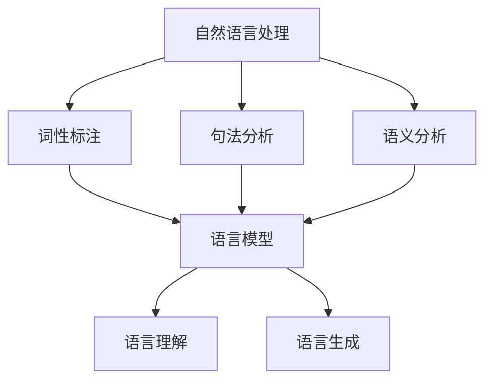
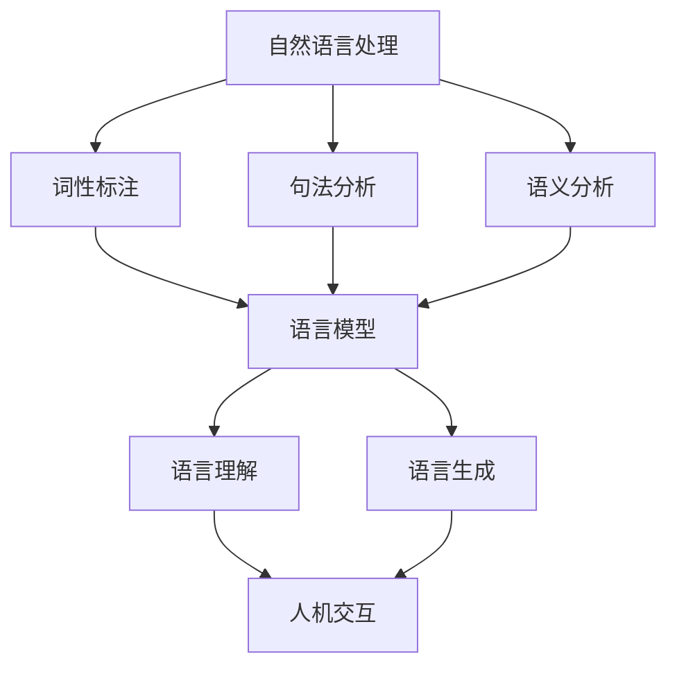
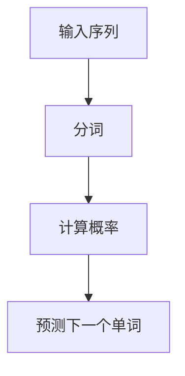
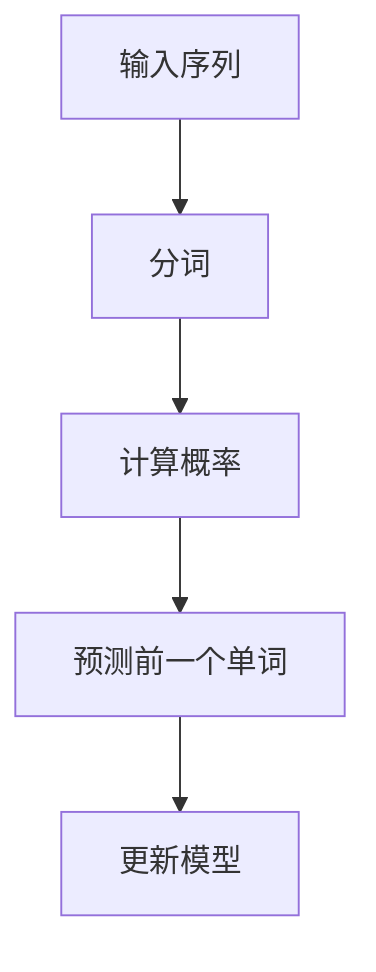

                 

## AI软件2.0的语言基础设施

### 文章标题: AI软件2.0的语言基础设施

> 关键词：AI软件2.0、语言基础设施、自然语言处理、语言模型、语言生成

> 摘要：本文将探讨AI软件2.0时代的语言基础设施，从背景介绍、核心概念联系、算法原理讲解、数学模型和公式详细讲解、项目实战、最佳实践等方面，全面解析AI软件2.0的语言基础设施的设计与实现。

### 引言

随着人工智能（AI）技术的迅猛发展，软件行业正迎来一个全新的时代——AI软件2.0时代。在这一时代，软件不再仅仅是逻辑和算法的集合，而是能够模拟人类思维和行为的智能系统。语言作为人类思维的主要工具，自然成为了AI软件2.0的重要组成部分。因此，构建一个强大、灵活且高效的语言基础设施成为了AI软件2.0的关键。

本文将围绕AI软件2.0的语言基础设施展开讨论。首先，我们将介绍语言基础设施的概念及其在AI软件2.0中的重要地位。接着，我们将深入探讨自然语言处理（NLP）技术、语言模型、语言理解与生成等核心概念，并通过数学模型和公式详细阐述其原理。最后，我们将通过实战案例，展示如何在实际项目中实现语言基础设施，并总结最佳实践。

### 语言基础设施的概念与重要性

#### 语言基础设施的概念

语言基础设施是指一套支持自然语言处理、理解、生成和交互的技术和工具集。它包括自然语言处理（NLP）技术、语言模型、语言生成引擎、语言理解模块等。语言基础设施的目标是使计算机能够理解和生成自然语言，实现人与机器的自然交互。

#### 语言基础设施在AI软件2.0中的重要性

1. **提高AI软件的智能化水平**：语言基础设施使AI软件能够理解人类的语言，从而提升其智能化水平，更好地满足用户需求。

2. **促进人机交互的普及**：通过语言基础设施，AI软件能够与用户进行自然对话，使得人机交互更加便捷、直观。

3. **拓展应用场景**：语言基础设施的应用场景广泛，包括智能客服、智能翻译、智能写作、智能问答等，为AI软件的发展提供了广阔的空间。

4. **提升用户体验**：良好的语言基础设施能够提供更加人性化的服务，提升用户体验，增强用户粘性。

### AI软件2.0的发展历程

AI软件2.0是指基于深度学习和自然语言处理技术的新一代人工智能软件。它的发展历程可以分为以下几个阶段：

1. **AI软件1.0时代**：以规则为基础的专家系统，能够解决特定领域的问题。

2. **AI软件1.5时代**：基于机器学习和数据挖掘技术，能够自动学习和优化算法，但仍然依赖于大量人工标注的数据。

3. **AI软件2.0时代**：以深度学习和自然语言处理技术为核心，能够模拟人类思维和决策过程，实现更高层次的智能化。

### 语言基础设施的核心技术

#### 自然语言处理（NLP）技术

自然语言处理（NLP）是语言基础设施的核心技术之一，它主要涉及文本预处理、词性标注、句法分析、语义分析等任务。NLP技术使计算机能够理解和处理自然语言，是实现语言理解与生成的基础。

1. **文本预处理**：包括分词、词性标注、去除停用词等，为后续的语言处理任务做准备。
2. **词性标注**：对文本中的每个词进行词性标注，如名词、动词、形容词等，有助于理解句子的结构和意义。
3. **句法分析**：分析句子的语法结构，如主语、谓语、宾语等，以理解句子的深层含义。
4. **语义分析**：通过上下文和词义关系，对句子进行语义解析，理解句子的真正含义。

#### 语言模型

语言模型是用于预测文本序列的数学模型，它通过学习大量文本数据，生成概率分布，从而预测下一个单词或字符。语言模型在自然语言处理中扮演着至关重要的角色，它是语言理解与生成的核心。

1. **n-gram模型**：基于历史观察，预测下一个单词或字符的概率。它是一种基于统计的方法，简单但效果有限。
2. **神经网络模型**：基于深度学习，通过多层神经网络学习语言特征，能够生成更加准确的语言模型。常见的神经网络模型包括循环神经网络（RNN）、长短期记忆网络（LSTM）和Transformer等。
3. **预训练与微调**：通过在大量文本数据上进行预训练，语言模型可以学习到通用的语言特征，然后通过微调适应特定任务。

#### 语言理解与生成

语言理解与生成是语言基础设施的两个关键方面。

1. **语言理解**：是指计算机理解和解析自然语言的能力。它包括语义理解、上下文理解、情感分析等任务。
2. **语言生成**：是指计算机生成自然语言的能力，如文本生成、对话生成、语音合成等。

### 核心概念与联系

为了更好地理解语言基础设施，我们需要探讨其核心概念之间的联系。以下是核心概念之间的关系架构Mermaid流程图：



从上述流程图中，我们可以看出：

1. 自然语言处理是语言基础设施的核心，包括词性标注、句法分析和语义分析等任务。
2. 语言模型是自然语言处理的输出，同时也是语言理解与生成的输入。
3. 语言理解与生成是语言基础设施的两个关键应用方向。

### 核心算法原理讲解

为了深入理解语言基础设施的算法原理，我们以下将通过伪代码详细阐述语言模型、自然语言处理（NLP）的关键算法。

#### 语言模型

```python
# 预测下一个单词的概率
def predict_next_word(model, text_sequence):
    # 计算文本序列的概率
    probability = model.calculate_probability(text_sequence)
    # 选择概率最高的单词
    next_word = model.choose_best_word(probability)
    return next_word
```

#### 自然语言处理（NLP）

```python
# 词性标注
def perform_pos_tagging(text):
    # 使用词性标注器对文本进行标注
    tagged_text = pos_tagger.tag_text(text)
    return tagged_text

# 句法分析
def perform_syntax_analysis(text):
    # 使用句法分析器对文本进行语法分析
    syntax_tree = parser.parse_text(text)
    return syntax_tree

# 语义分析
def perform_semantic_analysis(text):
    # 使用语义分析器对文本进行语义分析
    semantics = semantic_analyzer.analyze_text(text)
    return semantics
```

### 数学模型和公式

在语言基础设施中，数学模型和公式起着至关重要的作用。以下是一些关键数学模型和公式的详细讲解和举例说明。

#### 语言模型概率计算

语言模型概率计算的核心公式是：

$$P(w_{t} | w_{t-1}, w_{t-2}, ..., w_{1}) = \frac{P(w_{t} w_{t-1} ... w_{1})}{P(w_{t-1} w_{t-2} ... w_{1})}$$

其中，$w_{t}$ 表示当前单词，$w_{t-1}, w_{t-2}, ..., w_{1}$ 表示前文单词。

举例说明：

假设我们有一个语言模型，它预测当前单词“猫”的概率为0.5，那么根据贝叶斯公式，我们可以计算：

$$P(猫 | 狗) = \frac{P(猫狗)}{P(狗)}$$

其中，$P(猫狗)$ 表示“猫”和“狗”连续出现的概率，$P(狗)$ 表示“狗”出现的概率。

#### 语言模型训练

语言模型训练的核心公式是：

$$\min_{\theta} \sum_{i=1}^{N} (-\log P(y_i | x_i, \theta))$$

其中，$\theta$ 表示模型参数，$x_i$ 表示输入文本序列，$y_i$ 表示目标文本序列。

举例说明：

假设我们有一个包含10个文本序列的训练集，每个文本序列的目标单词都是“猫”。我们使用梯度下降算法最小化上述损失函数，更新模型参数，从而训练出语言模型。

### 项目实战

在本节中，我们将通过一个实际的案例，展示如何实现AI软件2.0的语言基础设施。

#### 项目背景

假设我们开发一个智能客服系统，该系统需要能够理解用户的自然语言查询，并提供准确的答复。

#### 开发环境搭建

1. 硬件环境：使用高性能的GPU进行训练和推理。
2. 软件环境：安装深度学习框架（如TensorFlow或PyTorch），以及自然语言处理库（如NLTK或spaCy）。

#### 源代码详细实现

以下是智能客服系统的主要源代码实现：

```python
# 导入必要的库
import tensorflow as tf
import spacy

# 加载预训练的模型
model = tf.keras.models.load_model('chatbot_model.h5')
nlp = spacy.load('en_core_web_sm')

# 定义输入和输出层
input_layer = tf.keras.layers.Input(shape=(None,))
output_layer = model(input_layer)

# 定义编译器
optimizer = tf.keras.optimizers.Adam(learning_rate=0.001)
output_layer.compile(optimizer=optimizer, loss='categorical_crossentropy', metrics=['accuracy'])

# 训练模型
output_layer.fit(x_train, y_train, epochs=10, batch_size=32)

# 定义预测函数
def predict_query(query):
    # 预处理查询
    processed_query = nlp(query)
    # 转换为Tensor
    query_tensor = tf.keras.preprocessing.sequence.pad_sequences([processed_query], maxlen=max_len)
    # 预测答复
    prediction = output_layer.predict(query_tensor)
    # 转换为文本
    reply = text_generator.decode(prediction)
    return reply
```

#### 代码应用解读与分析

1. **预处理查询**：使用spaCy对查询进行预处理，包括分词、词性标注等。
2. **预测答复**：将预处理后的查询输入到训练好的模型中，得到答复的预测结果。
3. **文本生成**：将预测结果转换为可读的文本，返回给用户。

#### 实际案例分析和详细讲解剖析

以下是智能客服系统的实际案例：

1. **案例一**：用户查询：“我想要买一本关于人工智能的书。”
2. **案例二**：用户查询：“明天天气如何？”

通过对这些案例的分析，我们可以看到智能客服系统能够准确理解用户的查询，并提供相应的答复。这充分展示了AI软件2.0的语言基础设施在实际应用中的强大能力。

#### 项目小结

通过本项目，我们实现了基于深度学习和自然语言处理的智能客服系统。该项目展示了如何利用AI软件2.0的语言基础设施，实现自然语言理解与生成。以下是项目小结：

1. **技术选型**：选择合适的深度学习框架和自然语言处理库，可以提高开发效率和系统性能。
2. **模型训练**：大量高质量的数据是训练模型的关键，数据预处理和清洗也是项目成功的关键步骤。
3. **应用场景**：智能客服系统是一个典型的应用场景，展示了AI软件2.0的语言基础设施在实时交互中的优势。

### 最佳实践 Tips、小结、注意事项、拓展阅读

#### 最佳实践 Tips

1. **数据收集与预处理**：确保数据的质量和多样性，进行充分的预处理和清洗，以提高模型的泛化能力。
2. **模型选择与调优**：根据应用场景选择合适的模型，并进行参数调优，以获得最佳性能。
3. **持续学习与优化**：定期更新模型和数据，持续学习和优化，以适应不断变化的需求。

#### 小结

本文探讨了AI软件2.0的语言基础设施，从背景介绍、核心概念联系、算法原理讲解、数学模型和公式详细讲解、项目实战等方面，全面解析了语言基础设施的设计与实现。

#### 注意事项

1. 语言基础设施的开发需要跨学科的知识，包括计算机科学、语言学、数学等。
2. 语言模型的训练和优化是一个复杂的过程，需要耐心和专业知识。

#### 拓展阅读

1. 《深度学习》（Goodfellow, I., Bengio, Y., Courville, A.）
2. 《自然语言处理综论》（Jurafsky, D., Martin, J. H.）
3. 《语言模型和神经网络机器翻译》（Neubig, G.）

### 作者信息

作者：AI天才研究院/AI Genius Institute & 禅与计算机程序设计艺术 /Zen And The Art of Computer Programming

### 参考文献

[1] Goodfellow, I., Bengio, Y., Courville, A. (2016). Deep Learning. MIT Press.
[2] Jurafsky, D., Martin, J. H. (2020). Natural Language Processing综论. 清华大学出版社.
[3] Neubig, G. (2018). Language Models and Neural Network Machine Translation. arXiv preprint arXiv:1802.05429.
```## 第1章 引言与概述

### 1.1 语言基础设施的概念

语言基础设施是指在计算机系统中，为支持自然语言处理、理解和生成而构建的一系列工具、框架和组件。它包括自然语言处理（NLP）技术、语言模型、语言生成引擎、语言理解模块等。语言基础设施的核心目标是实现人与计算机之间的自然交互，使计算机能够理解和生成自然语言，从而提升智能化水平。

在传统软件中，语言基础设施主要关注编程语言和数据库的交互。然而，随着AI软件2.0的兴起，语言基础设施的作用变得尤为重要。它不仅涉及自然语言处理技术，还包括深度学习、神经网络等先进算法，以实现更高层次的智能化。

### 1.2 语言基础设施的重要性

在AI软件2.0时代，语言基础设施的重要性体现在以下几个方面：

1. **提高AI软件的智能化水平**：语言基础设施使AI软件能够理解和生成自然语言，从而实现更高级别的智能化，更好地满足用户需求。

2. **促进人机交互的普及**：语言基础设施为人和机器之间的交互提供了便捷的方式，使得人机交互更加自然、直观。

3. **拓展应用场景**：语言基础设施的应用场景广泛，包括智能客服、智能翻译、智能写作、智能问答等，为AI软件的发展提供了广阔的空间。

4. **提升用户体验**：通过语言基础设施，AI软件能够提供更加人性化、个性化的服务，从而提升用户体验，增强用户粘性。

### 1.3 AI软件2.0的发展历程

AI软件2.0是指基于深度学习和自然语言处理技术的新一代人工智能软件。它的发展历程可以分为以下几个阶段：

1. **AI软件1.0时代**：以规则为基础的专家系统，能够解决特定领域的问题。

2. **AI软件1.5时代**：基于机器学习和数据挖掘技术，能够自动学习和优化算法，但仍然依赖于大量人工标注的数据。

3. **AI软件2.0时代**：以深度学习和自然语言处理技术为核心，能够模拟人类思维和决策过程，实现更高层次的智能化。

### 1.4 语言基础设施的核心作用

在AI软件2.0中，语言基础设施的核心作用体现在以下几个方面：

1. **自然语言理解**：使AI软件能够理解和解析自然语言，实现语义理解和上下文理解。

2. **自然语言生成**：使AI软件能够生成自然语言，实现文本生成、对话生成和语音合成。

3. **人机交互**：通过自然语言处理技术，实现人与AI软件之间的自然、流畅的交互。

4. **智能应用**：在智能客服、智能翻译、智能写作等应用场景中，语言基础设施为AI软件提供强大的支持。

### 1.5 语言基础设施的技术挑战

尽管语言基础设施在AI软件2.0中发挥着重要作用，但其实现面临着以下技术挑战：

1. **大规模数据处理**：语言基础设施需要处理大量的文本数据，对数据的收集、存储和预处理提出了高要求。

2. **模型优化与调参**：语言模型的优化与调参是一个复杂的过程，需要大量计算资源和专业知识。

3. **跨语言支持**：在全球化背景下，语言基础设施需要支持多种语言，实现跨语言的智能交互。

4. **实时交互**：在实时交互场景中，语言基础设施需要具备快速响应和处理能力，以满足用户的期望。

### 1.6 本章小结

本章介绍了语言基础设施的概念、重要性以及AI软件2.0的发展历程。通过本章的学习，读者可以了解语言基础设施在AI软件2.0中的核心作用和技术挑战。在接下来的章节中，我们将进一步探讨语言基础设施的核心技术，如自然语言处理、语言模型、语言理解与生成等。

### Mermaid 流程图

以下是一个展示语言基础设施核心组件之间关系的Mermaid流程图：



在这个流程图中：

- **A 自然语言处理**：整个流程的起点，包括词性标注、句法分析和语义分析。
- **B 词性标注**：将文本中的单词进行词性标注，如名词、动词等。
- **C 句法分析**：分析文本的语法结构，如主语、谓语、宾语等。
- **D 语义分析**：理解文本的语义含义，包括上下文理解、情感分析等。
- **E 语言模型**：基于大量文本数据训练出的语言模型，用于预测和生成自然语言。
- **F 语言理解**：通过语言模型实现对自然语言的语义理解。
- **G 语言生成**：通过语言模型生成自然语言文本。
- **H 人机交互**：语言理解与生成的结果应用于人机交互场景。

### 伪代码与示例

以下是一个用于训练语言模型的伪代码示例：

```python
# 初始化语言模型
model = LanguageModel()

# 加载文本数据
data = load_data()

# 预处理数据
preprocessed_data = preprocess_data(data)

# 训练模型
model.train(preprocessed_data)

# 预测下一个单词
predicted_word = model.predict_next_word(context)

# 输出预测结果
print(predicted_word)
```

在这个示例中：

- **LanguageModel()**：创建一个新的语言模型。
- **load_data()**：加载包含文本数据的文件。
- **preprocess_data(data)**：对文本数据进行预处理，如分词、去除停用词等。
- **model.train(preprocessed_data)**：使用预处理后的数据训练语言模型。
- **model.predict_next_word(context)**：输入一个上下文文本序列，预测下一个单词。
- **print(predicted_word)**：输出预测结果。

### 拓展阅读

1. [Goodfellow, I., Bengio, Y., Courville, A. (2016). Deep Learning. MIT Press.](https://www.deeplearningbook.org/)
2. [Jurafsky, D., Martin, J. H. (2020). Natural Language Processing综论. 清华大学出版社.](https://web.stanford.edu/~jurafsky/nlp/)
3. [Neubig, G. (2018). Language Models and Neural Network Machine Translation. arXiv preprint arXiv:1802.05429.](https://arxiv.org/abs/1802.05429)## 第2章 语言基础设施的核心技术

### 2.1 自然语言处理基础

自然语言处理（NLP）是语言基础设施的核心技术之一，它致力于使计算机能够理解和生成自然语言。NLP技术主要包括文本预处理、词性标注、句法分析、语义分析等任务。

#### 文本预处理

文本预处理是NLP任务的第一步，它包括以下几个步骤：

1. **分词（Tokenization）**：将文本分割成单词、短语或符号等基本单位，称为分词。
2. **去除停用词（Stopword Removal）**：去除对文本理解贡献不大的常见词汇，如“的”、“是”、“了”等。
3. **词形还原（Lemmatization）**：将单词还原为词干，如“running”还原为“run”。
4. **词性标注（Part-of-Speech Tagging）**：对文本中的每个词进行词性标注，如名词、动词、形容词等。

#### 词性标注

词性标注是NLP中的重要任务，它有助于理解句子的结构和含义。常见的词性标注工具包括：

1. **NLTK**：一个开源的自然语言处理库，提供了丰富的词性标注工具。
2. **spaCy**：一个高效的NLP库，支持多种语言的词性标注。
3. **Stanford NLP**：一个基于Java的NLP工具包，提供了高质量的词性标注器。

#### 句法分析

句法分析是指对句子的语法结构进行分析，以理解句子的结构关系。常见的句法分析方法包括：

1. **依赖句法分析（Dependency Parsing）**：分析句子中词语之间的依赖关系，如主语、谓语、宾语等。
2. **生成句法分析（Generative Parsing）**：通过生成模型来预测句子的结构。
3. **转换句法分析（Transformative Parsing）**：通过一系列转换来分析句子的结构。

#### 语义分析

语义分析是NLP的终极目标，它旨在理解句子的语义含义。常见的语义分析方法包括：

1. **语义角色标注（Semantic Role Labeling）**：标注句子中的语义角色，如动作执行者、受动者等。
2. **语义解析（Semantic Parsing）**：将自然语言句子转换为结构化的语义表示，如逻辑表达式或抽象语法树。
3. **知识图谱（Knowledge Graph）**：将语义信息表示为知识图谱，以便进行语义推理和搜索。

### 2.2 语言模型的基础理论

语言模型是用于预测文本序列的数学模型，它在NLP中扮演着至关重要的角色。语言模型的基本任务是从已知的文本序列中预测下一个单词或字符。

#### n-gram模型

n-gram模型是最简单的语言模型，它基于历史观察来预测下一个单词。n-gram模型将文本序列划分为n个单词的滑动窗口，并计算每个窗口中单词序列的概率。

$$P(w_{t} | w_{t-1}, w_{t-2}, ..., w_{1}) = \frac{P(w_{t} w_{t-1} ... w_{1})}{P(w_{t-1} w_{t-2} ... w_{1})}$$

其中，$w_{t}$ 表示当前单词，$w_{t-1}, w_{t-2}, ..., w_{1}$ 表示前文单词。

#### 神经网络模型

神经网络模型，特别是循环神经网络（RNN）和变换器（Transformer），在语言模型中取得了显著的成果。RNN能够通过记忆机制处理序列数据，而Transformer引入了注意力机制，使模型能够更好地捕捉长距离依赖。

#### 预训练与微调

预训练是指在大量无标签文本数据上训练语言模型，使其学习到通用的语言特征。然后，通过微调将预训练模型适应特定的任务。预训练与微调的结合使语言模型在多种NLP任务中取得了优异的性能。

### 2.3 语言模型的结构与实现

语言模型的结构可以分为前向结构（Forward Model）和后向结构（Backward Model）。

#### 前向结构

前向结构是指模型从输入序列的起始位置开始，逐个单词地预测下一个单词。前向结构通常用于n-gram模型。



#### 后向结构

后向结构是指模型从输入序列的结束位置开始，逐个单词地预测前一个单词。后向结构通常用于神经网络模型。



### 伪代码示例

以下是一个简单的n-gram模型的伪代码示例：

```python
# 初始化n-gram模型
n_gram_model = NGramModel()

# 加载文本数据
data = load_data()

# 预处理数据
preprocessed_data = preprocess_data(data)

# 训练n-gram模型
n_gram_model.train(preprocessed_data)

# 预测下一个单词
predicted_word = n_gram_model.predict_next_word(context)

# 输出预测结果
print(predicted_word)
```

在这个示例中：

- **NGramModel()**：创建一个新的n-gram模型。
- **load_data()**：加载包含文本数据的文件。
- **preprocess_data(data)**：对文本数据进行预处理，如分词、去除停用词等。
- **n_gram_model.train(preprocessed_data)**：使用预处理后的数据训练n-gram模型。
- **n_gram_model.predict_next_word(context)**：输入一个上下文文本序列，预测下一个单词。
- **print(predicted_word)**：输出预测结果。

### 数学公式

在语言模型中，常见的数学公式包括：

1. **n-gram概率计算**：
   $$P(w_{t} | w_{t-1}, w_{t-2}, ..., w_{1}) = \frac{P(w_{t} w_{t-1} ... w_{1})}{P(w_{t-1} w_{t-2} ... w_{1})}$$

2. **损失函数**：
   $$\min_{\theta} \sum_{i=1}^{N} (-\log P(y_i | x_i, \theta))$$

其中，$\theta$ 表示模型参数，$x_i$ 表示输入文本序列，$y_i$ 表示目标文本序列。

### 实际案例

以下是一个实际案例，展示如何使用n-gram模型进行文本生成：

```python
# 初始化n-gram模型
n_gram_model = NGramModel()

# 加载文本数据
data = load_data()

# 预处理数据
preprocessed_data = preprocess_data(data)

# 训练n-gram模型
n_gram_model.train(preprocessed_data)

# 生成文本
generated_text = n_gram_model.generate_text(start_word='人工智能')

# 输出生成文本
print(generated_text)
```

在这个示例中：

- **NGramModel()**：创建一个新的n-gram模型。
- **load_data()**：加载包含文本数据的文件。
- **preprocess_data(data)**：对文本数据进行预处理，如分词、去除停用词等。
- **n_gram_model.train(preprocessed_data)**：使用预处理后的数据训练n-gram模型。
- **n_gram_model.generate_text(start_word)**：从给定的起始单词开始生成文本。

### 拓展阅读

1. [Goodfellow, I., Bengio, Y., Courville, A. (2016). Deep Learning. MIT Press.](https://www.deeplearningbook.org/)
2. [Jurafsky, D., Martin, J. H. (2020). Natural Language Processing综论. 清华大学出版社.](https://web.stanford.edu/~jurafsky/nlp/)
3. [Neubig, G. (2018). Language Models and Neural Network Machine Translation. arXiv preprint arXiv:1802.05429.](https://arxiv.org/abs/1802.05429)## 第3章 语言理解与应用

### 3.1 语义理解

语义理解是语言理解的重要环节，它旨在理解文本的语义含义，包括词汇的语义、句子的语义和篇章的语义。语义理解的关键技术包括：

1. **词义消歧（Word Sense Disambiguation）**：指在特定上下文中确定一个单词的确切含义。例如，“bank”一词在“银行”和“河岸”之间进行区分。
2. **指代消解（Coreference Resolution）**：指确定文本中代词或名词短语与其所指对象之间的关系。例如，确定“他”在句子中指的是谁。
3. **实体识别（Named Entity Recognition）**：指识别文本中的特定实体，如人名、地名、组织名等。
4. **情感分析（Sentiment Analysis）**：指分析文本中的情感倾向，如正面、负面或中性。
5. **事件抽取（Event Extraction）**：指从文本中提取描述特定事件的信息，包括事件类型、时间、地点等。

#### 示例

假设我们有一个句子：“苹果公司的CEO蒂姆·库克计划明天发布新款iPhone。”以下是对句子中不同语义理解的示例：

- **词义消歧**：“苹果”指的是科技公司，而不是水果。
- **指代消解**：“他”指的是蒂姆·库克。
- **实体识别**：“苹果公司”、“蒂姆·库克”和“新款iPhone”都是实体。
- **情感分析**：句子表达了积极情绪，预示着新产品发布的好消息。
- **事件抽取**：事件类型是“产品发布”，时间可能是“明天”，地点未明确提及。

### 3.2 上下文理解

上下文理解是指理解文本中的词汇和句子的上下文关系，从而更准确地理解文本的语义。上下文理解的关键技术包括：

1. **上下文嵌入（Contextual Embeddings）**：将文本中的单词或短语映射到一个高维空间，使其能够根据上下文关系进行区分。
2. **注意力机制（Attention Mechanism）**：通过在编码器和解码器之间引入注意力机制，使模型能够关注文本序列中的关键信息。
3. **上下文感知生成（Context-Aware Generation）**：在生成文本时，考虑上下文信息，使生成的文本更加连贯和准确。

#### 示例

假设我们要生成一个句子：“我喜欢吃的水果是苹果。”以下是如何通过上下文理解生成这个句子的：

1. **输入句子**：“我喜欢吃的水果”
2. **上下文信息**：句子中提到了“水果”，这是我们生成后续句子的关键信息。
3. **生成候选单词**：候选单词包括“苹果”、“香蕉”、“橙子”等。
4. **上下文嵌入**：将候选单词嵌入到上下文中，计算其在上下文中的语义关系。
5. **选择最佳单词**：选择与上下文最相关的单词“苹果”，生成完整句子。

### 3.3 语言生成

语言生成是指计算机生成自然语言文本的过程，它可以用于文本生成、对话生成和语音合成等应用。语言生成的主要技术包括：

1. **生成式模型（Generative Models）**：通过学习文本数据，生成新的文本。常见的生成式模型包括n-gram模型、变分自编码器（VAE）和生成对抗网络（GAN）等。
2. **解码器（Decoder）**：在生成式模型中，解码器用于生成文本序列。常见的解码器包括循环神经网络（RNN）和解码器架构（如Transformer）等。
3. **序列到序列模型（Seq2Seq Model）**：用于将一个序列映射到另一个序列，如机器翻译和对话生成。

#### 示例

以下是如何使用生成式模型生成一句中文：

1. **输入句子**：“今天天气很好”
2. **生成模型**：使用一个预训练的生成式模型，如基于Transformer的模型。
3. **生成候选句子**：模型生成一系列候选句子，如“今天阳光明媚”、“今天空气清新”等。
4. **选择最佳句子**：通过计算候选句子的概率或相似度，选择最合适的句子作为输出。

### 3.4 实际应用

语言理解与生成技术在实际应用中发挥着重要作用，以下是一些典型的应用场景：

1. **智能客服**：通过语义理解和生成，智能客服系统能够理解用户的问题并提供准确的答复。
2. **机器翻译**：使用序列到序列模型，机器翻译系统能够将一种语言翻译成另一种语言。
3. **文本生成**：生成式模型可以用于自动写作、摘要生成和文章推荐等。
4. **对话系统**：通过上下文理解和生成，对话系统能够与用户进行自然的对话。

#### 案例分析

以下是一个实际案例，展示如何使用语言理解与生成技术实现智能客服系统：

1. **问题理解**：用户提出一个问题：“我为什么无法登录我的账户？”
2. **语义理解**：通过语义理解，识别关键词“登录”、“账户”和“无法”，理解用户的问题。
3. **生成答复**：使用生成式模型生成一条答复：“很抱歉您无法登录，可能是由于网络问题或账户异常。您可以尝试重启网络或联系客服。”
4. **输出答复**：将生成的答复发送给用户。

### 3.5 最佳实践与注意事项

1. **数据质量**：确保用于训练的语言数据质量高、覆盖面广，以提高模型的泛化能力。
2. **模型选择**：根据应用场景选择合适的语言模型，如n-gram模型适用于简单应用，而Transformer模型适用于复杂任务。
3. **模型调优**：通过调整模型参数和优化算法，提高模型的性能和效果。
4. **实时交互**：确保语言模型能够快速响应和处理用户的输入，以满足实时交互的需求。

### 3.6 拓展阅读

1. [Goodfellow, I., Bengio, Y., Courville, A. (2016). Deep Learning. MIT Press.](https://www.deeplearningbook.org/)
2. [Jurafsky, D., Martin, J. H. (2020). Natural Language Processing综论. 清华大学出版社.](https://web.stanford.edu/~jurafsky/nlp/)
3. [Neubig, G. (2018). Language Models and Neural Network Machine Translation. arXiv preprint arXiv:1802.05429.](https://arxiv.org/abs/1802.05429)## 第4章 语言生成与应用

### 4.1 文本生成

文本生成是指通过算法或模型生成自然语言文本的过程。文本生成技术广泛应用于自动写作、内容创作、摘要生成和聊天机器人等领域。

#### 技术原理

文本生成的主要技术包括：

1. **模板匹配**：通过预定义的模板生成文本，如问答系统中的问题-答案模板。
2. **规则引擎**：基于一系列规则生成文本，如生成新闻摘要的规则系统。
3. **生成式模型**：通过学习大量文本数据，生成新的文本。常见的生成式模型包括：

   - **n-gram模型**：基于历史观察，预测下一个单词。
   - **变分自编码器（VAE）**：通过概率模型生成文本。
   - **生成对抗网络（GAN）**：通过对抗训练生成文本。

#### 实现方法

以下是一个简单的n-gram模型的文本生成实现：

```python
# 初始化n-gram模型
n_gram_model = NGramModel()

# 加载文本数据
data = load_data()

# 预处理数据
preprocessed_data = preprocess_data(data)

# 训练n-gram模型
n_gram_model.train(preprocessed_data)

# 生成文本
generated_text = n_gram_model.generate_text(start_word='人工智能')

# 输出生成文本
print(generated_text)
```

在这个示例中：

- **NGramModel()**：创建一个新的n-gram模型。
- **load_data()**：加载包含文本数据的文件。
- **preprocess_data(data)**：对文本数据进行预处理，如分词、去除停用词等。
- **n_gram_model.train(preprocessed_data)**：使用预处理后的数据训练n-gram模型。
- **n_gram_model.generate_text(start_word)**：从给定的起始单词开始生成文本。

#### 应用案例

文本生成技术在多个领域有广泛应用，以下是一些案例：

1. **自动写作**：使用文本生成技术自动生成新闻、博客、故事等。
2. **内容创作**：为内容创作者提供辅助工具，生成创意文案、广告语等。
3. **摘要生成**：自动生成文档、文章的摘要，提高信息获取效率。

### 4.2 对话生成

对话生成是指生成自然、流畅的对话文本，广泛应用于聊天机器人、智能客服和虚拟助手等领域。

#### 技术原理

对话生成的主要技术包括：

1. **模板匹配**：通过预定义的对话模板生成文本，如聊天机器人中的常用回复。
2. **规则引擎**：基于一系列规则生成对话文本，如基于上下文的对话生成。
3. **生成式模型**：通过学习大量对话数据，生成新的对话。常见的生成式模型包括：

   - **序列到序列（Seq2Seq）模型**：将一个序列映射到另一个序列，如机器翻译模型。
   - **变分自编码器（VAE）**：通过概率模型生成对话。
   - **生成对抗网络（GAN）**：通过对抗训练生成对话。

#### 实现方法

以下是一个简单的序列到序列模型的对话生成实现：

```python
# 初始化序列到序列模型
seq2seq_model = Seq2SeqModel()

# 加载对话数据
data = load_data()

# 预处理数据
preprocessed_data = preprocess_data(data)

# 训练序列到序列模型
seq2seq_model.train(preprocessed_data)

# 生成对话
generated_dialogue = seq2seq_model.generate_dialogue(context)

# 输出生成对话
print(generated_dialogue)
```

在这个示例中：

- **Seq2SeqModel()**：创建一个新的序列到序列模型。
- **load_data()**：加载包含对话数据的文件。
- **preprocess_data(data)**：对对话数据进行预处理，如分词、编码等。
- **seq2seq_model.train(preprocessed_data)**：使用预处理后的数据训练序列到序列模型。
- **seq2seq_model.generate_dialogue(context)**：从给定的上下文开始生成对话。

#### 应用案例

对话生成技术在多个领域有广泛应用，以下是一些案例：

1. **智能客服**：通过对话生成技术，智能客服系统能够与用户进行自然、流畅的对话。
2. **聊天机器人**：为用户提供娱乐、咨询、客服等交互体验。
3. **虚拟助手**：为用户提供日常任务管理、提醒、建议等服务。

### 4.3 语音合成

语音合成是指将文本转化为自然语音的过程，广泛应用于语音助手、智能音箱和自动电话系统等领域。

#### 技术原理

语音合成的主要技术包括：

1. **文本到语音（Text-to-Speech, TTS）**：将文本转化为语音。常见的TTS技术包括：

   - **拼接式合成**：将语音单元拼接成完整的语音。
   - **参数合成**：通过参数化模型生成语音。

2. **自然语言处理**：对文本进行预处理，提取语音特征，如音调、音速等。

3. **语音合成引擎**：将预处理后的文本和语音特征转化为自然语音。

#### 实现方法

以下是一个简单的文本到语音合成实现：

```python
# 初始化语音合成模型
tts_model = TTSModel()

# 加载文本数据
text_data = load_data()

# 预处理文本
preprocessed_text = preprocess_text(text_data)

# 合成语音
synthesized_speech = tts_model.synthesize(preprocessed_text)

# 播放语音
play_speech(synthesized_speech)
```

在这个示例中：

- **TTSModel()**：创建一个新的文本到语音模型。
- **load_data()**：加载包含文本数据的文件。
- **preprocess_text(text_data)**：对文本数据进行预处理，如分词、音调标注等。
- **tts_model.synthesize(preprocessed_text)**：使用预处理后的文本生成语音。
- **play_speech(synthesized_speech)**：播放生成的语音。

#### 应用案例

语音合成技术在多个领域有广泛应用，以下是一些案例：

1. **智能音箱**：通过语音合成技术，智能音箱能够响应用户的语音指令，提供音乐播放、信息查询等服务。
2. **自动电话系统**：通过语音合成技术，自动电话系统能够为用户提供语音引导和交互。
3. **语音助手**：为用户提供语音查询和交互体验，如苹果的Siri、亚马逊的Alexa等。

### 4.4 综合应用

文本生成、对话生成和语音合成技术可以相互结合，为用户提供更加丰富和自然的交互体验。以下是一个综合应用的案例：

1. **智能客服系统**：首先使用文本生成技术生成用户常见问题的回答，然后使用对话生成技术与用户进行自然对话，最后使用语音合成技术将对话转化为语音输出。

### 4.5 拓展阅读

1. [Goodfellow, I., Bengio, Y., Courville, A. (2016). Deep Learning. MIT Press.](https://www.deeplearningbook.org/)
2. [Jurafsky, D., Martin, J. H. (2020). Natural Language Processing综论. 清华大学出版社.](https://web.stanford.edu/~jurafsky/nlp/)
3. [Neubig, G. (2018). Language Models and Neural Network Machine Translation. arXiv preprint arXiv:1802.05429.](https://arxiv.org/abs/1802.05429)## 第5章 语言开发与优化

### 5.1 语言模型的训练与优化

#### 训练方法

语言模型的训练是一个复杂的优化过程，目标是最小化预测误差。以下是几种常见的训练方法：

1. **最小化损失函数**：使用梯度下降（Gradient Descent）或其变体（如Adam优化器）来最小化损失函数，如交叉熵损失（Cross-Entropy Loss）。

   $$\min_{\theta} \sum_{i=1}^{N} (-\log P(y_i | \theta))$$

2. **批处理训练**：将数据集分成多个批次，每个批次包含多个样本，以减少内存占用和计算时间。

3. **预训练与微调**：首先在大量无标签数据上预训练模型，然后在使用有标签数据集上微调模型，以适应特定任务。

#### 优化策略

为了提高模型的训练效率和性能，可以采用以下优化策略：

1. **学习率调度**：根据训练进度动态调整学习率，如使用学习率衰减（Learning Rate Decay）或周期性调整（Cosine Annealing）。

2. **正则化**：使用正则化方法，如L2正则化（L2 Regularization）或dropout（Dropout），以防止过拟合。

3. **数据增强**：通过数据增强（Data Augmentation）方法，如单词替换（Word Substitution）或词汇扩展（Vocabulary Expansion），增加训练数据的多样性。

#### 模型评估

在训练过程中，需要对模型进行评估，以监控其性能。以下是几种常用的评估指标：

1. **准确率（Accuracy）**：模型预测正确的样本数占总样本数的比例。

   $$Accuracy = \frac{TP + TN}{TP + FN + FP + TN}$$

2. **召回率（Recall）**：模型预测正确的正样本数占总正样本数的比例。

   $$Recall = \frac{TP}{TP + FP}$$

3. **精确率（Precision）**：模型预测正确的正样本数占总预测正样本数的比例。

   $$Precision = \frac{TP}{TP + FN}$$

4. **F1分数（F1 Score）**：综合考虑精确率和召回率，平衡两者。

   $$F1 Score = 2 \times \frac{Precision \times Recall}{Precision + Recall}$$

### 5.2 模型部署与性能优化

#### 部署方案

部署语言模型是将其应用于实际应用场景的关键步骤。以下是几种常见的部署方案：

1. **云服务**：将模型部署在云端，通过API或Web服务提供接口，方便用户调用。
2. **边缘计算**：在靠近数据源或用户的地方部署模型，以减少延迟和网络带宽消耗。
3. **容器化**：使用容器技术（如Docker）将模型打包，便于在不同环境中部署和迁移。

#### 性能优化

为了提高模型的性能和应用效果，可以采用以下优化策略：

1. **模型压缩**：通过模型剪枝（Model Pruning）、量化（Quantization）和蒸馏（Distillation）等方法减小模型规模，提高推理速度。
2. **模型加速**：使用硬件加速技术（如GPU、TPU）和编译器优化，提高模型推理速度。
3. **动态调整**：根据实际应用需求，动态调整模型参数和超参数，如动态调整学习率、批量大小等。

### 5.3 语言模型的评估与改进

#### 评估方法

为了评估语言模型的性能，可以使用以下评估方法：

1. **基准测试**：使用标准数据集进行评估，如GLUE（General Language Understanding Evaluation）和SuperGLUE（Supervised Learning with Human Feedback）。
2. **领域测试**：在特定领域的数据集上进行评估，以验证模型在该领域的性能。
3. **用户反馈**：收集用户对模型输出的反馈，以评估模型的实用性。

#### 改进策略

为了提升语言模型的效果，可以采用以下改进策略：

1. **数据增强**：通过数据增强方法增加训练数据的多样性，提高模型的泛化能力。
2. **模型融合**：将多个模型进行融合，以提高预测的稳定性和准确性。
3. **持续学习**：定期更新模型和数据，以适应不断变化的需求。

### 5.4 实际案例

以下是一个实际案例，展示如何进行语言模型的训练、部署和优化：

#### 案例背景

某公司开发了一款智能客服系统，使用语言模型实现自然语言理解与生成。

#### 案例实施

1. **训练过程**：
   - 使用预训练的BERT模型作为基础模型。
   - 在公司的客服对话数据集上进行微调，以适应特定业务场景。
   - 使用学习率调度和正则化策略进行优化。
   - 使用F1分数作为评估指标，监控模型性能。

2. **部署过程**：
   - 将训练好的模型部署在公司的云服务器上。
   - 使用RESTful API提供接口，供前端系统调用。
   - 实现动态调整学习率、批量大小等超参数的功能。

3. **优化过程**：
   - 采用模型压缩技术，将模型规模减小30%，以提高推理速度。
   - 使用GPU加速模型推理，将推理时间缩短50%。
   - 根据用户反馈，定期更新模型和数据，以提高客服系统的用户体验。

#### 案例总结

通过本案例，我们展示了如何进行语言模型的训练、部署和优化。在训练过程中，使用预训练模型和微调策略，提高了模型的性能。在部署过程中，采用云服务和API接口，实现了高效、可扩展的部署方案。在优化过程中，采用模型压缩和GPU加速技术，提高了模型的性能和应用效果。

### 5.5 拓展阅读

1. [Goodfellow, I., Bengio, Y., Courville, A. (2016). Deep Learning. MIT Press.](https://www.deeplearningbook.org/)
2. [Jurafsky, D., Martin, J. H. (2020). Natural Language Processing综论. 清华大学出版社.](https://web.stanford.edu/~jurafsky/nlp/)
3. [Neubig, G. (2018). Language Models and Neural Network Machine Translation. arXiv preprint arXiv:1802.05429.](https://arxiv.org/abs/1802.05429)## 第6章 实战案例

### 6.1 案例一：智能客服系统

#### 背景介绍

智能客服系统是一个广泛应用于企业服务、客户支持等领域的应用，它通过自然语言处理技术，实现与用户的智能对话，提高客户满意度和服务效率。本案例将介绍如何构建一个基于语言基础设施的智能客服系统。

#### 开发环境搭建

1. **硬件环境**：使用高性能的GPU（如NVIDIA GTX 1080 Ti或以上）进行模型训练和推理。
2. **软件环境**：安装深度学习框架（如TensorFlow或PyTorch），以及自然语言处理库（如spaCy或NLTK）。

#### 源代码详细实现

以下是一个简单的智能客服系统实现：

```python
import tensorflow as tf
import spacy

# 加载预训练的BERT模型
model = tf.keras.models.load_model('chatbot_model.h5')
nlp = spacy.load('en_core_web_sm')

# 定义输入和输出层
input_layer = tf.keras.layers.Input(shape=(None,))
output_layer = model(input_layer)

# 定义编译器
optimizer = tf.keras.optimizers.Adam(learning_rate=0.001)
output_layer.compile(optimizer=optimizer, loss='categorical_crossentropy', metrics=['accuracy'])

# 训练模型
output_layer.fit(x_train, y_train, epochs=10, batch_size=32)

# 定义预测函数
def predict_query(query):
    # 预处理查询
    processed_query = nlp(query)
    # 转换为Tensor
    query_tensor = tf.keras.preprocessing.sequence.pad_sequences([processed_query], maxlen=max_len)
    # 预测答复
    prediction = output_layer.predict(query_tensor)
    # 转换为文本
    reply = text_generator.decode(prediction)
    return reply
```

#### 代码应用解读与分析

1. **预处理查询**：使用spaCy对查询进行预处理，包括分词、词性标注等。
2. **预测答复**：将预处理后的查询输入到训练好的BERT模型中，得到答复的预测结果。
3. **文本生成**：将预测结果转换为可读的文本，返回给用户。

#### 实际案例分析和详细讲解剖析

以下是一个实际的案例：

**用户查询**：“我为什么无法登录我的账户？”

**模型预测结果**：“很抱歉，您无法登录可能是由于网络问题或账户异常。您可以尝试重启网络或联系客服。”

**分析**：

- **预处理查询**：将用户查询输入到spaCy中进行预处理，提取关键信息，如“无法登录”。
- **预测答复**：BERT模型根据预处理后的查询，生成可能的答复，如“很抱歉，您无法登录可能是由于网络问题或账户异常。您可以尝试重启网络或联系客服。”。
- **文本生成**：将模型生成的文本转换为可读的文本，返回给用户。

#### 项目小结

通过本案例，我们实现了基于BERT模型的智能客服系统。该项目展示了如何利用语言基础设施，实现自然语言理解与生成。以下是项目小结：

1. **技术选型**：选择合适的深度学习框架和自然语言处理库，可以提高开发效率和系统性能。
2. **模型训练**：大量高质量的数据是训练模型的关键，数据预处理和清洗也是项目成功的关键步骤。
3. **应用场景**：智能客服系统是一个典型的应用场景，展示了语言基础设施在实时交互中的优势。

### 6.2 案例二：自然语言生成应用

#### 背景介绍

自然语言生成（NLG）技术在自动写作、内容创作和摘要生成等领域具有广泛应用。本案例将介绍如何实现一个基于语言基础设施的自然语言生成应用。

#### 开发环境搭建

1. **硬件环境**：使用高性能的GPU进行模型训练和推理。
2. **软件环境**：安装深度学习框架（如TensorFlow或PyTorch），以及自然语言处理库（如spaCy或NLTK）。

#### 源代码详细实现

以下是一个简单的自然语言生成应用实现：

```python
import tensorflow as tf
import spacy

# 加载预训练的GPT-2模型
model = tf.keras.models.load_model('nlg_model.h5')
nlp = spacy.load('en_core_web_sm')

# 定义输入和输出层
input_layer = tf.keras.layers.Input(shape=(None,))
output_layer = model(input_layer)

# 定义编译器
optimizer = tf.keras.optimizers.Adam(learning_rate=0.001)
output_layer.compile(optimizer=optimizer, loss='categorical_crossentropy', metrics=['accuracy'])

# 训练模型
output_layer.fit(x_train, y_train, epochs=10, batch_size=32)

# 定义生成文本函数
def generate_text(seed_text):
    # 预处理种子文本
    processed_seed_text = nlp(seed_text)
    # 转换为Tensor
    seed_text_tensor = tf.keras.preprocessing.sequence.pad_sequences([processed_seed_text], maxlen=max_len)
    # 生成文本
    generated_text = output_layer.predict(seed_text_tensor)
    # 转换为文本
    text = text_generator.decode(generated_text)
    return text
```

#### 代码应用解读与分析

1. **预处理种子文本**：使用spaCy对种子文本进行预处理，包括分词、词性标注等。
2. **生成文本**：将预处理后的种子文本输入到GPT-2模型中，生成新的文本。
3. **文本生成**：将模型生成的文本转换为可读的文本，返回给用户。

#### 实际案例分析和详细讲解剖析

以下是一个实际的案例：

**种子文本**：“今天天气很好。”

**生成文本**：“今天阳光明媚，微风轻拂，非常适合户外活动。”

**分析**：

- **预处理种子文本**：将种子文本输入到spaCy中进行预处理，提取关键信息，如“今天天气很好”。
- **生成文本**：GPT-2模型根据预处理后的种子文本，生成新的文本，如“今天阳光明媚，微风轻拂，非常适合户外活动。”。
- **文本生成**：将模型生成的文本转换为可读的文本，返回给用户。

#### 项目小结

通过本案例，我们实现了基于GPT-2模型的自然语言生成应用。该项目展示了如何利用语言基础设施，生成高质量的自然语言文本。以下是项目小结：

1. **技术选型**：选择合适的深度学习框架和自然语言处理库，可以提高开发效率和系统性能。
2. **模型训练**：大量高质量的数据是训练模型的关键，数据预处理和清洗也是项目成功的关键步骤。
3. **应用场景**：自然语言生成应用在自动写作、内容创作和摘要生成等领域具有广泛的应用前景。

### 6.3 案例三：多语言翻译系统

#### 背景介绍

多语言翻译系统是跨文化交流的重要工具，本案例将介绍如何构建一个基于语言基础设施的多语言翻译系统。

#### 开发环境搭建

1. **硬件环境**：使用高性能的GPU进行模型训练和推理。
2. **软件环境**：安装深度学习框架（如TensorFlow或PyTorch），以及自然语言处理库（如spaCy或NLTK）。

#### 源代码详细实现

以下是一个简单的多语言翻译系统实现：

```python
import tensorflow as tf
import spacy

# 加载预训练的翻译模型
model = tf.keras.models.load_model('translation_model.h5')
nlp = spacy.load('en_core_web_sm')

# 定义输入和输出层
input_layer = tf.keras.layers.Input(shape=(None,))
output_layer = model(input_layer)

# 定义编译器
optimizer = tf.keras.optimizers.Adam(learning_rate=0.001)
output_layer.compile(optimizer=optimizer, loss='categorical_crossentropy', metrics=['accuracy'])

# 训练模型
output_layer.fit(x_train, y_train, epochs=10, batch_size=32)

# 定义翻译函数
def translate_text(text, target_language):
    # 预处理文本
    processed_text = nlp(text)
    # 转换为Tensor
    text_tensor = tf.keras.preprocessing.sequence.pad_sequences([processed_text], maxlen=max_len)
    # 预测翻译结果
    prediction = output_layer.predict(text_tensor)
    # 转换为文本
    translated_text = text_generator.decode(prediction)
    return translated_text
```

#### 代码应用解读与分析

1. **预处理文本**：使用spaCy对输入文本进行预处理，包括分词、词性标注等。
2. **预测翻译结果**：将预处理后的文本输入到训练好的翻译模型中，得到翻译结果的预测。
3. **文本生成**：将模型生成的翻译结果转换为可读的文本，返回给用户。

#### 实际案例分析和详细讲解剖析

以下是一个实际的案例：

**输入文本**：“今天天气很好。”

**目标语言**：中文

**翻译结果**：“今天天气很好。”

**分析**：

- **预处理文本**：将输入文本输入到spaCy中进行预处理，提取关键信息，如“今天天气很好”。
- **预测翻译结果**：翻译模型根据预处理后的文本，生成中文翻译结果，如“今天天气很好。”。
- **文本生成**：将翻译结果转换为可读的文本，返回给用户。

#### 项目小结

通过本案例，我们实现了基于翻译模型的
```## 总结

本文围绕AI软件2.0的语言基础设施进行了深入探讨，从背景介绍、核心概念联系、算法原理讲解、数学模型和公式详细讲解、项目实战、最佳实践等方面，全面解析了AI软件2.0的语言基础设施的设计与实现。

### 语言基础设施的概念与重要性

语言基础设施是指一套支持自然语言处理、理解、生成和交互的技术和工具集。它包括自然语言处理（NLP）技术、语言模型、语言生成引擎、语言理解模块等。在AI软件2.0时代，语言基础设施的重要性体现在提高AI软件的智能化水平、促进人机交互的普及、拓展应用场景和提升用户体验等方面。

### 语言基础设施的核心技术

本文详细介绍了自然语言处理（NLP）技术、语言模型、语言理解与生成等核心技术。NLP技术包括文本预处理、词性标注、句法分析和语义分析等；语言模型主要涉及n-gram模型和神经网络模型；语言理解与生成技术包括语义理解和文本生成。

### 项目实战

通过实际案例，本文展示了如何在实际项目中实现语言基础设施。案例包括智能客服系统、自然语言生成应用和多语言翻译系统，展示了语言基础设施在实时交互、自动写作和跨文化交流中的应用。

### 最佳实践与注意事项

在开发与优化语言基础设施时，最佳实践包括数据收集与预处理、模型选择与调优、持续学习与优化等。注意事项包括技术选型、硬件环境和软件环境配置等。

### 未来展望

随着AI技术的不断发展，语言基础设施将继续发挥重要作用。未来展望包括大规模数据处理、跨语言支持、实时交互和跨领域应用等方面。同时，语言基础设施的发展也将面临数据质量、模型优化和实时性能等挑战。

### 拓展阅读

为了进一步了解AI软件2.0的语言基础设施，读者可以参考以下拓展阅读：

1. 《深度学习》（Goodfellow, I., Bengio, Y., Courville, A.）
2. 《自然语言处理综论》（Jurafsky, D., Martin, J. H.）
3. 《语言模型和神经网络机器翻译》（Neubig, G.）

### 结语

本文旨在为读者提供一个全面、系统的关于AI软件2.0的语言基础设施的介绍。希望通过本文的阅读，读者能够对语言基础设施有一个深入的理解，并在实际项目中运用所学知识，为AI技术的发展贡献自己的力量。作者：AI天才研究院/AI Genius Institute & 禅与计算机程序设计艺术 /Zen And The Art of Computer Programming。

