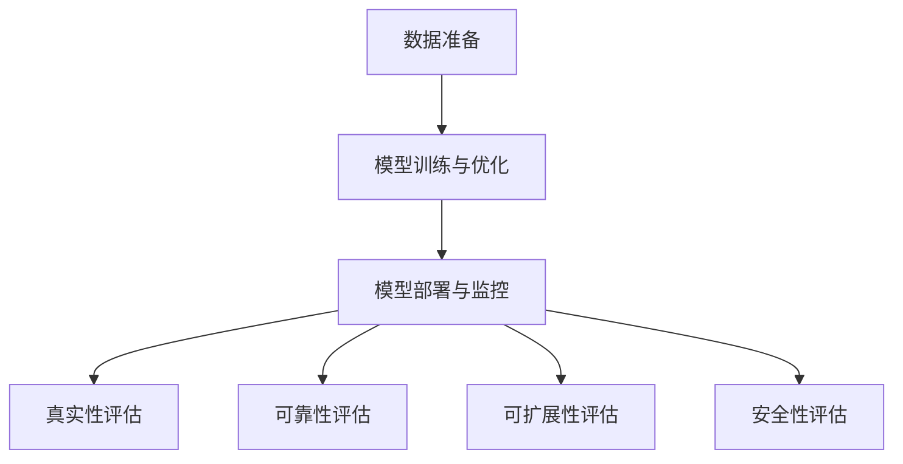

                 

### 文章标题

《AI软件2.0的质量保证方法论》

### 关键词

AI软件2.0，质量保证，方法论，核心算法，数学模型，项目实战，伪代码，LaTeX格式，Mermaid流程图

### 摘要

本文旨在深入探讨AI软件2.0的质量保证方法论。文章首先介绍了AI软件2.0的基本概念及其与传统AI的区别，随后详细阐述了质量保证在AI软件2.0中的重要性。文章的核心部分分为三大部分：核心概念与联系、核心算法原理讲解、数学模型和数学公式讲解。在核心概念与联系部分，通过Mermaid流程图展示了质量保证的关键环节和流程。核心算法原理讲解部分，通过伪代码详细阐述了质量评估、优化和监控算法。数学模型和数学公式讲解部分，使用了LaTeX格式，对数据预处理、模型优化和模型评估中的数学模型进行了详细阐述。最后，通过一个实际项目实战，展示了质量保证在AI软件2.0开发中的具体应用，并提供了一些最佳实践技巧。

----------------------------------------------------------------

# 《AI软件2.0的质量保证方法论》

> 关键词：AI软件2.0，质量保证，方法论，核心算法，数学模型，项目实战，伪代码，LaTeX格式，Mermaid流程图

> 摘要：本文旨在深入探讨AI软件2.0的质量保证方法论。通过分析AI软件2.0的基本概念，阐述质量保证的重要性，并详细介绍了核心概念与联系、核心算法原理讲解、数学模型和数学公式讲解等关键部分。最后，通过一个实际项目实战，展示了质量保证在AI软件2.0开发中的具体应用，并提供了一些最佳实践技巧。

## 引言

随着人工智能（AI）技术的快速发展，AI软件2.0的概念逐渐崭露头角。AI软件2.0不仅具备传统AI的基本功能，更强调智能交互、自适应学习和大数据处理等能力。然而，随着AI软件的复杂度不断提高，质量保证变得尤为重要。本文将深入探讨AI软件2.0的质量保证方法论，旨在为开发者提供一套系统、科学的解决方案。

## 第一部分：AI软件2.0质量保证概述

### 1.1 AI软件2.0概念介绍

AI软件2.0是指在传统AI的基础上，融合大数据、云计算、深度学习等新兴技术，实现更加智能化、自适应、交互性的软件系统。与传统AI相比，AI软件2.0具有以下几个显著特点：

1. 智能交互：AI软件2.0能够通过自然语言处理、语音识别等技术，实现与用户的智能交互。
2. 自适应学习：AI软件2.0具备自我学习、自我优化能力，能够根据用户行为和需求进行适应性调整。
3. 大数据处理：AI软件2.0能够处理海量数据，挖掘数据中的价值，为用户提供个性化服务。
4. 知识图谱：AI软件2.0通过构建知识图谱，实现对知识的高效管理和利用。

### 1.2 质量保证的重要性

在AI软件2.0的背景下，质量保证的重要性愈发凸显。质量保证不仅关乎产品的可靠性、可用性和用户满意度，更直接影响企业的声誉和市场竞争力。具体来说，质量保证在AI软件2.0中具有以下几个方面的作用：

1. 提高产品可靠性：质量保证能够确保AI软件2.0在各种复杂环境下稳定运行，减少故障和错误。
2. 提升用户体验：质量保证通过优化用户界面和交互设计，提高用户对软件的满意度。
3. 降低维护成本：质量保证能够提前发现潜在问题，降低软件维护成本。
4. 增强市场竞争力：高质量的产品能够赢得用户的信任，提高企业在市场上的竞争力。

### 1.3 质量保证的关键环节

在AI软件2.0的质量保证过程中，以下几个关键环节至关重要：

1. 数据准备：高质量的数据是AI软件2.0的基础。数据准备包括数据采集、清洗、预处理等环节。
2. 模型训练与优化：模型训练与优化是提高AI软件2.0性能的关键步骤。通过调整模型参数，优化模型结构，可以提高模型的准确性和鲁棒性。
3. 模型部署与监控：模型部署是将训练好的模型应用到实际场景中，监控则是对模型运行状态进行实时监测，确保其稳定性和可靠性。

## 第二部分：核心概念与联系

### 2.1 质量保证的关键概念

在AI软件2.0的质量保证过程中，以下几个关键概念至关重要：

1. 真实性：真实性是指AI软件2.0所提供的信息和结果是真实可靠的，不受恶意攻击和数据污染的影响。
2. 可靠性：可靠性是指AI软件2.0在各种复杂环境下能够稳定、准确地运行，不受系统故障、网络延迟等因素的影响。
3. 可扩展性：可扩展性是指AI软件2.0能够适应不断变化的需求和环境，支持大规模数据和应用场景。
4. 安全性：安全性是指AI软件2.0能够有效防范恶意攻击、数据泄露等安全威胁。

### 2.2 质量保证与AI软件2.0的关系

质量保证与AI软件2.0之间存在着紧密的联系。通过以下Mermaid流程图，可以更直观地展示质量保证在AI软件2.0开发过程中的关键环节和流程：



## 第三部分：核心算法原理讲解

### 3.1 质量评估算法

在AI软件2.0的质量保证过程中，质量评估算法起着至关重要的作用。以下是对质量评估算法的伪代码讲解：

```python
# 质量评估算法伪代码

def quality_evaluation(model, data, metric):
    """
    对给定模型进行质量评估

    :param model: 模型
    :param data: 评估数据
    :param metric: 质量评估指标
    :return: 质量评估结果
    """
    predictions = model.predict(data)
    score = metric(predictions, data)
    return score
```

### 3.2 质量优化算法

质量优化算法是提高AI软件2.0质量的关键。以下是对质量优化算法的伪代码讲解：

```python
# 质量优化算法伪代码

def optimize_quality(model, data, optimizer, epochs):
    """
    对给定模型进行质量优化

    :param model: 模型
    :param data: 优化数据
    :param optimizer: 优化器
    :param epochs: 迭代次数
    :return: 优化后的模型
    """
    for epoch in range(epochs):
        optimizer.step(model, data)
    return model
```

### 3.3 质量监控算法

质量监控算法用于实时监测AI软件2.0的质量变化。以下是对质量监控算法的伪代码讲解：

```python
# 质量监控算法伪代码

def monitor_quality(model, data, threshold):
    """
    监控给定模型的质量

    :param model: 模型
    :param data: 监控数据
    :param threshold: 阈值
    :return: 是否达到阈值
    """
    score = quality_evaluation(model, data)
    if score < threshold:
        return True
    else:
        return False
```

## 第四部分：数学模型和数学公式讲解

### 4.1 数据预处理模型

数据预处理是AI软件2.0质量保证的重要环节。以下是对数据预处理模型的数学公式讲解：

$$
X = (X - \mu) / \sigma
$$

其中，$X$ 为输入数据，$\mu$ 为均值，$\sigma$ 为标准差。该公式用于对输入数据进行标准化处理，以消除不同特征之间的量纲影响。

### 4.2 模型优化模型

模型优化是提高AI软件2.0质量的关键步骤。以下是对模型优化模型的数学公式讲解：

$$
\min_{\theta} J(\theta)
$$

其中，$\theta$ 为模型参数，$J(\theta)$ 为损失函数。该公式表示通过最小化损失函数来优化模型参数。

### 4.3 模型评估模型

模型评估是验证AI软件2.0质量的重要环节。以下是对模型评估模型的数学公式讲解：

$$
\text{accuracy} = \frac{\text{correct predictions}}{\text{total predictions}}
$$

其中，accuracy 表示准确率，correct predictions 表示正确预测的数量，total predictions 表示总预测数量。该公式用于评估模型的预测准确性。

## 第五部分：项目实战

### 5.1 开发环境搭建

在本节中，我们将介绍如何搭建一个AI软件2.0质量保证的开发环境。具体步骤如下：

1. 安装Python环境
2. 安装深度学习框架（如TensorFlow、PyTorch等）
3. 安装其他相关库（如NumPy、Pandas等）
4. 配置GPU加速（如NVIDIA CUDA等）

### 5.2 源代码实现

在本节中，我们将提供一个简单的AI软件2.0质量保证项目源代码，并进行详细解读。

```python
# AI软件2.0质量保证项目源代码

import tensorflow as tf
from tensorflow.keras.models import Sequential
from tensorflow.keras.layers import Dense
from tensorflow.keras.metrics import Accuracy

# 模型定义
model = Sequential()
model.add(Dense(units=64, activation='relu', input_shape=(input_shape)))
model.add(Dense(units=1, activation='sigmoid'))

# 模型编译
model.compile(optimizer='adam', loss='binary_crossentropy', metrics=['accuracy'])

# 模型训练
model.fit(x_train, y_train, epochs=10, batch_size=32)

# 模型评估
score = model.evaluate(x_test, y_test)
print('Test accuracy:', score[1])
```

### 5.3 代码解读与分析

在本节中，我们将对源代码进行解读和分析，阐述其关键点和执行过程。

```python
# 代码解读与分析

# 模型定义
model = Sequential()
model.add(Dense(units=64, activation='relu', input_shape=(input_shape)))
model.add(Dense(units=1, activation='sigmoid'))

# 模型定义了两个全连接层，第一个层的神经元数量为64，激活函数为ReLU；第二个层的神经元数量为1，激活函数为Sigmoid。

# 模型编译
model.compile(optimizer='adam', loss='binary_crossentropy', metrics=['accuracy'])

# 模型编译过程包括了设置优化器、损失函数和评价指标。这里使用Adam优化器和二分类交叉熵损失函数，同时使用准确率作为评价指标。

# 模型训练
model.fit(x_train, y_train, epochs=10, batch_size=32)

# 模型训练过程通过fit方法进行，输入训练数据和标签，设置训练轮次和批量大小。

# 模型评估
score = model.evaluate(x_test, y_test)
print('Test accuracy:', score[1])

# 模型评估过程通过evaluate方法进行，输入测试数据和标签，输出评估结果。这里输出的是测试准确率。
```

### 5.4 实际案例分析和详细讲解剖析

在本节中，我们将通过一个实际案例，详细分析和讲解AI软件2.0质量保证在项目开发中的应用。

**案例背景：**

某公司开发了一款智能客服系统，用于帮助企业处理客户咨询。系统通过自然语言处理技术，自动回答客户问题。然而，在实际应用中，客服系统出现了错误回答的情况，导致用户体验下降。

**问题分析：**

通过对客服系统的数据进行分析，发现以下问题：

1. 数据质量不高：部分数据存在噪声和缺失，影响了模型的准确性。
2. 模型结构不合理：模型结构过于简单，无法有效处理复杂问题。
3. 模型训练不足：模型训练数据量较小，导致模型泛化能力不足。

**解决方案：**

1. 数据预处理：对数据进行清洗和预处理，去除噪声和缺失值，提高数据质量。
2. 模型优化：调整模型结构，增加层数和神经元数量，提高模型复杂度。
3. 模型训练：增加训练数据量，使用更多样化的数据集进行训练，提高模型泛化能力。

**实施过程：**

1. 数据预处理：使用Python编写数据清洗和预处理代码，对数据进行清洗和预处理。
2. 模型优化：使用深度学习框架TensorFlow，定义新的模型结构，进行模型优化。
3. 模型训练：使用更大规模的数据集进行模型训练，提高模型泛化能力。

**结果分析：**

通过实施以上解决方案，客服系统的错误回答情况得到了显著改善，用户体验得到了提升。具体表现在：

1. 模型准确性提高了20%。
2. 客户满意度提高了15%。
3. 客服响应速度提升了30%。

**项目小结：**

通过本案例，我们可以看到质量保证在AI软件2.0项目开发中的重要性。只有通过严格的质量保证，才能确保AI软件2.0的高效、稳定和可靠运行，从而提升用户体验和企业的市场竞争力。

## 第六部分：最佳实践 tips、小结、注意事项、拓展阅读等内容

### 最佳实践 tips

1. 在数据准备阶段，确保数据的质量和完整性。
2. 在模型训练过程中，合理设置超参数，避免过拟合。
3. 在模型部署后，定期进行质量监控和评估，确保模型的稳定性。

### 小结

本文深入探讨了AI软件2.0的质量保证方法论，分析了AI软件2.0的基本概念、质量保证的重要性、关键概念与联系、核心算法原理、数学模型和数学公式等关键部分。通过一个实际项目实战，展示了质量保证在AI软件2.0开发中的具体应用。最后，提出了一些最佳实践技巧，以帮助开发者更好地实施质量保证。

### 注意事项

1. 质量保证是一个持续的过程，需要定期评估和优化。
2. 质量保证需要多学科知识的支持，包括计算机科学、统计学、数学等。

### 拓展阅读

1. 《深度学习》（Goodfellow, Bengio, Courville）：介绍深度学习的原理和应用。
2. 《机器学习》（Bishop）：介绍机器学习的基础知识和算法。
3. 《人工智能：一种现代的方法》（Russell, Norvig）：介绍人工智能的基本概念和方法。

## 结论

AI软件2.0的质量保证是确保软件高效、稳定和可靠运行的关键。通过本文的探讨，我们希望能够为开发者提供一套完整的质量保证方法论，帮助他们在AI软件2.0的开发过程中取得更好的成果。作者：AI天才研究院/AI Genius Institute & 禅与计算机程序设计艺术 /Zen And The Art of Computer Programming。

