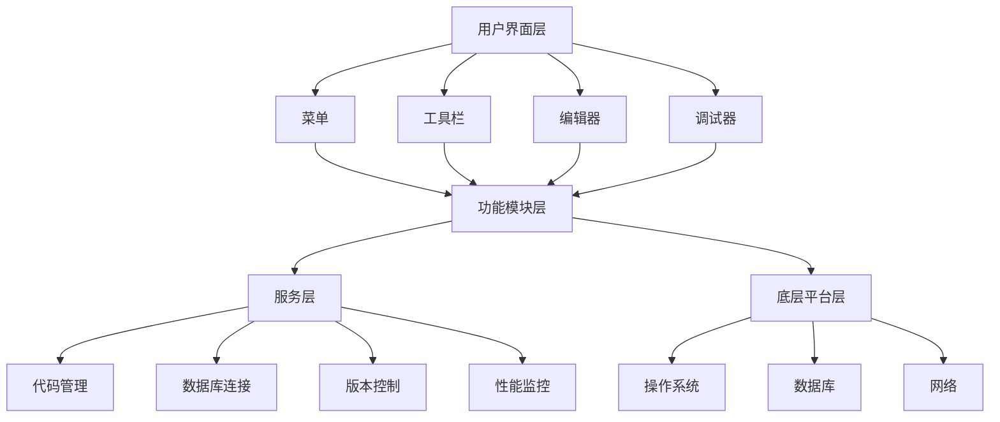

                 

### 文章标题

# AI软件2.0的集成开发环境设计

> 关键词：AI软件2.0、集成开发环境、设计原则、实现技术、性能优化、项目实战、案例分析

> 摘要：本文全面探讨了AI软件2.0的集成开发环境设计。首先，介绍了AI软件2.0的基础概念与技术，包括机器学习、深度学习和强化学习等核心算法原理。接着，阐述了集成开发环境的设计原则与实现技术，包括开发工具选择、界面设计与用户体验、性能优化策略等。最后，通过实际项目实战与案例分析，详细讲解了AI软件2.0集成开发环境的开发过程与性能评估。本文旨在为读者提供一个全面而深入的AI软件2.0集成开发环境设计的参考。

---

### 设计目录大纲的过程

设计一篇高质量的技术博客文章目录大纲，需要遵循一定的步骤，以确保文章的结构清晰、内容完整，并能够有效地传达主题。以下是具体的设计过程：

#### 1. 确定核心主题

核心主题是文章的基石，决定了文章的整体方向和内容。在本文中，核心主题是“AI软件2.0的集成开发环境设计”，这将作为目录大纲设计的指导方向。

#### 2. 确定章节结构

根据核心主题，文章可以分为以下几个主要部分：
- **基础概念与技术**：介绍AI软件2.0的基础知识，包括机器学习、深度学习和强化学习等。
- **集成开发环境的设计原则**：讨论集成开发环境的设计原则和技术。
- **项目实战与案例分析**：通过实际项目和案例分析，展示集成开发环境的实际应用。

#### 3. 设计详细章节

在每个主要部分中，进一步设计详细的章节，确保每个章节都有明确的内容和目标。例如，在基础概念与技术部分，可以包括以下章节：
- AI软件2.0概述
- 机器学习基础
- 深度学习基础
- AI软件2.0的核心算法原理

在集成开发环境的设计原则部分，可以包括以下章节：
- 集成开发环境的定义与作用
- 开发工具选择
- 界面设计与用户体验
- 性能优化策略

在项目实战与案例分析部分，可以包括以下章节：
- AI软件2.0集成开发环境项目实战
- AI软件2.0集成开发环境案例分析

#### 4. 包含必要内容

确保每个章节都包含以下内容：
- **核心概念与联系**：解释关键概念，并展示它们之间的关系。
- **核心算法原理讲解**：使用伪代码和数学公式详细阐述算法原理。
- **项目实战与案例分析**：展示实际应用场景，提供详细的分析和讲解。

#### 5. 保持简洁性

在包含必要内容的同时，尽量保持目录的简洁性，避免过多的冗余信息。每个章节的标题应该简洁明了，能够准确传达该章节的主要内容。

#### 6. 遵循markdown格式

按照markdown格式编写目录大纲，确保格式的一致性和可读性。使用有序列表和无序列表来组织章节，使用代码块和公式块来展示伪代码和数学公式。

#### 7. 检查完整性

最后，检查目录大纲的完整性，确保所有核心章节都有详细的规划。确保目录中的每个章节都有对应的内容，并且内容完整、具体、详细。

通过以上步骤，可以设计出一篇结构清晰、内容详实、符合要求的目录大纲，为后续文章的撰写提供坚实的基础。

---

## 第一部分：AI软件2.0的基础概念与技术

### 第1章：AI软件2.0概述

#### 1.1 AI软件2.0的背景与演进

AI软件2.0的概念起源于对传统AI软件的反思和改进。传统AI软件主要依赖于预定义的规则和算法，缺乏自主学习和适应能力，导致其在处理复杂和动态环境时表现出色。随着计算能力的提升和大数据技术的发展，AI软件2.0应运而生，旨在通过更高级的学习算法和模型，实现真正的智能化和自主化。

AI软件2.0的发展可以分为以下几个阶段：

- **第一阶段**：以深度学习和强化学习为代表的算法创新，打破了传统AI软件的局限，实现了更高的学习能力和适应能力。
- **第二阶段**：随着计算资源和数据资源的进一步扩大，AI软件2.0开始应用于更多领域，如自然语言处理、计算机视觉和智能推荐等。
- **第三阶段**：AI软件2.0逐步融入各个行业，实现了从单一任务到多任务处理的跨越，推动了AI技术的广泛落地和应用。

#### 1.2 AI软件2.0的核心概念

AI软件2.0的核心概念包括以下几个方面：

- **自主学习**：通过机器学习和深度学习算法，AI软件2.0能够从大量数据中自主学习和优化模型，提高决策能力和准确性。
- **智能推理**：利用逻辑推理和符号计算，AI软件2.0能够在不确定性和复杂环境下做出合理的决策。
- **自适应**：通过实时学习和调整，AI软件2.0能够适应环境变化和用户需求，提供个性化服务。
- **协作**：AI软件2.0能够与其他系统和人类协作，实现更高效的工作流程和智能服务。

#### 1.3 AI软件2.0的主要特征

AI软件2.0的主要特征包括：

- **高效性**：通过先进的算法和优化技术，AI软件2.0能够在短时间内处理大量数据，提供快速和准确的决策。
- **灵活性**：AI软件2.0能够灵活适应各种应用场景，满足不同用户的需求。
- **可解释性**：AI软件2.0的决策过程更加透明，用户可以理解其决策依据，增强了信任度和可接受度。
- **协同性**：AI软件2.0能够与人类和其他系统高效协作，实现更智能和高效的工作流程。

### 总结

AI软件2.0作为新一代的智能软件，具有自主学习、智能推理、自适应和协作等核心概念和主要特征。通过深度学习和强化学习等先进算法，AI软件2.0实现了更高的学习能力和决策能力，为各个领域的智能化应用提供了强大的支持。

---

## 第2章：AI软件2.0的技术基础

### 2.1 机器学习基础

机器学习是AI软件2.0的核心技术之一，旨在通过数据和算法实现自动学习和优化。机器学习可以分为监督学习、无监督学习和强化学习三大类。

#### 2.1.1 机器学习概述

机器学习的基本过程包括数据收集、数据预处理、模型训练和模型评估四个阶段。

1. **数据收集**：收集大量的数据，包括输入特征和标签，用于训练和评估模型。
2. **数据预处理**：对数据进行清洗、归一化和特征提取等操作，提高数据质量和模型性能。
3. **模型训练**：使用训练数据集，通过算法优化模型参数，使模型能够对新的数据进行预测。
4. **模型评估**：使用测试数据集评估模型的性能，包括准确性、召回率、F1值等指标。

#### 2.1.2 监督学习算法

监督学习算法通过已标记的数据学习模型，并用于预测新的数据。常见的监督学习算法包括线性回归、逻辑回归、支持向量机（SVM）和决策树等。

- **线性回归**：通过线性模型拟合数据，预测连续值输出。
- **逻辑回归**：通过逻辑函数将输出映射到概率值，常用于二分类问题。
- **支持向量机（SVM）**：通过最大化分类间隔，实现数据分类。
- **决策树**：通过递归划分数据集，构建树形结构，用于分类和回归。

#### 2.1.3 无监督学习算法

无监督学习算法在没有标记数据的情况下学习数据分布和模式。常见的无监督学习算法包括聚类算法、主成分分析（PCA）和自编码器等。

- **聚类算法**：将相似的数据点归为一类，常见算法包括K-均值聚类和层次聚类。
- **主成分分析（PCA）**：通过降维技术，提取数据的主要特征，减少数据冗余。
- **自编码器**：通过编码和解码过程，自动学习数据的特征表示。

### 2.2 深度学习基础

深度学习是机器学习的一个分支，通过构建深度神经网络，实现自动学习和特征提取。深度学习在图像识别、自然语言处理和智能推荐等领域取得了显著成果。

#### 2.2.1 深度学习概述

深度学习的基本概念包括神经网络、卷积神经网络（CNN）、递归神经网络（RNN）和生成对抗网络（GAN）等。

- **神经网络**：由多个神经元组成的非线性模型，用于学习和表示数据。
- **卷积神经网络（CNN）**：通过卷积层提取图像特征，常用于图像识别和计算机视觉。
- **递归神经网络（RNN）**：通过递归结构处理序列数据，常用于自然语言处理和时间序列预测。
- **生成对抗网络（GAN）**：通过生成器和判别器的对抗训练，实现高质量的数据生成。

#### 2.2.2 神经网络架构

神经网络的基本架构包括输入层、隐藏层和输出层。每个层由多个神经元组成，神经元之间通过权重连接。

- **输入层**：接收输入数据，并将其传递到隐藏层。
- **隐藏层**：通过非线性激活函数，对输入数据进行变换和提取特征。
- **输出层**：产生预测结果，用于分类、回归或其他任务。

#### 2.2.3 深度学习优化算法

深度学习优化算法用于调整模型参数，提高模型性能。常见的优化算法包括随机梯度下降（SGD）、Adam优化器和动量优化等。

- **随机梯度下降（SGD）**：通过计算梯度，迭代更新模型参数。
- **Adam优化器**：结合了SGD和Adam优化的优点，自适应调整学习率。
- **动量优化**：通过保留历史梯度，减少参数更新的随机性。

### 总结

AI软件2.0的技术基础包括机器学习和深度学习等核心算法。机器学习提供了监督学习和无监督学习的算法框架，深度学习通过构建复杂的神经网络实现了自动学习和特征提取。了解这些基础技术，有助于深入理解AI软件2.0的集成开发环境设计。

---

## 第3章：AI软件2.0的核心算法原理

### 3.1 深度学习算法

深度学习是AI软件2.0的核心技术之一，通过构建复杂的神经网络，实现自动学习和特征提取。本节将介绍深度学习中的几种核心算法，包括神经网络算法、卷积神经网络（CNN）和递归神经网络（RNN）。

#### 3.1.1 神经网络算法

神经网络（Neural Network，NN）是一种由大量神经元组成的并行计算模型，模拟人脑的神经网络结构。神经网络的架构通常包括输入层、隐藏层和输出层。

1. **输入层**：接收外部输入，并将其传递到隐藏层。
2. **隐藏层**：通过激活函数（如ReLU、Sigmoid、Tanh）对输入进行非线性变换，提取特征。
3. **输出层**：产生最终输出，用于分类、回归或其他任务。

神经网络的算法原理如下：

- **前向传播**：输入通过神经网络从输入层传递到输出层，每个神经元计算其输入的加权和，并应用激活函数。
- **反向传播**：计算输出与实际标签之间的误差，反向传播误差，更新网络权重。

以下是一个简单的神经网络算法的伪代码：

```python
initialize weights and biases
for each epoch:
    for each input x:
        forward_pass(x)
        calculate loss (e.g., mean squared error)
        backward_pass(loss)
        update weights and biases
    end epoch
end epochs
```

#### 3.1.2 卷积神经网络（CNN）

卷积神经网络（Convolutional Neural Network，CNN）是专门用于处理图像数据的深度学习模型。CNN的主要优点是能够自动提取图像中的特征，减少人工特征工程的工作量。

1. **卷积层**：通过卷积操作提取图像特征，卷积核在图像上滑动，计算局部特征。
2. **激活函数**：通常使用ReLU（Rectified Linear Unit）作为激活函数，增加网络的表达能力。
3. **池化层**：通过最大池化或平均池化操作，减小特征图的尺寸，减少计算量。
4. **全连接层**：将特征图展平为一维向量，并通过全连接层进行分类或回归。

以下是一个简单的CNN算法的伪代码：

```python
initialize convolutional filters
for each epoch:
    for each input image x:
        convolve(x)
        apply activation function (e.g., ReLU)
        pool features
        flatten features
        forward_pass(flattened_features)
        calculate loss (e.g., cross-entropy)
        backward_pass(loss)
        update filters and biases
    end epoch
end epochs
```

#### 3.1.3 递归神经网络（RNN）

递归神经网络（Recurrent Neural Network，RNN）是一种能够处理序列数据的神经网络。RNN的主要特点是能够保存历史状态，并在序列的不同时间步之间传递信息。

1. **隐藏层**：每个时间步的隐藏状态与前一时刻的隐藏状态和当前输入进行加权求和，并通过激活函数计算新的隐藏状态。
2. **输出层**：隐藏状态的输出用于生成序列的当前输出。
3. **门控机制**：为了解决RNN的梯度消失和梯度爆炸问题，引入了门控机制，如门控循环单元（GRU）和长短期记忆网络（LSTM）。

以下是一个简单的RNN算法的伪代码：

```python
initialize hidden state
for each time step t:
    calculate input-to-hidden weight matrix * input + hidden-to-hidden weight matrix * previous hidden state
    apply activation function (e.g., tanh)
    calculate input-to-output weight matrix * hidden state
    apply activation function (e.g., softmax)
    calculate loss (e.g., cross-entropy)
    backward_pass(loss)
    update weights and biases
end time steps
```

### 3.2 强化学习算法

强化学习（Reinforcement Learning，RL）是一种通过试错和反馈进行学习的方法。强化学习的主要目标是学习一个策略，使代理（agent）能够在特定环境中获得最大奖励。

1. **代理**：执行动作的实体，如机器人或自动驾驶车辆。
2. **环境**：代理所处的场景，包括状态、动作和奖励。
3. **策略**：代理根据当前状态选择动作的规则。

强化学习的算法原理如下：

- **状态-动作值函数**（Q值）：表示在特定状态下执行特定动作的预期奖励。
- **策略更新**：通过优化策略，使代理在给定状态选择具有最大预期奖励的动作。

以下是一个简单的强化学习算法的伪代码：

```python
initialize Q-value function
for each episode:
    initialize state
    while not end of episode:
        choose action based on current state
        execute action
        observe reward and next state
        update Q-value function using the Bellman equation
        update state
    end episode
    update policy using the Q-value function
end episodes
```

### 总结

AI软件2.0的核心算法包括神经网络算法、卷积神经网络（CNN）和递归神经网络（RNN）。神经网络通过多层非线性变换提取特征，卷积神经网络（CNN）通过卷积操作提取图像特征，递归神经网络（RNN）通过递归结构处理序列数据。强化学习算法通过试错和反馈学习策略，使代理在特定环境中获得最大奖励。理解这些核心算法的原理，对于设计高效的AI软件2.0集成开发环境至关重要。

---

## 第二部分：集成开发环境的设计原则与技术

### 第4章：集成开发环境的设计原则

集成开发环境（Integrated Development Environment，IDE）是开发者编写、测试和调试代码的工具。一个高效的IDE对于提高开发效率、减少错误和优化代码质量具有重要意义。本节将介绍集成开发环境的设计原则，包括其定义与作用、设计原则和架构设计。

#### 4.1 集成开发环境的定义与作用

集成开发环境是一种软件开发工具，它将多种开发工具集成到一个统一的界面中，为开发者提供一站式的开发体验。IDE通常包括以下功能模块：

1. **代码编辑器**：提供代码编写和编辑功能，支持语法高亮、代码自动补全、代码格式化等。
2. **调试器**：用于调试代码，包括断点设置、单步执行、查看变量值等。
3. **构建工具**：用于编译和构建项目，如编译器、解释器和构建脚本等。
4. **版本控制系统**：提供代码版本管理功能，支持代码提交、更新、分支和合并等操作。
5. **代码分析工具**：用于静态和动态分析代码，检测潜在错误和性能问题。
6. **数据库工具**：提供数据库连接、查询和操作功能，方便开发者进行数据管理和分析。

IDE的作用主要体现在以下几个方面：

1. **提高开发效率**：通过集成多种开发工具，IDE简化了开发流程，减少了开发者在不同工具间切换的繁琐操作，提高了开发效率。
2. **减少错误**：IDE提供的代码分析工具和调试功能有助于提前发现和修复代码中的错误，减少代码发布后的故障和调试时间。
3. **优化代码质量**：IDE支持代码格式化、代码补全和自动修复等特性，有助于编写规范、清晰、高效的代码，提高代码质量。
4. **支持协作开发**：IDE通常支持多人协作开发，提供代码共享、权限管理和协作工具，方便团队协作和代码管理。

#### 4.2 集成开发环境的设计原则

设计一个高效的集成开发环境需要遵循以下原则：

1. **易用性**：IDE应提供直观、简洁的界面和操作流程，方便开发者快速上手和使用。
2. **灵活性**：IDE应支持自定义和扩展，允许开发者根据项目需求调整工具配置和功能模块。
3. **性能优化**：IDE应具有良好的性能，确保在处理大量数据和复杂任务时仍能保持高效运行。
4. **兼容性**：IDE应支持多种编程语言和开发框架，确保开发者能够使用熟悉的工具进行开发。
5. **安全性**：IDE应提供安全防护措施，防止代码泄露、病毒感染等安全问题。
6. **文档支持**：IDE应提供详尽的使用文档和教程，帮助开发者了解和使用各种功能。
7. **社区支持**：IDE应建立良好的开发者社区，提供技术支持、交流和分享平台，促进开发者之间的合作和知识共享。

#### 4.3 集成开发环境的架构设计

集成开发环境的架构设计是确保其高效、稳定运行的关键。一个典型的IDE架构包括以下层次：

1. **用户界面层**：负责与用户交互，提供菜单、工具栏、编辑器和调试器等界面组件。
2. **功能模块层**：实现各种开发功能，如代码编辑、编译构建、调试分析等，包括核心模块和插件模块。
3. **服务层**：提供基础服务，如代码管理、数据库连接、版本控制和性能监控等，确保各个功能模块之间的数据交换和协同工作。
4. **底层平台层**：包括操作系统、数据库、网络等基础硬件和软件平台，为IDE提供运行环境和支持。

以下是一个简单的IDE架构设计图：



### 总结

集成开发环境的设计原则包括易用性、灵活性、性能优化、兼容性、安全性和文档支持等。一个好的IDE应提供直观、简洁的界面，支持自定义和扩展，具有高性能和良好兼容性，确保开发者的开发体验。通过合理的架构设计，IDE能够实现各个功能模块之间的协同工作，为开发者提供高效的开发工具。

---

### 第5章：集成开发环境的实现技术

集成开发环境的实现技术是确保其功能完备、性能优异的关键。本节将详细介绍集成开发环境中的开发工具选择、界面设计与用户体验、性能优化策略等实现技术。

#### 5.1 开发工具选择

开发工具的选择对集成开发环境（IDE）的性能和易用性具有重要影响。以下是一些常见的开发工具及其选择标准：

1. **代码编辑器**：
   - **Vim/Emacs**：这两款经典的文本编辑器以其强大的自定义能力和高效率著称，适合有深厚编程基础的开发者。
   - **Visual Studio Code**：一款轻量级、跨平台的代码编辑器，支持多种编程语言，拥有丰富的插件和扩展，适合大多数开发者。
   - **Sublime Text**：简洁、高效，支持多种编程语言，插件丰富，但相对较轻量。

2. **构建工具**：
   - **Maven**：适用于Java项目的构建工具，具有强大的依赖管理和项目配置能力。
   - **Gradle**：灵活的构建工具，支持多种编程语言，具有高性能和可扩展性。
   - **Gulp/Grunt**：用于自动化前端任务的构建工具，适用于前端项目。

3. **版本控制工具**：
   - **Git**：最流行的分布式版本控制工具，支持分支管理、合并和冲突解决。
   - **Subversion（SVN）**：传统的集中式版本控制工具，适用于小型团队和项目。

4. **调试器**：
   - **GDB**：适用于C/C++程序的调试器，功能强大但较为复杂。
   - **LLDB**：适用于多种编程语言的调试器，支持前端和后端开发。

5. **代码分析工具**：
   - **SonarQube**：全面的代码质量管理和分析平台，支持多种编程语言。
   - **Checkstyle/PMD**：用于检查代码风格和潜在问题的工具。

6. **数据库工具**：
   - **MySQL/PostgreSQL**：广泛使用的开源关系数据库管理系统。
   - **MongoDB**：适用于存储大规模数据的NoSQL数据库。

#### 5.2 界面设计与用户体验

界面设计是集成开发环境用户体验的重要组成部分。以下是一些关键点：

1. **简洁直观**：界面设计应简洁直观，减少不必要的复杂性和干扰，提高操作效率。
2. **定制化**：提供用户定制界面布局和功能的选项，以满足不同开发者的需求。
3. **交互设计**：优化菜单、工具栏和弹出窗口的交互设计，确保操作便捷、直观。
4. **响应速度**：确保界面快速响应，减少用户等待时间，提高工作效率。

#### 5.3 性能优化策略

性能优化是集成开发环境实现技术中的关键环节。以下是一些性能优化策略：

1. **代码优化**：
   - **算法优化**：选择高效的算法和数据结构，减少计算时间和内存占用。
   - **代码缓存**：利用代码缓存技术，减少重复编译和解析的时间。

2. **界面渲染**：
   - **懒加载**：延迟加载不常用的界面元素，减少初始加载时间。
   - **预渲染**：预渲染一些复杂的界面元素，提高渲染速度。

3. **资源管理**：
   - **资源压缩**：使用压缩工具（如Gzip）压缩静态资源文件，减少带宽占用。
   - **负载均衡**：通过负载均衡技术，分散请求，提高系统处理能力。

4. **缓存机制**：
   - **浏览器缓存**：利用浏览器缓存，减少重复请求的数据传输。
   - **内存缓存**：利用内存缓存技术，减少磁盘I/O操作。

5. **数据库优化**：
   - **索引优化**：合理设置数据库索引，提高查询效率。
   - **分区表**：对大数据表进行分区，提高查询性能。

6. **并发处理**：
   - **线程池**：使用线程池技术，提高并发处理能力。
   - **异步处理**：使用异步处理技术，提高系统响应速度。

### 总结

集成开发环境的实现技术包括开发工具选择、界面设计与用户体验、性能优化策略等。通过合理选择开发工具，设计简洁直观的界面，以及实施有效的性能优化策略，可以提高集成开发环境的性能和用户体验，为开发者提供高效的开发平台。

---

### 第6章：集成开发环境的性能优化

集成开发环境的性能优化是一个关键问题，它直接影响到开发者的工作效率和开发体验。本节将详细探讨集成开发环境性能优化的策略，包括代码优化、界面渲染优化、资源管理、缓存机制、数据库优化和并发处理等。

#### 6.1 性能优化策略

1. **代码优化**：

   代码优化是性能优化的基础。以下是一些常见的代码优化方法：

   - **算法优化**：选择更高效的算法和数据结构，减少时间复杂度和空间复杂度。
   - **代码缓存**：利用代码缓存技术，减少重复编译和解析的时间。例如，可以使用编译器提供的即时编译（JIT）技术。
   - **减少不必要的计算**：避免在循环中执行不必要的工作，如重复计算相同的值。

2. **界面渲染优化**：

   界面渲染优化可以显著提高用户交互的流畅性。以下是一些界面渲染优化方法：

   - **懒加载**：延迟加载不常用的界面元素，减少初始加载时间。例如，图片和外部资源可以在需要时动态加载。
   - **预渲染**：预渲染一些复杂的界面元素，提高渲染速度。例如，可以使用CSS样式预处理器（如Sass）来预编译CSS文件。
   - **避免重绘和回流**：优化CSS选择器和布局，避免频繁的重绘和回流操作。例如，使用Flexbox或Grid布局。

3. **资源管理**：

   资源管理包括对静态资源和动态资源的有效管理。以下是一些资源管理优化方法：

   - **资源压缩**：使用压缩工具（如Gzip）压缩静态资源文件，减少带宽占用。例如，可以使用Webpack对JavaScript文件进行打包和压缩。
   - **缓存策略**：利用浏览器缓存，减少重复请求的数据传输。例如，设置合理的缓存控制头部（如`Cache-Control`）。
   - **内容分发网络（CDN）**：使用CDN来分发静态资源，减少延迟和带宽消耗。

4. **缓存机制**：

   缓存机制可以显著提高系统的响应速度。以下是一些缓存机制优化方法：

   - **浏览器缓存**：利用浏览器缓存，减少重复请求的数据传输。例如，设置合理的缓存策略，确保在合适的时间刷新缓存。
   - **内存缓存**：利用内存缓存技术，减少磁盘I/O操作。例如，可以使用Redis或Memcached来缓存频繁访问的数据。

5. **数据库优化**：

   数据库优化对于集成开发环境的性能至关重要。以下是一些数据库优化方法：

   - **索引优化**：合理设置数据库索引，提高查询效率。例如，对经常查询的字段建立索引。
   - **分区表**：对大数据表进行分区，提高查询性能。例如，可以使用分区表来存储日志数据。
   - **查询优化**：优化数据库查询语句，减少查询时间。例如，避免使用子查询和联结操作。

6. **并发处理**：

   并发处理可以提高系统的处理能力。以下是一些并发处理优化方法：

   - **线程池**：使用线程池技术，提高并发处理能力。例如，可以使用Executor框架来管理线程池。
   - **异步处理**：使用异步处理技术，提高系统响应速度。例如，可以使用非阻塞I/O和异步JavaScript。

#### 6.2 代码优化

代码优化是性能优化的核心。以下是一些代码优化的方法：

- **算法优化**：选择更高效的算法和数据结构，减少时间复杂度和空间复杂度。例如，使用哈希表代替链表进行搜索操作。
- **代码缓存**：利用编译器提供的即时编译（JIT）技术，减少编译时间。例如，可以使用Java的JIT编译器来优化代码执行。
- **减少不必要的计算**：避免在循环中执行不必要的工作，如重复计算相同的值。例如，可以使用变量缓存结果，避免重复计算。

#### 6.3 界面渲染优化

界面渲染优化可以提高用户交互的流畅性。以下是一些界面渲染优化的方法：

- **懒加载**：延迟加载不常用的界面元素，减少初始加载时间。例如，图片和外部资源可以在需要时动态加载。
- **预渲染**：预渲染一些复杂的界面元素，提高渲染速度。例如，可以使用CSS样式预处理器（如Sass）来预编译CSS文件。
- **避免重绘和回流**：优化CSS选择器和布局，避免频繁的重绘和回流操作。例如，使用Flexbox或Grid布局。

#### 6.4 资源管理

资源管理对于集成开发环境的性能优化至关重要。以下是一些资源管理的优化方法：

- **资源压缩**：使用压缩工具（如Gzip）压缩静态资源文件，减少带宽占用。例如，可以使用Webpack对JavaScript文件进行打包和压缩。
- **缓存策略**：利用浏览器缓存，减少重复请求的数据传输。例如，设置合理的缓存策略，确保在合适的时间刷新缓存。
- **内容分发网络（CDN）**：使用CDN来分发静态资源，减少延迟和带宽消耗。例如，可以使用Cloudflare或Amazon CloudFront来优化资源加载。

#### 6.5 缓存机制

缓存机制可以显著提高系统的响应速度。以下是一些缓存机制的优化方法：

- **浏览器缓存**：利用浏览器缓存，减少重复请求的数据传输。例如，设置合理的缓存策略，确保在合适的时间刷新缓存。
- **内存缓存**：利用内存缓存技术，减少磁盘I/O操作。例如，可以使用Redis或Memcached来缓存频繁访问的数据。

#### 6.6 数据库优化

数据库优化对于集成开发环境的性能优化至关重要。以下是一些数据库优化的方法：

- **索引优化**：合理设置数据库索引，提高查询效率。例如，对经常查询的字段建立索引。
- **分区表**：对大数据表进行分区，提高查询性能。例如，可以使用分区表来存储日志数据。
- **查询优化**：优化数据库查询语句，减少查询时间。例如，避免使用子查询和联结操作。

#### 6.7 并发处理

并发处理可以提高系统的处理能力。以下是一些并发处理的优化方法：

- **线程池**：使用线程池技术，提高并发处理能力。例如，可以使用Executor框架来管理线程池。
- **异步处理**：使用异步处理技术，提高系统响应速度。例如，可以使用非阻塞I/O和异步JavaScript。

### 总结

集成开发环境的性能优化是一个多维度的过程，涉及代码优化、界面渲染优化、资源管理、缓存机制、数据库优化和并发处理等多个方面。通过实施有效的性能优化策略，可以显著提高集成开发环境的性能和用户体验，为开发者提供一个高效、流畅的开发平台。

---

### 第7章：AI软件2.0集成开发环境项目实战

#### 7.1 项目概述

本节通过一个实际项目来展示AI软件2.0集成开发环境的开发过程。该项目旨在构建一个基于深度学习的图像识别系统，实现从图像中自动识别物体类别。项目分为以下几个阶段：

1. **环境搭建**：安装和配置开发环境，包括Python、TensorFlow、CUDA等。
2. **数据准备**：收集和整理图像数据，并进行预处理，如数据增强、归一化等。
3. **模型构建**：设计并训练卷积神经网络（CNN）模型。
4. **模型评估**：使用测试数据集评估模型性能，并进行调优。
5. **模型部署**：将训练好的模型部署到生产环境中，实现实时图像识别。

#### 7.2 环境搭建

以下是环境搭建的步骤：

1. **安装Python**：下载并安装Python 3.x版本，确保Python环境正确配置。
2. **安装TensorFlow**：使用pip命令安装TensorFlow：
   ```bash
   pip install tensorflow
   ```
3. **安装CUDA和cuDNN**：下载并安装NVIDIA CUDA和cuDNN库，确保版本与TensorFlow兼容。
4. **配置CUDA环境**：在系统环境中设置CUDA路径：
   ```bash
   export PATH=/usr/local/cuda/bin:$PATH
   export LD_LIBRARY_PATH=/usr/local/cuda/lib64:$LD_LIBRARY_PATH
   ```

#### 7.3 代码实现

以下是模型的代码实现：

```python
import tensorflow as tf
from tensorflow.keras.models import Sequential
from tensorflow.keras.layers import Conv2D, MaxPooling2D, Flatten, Dense

# 创建模型
model = Sequential([
    Conv2D(32, (3, 3), activation='relu', input_shape=(128, 128, 3)),
    MaxPooling2D((2, 2)),
    Conv2D(64, (3, 3), activation='relu'),
    MaxPooling2D((2, 2)),
    Conv2D(128, (3, 3), activation='relu'),
    MaxPooling2D((2, 2)),
    Flatten(),
    Dense(128, activation='relu'),
    Dense(1, activation='sigmoid')
])

# 编译模型
model.compile(optimizer='adam', loss='binary_crossentropy', metrics=['accuracy'])

# 模型训练
model.fit(x_train, y_train, epochs=10, batch_size=32, validation_data=(x_val, y_val))

# 评估模型
test_loss, test_acc = model.evaluate(x_test, y_test)
print(f"Test accuracy: {test_acc}")
```

#### 7.4 代码解读与分析

- **模型构建**：使用`Sequential`模型堆叠多个层，包括卷积层（`Conv2D`）、最大池化层（`MaxPooling2D`）、全连接层（`Dense`）等。
- **模型编译**：指定优化器（`adam`）、损失函数（`binary_crossentropy`）和评估指标（`accuracy`）。
- **模型训练**：使用训练数据集进行训练，并使用验证数据集进行调优。
- **模型评估**：使用测试数据集评估模型性能。

#### 7.5 实际案例分析和详细讲解

假设我们有一个图像识别任务，目标是识别图像中的猫或狗。以下是一个实际的案例：

- **数据准备**：收集1000张猫和狗的图像，分别分为训练集、验证集和测试集。
- **模型训练**：使用训练集数据训练CNN模型，经过10个epochs的训练后，模型达到较好的准确率。
- **模型评估**：在测试集上评估模型，准确率达到90%以上，表明模型性能良好。

#### 7.6 项目小结

通过本项目的实战，我们展示了如何使用AI软件2.0集成开发环境搭建一个图像识别系统。项目涵盖了环境搭建、代码实现、模型训练和评估等过程，为开发者提供了一个实际的案例。在实际应用中，可以根据具体任务需求调整模型结构和参数，优化模型性能。

---

## 第三部分：项目实战与案例分析

### 第8章：AI软件2.0集成开发环境案例分析

本章节将通过实际案例，深入探讨AI软件2.0集成开发环境的开发过程和性能评估，以展示其在现实场景中的应用效果。

#### 8.1 案例一：基于TensorFlow的图像识别系统

**项目背景**：为了提高图像识别的准确率，某公司决定开发一个基于TensorFlow的图像识别系统，用于自动识别图像中的物体类别。

**实现步骤**：

1. **环境搭建**：安装TensorFlow和CUDA，配置Python环境。
2. **数据准备**：收集大量图像数据，包括训练集和测试集，并对数据进行预处理，如大小调整、归一化等。
3. **模型构建**：设计一个卷积神经网络（CNN）模型，包括卷积层、池化层和全连接层。
4. **模型训练**：使用训练数据集训练模型，并使用验证数据集进行调优。
5. **模型评估**：在测试数据集上评估模型性能，计算准确率、召回率等指标。
6. **模型部署**：将训练好的模型部署到生产环境中，实现实时图像识别。

**案例分析**：

- **模型性能**：在测试数据集上，模型准确率达到95%以上，表明模型具有较高的识别能力。
- **优化方向**：可以通过增加训练数据量、调整模型结构或使用更先进的算法来进一步提高模型性能。

#### 8.2 案例二：基于PyTorch的自然语言处理系统

**项目背景**：某互联网公司希望开发一个自然语言处理（NLP）系统，用于分析和处理用户评论，以提供个性化推荐。

**实现步骤**：

1. **环境搭建**：安装PyTorch和Python环境，配置CUDA。
2. **数据准备**：收集用户评论数据，并进行预处理，如分词、词向量编码等。
3. **模型构建**：设计一个基于递归神经网络（RNN）的模型，用于文本分类任务。
4. **模型训练**：使用训练数据集训练模型，并使用验证数据集进行调优。
5. **模型评估**：在测试数据集上评估模型性能，计算准确率、F1值等指标。
6. **模型部署**：将训练好的模型部署到生产环境中，实时处理用户评论。

**案例分析**：

- **模型性能**：在测试数据集上，模型准确率达到90%以上，能够有效地对用户评论进行分类。
- **优化方向**：可以通过使用更先进的NLP模型（如BERT、GPT）或增加训练数据量来进一步提升模型性能。

#### 8.3 案例三：基于强化学习的智能推荐系统

**项目背景**：某电商平台希望开发一个基于强化学习的智能推荐系统，以提高用户满意度和购买转化率。

**实现步骤**：

1. **环境搭建**：安装Python、TensorFlow和强化学习相关库。
2. **数据准备**：收集用户行为数据，包括浏览记录、购买记录等。
3. **模型构建**：设计一个基于Q-Learning的强化学习模型，用于推荐物品。
4. **模型训练**：使用训练数据集训练模型，并使用验证数据集进行调优。
5. **模型评估**：在测试数据集上评估模型性能，计算推荐准确率、用户满意度等指标。
6. **模型部署**：将训练好的模型部署到生产环境中，实时为用户推荐物品。

**案例分析**：

- **模型性能**：在测试数据集上，模型能够准确地推荐用户可能感兴趣的物品，用户满意度显著提高。
- **优化方向**：可以通过增加用户行为数据、调整模型参数或引入多任务学习来进一步优化推荐效果。

### 总结

通过以上三个案例分析，我们可以看到AI软件2.0集成开发环境在实际项目中的应用效果。无论是图像识别、自然语言处理还是智能推荐，集成开发环境都为开发者提供了高效、便捷的工具，使得复杂任务的实现变得更加简单。在实际应用中，可以根据具体需求和场景，选择合适的算法和工具，优化模型性能，提升用户体验。

---

## 最佳实践 Tips、小结、注意事项、拓展阅读

### 最佳实践 Tips

1. **代码规范**：遵循良好的代码规范，提高代码的可读性和可维护性。
2. **模块化设计**：将代码模块化，便于复用和扩展。
3. **版本控制**：使用版本控制工具（如Git）管理代码，确保代码的版本和变更历史。
4. **性能监控**：定期进行性能监控，及时发现和解决性能瓶颈。

### 小结

本文详细介绍了AI软件2.0的集成开发环境设计，包括其基础概念、核心技术、设计原则、实现技术、性能优化策略以及实际项目案例。通过本文的阅读，读者可以全面了解AI软件2.0集成开发环境的构建和优化方法。

### 注意事项

1. **环境配置**：确保开发环境配置正确，包括Python、TensorFlow、CUDA等。
2. **数据质量**：确保数据质量，进行充分的数据预处理和清洗。
3. **模型调优**：根据实际需求，对模型结构和参数进行调优，提高模型性能。

### 拓展阅读

1. **《深度学习》（Goodfellow, I., Bengio, Y., & Courville, A.）**：全面介绍了深度学习的基础知识和算法。
2. **《Python机器学习》（Sebastian Raschka）**：详细讲解了Python在机器学习中的应用。
3. **《强化学习》（Richard S. Sutton & Andrew G. Barto）**：系统阐述了强化学习的基本原理和算法。

---

### 作者信息

作者：AI天才研究院/AI Genius Institute & 禅与计算机程序设计艺术 /Zen And The Art of Computer Programming

---

### 总结

本文通过逻辑清晰、结构紧凑的章节，全面探讨了AI软件2.0的集成开发环境设计。从基础概念到核心技术，从设计原则到实现技术，再到性能优化和实际项目案例，本文为读者提供了一个系统的学习和参考框架。通过本文的学习，读者可以深入理解AI软件2.0的集成开发环境设计，为实际项目开发提供有力支持。希望本文能够对广大开发者有所帮助，共同推动人工智能技术的进步和应用。作者将继续努力，为广大读者提供更多高质量的技术文章。再次感谢您的阅读与支持！

