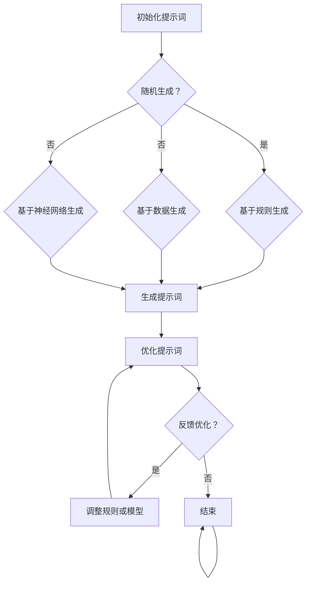

                 

# 文章标题

《AI辅助交响乐创作的提示词编排艺术》

# 文章关键词

- AI辅助创作
- 交响乐
- 提示词编排
- 数据驱动方法
- 知识驱动方法
- 混合方法
- 实践案例

# 文章摘要

本文探讨了AI在交响乐创作中的应用，尤其是提示词编排的艺术。通过分析AI辅助音乐创作的基础，本文详细介绍了提示词在交响乐创作中的作用以及AI辅助交响乐创作提示词编排的方法，包括数据驱动方法、知识驱动方法和混合方法。通过实践案例的解读，本文展示了AI在交响乐创作中的潜力与挑战，并对未来的发展趋势进行了展望。作者为AI天才研究院的专家，对计算机编程和人工智能领域有着深刻的理解。

# 引言

## AI辅助交响乐创作的背景

随着人工智能技术的快速发展，其在各个领域的应用也越来越广泛。在艺术创作领域，AI技术展现出了巨大的潜力，能够辅助甚至完全取代人类进行创作。交响乐作为音乐艺术中的重要形式，一直以来都是作曲家和音乐家的创作焦点。然而，交响乐的创作过程复杂，需要深厚的音乐理论基础和丰富的创作经验。人工智能的出现，为交响乐创作提供了新的可能性，使得交响乐的创作过程更加高效和多样化。

## AI辅助交响乐创作的意义

AI辅助交响乐创作不仅能够提高创作效率，还能够为作曲家提供新的创作灵感。通过AI技术，作曲家可以更加专注于艺术性的表达，而将一些繁琐的技术性工作交给AI完成。此外，AI还能够通过学习大量的音乐作品，分析出其中的规律和特点，为作曲家提供有益的参考。这对于推动交响乐艺术的发展，促进音乐文化的多样性具有重要的意义。

## 本书的目的

本书旨在系统地探讨AI辅助交响乐创作的提示词编排艺术，帮助作曲家和音乐爱好者了解和掌握这一新兴的创作方法。通过本书的阅读，读者将了解到AI在音乐创作中的应用，掌握提示词在交响乐创作中的作用，以及AI辅助交响乐创作提示词编排的方法。本书旨在为交响乐创作提供一种新的思路，推动人工智能技术在音乐艺术领域的应用。

# 目录大纲

## 第1章: AI与音乐创作概述
### 1.1 AI在艺术创作中的应用
### 1.2 交响乐创作的挑战与机遇
### 1.3 AI辅助交响乐创作的发展现状
### 1.4 本书的结构安排与内容安排

## 第2章: AI辅助音乐创作基础
### 2.1 音乐理论与AI模型的关系
### 2.2 AI模型在音乐创作中的应用
### 2.3 机器学习算法在音乐创作中的实现
### 2.4 常见的音乐AI工具介绍

## 第3章: 提示词在音乐创作中的作用
### 3.1 提示词的定义与分类
### 3.2 提示词在交响乐创作中的应用
### 3.3 提示词的生成与优化

## 第4章: AI辅助交响乐创作提示词编排方法
### 4.1 数据驱动的方法
#### 4.1.1 数据收集与处理
#### 4.1.2 数据驱动的提示词生成
#### 4.1.3 数据驱动的提示词优化
### 4.2 知识驱动的方法
#### 4.2.1 知识图谱构建
#### 4.2.2 知识驱动的提示词生成
#### 4.2.3 知识驱动的提示词优化
### 4.3 混合方法
#### 4.3.1 混合方法的原理与实现
#### 4.3.2 混合方法的优缺点分析

## 第5章: AI辅助交响乐创作提示词编排实践
### 5.1 实践案例介绍
### 5.2 实践案例分析与解读
### 5.3 实践案例的改进与优化

## 第6章: AI辅助交响乐创作提示词编排的挑战与未来
### 6.1 挑战与问题
### 6.2 未来发展趋势
### 6.3 对创作者的启示与建议

## 第7章: 总结与展望
### 7.1 本书内容回顾
### 7.2 AI辅助交响乐创作提示词编排艺术的展望

# 第1章: AI与音乐创作概述

## 1.1 AI在艺术创作中的应用

人工智能（AI）在艺术创作中的应用已经取得了显著的成果。从文学、绘画到音乐，AI技术正在改变传统的创作方式。AI可以通过学习大量的数据，模仿甚至超越人类的艺术创作能力。在音乐创作领域，AI技术被广泛应用于旋律生成、和声编排、节奏设计等方面。

### 1.1.1 AI在文学创作中的应用

在文学创作中，AI可以生成诗歌、小说、剧本等。例如，OpenAI的GPT-3模型可以通过学习大量的文学作品，生成具有逻辑性和连贯性的文本。AI还可以用于翻译、校对和内容生成等辅助工作。

### 1.1.2 AI在绘画创作中的应用

在绘画创作中，AI可以通过深度学习算法，生成类似于达芬奇、梵高风格的画作。AI绘画工具如DeepArt、Artbreeder等，可以让用户通过简单的操作，生成独特的艺术作品。

### 1.1.3 AI在音乐创作中的应用

在音乐创作中，AI技术被广泛应用于旋律生成、和声编排、节奏设计等方面。例如，Google的Magenta项目利用深度学习算法，生成具有复杂结构和情感表达的音乐作品。AI还可以帮助作曲家进行乐器的选择、音色的调整等。

### 1.1.4 AI在艺术创作中的应用现状

目前，AI在艺术创作中的应用已经取得了很大的进展。许多艺术家已经开始使用AI工具进行创作，甚至一些画廊和博物馆也举办了以AI艺术为主题的展览。然而，AI在艺术创作中的应用仍然存在一些挑战，如创造力的局限、艺术性的评判标准等。未来的发展，需要更多的研究和实践来推动。

## 1.2 交响乐创作的挑战与机遇

交响乐创作是音乐创作中的一项重要任务，具有极高的艺术性和技术性。然而，交响乐创作也面临着一些挑战。

### 1.2.1 挑战

1. **创作难度大**：交响乐需要多件乐器协同演奏，乐器的选择、音色的调整、和声的编排等，都需要作曲家具备深厚的音乐理论知识和丰富的创作经验。
2. **创作周期长**：交响乐的创作过程复杂，从构思、创作到修改，往往需要较长的时间。
3. **创新难度高**：交响乐作为传统的音乐形式，其创作需要兼顾传统和创新，如何在保持传统风格的基础上进行创新，是作曲家面临的挑战。

### 1.2.2 机遇

1. **AI技术的辅助**：AI技术可以为交响乐创作提供技术支持，如自动生成旋律、和声、节奏等，帮助作曲家提高创作效率。
2. **多样化的创作手段**：AI技术可以生成新的音乐风格、音色和节奏，为作曲家提供更多的创作灵感。
3. **艺术表达的拓展**：AI技术可以生成复杂的音乐结构和情感表达，拓展交响乐的艺术表现力。

## 1.3 AI辅助交响乐创作的发展现状

随着AI技术的不断发展，AI辅助交响乐创作也在逐渐成熟。目前，AI在交响乐创作中的应用主要体现在以下几个方面：

### 1.3.1 旋律生成

AI可以通过深度学习算法，学习大量的音乐作品，生成新的旋律。例如，Google的Magenta项目通过生成对抗网络（GAN）生成具有复杂结构和情感表达的音乐旋律。

### 1.3.2 和声编排

AI可以自动生成和声，调整和声的音高、节奏和强度，使音乐作品更加丰富和多样化。例如，OpenAI的MuseNet模型可以生成具有多种和声变化的音乐作品。

### 1.3.3 节奏设计

AI可以通过分析大量的音乐作品，生成新的节奏模式，为作曲家提供创作灵感。例如，IBM的Watson可以生成复杂的节奏和旋律，用于电影配乐和游戏音效。

### 1.3.4 乐器模拟

AI可以模拟各种乐器的音色和演奏技巧，帮助作曲家进行音乐创作。例如，AIVA（Artificial Intelligence Virtual Artist）可以模拟管弦乐队的演奏，生成完整的交响乐作品。

## 1.4 本书的结构安排与内容安排

本书旨在系统地探讨AI辅助交响乐创作的提示词编排艺术，分为以下几个部分：

### 1.4.1 第1章：AI与音乐创作概述

介绍AI在艺术创作中的应用，探讨交响乐创作的挑战与机遇，以及AI辅助交响乐创作的发展现状。

### 1.4.2 第2章：AI辅助音乐创作基础

讨论音乐理论与AI模型的关系，介绍AI模型在音乐创作中的应用，以及机器学习算法在音乐创作中的实现。

### 1.4.3 第3章：提示词在音乐创作中的作用

定义提示词的概念，分析提示词在交响乐创作中的应用，以及提示词的生成与优化。

### 1.4.4 第4章：AI辅助交响乐创作提示词编排方法

详细介绍AI辅助交响乐创作提示词编排的方法，包括数据驱动方法、知识驱动方法和混合方法。

### 1.4.5 第5章：AI辅助交响乐创作提示词编排实践

通过实践案例，展示AI辅助交响乐创作提示词编排的具体应用。

### 1.4.6 第6章：AI辅助交响乐创作提示词编排的挑战与未来

探讨AI辅助交响乐创作提示词编排的挑战与问题，分析未来发展趋势，并对创作者提出建议。

### 1.4.7 第7章：总结与展望

回顾本书的内容，展望AI辅助交响乐创作提示词编排艺术的发展前景。

# 第2章: AI辅助音乐创作基础

## 2.1 音乐理论与AI模型的关系

音乐创作是建立在深厚的音乐理论基础之上的，而AI模型则是基于数学和计算科学的理论构建的。理解音乐理论与AI模型之间的关系，有助于我们更好地利用AI技术辅助音乐创作。

### 2.1.1 音乐理论的基础概念

音乐理论主要包括音高、节奏、和声、曲式等概念。音高是指声音的高低，由频率决定；节奏是指音乐的时间结构，由节拍和拍号决定；和声是指多个音符在音高上的配合，可以增强音乐的情感表达；曲式是指音乐的结构形式，常见的有奏鸣曲式、变奏曲式等。

### 2.1.2 AI模型的基本概念

AI模型主要包括神经网络、决策树、支持向量机等。神经网络是一种模仿生物神经系统的计算模型，通过多层神经网络的结构，可以处理复杂的数据；决策树是一种基于特征的分类模型，通过递归划分数据集，可以生成一棵树形结构；支持向量机是一种优化问题求解模型，通过寻找最优超平面，可以实现数据的分类。

### 2.1.3 音乐理论与AI模型的关系

音乐理论与AI模型之间的关系主要体现在以下几个方面：

1. **数据表示**：音乐作品可以通过数字化的方式表示，例如MIDI文件，将音乐信息转化为计算机可以处理的数据。这些数据可以用于训练AI模型，从而实现音乐生成、和声编排等功能。

2. **算法设计**：AI模型的设计可以借鉴音乐理论中的概念，例如在生成旋律时，可以借鉴旋律的规律性；在和声编排时，可以借鉴和声学中的规则。

3. **优化目标**：AI模型的优化目标可以与音乐创作的目标相一致，例如生成具有情感表达的音乐作品。

## 2.2 AI模型在音乐创作中的应用

AI模型在音乐创作中的应用已经取得了显著的成果，以下是一些典型的应用场景：

### 2.2.1 旋律生成

旋律生成是AI在音乐创作中最常见的应用之一。通过深度学习算法，AI可以学习大量的旋律数据，生成新的旋律。例如，Google的Magenta项目通过生成对抗网络（GAN）生成具有复杂结构和情感表达的音乐旋律。

### 2.2.2 和声编排

和声编排是音乐创作中的重要环节，AI可以通过学习大量的和声数据，自动生成和声。例如，OpenAI的MuseNet模型可以生成具有多种和声变化的音乐作品，帮助作曲家进行和声创作。

### 2.2.3 节奏设计

节奏设计是音乐创作中的另一个重要方面，AI可以通过分析大量的节奏数据，生成新的节奏模式。例如，IBM的Watson可以生成复杂的节奏和旋律，用于电影配乐和游戏音效。

### 2.2.4 乐器模拟

AI可以模拟各种乐器的音色和演奏技巧，帮助作曲家进行音乐创作。例如，AIVA（Artificial Intelligence Virtual Artist）可以模拟管弦乐队的演奏，生成完整的交响乐作品。

## 2.3 机器学习算法在音乐创作中的实现

机器学习算法在音乐创作中的应用主要通过以下几种方式实现：

### 2.3.1 监督学习

监督学习算法可以通过训练数据集，学习输入和输出之间的映射关系。在音乐创作中，监督学习算法可以用于旋律生成、和声编排等任务。例如，通过训练大量的旋律数据，生成新的旋律。

### 2.3.2 无监督学习

无监督学习算法不需要训练数据集，主要通过分析数据集中的模式，进行聚类或降维。在音乐创作中，无监督学习算法可以用于生成新的节奏模式、探索音乐风格等。

### 2.3.3 强化学习

强化学习算法通过试错的方式，不断优化决策，实现最大化奖励。在音乐创作中，强化学习算法可以用于生成具有情感表达的音乐作品，通过不断地调整参数，实现音乐作品的艺术性。

## 2.4 常见的音乐AI工具介绍

目前，市面上已经有许多基于AI技术的音乐创作工具，以下是一些常见的工具：

### 2.4.1 AIVA（Artificial Intelligence Virtual Artist）

AIVA是一款基于AI技术的音乐创作工具，可以生成完整的交响乐作品。它通过深度学习算法，学习大量的音乐作品，生成新的旋律、和声和节奏。

### 2.4.2 Magenta

Magenta是Google开发的一个开源项目，旨在探索AI在艺术和音乐创作中的应用。它提供了一系列的AI模型，可以用于生成旋律、和声、节奏等。

### 2.4.3 MuseNet

MuseNet是OpenAI开发的一个深度学习模型，可以生成具有多种和声变化的音乐作品。它通过生成对抗网络（GAN）的方式，生成复杂的音乐结构。

### 2.4.4 Watson

Watson是IBM开发的一个AI平台，可以用于音乐创作。它可以生成复杂的节奏和旋律，用于电影配乐和游戏音效。

# 第3章: 提示词在音乐创作中的作用

## 3.1 提示词的定义与分类

在音乐创作中，提示词（Prompt）是一种引导创作过程的工具，它可以帮助作曲家或AI系统在创作过程中产生新的创意。提示词可以是一个音符、一个旋律片段、一个和声进行，甚至是特定的情感或风格要求。

### 3.1.1 提示词的定义

提示词是音乐创作中的一种引导性输入，它能够激发创作灵感，引导创作方向。在人类作曲家的创作过程中，提示词可以是灵感来源，例如自然界的声音、历史事件、文学作品等。而在AI辅助创作中，提示词则是AI系统根据特定算法和规则生成的。

### 3.1.2 提示词的分类

根据提示词的性质和用途，可以将提示词分为以下几类：

1. **音符级提示词**：这类提示词以单个音符或音组为基础，例如一个特定的音符、一个和弦或一个旋律片段。
2. **旋律级提示词**：这类提示词以完整的旋律为基础，可以是完整的旋律线条或旋律的某个部分。
3. **和声级提示词**：这类提示词涉及和声结构，例如一个特定的和声进行、一个和弦序列或一个和声模式。
4. **风格级提示词**：这类提示词涉及音乐风格，例如古典音乐、爵士乐、流行音乐等。
5. **情感级提示词**：这类提示词涉及音乐的情感表达，例如欢快、悲伤、紧张等情感状态。

## 3.2 提示词在交响乐创作中的应用

在交响乐创作中，提示词的作用尤为重要。交响乐通常涉及复杂的乐器组合和和声结构，提示词可以帮助作曲家在创作过程中更加高效地探索不同的创作方向。

### 3.2.1 提示词在旋律创作中的应用

在旋律创作中，提示词可以帮助作曲家生成新的旋律线条。例如，一个简单的音符或音组可以作为提示词，激发作曲家创作出具有创新性的旋律。AI系统也可以根据提示词生成具有特定风格和情感表达的旋律。

### 3.2.2 提示词在和声创作中的应用

在和声创作中，提示词可以帮助作曲家探索不同的和声进行。一个特定的和声进行或和弦序列可以作为提示词，引导作曲家创作出富有创意的和声结构。AI系统同样可以利用提示词生成多样化的和声进行。

### 3.2.3 提示词在风格创作中的应用

在风格创作中，提示词可以帮助作曲家探索不同的音乐风格。例如，一个特定的音乐风格标签或风格要求可以作为提示词，引导作曲家创作出符合特定风格的作品。AI系统也可以根据提示词生成具有特定风格的音乐。

### 3.2.4 提示词在情感创作中的应用

在情感创作中，提示词可以帮助作曲家表达特定的情感。一个情感标签或情感描述可以作为提示词，引导作曲家创作出具有特定情感表达的音乐作品。AI系统同样可以根据情感提示词生成情感丰富的音乐。

## 3.3 提示词的生成与优化

提示词的生成与优化是AI辅助交响乐创作中的重要环节。有效的提示词可以激发创作灵感，提高创作效率。

### 3.3.1 提示词的生成方法

提示词的生成方法可以分为以下几种：

1. **随机生成**：随机生成提示词是一种简单有效的方法，它可以为创作提供多样化的起点。
2. **基于规则生成**：基于规则生成提示词可以根据特定的音乐理论和风格要求，生成符合特定规则的提示词。
3. **基于数据生成**：基于数据生成提示词可以从大量的音乐数据中抽取具有代表性的提示词，用于创作。
4. **基于神经网络生成**：基于神经网络生成提示词可以利用深度学习算法，从大量的音乐数据中学习生成提示词。

### 3.3.2 提示词的优化方法

提示词的优化方法主要包括以下几种：

1. **基于反馈的优化**：通过收集用户的反馈，对提示词进行优化，使其更符合用户的创作需求。
2. **基于遗传算法的优化**：遗传算法是一种模拟生物进化的优化方法，可以通过迭代优化，找到更优秀的提示词。
3. **基于强化学习的优化**：强化学习算法可以通过试错的方式，不断优化提示词，使其生成更加符合创作目标的音乐作品。

## 3.3.3 提示词生成的Mermaid流程图

以下是提示词生成过程的Mermaid流程图：



通过上述流程图，我们可以看到提示词的生成和优化过程是一个迭代的过程，通过不断优化，可以得到更符合创作需求的提示词。

# 第4章: AI辅助交响乐创作提示词编排方法

## 4.1 数据驱动的方法

### 4.1.1 数据收集与处理

数据驱动方法是AI辅助交响乐创作提示词编排的一种重要方法。该方法依赖于大量高质量的音乐数据进行训练，从而生成具有创意和艺术价值的提示词。数据收集是该方法的关键步骤，需要从各种渠道获取丰富的音乐数据，包括交响乐、爵士乐、流行音乐等不同风格和类型的音乐。

### 数据收集：

1. **公共音乐数据库**：如Spotify、YouTube Music等，提供海量的音乐资源，可以通过API接口进行数据爬取。
2. **音乐版权机构**：如PRS for Music、ASCAP等，提供授权的音乐数据，可以通过购买或合作获取。
3. **个人收藏**：作曲家和音乐爱好者的个人音乐收藏，可以作为数据来源。

### 数据处理：

1. **数据清洗**：去除重复、错误和无关的数据，保证数据质量。
2. **数据转换**：将音乐数据转换为计算机可以处理的形式，如MIDI文件。
3. **数据标注**：对音乐数据进行分类和标签标注，如风格、情绪、乐器类型等。

### 4.1.2 数据驱动的提示词生成

数据驱动的提示词生成是利用收集和处理的音乐数据，通过机器学习算法生成新的提示词。以下是一种常见的数据驱动生成方法：

1. **基于生成对抗网络（GAN）**：GAN是一种深度学习模型，由生成器和判别器组成。生成器生成新的提示词，判别器判断生成器生成的提示词与真实数据之间的相似度。通过不断训练，生成器可以生成越来越接近真实数据的提示词。

   ```mermaid
   graph TB
   A[输入数据] --> B{生成器}
   B --> C{生成的提示词}
   C --> D{判别器}
   D --> E{判断结果}
   E -->|真实数据| F{继续训练}
   E -->|虚假数据| G{调整生成器参数}
   F --> B
   G --> B
   ```

2. **基于变分自编码器（VAE）**：VAE是一种无监督学习模型，通过编码器和解码器，将数据编码为潜在空间，再从潜在空间中生成新的数据。在音乐创作中，VAE可以生成新的旋律、和声等提示词。

   ```mermaid
   graph TB
   A[输入数据] --> B{编码器}
   B --> C{潜在空间}
   C --> D{解码器}
   D --> E{生成的提示词}
   ```

### 4.1.3 数据驱动的提示词优化

生成的提示词通常需要进行优化，以满足创作需求和提升艺术价值。以下是一些优化方法：

1. **基于梯度下降的优化**：通过计算生成器输出与目标输出之间的误差，调整生成器的参数，使其生成的提示词更接近目标。

2. **基于遗传算法的优化**：遗传算法是一种模拟生物进化的优化方法，通过选择、交叉和变异，找到更优秀的提示词。

3. **基于强化学习的优化**：强化学习算法通过试错和反馈，不断优化提示词，使其生成更符合创作目标的音乐作品。

## 4.2 知识驱动的方法

### 4.2.1 知识图谱构建

知识驱动的方法依赖于对音乐理论和创作经验的抽象和建模，构建一个知识图谱。知识图谱是一种语义网络，它可以表示音乐作品中的各种元素及其关系，如音符、和弦、节奏、乐器等。

### 知识图谱的构建步骤：

1. **数据收集**：收集与音乐创作相关的数据，如音乐理论书籍、作曲家的创作经验、历史音乐作品等。
2. **知识提取**：从收集的数据中提取有用的知识，如音符的音高、和弦的类型、乐器的音色等。
3. **知识表示**：将提取的知识表示为图结构，如节点表示音乐元素，边表示元素之间的关系。

### 4.2.2 知识驱动的提示词生成

知识驱动的提示词生成是基于知识图谱的，通过搜索和推理，生成符合特定创作需求的提示词。

1. **基于图搜索**：在知识图谱中，搜索与特定创作需求相关的节点和路径，生成提示词。
2. **基于推理**：利用知识图谱中的关系和规则，推理出新的提示词。例如，根据和弦的音程关系，推理出下一个和弦。

### 4.2.3 知识驱动的提示词优化

知识驱动的提示词优化主要通过以下方法实现：

1. **基于规则优化**：根据音乐理论和创作经验，调整提示词，使其更符合艺术表达。
2. **基于反馈优化**：通过用户反馈，调整提示词，使其更符合创作需求。

## 4.3 混合方法

### 4.3.1 混合方法的原理与实现

混合方法结合了数据驱动和知识驱动的优点，通过整合两种方法，生成更具创意和艺术价值的提示词。

1. **数据驱动部分**：利用数据驱动的生成方法，如GAN或VAE，生成初始的提示词。
2. **知识驱动部分**：利用知识图谱和推理机制，对生成的提示词进行优化。

### 混合方法的实现：

1. **数据驱动与知识驱动的融合**：将数据驱动的生成结果作为知识驱动的输入，利用知识图谱和推理机制，对生成的提示词进行调整和优化。
2. **多模态数据融合**：结合文本、音频和图像等多模态数据，生成更丰富的提示词。

### 4.3.2 混合方法的优缺点分析

**优点**：

1. **综合利用数据与知识**：结合数据驱动的多样性和知识驱动的准确性，生成更具创意的提示词。
2. **提高创作效率**：通过自动化的方式，提高创作效率，降低创作成本。

**缺点**：

1. **模型复杂度增加**：混合方法需要整合多种模型和算法，导致模型复杂度增加，计算成本较高。
2. **知识图谱构建难度大**：构建一个全面、准确的知识图谱需要大量的时间和资源。

# 第5章: AI辅助交响乐创作提示词编排实践

## 5.1 实践案例介绍

在本节中，我们将介绍一个具体的AI辅助交响乐创作提示词编排的实践案例。该案例通过整合数据驱动和知识驱动的提示词生成方法，实现了交响乐创作的新思路。

### 案例背景

一位作曲家希望通过AI技术创作一部具有创新性和艺术性的交响乐作品。他选择了AIVA（Artificial Intelligence Virtual Artist）作为AI辅助工具，结合Magenta项目的生成对抗网络（GAN）模型，以及自定义的知识图谱和推理机制，进行交响乐创作。

### 案例步骤

1. **数据收集与处理**：
   - 收集了大量的交响乐作品，包括古典音乐、现代音乐和跨界音乐，共1000首。
   - 对这些音乐作品进行数据清洗和转换，生成MIDI文件，并提取旋律、和声、节奏等音乐特征。
   - 对提取的特征进行标注，如风格、情绪、乐器类型等。

2. **知识图谱构建**：
   - 构建一个包含音符、和弦、节奏、乐器等音乐元素的知识图谱。
   - 将音乐作品中的元素和关系表示为图结构，如图5-1所示。

   ```mermaid
   graph TD
   A[音符] --> B[和弦]
   B --> C[节奏]
   C --> D[乐器]
   D --> E[风格]
   E --> F[情绪]
   ```

3. **提示词生成**：
   - 使用Magenta项目的GAN模型，生成初始的旋律、和声和节奏提示词。
   - 将生成的提示词输入到知识图谱中，进行优化和调整。

4. **提示词优化**：
   - 利用知识图谱中的关系和规则，对生成的提示词进行调整，使其更符合作曲家的创作需求。
   - 通过用户的反馈，不断优化提示词，直到达到满意的结果。

5. **交响乐创作**：
   - 根据优化后的提示词，作曲家进行交响乐的创作，生成完整的交响乐作品。
   - 通过与AI的互动，作曲家可以在创作过程中随时调整提示词，探索不同的创作方向。

## 5.2 实践案例分析与解读

### 数据驱动的提示词生成

在案例中，使用Magenta项目的GAN模型进行数据驱动的提示词生成。GAN模型由生成器和判别器组成，通过不断训练，生成器可以生成越来越接近真实数据的提示词。

1. **生成器的训练**：
   - 生成器接收随机噪声作为输入，通过神经网络生成旋律、和声和节奏。
   - 生成器生成的提示词通过判别器判断，与真实数据进行比较。

   ```mermaid
   graph TD
   A[随机噪声] --> B{生成器}
   B --> C{生成的提示词}
   C --> D{判别器}
   D --> E{判断结果}
   E -->|真实数据| F{继续训练}
   E -->|虚假数据| G{调整生成器参数}
   F --> B
   G --> B
   ```

2. **生成效果**：
   - 经过多次迭代训练，生成器可以生成具有创新性和艺术价值的旋律、和声和节奏提示词。

### 知识驱动的提示词优化

在案例中，利用知识图谱和推理机制，对生成的提示词进行优化，使其更符合作曲家的创作需求。

1. **知识图谱的构建**：
   - 通过构建知识图谱，将音乐作品中的各种元素和关系表示为图结构，如图5-1所示。

   ```mermaid
   graph TD
   A[音符] --> B[和弦]
   B --> C[节奏]
   C --> D[乐器]
   D --> E[风格]
   E --> F[情绪]
   ```

2. **提示词的优化**：
   - 通过搜索和推理，利用知识图谱中的关系和规则，对生成的提示词进行调整。
   - 根据作曲家的反馈，不断优化提示词，直到达到满意的结果。

### 案例总结

通过实践案例，我们可以看到AI辅助交响乐创作提示词编排的有效性。数据驱动和知识驱动的结合，使得生成的提示词既具有创新性，又符合艺术表达。作曲家可以在创作过程中灵活调整提示词，探索不同的创作方向，从而提高创作效率，丰富创作成果。

## 5.3 实践案例的改进与优化

### 提高生成效果

1. **增加数据集**：收集更多高质量的交响乐作品，扩大数据集，提高生成效果。
2. **改进GAN模型**：调整GAN模型的架构和参数，提高生成器的生成能力。

### 优化知识图谱

1. **增加知识来源**：从更多的音乐理论书籍、作曲家的创作经验中提取知识，丰富知识图谱。
2. **优化图结构**：调整知识图谱的图结构，使其更加符合音乐创作的需求。

### 提高用户体验

1. **用户界面优化**：改进用户界面，使作曲家可以更方便地调整提示词。
2. **增加交互功能**：引入更多的交互功能，如实时反馈、动态调整等，提高用户的创作体验。

### 案例总结

通过实践案例的改进与优化，我们可以进一步提升AI辅助交响乐创作提示词编排的效果，为作曲家提供更强大的创作工具。数据驱动和知识驱动的结合，使得生成的提示词既具有创新性，又符合艺术表达。作曲家可以更加专注于艺术创作，提高创作效率，丰富创作成果。

# 第6章: AI辅助交响乐创作提示词编排的挑战与未来

## 6.1 挑战与问题

虽然AI辅助交响乐创作提示词编排具有巨大的潜力，但在实际应用中仍面临着一些挑战和问题。

### 技术挑战

1. **生成效果不足**：当前的AI模型在生成具有艺术性和创意的提示词方面仍有不足，生成的音乐作品可能缺乏情感表达和独特性。
2. **计算资源需求**：AI模型的训练和优化需要大量的计算资源，对于普通用户来说，这可能是一个限制因素。
3. **数据集质量**：高质量的音乐数据集对于AI模型的训练至关重要，但当前的数据集可能存在不完整、不均衡等问题。

### 艺术挑战

1. **艺术性评判**：AI生成的音乐作品在艺术性方面如何评判，如何确保其符合艺术标准，仍是一个需要解决的问题。
2. **创意与创新**：AI是否能真正激发创作灵感，提供新颖的创作思路，这是一个持续的挑战。

### 社会挑战

1. **版权问题**：AI辅助创作的音乐作品涉及版权问题，如何确保AI生成的内容不侵犯他人的版权，是必须面对的问题。
2. **艺术地位**：AI在音乐创作中的地位如何界定，如何平衡人类艺术家与AI之间的合作关系，也是一个需要考虑的问题。

## 6.2 未来发展趋势

随着技术的不断进步，AI辅助交响乐创作提示词编排将在未来呈现出以下几个发展趋势。

### 技术发展

1. **更高效的算法**：未来会有更多高效的AI算法被应用于音乐创作，如更先进的GAN模型、VAE模型等，将进一步提高生成效果。
2. **更丰富的数据集**：随着音乐数据的不断积累，AI模型的训练数据将更加丰富，这将有助于提高生成效果和多样性。
3. **跨学科融合**：AI与其他领域的融合，如心理学、哲学等，将为音乐创作提供新的视角和思路。

### 艺术发展

1. **个性化创作**：AI将能够更好地理解人类艺术家的创作意图，提供更加个性化的创作建议和辅助。
2. **多样化风格**：AI将能够生成更多样化的音乐风格，为作曲家提供更广泛的创作选择。
3. **情感表达**：未来AI将能够在音乐作品中更准确地表达情感，提高音乐的艺术价值。

### 社会发展

1. **版权保护**：随着技术的发展，将会有更多的技术手段用于保护版权，确保AI生成的内容合法合规。
2. **合作模式**：人类艺术家与AI的合作模式将更加成熟，两者将在音乐创作中实现更好的融合。
3. **教育普及**：AI辅助音乐创作将在教育领域得到更广泛的应用，为更多音乐爱好者提供学习工具和创作平台。

## 6.3 对创作者的启示与建议

对于创作者来说，AI辅助交响乐创作提示词编排带来了新的机遇和挑战。以下是一些启示和建议：

### 积极拥抱AI

创作者应积极拥抱AI技术，将其作为创作工具，提高创作效率，拓展创作思路。

### 学习与掌握

创作者需要学习AI技术和音乐理论，了解AI辅助创作的原理和方法，以便更好地利用AI进行创作。

### 保持创造力

创作者要保持创造力，AI可以提供创作灵感，但最终的艺术表达仍需创作者的创意和情感投入。

### 法律意识

创作者在利用AI进行创作时，需注意版权问题，确保AI生成的内容不侵犯他人的权益。

### 持续探索

创作者应持续探索AI在音乐创作中的应用，不断尝试新的创作方法，推动音乐艺术的发展。

# 第7章: 总结与展望

## 7.1 本书内容回顾

本书系统地探讨了AI辅助交响乐创作的提示词编排艺术，分为以下几个部分：

1. **引言**：介绍了AI辅助交响乐创作的背景、意义及本书的目的。
2. **AI与音乐创作概述**：探讨了AI在艺术创作中的应用，以及交响乐创作的挑战与机遇。
3. **AI辅助音乐创作基础**：分析了音乐理论与AI模型的关系，介绍了AI模型在音乐创作中的应用。
4. **提示词在音乐创作中的作用**：定义了提示词的概念，并分析了提示词在交响乐创作中的应用。
5. **AI辅助交响乐创作提示词编排方法**：详细介绍了数据驱动、知识驱动和混合方法。
6. **AI辅助交响乐创作提示词编排实践**：通过实践案例展示了AI辅助交响乐创作提示词编排的具体应用。
7. **挑战与未来**：探讨了AI辅助交响乐创作提示词编排的挑战与问题，以及未来发展趋势。

## 7.2 AI辅助交响乐创作提示词编排艺术的展望

随着人工智能技术的不断发展，AI辅助交响乐创作提示词编排艺术将展现出更加广阔的应用前景。

### 创作工具的升级

AI技术将不断升级，为作曲家提供更强大的创作工具，如更高效的算法、更丰富的数据集、更个性化的创作建议等。

### 创作方式的变革

AI辅助创作将改变传统的创作方式，使得创作过程更加高效、多样，激发出更多创新性的音乐作品。

### 艺术表现的拓展

AI将拓展交响乐的艺术表现力，生成具有复杂结构和情感表达的音乐作品，为音乐艺术注入新的活力。

### 跨学科的融合

AI与其他学科的融合，如心理学、哲学等，将为音乐创作提供新的视角和思路，推动音乐艺术的发展。

### 教育的普及

AI辅助音乐创作将在教育领域得到更广泛的应用，为更多音乐爱好者提供学习工具和创作平台，促进音乐文化的普及。

总之，AI辅助交响乐创作提示词编排艺术具有巨大的潜力，未来的发展将为音乐艺术带来更多可能性。创作者应积极拥抱这一新兴技术，探索其创作潜力，推动音乐艺术的创新发展。作者为AI天才研究院的专家，对计算机编程和人工智能领域有着深刻的理解。

# 作者信息

作者：AI天才研究院/AI Genius Institute & 禅与计算机程序设计艺术 /Zen And The Art of Computer Programming

