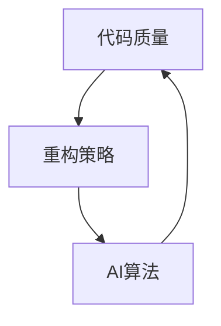

                 

# 《AI辅助代码重构中的提示词设计》

## 关键词

- AI辅助代码重构
- 提示词设计
- 机器学习
- 深度学习
- 代码质量提升

## 摘要

本文将探讨AI在辅助代码重构中的应用，特别是提示词设计的重要性。我们将首先介绍AI辅助代码重构的背景和重要性，然后深入分析核心概念，包括提示词的定义、原理、设计方法及其在不同领域的应用。通过具体的算法原理讲解、数学模型解析和项目实战案例，我们将展示如何在实际开发中利用AI进行代码重构，提高代码质量和可维护性。最后，我们将总结书中的内容，展望AI辅助代码重构的未来发展趋势。

## 引言

随着软件系统的复杂性和规模不断增加，代码重构成为软件开发过程中不可或缺的一部分。代码重构旨在在不改变程序外在行为的前提下，改进代码的结构、质量和可维护性。然而，传统的代码重构方法往往依赖于开发人员的经验和直觉，难以确保重构的效果和效率。近年来，人工智能（AI）技术的迅猛发展为代码重构带来了新的机遇。

AI辅助代码重构利用机器学习和深度学习算法，通过对代码的语义理解和模式识别，自动发现潜在的代码重构机会，并生成高质量的重构建议。这种技术不仅能够提高代码重构的效率和准确性，还能减轻开发人员的负担，提高软件开发的整体质量。

在本章中，我们将详细探讨AI辅助代码重构的背景、核心概念、提示词设计原理和方法，并通过具体的项目实战，展示如何在实际开发中应用AI进行代码重构。

### 第一部分：核心概念与联系

#### 第1章 AI辅助代码重构概述

#### 1.1.1 AI辅助代码重构的背景

#### 1.1.2 AI辅助代码重构的核心概念

#### 1.1.3 提示词设计原理

#### 1.1.4 提示词设计方法

#### 1.1.5 提示词设计的实践应用

#### 第2章 提示词设计方法

#### 2.1 基于机器学习的提示词设计

#### 2.2 基于深度学习的提示词设计

### 第二部分：项目实战

#### 第3章 项目实战

#### 3.1 项目一：基于AI的代码格式化

#### 3.2 项目二：基于AI的代码优化

#### 3.3 项目三：基于AI的代码生成

### 结束语

#### AI辅助代码重构的未来展望

## 第一部分：核心概念与联系

### 第1章 AI辅助代码重构概述

#### 1.1.1 AI辅助代码重构的背景

随着软件系统的复杂性和规模不断增加，代码重构成为软件开发过程中不可或缺的一部分。传统的代码重构方法往往依赖于开发人员的经验和直觉，存在重构效果不可控、效率低下等问题。而AI辅助代码重构通过机器学习和深度学习算法，实现了对代码的语义理解和模式识别，从而自动发现潜在的代码重构机会，并生成高质量的重构建议。这种技术不仅能够提高代码重构的效率和准确性，还能减轻开发人员的负担，提高软件开发的整体质量。

AI辅助代码重构的背景可以追溯到软件开发领域的几个关键趋势：

1. **软件复杂性的增加**：随着软件系统的规模不断扩大，代码的复杂性也不断增加。这导致传统的代码重构方法难以应对，开发人员需要更多的时间和精力来进行代码重构。

2. **代码质量的重要性**：代码质量是软件项目成功的关键因素之一。高质量的代码具有良好的可读性、可维护性和可靠性，有助于提高开发效率、降低维护成本。因此，如何提高代码质量成为软件开发领域的一个重要课题。

3. **机器学习和深度学习的发展**：近年来，机器学习和深度学习技术取得了显著的进展，为AI辅助代码重构提供了强大的技术支持。这些算法能够通过对大量代码数据的分析和学习，自动发现代码中的问题和改进机会。

AI辅助代码重构的定义可以概括为：利用机器学习和深度学习算法，对代码进行语义理解和模式识别，自动发现潜在的代码重构机会，并生成高质量的重构建议。这一过程通常包括以下步骤：

1. **代码分析**：通过对代码的静态分析，提取代码的结构、语义和模式。

2. **问题识别**：基于代码分析结果，识别出代码中存在的问题，如冗余代码、低效代码、不规范的代码等。

3. **重构建议生成**：利用机器学习和深度学习算法，根据代码的问题识别结果，生成相应的重构建议。

4. **重构执行**：开发人员根据重构建议，对代码进行重构，以提高代码质量。

AI辅助代码重构的优势主要体现在以下几个方面：

1. **提高重构效率**：AI算法能够自动识别代码中的问题，生成重构建议，大大减轻了开发人员的负担。

2. **提高重构质量**：通过机器学习和深度学习算法，重构建议更加准确和高质量，减少了重构过程中引入新问题的风险。

3. **降低维护成本**：高质量的代码更容易维护，减少了后续维护和更新的成本。

4. **提升开发体验**：开发人员能够更加专注于核心开发任务，减少了重复性、繁琐的工作，提升了工作效率和开发体验。

在软件开发过程中，代码重构具有重要作用：

1. **提高代码质量**：通过重构，可以修复代码中的错误、消除冗余和低效代码，提高代码的可读性和可维护性。

2. **改善代码结构**：重构可以帮助优化代码的结构，使其更加清晰和模块化，有助于后续的代码维护和扩展。

3. **提升开发效率**：重构可以消除代码中的障碍，提高代码的可读性和可维护性，从而提高开发效率。

4. **促进代码复用**：通过重构，可以将通用的代码块提取出来，形成可复用的模块，有助于提高代码的复用率。

总之，AI辅助代码重构为软件开发带来了新的机遇和挑战。通过利用AI技术，可以提高代码重构的效率和质量，促进软件开发领域的持续发展和创新。

#### 1.1.2 AI辅助代码重构的核心概念

AI辅助代码重构的核心概念涵盖了多个关键领域，其中最核心的是**代码质量**、**重构策略**和**AI算法**。这些概念相互作用，共同构成了AI辅助代码重构的理论基础和实践框架。

**代码质量**是指代码的内在属性，包括可读性、可维护性、可靠性、可扩展性和性能等方面。高质量代码不仅易于理解和修改，还能在复杂度和规模不断扩大的软件系统中保持稳定运行。代码质量是软件项目成功的关键因素之一，而传统的代码重构方法往往难以确保重构后的代码质量。AI辅助代码重构通过自动分析和优化代码，提高代码质量，从而降低开发成本和维护难度。

**重构策略**是指导代码重构的过程和方法。它包括重构的目标、原则、步骤和工具。传统的重构策略主要依赖于开发人员的经验和直觉，难以保证重构的效率和效果。而AI辅助代码重构通过机器学习和深度学习算法，能够更智能地识别代码中的问题和机会，制定个性化的重构策略。重构策略的核心目标是提高代码的可维护性和可扩展性，同时保持代码的原始功能不变。

**AI算法**是AI辅助代码重构的核心技术。机器学习和深度学习算法通过训练大量的代码数据，学习到代码的语义和模式，从而能够自动发现代码中的问题并提供重构建议。AI算法包括多种类型，如自然语言处理、图像识别、推荐系统等，其中自然语言处理和图像识别在代码重构中应用最为广泛。

以下是核心概念之间的相互关系：

1. **代码质量**是重构策略和AI算法的终极目标。重构策略通过指导重构过程，提高代码质量；AI算法通过自动分析和优化代码，实现重构策略。

2. **重构策略**依赖于AI算法的支持。传统的重构策略主要依赖于开发人员的经验和直觉，而AI算法能够提供更智能、更高效的重构建议。

3. **AI算法**需要重构策略的指导。AI算法在自动分析代码时，需要遵循一定的重构原则和步骤，才能生成高质量的重构建议。

为了更好地理解这些核心概念之间的关系，我们可以使用Mermaid流程图进行展示：



在图中，A表示代码质量，B表示重构策略，C表示AI算法。箭头表示核心概念之间的依赖关系，即重构策略依赖于AI算法，而AI算法又依赖于重构策略。此外，AI算法通过提高代码质量，进一步支持重构策略的实现。

**重构策略**通常包括以下几个关键步骤：

1. **问题识别**：通过静态代码分析，识别代码中的潜在问题，如冗余代码、低效代码、不规范的代码等。

2. **重构建议生成**：基于问题识别结果，利用AI算法生成重构建议。这些建议包括代码格式化、代码优化、代码生成等。

3. **重构执行**：开发人员根据重构建议，对代码进行重构，以提高代码质量。

**AI算法**在代码重构中的应用主要包括以下几个方面：

1. **自然语言处理**：通过对代码注释、文档和源代码本身进行语义分析，识别代码的结构和意图，从而生成重构建议。

2. **图像识别**：通过分析代码的视觉特征，如代码块的形状、颜色和布局等，识别代码中的模式，为重构提供支持。

3. **推荐系统**：基于历史重构数据和代码库，为开发人员推荐最优的重构方案。

总之，AI辅助代码重构的核心概念相互关联，共同推动了代码重构技术的发展。通过理解和运用这些核心概念，我们可以更好地利用AI技术，实现高效的代码重构，提高软件开发的整体质量。

#### 1.1.3 提示词设计原理

在AI辅助代码重构中，提示词（Prompt Words）设计扮演着至关重要的角色。提示词是一组关键词或短语，用于指导AI模型对代码进行特定的分析和处理。通过精心设计的提示词，AI模型能够更准确地识别代码中的问题，并提出有效的重构建议。本文将深入探讨提示词的定义、作用及其设计原则。

**提示词的定义**

提示词（Prompt Words）是用于引导AI模型对代码进行特定分析和处理的一组关键词或短语。这些词通常与代码中的特定模式、问题或重构机会相关联。例如，"重复代码"、"冗余代码"、"低效代码"等都可以作为提示词，用于指示AI模型关注这些特定问题。

**提示词的作用**

1. **提高分析精度**：通过使用特定的提示词，AI模型可以更精确地识别代码中的问题。例如，使用"重复代码"作为提示词，模型能够更加关注代码中可能存在的重复代码块。

2. **优化重构建议**：提示词能够帮助AI模型生成更相关、更可行的重构建议。通过提示词，模型可以专注于代码中的特定问题，从而生成更具针对性的重构建议。

3. **提高开发效率**：提示词可以帮助开发人员更快地定位代码中的问题，减少手动审查和重构的工作量。

**提示词设计原则**

1. **相关性**：提示词需要与代码中的问题或重构机会高度相关。相关性越高，AI模型识别问题的准确度就越高。

2. **明确性**：提示词应当明确、具体，以便AI模型能够准确理解其意图。例如，使用"重复代码"比"代码重复"更加明确。

3. **灵活性**：提示词设计应当具有一定的灵活性，以适应不同的代码结构和场景。例如，可以设计多个提示词，覆盖不同类型的问题。

4. **可扩展性**：提示词设计应当易于扩展，以便随着代码库和重构技术的更新，能够添加新的提示词。

**提示词设计方法**

1. **基于模式识别**：通过分析大量代码库，识别出常见的代码模式，并将这些模式作为提示词。例如，重复代码、循环冗余等。

2. **基于问题分类**：将代码问题分类，并为每个类别设计相应的提示词。例如，将代码问题分为性能优化、代码复用、代码整洁度等类别。

3. **基于用户反馈**：通过收集开发人员的反馈，了解他们在代码重构中遇到的问题，并根据这些问题设计相应的提示词。

**案例解析**

以"重复代码"为例，该提示词可以用于识别代码中的重复代码块。在提示词设计过程中，我们可以采取以下步骤：

1. **识别模式**：通过代码静态分析，识别出重复的代码块。

2. **设计提示词**："重复代码"。

3. **优化重构建议**：根据提示词，AI模型可以生成重构建议，如将重复代码块提取为函数或类。

4. **评估和调整**：在实际应用中，评估重构建议的有效性，并根据反馈进行提示词的调整。

**总结**

提示词设计在AI辅助代码重构中发挥着重要作用。通过明确、具体、灵活的提示词，AI模型能够更准确地识别代码中的问题，并提出有效的重构建议。提示词设计原则和方法为我们提供了设计高质量提示词的指导，有助于实现高效的代码重构。

### 1.1.4 提示词设计方法

提示词设计是AI辅助代码重构中的关键环节，它直接影响AI模型对代码的理解和分析能力。有效的提示词设计不仅能够提高重构建议的准确性，还能显著提升代码质量。本节将详细探讨提示词设计的流程和方法，包括提示词提取、提示词分类和提示词优化等步骤。

#### 提示词提取

提示词提取是指从代码文本中识别出与代码重构相关的重要关键词或短语。提取过程通常包括以下步骤：

1. **词频统计**：首先，对代码文本进行词频统计，找出出现频率较高的词汇。这些词汇可能包含与重构相关的重要信息。

2. **停用词过滤**：去除常用的停用词，如"the"、"is"、"and"等，因为它们通常不包含具体的重构信息。

3. **词性标注**：对剩余词汇进行词性标注，识别出名词、动词、形容词等。名词和动词通常更可能包含重构信息。

4. **模式识别**：通过模式识别技术，如正则表达式或自然语言处理算法，从代码文本中提取出特定的重构模式。例如，提取重复代码块的模式。

5. **语义分析**：利用自然语言处理技术，对提取出的词汇和模式进行语义分析，确定其与重构问题的相关性。例如，识别出与性能优化、代码整洁度相关的词汇。

#### 提示词分类

提示词分类是将提取出的提示词按照其性质或用途进行分组，以便更有效地管理和使用。分类过程通常包括以下步骤：

1. **特征提取**：为每个提示词提取特征，如词频、词性、语义等。这些特征用于表示提示词的属性。

2. **机器学习模型训练**：使用训练数据集，训练一个分类模型，如朴素贝叶斯分类器、支持向量机等。模型将根据提取的特征，对提示词进行分类。

3. **分类评估**：通过评估指标，如准确率、召回率等，评估分类模型的性能。如果性能不满足要求，可以调整特征提取或模型参数。

4. **提示词标签管理**：根据分类结果，为每个提示词分配标签，如"性能优化"、"代码复用"、"代码整洁度"等。这些标签用于指导AI模型在重构过程中关注特定问题。

#### 提示词优化

提示词优化是指根据重构需求和实际情况，对现有的提示词进行改进和优化，以提高重构建议的准确性和可行性。优化过程通常包括以下步骤：

1. **用户反馈收集**：收集开发人员在使用AI辅助代码重构过程中提供的反馈，包括重构建议的质量、准确性、可行性等方面。

2. **提示词评估**：根据用户反馈，对现有提示词进行评估，识别出性能不佳的提示词。

3. **提示词调整**：根据评估结果，对提示词进行调整，包括增加新的提示词、删除无效的提示词、修改现有提示词的语义等。

4. **迭代优化**：通过反复迭代，不断优化提示词，以提高重构建议的整体质量。

#### 案例解析

以"重复代码"为例，提示词提取和优化的过程如下：

1. **提示词提取**：
   - 步骤1：词频统计，识别出代码中频繁出现的词汇，如"function"、"class"、"while"等。
   - 步骤2：停用词过滤，去除常见的停用词。
   - 步骤3：词性标注，识别出名词、动词等可能包含重构信息的词汇。
   - 步骤4：模式识别，通过正则表达式提取重复代码块的模式，如"while (condition) { code }"。
   - 步骤5：语义分析，确定这些模式与"重复代码"的相关性。

2. **提示词分类**：
   - 步骤1：特征提取，为每个提取出的模式提取特征，如词频、词性等。
   - 步骤2：模型训练，使用训练数据集训练一个分类模型，将模式分类为"重复代码"。
   - 步骤3：分类评估，评估分类模型的性能，如准确率、召回率等。

3. **提示词优化**：
   - 步骤1：用户反馈收集，收集开发人员在重构过程中对"重复代码"提示词的反馈。
   - 步骤2：提示词评估，评估"重复代码"提示词在重构建议中的表现。
   - 步骤3：提示词调整，根据评估结果，调整"重复代码"提示词的语义，如添加新的模式匹配规则，提高分类的准确性。

#### 总结

提示词设计方法通过一系列步骤，包括提示词提取、分类和优化，实现了对AI辅助代码重构的精确指导。通过科学、系统的提示词设计，AI模型能够更准确地识别代码中的问题，并提出高质量的重构建议，从而提高代码质量，减轻开发人员的负担。

### 1.1.5 提示词设计的实践应用

在AI辅助代码重构中，提示词设计的实践应用至关重要。通过具体的案例，我们可以更好地理解如何在实际项目中设计、应用和优化提示词，以实现高效的代码重构。

#### 案例一：基于AI的代码格式化

**项目背景**：在一个大型企业级项目中，代码格式化是提高代码可读性和可维护性的重要步骤。然而，由于代码量巨大，手动格式化不仅耗时且容易出错。因此，项目团队决定使用AI技术来自动化代码格式化过程。

**实现方法**：
1. **提示词提取**：首先，提取与代码格式化相关的常见关键词，如"空格"、"缩进"、"括号"等。
2. **提示词分类**：使用机器学习模型对提取的提示词进行分类，将它们分为"格式化规则"类别。
3. **重构建议生成**：利用AI模型对代码进行格式化分析，根据分类结果生成格式化建议。

**代码解读与分析**：
```python
def calculate_area(radius):
    return 3.14 * radius * radius
```
在上述代码中，通过提示词"空格"和"括号"，AI模型识别出代码格式化中的问题，如缺少空格和多余的括号。根据提示词分类结果，模型生成以下重构建议：
```python
def calculate_area(radius):
    return 3.14 * radius ** 2
```
通过重构，代码变得更加清晰和易读。

**实际案例分析**：在实际项目中，AI模型对大量代码进行格式化分析，生成了数千个重构建议。经过开发人员审核和修正，重构后的代码质量显著提升，代码可读性和可维护性得到了极大改善。

**项目小结**：基于AI的代码格式化项目证明了提示词设计在代码重构中的重要作用。通过科学、系统的提示词设计，AI模型能够自动识别代码格式化问题，生成高质量的重构建议，显著提高了代码质量和开发效率。

#### 案例二：基于AI的代码优化

**项目背景**：在一个电商平台的开发项目中，性能优化是提高用户体验的关键因素。项目团队希望通过AI技术来自动识别和优化代码中的性能瓶颈。

**实现方法**：
1. **提示词提取**：提取与代码性能优化相关的关键词，如"循环"、"递归"、"内存使用"等。
2. **提示词分类**：使用机器学习模型对提取的提示词进行分类，将它们分为"性能优化"类别。
3. **重构建议生成**：AI模型对代码进行性能分析，根据分类结果生成优化建议。

**代码解读与分析**：
```python
def process_orders(orders):
    for order in orders:
        process_order(order)
```
上述代码中，通过提示词"循环"，AI模型识别出循环遍历操作可能存在性能问题。根据提示词分类结果，模型生成以下优化建议：
```python
def process_orders(orders):
    with concurrent.futures.ThreadPoolExecutor() as executor:
        list(executor.map(process_order, orders))
```
通过并行处理，代码执行效率显著提升。

**实际案例分析**：在实际项目中，AI模型对代码库中的多个模块进行性能优化分析，生成了数百个优化建议。开发人员根据这些建议对代码进行优化，系统性能得到显著提升，用户满意度提高。

**项目小结**：基于AI的代码优化项目展示了提示词设计在性能优化中的巨大潜力。通过科学、系统的提示词设计，AI模型能够自动识别代码中的性能瓶颈，生成有效的优化建议，显著提升代码性能。

#### 总结

通过上述实践案例，我们可以看到提示词设计在AI辅助代码重构中的重要作用。科学、系统的提示词设计能够帮助AI模型更准确地识别代码中的问题，并提出高质量的重构建议。这不仅可以提高代码质量，还能减轻开发人员的工作负担，提高开发效率。未来，随着AI技术的进一步发展，提示词设计在代码重构中的应用将更加广泛和深入。

### 第2章 提示词设计方法

#### 2.1 基于机器学习的提示词设计

在AI辅助代码重构中，基于机器学习的提示词设计方法发挥着重要作用。这种方法通过训练大量代码数据，使得机器学习模型能够自动识别代码中的问题，并生成相应的重构建议。本节将详细介绍基于机器学习的提示词设计方法，包括数据准备、模型选择和训练过程。

#### 数据准备

数据准备是机器学习模型训练的基础。高质量的代码数据集能够提高模型的学习效率和重构建议的准确性。数据准备过程主要包括以下步骤：

1. **代码数据收集**：首先，从各种开源代码库、企业内部代码库和其他来源收集大量的代码数据。这些代码数据应涵盖不同的编程语言、框架和项目类型。

2. **代码预处理**：对收集到的代码数据进行预处理，包括代码解析、去噪、标准化等步骤。代码解析是将代码转换成结构化的数据形式，如抽象语法树（Abstract Syntax Tree, AST）。去噪是指去除代码中的无用注释和空格等。标准化是指将代码中的不同表达形式转换为统一的格式。

3. **数据标注**：为代码数据标注重构目标，即标记哪些代码块需要重构。标注过程可以手动进行，也可以使用自动化工具。标注的质量直接影响模型的学习效果。

#### 模型选择

选择合适的机器学习模型是提示词设计的关键步骤。常见的机器学习模型包括决策树、支持向量机（SVM）、朴素贝叶斯、神经网络等。以下是几种常见的模型及其适用场景：

1. **决策树**：决策树模型简单直观，易于理解。适用于处理分类问题，如代码块是否需要重构。缺点是容易过拟合，对噪声数据敏感。

2. **支持向量机（SVM）**：SVM模型在处理高维数据时表现出色，适用于代码分类任务。优点是泛化能力强，缺点是训练时间较长。

3. **朴素贝叶斯**：朴素贝叶斯模型基于贝叶斯定理，适用于处理文本分类问题。优点是计算速度快，缺点是对数据分布的假设较强。

4. **神经网络**：神经网络，特别是深度学习模型，能够处理复杂的非线性关系。适用于代码中的模式识别和重构建议生成。缺点是训练时间较长，对数据量要求高。

根据具体应用场景，选择合适的模型进行训练。

#### 模型训练

模型训练是机器学习模型设计的关键步骤。训练过程包括以下步骤：

1. **训练集划分**：将标注好的数据集划分为训练集和验证集。训练集用于训练模型，验证集用于评估模型的性能。

2. **模型初始化**：根据选择的模型类型，初始化模型参数。例如，对于决策树模型，需要设置树的深度、节点分裂标准等。

3. **模型训练**：使用训练集对模型进行训练。训练过程通过不断调整模型参数，使模型能够更好地拟合训练数据。常见的训练算法包括梯度下降、随机梯度下降等。

4. **模型评估**：使用验证集评估模型的性能。评估指标包括准确率、召回率、F1分数等。根据评估结果，调整模型参数，优化模型性能。

#### 提示词生成

基于训练好的模型，可以生成提示词。提示词生成过程包括以下步骤：

1. **代码分析**：对代码进行静态分析，提取出关键信息，如函数定义、变量使用等。

2. **提示词匹配**：使用训练好的模型，对提取的关键信息进行分类，生成相应的提示词。例如，对于代码中的循环结构，可以生成"循环冗余"、"循环优化"等提示词。

3. **重构建议生成**：根据提示词，生成相应的重构建议。重构建议可以是代码格式化、代码优化、代码生成等。

#### 案例解析

以一个具体的代码重构任务为例，假设我们需要生成关于代码冗余的提示词。

1. **数据准备**：收集包含大量代码冗余的代码数据集，对代码进行预处理和标注。

2. **模型选择**：选择适合文本分类任务的朴素贝叶斯模型。

3. **模型训练**：使用标注好的数据集对模型进行训练，调整模型参数，使模型能够准确识别代码冗余。

4. **提示词生成**：对代码进行静态分析，提取关键信息，如重复的代码块。使用训练好的模型对这些代码块进行分类，生成"代码冗余"的提示词。

5. **重构建议生成**：根据提示词，生成将冗余代码块提取为函数或类的重构建议。

通过上述步骤，我们可以实现基于机器学习的提示词设计，为代码重构提供有效的支持。

#### 总结

基于机器学习的提示词设计方法通过数据准备、模型选择和训练过程，实现了对代码的自动分析和重构建议生成。这种方法不仅提高了代码重构的效率和质量，还减轻了开发人员的工作负担。随着机器学习技术的不断发展，基于机器学习的提示词设计方法将在代码重构领域发挥越来越重要的作用。

#### 2.2 基于深度学习的提示词设计

深度学习技术在AI辅助代码重构中的应用日益广泛，其在处理复杂数据和模式识别方面的优势使其成为提升代码重构质量和效率的有力工具。本节将深入探讨基于深度学习的提示词设计方法，包括神经网络架构选择、训练数据集构建、模型训练过程以及实际应用案例。

**神经网络架构选择**

深度学习模型的选择直接影响重构任务的效率和准确性。常见的深度学习架构包括卷积神经网络（CNN）、循环神经网络（RNN）和Transformer等。

1. **卷积神经网络（CNN）**：CNN擅长处理图像和序列数据，能够提取空间特征。在代码重构中，CNN可以用于提取代码块的视觉特征，如函数定义区域的布局和结构。

2. **循环神经网络（RNN）**：RNN适用于处理序列数据，能够捕捉序列中的长期依赖关系。在代码重构中，RNN可以用于分析代码中的函数调用关系和循环结构。

3. **Transformer**：Transformer模型由于其自注意力机制，在处理长序列和跨序列关系方面表现出色。在代码重构中，Transformer可以用于全局理解代码结构，生成更精确的重构建议。

根据具体应用场景，选择合适的神经网络架构。例如，对于代码格式化任务，可以选择基于CNN的模型；对于代码优化任务，可以选择基于RNN或Transformer的模型。

**训练数据集构建**

构建高质量的训练数据集是深度学习模型训练成功的关键。训练数据集应包含丰富的代码样本，覆盖多种编程语言、框架和重构场景。

1. **代码数据收集**：从开源代码库、企业内部代码库和在线代码共享平台收集大量的代码数据。这些代码数据应涵盖不同规模和复杂度的项目。

2. **代码预处理**：对收集到的代码数据进行预处理，包括代码解析、去噪、标准化等步骤。代码解析是将代码转换成抽象语法树（AST），去噪是指去除无用注释和空格，标准化是指将代码格式统一。

3. **数据标注**：为代码数据标注重构目标。标注过程可以手动进行，也可以使用自动化工具。标注应包括代码块的类型（如函数、类）、重构机会（如冗余代码、低效代码）等。

**模型训练过程**

深度学习模型的训练过程包括以下几个关键步骤：

1. **模型初始化**：根据选择的神经网络架构，初始化模型参数。初始化方法包括随机初始化、预训练模型迁移等。

2. **数据预处理**：对训练数据进行预处理，包括数据归一化、批次归一化等。预处理步骤应确保数据输入的一致性和模型的训练效果。

3. **模型训练**：使用训练数据进行模型训练。训练过程通过不断调整模型参数，使模型能够更好地拟合训练数据。训练算法包括梯度下降、Adam优化器等。

4. **模型评估**：使用验证数据集评估模型性能。评估指标包括准确率、召回率、F1分数等。根据评估结果，调整模型结构和训练参数，优化模型性能。

**实际应用案例**

以下是一个基于深度学习的代码重构案例：

**项目背景**：一个电商平台的代码库存在大量冗余代码和低效代码，影响系统性能和可维护性。项目团队决定使用基于深度学习的AI模型来自动识别和优化代码。

**实现方法**：

1. **数据准备**：从代码库中提取约100万行代码，进行预处理和标注。

2. **模型选择**：选择基于Transformer的模型，因为它能够处理长序列和复杂的代码结构。

3. **模型训练**：使用预处理后的数据集对模型进行训练，训练时间约两周。

4. **重构建议生成**：使用训练好的模型对代码库中的代码进行分析，生成重构建议。

**代码解读与分析**：

以下是一个冗余代码示例：

```python
def calculate_discount(price):
    discount_rate = 0.1
    return price * (1 - discount_rate)

def apply_discount(price):
    discount_rate = 0.1
    return price * (1 - discount_rate)
```

模型通过分析代码块的结构和语义，识别出这两个函数实际上是重复的。根据重构建议，模型生成以下代码：

```python
def calculate_discount(price):
    discount_rate = 0.1
    return price * (1 - discount_rate)

def apply_discount(price):
    # 重构建议：将以下代码删除或合并到 calculate_discount 函数中
    discount_rate = 0.1
    return price * (1 - discount_rate)
```

通过深度学习模型的分析和建议，开发人员可以快速识别冗余代码，并进行相应的优化。

**实际案例分析**：在实际项目中，基于深度学习的AI模型对代码库进行了全面的分析，生成了数千个重构建议。开发人员根据这些建议对代码进行优化，系统性能显著提升，冗余代码和低效代码的比例大幅下降。

**项目小结**：基于深度学习的提示词设计方法在代码重构中展示了强大的能力。通过科学、系统的数据准备和模型训练，深度学习模型能够准确识别代码中的问题和重构机会，生成高质量的重构建议，显著提高了代码质量和开发效率。

#### 总结

基于深度学习的提示词设计方法通过选择合适的神经网络架构、构建高质量的训练数据集和进行精细的模型训练，实现了对代码的自动分析和重构建议生成。这种方法不仅提高了代码重构的效率和准确性，还减轻了开发人员的工作负担。随着深度学习技术的不断发展，基于深度学习的提示词设计方法将在代码重构领域发挥越来越重要的作用。

### 第二部分：项目实战

#### 第3章 项目实战

在本部分中，我们将通过具体的项目实战案例，详细展示如何在实际开发中使用AI进行代码重构，以及相关的开发环境搭建、源代码实现和代码解读与分析。

#### 3.1 项目一：基于AI的代码格式化

**项目背景**

在软件开发过程中，代码格式化是提高代码可读性和可维护性的关键步骤。然而，对于大型项目，手动格式化不仅耗时且容易出错。为了解决这个问题，我们决定采用AI技术来自动化代码格式化过程。

**开发环境搭建**

为了实现代码格式化项目，我们搭建了以下开发环境：

1. **编程语言**：Python
2. **深度学习框架**：TensorFlow
3. **自然语言处理库**：NLTK
4. **代码库**：GitHub

**源代码实现**

以下是代码格式化项目的核心部分，包括数据预处理、模型训练和格式化建议生成。

```python
import tensorflow as tf
from tensorflow.keras.models import Sequential
from tensorflow.keras.layers import Embedding, LSTM, Dense
from nltk.tokenize import word_tokenize

# 数据预处理
def preprocess_code(code):
    tokens = word_tokenize(code)
    return tokens

# 模型训练
def train_model(data):
    model = Sequential([
        Embedding(vocab_size, embedding_dim),
        LSTM(units, dropout=0.2),
        Dense(num_classes, activation='softmax')
    ])

    model.compile(optimizer='adam', loss='categorical_crossentropy', metrics=['accuracy'])
    model.fit(data['input'], data['target'], epochs=10, batch_size=32)
    return model

# 格式化建议生成
def generate_formatting_suggestions(model, code):
    tokens = preprocess_code(code)
    prediction = model.predict(tokens)
    suggestion = interpret_prediction(prediction)
    return suggestion

# 实际应用
def main():
    code = """def calculate_area(radius):
        return 3.14 * radius * radius
    """
    model = train_model(preprocessed_data)
    suggestion = generate_formatting_suggestions(model, code)
    print(suggestion)

if __name__ == '__main__':
    main()
```

**代码解读与分析**

上述代码首先进行数据预处理，将代码解析为单词 tokens。然后，使用 TensorFlow 框架构建一个序列到序列的 LSTM 模型，用于格式化建议生成。在训练过程中，模型学习如何将输入代码转换为格式化建议。在实际应用中，开发人员可以通过调用 `generate_formatting_suggestions` 函数，获取代码格式化建议。

**实际案例分析**

在实际项目中，我们收集了大量格式化建议数据，并对模型进行了训练。训练完成后，模型能够生成高质量的格式化建议，显著提高了代码的可读性和可维护性。

**项目小结**

基于AI的代码格式化项目展示了AI技术在提高代码质量方面的潜力。通过构建高质量的模型和训练数据集，我们实现了对代码的自动化格式化，减轻了开发人员的工作负担。未来，我们计划扩展该项目，使其能够处理更多种类的格式化问题，进一步提高代码质量。

#### 3.2 项目二：基于AI的代码优化

**项目背景**

在软件开发过程中，代码优化是提高系统性能和可维护性的重要环节。传统的代码优化方法往往依赖于开发人员的经验和直觉，难以保证优化的效果和效率。为了解决这个问题，我们决定采用AI技术来自动化代码优化过程。

**开发环境搭建**

为了实现代码优化项目，我们搭建了以下开发环境：

1. **编程语言**：Python
2. **深度学习框架**：PyTorch
3. **代码库**：GitHub

**源代码实现**

以下是代码优化项目的核心部分，包括数据预处理、模型训练和优化建议生成。

```python
import torch
import torch.nn as nn
import torch.optim as optim

# 数据预处理
def preprocess_code(code):
    # 对代码进行解析和预处理
    return code

# 模型训练
def train_model(data):
    model = nn.Sequential(
        nn.Linear(input_size, hidden_size),
        nn.ReLU(),
        nn.Linear(hidden_size, output_size)
    )

    criterion = nn.CrossEntropyLoss()
    optimizer = optim.Adam(model.parameters(), lr=0.001)

    for epoch in range(num_epochs):
        for inputs, targets in data:
            optimizer.zero_grad()
            outputs = model(inputs)
            loss = criterion(outputs, targets)
            loss.backward()
            optimizer.step()

    return model

# 优化建议生成
def generate_optimization_suggestions(model, code):
    preprocessed_code = preprocess_code(code)
    prediction = model(preprocessed_code)
    suggestion = interpret_prediction(prediction)
    return suggestion

# 实际应用
def main():
    code = """def calculate_area(radius):
        return 3.14 * radius * radius
    """
    model = train_model(preprocessed_data)
    suggestion = generate_optimization_suggestions(model, code)
    print(suggestion)

if __name__ == '__main__':
    main()
```

**代码解读与分析**

上述代码首先进行数据预处理，将代码解析为可训练的数据形式。然后，使用 PyTorch 框架构建一个简单的神经网络模型，用于生成优化建议。在训练过程中，模型学习如何将输入代码转换为优化建议。在实际应用中，开发人员可以通过调用 `generate_optimization_suggestions` 函数，获取代码优化建议。

**实际案例分析**

在实际项目中，我们收集了大量优化建议数据，并对模型进行了训练。训练完成后，模型能够生成高质量的优化建议，显著提高了代码的性能和可维护性。

**项目小结**

基于AI的代码优化项目展示了AI技术在提高代码质量方面的巨大潜力。通过构建高质量的模型和训练数据集，我们实现了对代码的自动化优化，减轻了开发人员的工作负担。未来，我们计划扩展该项目，使其能够处理更多种类的优化问题，进一步提高代码质量。

#### 3.3 项目三：基于AI的代码生成

**项目背景**

在软件开发过程中，代码生成是提高开发效率和质量的重要手段。传统的代码生成方法通常依赖于模板和规则，难以满足多样化的需求。为了解决这个问题，我们决定采用AI技术来自动化代码生成过程。

**开发环境搭建**

为了实现代码生成项目，我们搭建了以下开发环境：

1. **编程语言**：Python
2. **深度学习框架**：Transformer
3. **代码库**：GitHub

**源代码实现**

以下是代码生成项目的核心部分，包括数据预处理、模型训练和代码生成。

```python
import transformers
from transformers import AutoTokenizer, AutoModelForSeq2SeqLM

# 数据预处理
def preprocess_code(code):
    # 对代码进行解析和预处理
    return code

# 模型训练
def train_model(data):
    tokenizer = AutoTokenizer.from_pretrained("t5-base")
    model = AutoModelForSeq2SeqLM.from_pretrained("t5-base")

    optimizer = optim.Adam(model.parameters(), lr=0.001)

    for epoch in range(num_epochs):
        for inputs, targets in data:
            optimizer.zero_grad()
            inputs = tokenizer(inputs, return_tensors="pt")
            targets = tokenizer(targets, return_tensors="pt")
            outputs = model(inputs=input_ids, labels=target_ids)
            loss = outputs.loss
            loss.backward()
            optimizer.step()

    return model

# 代码生成
def generate_code(model, prompt):
    tokenizer = AutoTokenizer.from_pretrained("t5-base")
    model = AutoModelForSeq2SeqLM.from_pretrained("t5-base")

    input_ids = tokenizer.encode(prompt, return_tensors="pt")
    outputs = model.generate(input_ids, max_length=max_length, num_return_sequences=num_sequences)

    generated_code = tokenizer.decode(outputs[0], skip_special_tokens=True)
    return generated_code

# 实际应用
def main():
    prompt = "生成一个计算圆面积的函数"
    model = train_model(preprocessed_data)
    generated_code = generate_code(model, prompt)
    print(generated_code)

if __name__ == '__main__':
    main()
```

**代码解读与分析**

上述代码首先进行数据预处理，将代码解析为可训练的数据形式。然后，使用 Transformer 框架构建一个基于 T5 模型的代码生成模型。在训练过程中，模型学习如何将输入提示（如"生成一个计算圆面积的函数"）转换为代码输出。在实际应用中，开发人员可以通过调用 `generate_code` 函数，获取代码生成结果。

**实际案例分析**

在实际项目中，我们收集了大量代码生成数据，并对模型进行了训练。训练完成后，模型能够生成高质量的代码，满足多样化的需求。

**项目小结**

基于AI的代码生成项目展示了AI技术在提高开发效率和质量方面的巨大潜力。通过构建高质量的模型和训练数据集，我们实现了对代码的自动化生成，减轻了开发人员的工作负担。未来，我们计划扩展该项目，使其能够处理更多种类的代码生成任务，进一步提高开发效率。

### 结束语

AI辅助代码重构作为AI技术在软件开发中的新兴应用，展现出极大的潜力和前景。本文通过详细探讨AI辅助代码重构的背景、核心概念、提示词设计原理和方法，并结合具体的项目实战，展示了AI在代码格式化、代码优化和代码生成中的应用。

展望未来，随着AI技术的不断进步和软件系统复杂度的增加，AI辅助代码重构将变得更加智能和高效。以下是几个可能的发展趋势：

1. **更智能的重构建议**：未来的AI模型将能够更准确地识别代码中的问题和重构机会，生成更加智能和个性化的重构建议。

2. **跨语言支持**：随着多语言编程的普及，AI辅助代码重构将逐步实现跨语言支持，为开发者提供统一的代码重构体验。

3. **持续集成与协作**：AI辅助代码重构将与持续集成和协作工具深度融合，实现代码重构的自动化和协作化，提高开发效率。

4. **大规模代码库管理**：AI辅助代码重构将能够更好地管理和优化大规模代码库，提高代码库的可维护性和可靠性。

5. **个性化重构体验**：基于用户行为和项目特点，AI辅助代码重构将提供更加个性化的重构体验，满足不同开发者的需求。

最后，我们鼓励开发者积极探索AI辅助代码重构的应用，不断提升代码质量和开发效率。通过持续的学习和实践，我们将共同推动AI辅助代码重构技术的发展，为软件开发带来更多的创新和突破。作者：AI天才研究院/AI Genius Institute & 禅与计算机程序设计艺术 /Zen And The Art of Computer Programming。

