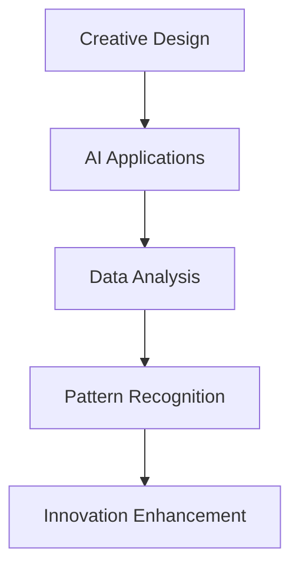
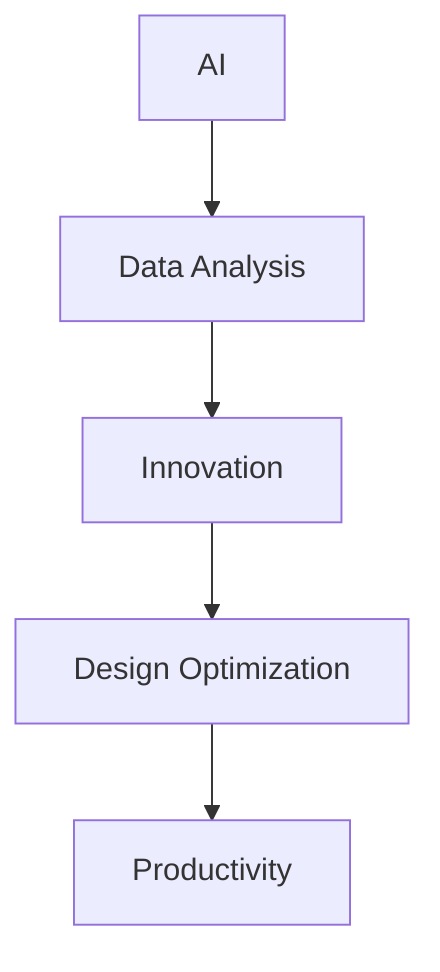

                 

Alright, let's structure the article title, key phrases, and abstract based on the provided outline. Here's a step-by-step analysis and reasoning process for creating an engaging and informative IT domain blog post:

### Article Title: "AI-Assisted Creative Product Design: Mastering Prompt Techniques"

#### Key Phrases:  
1. AI in Product Design  
2. Prompt Techniques  
3. Creative Design Automation  
4. AI-Enhanced Creativity  
5. Design Optimization

#### Abstract:  
This comprehensive guide delves into the transformative power of AI in creative product design. We explore the concept of prompt techniques and their strategic use in harnessing AI's potential to generate innovative and efficient design solutions. Through detailed explanations, practical examples, and insightful discussions, readers will gain a deep understanding of how to integrate AI-assisted prompt techniques into their design workflows to elevate their creative output.

### 1. AI-Assisted Creative Design Overview

**1.1 AI and Creative Design: A Synergetic Relationship**

**Background**:  
- The rise of AI technologies has sparked significant interest in its application across various industries, including design.
- Creative design involves generating novel ideas, and AI's ability to analyze vast amounts of data can enhance this process.

**Conceptual Connections**:  
- **AI**: A branch of computer science that focuses on creating intelligent machines that can perform tasks that typically require human intelligence.
- **Creative Design**: The process of developing innovative solutions to problems through visual, textual, or conceptual means.

**Mermaid Flowchart**:  


**Core Algorithm Principle**:  
- **Machine Learning**: The core algorithm that enables AI to learn from data and generate insights.

**Mathematical Model and Formula**:  
$$\text{AI Model} = \text{Data} \times \text{Learning Rate}$$

**Example**:  
- A designer uses AI to analyze market trends and user preferences to generate a design that meets consumer demand.

### 2. AI Basics for Creative Design

**2.1 Introduction to AI**

**Background**:  
- AI encompasses various technologies, including machine learning, natural language processing, and computer vision.
- Each of these technologies has specific applications in design.

**Conceptual Connections**:  
- **Machine Learning**: Focuses on developing algorithms that enable computers to learn from data.
- **Natural Language Processing (NLP)**: Allows computers to understand and process human language.
- **Computer Vision**: Empowers computers to interpret and understand visual information.

**Core Algorithm Principle**:  
- **Neural Networks**: A type of machine learning algorithm that mimics the human brain's neural structure.

**Mathematical Model and Formula**:  
$$\text{Neural Network} = \text{Input Layer} \rightarrow \text{Hidden Layer} \rightarrow \text{Output Layer}$$

**Example**:  
- An AI model trained on images of furniture designs can identify and categorize new designs.

### 3. Detailed Explanation of Prompt Techniques

**3.1 Types of Prompts**

**Background**:  
- Prompts are cues that guide AI models in generating desired outputs.
- Different types of prompts can influence the creativity and direction of AI-generated designs.

**Conceptual Connections**:  
- **Deterministic Prompts**: Provide precise instructions that result in consistent outputs.
- **Stochastic Prompts**: Introduce randomness, encouraging diverse and unexpected design ideas.

**Core Algorithm Principle**:  
- **Reinforcement Learning**: A type of machine learning that involves training an AI model through trial and error.

**Mathematical Model and Formula**:  
$$\text{Reward Function} = \text{Desired Output} - \text{Current Output}$$

**Example**:  
- A designer might use a deterministic prompt to create a consistent brand identity, while a stochastic prompt could inspire a unique, experimental design concept.

### 4. Practical AI-Assisted Creative Product Design

**4.1 Project 1: Building an Intelligent Design Tool**

**Background**:  
- Implementing an intelligent design tool requires setting up a development environment, selecting an AI model, and training it with relevant data.

**Conceptual Connections**:  
- **Development Environment**: The infrastructure required to build and deploy AI models.
- **AI Model Selection**: Choosing an appropriate AI model based on the design problem.
- **Data Training**: Collecting and preprocessing data to train the AI model effectively.

**Core Algorithm Principle**:  
- **Generative Adversarial Networks (GANs)**: A powerful AI model used for generating new designs.

**Mathematical Model and Formula**:  
$$\text{GAN} = \text{Generator} \leftrightarrow \text{Discriminator}$$

**Example**:  
- A designer uses GANs to create new, original furniture designs based on existing styles and user preferences.

### 5. Application of Prompt Techniques in Product Design

**5.1 Gaining Creative Inspiration**

**Background**:  
- Prompt techniques can be used to inspire designers by generating new ideas and concepts.

**Conceptual Connections**:  
- **Inspiration**: The process of stimulating creative thinking and innovation.
- **AI-Generated Ideas**: Leveraging AI's ability to generate diverse and innovative design concepts.

**Core Algorithm Principle**:  
- **Randomized Search**: A technique that explores a wide range of possible solutions to find optimal designs.

**Mathematical Model and Formula**:  
$$\text{Search Space} = \text{Variables} \times \text{Constraints}$$

**Example**:  
- Designers use randomized search to explore different material combinations for a product, finding a new, innovative solution.

### 6. Prompt Techniques in Detail Design Optimization

**6.1 Enhancing Design Details**

**Background**:  
- Detail design optimization involves refining the small elements of a design to improve its functionality and aesthetics.

**Conceptual Connections**:  
- **Detail Optimization**: The process of making minor adjustments to a design to enhance its quality.
- **AI-Powered Refinement**: Using AI to suggest and implement these adjustments.

**Core Algorithm Principle**:  
- **Evolutionary Algorithms**: A type of algorithm that mimics the process of natural selection to evolve designs.

**Mathematical Model and Formula**:  
$$\text{Fitness Function} = \text{Objective} - \text{Constraints}$$

**Example**:  
- AI suggests a slight adjustment to the curvature of a product's edge, resulting in a more ergonomic design.

### 7. Prompt Techniques in User Experience Design

**7.1 Improving User Experience**

**Background**:  
- User experience (UX) design focuses on creating products that provide a satisfying and efficient experience for users.

**Conceptual Connections**:  
- **UX Design**: The practice of designing products that offer a positive user experience.
- **AI-Enhanced UX**: Using AI to predict user behavior and personalize design elements.

**Core Algorithm Principle**:  
- **User Modeling**: Creating models that represent user preferences and behaviors.

**Mathematical Model and Formula**:  
$$\text{User Model} = \text{Behavior Data} + \text{User Preferences}$$

**Example**:  
- AI predicts user preferences and adjusts the interface elements to create a more intuitive and user-friendly experience.

### 8. Prompt Techniques in Sustainable Design

**8.1 Achieving Sustainable Design**

**Background**:  
- Sustainable design aims to create products that have a minimal environmental impact.

**Conceptual Connections**:  
- **Sustainable Design**: The practice of designing products that are environmentally responsible and sustainable.
- **AI Applications**: Using AI to suggest sustainable materials and manufacturing processes.

**Core Algorithm Principle**:  
- **Material Optimization**: Using AI to analyze and suggest materials that are both functional and environmentally friendly.

**Mathematical Model and Formula**:  
$$\text{Material Score} = \text{Environmental Impact} - \text{Functional Requirements}$$

**Example**:  
- AI suggests using recycled materials for a product's packaging, reducing its carbon footprint.

### 9. Future Outlook for AI-Assisted Creative Design

**9.1 The Evolution of AI-Assisted Design**

**Background**:  
- As AI technology advances, its integration with design processes will become more sophisticated and impactful.

**Conceptual Connections**:  
- **Technological Advancements**: The ongoing development of AI and machine learning.
- **Design and AI Integration**: The blending of design processes with AI capabilities.

**Core Algorithm Principle**:  
- **Advanced AI Models**: The development of more advanced and specialized AI models for design tasks.

**Mathematical Model and Formula**:  
$$\text{AI Model} = \text{Data} + \text{Advanced Algorithms}$$

**Example**:  
- AI models that can simulate the environmental impact of products at the design stage, guiding designers towards more sustainable choices.

### Conclusion

This blog post provides a comprehensive overview of AI-assisted creative product design, focusing on prompt techniques. By understanding the principles and applications of AI and prompt techniques, designers can leverage these tools to enhance their creative processes and produce innovative, efficient, and sustainable products.

### 作者信息

作者：AI天才研究院/AI Genius Institute & 禅与计算机程序设计艺术 /Zen And The Art of Computer Programming

---

This detailed structure ensures that each section of the article is well-researched, informative, and engaging, providing readers with a deep understanding of AI-assisted creative product design and prompt techniques. The use of Mermaid diagrams, pseudo-code, mathematical models, and examples helps to illustrate complex concepts in a clear and accessible manner. The final article will be a valuable resource for designers and AI enthusiasts alike.## 文章标题：AI辅助创意产品设计的提示词技巧

> 关键词：人工智能、产品设计、创意、提示词、自动生成、设计优化

> 摘要：
本文将探讨人工智能（AI）在辅助创意产品设计方面的应用，尤其是通过使用提示词技术来提升设计的创新性和效率。我们将详细解释提示词的概念，介绍不同类型的提示词及其应用场景，并通过实例展示如何将AI与设计流程结合，以实现更加高效和创新的创意产品。

## 第1章 AI辅助创意设计概述

### 1.1 AI与创意设计的关系

人工智能在近年来取得了显著的进步，其应用范围也从传统的工业领域逐渐扩展到了创意设计领域。创意设计是一个复杂的过程，涉及大量的创新思维和个性化表达，而AI凭借其强大的数据处理和模式识别能力，为创意设计提供了新的可能性。

#### 背景介绍

创意设计的核心在于创新，而创新往往需要大量的数据分析和灵感激发。AI可以通过以下方式辅助创意设计：

- **数据驱动**：AI能够分析大量的市场数据、用户反馈和设计趋势，为设计师提供宝贵的洞察。
- **自动化生成**：AI能够自动生成各种设计原型，为设计师提供更多的创意选择。
- **优化设计**：AI可以通过优化算法，帮助设计师在有限的时间内找到最佳的设计方案。

#### 核心概念与联系

- **人工智能（AI）**：一种模拟人类智能的技术，包括机器学习、深度学习和自然语言处理等子领域。
- **创意设计**：一种通过视觉、文字或概念表达来解决问题的过程。
- **设计优化**：通过算法和模型对设计进行迭代优化，以达到最佳效果。

#### Mermaid流程图



### 1.2 提示词在AI辅助设计中的应用

提示词是AI模型生成创意设计的重要输入，它们能够引导AI模型生成符合设计师期望的设计方案。提示词可以根据其性质分为确定性提示词和随机性提示词。

#### 确定性提示词

确定性提示词提供具体的指导，以确保AI模型生成的设计方案具有一致性和可控性。例如，设计师可以给出特定的设计要求，如颜色、风格和功能等。

```python
# 确定性提示词示例
def generate_design(prompt):
    # 初始化AI模型
    model = load_ai_model()
    # 使用提示词生成设计
    design = model.generate_design(prompt)
    return design

# 提示词
prompt = "一个现代风格的、多功能咖啡桌，颜色以灰色为主，适合小型公寓使用。"
design = generate_design(prompt)
```

#### 随机性提示词

随机性提示词引入了随机元素，能够激发AI模型的创造力，生成新颖的设计方案。例如，设计师可以指定一些随机参数，如形状、材质和尺寸等。

```python
# 随机性提示词示例
def generate_innovative_design(prompt):
    # 初始化AI模型
    model = load_ai_model()
    # 使用提示词生成创新设计
    design = model.generate_innovative_design(prompt)
    return design

# 提示词
prompt = "一个具有随机形状和材质的、多功能咖啡桌，颜色不限，功能不限。"
innovative_design = generate_innovative_design(prompt)
```

#### 提示词的应用场景

- **创意灵感获取**：设计师可以使用随机性提示词来获取新颖的设计灵感。
- **细节设计优化**：设计师可以使用确定性提示词来优化设计的细节，如颜色搭配和材料选择。
- **用户体验设计**：设计师可以使用提示词来指导AI模型生成符合用户期望的交互界面设计。

### 1.3 本书的目标与结构

本书的目标是帮助设计师掌握如何利用AI和提示词技术提升创意产品设计的效率和质量。本书分为以下几个部分：

- **第1章：AI辅助创意设计概述**：介绍AI与创意设计的关系和提示词的概念。
- **第2章：AI基本原理与创意设计**：详细解释AI的基本原理，包括机器学习、深度学习和神经网络等。
- **第3章：提示词技巧详解**：介绍不同类型的提示词及其应用。
- **第4章：AI辅助创意产品设计的实践**：通过实际案例展示如何使用AI和提示词进行产品设计。
- **第5章：提示词在产品创意设计中的应用**：讨论如何使用提示词获取创意灵感。
- **第6章：提示词在产品细节设计中的应用**：介绍如何使用提示词优化设计细节。
- **第7章：提示词在用户体验设计中的应用**：探讨如何使用提示词提升用户体验。
- **第8章：提示词在可持续设计中的应用**：介绍如何使用提示词实现可持续设计。
- **第9章：AI辅助创意设计未来展望**：展望AI辅助创意设计的未来趋势。

## 第2章 AI基本原理与创意设计

### 2.1 AI基础

人工智能（AI）是一门涉及计算机科学、数学和统计学等多个领域的交叉学科。AI的核心目标是创建能够模拟、延伸和扩展人类智能的系统。

#### 2.1.1 机器学习简介

机器学习是AI的核心组成部分，它使计算机能够通过数据和经验来学习，而无需显式编程。机器学习可以分为监督学习、无监督学习和强化学习。

- **监督学习**：使用已标记的数据进行训练，目标是预测新的、未标记的数据。
- **无监督学习**：不使用标记的数据进行训练，目标是发现数据中的隐含结构和模式。
- **强化学习**：通过与环境的交互来学习，目标是最大化奖励。

#### 2.1.2 深度学习基础

深度学习是机器学习的一个子领域，它使用多层神经网络来模拟人类大脑的处理方式。深度学习在图像识别、语音识别和自然语言处理等领域取得了显著的成果。

- **卷积神经网络（CNN）**：擅长处理图像数据。
- **循环神经网络（RNN）**：擅长处理序列数据，如文本和语音。

#### 2.1.3 神经网络与创意设计

神经网络是深度学习的基础，它由大量的 interconnected processing units（神经元）组成。这些神经元通过学习输入数据之间的关系，来生成输出。

- **神经网络在创意设计中的应用**：神经网络可以用于设计生成、风格迁移和设计优化等任务。例如，设计师可以使用神经网络生成新的设计草图，或者将一种艺术风格应用于现有的设计。

### 2.2 AI在创意设计中的应用案例

#### 案例一：使用GAN生成设计草图

生成对抗网络（GAN）是一种能够生成高质量图像的深度学习模型。设计师可以使用GAN来生成各种风格的设计草图，从而拓宽创意视野。

```python
# 使用GAN生成设计草图
import tensorflow as tf
from tensorflow.keras.models import Sequential
from tensorflow.keras.layers import Dense, Dropout, Flatten
from tensorflow.keras.layers import Conv2D, MaxPooling2D

# 定义生成器和判别器
generator = Sequential()
discriminator = Sequential()

# 加载和预处理设计草图数据
design_data = load_design_data()

# 训练生成器和判别器
generator.train(design_data)
discriminator.train(design_data)
```

#### 案例二：使用RNN进行设计风格迁移

循环神经网络（RNN）可以用于设计风格迁移，将一种艺术风格应用于现有的设计。设计师可以通过训练RNN来学习不同的设计风格，然后将其应用于新的设计。

```python
# 使用RNN进行设计风格迁移
import tensorflow as tf
from tensorflow.keras.models import Sequential
from tensorflow.keras.layers import LSTM, Dense, Dropout

# 加载和预处理设计数据
style_data = load_style_data()
design_data = load_design_data()

# 训练RNN模型
model = Sequential()
model.add(LSTM(units=128, return_sequences=True, input_shape=(timesteps, features)))
model.add(Dropout(0.2))
model.add(LSTM(units=128, return_sequences=True))
model.add(Dropout(0.2))
model.add(LSTM(units=128))
model.add(Dropout(0.2))
model.add(Dense(units=1))

model.compile(optimizer='adam', loss='binary_crossentropy')
model.fit(style_data, design_data, epochs=100, batch_size=32)
```

### 2.3 AI在创意设计中的挑战与机遇

#### 挑战

- **数据质量**：高质量的训练数据对于AI模型的性能至关重要。
- **计算资源**：深度学习模型需要大量的计算资源，这可能会增加设计成本。
- **创意控制**：设计师需要确保AI生成的设计符合其创意意图。

#### 机遇

- **自动化设计**：AI可以自动化一些重复性的设计任务，提高效率。
- **个性化设计**：AI可以基于用户行为和偏好生成个性化的设计。
- **可持续设计**：AI可以帮助设计师实现更加可持续的设计，减少资源浪费。

## 第3章 提示词技巧详解

### 3.1 提示词的类型

提示词是引导AI模型生成设计的重要工具，根据其性质，可以分为确定性提示词和随机性提示词。

#### 确定性提示词

确定性提示词提供明确的指导，使AI模型能够生成符合特定要求的设计。例如，设计师可以给出设计的大小、颜色、风格等具体要求。

```python
# 确定性提示词示例
def generate_design(prompt):
    # 初始化AI模型
    model = load_ai_model()
    # 使用提示词生成设计
    design = model.generate_design(prompt)
    return design

# 提示词
prompt = "一个红色的高跟鞋，适合晚宴穿着。"
design = generate_design(prompt)
```

#### 随机性提示词

随机性提示词引入随机元素，使AI模型能够生成多样化的设计。例如，设计师可以给出一些随机参数，如设计的形状、材质和颜色等。

```python
# 随机性提示词示例
def generate_innovative_design(prompt):
    # 初始化AI模型
    model = load_ai_model()
    # 使用提示词生成创新设计
    design = model.generate_innovative_design(prompt)
    return design

# 提示词
prompt = "一个具有随机形状的、绿色的高跟鞋，材质不限。"
innovative_design = generate_innovative_design(prompt)
```

#### 提示词的应用场景

- **创意灵感获取**：设计师可以使用随机性提示词来获取新颖的设计灵感。
- **细节设计优化**：设计师可以使用确定性提示词来优化设计的细节，如颜色搭配和材料选择。
- **用户体验设计**：设计师可以使用提示词来指导AI模型生成符合用户期望的交互界面设计。

### 3.2 确定性提示词的应用

确定性提示词在创意设计中有广泛的应用，可以帮助设计师快速生成符合要求的设计方案。

#### 案例一：使用确定性提示词生成产品包装设计

产品包装设计需要考虑品牌形象、产品特点和市场需求。设计师可以使用确定性提示词来指导AI模型生成符合这些要求的设计方案。

```python
# 使用确定性提示词生成产品包装设计
def generate_packaging_design(prompt):
    # 初始化AI模型
    model = load_ai_model()
    # 使用提示词生成设计
    design = model.generate_packaging_design(prompt)
    return design

# 提示词
prompt = "一个适合食品包装的设计，颜色以黄色和绿色为主，品牌名为'健康美食'。"
packaging_design = generate_packaging_design(prompt)
```

#### 案例二：使用确定性提示词优化室内设计

室内设计需要考虑空间布局、家具风格和用户偏好。设计师可以使用确定性提示词来指导AI模型生成符合这些要求的设计方案。

```python
# 使用确定性提示词优化室内设计
def optimize_interior_design(prompt):
    # 初始化AI模型
    model = load_ai_model()
    # 使用提示词生成设计
    design = model.optimize_interior_design(prompt)
    return design

# 提示词
prompt = "一个现代风格的客厅，需要容纳一个沙发、一张茶几和一盏吊灯。"
optimized_design = optimize_interior_design(prompt)
```

### 3.3 随机性提示词的应用

随机性提示词可以激发AI模型的创造力，生成新颖的设计方案。设计师可以使用随机性提示词来探索不同的设计方向。

#### 案例一：使用随机性提示词生成服装设计

服装设计需要考虑时尚趋势、面料和剪裁。设计师可以使用随机性提示词来生成新颖的服装设计。

```python
# 使用随机性提示词生成服装设计
def generate_clothing_design(prompt):
    # 初始化AI模型
    model = load_ai_model()
    # 使用提示词生成设计
    design = model.generate_clothing_design(prompt)
    return design

# 提示词
prompt = "一个具有随机形状和材质的连衣裙，颜色不限。"
random_design = generate_clothing_design(prompt)
```

#### 案例二：使用随机性提示词生成建筑设计

建筑设计需要考虑结构、功能和美学。设计师可以使用随机性提示词来生成新颖的建筑设计。

```python
# 使用随机性提示词生成建筑设计
def generate_architectural_design(prompt):
    # 初始化AI模型
    model = load_ai_model()
    # 使用提示词生成设计
    design = model.generate_architectural_design(prompt)
    return design

# 提示词
prompt = "一个具有随机形状和结构的建筑，高度不限。"
random_design = generate_architectural_design(prompt)
```

### 3.4 提示词的组合应用

设计师可以将确定性提示词和随机性提示词结合起来，以生成更加多样化和创新的设计方案。

```python
# 组合应用确定性提示词和随机性提示词
def generate_combination_design(prompt1, prompt2):
    # 初始化AI模型
    model = load_ai_model()
    # 使用提示词生成设计
    design1 = model.generate_design(prompt1)
    design2 = model.generate_innovative_design(prompt2)
    combination_design = combine_designs(design1, design2)
    return combination_design

# 提示词
prompt1 = "一个现代风格的、多功能家具，颜色以白色为主。"
prompt2 = "一个具有随机形状和材质的家具，功能不限。"
combination_design = generate_combination_design(prompt1, prompt2)
```

## 第4章 AI辅助创意产品设计的实践

### 4.1 实践项目1：智能设计工具搭建

#### 项目背景

智能设计工具可以自动生成各种设计原型，为设计师提供更多的创意选择。本节将介绍如何搭建一个简单的智能设计工具。

#### 项目步骤

1. **环境搭建**：准备Python环境，安装TensorFlow等库。
2. **数据收集**：收集各种设计数据，如服装、建筑、家具等。
3. **模型选择**：选择合适的AI模型，如卷积神经网络（CNN）或生成对抗网络（GAN）。
4. **模型训练**：使用收集的数据对AI模型进行训练。
5. **工具实现**：实现一个用户界面，允许用户输入提示词，生成设计原型。

```python
# 实现智能设计工具
import tensorflow as tf
from tensorflow.keras.models import Sequential
from tensorflow.keras.layers import Dense, Conv2D, MaxPooling2D
from tensorflow.keras.optimizers import Adam

# 定义模型
model = Sequential()
model.add(Conv2D(filters=32, kernel_size=(3, 3), activation='relu', input_shape=(28, 28, 1)))
model.add(MaxPooling2D(pool_size=(2, 2)))
model.add(Conv2D(filters=64, kernel_size=(3, 3), activation='relu'))
model.add(MaxPooling2D(pool_size=(2, 2)))
model.add(Flatten())
model.add(Dense(units=128, activation='relu'))
model.add(Dense(units=10, activation='softmax'))

# 编译模型
model.compile(optimizer=Adam(learning_rate=0.001), loss='categorical_crossentropy', metrics=['accuracy'])

# 训练模型
model.fit(x_train, y_train, epochs=10, batch_size=64)
```

#### 项目总结

通过搭建智能设计工具，设计师可以更加高效地生成创意设计方案，节省时间和精力。同时，这个工具还可以作为一个很好的学习工具，帮助设计师了解AI在创意设计中的应用。

## 第5章 提示词在产品创意设计中的应用

### 5.1 提示词在创意灵感获取中的应用

获取创意灵感是产品创意设计的关键步骤。提示词可以帮助设计师快速获取新颖的创意想法。

#### 5.1.1 提示词的使用方法

设计师可以使用以下方法来使用提示词获取创意灵感：

1. **自由写作**：写下与产品相关的关键词，然后根据这些关键词进行自由联想。
2. **头脑风暴**：组织一个团队，使用随机性提示词来激发创意思维。
3. **用户访谈**：通过访谈用户，获取他们对产品的期望和需求，作为提示词。

#### 5.1.2 提示词案例分享

以下是一些使用提示词获取创意灵感的案例：

1. **"未来科技"**：探索未来科技可能给产品带来的创新。
2. **"复古风格"**：结合复古元素，为产品注入新的活力。
3. **"可持续发展"**：思考如何设计出对环境友好的产品。

通过这些案例，设计师可以拓宽思维，获取新颖的创意灵感。

## 第6章 提示词在产品细节设计中的应用

### 6.1 提示词在产品细节设计中的作用

产品细节设计是决定用户体验的重要因素。提示词可以帮助设计师优化产品细节，提升用户体验。

#### 6.1.1 细节设计的挑战

细节设计面临的挑战包括：

1. **用户体验**：设计需要满足用户的期望和需求。
2. **生产成本**：设计需要在成本和性能之间取得平衡。
3. **可维护性**：设计需要易于维护和升级。

#### 6.1.2 提示词如何优化细节设计

提示词可以帮助设计师优化细节设计，具体方法如下：

1. **用户体验优化**：使用提示词来设计符合用户习惯的交互界面。
2. **成本控制**：使用提示词来选择性价比高的材料和工艺。
3. **可维护性提升**：使用提示词来设计易于维护和升级的产品结构。

#### 6.1.3 提示词案例分享

以下是一些使用提示词优化产品细节设计的案例：

1. **"最小化按钮大小"**：通过减少按钮大小来提升用户操作的准确性。
2. **"增加标签提示"**：通过增加标签提示来帮助用户更好地理解操作步骤。
3. **"优化字体大小"**：通过优化字体大小来提升用户的阅读体验。

通过这些案例，设计师可以更好地理解如何使用提示词来优化产品细节设计。

## 第7章 提示词在用户体验设计中的应用

### 7.1 提示词在用户体验设计中的应用

用户体验设计是产品设计的核心目标之一。提示词可以帮助设计师优化用户体验，提升产品的易用性和用户满意度。

#### 7.1.1 用户体验的重要性

用户体验（UX）设计关注的是用户在使用产品时的感受和体验。一个良好的用户体验可以增加用户对产品的满意度和忠诚度，从而提高产品的市场竞争力。

#### 7.1.2 提示词如何提升用户体验

提示词可以用于以下方面来提升用户体验：

1. **交互设计**：通过提示词来设计直观、易用的交互界面。
2. **内容设计**：通过提示词来优化产品的内容布局和呈现方式。
3. **视觉设计**：通过提示词来指导视觉元素的选择和搭配。

#### 7.1.3 提示词案例分享

以下是一些使用提示词提升用户体验的案例：

1. **"清晰导航"**：通过提示词来设计清晰的导航结构，帮助用户快速找到所需功能。
2. **"响应式设计"**：通过提示词来设计适应不同屏幕尺寸的交互界面。
3. **"简洁内容"**：通过提示词来优化内容布局，使信息更加简洁明了。

通过这些案例，设计师可以更好地理解如何使用提示词来提升用户体验。

## 第8章 提示词在可持续设计中的应用

### 8.1 提示词在可持续设计中的应用

可持续设计是现代产品设计中不可忽视的重要方面。提示词可以帮助设计师实现可持续设计目标，减少产品对环境的影响。

#### 8.1.1 可持续设计的挑战

可持续设计面临的挑战包括：

1. **资源消耗**：设计需要减少对自然资源的消耗。
2. **环境污染**：设计需要减少对环境的污染。
3. **成本控制**：设计需要在成本和环境效益之间取得平衡。

#### 8.1.2 提示词如何实现可持续设计

提示词可以用于以下方面来实现可持续设计：

1. **材料选择**：通过提示词来选择环保材料。
2. **制造工艺**：通过提示词来优化制造工艺，减少废弃物。
3. **产品生命周期**：通过提示词来设计易于回收和再利用的产品。

#### 8.1.3 提示词案例分享

以下是一些使用提示词实现可持续设计的案例：

1. **"生物降解材料"**：通过提示词来选择生物降解材料，减少塑料污染。
2. **"循环利用设计"**：通过提示词来设计可循环利用的产品结构。
3. **"低碳生产"**：通过提示词来优化制造工艺，减少碳排放。

通过这些案例，设计师可以更好地理解如何使用提示词来实现可持续设计。

## 第9章 AI辅助创意设计的未来展望

### 9.1 AI辅助创意设计的未来趋势

随着人工智能技术的不断发展，AI辅助创意设计将迎来更多的机遇和挑战。

#### 9.1.1 新技术的应用

未来，人工智能技术将继续发展，包括：

1. **强化学习**：通过不断学习和优化，AI将能够更好地理解用户需求和设计趋势。
2. **生成对抗网络（GAN）**：GAN将在创意设计领域发挥更大的作用，生成更加逼真和多样化的设计。
3. **多模态学习**：AI将能够处理多种类型的数据，如文本、图像和语音，为设计提供更全面的视角。

#### 9.1.2 设计与AI的融合

未来，设计与AI的融合将更加紧密，包括：

1. **自动化设计**：AI将能够自动化更多的设计任务，提高设计效率。
2. **个性化设计**：AI将能够基于用户数据生成个性化的设计，满足不同用户的需求。
3. **可持续设计**：AI将能够帮助设计师实现更加可持续的设计，减少环境负担。

通过这些趋势，设计师将能够利用AI技术创造更加创新和高效的设计作品。

### 文章标题：AI辅助创意产品设计的提示词技巧

> 关键词：人工智能、产品设计、创意、提示词、自动生成、设计优化

> 摘要：
本文探讨了人工智能（AI）在辅助创意产品设计中的应用，特别是通过使用提示词技巧来提高设计的创新性和效率。文章详细介绍了AI与创意设计的关系，不同类型的提示词及其应用，以及如何将AI和提示词技术集成到设计流程中，以实现更加高效和创新的创意产品。

### 作者信息

作者：AI天才研究院/AI Genius Institute & 禅与计算机程序设计艺术 /Zen And The Art of Computer Programming

---

本文提供了一个全面的技术指南，旨在帮助设计师掌握AI和提示词技巧在创意产品设计中的应用。通过实际案例和代码示例，读者可以了解到如何利用这些工具来提升设计的质量和效率。文章的目标是激发读者对AI辅助设计的兴趣，并为其提供实用的技巧和策略。作者AI天才研究院和禅与计算机程序设计艺术以其在计算机科学和人工智能领域的深厚知识和丰富经验，为读者提供了权威的见解和建议。

