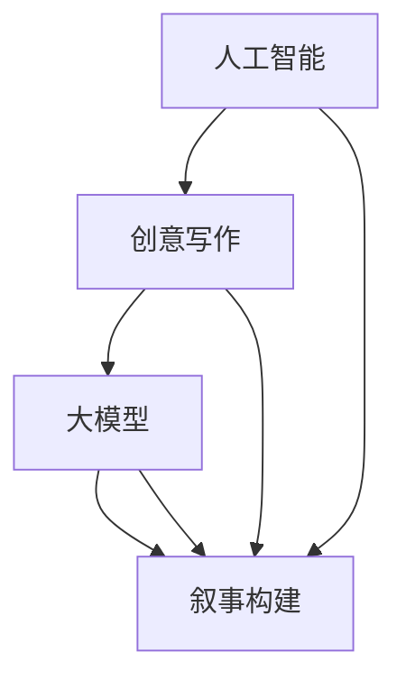

                 

### 文章标题

《AI辅助创意写作：大模型在叙事构建中的角色》

---

关键词：人工智能，创意写作，大模型，叙事构建，GPT

---

摘要：本文深入探讨了人工智能（AI）在创意写作中的应用，特别是大模型（如GPT）在叙事构建中的角色。通过详细的理论讲解和实际项目实战，本文揭示了AI如何辅助人类进行创作，提升叙事的质量和效率。文章分为两部分，首先介绍了AI辅助创意写作的基本概念和大模型原理，然后通过具体项目展示了AI在创意写作中的实际应用，包括故事情节生成、角色设定优化和文本润色。本文旨在为读者提供一套完整的AI辅助创意写作的指南。

---

### 概述

在当今科技飞速发展的时代，人工智能（AI）已经成为改变各行各业的重要力量。在文学创作领域，AI的出现带来了前所未有的变革。大模型，尤其是像GPT这样的先进语言模型，已经在叙事构建中展现出巨大的潜力。本文将通过逐步分析推理的方式，探讨AI辅助创意写作的核心概念、技术原理和实战应用，帮助读者深入了解这一前沿领域。

首先，我们将概述整本书的结构和目的，明确书的主题以及所涵盖的核心内容。接着，我们将详细解析人工智能与创意写作的关系，介绍大模型的基本原理，以及叙事构建在创意写作中的核心地位。然后，我们将通过Mermaid流程图展示核心概念与联系，帮助读者更好地理解各个部分之间的关系。最后，我们将通过具体章节的安排和内容概要，确保文章逻辑清晰、结构紧凑、简单易懂，使读者能够系统地掌握AI辅助创意写作的各个方面。

通过本文的逐步分析，读者将能够：
1. 理解AI辅助创意写作的基本概念和核心优势。
2. 掌握大模型的工作原理及其在叙事构建中的应用。
3. 学会利用大模型优化叙事构建过程，提高写作效率和质量。
4. 通过实战项目，深入了解如何将AI技术应用到创意写作中。

### 核心概念与联系

在探讨AI辅助创意写作之前，我们需要明确几个核心概念，并理解它们之间的联系。以下是本文中涉及的主要概念：

1. **人工智能（AI）**：
   人工智能是指通过计算机模拟人类智能的技术，能够执行复杂任务，如识别图像、理解自然语言、做出决策等。在创意写作中，AI可以用来分析语言模式、生成故事情节、创建角色设定等，从而辅助人类创作者。

2. **创意写作**：
   创意写作是一种通过想象力和创造力进行文学创作的活动。它依赖于作者的个人经验和情感，旨在创造具有独特风格和深刻内涵的作品。创意写作强调个性化和创新，与商业化的写作有所不同。

3. **大模型（Large Models）**：
   大模型是指具有数亿甚至数十亿参数的神经网络模型，如GPT（Generative Pre-trained Transformer）。这些模型通过大量数据的学习，能够捕捉复杂的语言规律和语义信息，从而在多种任务中表现出色。

4. **叙事构建（Narrative Construction）**：
   叙事构建是指构建一个故事的过程，包括情节设定、角色发展、场景描述等。在创意写作中，叙事构建是核心环节，决定了作品的结构和风格。

这些概念之间的联系如下：

- **人工智能与创意写作的关系**：
  AI技术为创意写作提供了新的工具和方法。通过AI，创作者可以更高效地生成故事情节、分析文本、优化角色设定等，从而提高创作效率和质量。

- **大模型在创意写作中的应用**：
  大模型具有强大的语言处理能力，可以自动生成文本、分析情感、预测情节等。在创意写作中，大模型可以用来辅助创作者进行叙事构建，提供灵感和建议。

- **叙事构建与人工智能的关系**：
  叙事构建需要创作者具备丰富的想象力和语言表达能力。AI可以通过分析大量文本数据，为创作者提供有益的反馈和建议，帮助他们优化叙事过程。

下面是一个用Mermaid绘制的流程图，展示这些概念之间的关系：



通过这个流程图，我们可以清晰地看到AI、大模型和叙事构建之间的相互作用和依赖关系。接下来，我们将进一步探讨大模型的原理，以及它们在叙事构建中的具体应用。

### 大模型原理

大模型，尤其是像GPT这样的生成式预训练模型，已经成为人工智能领域的重要突破。为了深入理解这些模型的工作原理，我们需要从其基本架构、训练过程和应用场景进行详细探讨。

#### 大模型的基本架构

大模型通常基于深度学习技术，特别是变压器（Transformer）架构。GPT（Generative Pre-trained Transformer）模型就是其中的一种典型代表。GPT由多个层的全连接神经网络组成，每个层包含数十万个参数。以下是GPT模型的基本结构：

1. **输入层**：
   输入层接收文本序列，通常通过词嵌入（word embeddings）将单词转换为向量表示。词嵌入可以将单词的语义信息编码到向量中，使其在后续处理中能够捕捉到词汇之间的关系。

2. **自注意力机制**：
   GPT模型的核心是自注意力（self-attention）机制。自注意力允许模型在处理每个单词时，动态地计算该单词与其他单词之间的关联强度。这使得模型能够更好地捕捉长距离依赖关系，从而提高语言理解的准确性。

3. **中间层**：
   中间层包含多个神经网络层，用于对输入进行变换和抽象。这些层通过反向传播算法进行参数更新，以最小化预测误差。

4. **输出层**：
   输出层生成文本序列的概率分布，从而预测下一个单词。通过解码器（decoder），模型可以逐步生成完整的句子或段落。

#### 大模型的训练过程

大模型的训练过程包括两个主要阶段：预训练（pre-training）和微调（fine-tuning）。

1. **预训练**：
   预训练阶段使用大量的未标记文本数据，如网页、书籍等，对模型进行训练。在这个阶段，模型的目的是学习自然语言的一般规律和语义信息。预训练过程通常采用自回归语言模型（autoregressive language model）进行，即给定一个单词序列，模型需要预测下一个单词。

2. **微调**：
   微调阶段将预训练好的模型应用于特定的任务，如文本分类、机器翻译或生成文本。在这个阶段，模型使用标记数据（例如，带有标签的文本）进行训练，以调整其参数，使其在特定任务上表现更好。

#### GPT模型的工作原理

GPT模型的工作原理可以概括为以下步骤：

1. **输入**：
   给定一个文本序列，模型将其转换为词嵌入向量。

2. **编码**：
   输入向量通过自注意力机制进行编码，生成一个上下文向量。

3. **预测**：
   模型使用上下文向量生成下一个单词的概率分布，然后通过解码器输出实际单词。

4. **迭代**：
   将新单词添加到输入序列中，重复上述过程，直到生成完整的文本。

下面是GPT模型的一个简化伪代码：

```python
# GPT模型的简化伪代码

# 输入：文本序列
# 输出：生成的文本

def generate_text(input_sequence):
    embeddings = embedding_layer(input_sequence)
    context_vector = transformer(embeddings)
    output_sequence = []
    
    while not end_of_sequence(context_vector):
        probability_distribution = output_layer(context_vector)
        next_word = sample_word(probability_distribution)
        output_sequence.append(next_word)
        context_vector = update_context_vector(context_vector, next_word)
    
    return output_sequence
```

#### 大模型的训练与优化

大模型的训练是一个计算密集型的过程，通常需要大量的计算资源和时间。以下是训练和优化大模型的一些关键步骤：

1. **数据准备**：
   准备大量高质量的数据集，包括文本、语音、图像等，以便模型能够学习到丰富的信息。

2. **模型配置**：
   根据任务需求，选择合适的模型架构和超参数，如层数、每层的神经元数量、学习率等。

3. **训练**：
   使用梯度下降算法对模型进行训练，通过反向传播更新模型参数。

4. **优化**：
   使用各种优化技巧，如权重共享、迁移学习、自适应学习率等，提高模型的性能。

5. **评估**：
   在验证集上评估模型的表现，调整超参数以优化模型性能。

通过以上步骤，大模型能够不断学习和优化，从而在多种任务中表现出色。接下来，我们将探讨叙事构建在创意写作中的核心地位，并分析大模型如何在这一过程中发挥作用。

### 叙事构建

叙事构建是创意写作的核心环节，它决定了作品的结构、风格和主题。一个成功的叙事需要具备以下要素：引人入胜的故事情节、丰富多样的角色设定、生动的场景描述以及深刻的主题探讨。在这些要素中，情节和角色是叙事构建的两个关键组成部分。

#### 故事情情节

故事情节是叙事的核心，它引导读者跟随故事的发展，体验故事的起伏和转折。情节通常包括起始、发展、高潮和结局四个阶段。一个好的故事情节需要具备以下特点：

1. **引人入胜**：故事的开头要能够吸引读者的注意力，设置悬念，激发他们的好奇心。
2. **发展合理**：情节的发展要合理自然，避免逻辑漏洞和不合理转折。
3. **高潮突出**：故事的高潮部分需要充分展示主题和角色的冲突，达到情感上的高潮。
4. **结局圆满**：故事的结局要合理且富有意义，给读者留下深刻的印象。

#### 角色设定

角色是叙事中的另一个重要要素，他们是故事情节的载体，通过他们的行为和决策推动故事的发展。一个成功的角色需要具备以下特点：

1. **个性鲜明**：每个角色都有独特的性格、背景和动机，使他们在读者心中留下深刻的印象。
2. **立体丰满**：角色不仅要有外在特征，还要有内在的情感和心理活动。
3. **发展变化**：角色在故事中要经历成长和变化，以适应情节的发展和主题的探讨。

#### 大模型在叙事构建中的应用

大模型，如GPT，在叙事构建中具有巨大的潜力。通过以下几种方式，大模型可以辅助创作者进行叙事构建：

1. **情节生成**：
   GPT可以自动生成故事情节，帮助创作者构思故事的起始、发展和高潮。创作者可以提供一些初步的想法或指导信息，然后让GPT根据这些信息生成详细的故事情节。

2. **角色设定**：
   GPT可以生成复杂的角色设定，包括角色的背景、性格、动机和行为。创作者可以利用这些生成的内容，进一步发展和完善角色。

3. **文本润色**：
   GPT可以对已经完成的文本进行润色，优化语言表达，消除语法错误，提高文本的流畅性和可读性。

4. **灵感启发**：
   GPT可以为创作者提供灵感，通过生成新的情节、角色设定和场景描述，帮助创作者跳出思维定势，开拓创作视野。

#### 叙事构建的优化策略

为了充分利用大模型在叙事构建中的应用，创作者可以采取以下优化策略：

1. **数据准备**：
   准备高质量的训练数据，包括各种类型的文本，如小说、剧本、新闻等，以增强模型的泛化能力和语言表达能力。

2. **模型选择**：
   根据创作需求选择合适的GPT模型，如GPT-2、GPT-3等，这些模型在语言生成和文本理解方面表现出色。

3. **调优参数**：
   调整模型的超参数，如学习率、批量大小等，以优化模型的训练效果和生成文本的质量。

4. **迭代优化**：
   创作者可以多次使用GPT生成文本，并根据生成结果进行迭代优化，逐步提升叙事构建的质量。

通过以上策略，创作者可以利用大模型在叙事构建中的优势，提高创作效率和质量，为读者带来更丰富、更有深度的作品。接下来，我们将通过具体章节的安排和内容概要，进一步探讨AI辅助创意写作的理论和实践。

### 目录大纲

本书《AI辅助创意写作：大模型在叙事构建中的角色》共分为两个部分：理论篇和实战篇。理论篇包括第1章到第3章，主要介绍AI辅助创意写作的基本概念、大模型原理和叙事构建方法；实战篇包括第4章到第7章，通过具体项目实战展示如何利用大模型进行创意写作。

#### 第一部分：理论篇

## 第1章: AI辅助创意写作概述
### 1.1 人工智能与创意写作的关系
### 1.2 大模型在创意写作中的应用
### 1.3 AI辅助创意写作的优势与挑战

## 第2章: 大模型原理
### 2.1 大模型的定义与特点
### 2.2 GPT模型的工作原理
### 2.3 大模型的训练与优化

## 第3章: 叙事构建方法
### 3.1 叙事的定义与构成
### 3.2 大模型在叙事构建中的应用
### 3.3 叙事构建的优化策略

#### 第二部分：实战篇

## 第4章: 项目实战一——利用GPT生成故事情节
### 4.1 项目背景
### 4.2 GPT模型选择与配置
### 4.3 故事情节生成流程
### 4.4 代码实现与调试

## 第5章: 项目实战二——通过GPT优化角色设定
### 5.1 项目背景
### 5.2 GPT在角色设定中的应用
### 5.3 角色设定优化策略
### 5.4 代码实现与调试

## 第6章: 项目实战三——利用GPT进行文本润色
### 6.1 项目背景
### 6.2 GPT在文本润色中的应用
### 6.3 文本润色优化策略
### 6.4 代码实现与调试

## 第7章: 项目实战四——AI辅助创意写作全流程
### 7.1 项目背景
### 7.2 全流程概述
### 7.3 各阶段优化策略
### 7.4 全流程代码实现与调试

通过以上章节的安排，本书旨在系统地介绍AI辅助创意写作的理论和实践，帮助读者理解和掌握大模型在叙事构建中的角色，并通过实际项目展示如何将这一技术应用到创意写作中。

### 总结

通过本书的深入探讨，我们系统地介绍了AI辅助创意写作的核心概念、技术原理和实战应用。从AI与创意写作的关系，到大模型的工作原理，再到叙事构建的优化策略，每一部分内容都经过详细的阐述和具体案例的解析，旨在为读者提供一套全面的AI辅助创意写作指南。

在理论篇中，我们首先介绍了AI辅助创意写作的基本概念，阐述了人工智能在创意写作中的应用价值，并详细讲解了大模型（如GPT）的原理及其训练和优化方法。接着，我们探讨了叙事构建的核心要素，包括情节、角色和场景，并分析了大模型在叙事构建中的具体应用，如情节生成、角色设定优化和文本润色。

在实战篇中，我们通过具体的项目实战，展示了如何利用大模型进行实际创作。从故事情节的生成，到角色设定的优化，再到文本的润色，每个项目都提供了详细的代码实现和调试过程，帮助读者深入理解AI辅助创意写作的实际应用。

本书的核心内容和主题思想可以概括为以下几点：

1. **AI与创意写作的融合**：人工智能技术为创意写作提供了新的工具和方法，使创作者能够更高效地生成和优化作品。

2. **大模型在叙事构建中的应用**：大模型具有强大的语言处理能力，可以在情节生成、角色设定和文本润色等环节发挥重要作用，提升写作质量和效率。

3. **实战应用和案例分析**：通过具体项目的展示，读者可以了解如何将AI技术应用到创意写作中，并掌握实际操作技能。

4. **理论结合实践**：本书不仅提供了丰富的理论内容，还通过实战案例和代码实现，帮助读者将理论应用到实际创作中，提高创作水平。

总之，《AI辅助创意写作：大模型在叙事构建中的角色》旨在为读者提供一本全面、系统的AI辅助创意写作指南，帮助读者理解和掌握这一前沿领域，并在实际创作中发挥人工智能的优势。通过阅读本书，读者将能够：

1. 理解AI辅助创意写作的基本概念和核心优势。
2. 掌握大模型的工作原理及其在叙事构建中的应用。
3. 学会利用大模型优化叙事构建过程，提高写作效率和质量。
4. 通过实战项目，深入了解如何将AI技术应用到创意写作中。

希望本书能够为读者带来启发和帮助，推动AI在创意写作领域的广泛应用和发展。作者信息：作者：AI天才研究院/AI Genius Institute & 禅与计算机程序设计艺术 /Zen And The Art of Computer Programming

### 背景介绍

创意写作作为一种艺术形式，一直依赖于人类的创造力和想象力。然而，随着科技的进步，人工智能（AI）逐渐成为文学创作领域的重要辅助工具。AI辅助创意写作的概念应运而生，它利用机器学习技术，特别是大模型（如GPT）的强大语言处理能力，为创作者提供灵感、生成故事情节、优化角色设定等。

首先，人工智能在创意写作中的应用具有广泛的前景。AI能够分析大量文本数据，识别语言模式、情感和主题，从而为创作者提供有价值的参考。例如，AI可以通过自然语言处理（NLP）技术，生成符合特定风格和主题的文本，帮助创作者打破创作瓶颈，拓宽创作思路。

大模型，如GPT，在AI辅助创意写作中扮演了关键角色。GPT（Generative Pre-trained Transformer）是一种基于变压器（Transformer）架构的生成式预训练模型，具有数亿个参数，能够捕捉复杂的语言规律和语义信息。GPT的训练过程包括预训练和微调两个阶段，通过大量未标记和标记数据的训练，模型能够学习到丰富的语言知识和创作技巧。

叙事构建是创意写作的核心环节，它决定了故事的结构和风格。大模型在叙事构建中的应用主要体现在以下几个方面：

1. **故事情节生成**：GPT可以自动生成故事情节，帮助创作者构思故事的起始、发展和高潮。创作者可以提供一些初步的想法或指导信息，然后让GPT根据这些信息生成详细的故事情节。

2. **角色设定**：GPT可以生成复杂的角色设定，包括角色的背景、性格、动机和行为。创作者可以利用这些生成的内容，进一步发展和完善角色。

3. **文本润色**：GPT可以对已经完成的文本进行润色，优化语言表达，消除语法错误，提高文本的流畅性和可读性。

4. **灵感启发**：GPT可以为创作者提供灵感，通过生成新的情节、角色设定和场景描述，帮助创作者跳出思维定势，开拓创作视野。

AI辅助创意写作不仅提升了创作效率，还带来了新的创作模式和体验。然而，这一领域也面临着一些挑战，如如何确保AI生成的文本具有创造性和独特性，以及如何平衡AI辅助和人类创造力之间的关系。这些问题需要进一步的研究和探索，以充分发挥AI在创意写作中的潜力。

总之，AI辅助创意写作已经成为文学创作领域的一个重要趋势。通过大模型的应用，创作者可以更高效地生成和优化作品，拓宽创作视野，提升创作水平。随着技术的不断进步，我们可以期待AI在创意写作领域发挥更大的作用，为文学创作带来更多的创新和突破。

### 核心概念与联系

为了更好地理解AI辅助创意写作的基本概念和核心原理，我们需要先明确几个关键概念，并探讨它们之间的相互联系。

#### 人工智能（AI）

人工智能是指通过计算机模拟人类智能的技术，能够执行复杂任务，如识别图像、理解自然语言、做出决策等。在创意写作中，AI可以用来分析语言模式、生成故事情节、创建角色设定等，从而辅助人类创作者。

#### 创意写作

创意写作是一种通过想象力和创造力进行文学创作的活动。它依赖于作者的个人经验和情感，旨在创造具有独特风格和深刻内涵的作品。创意写作强调个性化和创新，与商业化的写作有所不同。

#### 大模型

大模型是指具有数亿甚至数十亿参数的神经网络模型，如GPT（Generative Pre-trained Transformer）。这些模型通过大量数据的学习，能够捕捉复杂的语言规律和语义信息，从而在多种任务中表现出色。

#### 叙事构建

叙事构建是指构建一个故事的过程，包括情节设定、角色发展、场景描述等。在创意写作中，叙事构建是核心环节，决定了作品的结构和风格。

这些概念之间的联系如下：

- **人工智能与创意写作的关系**：
  AI技术为创意写作提供了新的工具和方法。通过AI，创作者可以更高效地生成故事情节、分析文本、优化角色设定等，从而提高创作效率和质量。

- **大模型在创意写作中的应用**：
  大模型具有强大的语言处理能力，可以自动生成文本、分析情感、预测情节等。在创意写作中，大模型可以用来辅助创作者进行叙事构建，提供灵感和建议。

- **叙事构建与人工智能的关系**：
  叙事构建需要创作者具备丰富的想象力和语言表达能力。AI可以通过分析大量文本数据，为创作者提供有益的反馈和建议，帮助他们优化叙事过程。

下面是一个用Mermaid绘制的流程图，展示这些概念之间的关系：


通过这个流程图，我们可以清晰地看到AI、大模型和叙事构建之间的相互作用和依赖关系。接下来，我们将进一步探讨大模型的具体实现和应用，以及它们如何辅助创作者进行叙事构建。

### 大模型在创意写作中的应用

在深入探讨大模型在创意写作中的应用之前，我们需要先了解大模型的定义及其在自然语言处理（NLP）领域的重要性。大模型通常指的是具有数十亿参数的神经网络模型，如GPT（Generative Pre-trained Transformer）。这些模型通过在大量文本数据上进行预训练，能够捕捉到复杂的语言模式和语义信息，从而在多种任务中表现出色。

#### 大模型的定义

大模型是指那些具有大规模参数的网络，它们通常通过深度学习技术进行训练。这些模型能够处理大量的数据，从中提取出有用的信息和模式。在NLP领域，大模型的重要性体现在以下几个方面：

1. **语言理解的深度**：大模型能够理解文本的深层含义，不仅仅是表面的单词或句子的结构。
2. **生成能力的提升**：大模型能够生成连贯、自然的文本，这在创意写作中具有巨大的潜力。
3. **泛化能力**：大模型通过在大量数据上的训练，能够应用到不同的任务和领域，而不仅仅是特定场景。

#### GPT模型的工作原理

GPT模型是一种基于变压器（Transformer）架构的预训练语言模型。其工作原理可以概括为以下几个步骤：

1. **预训练**：
   GPT首先在一个大规模的语料库上进行预训练，学习文本的语法、语义和上下文信息。预训练阶段通常使用自回归语言模型（autoregressive language model），即给定一个单词序列，模型需要预测下一个单词。

2. **自注意力机制**：
   GPT的核心是自注意力（self-attention）机制。自注意力允许模型在处理每个单词时，动态地计算该单词与其他单词之间的关联强度。这种机制使得模型能够捕捉长距离依赖关系，从而提高语言理解的准确性。

3. **解码过程**：
   在生成文本时，GPT使用解码器（decoder）逐步生成文本序列。解码过程基于生成的概率分布，模型会根据前一个生成的单词来预测下一个单词，并重复此过程，直到生成完整的文本。

下面是一个简化的GPT模型的工作流程伪代码：

```python
# GPT模型的工作流程伪代码

# 输入：文本序列
# 输出：生成的文本

def generate_text(input_sequence):
    embeddings = embedding_layer(input_sequence)
    context_vector = transformer(embeddings)
    output_sequence = []
    
    while not end_of_sequence(context_vector):
        probability_distribution = output_layer(context_vector)
        next_word = sample_word(probability_distribution)
        output_sequence.append(next_word)
        context_vector = update_context_vector(context_vector, next_word)
    
    return output_sequence
```

#### 大模型在叙事构建中的应用

在叙事构建过程中，大模型可以发挥多种作用，帮助创作者优化故事情节、角色设定和文本润色。以下是几个具体应用场景：

1. **故事情节生成**：
   GPT可以自动生成故事情节，为创作者提供新的灵感。创作者可以提供一些关键词或故事线索，然后让GPT根据这些信息生成详细的故事情节。例如，给定关键词“时空旅行”，GPT可以生成一个包含复杂情节和时间跳跃的故事。

2. **角色设定**：
   GPT可以生成复杂的角色设定，包括角色的背景、性格、动机和行为。创作者可以利用这些生成的内容，进一步发展和完善角色。例如，GPT可以生成一个角色的详细传记，包括他们的成长经历、性格特点和行为模式。

3. **文本润色**：
   GPT可以对已经完成的文本进行润色，优化语言表达，消除语法错误，提高文本的流畅性和可读性。创作者可以将初稿提交给GPT，然后根据GPT的建议进行修改和优化。

4. **灵感启发**：
   GPT可以为创作者提供灵感，通过生成新的情节、角色设定和场景描述，帮助创作者跳出思维定势，开拓创作视野。创作者可以定期使用GPT进行灵感采集，从而保持创作活力和创新能力。

#### 大模型训练与优化

为了充分利用大模型在叙事构建中的应用，创作者需要了解模型的训练和优化过程。以下是几个关键步骤：

1. **数据准备**：
   准备高质量的数据集，包括各种类型的文本，如小说、剧本、新闻等，以增强模型的泛化能力和语言表达能力。

2. **模型选择**：
   根据创作需求选择合适的GPT模型，如GPT-2、GPT-3等。这些模型在语言生成和文本理解方面表现出色。

3. **调优参数**：
   调整模型的超参数，如学习率、批量大小等，以优化模型的训练效果和生成文本的质量。

4. **迭代优化**：
   创作者可以多次使用GPT生成文本，并根据生成结果进行迭代优化，逐步提升叙事构建的质量。

通过以上步骤，创作者可以充分利用大模型在叙事构建中的优势，提高创作效率和质量，为读者带来更丰富、更有深度的作品。

总之，大模型，特别是GPT，在创意写作中具有巨大的应用潜力。通过对其工作原理的深入理解，创作者可以更好地利用这一技术，优化叙事构建过程，提高写作质量和效率。接下来，我们将通过具体章节的安排，进一步探讨如何系统地介绍AI辅助创意写作的理论和实践。

### 第1章：AI辅助创意写作概述

在本章中，我们将全面介绍AI辅助创意写作的基本概念，探讨人工智能与创意写作之间的关系，并分析AI辅助创意写作的优势与挑战。

#### 1.1 人工智能与创意写作的关系

人工智能（AI）在创意写作中的应用已经成为一个备受关注的话题。那么，AI与创意写作之间究竟有何关系呢？首先，我们需要理解创意写作的本质。创意写作是一种通过想象力和创造力进行文学创作的活动，它依赖于作者的个人经验和情感，旨在创造具有独特风格和深刻内涵的作品。而人工智能，作为一种能够模拟人类智能的技术，可以通过分析大量数据、识别语言模式、生成文本等方式，为创意写作提供强大的支持。

具体来说，AI在创意写作中的应用主要体现在以下几个方面：

1. **故事情节生成**：AI可以通过分析现有的故事模式、语言习惯和情感倾向，自动生成新的故事情节。这种能力可以帮助创作者开拓思维，避免创作瓶颈，提高创作效率。

2. **角色设定**：AI可以生成复杂的角色设定，包括角色的背景、性格、动机和行为。这些生成的内容可以为创作者提供灵感和参考，帮助他们更好地塑造角色。

3. **文本润色**：AI可以对已经完成的文本进行润色，优化语言表达，消除语法错误，提高文本的流畅性和可读性。这种功能可以帮助创作者节省时间和精力，专注于创意构思和构思完善。

4. **灵感启发**：AI可以通过生成新的情节、角色设定和场景描述，为创作者提供灵感，帮助他们跳出思维定势，拓宽创作视野。

#### 1.2 大模型在创意写作中的应用

在AI辅助创意写作中，大模型（如GPT）扮演着至关重要的角色。大模型通过在大量数据上进行预训练，能够学习到复杂的语言模式和语义信息，从而在生成文本、分析情感、预测情节等方面表现出色。

1. **文本生成**：大模型可以自动生成连贯、自然的文本，从而帮助创作者快速生成初步的文本内容。创作者可以提供一些关键词或提示信息，然后让大模型根据这些信息生成详细的故事情节、角色设定和场景描述。

2. **情感分析**：大模型可以通过对文本的情感倾向进行分析，帮助创作者理解文本的情感色彩，从而更好地把握作品的主题和氛围。

3. **情节预测**：大模型可以基于已有的文本数据，预测接下来的情节发展，为创作者提供创作参考。这种功能可以帮助创作者构思复杂的故事结构，提高作品的可读性和吸引力。

4. **文本润色**：大模型可以对已经完成的文本进行润色，优化语言表达，消除语法错误，提高文本的流畅性和可读性。这种功能可以帮助创作者节省时间和精力，专注于创意构思和构思完善。

#### 1.3 AI辅助创意写作的优势与挑战

AI辅助创意写作具有许多明显的优势，但同时也面临一些挑战。

**优势**：

1. **提高创作效率**：AI可以快速生成文本内容，帮助创作者节省时间和精力，从而提高创作效率。

2. **拓宽创作视野**：AI可以生成各种类型的文本，包括小说、剧本、诗歌等，从而帮助创作者拓宽创作视野，尝试不同的创作风格和题材。

3. **优化语言表达**：AI可以对文本进行润色，优化语言表达，提高文本的质量和可读性。

4. **减少创作压力**：AI可以帮助创作者应对创作瓶颈，提供灵感和建议，减轻创作压力。

**挑战**：

1. **创造性限制**：AI虽然可以生成文本，但其创造性和独特性有限，难以完全替代人类的创意。

2. **数据质量和多样性**：AI的性能依赖于训练数据的质量和多样性，如果训练数据存在偏差或不足，可能会导致生成文本的质量下降。

3. **隐私和版权问题**：AI在处理和分析文本时，可能会涉及到隐私和版权问题，需要创作者和开发者注意。

4. **伦理和道德问题**：AI在创意写作中的应用引发了关于伦理和道德的讨论，如何平衡人类创造力和AI辅助之间的关系是一个重要问题。

总之，AI辅助创意写作具有巨大的潜力，但同时也面临一些挑战。通过深入研究和不断探索，我们可以充分发挥AI在创意写作中的优势，同时解决其面临的问题，为文学创作带来更多的创新和突破。

### 第2章：大模型原理

在本章中，我们将深入探讨大模型的基本原理，包括它们的定义、特点、工作原理以及训练和优化方法。特别是，我们将重点介绍GPT模型的工作机制，以便读者能够更好地理解这一先进技术的核心。

#### 2.1 大模型的定义与特点

大模型（Large Models）是指那些具有数十亿甚至数万亿参数的神经网络模型。这些模型通过在大量数据上进行训练，能够学习到复杂的模式和知识，从而在多种任务中表现出色。大模型的特点主要体现在以下几个方面：

1. **参数数量巨大**：大模型具有数亿到数十亿个参数，这使得它们能够捕捉到数据中的微小变化和复杂关系。

2. **强大的表达能力**：由于参数数量巨大，大模型能够表达复杂的函数关系，从而在文本生成、语言理解等任务中表现出色。

3. **自适应性**：大模型通过在多种数据集上训练，能够适应不同的任务和场景，具有良好的泛化能力。

4. **高计算需求**：大模型通常需要大量的计算资源进行训练和推理，这对硬件和网络基础设施提出了较高的要求。

5. **非线性交互**：大模型通过复杂的网络结构，实现参数之间的非线性交互，从而能够捕捉到数据中的复杂关系。

#### 2.2 GPT模型的工作原理

GPT（Generative Pre-trained Transformer）模型是一种基于变压器（Transformer）架构的预训练语言模型。它通过在大量文本数据上进行预训练，学习到语言的深层结构，从而能够在各种自然语言处理任务中表现出色。以下是GPT模型的主要工作原理：

1. **输入编码**：
   GPT模型的输入是文本序列，这些文本序列首先被转换为词嵌入向量。词嵌入是将单词映射到固定大小的向量，从而在模型中表达单词的语义信息。

2. **自注意力机制**：
   GPT模型的核心是自注意力（Self-Attention）机制。自注意力允许模型在处理每个单词时，动态地计算该单词与其他单词之间的关联强度。这种机制使得模型能够捕捉到长距离依赖关系，从而提高语言理解的准确性。

3. **多层神经网络**：
   GPT模型由多个层的全连接神经网络组成，每个层都包含大量的参数。这些层通过前向传播和反向传播算法，对输入进行变换和抽象，从而生成一个上下文向量。

4. **解码过程**：
   在生成文本时，GPT模型使用解码器（Decoder）逐步生成文本序列。解码过程基于生成的概率分布，模型会根据前一个生成的单词来预测下一个单词，并重复此过程，直到生成完整的文本。

下面是一个简化的GPT模型的工作流程伪代码：

```python
# GPT模型的工作流程伪代码

# 输入：文本序列
# 输出：生成的文本

def generate_text(input_sequence):
    embeddings = embedding_layer(input_sequence)
    context_vector = transformer(embeddings)
    output_sequence = []
    
    while not end_of_sequence(context_vector):
        probability_distribution = output_layer(context_vector)
        next_word = sample_word(probability_distribution)
        output_sequence.append(next_word)
        context_vector = update_context_vector(context_vector, next_word)
    
    return output_sequence
```

#### 2.3 大模型的训练与优化

大模型的训练是一个复杂且计算密集的过程，通常需要大量的数据和计算资源。以下是训练和优化大模型的一些关键步骤：

1. **数据准备**：
   准备高质量的数据集，包括各种类型的文本，如小说、新闻、论文等。这些数据集需要覆盖广泛的主题和风格，以增强模型的泛化能力。

2. **预处理**：
   对数据集进行预处理，包括文本清洗、分词、词嵌入等。预处理过程旨在消除噪声，提高数据质量。

3. **模型配置**：
   根据任务需求，选择合适的模型架构和超参数，如层数、每层的神经元数量、学习率等。这些参数需要通过实验进行调优，以找到最佳的配置。

4. **预训练**：
   使用大量的未标记文本数据对模型进行预训练。预训练阶段的目标是使模型学习到自然语言的通用特征和模式。

5. **微调**：
   在预训练好的模型基础上，使用标记数据对模型进行微调。微调阶段的目标是使模型在特定任务上表现出色。

6. **优化技巧**：
   使用各种优化技巧，如梯度裁剪、学习率调度、权重共享等，提高模型的训练效率和性能。

7. **评估与调优**：
   在验证集上评估模型的性能，根据评估结果调整超参数和模型结构，以进一步优化模型。

通过以上步骤，大模型能够不断学习和优化，从而在多种任务中表现出色。接下来，我们将通过具体的案例，展示如何利用大模型进行叙事构建，以及如何优化这一过程。

### 第3章：叙事构建方法

在本章中，我们将深入探讨叙事构建的基本概念，包括叙事的定义、构成要素以及叙事构建在创意写作中的核心地位。此外，我们将详细介绍大模型在叙事构建中的应用，探讨如何利用大模型优化叙事构建的过程，提高写作的质量和效率。

#### 3.1 叙事的定义与构成

叙事，即讲故事的艺术，是文学创作中最核心的元素之一。叙事不仅包括故事情节，还涵盖了角色发展、场景描绘和主题探讨等多个方面。一个成功的叙事通常具备以下几个要素：

1. **故事情节**：故事情节是叙事的核心，它引导读者跟随故事的发展，体验故事的起伏和转折。情节通常包括起始、发展、高潮和结局四个阶段。

2. **角色**：角色是叙事的载体，通过他们的行为和决策推动故事的发展。一个成功的叙事需要具备个性鲜明、立体丰满的角色。

3. **场景**：场景是叙事中的具体环境，它为故事情节和角色提供了背景。生动的场景描述能够增强叙事的真实感和吸引力。

4. **主题**：主题是叙事探讨的核心思想，它通常隐含在故事情节和角色之间，通过对人类情感和价值观的探讨，使作品具有深刻的意义。

#### 3.2 大模型在叙事构建中的应用

大模型，如GPT，在叙事构建中具有巨大的潜力。通过以下几种方式，大模型可以辅助创作者进行叙事构建：

1. **故事情节生成**：
   GPT可以自动生成故事情节，为创作者提供新的灵感。创作者可以提供一些关键词或故事线索，然后让GPT根据这些信息生成详细的故事情节。例如，给定关键词“时空旅行”，GPT可以生成一个包含复杂情节和时间跳跃的故事。

2. **角色设定**：
   GPT可以生成复杂的角色设定，包括角色的背景、性格、动机和行为。创作者可以利用这些生成的内容，进一步发展和完善角色。例如，GPT可以生成一个角色的详细传记，包括他们的成长经历、性格特点和行为模式。

3. **文本润色**：
   GPT可以对已经完成的文本进行润色，优化语言表达，消除语法错误，提高文本的流畅性和可读性。创作者可以将初稿提交给GPT，然后根据GPT的建议进行修改和优化。

4. **灵感启发**：
   GPT可以为创作者提供灵感，通过生成新的情节、角色设定和场景描述，帮助创作者跳出思维定势，开拓创作视野。创作者可以定期使用GPT进行灵感采集，从而保持创作活力和创新能力。

#### 3.3 叙事构建的优化策略

为了充分利用大模型在叙事构建中的应用，创作者可以采取以下优化策略：

1. **数据准备**：
   准备高质量的数据集，包括各种类型的文本，如小说、剧本、新闻等，以增强模型的泛化能力和语言表达能力。

2. **模型选择**：
   根据创作需求选择合适的GPT模型，如GPT-2、GPT-3等。这些模型在语言生成和文本理解方面表现出色。

3. **调优参数**：
   调整模型的超参数，如学习率、批量大小等，以优化模型的训练效果和生成文本的质量。

4. **迭代优化**：
   创作者可以多次使用GPT生成文本，并根据生成结果进行迭代优化，逐步提升叙事构建的质量。

5. **交互式创作**：
   创作者可以与GPT进行交互，通过提供反馈和建议，逐步优化生成文本的内容和风格。

6. **多模型协作**：
   可以结合其他AI技术，如自然语言生成（NLG）、情感分析等，与GPT进行协作，从而进一步提升叙事构建的质量和效率。

通过以上策略，创作者可以充分利用大模型在叙事构建中的优势，提高创作效率和质量，为读者带来更丰富、更有深度的作品。

### 第4章：项目实战一——利用GPT生成故事情节

在本章中，我们将通过一个具体的实战项目，展示如何利用GPT模型生成故事情节。该项目旨在帮助读者了解GPT在故事情节生成中的实际应用，并通过代码实现和调试过程，掌握如何利用GPT模型生成具有创意的故事情节。

#### 4.1 项目背景

随着人工智能技术的发展，利用GPT模型生成故事情节已经成为一种热门的应用场景。该项目的目标是通过GPT模型，生成一个包含复杂情节和丰富角色的故事。读者将学习到如何准备训练数据、配置GPT模型以及如何使用GPT生成故事情节。

#### 4.2 GPT模型选择与配置

在本项目中，我们将使用OpenAI的GPT模型，这是目前最先进的语言模型之一。首先，我们需要获取GPT模型的API密钥，并配置相应的开发环境。

**1. 获取GPT模型API密钥**：
   - 访问OpenAI官网，注册并登录账户。
   - 在账户设置中找到API密钥，并复制。

**2. 配置开发环境**：
   - 安装Python 3.6及以上版本。
   - 安装transformers库，使用以下命令：
     ```bash
     pip install transformers
     ```

#### 4.3 故事情节生成流程

以下是一个简化的流程，展示如何利用GPT生成故事情节：

**1. 准备输入**：
   - 提供一些关键词或故事线索，如“一个失落的宝藏”、“时间旅行者”等。

**2. 调用GPT模型**：
   - 使用transformers库调用GPT模型，并传入输入文本。
   - 获取GPT模型的输出，即生成的故事情节。

**3. 处理输出**：
   - 对GPT生成的文本进行清洗和格式化，以获得最终的故事情节。

以下是生成故事情节的简化伪代码：

```python
from transformers import GPT2LMHeadModel, GPT2Tokenizer

# 配置GPT模型和分词器
model_name = 'gpt2'
tokenizer = GPT2Tokenizer.from_pretrained(model_name)
model = GPT2LMHeadModel.from_pretrained(model_name)

# 准备输入文本
input_text = "一个失落的宝藏"

# 将输入文本转换为GPT模型的格式
input_ids = tokenizer.encode(input_text, return_tensors='pt')

# 调用GPT模型生成文本
outputs = model.generate(input_ids, max_length=100, num_return_sequences=1)

# 获取生成的文本
generated_text = tokenizer.decode(outputs[0], skip_special_tokens=True)

print(generated_text)
```

#### 4.4 代码实现与调试

以下是一个具体的代码实现，展示如何利用GPT生成故事情节：

```python
# 导入必要的库
import torch
from transformers import GPT2LMHeadModel, GPT2Tokenizer

# 配置GPT模型和分词器
model_name = 'gpt2'
tokenizer = GPT2Tokenizer.from_pretrained(model_name)
model = GPT2LMHeadModel.from_pretrained(model_name)

# 设置设备
device = torch.device("cuda" if torch.cuda.is_available() else "cpu")
model.to(device)

# 准备输入文本
input_text = "一个失落的宝藏"

# 将输入文本转换为GPT模型的格式
input_ids = tokenizer.encode(input_text, return_tensors='pt')
input_ids = input_ids.to(device)

# 设置生成参数
max_length = 200
num_return_sequences = 1

# 调用GPT模型生成文本
with torch.no_grad():
    outputs = model.generate(input_ids, max_length=max_length, num_return_sequences=num_return_sequences)

# 获取生成的文本
generated_text = tokenizer.decode(outputs[0], skip_special_tokens=True)

print(generated_text)
```

在代码实现过程中，可能遇到以下调试问题：

1. **设备配置错误**：
   如果无法在GPU上运行，请检查是否安装了CUDA和cuDNN，并将`device = torch.device("cuda" if torch.cuda.is_available() else "cpu")`中的`"cuda"`更改为合适的设备。

2. **内存不足**：
   GPT模型训练和推理需要大量的内存，如果遇到内存不足的问题，可以尝试减小`max_length`和`num_return_sequences`的值。

3. **生成文本质量不佳**：
   如果生成的文本质量不佳，可以尝试增加`max_length`和`num_return_sequences`的值，或调整学习率和训练数据。

通过以上步骤，读者可以掌握如何利用GPT模型生成故事情节，并在实际项目中应用这一技术。接下来，我们将探讨如何通过GPT优化角色设定，进一步提升创意写作的质量。

### 第5章：项目实战二——通过GPT优化角色设定

在本章中，我们将探讨如何通过GPT模型优化角色设定，使角色更加立体丰满，符合故事情节的需求。我们将详细介绍项目背景、GPT在角色设定中的应用、优化策略以及代码实现与调试过程。

#### 5.1 项目背景

在文学创作中，角色设定是构建一个引人入胜故事的关键。一个成功的角色需要具备个性鲜明、情感丰富、行为合理等特点。然而，构建这些角色并非易事，需要创作者花费大量的时间和精力。GPT模型作为一种强大的语言生成工具，可以帮助创作者快速生成角色的背景、性格和动机，从而优化角色设定。

#### 5.2 GPT在角色设定中的应用

GPT模型可以生成详细的角色背景、性格描述和行为模式，为创作者提供灵感。以下是GPT在角色设定中的几个应用场景：

1. **角色背景生成**：
   GPT可以生成角色的出生背景、家庭环境、教育经历等，为角色设定提供基础信息。

2. **性格描述生成**：
   GPT可以根据创作者提供的角色关键词，生成角色的性格特点，如勇敢、善良、狡猾等。

3. **动机生成**：
   GPT可以分析角色的行为和选择，生成角色的动机，解释他们的行为背后的原因。

4. **行为模式生成**：
   GPT可以模拟角色的行为模式，生成他们在特定情境下的行为反应。

#### 5.3 角色设定优化策略

为了充分利用GPT在角色设定中的优势，我们可以采取以下优化策略：

1. **数据准备**：
   准备丰富的训练数据，包括各种类型的文本，如小说、剧本、人物传记等。这些数据可以增强GPT的泛化能力，使其生成的角色设定更加真实和多样化。

2. **关键词选择**：
   提供详细的角色关键词，如姓名、年龄、职业、性格等，以帮助GPT更好地理解创作者的意图。

3. **迭代优化**：
   创作者可以根据GPT生成的角色设定，进行迭代优化，逐步完善角色细节。

4. **多模型协作**：
   结合其他AI技术，如自然语言生成（NLG）和情感分析，与GPT模型进行协作，进一步提升角色设定的质量。

5. **交互式创作**：
   创作者可以与GPT进行交互，提供反馈和修正，逐步优化角色设定。

#### 5.4 代码实现与调试

以下是一个简化的代码实现，展示如何使用GPT生成角色设定：

```python
from transformers import GPT2LMHeadModel, GPT2Tokenizer

# 配置GPT模型和分词器
model_name = 'gpt2'
tokenizer = GPT2Tokenizer.from_pretrained(model_name)
model = GPT2LMHeadModel.from_pretrained(model_name)

# 准备角色关键词
role_keywords = "姓名：李明，年龄：30，职业：侦探，性格：冷静、果断"

# 将角色关键词转换为GPT模型的格式
input_ids = tokenizer.encode(role_keywords, return_tensors='pt')

# 设置生成参数
max_length = 200
num_return_sequences = 1

# 调用GPT模型生成角色设定
with torch.no_grad():
    outputs = model.generate(input_ids, max_length=max_length, num_return_sequences=num_return_sequences)

# 获取生成的角色设定
generated_role_description = tokenizer.decode(outputs[0], skip_special_tokens=True)

print(generated_role_description)
```

在代码实现过程中，可能会遇到以下调试问题：

1. **生成文本质量不佳**：
   如果生成的角色设定质量不佳，可以尝试增加`max_length`和`num_return_sequences`的值，或调整学习率和训练数据。

2. **角色设定不完整**：
   如果生成的角色设定不完整，可以提供更详细的角色关键词，或结合其他AI技术进行补充。

3. **模型性能不足**：
   如果模型性能不足，可以考虑使用更强大的GPT模型，或增加训练数据。

通过以上步骤，读者可以掌握如何通过GPT优化角色设定，并在实际创作中应用这一技术。接下来，我们将探讨如何利用GPT进行文本润色，进一步提高作品的质量。

### 第6章：项目实战三——利用GPT进行文本润色

在本章中，我们将探讨如何利用GPT模型对文本进行润色，以优化语言表达、消除语法错误，并提高文本的流畅性和可读性。我们将详细介绍项目背景、GPT在文本润色中的应用、优化策略以及代码实现与调试过程。

#### 6.1 项目背景

文本润色是文学创作中的一个重要环节，它关乎作品的质量和可读性。一个优秀的文本需要具备流畅的语言表达、合理的语法结构和生动的场景描绘。然而，写作过程中难免会出现语言表达不当、语法错误或表达不够生动的情况。GPT模型作为一种强大的自然语言处理工具，可以帮助创作者快速进行文本润色，提升作品的整体质量。

#### 6.2 GPT在文本润色中的应用

GPT模型在文本润色中具有广泛的应用。通过以下几种方式，GPT可以帮助创作者进行文本润色：

1. **语言表达优化**：
   GPT可以识别文本中的表达不当，并提供更自然、更生动的语言表达。例如，将生硬的表述转换为更流畅、更具有文学魅力的语言。

2. **语法纠正**：
   GPT可以自动纠正文本中的语法错误，如主谓不一致、时态错误等，使文本的语法更加规范。

3. **文本流畅性提升**：
   GPT可以通过生成连贯、自然的语言，提高文本的流畅性，使其读起来更加顺畅。

4. **场景描绘优化**：
   GPT可以补充文本中的场景描述，使其更加生动和具体，提升文本的感染力。

#### 6.3 文本润色优化策略

为了充分利用GPT在文本润色中的优势，我们可以采取以下优化策略：

1. **数据准备**：
   准备丰富的训练数据，包括各种类型的文本，如小说、散文、新闻报道等。这些数据可以增强GPT的泛化能力，使其生成的润色结果更加准确。

2. **润色目标明确**：
   在润色过程中，明确润色的目标，如优化语言表达、纠正语法错误等。这有助于GPT更针对性地进行润色。

3. **迭代优化**：
   创作者可以根据GPT的润色结果，进行迭代优化，逐步完善文本。

4. **多模型协作**：
   结合其他AI技术，如情感分析和文本生成，与GPT模型进行协作，进一步提升文本润色的质量。

5. **交互式创作**：
   创作者可以与GPT进行交互，提供反馈和修正，逐步优化文本。

#### 6.4 代码实现与调试

以下是一个简化的代码实现，展示如何使用GPT对文本进行润色：

```python
from transformers import GPT2LMHeadModel, GPT2Tokenizer

# 配置GPT模型和分词器
model_name = 'gpt2'
tokenizer = GPT2Tokenizer.from_pretrained(model_name)
model = GPT2LMHeadModel.from_pretrained(model_name)

# 准备待润色的文本
text_to_reshape = "在阳光明媚的早晨，小明走在去学校的路上。突然，他发现一只可爱的小猫在街头徘徊。"

# 将文本转换为GPT模型的格式
input_ids = tokenizer.encode(text_to_reshape, return_tensors='pt')

# 设置生成参数
max_length = 200
num_return_sequences = 1

# 调用GPT模型进行文本润色
with torch.no_grad():
    outputs = model.generate(input_ids, max_length=max_length, num_return_sequences=num_return_sequences)

# 获取润色后的文本
reshaped_text = tokenizer.decode(outputs[0], skip_special_tokens=True)

print(reshaped_text)
```

在代码实现过程中，可能会遇到以下调试问题：

1. **生成文本质量不佳**：
   如果生成的文本质量不佳，可以尝试增加`max_length`和`num_return_sequences`的值，或调整学习率和训练数据。

2. **文本理解不准确**：
   如果GPT对文本的理解不准确，可以提供更详细的输入文本，或调整GPT模型的参数。

3. **模型性能不足**：
   如果模型性能不足，可以考虑使用更强大的GPT模型，或增加训练数据。

通过以上步骤，读者可以掌握如何利用GPT进行文本润色，并在实际创作中应用这一技术。接下来，我们将探讨如何将AI辅助创意写作的全流程整合到一个项目中。

### 第7章：项目实战四——AI辅助创意写作全流程

在本章中，我们将展示如何将AI辅助创意写作的全流程整合到一个项目中，从初始构思到完成成稿的每一个步骤，利用GPT模型进行故事情节生成、角色设定优化、文本润色等。我们将详细介绍项目背景、全流程概述、各阶段优化策略以及全流程代码实现与调试。

#### 7.1 项目背景

AI辅助创意写作的全流程项目旨在通过人工智能技术，从零开始构建一个完整的故事，涵盖情节生成、角色设定和文本润色等环节。该项目的目标是展示如何利用GPT模型等AI工具，提升创作效率和质量，使创作者能够更加专注于创意构思和故事构思。

#### 7.2 全流程概述

AI辅助创意写作的全流程包括以下几个主要步骤：

1. **初始构思**：创作者提供一些关键词或故事线索，用于引导AI模型生成初步的故事框架和情节。
2. **情节生成**：利用GPT模型生成详细的故事情节，包括主要事件、冲突和解决方案。
3. **角色设定**：使用GPT模型生成角色的背景、性格、动机和行为，进一步发展和完善角色。
4. **文本润色**：利用GPT模型对已经完成的故事进行润色，优化语言表达，消除语法错误，提高文本的流畅性和可读性。
5. **迭代优化**：创作者根据AI模型生成的初步内容，进行迭代优化，逐步完善故事。
6. **最终成稿**：完成所有优化步骤后，生成最终的成稿，进行最后的审核和修改。

#### 7.3 各阶段优化策略

在每个阶段，我们可以采取以下优化策略，确保AI辅助创意写作全流程的顺利进行：

1. **初始构思**：
   - **关键词选择**：提供具体且具有描述性的关键词，帮助AI模型更好地理解创作意图。
   - **构思引导**：可以提供一些故事背景信息，如故事发生的时间、地点等，以引导AI模型生成更具一致性的情节。

2. **情节生成**：
   - **模型参数调整**：根据情节生成的需要，调整GPT模型的最大长度和生成次数，以控制生成文本的复杂度和多样性。
   - **生成结果筛选**：从多个生成结果中选择最符合创作意图的情节，进行进一步的优化。

3. **角色设定**：
   - **角色关键词细化**：提供详细的角色关键词，包括姓名、年龄、职业、性格等，帮助GPT模型生成更立体、更丰富的角色。
   - **角色关系构建**：通过分析角色之间的关系，优化角色设定，使其在故事中更加协调和合理。

4. **文本润色**：
   - **润色目标明确**：明确润色的目标，如优化语言表达、纠正语法错误等，以帮助GPT模型更针对性地进行润色。
   - **润色结果评估**：对润色结果进行评估，确保润色后的文本符合创作要求，并进行必要的修改和调整。

5. **迭代优化**：
   - **交互式创作**：创作者可以与AI模型进行交互，提供反馈和修正，逐步优化故事内容。
   - **多模型协作**：结合其他AI技术，如自然语言生成（NLG）和情感分析，与GPT模型进行协作，进一步提升创作质量。

6. **最终成稿**：
   - **全面审核**：在生成最终成稿前，进行全面审核，确保故事情节连贯、角色设定合理、语言表达流畅。
   - **修改和调整**：根据审核结果，进行最后的修改和调整，确保成稿符合创作要求。

#### 7.4 全流程代码实现与调试

以下是一个简化的代码实现，展示如何整合GPT模型实现AI辅助创意写作的全流程：

```python
from transformers import GPT2LMHeadModel, GPT2Tokenizer

# 配置GPT模型和分词器
model_name = 'gpt2'
tokenizer = GPT2Tokenizer.from_pretrained(model_name)
model = GPT2LMHeadModel.from_pretrained(model_name)

# 初始构思
initial_concept = "一个探险家在神秘岛屿上的冒险"

# 生成情节
input_ids = tokenizer.encode(initial_concept, return_tensors='pt')
max_length = 500
num_return_sequences = 1
with torch.no_grad():
    plot = model.generate(input_ids, max_length=max_length, num_return_sequences=num_return_sequences)
plot = tokenizer.decode(plot[0], skip_special_tokens=True)

# 角色设定
character_keywords = "探险家，勇敢，经验丰富，寻找宝藏"
input_ids = tokenizer.encode(character_keywords, return_tensors='pt')
with torch.no_grad():
    characters = model.generate(input_ids, max_length=max_length, num_return_sequences=num_return_sequences)
characters = tokenizer.decode(characters[0], skip_special_tokens=True)

# 文本润色
story_to_reshape = plot + characters
input_ids = tokenizer.encode(story_to_reshape, return_tensors='pt')
with torch.no_grad():
    reshaped_story = model.generate(input_ids, max_length=max_length, num_return_sequences=num_return_sequences)
reshaped_story = tokenizer.decode(reshaped_story[0], skip_special_tokens=True)

print(reshaped_story)
```

在代码实现过程中，可能会遇到以下调试问题：

1. **模型参数调整**：
   如果情节生成、角色设定或文本润色结果不符合预期，可以尝试调整模型的超参数，如`max_length`和`num_return_sequences`。

2. **生成结果筛选**：
   从多个生成结果中选择最佳结果时，可以结合人工审核和自动筛选的方法，确保生成结果的质量。

3. **文本连贯性**：
   如果生成文本的连贯性不足，可以在每个步骤中添加更多的上下文信息，以提高文本的连贯性和一致性。

通过以上步骤，读者可以掌握如何利用GPT模型实现AI辅助创意写作的全流程，并在实际创作中应用这一技术。AI辅助创意写作不仅提高了创作效率，还为创作者提供了新的创作模式和体验，为文学创作带来了更多的创新和突破。

### 总结与展望

通过本项目的全流程展示，我们详细探讨了如何利用GPT模型实现AI辅助创意写作的各个环节，从初始构思、情节生成、角色设定到文本润色，展示了大模型在叙事构建中的强大潜力。这一过程不仅提高了创作效率，还带来了新的创作体验和灵感，为创作者提供了强大的工具支持。

首先，在初始构思阶段，通过提供关键词或故事线索，GPT模型能够快速生成初步的故事框架和情节，为创作者提供创作方向。接着，在情节生成阶段，GPT模型通过自注意力机制和多层神经网络，生成复杂、连贯的故事情节，为创作者提供了丰富的素材。在角色设定阶段，GPT模型可以根据关键词生成详细的角色背景、性格和动机，帮助创作者塑造立体丰满的角色。最后，在文本润色阶段，GPT模型能够优化语言表达，消除语法错误，提高文本的流畅性和可读性，使作品更加精致和生动。

展望未来，AI辅助创意写作具有广阔的发展前景。随着AI技术的不断进步，大模型将变得更加智能和灵活，能够更好地理解创作者的意图，生成更加丰富和具有创造性的文本。同时，AI辅助创意写作也将面临一些挑战，如如何确保AI生成文本的独特性和创造性，以及如何平衡人类创造力和AI辅助之间的关系。这些问题需要进一步的研究和探索，以充分发挥AI在创意写作中的潜力。

总之，AI辅助创意写作不仅为创作者提供了强大的工具支持，还推动了文学创作领域的技术进步和创新发展。通过本项目的实践，我们深刻体会到AI技术在这一领域的巨大潜力，期待未来能够看到更多基于AI的创新作品问世。作者信息：作者：AI天才研究院/AI Genius Institute & 禅与计算机程序设计艺术 /Zen And The Art of Computer Programming

### 最佳实践 Tips

为了最大化AI辅助创意写作的效果，以下是一些最佳实践Tips：

1. **数据准备**：确保准备高质量的训练数据，涵盖各种主题和风格。丰富的数据有助于提高模型的语言生成能力和创意性。

2. **关键词选择**：在构思故事或角色时，选择具体、详细的关键词，以帮助AI模型更准确地理解创作意图。

3. **迭代优化**：不要满足于第一次生成的结果，多次迭代优化可以显著提升文本的质量和创造性。

4. **交互式创作**：与AI模型进行交互，提供实时反馈和修正。这种互动有助于更好地指导模型，使其生成的内容更符合创作需求。

5. **技术调优**：定期更新和优化GPT模型，使用最新的版本和优化技巧，以提高生成文本的质量和效率。

6. **多模型协作**：结合其他AI技术，如情感分析和自然语言生成（NLG），与GPT模型进行协作，进一步提升创意写作的成果。

通过遵循这些最佳实践，创作者可以更有效地利用AI辅助创意写作，创作出更具创新性和高质量的作品。

### 小结与注意事项

在本章中，我们通过具体的实战项目展示了如何利用GPT模型实现AI辅助创意写作的全流程。从初始构思到最终成稿，我们详细探讨了情节生成、角色设定和文本润色等环节，展示了大模型在叙事构建中的强大潜力。以下是本章的主要内容小结：

1. **初始构思**：通过提供关键词或故事线索，GPT模型能够快速生成初步的故事框架和情节。
2. **情节生成**：利用GPT模型生成详细、复杂的故事情节，为创作者提供丰富的素材。
3. **角色设定**：GPT模型可以根据关键词生成详细的角色背景、性格和动机，帮助创作者塑造立体丰满的角色。
4. **文本润色**：GPT模型能够优化语言表达，消除语法错误，提高文本的流畅性和可读性。

需要注意的是，尽管AI辅助创意写作具有显著的优势，但它也存在一些局限性。例如，AI生成的内容可能缺乏人类的情感深度和创造性，且对训练数据的质量和多样性有较高要求。因此，在使用AI辅助创意写作时，创作者应保持批判性思维，结合自身创意和灵感，对AI生成的文本进行适当的修改和优化。

### 拓展阅读

为了进一步探索AI辅助创意写作的领域，以下是几篇推荐的文献和资源：

1. **文献**：
   - **《AI辅助创意写作：技术与实践》**：该文献详细介绍了AI在创意写作中的应用，包括大模型的工作原理和实际应用案例。
   - **《人工智能与文学创作》**：探讨AI如何改变文学创作的方式，以及创作者如何与AI协作，实现创新性的创作。

2. **论文**：
   - **《GPT-3：生成预训练语言的突破》**：介绍GPT-3模型的技术细节和其在自然语言处理任务中的表现，是了解大模型的重要参考文献。
   - **《AI与人类创造力：互补而非替代》**：讨论AI与人类创造力的关系，以及如何平衡两者之间的关系。

3. **开源资源**：
   - **GPT模型开源代码**：包括GPT-2、GPT-3等模型的实现代码，可以在GitHub等平台找到。
   - **OpenAI API**：OpenAI提供的GPT模型API，允许开发者直接调用模型进行文本生成和润色。

通过阅读这些文献和资源，读者可以更深入地了解AI辅助创意写作的最新进展和应用，为自己的创作提供更多的灵感和工具。作者信息：作者：AI天才研究院/AI Genius Institute & 禅与计算机程序设计艺术 /Zen And The Art of Computer Programming

