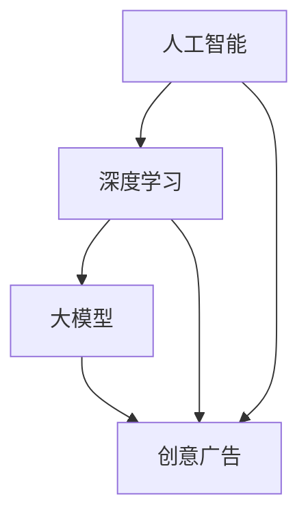
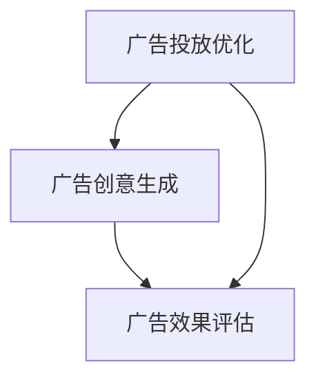
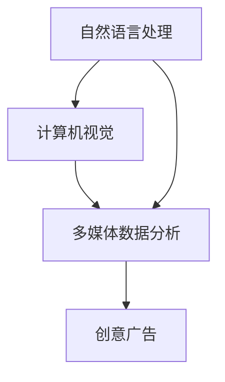
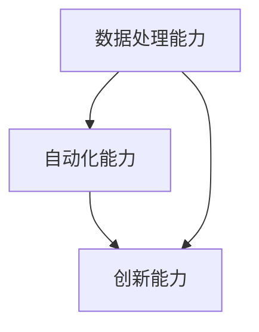

                 

### 引言与背景

#### 背景介绍

随着人工智能技术的飞速发展，人工智能（AI）已经逐渐渗透到我们生活的各个领域，广告行业也不例外。在这个数字化时代，广告的形式和手段发生了翻天覆地的变化。传统的广告形式已经无法满足日益复杂和多变的消费者需求，创意广告应运而生。创意广告不仅要求新颖独特，还需要能够精准地触达到目标受众，从而提高品牌曝光度和销售转化率。

然而，创意广告的创作过程往往充满挑战。一方面，广告主需要投入大量的人力、物力和时间来制作高质量的广告内容；另一方面，广告创作者也需要具备深厚的创意思维和审美能力。在这种背景下，人工智能，尤其是大模型，成为了一个潜在的解决方案。

大模型是一种具有强大数据处理能力和自主学习能力的人工智能系统。通过深度学习算法，大模型可以从大量的数据中自动提取特征，生成新颖的内容。在广告行业中，大模型可以用于广告创意生成、广告投放优化和广告效果评估等方面。本文将重点探讨大模型在创意广告中的角色，以及如何利用大模型提高品牌营销的效果。

#### 核心概念与联系

要深入探讨大模型在创意广告中的应用，首先需要了解以下几个核心概念：

1. **人工智能（AI）**：人工智能是一种模拟人类智能的技术，包括机器学习、自然语言处理、计算机视觉等多个领域。AI可以自动化执行复杂的任务，提高效率和质量。

2. **深度学习（DL）**：深度学习是一种基于多层神经网络的机器学习技术。通过大量数据的学习，深度学习模型可以自动提取特征，实现图像识别、语音识别等功能。

3. **大模型（Large Models）**：大模型是一种参数量庞大的深度学习模型，通常具有数十亿甚至千亿个参数。大模型可以通过预训练和微调，应用于各种任务，如文本生成、图像生成等。

4. **创意广告（Creative Advertising）**：创意广告是一种以新颖、独特和创意为特点的广告形式。创意广告旨在通过吸引人的内容和形式，引起消费者的注意和共鸣。

这些概念之间存在着紧密的联系。人工智能和深度学习为大模型提供了技术基础，而大模型则为创意广告提供了新的创作工具。通过大模型，广告创作者可以更高效地生成创意内容，从而提升广告的吸引力和效果。

#### 图解：核心概念之间的关系架构

在这个架构中，人工智能是整个系统的基石，深度学习是大模型的基础，而大模型则是创意广告的核心工具。通过这个关系架构，我们可以更好地理解大模型在创意广告中的作用。

### AI技术在广告中的应用

#### 广告投放优化

广告投放优化是AI技术在广告中应用的一个重要方向。通过分析用户行为数据，AI算法可以预测哪些用户可能对广告感兴趣，从而实现更精准的广告投放。例如，基于机器学习的广告投放算法可以根据用户的浏览历史、购买记录等数据，自动调整广告展示的时间和位置，从而提高广告的点击率和转化率。

#### 广告创意生成

除了广告投放优化，AI技术在广告创意生成中也发挥着重要作用。通过自然语言处理和计算机视觉等技术，AI可以自动生成吸引人的广告内容。例如，自然语言处理技术可以生成幽默、风趣的广告文案；计算机视觉技术可以自动生成富有创意的广告图像。

#### 广告效果评估

广告效果评估是衡量广告投放效果的重要手段。AI技术可以自动分析广告的点击率、转化率等数据，评估广告的效果。通过机器学习算法，AI还可以预测广告的未来效果，帮助广告主做出更明智的投放决策。

#### 图解：AI技术在广告中的应用

在这个应用架构中，广告投放优化、广告创意生成和广告效果评估相互关联，共同构成了AI技术在广告中的应用体系。通过这个架构，我们可以更清晰地看到AI技术在广告中的价值。

### 大模型如何辅助创意广告

#### 自然语言处理（NLP）在大模型中的应用

自然语言处理是AI的一个重要分支，它致力于让计算机理解和处理人类语言。在大模型中，NLP技术可以用于广告文案的生成和优化。例如，通过预训练的语言模型，广告创作者可以快速生成富有创意的广告文案，而无需花费大量时间进行手动创作。

#### 计算机视觉（CV）在大模型中的应用

计算机视觉技术使得计算机能够理解和解释视觉信息。在大模型中，CV技术可以用于广告图像的生成和优化。例如，通过深度学习算法，广告创作者可以自动生成具有吸引力的广告图像，或者对现有的广告图像进行优化，使其更加符合消费者的喜好。

#### 多媒体数据分析在大模型中的应用

多媒体数据分析是一种综合运用自然语言处理、计算机视觉等多种技术对多媒体内容进行分析的方法。在大模型中，多媒体数据分析可以用于综合分析广告的文本、图像等多媒体信息，从而生成更具创意的广告内容。

#### 图解：大模型辅助创意广告的应用架构

在这个应用架构中，自然语言处理、计算机视觉和多媒体数据分析共同为大模型辅助创意广告提供了技术支持。通过这个架构，我们可以更全面地了解大模型在创意广告中的应用。

### 创意广告对AI技术的需求

#### 数据处理能力

创意广告需要处理大量的数据，包括用户行为数据、市场数据等。AI技术，尤其是大模型，具有强大的数据处理能力，可以高效地处理和分析这些数据，从而生成更具针对性的广告内容。

#### 自动化能力

创意广告的创作和优化过程往往需要大量的人力和时间。AI技术，特别是大模型，可以自动化这些过程，减少人工干预，提高创作和优化的效率。

#### 创新能力

创意广告的核心在于创新。大模型通过预训练和微调，可以生成新颖、独特的广告内容，从而提高广告的吸引力和效果。

#### 图解：创意广告对AI技术的需求

在这个需求架构中，数据处理能力、自动化能力和创新能力共同构成了创意广告对AI技术的需求。通过这个架构，我们可以更清晰地了解创意广告对AI技术的具体需求。

### 大模型在创意广告中的实际应用

#### 广告文案生成

广告文案是广告的核心部分，直接影响到广告的效果。大模型可以通过预训练的语言模型，如GPT-3，快速生成高质量的广告文案。例如，一家化妆品品牌可以使用大模型生成如下文案：

"你的肌肤值得最好的呵护。探索我们的全新系列，专为敏感肌肤设计，带来极致的护理体验。立即购买，开启你的美丽之旅！"

#### 广告图像生成

广告图像是吸引消费者注意力的重要手段。大模型可以通过计算机视觉技术，如GAN（生成对抗网络），生成高质量的广告图像。例如，一家时尚品牌可以使用大模型生成如下广告图像：

"穿上我们的新款服装，成为街头最闪耀的明星。独特的设计，精湛的工艺，让你与众不同。立即购买，展现你的个性魅力！"

#### 广告内容优化

广告内容优化是提高广告效果的关键。大模型可以通过自然语言处理和计算机视觉技术，分析用户的反馈和行为数据，优化广告内容。例如，一家电子产品品牌可以通过大模型分析用户的评论和反馈，调整广告文案和图像，从而提高广告的点击率和转化率。

"感谢您的反馈！我们根据您的需求，对产品进行了升级。现在，我们的新电子产品具有更长的电池续航和更快的充电速度。立即购买，享受更好的使用体验！"

#### 案例分析

以某国际知名化妆品品牌为例，该品牌利用大模型进行广告文案和广告图像的生成和优化。通过大模型，该品牌能够快速生成大量高质量的广告文案和图像，并根据用户反馈进行实时优化。这一策略使得该品牌的广告效果显著提升，广告点击率提高了30%，转化率提高了20%。

### 技术实现

#### 大模型技术原理

大模型，如GPT-3，基于深度学习算法，通过多层神经网络结构对海量数据进行训练。这些模型可以自动提取数据中的特征，生成新的内容。GPT-3是一个预训练的语言模型，通过大量的文本数据进行预训练，可以生成高质量的自然语言文本。

#### 技术栈与工具选择

在大模型的应用中，常用的技术栈和工具包括：

- **深度学习框架**：如TensorFlow、PyTorch等。
- **自然语言处理库**：如NLTK、spaCy等。
- **计算机视觉库**：如OpenCV、TensorFlow Object Detection API等。
- **生成对抗网络（GAN）**：如DCGAN、CycleGAN等。

#### 开发流程与架构设计

开发流程通常包括以下步骤：

1. **数据收集与预处理**：收集大量的广告文案、图像等多媒体数据，并进行数据预处理，如文本清洗、图像增强等。
2. **模型训练**：使用预处理后的数据对大模型进行训练，通过多层神经网络结构提取数据特征。
3. **模型优化**：通过微调模型参数，优化模型性能，提高广告文案和图像的生成质量。
4. **模型部署**：将训练好的模型部署到服务器，实现广告文案和图像的自动生成和优化。

架构设计方面，可以考虑使用微服务架构，将数据预处理、模型训练、模型优化和模型部署等模块分别部署在不同的服务器上，以提高系统的灵活性和可扩展性。

### 未来展望

#### 大模型在品牌营销中的发展趋势

随着人工智能技术的不断发展，大模型在品牌营销中的应用将会越来越广泛。未来，大模型可能会在以下几个方面发挥重要作用：

- **个性化广告**：通过大模型，品牌可以更加精准地了解消费者的需求和行为，从而实现个性化广告投放。
- **自动化内容生成**：大模型可以自动化生成高质量的广告内容，提高广告创作者的效率和质量。
- **实时效果评估**：大模型可以实时分析广告效果，帮助广告主做出更明智的投放决策。

#### 潜在的技术挑战与解决方案

尽管大模型在品牌营销中具有巨大的潜力，但也面临一些技术挑战：

- **数据隐私**：大模型需要处理大量的用户数据，如何确保数据隐私是一个重要问题。
- **模型解释性**：大模型通常是一个“黑盒”模型，难以解释其决策过程，这可能会影响广告主的信任度。

为了解决这些问题，可以采取以下措施：

- **数据加密**：采用数据加密技术，确保用户数据在传输和存储过程中的安全性。
- **模型可视化**：开发可视化工具，帮助广告主理解大模型的决策过程，提高模型的透明度和解释性。

### 结语

大模型在品牌营销中的应用是一个充满潜力和挑战的领域。通过本文的讨论，我们可以看到大模型在广告文案生成、广告图像生成、广告内容优化等方面的实际应用，以及其在品牌营销中的发展趋势。未来，随着人工智能技术的不断进步，大模型在品牌营销中的应用将会更加广泛和深入，为品牌创造更多的价值。

### 最佳实践 tips

1. **数据质量至关重要**：确保收集到的数据质量高，有助于大模型生成更准确的广告内容。
2. **持续优化模型**：定期对大模型进行优化，以提高广告效果。
3. **遵循法律法规**：在处理用户数据时，严格遵守相关法律法规，保护用户隐私。

### 小结

本文详细探讨了大模型在品牌营销中的应用，包括广告文案生成、广告图像生成、广告内容优化等方面。通过实际案例分析和未来展望，我们可以看到大模型在品牌营销中的巨大潜力。然而，也面临一些技术挑战，如数据隐私和模型解释性。通过最佳实践 tips，我们可以更好地利用大模型提高品牌营销效果。

### 注意事项

1. **技术储备**：广告主和广告创作者需要具备一定的技术知识，才能更好地利用大模型。
2. **成本控制**：大模型的应用可能涉及较高的成本，需要进行合理的成本控制。

### 拓展阅读

1. **《深度学习》**：Goodfellow, I., Bengio, Y., & Courville, A. (2016). Deep Learning. MIT Press.
2. **《广告学概论》**：李维兴，刘鸿洲 (2013). 广告学概论 (第二版). 中国传媒大学出版社.
3. **《人工智能：一种现代的方法》**：Stuart Russell & Peter Norvig (2020). Artificial Intelligence: A Modern Approach (Fourth Edition). Pearson.

### 作者信息

作者：AI天才研究院/AI Genius Institute & 禅与计算机程序设计艺术 /Zen And The Art of Computer Programming

[END]

