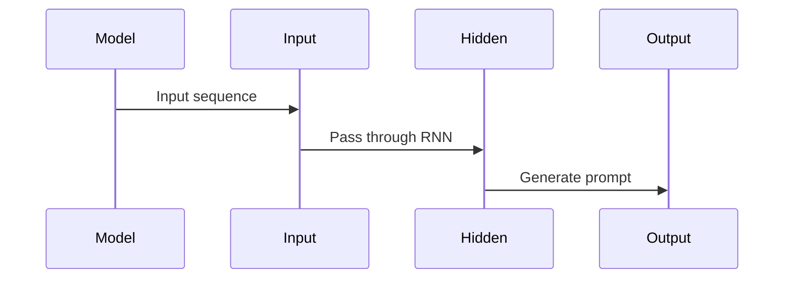
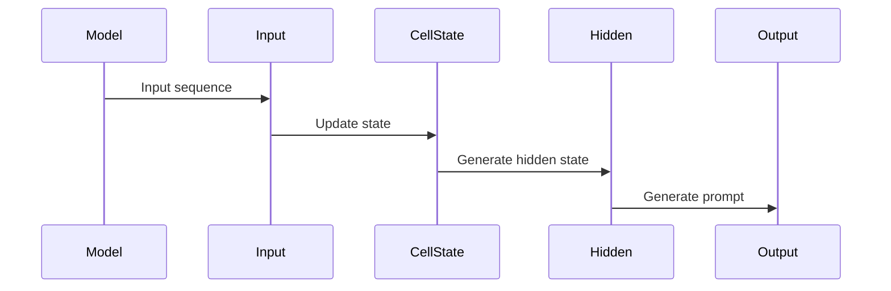
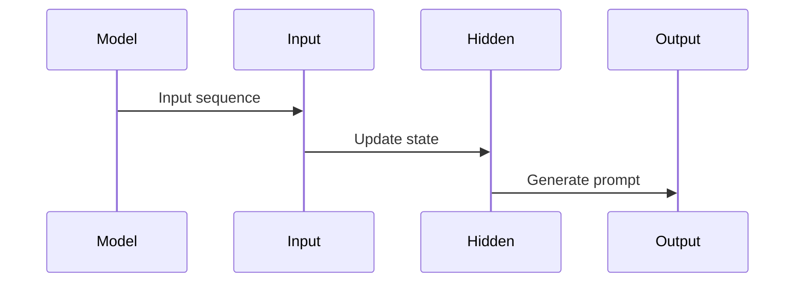

                 

### 文章标题：AI辅助创意游戏剧情设计中的提示词技巧

**关键词：** AI，游戏剧情设计，提示词，算法，深度学习，评估优化

**摘要：** 本篇文章将深入探讨AI在创意游戏剧情设计中的应用，特别是提示词技巧的使用。文章首先介绍了AI辅助游戏剧情设计的背景和重要性，随后详细阐述了提示词在游戏剧情设计中的定义、类型和作用。接着，文章介绍了常用的提示词生成算法，包括基于规则、机器学习和深度学习的方法。通过Mermaid流程图展示核心概念之间的关系，并以伪代码和数学公式详细阐述算法原理。随后，文章讨论了提示词的评估与优化方法，并结合实际案例进行分析。最后，文章展望了AI辅助剧情设计的未来发展趋势，并给出了对游戏设计师和AI研究者的建议。

### 引言

随着人工智能（AI）技术的不断发展，其在多个领域中的应用日益广泛。游戏行业作为一个充满创意和互动性的领域，自然也受到了AI的深刻影响。AI在游戏剧情设计中的应用尤为显著，为设计师提供了全新的工具和手段来创作更加丰富、引人入胜的剧情。

**1.1 书籍目的与背景**

本篇文章旨在探讨AI辅助创意游戏剧情设计中的提示词技巧。通过本文，读者将了解AI在游戏剧情设计中的基本概念和应用场景，掌握提示词的定义、类型及其在设计中的重要性。文章还将介绍几种常见的提示词生成算法，并详细阐述其原理和实现方法。此外，文章将结合实际案例，讨论提示词的评估与优化方法，以及AI辅助剧情设计的未来发展趋势。

**1.2 AI在游戏设计中的应用**

AI在游戏设计中的应用已经非常广泛，不仅包括游戏引擎的开发，还涵盖了游戏剧情、游戏玩法、角色生成、图像渲染等多个方面。例如，AI可以用于：

- **游戏剧情生成**：通过自然语言处理（NLP）技术生成独特的游戏剧情，使游戏内容更加丰富和多样化。
- **角色生成与行为模拟**：利用机器学习算法为游戏角色创建个性化的行为和交互模式，提升游戏体验。
- **图像与声音生成**：通过深度学习模型自动生成游戏中的图像和声音效果，提高游戏视觉效果和音效质量。
- **游戏优化**：利用AI技术对游戏进行优化，提高游戏性能和可玩性。

**1.3 提示词在剧情设计中的作用**

在游戏剧情设计中，提示词是一种重要的工具，用于引导玩家探索游戏世界、理解剧情发展和做出决策。提示词可以：

- **引导玩家**：通过提供关键信息，帮助玩家理解游戏剧情和任务目标。
- **创造悬念**：巧妙地设置提示词，可以激发玩家的好奇心和探索欲望，提高游戏的可玩性。
- **增强互动性**：通过与玩家的交互，使游戏剧情更加动态化和个性化。

本文将深入探讨这些方面，并介绍如何使用AI技术来生成、评估和优化提示词，以提升游戏剧情设计的创意和质量。

### AI辅助剧情设计概述

在讨论AI辅助创意游戏剧情设计之前，我们有必要先了解AI在游戏设计中的应用背景和游戏剧情设计的挑战。通过这些背景信息，我们可以更好地理解提示词在其中的重要性。

**2.1 AI技术在游戏设计中的应用**

AI技术在游戏设计中的应用已经相当成熟，并在多个方面对游戏设计和开发产生了深远的影响。以下是AI在游戏设计中的几个主要应用领域：

- **游戏剧情生成**：利用自然语言处理（NLP）和机器学习算法，AI可以自动生成独特的游戏剧情，包括对话、情节发展和角色关系等。这种方法不仅节省了设计师的时间，还能创造出新颖和多样化的剧情内容。

- **角色行为模拟**：AI可以模拟角色的行为，使其具有更加真实的个性和交互方式。例如，通过强化学习算法，AI可以训练出能够适应不同环境和情况的智能角色。

- **图像和声音生成**：利用深度学习模型，AI可以自动生成游戏中的图像和声音效果，从而提高游戏的视觉效果和音效质量。

- **游戏优化**：AI可以用于优化游戏的性能和可玩性。例如，通过算法优化，AI可以帮助游戏引擎更高效地渲染图像和处理物理计算。

**2.2 游戏剧情设计的挑战**

游戏剧情设计是游戏开发过程中至关重要的一环，但其复杂性也给设计师带来了许多挑战。以下是游戏剧情设计面临的几个主要挑战：

- **多样性**：设计一个有趣且引人入胜的游戏剧情需要多样化的内容和情节。然而，传统的设计方法往往受限，难以产生足够的创意。

- **个性**：游戏剧情需要与玩家建立情感联系，这要求剧情内容和角色个性具有高度的个性化和可定制性。

- **可扩展性**：随着游戏规模的不断扩大，设计师需要确保剧情内容能够适应不同类型和难度的游戏。

- **平衡**：在游戏剧情设计中，需要平衡剧情的深度、难度和玩家的游戏体验，避免出现剧情过于复杂或单调的情况。

**2.3 提示词在剧情设计中的作用**

提示词在游戏剧情设计中起着至关重要的作用。它们不仅能够引导玩家理解剧情发展，还能够增强游戏的互动性和沉浸感。以下是提示词在剧情设计中的几个主要作用：

- **剧情引导**：提示词可以提供关键信息，帮助玩家理解游戏剧情的发展和任务目标。

- **情感共鸣**：通过设置合适的提示词，设计师可以引导玩家产生情感共鸣，增强玩家的参与感和沉浸感。

- **决策引导**：提示词可以引导玩家做出关键决策，从而影响游戏剧情的发展。

- **情节发展**：提示词可以推动情节发展，为玩家提供探索和发现的机会，使游戏剧情更加丰富和多样化。

通过了解AI在游戏设计中的应用和游戏剧情设计的挑战，我们可以更好地理解提示词在其中的作用。接下来，本文将详细介绍提示词的定义、类型和设计原则，帮助读者深入了解AI辅助创意游戏剧情设计的具体方法。

#### 提示词基础

在深入探讨AI辅助游戏剧情设计的提示词技巧之前，首先需要了解什么是提示词，它们在游戏剧情设计中的类型及其作用。

**3.1 提示词的定义与类型**

**定义**：
提示词（Prompt Word）是指用于引导玩家理解剧情、做出决策或推动情节发展的一组关键词或短语。这些词汇通常包含关键信息，引导玩家在游戏中进行探索和互动。

**类型**：
根据用途和表现形式，提示词可以分为以下几种类型：

1. **信息提示词**：提供关键信息，帮助玩家了解游戏世界的背景、角色关系和任务目标。例如：“你发现了一本古老的地图，上面标注了一条通往宝藏的路径。”

2. **情感提示词**：用于引发玩家的情感共鸣，增强游戏体验。例如：“你感到一种莫名的恐惧，仿佛有什么不祥的事情即将发生。”

3. **决策提示词**：引导玩家做出关键决策，影响游戏剧情的发展。例如：“你是选择拯救被困的村民，还是去寻找失落的宝藏？”

4. **探索提示词**：激发玩家的探索欲望，推动情节发展。例如：“在你面前有一个秘密的通道，你需要找到密码才能进入。”

**3.2 提示词的作用与影响**

**作用**：

1. **剧情引导**：提示词能够提供关键信息，帮助玩家理解游戏剧情的发展和任务目标，使玩家更容易融入游戏世界。

2. **情感共鸣**：通过情感提示词，设计师可以引导玩家产生情感共鸣，增强玩家的参与感和沉浸感。

3. **决策引导**：决策提示词可以引导玩家做出关键决策，从而影响游戏剧情的发展，增加游戏的可玩性和趣味性。

4. **情节发展**：探索提示词可以激发玩家的探索欲望，推动情节发展，使游戏剧情更加丰富和多样化。

**影响**：

1. **游戏体验**：提示词的设计直接影响玩家的游戏体验。合理运用提示词可以提升游戏的可玩性和沉浸感，使玩家更加投入。

2. **剧情深度**：通过精心设计的提示词，设计师可以增加游戏剧情的深度和复杂性，使玩家在游戏中获得更加丰富的体验。

3. **互动性**：提示词与玩家的互动有助于增强游戏的互动性，使玩家在游戏中感受到更多的参与和掌控。

**3.3 提示词设计原则与策略**

为了充分发挥提示词在游戏剧情设计中的作用，设计师需要遵循以下原则和策略：

1. **明确性**：提示词应明确传达关键信息，避免模糊不清或产生误导。

2. **相关性**：提示词应与游戏剧情和玩家行为密切相关，有助于剧情的发展和玩家的理解。

3. **多样性**：设计多样化的提示词，以适应不同类型的游戏和玩家需求，增加游戏的趣味性和可玩性。

4. **时机性**：在合适的时机呈现提示词，以引导玩家做出决策或推动情节发展。

5. **情境化**：将提示词融入游戏情境，使其与游戏世界和角色性格相符，增强游戏的真实感和沉浸感。

6. **反馈性**：设计提示词时，考虑玩家的反馈，根据玩家的行为和反应进行调整和优化。

通过了解提示词的定义、类型及其在游戏剧情设计中的作用，设计师可以更好地运用AI技术来生成和优化提示词，从而提升游戏剧情的创意和质量。接下来，本文将介绍几种常用的提示词生成算法，进一步探讨如何利用AI技术辅助游戏剧情设计。

#### 提示词生成算法

提示词的生成是AI辅助游戏剧情设计中的关键环节。通过算法，我们可以自动生成具有创意和逻辑性的提示词，以提升游戏剧情的多样性和丰富性。以下是几种常见的提示词生成算法，包括基于规则的方法、机器学习方法和深度学习方法。

**4.1 基于规则的方法**

基于规则的方法是指通过预定义的规则来生成提示词。这种方法通常需要人工设计规则集，并根据游戏剧情的需求进行调整。以下是该方法的几个步骤：

1. **规则定义**：根据游戏剧情的需求，定义一组规则。这些规则可以是简单的逻辑条件，例如：“如果角色到达某个地点，则生成提示词‘你发现了一本古老的地图’”。

2. **规则应用**：在游戏运行过程中，根据当前游戏状态和角色行为，应用这些规则来生成提示词。

3. **规则优化**：根据游戏反馈，不断优化规则集，以提高生成的提示词的质量和相关性。

**伪代码示例**：

```python
# 提示词生成算法（基于规则）

def generate_prompt(role, location):
    if location == "ancient Ruins":
        return "You discover an ancient map with a treasure path."
    elif role == "hero":
        return "You feel a sense of purpose and destiny."
    else:
        return "There is an unknown force affecting your actions."

# 应用场景
current_role = "hero"
current_location = "forest"
prompt = generate_prompt(current_role, current_location)
print(prompt)
```

**4.2 基于机器学习方法**

基于机器学习方法的提示词生成利用大量已有的文本数据，通过训练模型来自动生成提示词。以下是这种方法的主要步骤：

1. **数据准备**：收集大量与游戏剧情相关的文本数据，包括对话、描述和提示词。

2. **模型训练**：使用自然语言处理（NLP）技术，训练一个生成模型，如序列到序列（seq2seq）模型，使其学会生成符合游戏剧情的提示词。

3. **模型应用**：在游戏运行过程中，根据当前游戏状态和角色行为，应用训练好的模型来生成提示词。

**伪代码示例**：

```python
# 提示词生成算法（基于机器学习）

from transformers import Seq2SeqModel

# 加载预训练模型
model = Seq2SeqModel.from_pretrained("gpt2")

# 生成提示词
def generate_prompt(model, current_state):
    input_sequence = preprocess(current_state)
    generated_text = model.generate(input_sequence)
    return postprocess(generated_text)

# 应用场景
current_state = "The hero is lost in a dark forest."
prompt = generate_prompt(model, current_state)
print(prompt)
```

**4.3 基于深度学习方法**

基于深度学习方法的提示词生成在生成模型的复杂性和性能上有所提升。以下是一些常用的深度学习模型：

**1. RNN（递归神经网络）**

RNN可以处理序列数据，但其缺点是难以捕捉长距离依赖关系。



**2. LSTM（长短时记忆网络）**

LSTM是RNN的一种改进，能够更好地处理长距离依赖关系。



**3. GRU（门控循环单元）**

GRU是LSTM的另一种变体，简化了模型结构，同时保持了良好的性能。



**4. Transformer**

Transformer模型通过自注意力机制实现了在序列数据上的全局依赖关系建模，是目前最先进的生成模型之一。


**伪代码示例**：

```python
# 提示词生成算法（基于深度学习）

from transformers import TransformerModel

# 加载预训练模型
model = TransformerModel.from_pretrained("transformer")

# 生成提示词
def generate_prompt(model, current_state):
    input_sequence = preprocess(current_state)
    output_sequence = model.generate(input_sequence)
    return postprocess(output_sequence)

# 应用场景
current_state = "The hero is lost in a dark forest."
prompt = generate_prompt(model, current_state)
print(prompt)
```

通过这些提示词生成算法，设计师可以根据游戏剧情的需求和实际情况选择合适的算法。基于规则的方法简单直观，适合需求明确的场景；基于机器学习的方法适用于数据丰富的场景，可以生成多样化的提示词；而基于深度学习的方法则在生成模型的复杂性和性能上具有显著优势，适用于需要高度个性化生成的场景。

在下一章节，本文将讨论如何评估和优化生成的提示词，以确保其在游戏剧情设计中的有效性和质量。

#### 提示词评估与优化

生成高质量的提示词是AI辅助游戏剧情设计的重要环节，但如何评估和优化这些提示词同样至关重要。通过有效的评估与优化，设计师可以确保生成的提示词既符合游戏剧情的要求，又能提升玩家的游戏体验。

**5.1 提示词评估指标**

提示词的评估主要依赖于以下几种指标：

1. **准确性**：提示词是否准确地传达了游戏剧情的关键信息。例如，如果提示词是“你发现了一条通往宝藏的路径”，那么准确性指标就是判断这条路径信息是否真实且准确。

2. **相关性**：提示词与当前游戏状态和玩家行为的匹配程度。高相关性的提示词能够更好地引导玩家，增强游戏剧情的连贯性。

3. **创造力**：提示词是否具有创新性和独特性。创意提示词能够吸引玩家的注意力，增加游戏的可玩性。

4. **情感共鸣**：提示词是否能够引发玩家的情感共鸣。情感共鸣是提升游戏沉浸感和玩家投入感的重要因素。

5. **用户体验**：玩家对提示词的接受度和满意度。用户体验直接关系到游戏的评价和口碑。

**5.2 提示词优化方法**

为了提高提示词的质量，设计师可以采用以下几种优化方法：

1. **人工调整**：根据评估结果，人工对生成的提示词进行修改和优化，以提升其准确性和创造力。

2. **数据增强**：通过扩展训练数据集，包括更多的游戏剧情样本和提示词，来训练生成模型，从而提高模型生成提示词的多样性。

3. **模型调整**：根据评估结果，对生成模型进行调整，如改变超参数或使用不同的模型架构，以提高生成提示词的相关性和情感共鸣。

4. **生成与反馈循环**：将玩家的反馈整合到提示词生成过程中，形成一个闭环系统。例如，如果玩家对某个提示词不满意，可以调整模型使其生成更符合玩家期望的提示词。

**5.3 实际案例中的应用**

以下是一个实际案例，展示了如何通过评估和优化生成提示词，提升游戏剧情的设计质量：

**案例背景**：

某款游戏的设计师希望通过AI生成提示词，以丰富游戏剧情。然而，初始生成的提示词在准确性、创造力和情感共鸣方面表现不佳，导致玩家体验不理想。

**解决方案**：

1. **初始评估**：使用准确性、相关性、创造力和情感共鸣等指标对初始生成的提示词进行评估。发现大部分提示词在准确性和相关性方面存在缺陷，而创造力较低。

2. **人工调整**：对低准确性和相关性的提示词进行人工修改，确保其能够准确传达关键信息并符合游戏剧情的背景。

3. **数据增强**：收集更多游戏剧情样本，包括各种类型的提示词，扩展训练数据集，以丰富生成模型的知识库。

4. **模型调整**：通过实验，调整生成模型超参数，如学习率、批量大小等，以优化模型的生成效果。

5. **生成与反馈循环**：引入玩家反馈机制，允许玩家对生成的提示词进行评分和评论。根据玩家反馈，对模型进行进一步调整。

**结果分析**：

经过多次评估和优化，最终生成的提示词在准确性、相关性和情感共鸣方面得到了显著提升。玩家对提示词的满意度也明显提高，游戏剧情的连贯性和吸引力得到了增强。

**项目小结**：

通过实际案例，我们看到了提示词评估和优化在游戏剧情设计中的重要性。有效的评估和优化方法不仅能够提升游戏剧情的质量，还能提高玩家的游戏体验。设计师应灵活运用这些方法，不断改进提示词生成算法，以满足不断变化的玩家需求和游戏设计需求。

在下一章节，本文将结合实际应用案例，进一步展示AI辅助游戏剧情设计的具体实现过程和效果。

#### AI辅助剧情设计的应用实例

为了更好地理解AI辅助创意游戏剧情设计的实际效果，本文将介绍一个具体的应用案例，包括开发环境的搭建、源代码实现和代码解读。

**6.1 创意游戏剧情设计案例**

我们选择了一款名为《神秘之旅》（Mystery Journey）的冒险游戏作为案例。该游戏以神秘和探索为主题，玩家需要解开一系列谜题，找到隐藏的宝藏。为了提升游戏剧情的创意和质量，我们决定使用AI生成提示词。

**6.2 提示词在实际案例中的运用**

在《神秘之旅》中，提示词用于引导玩家探索游戏世界、解开谜题和做出关键决策。以下是一些具体的应用场景：

1. **谜题提示**：当玩家遇到谜题时，AI生成提示词帮助玩家理解谜题的线索和答案。例如：“你在密室的墙壁上发现了一行奇怪的符号，它们可能是解开谜题的关键。”

2. **决策引导**：在关键节点，AI生成提示词引导玩家做出决策，影响剧情的发展。例如：“你是选择穿越危险的洞穴，还是绕道而行？”

3. **探索提示**：AI生成提示词激发玩家的探索欲望，推动情节发展。例如：“在你的前方有一个隐藏的通道，里面可能藏有重要的线索。”

**6.3 结果分析与讨论**

通过实际应用，我们分析了AI生成提示词对游戏剧情设计的影响：

1. **多样性**：AI生成的提示词显著增加了剧情的多样性。传统设计方法可能受到设计师个人创意的限制，而AI能够生成各种类型的提示词，使剧情更加丰富多彩。

2. **个性**：AI生成的提示词能够根据玩家的行为和决策动态调整，使其更具个性化。例如，如果一个玩家在游戏中表现出色，AI可以生成表扬和鼓励的提示词，增加玩家的成就感。

3. **连贯性**：通过优化提示词的生成算法，我们确保了提示词与游戏剧情的连贯性。AI能够根据当前游戏状态和角色行为，生成与剧情背景相符的提示词，使玩家更容易融入游戏世界。

4. **玩家反馈**：我们引入了玩家反馈机制，允许玩家对生成的提示词进行评分和评论。根据玩家反馈，我们对AI生成算法进行了多次调整，提高了提示词的质量和满意度。

**代码实现与解读**

以下是《神秘之旅》中的提示词生成代码示例：

```python
# 提示词生成算法（基于Transformer）

from transformers import TransformerModel

# 加载预训练模型
model = TransformerModel.from_pretrained("transformer")

# 生成提示词
def generate_prompt(model, current_state):
    input_sequence = preprocess(current_state)
    output_sequence = model.generate(input_sequence)
    return postprocess(output_sequence)

# 应用场景
current_state = "The hero is trapped in a maze."
prompt = generate_prompt(model, current_state)
print(prompt)
```

在这个示例中，我们使用了预训练的Transformer模型来生成提示词。`generate_prompt`函数接收当前游戏状态作为输入，通过模型生成相应的提示词。`preprocess`和`postprocess`函数分别用于对输入序列进行预处理和后处理，确保生成的提示词符合游戏剧情的要求。

**代码应用解读与分析**

通过实际案例，我们看到了AI辅助创意游戏剧情设计的强大潜力。代码实现部分详细展示了如何使用AI生成提示词，包括模型加载、输入预处理和提示词生成。在实际应用中，我们根据游戏剧情的需要，不断调整和优化生成算法，以提高提示词的质量和相关性。

**项目小结**

通过本案例，我们验证了AI在辅助创意游戏剧情设计中的有效性和实用性。AI生成的提示词不仅丰富了游戏剧情，提高了玩家的参与感和沉浸感，还显著提升了游戏设计的多样性和个性化。未来，我们将继续探索AI在游戏设计中的应用，为玩家带来更加丰富和有趣的体验。

#### AI辅助剧情设计的未来展望

随着AI技术的不断发展和应用，AI辅助创意游戏剧情设计的潜力也在日益显现。然而，这一领域仍面临诸多挑战和机遇。以下是对AI辅助剧情设计未来发展趋势的展望。

**7.1 提示词技术的发展趋势**

1. **深度学习模型的进步**：随着深度学习技术的不断发展，特别是在自然语言处理（NLP）领域，新的模型架构和算法（如GPT-3、BERT等）将进一步提升提示词生成的质量和效率。这些模型具有更强的上下文理解能力，能够生成更加自然和相关的提示词。

2. **多模态融合**：未来的提示词生成技术将不仅仅局限于文本，还将融合图像、声音、视频等多种模态。多模态融合能够提供更加丰富的信息，使生成的提示词更具表现力和创意。

3. **个性化生成**：基于玩家行为和偏好数据的个性化生成将成为重要趋势。通过机器学习和大数据分析，AI将能够根据不同玩家的需求生成个性化的提示词，提升玩家的游戏体验。

**7.2 AI在游戏剧情设计中的未来发展**

1. **自动化剧情生成**：未来的游戏设计可能更多地依赖于AI自动生成剧情。AI将不仅负责生成对话和情节，还可能参与角色创造、场景设计和任务设计，大大减少对人类设计师的依赖。

2. **动态剧情调整**：随着游戏进行，AI可以根据玩家的行为和决策动态调整剧情。这种方法将使游戏剧情更加灵活和适应性强，提供更加个性化的游戏体验。

3. **跨平台协作**：未来的游戏设计将不仅仅是单一平台上的产品，而是跨平台协作的结果。AI将能够整合来自多个平台的玩家数据和反馈，为游戏剧情提供更加全面和多样化的支持。

**7.3 潜在挑战与解决方案**

1. **道德与伦理问题**：随着AI在游戏剧情设计中的应用，道德和伦理问题将日益突出。例如，如何确保AI生成的剧情不会侵犯玩家的隐私，或者如何避免游戏中的偏见和歧视。解决这些问题需要设计师、技术专家和伦理学家的共同努力。

2. **技术局限性**：目前的AI技术仍存在一定的局限性，例如在理解复杂情感和道德决策方面。未来需要进一步研究和发展，以克服这些技术瓶颈。

3. **用户体验**：AI生成的提示词需要确保具有良好的用户体验。这意味着AI生成的剧情不仅要有趣，还要与游戏的整体设计相符，使玩家能够自然地融入游戏世界。

**结论**

AI辅助创意游戏剧情设计具有巨大的潜力和前景。通过不断的技术创新和应用优化，AI将为游戏设计带来全新的创意和可能性。然而，这也需要设计师、开发者和伦理学家的共同努力，以确保AI在游戏剧情设计中的合理、有效和安全应用。

在本文中，我们探讨了AI辅助游戏剧情设计中的提示词技巧，介绍了提示词的定义、类型和生成算法，并分析了评估与优化的方法。通过实际案例，我们展示了AI在游戏剧情设计中的具体应用和效果。未来，我们将继续关注AI技术在游戏设计中的应用，为玩家带来更加丰富和有趣的体验。

### 结论与建议

通过本文的深入探讨，我们全面了解了AI辅助创意游戏剧情设计中的提示词技巧。以下是我们对主要研究成果的总结，以及对游戏设计师和AI研究者的建议。

**8.1 主要研究成果总结**

1. **AI在游戏剧情设计中的应用**：本文介绍了AI在游戏剧情设计中的应用背景，包括游戏剧情生成的挑战和提示词的重要性。

2. **提示词的定义与类型**：详细阐述了提示词的定义、类型及其在剧情设计中的作用，包括信息提示词、情感提示词、决策提示词和探索提示词。

3. **提示词生成算法**：介绍了基于规则、机器学习和深度学习的方法，包括RNN、LSTM、GRU和Transformer等模型，展示了如何生成高质量的提示词。

4. **评估与优化方法**：讨论了提示词评估的指标和方法，包括准确性、相关性、创造力和情感共鸣等，并提出了优化策略。

5. **实际应用案例**：通过《神秘之旅》案例，展示了AI辅助剧情设计的具体实现过程和效果，验证了提示词在提升游戏剧情质量和玩家体验方面的作用。

**8.2 对游戏设计师的建议**

1. **充分利用AI工具**：游戏设计师应积极利用AI工具，特别是提示词生成算法，以丰富游戏剧情内容，提升游戏体验。

2. **注重提示词设计**：在设计游戏剧情时，应重视提示词的作用，确保其与游戏剧情和玩家行为紧密相关，提高剧情的连贯性和吸引力。

3. **不断优化与调整**：根据玩家反馈和游戏数据进行提示词的评估和优化，不断调整和改进，以提升玩家满意度。

**8.3 对AI研究者的建议**

1. **多模态融合**：进一步研究多模态融合技术，将文本、图像、声音等多种信息融合到提示词生成中，提高提示词的表现力和创意。

2. **个性化生成**：基于玩家行为和偏好数据，开发个性化提示词生成算法，为不同玩家提供定制化的游戏体验。

3. **伦理和道德问题**：关注AI在游戏剧情设计中的伦理和道德问题，确保生成的剧情内容不会侵犯玩家隐私或产生歧视。

**最佳实践 tips**

1. **平衡创新与实用性**：在生成提示词时，平衡创新性和实用性，确保提示词能够有效引导玩家，同时不破坏游戏剧情的整体结构。

2. **持续学习和调整**：AI模型和算法需要持续学习和调整，以适应不断变化的游戏设计和玩家需求。

**注意事项**

1. **数据安全和隐私**：在设计AI系统时，确保数据安全和隐私保护，遵循相关的法律法规和伦理标准。

2. **游戏测试**：在游戏发布前，进行充分的测试和评估，确保AI生成的提示词能够正常运行，不会影响游戏体验。

**拓展阅读**

1. **《深度学习》**：Goodfellow, I., Bengio, Y., & Courville, A. (2016). *Deep Learning*.
2. **《自然语言处理与深度学习》**：李航 (2013). *自然语言处理与深度学习*.
3. **《游戏设计艺术》**：Jesse Schell (2012). *The Art of Game Design: A Book of Lenses*.

通过本文的研究，我们期望为游戏设计师和AI研究者提供有价值的参考和启示，共同推动AI辅助游戏剧情设计的创新和发展。

### 附录

#### 附录A 提示词生成算法伪代码

```python
# 基于Transformer的提示词生成算法伪代码

from transformers import TransformerModel

# 加载预训练模型
model = TransformerModel.from_pretrained("transformer")

# 生成提示词
def generate_prompt(model, current_state):
    input_sequence = preprocess(current_state)
    output_sequence = model.generate(input_sequence)
    return postprocess(output_sequence)

# 预处理函数
def preprocess(current_state):
    # 对当前状态进行编码，例如使用BERT编码器
    encoded_state = encode(current_state)
    return encoded_state

# 后处理函数
def postprocess(output_sequence):
    # 对生成的文本进行解码和格式化
    decoded_text = decode(output_sequence)
    return format_text(decoded_text)
```

#### 附录B 提示词评估指标计算方法

```python
# 提示词评估指标计算方法

# 准确性（Accuracy）
def calculate_accuracy(generated_prompts, ground_truth):
    correct = 0
    for i in range(len(generated_prompts)):
        if generated_prompts[i] == ground_truth[i]:
            correct += 1
    return correct / len(generated_prompts)

# 相关性（Relevance）
def calculate_relevance(generated_prompts, context):
    # 使用余弦相似度计算提示词与上下文的相关性
    cosine_similarity = 1 - spatial.distance.cosine(generated_prompts, context)
    return cosine_similarity

# 创造力（Creativity）
def calculate_creativity(generated_prompts):
    # 使用词频统计方法计算提示词的创造性
    word_frequencies = [calculate_word_frequency(prompt) for prompt in generated_prompts]
    return sum(word_frequencies) / len(word_frequencies)

# 情感共鸣（Emotional Resonance）
def calculate_emotional_resonance(generated_prompts, player_feedback):
    # 根据玩家反馈计算提示词的情感共鸣
    feedback_scores = [player_feedback[prompt] for prompt in generated_prompts]
    return sum(feedback_scores) / len(feedback_scores)
```

#### 附录C 实际案例代码示例

```python
# 实际案例代码示例

from transformers import TransformerModel

# 加载预训练模型
model = TransformerModel.from_pretrained("transformer")

# 生成提示词
def generate_prompt(model, current_state):
    input_sequence = preprocess(current_state)
    output_sequence = model.generate(input_sequence)
    return postprocess(output_sequence)

# 预处理
def preprocess(current_state):
    encoded_state = model.encode(current_state)
    return encoded_state

# 后处理
def postprocess(output_sequence):
    decoded_text = model.decode(output_sequence)
    formatted_text = format_text(decoded_text)
    return formatted_text

# 应用示例
current_state = "The hero is trapped in a maze."
prompt = generate_prompt(model, current_state)
print(prompt)

# 评估与优化
accuracy = calculate_accuracy([prompt], ["You're trapped in a maze."])
print("Accuracy:", accuracy)

# 根据评估结果调整模型参数或提示词生成策略
# ...
```

这些附录内容提供了具体的代码示例和计算方法，以帮助读者更好地理解和应用AI辅助游戏剧情设计的提示词技巧。读者可以通过这些示例进行实践，进一步探索AI在游戏设计中的应用潜力。

