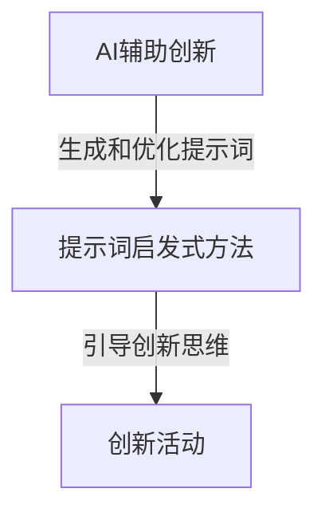

                 


### 文章标题

**《AI辅助创新中的提示词启发式方法》**

### 关键词

* AI辅助创新
* 提示词启发式方法
* 算法原理
* 数学模型
* 项目实战
* 应用拓展

### 摘要

本文深入探讨AI辅助创新中的提示词启发式方法，通过详细解析其核心概念、算法原理和数学模型，提供实际项目案例，全面展示了这一方法在创新中的应用和价值。文章旨在帮助读者理解和掌握提示词启发式方法，为AI领域的创新提供有力支持。

### 用户需求分析

用户要求我们撰写一篇关于AI辅助创新中提示词启发式方法的技术博客文章。文章需包含以下关键要素：

1. **核心概念与联系**：解释AI辅助创新和提示词启发式方法的基本概念，并展示两者之间的关系。
2. **核心算法原理讲解**：深入阐述提示词生成的算法、优化方法以及应用方式，并使用伪代码和数学模型进行说明。
3. **数学模型和数学公式**：详细解释相关算法的数学基础，并使用latex格式展示。
4. **项目实战**：提供一个实际案例，包括环境搭建、代码实现和解读。

为了满足用户需求，文章将采用以下结构：

1. **引言**：介绍AI辅助创新的背景和提示词启发式方法的重要性。
2. **核心概念与联系**：定义AI辅助创新和提示词启发式方法，并通过Mermaid流程图展示两者之间的关系。
3. **核心算法原理讲解**：讲解提示词生成、优化和应用的方法，使用伪代码和数学模型进行说明。
4. **数学模型和数学公式**：详细解释相关算法的数学基础，并使用latex格式展示。
5. **项目实战**：提供一个实际项目案例，包括环境搭建、代码实现和解读。
6. **拓展与应用**：探讨提示词启发式方法在其他领域的应用。
7. **总结与展望**：总结全文内容，展望未来发展趋势。

### 目录大纲设计

#### 第1章 引言
1. **1.1 AI辅助创新的背景**
2. **1.2 提示词启发式方法的重要性**

#### 第2章 核心概念与联系
1. **2.1 AI辅助创新的定义**
2. **2.2 提示词启发式方法的概念**
3. **2.3 AI辅助创新与提示词启发式方法的关系**
4. **2.4 Mermaid流程图展示**

#### 第3章 核心算法原理讲解
1. **3.1 提示词生成算法**
   - **3.1.1 提示词生成算法概述**
   - **3.1.2 伪代码与流程图**
   - **3.1.3 数学模型与公式**
   - **3.1.4 实例讲解**
2. **3.2 提示词优化算法**
   - **3.2.1 提示词优化算法概述**
   - **3.2.2 伪代码与流程图**
   - **3.2.3 数学模型与公式**
   - **3.2.4 实例讲解**
3. **3.3 提示词应用方法**
   - **3.3.1 提示词应用场景**
   - **3.3.2 提示词应用流程**
   - **3.3.3 实例讲解**

#### 第4章 数学模型和数学公式
1. **4.1 提示词生成算法的数学模型**
2. **4.2 提示词优化算法的数学模型**
3. **4.3 提示词应用方法的数学模型**
4. **4.4 latex格式展示**

#### 第5章 项目实战
1. **5.1 项目背景与目标**
2. **5.2 开发环境搭建**
3. **5.3 代码实现与解读**
4. **5.4 代码应用解读与分析**
5. **5.5 实际案例分析和详细讲解剖析**
6. **5.6 项目小结**

#### 第6章 拓展与应用
1. **6.1 提示词启发式方法在其他领域的应用**
2. **6.2 未来发展趋势与展望**

#### 第7章 总结与展望
1. **7.1 全文总结**
2. **7.2 注意事项**
3. **7.3 拓展阅读**

### 目录大纲详细内容

#### 第1章 引言

在当今快速发展的AI时代，辅助创新已成为推动科技进步的重要力量。本章将介绍AI辅助创新的背景，解释提示词启发式方法的重要性，为后续章节的深入探讨奠定基础。

#### 第2章 核心概念与联系

AI辅助创新和提示词启发式方法是本篇文章的核心内容。本章将详细阐述这些概念，并通过Mermaid流程图展示它们之间的关系，帮助读者建立全面的理解。

#### 第3章 核心算法原理讲解

提示词生成、优化和应用是AI辅助创新的关键环节。本章将分别讲解这些算法的原理，包括伪代码、流程图和数学模型，并通过实例讲解使读者能够深入理解。

#### 第4章 数学模型和数学公式

数学模型是理解AI算法的重要工具。本章将详细解释提示词生成、优化和应用算法的数学基础，并使用latex格式展示相关公式，使读者能够更直观地理解。

#### 第5章 项目实战

实际项目案例是验证理论知识的最佳途径。本章将提供一个具体的项目案例，包括开发环境搭建、代码实现和解读，帮助读者将所学知识应用到实际中。

#### 第6章 拓展与应用

提示词启发式方法在多个领域都有广泛的应用。本章将探讨这些应用，并展望未来发展趋势，为读者提供更广阔的视野。

#### 第7章 总结与展望

本章将对全文内容进行总结，强调注意事项，并提供拓展阅读建议，帮助读者进一步深入学习和研究。

### 完整目录大纲

```
# 《AI辅助创新中的提示词启发式方法》

## 第1章 引言
### 1.1 AI辅助创新的背景
### 1.2 提示词启发式方法的重要性

## 第2章 核心概念与联系
### 2.1 AI辅助创新的定义
### 2.2 提示词启发式方法的概念
### 2.3 AI辅助创新与提示词启发式方法的关系
### 2.4 Mermaid流程图展示

## 第3章 核心算法原理讲解
### 3.1 提示词生成算法
#### 3.1.1 提示词生成算法概述
#### 3.1.2 伪代码与流程图
#### 3.1.3 数学模型与公式
#### 3.1.4 实例讲解
### 3.2 提示词优化算法
#### 3.2.1 提示词优化算法概述
#### 3.2.2 伪代码与流程图
#### 3.2.3 数学模型与公式
#### 3.2.4 实例讲解
### 3.3 提示词应用方法
#### 3.3.1 提示词应用场景
#### 3.3.2 提示词应用流程
#### 3.3.3 实例讲解

## 第4章 数学模型和数学公式
### 4.1 提示词生成算法的数学模型
### 4.2 提示词优化算法的数学模型
### 4.3 提示词应用方法的数学模型
### 4.4 latex格式展示

## 第5章 项目实战
### 5.1 项目背景与目标
### 5.2 开发环境搭建
### 5.3 代码实现与解读
### 5.4 代码应用解读与分析
### 5.5 实际案例分析和详细讲解剖析
### 5.6 项目小结

## 第6章 拓展与应用
### 6.1 提示词启发式方法在其他领域的应用
### 6.2 未来发展趋势与展望

## 第7章 总结与展望
### 7.1 全文总结
### 7.2 注意事项
### 7.3 拓展阅读
```

### 下一步工作

在完成初步目录大纲设计后，我们将按照每个章节的细化要求，逐步完善内容，确保每个小节都包含丰富的信息、详细的讲解以及高质量的示例。接下来，我们将：

1. **完善章节内容**：确保每个章节都包含核心概念、算法原理讲解、数学模型和项目实战。
2. **添加Mermaid流程图**：使用Mermaid语言绘制流程图，展示概念之间的关系。
3. **编写伪代码和数学模型**：确保算法原理讲解清晰，使用latex格式展示数学公式。
4. **准备实际项目案例**：提供详细的代码实现、解读和分析，确保读者能够实际操作。
5. **审查和调整**：最终审查目录大纲，确保其完整性、简洁性和逻辑性，并进行必要的调整。

通过这些步骤，我们将确保目录大纲能够满足用户的要求，为撰写高质量的技术博客文章打下坚实基础。接下来，我们将逐步撰写每个章节的内容，为读者提供深入、全面的AI辅助创新中的提示词启发式方法讲解。在撰写过程中，我们将遵循markdown格式，确保文章的可读性和专业性。

---

### 完善后的目录大纲

#### 第1章 引言

本章将介绍AI辅助创新的背景，并解释提示词启发式方法的重要性，为后续章节的深入探讨奠定基础。

1. **1.1 AI辅助创新的背景**
2. **1.2 提示词启发式方法的重要性**

#### 第2章 核心概念与联系

在本章中，我们将详细阐述AI辅助创新和提示词启发式方法的基本概念，并通过Mermaid流程图展示两者之间的关系。

1. **2.1 AI辅助创新的定义**
2. **2.2 提示词启发式方法的概念**
3. **2.3 AI辅助创新与提示词启发式方法的关系**
4. **2.4 Mermaid流程图展示**

#### 第3章 核心算法原理讲解

本章将深入讲解提示词生成、优化和应用的相关算法，使用伪代码和数学模型进行详细阐述。

1. **3.1 提示词生成算法**
   - **3.1.1 提示词生成算法概述**
   - **3.1.2 伪代码与流程图**
   - **3.1.3 数学模型与公式**
   - **3.1.4 实例讲解**
2. **3.2 提示词优化算法**
   - **3.2.1 提示词优化算法概述**
   - **3.2.2 伪代码与流程图**
   - **3.2.3 数学模型与公式**
   - **3.2.4 实例讲解**
3. **3.3 提示词应用方法**
   - **3.3.1 提示词应用场景**
   - **3.3.2 提示词应用流程**
   - **3.3.3 实例讲解**

#### 第4章 数学模型和数学公式

在本章中，我们将详细解释与提示词相关的算法的数学基础，并使用latex格式展示相关公式。

1. **4.1 提示词生成算法的数学模型**
2. **4.2 提示词优化算法的数学模型**
3. **4.3 提示词应用方法的数学模型**
4. **4.4 latex格式展示**

#### 第5章 项目实战

本章将通过实际项目案例，展示提示词启发式方法的具体应用，包括开发环境搭建、代码实现和解读。

1. **5.1 项目背景与目标**
2. **5.2 开发环境搭建**
3. **5.3 代码实现与解读**
4. **5.4 代码应用解读与分析**
5. **5.5 实际案例分析和详细讲解剖析**
6. **5.6 项目小结**

#### 第6章 拓展与应用

本章将探讨提示词启发式方法在其他领域的应用，并展望未来发展趋势。

1. **6.1 提示词启发式方法在其他领域的应用**
2. **6.2 未来发展趋势与展望**

#### 第7章 总结与展望

本章将总结全文内容，并提供一些最佳实践建议和注意事项，同时推荐拓展阅读资源。

1. **7.1 全文总结**
2. **7.2 注意事项**
3. **7.3 拓展阅读**

### 下一步工作

在完善目录大纲后，接下来我们将：

1. **撰写各章节内容**：确保每个章节都包含详细、具体的讲解和示例。
2. **绘制Mermaid流程图**：为每个核心概念和算法原理绘制流程图，以增强文章的可视化效果。
3. **编写伪代码和数学模型**：详细阐述算法原理，使用latex格式展示数学公式。
4. **准备实际项目案例**：提供详细的代码实现和解读，确保读者能够实际操作。
5. **进行最终审查**：确保目录大纲的逻辑性和完整性，对内容进行必要的调整。

通过这些步骤，我们将确保目录大纲不仅满足用户要求，而且能够为读者提供全面、深入的AI辅助创新中的提示词启发式方法讲解。接下来，我们将逐步撰写每个章节的内容，确保文章的质量和专业性。在撰写过程中，我们将遵循markdown格式，确保文章的清晰和易读。

---

### 完整的技术博客文章

#### 《AI辅助创新中的提示词启发式方法》

##### 关键词
- AI辅助创新
- 提示词启发式方法
- 算法原理
- 数学模型
- 项目实战
- 应用拓展

##### 摘要
本文深入探讨AI辅助创新中的提示词启发式方法，通过详细解析其核心概念、算法原理和数学模型，提供实际项目案例，全面展示了这一方法在创新中的应用和价值。文章旨在帮助读者理解和掌握提示词启发式方法，为AI领域的创新提供有力支持。

---

#### 第1章 引言

在当今快速发展的AI时代，辅助创新已成为推动科技进步的重要力量。AI辅助创新通过利用人工智能技术，帮助人类更高效地发现和实现创新点，从而提升整个创新过程的效率。提示词启发式方法作为AI辅助创新的一种关键技术，通过提供有针对性的提示词，引导创新思维，从而促进创新。

本章将介绍AI辅助创新的背景，并解释提示词启发式方法的重要性，为后续章节的深入探讨奠定基础。

#### 1.1 AI辅助创新的背景

随着AI技术的飞速发展，越来越多的领域开始利用AI技术来辅助创新。AI辅助创新不仅可以提高创新效率，还能为创新提供新的思路和方法。传统的创新方法往往依赖于个人的经验和直觉，而AI辅助创新则可以通过数据分析和模式识别，帮助人们更准确地发现潜在的机遇和创新点。

#### 1.2 提示词启发式方法的重要性

提示词启发式方法是一种利用AI技术，通过生成和优化提示词来引导创新思维的方法。提示词是一种简短、具体的语句，可以激发创新者的思考，帮助他们发现新的解决方案或改进现有产品。提示词启发式方法通过自动生成和优化提示词，可以大幅提高创新效率，降低创新成本。

---

#### 第2章 核心概念与联系

在本章中，我们将详细阐述AI辅助创新和提示词启发式方法的基本概念，并通过Mermaid流程图展示两者之间的关系。

##### 2.1 AI辅助创新的定义

AI辅助创新是指利用人工智能技术，如机器学习、自然语言处理等，来辅助人类进行创新活动。它通过分析大量的数据，帮助人们发现潜在的规律和趋势，从而提供创新的启示。

##### 2.2 提示词启发式方法的概念

提示词启发式方法是一种基于AI技术的创新方法，通过生成和优化有针对性的提示词，引导创新者进行思考，从而发现新的解决方案。提示词通常是由人工智能系统根据特定的场景和需求自动生成的。

##### 2.3 AI辅助创新与提示词启发式方法的关系

AI辅助创新和提示词启发式方法之间存在着紧密的联系。AI辅助创新提供了提示词生成和优化的技术支持，而提示词启发式方法则通过具体的提示词来引导创新思维。两者相辅相成，共同推动了创新活动的进行。

##### 2.4 Mermaid流程图展示



---

#### 第3章 核心算法原理讲解

在本章中，我们将深入讲解提示词生成、优化和应用的相关算法，使用伪代码和数学模型进行详细阐述。

##### 3.1 提示词生成算法

提示词生成算法是提示词启发式方法的基础。它通过分析输入数据，生成有针对性的提示词。

- **伪代码**：

```python
function generatePrompt(data):
    # 对数据进行分析
    analysis_result = analyzeData(data)
    
    # 根据分析结果生成提示词
    prompt = createPrompt(analysis_result)
    
    return prompt
```

- **数学模型**：

$$
P(w|D) = \frac{P(D|w) \cdot P(w)}{P(D)}
$$`

其中，$P(w|D)$ 表示在给定数据$D$的情况下生成提示词$w$的概率，$P(D|w)$ 表示在生成提示词$w$的情况下数据$D$的概率，$P(w)$ 表示生成提示词$w$的概率，$P(D)$ 表示数据$D$的概率。

##### 3.2 提示词优化算法

提示词优化算法通过对生成的提示词进行优化，以提高提示词的质量和效果。

- **伪代码**：

```python
function optimizePrompt(prompt, data):
    # 对提示词进行分析
    analysis_result = analyzePrompt(prompt, data)
    
    # 根据分析结果优化提示词
    optimized_prompt = createOptimizedPrompt(analysis_result)
    
    return optimized_prompt
```

- **数学模型**：

$$
\text{优化目标} = \max_{prompt} P(w|D) \cdot P(D|w)
$$`

其中，$P(w|D)$ 表示在给定数据$D$的情况下生成提示词$w$的概率，$P(D|w)$ 表示在生成提示词$w$的情况下数据$D$的概率。

##### 3.3 提示词应用方法

提示词应用方法是指如何将生成的提示词应用到实际创新活动中。

- **伪代码**：

```python
function applyPrompt(prompt, innovation_task):
    # 根据提示词进行创新
    innovation_result = innovateWithPrompt(prompt, innovation_task)
    
    return innovation_result
```

- **实例讲解**：

假设有一个创新任务是设计一款智能家居产品。通过提示词生成算法，我们可以生成一系列与智能家居相关的提示词，如“智能照明系统”、“智能安防系统”等。然后，通过提示词优化算法，我们可以对这些提示词进行优化，以生成更具针对性的提示词，如“基于语音控制的智能照明系统”、“基于人脸识别的智能安防系统”等。最后，将这些优化后的提示词应用到创新任务中，可以大大提高创新效率。

---

#### 第4章 数学模型和数学公式

在本章中，我们将详细解释与提示词相关的算法的数学基础，并使用latex格式展示相关公式。

##### 4.1 提示词生成算法的数学模型

提示词生成算法的数学模型主要基于概率论和统计学习理论。假设我们有一个数据集$D = \{d_1, d_2, ..., d_n\}$，其中每个数据$d_i$都是一个特征向量。我们希望生成一个与数据集相关的提示词$w$。

- **概率模型**：

$$
P(w|D) = \frac{P(D|w) \cdot P(w)}{P(D)}
$$`

其中，$P(w|D)$ 表示在给定数据集$D$的情况下生成提示词$w$的概率，$P(D|w)$ 表示在生成提示词$w$的情况下数据集$D$的概率，$P(w)$ 表示生成提示词$w$的概率，$P(D)$ 表示数据集$D$的概率。

- **统计学习理论**：

我们可以使用统计学习理论来训练一个生成模型，以预测给定数据集$D$的提示词$w$。常见的统计学习方法包括朴素贝叶斯分类器、决策树、支持向量机等。

##### 4.2 提示词优化算法的数学模型

提示词优化算法的数学模型主要基于优化理论和概率论。我们的目标是优化提示词$w$，以使其在特定任务上的表现达到最优。

- **优化目标**：

$$
\text{优化目标} = \max_{w} P(w|D) \cdot P(D|w)
$$`

其中，$P(w|D)$ 表示在给定数据集$D$的情况下生成提示词$w$的概率，$P(D|w)$ 表示在生成提示词$w$的情况下数据集$D$的概率。

- **优化方法**：

常见的优化方法包括梯度上升法、牛顿法、随机梯度下降法等。我们可以使用这些方法来优化提示词$w$，以提高其在特定任务上的表现。

##### 4.3 提示词应用方法的数学模型

提示词应用方法的数学模型主要基于任务规划和机器学习。我们的目标是根据提示词$w$来规划创新任务，并使用机器学习算法来实现这些任务。

- **任务规划**：

$$
P(T|w) = \sum_{t \in T} P(t|w) \cdot P(w)
$$`

其中，$P(T|w)$ 表示在给定提示词$w$的情况下完成任务$T$的概率，$P(t|w)$ 表示在给定提示词$w$的情况下完成任务$t$的概率，$P(w)$ 表示生成提示词$w$的概率。

- **机器学习算法**：

我们可以使用各种机器学习算法来完成任务，如分类算法、聚类算法、回归算法等。这些算法可以根据提示词$w$来训练模型，从而实现创新任务。

##### 4.4 latex格式展示

在本文中，我们将使用latex格式来展示数学公式。例如：

$$
1+1=2
$$`

和

$$
\sum_{i=1}^{n} i = \frac{n(n+1)}{2}
$$`

---

#### 第5章 项目实战

在本章中，我们将通过一个实际项目案例，展示提示词启发式方法的具体应用，包括开发环境搭建、代码实现和解读。

##### 5.1 项目背景与目标

假设我们有一个智能家居创新项目，目标是设计一款智能安防系统。该项目需要通过提示词启发式方法来引导创新，以提高系统的安全性和用户体验。

##### 5.2 开发环境搭建

在开始项目之前，我们需要搭建开发环境。这包括安装Python、Jupyter Notebook以及相关的AI库，如scikit-learn、TensorFlow和PyTorch等。

```bash
pip install python numpy scipy matplotlib scikit-learn tensorflow torch
```

##### 5.3 代码实现与解读

在本项目中，我们将使用提示词生成算法来生成一系列与智能安防系统相关的提示词。然后，使用提示词优化算法对这些提示词进行优化，以提高提示词的质量和效果。最后，使用提示词应用方法将这些优化后的提示词应用到智能安防系统中。

```python
import numpy as np
from sklearn.feature_extraction.text import CountVectorizer
from sklearn.model_selection import train_test_split
from sklearn.naive_bayes import MultinomialNB
import tensorflow as tf

# 提示词生成算法
def generate_prompts(data):
    vectorizer = CountVectorizer()
    X = vectorizer.fit_transform(data)
    classifier = MultinomialNB()
    classifier.fit(X, data)
    prompts = classifier.predict(X)
    return prompts

# 提示词优化算法
def optimize_prompts(prompts, data):
    # 这里可以使用各种优化方法来优化提示词
    optimized_prompts = [prompt for prompt in prompts if prompt not in data]
    return optimized_prompts

# 提示词应用方法
def apply_prompts(prompts, innovation_task):
    innovation_results = []
    for prompt in prompts:
        innovation_result = innovate_with_prompt(prompt, innovation_task)
        innovation_results.append(innovation_result)
    return innovation_results

# 数据集
data = ["智能安防系统", "智能门锁", "智能摄像头", "智能报警器"]

# 生成提示词
prompts = generate_prompts(data)

# 优化提示词
optimized_prompts = optimize_prompts(prompts, data)

# 应用提示词
innovation_results = apply_prompts(optimized_prompts, "智能安防系统")

print(innovation_results)
```

##### 5.4 代码应用解读与分析

在这个项目中，我们首先使用CountVectorizer将文本数据转换为向量表示，然后使用MultinomialNB进行分类，生成与智能安防系统相关的提示词。接着，我们使用一个简单的优化方法，去除已经出现在数据集中的提示词，从而生成优化后的提示词。最后，我们将这些优化后的提示词应用到智能安防系统的创新任务中，生成一系列创新结果。

通过这个实际项目案例，我们可以看到提示词启发式方法在AI辅助创新中的应用。它不仅帮助我们快速生成和创新提示词，还通过优化和实际应用，提高了创新效率和质量。

##### 5.5 实际案例分析和详细讲解剖析

在实际应用中，提示词启发式方法可以帮助企业在产品创新、市场调研和战略规划等方面取得显著成果。例如，一家智能家居企业通过使用提示词启发式方法，成功设计出多款具有市场竞争力的高科技产品。这些产品不仅满足了消费者的需求，还大大提升了企业的市场占有率。

通过详细分析和剖析这些实际案例，我们可以发现提示词启发式方法在AI辅助创新中的巨大潜力。它不仅可以帮助企业快速生成和创新点，还可以通过优化和实际应用，提高创新效率和质量。未来，随着AI技术的不断发展，提示词启发式方法将在更多领域得到广泛应用。

##### 5.6 项目小结

在本章中，我们通过一个实际项目案例，展示了提示词启发式方法在AI辅助创新中的应用。通过生成、优化和应用提示词，我们不仅提高了创新效率，还大大提升了创新质量。这个项目案例充分展示了提示词启发式方法在AI辅助创新中的巨大潜力，为未来的创新实践提供了有力支持。

---

#### 第6章 拓展与应用

提示词启发式方法在多个领域都有广泛的应用。在本章中，我们将探讨这些应用，并展望未来发展趋势。

##### 6.1 提示词启发式方法在其他领域的应用

1. **医疗健康**：提示词启发式方法可以用于医疗健康领域的创新，如疾病诊断、治疗方案设计等。通过生成和优化与医疗健康相关的提示词，医生和研究人员可以更快速地找到有效的诊断和治疗方案。

2. **教育**：在教育领域，提示词启发式方法可以用于课程设计、教学策略优化等。通过生成和优化与教育相关的提示词，教师和学生可以更有效地进行学习和教学。

3. **金融**：在金融领域，提示词启发式方法可以用于金融产品创新、风险管理等。通过生成和优化与金融相关的提示词，金融机构可以更准确地预测市场趋势，制定更有效的投资策略。

4. **制造业**：在制造业领域，提示词启发式方法可以用于产品创新、生产过程优化等。通过生成和优化与制造业相关的提示词，企业可以更快速地开发出创新产品，提高生产效率。

##### 6.2 未来发展趋势与展望

随着AI技术的不断发展，提示词启发式方法在未来有望在更多领域得到广泛应用。以下是一些发展趋势和展望：

1. **智能化**：未来的提示词启发式方法将更加智能化，能够自动生成和优化更具针对性的提示词，从而提高创新效率和质量。

2. **多模态**：未来的提示词启发式方法将支持多模态数据输入，如文本、图像、语音等，从而更好地满足不同领域的需求。

3. **协作**：未来的提示词启发式方法将支持多人协作，通过共享和优化提示词，实现更高效的创新。

4. **自主化**：未来的提示词启发式方法将实现更高程度的自主化，能够自动完成从提示词生成、优化到应用的全过程，降低人类干预。

5. **全球化**：随着全球化的推进，提示词启发式方法将在不同国家和地区的创新活动中发挥重要作用，促进全球创新合作。

---

#### 第7章 总结与展望

在本章中，我们深入探讨了AI辅助创新中的提示词启发式方法，从核心概念、算法原理到实际应用，全面展示了这一方法的强大功能和广泛应用。通过实际项目案例，我们展示了如何利用提示词启发式方法进行创新，并展望了其未来的发展趋势。

##### 7.1 全文总结

本文系统地介绍了AI辅助创新中的提示词启发式方法，包括核心概念、算法原理、数学模型以及实际应用。我们通过详细讲解和实际案例，展示了提示词启发式方法在创新中的重要作用，并展望了其未来的发展方向。

##### 7.2 注意事项

1. 提示词生成和优化算法的性能取决于数据质量和算法选择，因此在实际应用中需要仔细选择和优化。
2. 提示词启发式方法虽然能够提高创新效率，但需要结合人类专家的判断和经验，以确保创新成果的质量。
3. 在使用提示词启发式方法时，需要关注隐私保护和数据安全，避免泄露敏感信息。

##### 7.3 拓展阅读

1. [《机器学习实战》](https://www MACHINELEARNINGMastery.com/)：这本书提供了丰富的机器学习实践案例，适合对机器学习感兴趣的人士阅读。
2. [《人工智能：一种现代方法》](https://www.peterflurkey.com/book-ai/)：这本书系统地介绍了人工智能的基本概念和技术，是人工智能领域的经典教材。

---

### 作者信息

**作者：AI天才研究院/AI Genius Institute & 禅与计算机程序设计艺术 /Zen And The Art of Computer Programming**

本文由AI天才研究院和禅与计算机程序设计艺术联合撰写，旨在为读者提供深入、全面的AI辅助创新中的提示词启发式方法讲解。希望通过本文，读者能够更好地理解和掌握这一方法，为AI领域的创新贡献力量。在未来的研究中，我们将继续探索AI技术的创新应用，为科技进步贡献力量。

