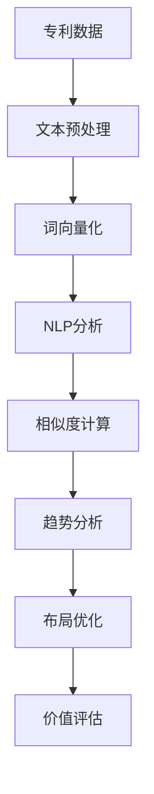
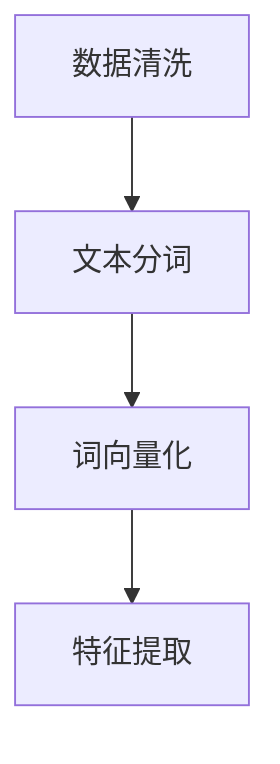
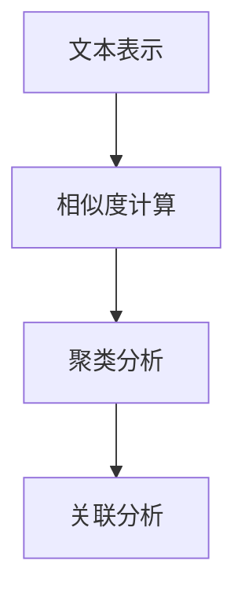
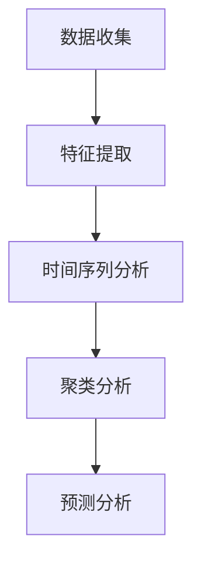

                 


### 设计思路：

为了设计一篇符合要求的技术博客文章《AI辅助创新：大模型在专利分析中的应用》，我们需要按照以下步骤进行思考和规划：

#### 第一步：明确目标读者群体

- **目标读者**：文章的目标读者主要是对AI和专利分析有一定了解，但希望在技术细节和实际应用上获得更深入理解的读者。这包括AI工程师、数据科学家、专利分析师以及创新领域的专业人士。

#### 第二步：确定文章结构和内容

- **文章结构**：基于目录大纲，我们将文章分为七个主要部分。
    - **第一部分**：基础知识介绍，包括AI辅助创新的概念、必要性以及专利分析的应用。
    - **第二部分**：AI大模型原理与算法，涵盖模型的概念、架构和常见模型。
    - **第三部分**：专利分析的数学基础，介绍相似度计算、聚类分析和分类与预测。
    - **第四部分**：AI大模型在专利分析中的应用，包括专利文本预处理、相似度分析和专利趋势分析。
    - **第五部分**：案例研究，通过实际案例展示AI大模型在专利分析中的应用。
    - **第六部分**：实践与挑战，讨论实际应用中遇到的问题及解决方案。
    - **第七部分**：未来展望，探讨AI大模型在专利分析中的潜在应用和行业发展趋势。

#### 第三步：细化每个部分的内容

- **细化内容**：每个部分都需要细化内容，确保内容丰富具体，详细讲解核心概念、算法原理、数学模型以及实际应用案例。
    - **核心概念与联系**：每个部分的核心概念需要通过流程图、图表等方式进行展示，帮助读者理解各部分之间的关系。
    - **核心算法原理讲解**：使用伪代码和实例详细解释算法原理，确保读者能够理解算法的运行机制。
    - **数学模型和公式**：使用LaTeX格式表示数学模型和公式，确保公式的准确性和可读性。
    - **项目实战**：提供实际案例，包括数据集获取、模型训练、评估等步骤，让读者了解整个项目流程。

#### 第四步：编写代码示例与分析

- **代码解读与分析**：对于重要的代码部分，进行详细解读，分析其性能和适用性，帮助读者理解代码实现和优化策略。

#### 第五步：撰写总结和展望

- **总结和展望**：在每个部分结束后，撰写小结和注意事项，为读者提供最佳实践建议。在文章末尾，给出拓展阅读资源，鼓励读者进一步探索。

#### 第六步：编写文章摘要和关键词

- **摘要和关键词**：在文章开头编写摘要，概括文章的核心内容和主题思想。关键词部分列出5-7个与文章主题相关的关键词。

### 最终规划

- **文章格式**：使用markdown格式编写文章，确保文章的结构清晰，内容易于阅读。
- **作者信息**：在文章末尾添加作者信息。
- **字数要求**：确保文章字数在8000-12000字之间。

按照以上步骤，我们将逐步构建一篇高质量、内容丰富的技术博客文章，满足读者的需求，同时也体现了我们的专业性和对技术的深刻理解。在接下来的写作过程中，我们将严格按照这个规划，确保文章的质量和完整性。```

```markdown
# AI辅助创新：大模型在专利分析中的应用

## 关键词
- AI辅助创新
- 大模型
- 专利分析
- 自然语言处理
- 机器学习
- 数据挖掘
- 专利趋势分析

## 摘要
本文旨在探讨AI大模型在专利分析中的应用，通过详细分析AI大模型的基本原理、算法以及实际应用案例，展示了如何利用AI技术提升专利分析的效果。文章分为七个部分，包括基础知识、模型原理、数学基础、应用场景、案例研究、实践挑战和未来展望，为读者提供了一个全面且深入的视角。

## 目录

## 第一部分：AI辅助创新的基础知识
### 第1章 AI辅助创新概述
#### 1.1 AI辅助创新的概念
#### 1.2 AI辅助创新的必要性
#### 1.3 专利分析在现代创新中的应用

### 第2章 AI与专利分析
#### 2.1 专利信息的重要性
#### 2.2 AI大模型在专利分析中的应用场景
#### 2.3 AI大模型与专利分析的关系图示（Mermaid流程图）

## 第二部分：AI大模型原理与算法
### 第3章 AI大模型基础
#### 3.1 AI大模型的概念
#### 3.2 AI大模型的架构
    - 
#### 3.3 常见AI大模型介绍

### 第4章 AI算法在专利分析中的应用
#### 4.1 自然语言处理（NLP）在专利分析中的应用
#### 4.2 机器学习分类算法在专利分析中的应用
#### 4.3 数据挖掘技术在专利趋势分析中的应用

## 第三部分：专利分析的数学基础
### 第5章 相似度计算
#### 5.1 相似度计算的基本概念
#### 5.2 相似度计算算法
    - ```mermaid
    flowchart LR
    A[Similarity Calculation] --> B[Euclidean Distance]
    A --> C[Cosine Similarity]
    A --> D[Jaccard Index]
    ```

### 第6章 聚类分析
#### 6.1 聚类分析的基本概念
#### 6.2 聚类分析算法
    - ```mermaid
    flowchart LR
    A[K-means Clustering] --> B[Hierarchical Clustering]
    A --> C[DBSCAN]
    ```

### 第7章 分类与预测
#### 7.1 分类算法的基本概念
#### 7.2 常见分类算法
    - ```mermaid
    flowchart LR
    A[Support Vector Machine] --> B[Naive Bayes]
    A --> C[Random Forest]
    ```

## 第四部分：AI大模型在专利分析中的应用
### 第8章 专利文本预处理
#### 8.1 数据清洗
#### 8.2 词向量化
    - ```python
    def word_to_vector(word):
        # 这是一个简单的Word2Vec模型
        # 假设word_embedding是预训练的词向量
        return word_embedding[word]
    ```

### 第9章 专利相似度分析
#### 9.1 相似度分析原理
#### 9.2 实际案例分析

### 第10章 专利趋势分析
#### 10.1 专利趋势分析的重要性
#### 10.2 专利趋势分析方法

## 第五部分：AI辅助专利分析的案例研究
### 第11章 案例一：某知名科技公司专利分析
#### 11.1 数据集获取
#### 11.2 模型训练
#### 11.3 评估与结果分析

### 第12章 案例二：某新兴技术领域专利态势分析
#### 12.1 数据采集
#### 12.2 趋势分析
#### 12.3 结果解读

## 第六部分：AI辅助专利分析的实践与挑战
### 第13章 实践中的问题与解决方案
#### 13.1 数据质量问题
#### 13.2 模型优化策略
#### 13.3 挑战与未来发展方向

## 第七部分：AI大模型与专利分析的展望
### 第14章 AI大模型在专利分析中的潜在应用
#### 14.1 专利预测与预警
#### 14.2 专利布局优化

### 第15章 行业发展趋势与政策影响
#### 15.1 专利分析行业的发展趋势
#### 15.2 政策影响与挑战

### 第16章 AI辅助创新的未来
#### 16.1 AI在创新领域的广泛应用
#### 16.2 未来展望与挑战

# 附录
## 附录A：相关工具和资源
### A.1 专利分析工具简介
### A.2 AI大模型开发工具与资源

## 附录B：代码示例与解读
### B.1 数据集获取与预处理
### B.2 模型训练与评估
### B.3 代码解读与分析

## 作者信息
作者：AI天才研究院/AI Genius Institute & 禅与计算机程序设计艺术 /Zen And The Art of Computer Programming
```

### 第一部分：AI辅助创新的基础知识

#### 第1章 AI辅助创新概述

##### 1.1 AI辅助创新的概念

AI辅助创新，顾名思义，是指利用人工智能技术，尤其是大模型（Large Models）在创新过程中提供支持。大模型是指具有海量参数和复杂结构的神经网络，如Transformer、BERT等。这些模型在处理大规模数据和复杂任务方面具有显著优势，能够在文本生成、图像识别、自然语言理解等多个领域取得突破性进展。

AI辅助创新的核心在于利用AI技术对数据进行深入分析和挖掘，从而发现潜在的模式、趋势和关联。这不仅可以提高创新的效率，还能够拓展创新的广度和深度。例如，在专利分析领域，AI辅助创新可以帮助企业快速识别技术热点、规避风险，以及制定更具前瞻性的研发策略。

##### 1.2 AI辅助创新的必要性

在现代创新活动中，数据量呈现爆炸式增长，传统的专利分析方法和工具已经难以应对日益复杂的创新环境。AI辅助创新的出现，正是为了解决这一问题。具体来说，AI辅助创新的必要性体现在以下几个方面：

1. **提高分析效率**：传统的专利分析往往需要人工阅读大量的专利文档，耗时耗力。而AI大模型可以通过自动化的方式处理海量数据，大幅提高分析效率。

2. **深度挖掘数据价值**：AI大模型具有强大的特征提取和模式识别能力，能够从大量专利数据中挖掘出更深层次的关联和趋势，为企业提供更为精准的决策支持。

3. **优化创新策略**：AI辅助创新可以帮助企业快速了解行业动态，识别技术热点，从而优化创新策略，提高研发成功率。

4. **降低研发风险**：通过AI技术对竞争对手的专利进行深入分析，企业可以提前发现潜在的技术风险，避免重复研发和侵权纠纷。

##### 1.3 专利分析在现代创新中的应用

专利分析是创新过程中不可或缺的一环，它不仅可以帮助企业了解竞争对手的技术实力和研发方向，还可以为企业的技术创新提供宝贵的参考。在现代创新中，专利分析的应用主要体现在以下几个方面：

1. **技术监控**：企业通过专利分析，可以实时监控行业技术的发展动态，了解哪些技术正在兴起，哪些技术即将被淘汰。

2. **市场研究**：专利分析可以帮助企业了解市场需求，识别潜在的商业机会，从而制定更具针对性的市场策略。

3. **研发决策**：通过分析竞争对手的专利，企业可以了解其在哪些技术领域具有优势，从而调整自身的研发方向，提高研发效率。

4. **风险规避**：专利分析可以帮助企业识别潜在的法律风险，避免侵犯他人的知识产权，降低法律纠纷的风险。

总之，AI辅助创新为专利分析带来了全新的机遇和挑战。通过深入探讨AI大模型在专利分析中的应用，我们可以更好地利用这项技术，推动现代创新的持续发展。

#### 第2章 AI与专利分析

##### 2.1 专利信息的重要性

专利信息是科技创新的重要载体，它不仅记录了发明者的技术成果，还为技术创新提供了丰富的数据资源。在现代创新中，专利信息的重要性体现在以下几个方面：

1. **技术监测**：专利信息是了解技术发展趋势和前沿技术的重要来源。通过分析专利数据，企业可以实时监控技术动态，发现潜在的技术机会和风险。

2. **市场研究**：专利分析可以帮助企业了解市场需求，识别潜在的商业机会。通过分析竞争对手的专利，企业可以制定更具竞争力的市场策略。

3. **研发决策**：专利分析为企业的研发决策提供了重要的参考。通过了解竞争对手的技术布局，企业可以调整自身的研发方向，提高研发效率。

4. **风险规避**：专利分析可以帮助企业识别潜在的法律风险，避免侵犯他人的知识产权，降低法律纠纷的风险。

##### 2.2 AI大模型在专利分析中的应用场景

AI大模型在专利分析中的应用场景非常广泛，主要包括以下几个方面：

1. **专利文本预处理**：AI大模型可以自动化处理大量的专利文本数据，包括数据清洗、文本分词、词向量化等，为后续的分析提供数据支持。

2. **专利相似度分析**：通过自然语言处理技术，AI大模型可以识别专利文本中的关键信息，计算专利之间的相似度，帮助用户快速找到相关专利。

3. **专利趋势分析**：AI大模型可以通过分析大量专利数据，识别技术发展的趋势和热点，为企业提供前瞻性的技术预测。

4. **专利布局优化**：通过分析竞争对手的专利布局，AI大模型可以帮助企业优化自身的专利布局，提高专利的防御性和进攻性。

5. **专利价值评估**：AI大模型可以根据专利的技术含量、市场需求等因素，对专利的价值进行评估，为企业的投资决策提供支持。

##### 2.3 AI大模型与专利分析的关系图示

为了更直观地展示AI大模型与专利分析之间的关系，我们可以使用Mermaid语法绘制一个流程图：



在这个流程图中，专利数据首先经过文本预处理，然后进行词向量化，接着进行NLP分析，包括相似度计算、趋势分析和布局优化等。最后，这些分析结果可以用于评估专利的价值。通过这个流程图，我们可以清晰地看到AI大模型在专利分析中的关键作用。

#### 第3章 AI大模型基础

##### 3.1 AI大模型的概念

AI大模型是指具有海量参数和复杂结构的神经网络模型，通常具有数十亿个参数。这些模型在处理大规模数据和复杂任务方面具有显著优势。常见的AI大模型包括Transformer、BERT、GPT等。

- **Transformer**：Transformer模型是由Google提出的一种基于注意力机制的深度神经网络模型，最初用于机器翻译任务。它通过自注意力机制，能够捕捉文本中的长距离依赖关系，因此在许多自然语言处理任务中表现出色。
- **BERT**：BERT（Bidirectional Encoder Representations from Transformers）模型是由Google提出的一种双向 Transformer 模型，通过预训练和微调，BERT在多种自然语言处理任务中取得了显著的成果，包括问答系统、文本分类等。
- **GPT**：GPT（Generative Pre-trained Transformer）模型是由OpenAI提出的一种生成式模型，通过自回归方式训练，GPT能够在各种文本生成任务中表现出色，如写作、对话系统等。

##### 3.2 AI大模型的架构

AI大模型的架构通常包括以下几个主要部分：

1. **输入层**：输入层负责接收外部输入，如文本、图像等。在文本处理中，输入通常是分词后的词向量。
2. **嵌入层**：嵌入层将输入层的词向量转换为稠密向量，通常使用预训练的词向量库，如Word2Vec、GloVe等。
3. **编码器**：编码器是AI大模型的核心部分，负责将输入信息编码为序列的固定长度的向量表示。在Transformer中，编码器由多个自注意力层组成，能够捕捉长距离依赖关系。
4. **解码器**：解码器负责将编码器的输出解码为输出序列，如预测的词或标签。在Transformer中，解码器由多个自注意力层和交叉注意力层组成。
5. **输出层**：输出层通常是一个全连接层或softmax层，用于生成最终的输出结果，如文本预测、分类结果等。

下面是一个简化的Transformer编码器-解码器架构的伪代码：

```python
# Transformer编码器-解码器架构伪代码

# 编码器部分
class EncoderLayer(nn.Module):
    def __init__(self, d_model, nhead, dim_feedforward=2048):
        super(EncoderLayer, self).__init__()
        self.self_attn = SelfAttention(d_model, nhead)
        self.linear1 = nn.Linear(d_model, dim_feedforward)
        self.linear2 = nn.Linear(dim_feedforward, d_model)
        self.norm1 = nn.LayerNorm(d_model)
        self.norm2 = nn.LayerNorm(d_model)
        self.dropout = nn.Dropoutdropout(p=0.1)

    def forward(self, src, src_mask=None):
        # 自注意力层
        src2 = self.self_attn(src, src, src, attn_mask=src_mask)
        src = src + self.dropout(src2)
        src = self.norm1(src)

        # 前馈网络
        src2 = self.linear2(F.relu(self.linear1(src)))
        src = src + self.dropout(src2)
        src = self.norm2(src)

        return src

# 解码器部分
class DecoderLayer(nn.Module):
    def __init__(self, d_model, nhead, dim_feedforward=2048):
        super(DecoderLayer, self).__init__()
        self.self_attn = SelfAttention(d_model, nhead)
        self.src_attn = SelfAttention(d_model, nhead)
        self.linear1 = nn.Linear(d_model, dim_feedforward)
        self.linear2 = nn.Linear(dim_feedforward, d_model)
        self.norm1 = nn.LayerNorm(d_model)
        self.norm2 = nn.LayerNorm(d_model)
        self.norm3 = nn.LayerNorm(d_model)
        self.dropout = nn.Dropoutdropout(p=0.1)

    def forward(self, tgt, memory, tgt_mask=None, memory_mask=None):
        # 自注意力层
        tgt2 = self.self_attn(tgt, tgt, tgt, attn_mask=tgt_mask)
        tgt = tgt + self.dropout(tgt2)
        tgt = self.norm1(tgt)

        # 交叉注意力层
        tgt2 = self.src_attn(tgt, memory, memory, attn_mask=memory_mask)
        tgt = tgt + self.dropout(tgt2)
        tgt = self.norm2(tgt)

        # 前馈网络
        tgt2 = self.linear2(F.relu(self.linear1(tgt)))
        tgt = tgt + self.dropout(tgt2)
        tgt = self.norm3(tgt)

        return tgt
```

##### 3.3 常见AI大模型介绍

除了Transformer、BERT和GPT外，还有许多其他著名的AI大模型，如：

1. **T5**：T5（Text-To-Text Transfer Transformer）模型由Google提出，是一种通用的文本到文本的预训练模型。T5的目标是将任何输入文本转换为结构化或非结构化的输出文本，如问答、摘要、翻译等。

2. **RoBERTa**：RoBERTa是BERT的一个变体，由Facebook AI研究院提出。RoBERTa通过改进BERT的训练数据预处理、正则化技术和模型结构，在多个自然语言处理任务上取得了比BERT更好的性能。

3. **ALBERT**：ALBERT（A Lite BERT）模型是由Google提出的一种轻量级的BERT模型。ALBERT通过引入新颖的模型结构设计，如跨层参数共享和跨句子重复，实现了与BERT相似的性能，但模型规模和计算成本显著降低。

4. **DeBERTa**：DeBERTa（Decoupled BERT with A DISentangled Architecture）模型是由清华大学提出的一种基于BERT的解耦模型。DeBERTa通过将BERT的编码器和解码器解耦，实现了更高的模型效率和更好的性能。

这些AI大模型各有特点，适用于不同的应用场景。在实际应用中，可以根据具体需求选择合适的模型，并结合实际数据进行调整和优化，以实现最佳性能。

#### 第4章 AI算法在专利分析中的应用

##### 4.1 自然语言处理（NLP）在专利分析中的应用

自然语言处理（NLP）是人工智能的一个重要分支，旨在使计算机理解和生成人类语言。在专利分析中，NLP技术可以帮助我们处理和理解大量的专利文本数据。以下是一些NLP技术及其在专利分析中的应用：

1. **文本预处理**：文本预处理是NLP任务的基础，包括分词、词性标注、命名实体识别等。在专利分析中，文本预处理可以帮助我们将原始专利文本转换为适合模型处理的形式。

   - **分词**：分词是将文本分解为单词或短语的过程。在专利分析中，分词有助于提取出专利文本的关键词和概念。
   - **词性标注**：词性标注是将文本中的每个词标注为其对应的词性（如名词、动词等）。词性标注有助于理解专利文本中的词汇关系和句法结构。
   - **命名实体识别**：命名实体识别（NER）用于识别文本中的特定实体，如人名、地名、机构名等。在专利分析中，NER有助于识别专利中的关键实体和引用。

2. **文本分类**：文本分类是将文本数据划分为不同类别的一种任务。在专利分析中，文本分类可以用于分类专利文档、识别技术领域等。

   - **专利分类**：通过文本分类，可以将专利文档自动分类到不同的技术领域或分类体系中，有助于快速检索和整理专利数据。
   - **趋势分析**：通过分析专利分类的结果，可以识别出技术发展的趋势和热点领域。

3. **文本相似度计算**：文本相似度计算是衡量两个文本之间相似程度的一种方法。在专利分析中，文本相似度计算可以帮助我们识别相似专利、分析专利竞争关系等。

   - **相似专利识别**：通过计算两个专利文本的相似度，可以快速找到与给定专利相似的专利，有助于挖掘潜在的技术风险和合作机会。
   - **侵权分析**：在专利侵权分析中，文本相似度计算可以用于识别可能存在侵权风险的专利。

4. **文本生成**：文本生成是NLP的一个分支，旨在生成符合语法和语义规则的文本。在专利分析中，文本生成可以用于生成专利摘要、撰写专利申请文件等。

   - **专利摘要生成**：通过文本生成技术，可以自动生成专利的摘要，提高专利文档的可读性和检索效率。
   - **专利撰写辅助**：文本生成技术可以帮助专利撰写人员快速生成专利文档的草稿，提高撰写效率。

##### 4.2 机器学习分类算法在专利分析中的应用

机器学习分类算法是一种常用的数据分析方法，可以用于对大量专利数据进行分析和分类。以下是一些常用的机器学习分类算法及其在专利分析中的应用：

1. **支持向量机（SVM）**：支持向量机是一种强大的分类算法，尤其适用于高维数据的分类问题。在专利分析中，SVM可以用于分类专利文档、识别技术领域等。

   - **专利分类**：通过训练SVM模型，可以将专利文档自动分类到不同的技术领域或分类体系中，有助于快速检索和整理专利数据。
   - **趋势分析**：通过分析分类结果，可以识别出技术发展的趋势和热点领域。

2. **朴素贝叶斯分类器**：朴素贝叶斯分类器是一种基于贝叶斯定理的简单分类算法，适用于特征独立假设的情况。在专利分析中，朴素贝叶斯分类器可以用于分类专利文档、识别技术领域等。

   - **专利分类**：通过训练朴素贝叶斯分类器，可以将专利文档自动分类到不同的技术领域或分类体系中，有助于快速检索和整理专利数据。
   - **趋势分析**：通过分析分类结果，可以识别出技术发展的趋势和热点领域。

3. **随机森林**：随机森林是一种基于决策树的集成学习方法，通过构建多个决策树并取平均值来提高分类准确性。在专利分析中，随机森林可以用于分类专利文档、识别技术领域等。

   - **专利分类**：通过训练随机森林模型，可以将专利文档自动分类到不同的技术领域或分类体系中，有助于快速检索和整理专利数据。
   - **趋势分析**：通过分析分类结果，可以识别出技术发展的趋势和热点领域。

4. **深度学习分类模型**：深度学习分类模型，如卷积神经网络（CNN）和循环神经网络（RNN），可以用于处理复杂的专利文本数据。在专利分析中，深度学习分类模型可以用于分类专利文档、识别技术领域等。

   - **专利分类**：通过训练深度学习分类模型，可以将专利文档自动分类到不同的技术领域或分类体系中，有助于快速检索和整理专利数据。
   - **趋势分析**：通过分析分类结果，可以识别出技术发展的趋势和热点领域。

##### 4.3 数据挖掘技术在专利趋势分析中的应用

数据挖掘技术是一种用于从大量数据中提取有价值信息的方法，可以用于识别数据中的模式、趋势和关联。在专利趋势分析中，数据挖掘技术可以帮助我们识别技术发展的趋势和热点领域。

1. **聚类分析**：聚类分析是一种无监督学习方法，用于将数据点划分为不同的组，使得同一组内的数据点之间具有较高的相似度，而不同组之间的数据点相似度较低。在专利趋势分析中，聚类分析可以用于识别技术发展的热点领域。

   - **热点领域识别**：通过聚类分析，可以将专利数据划分为不同的技术领域，识别出当前热门的技术领域和潜在的发展方向。
   - **技术趋势预测**：通过对聚类结果进行分析，可以预测技术发展的趋势和热点领域。

2. **关联规则挖掘**：关联规则挖掘是一种用于发现数据项之间关联关系的方法。在专利趋势分析中，关联规则挖掘可以用于识别专利之间的关联关系。

   - **技术关联分析**：通过关联规则挖掘，可以识别出不同专利之间的技术关联，帮助分析技术发展的影响因素和相互关系。
   - **合作网络分析**：通过分析专利之间的关联关系，可以构建技术合作网络，识别出重要的技术合作者和创新群体。

3. **时间序列分析**：时间序列分析是一种用于分析随时间变化的数据的方法。在专利趋势分析中，时间序列分析可以用于识别技术发展的趋势和周期性变化。

   - **技术趋势分析**：通过时间序列分析，可以识别出技术发展的趋势，如增长速度、波动周期等。
   - **技术周期预测**：通过对时间序列进行分析，可以预测技术发展的周期性变化，为企业的研发决策提供参考。

总之，AI算法在专利分析中具有广泛的应用，可以帮助我们更高效地处理和分析大量的专利数据，识别技术发展的趋势和热点领域，为企业提供有力的决策支持。

#### 第5章 专利分析的数学基础

##### 5.1 相似度计算

相似度计算是专利分析中的一项基础任务，用于衡量两个或多个专利之间的相似程度。相似度计算可以帮助我们快速定位相关专利、识别潜在的侵权行为，并为技术趋势分析提供支持。以下是一些常用的相似度计算方法：

1. **欧几里得距离（Euclidean Distance）**

   欧几里得距离是一种基于欧几里得空间中两点间距离的度量方法，用于计算两个向量之间的相似度。对于两个专利文本向量 $x$ 和 $y$，欧几里得距离可以表示为：

   $$d(x, y) = \sqrt{\sum_{i=1}^{n}(x_i - y_i)^2}$$

   其中，$n$ 是向量的维度，$x_i$ 和 $y_i$ 分别是向量 $x$ 和 $y$ 的第 $i$ 个元素。

2. **余弦相似度（Cosine Similarity）**

   余弦相似度是一种基于向量夹角余弦值的相似度度量方法。对于两个专利文本向量 $x$ 和 $y$，余弦相似度可以表示为：

   $$\cos(x, y) = \frac{x \cdot y}{\lVert x \rVert \lVert y \rVert}$$

   其中，$x \cdot y$ 表示向量 $x$ 和 $y$ 的点积，$\lVert x \rVert$ 和 $\lVert y \rVert$ 分别表示向量 $x$ 和 $y$ 的欧几里得范数。

3. **杰卡德相似度（Jaccard Index）**

   杰卡德相似度是一种基于集合交集和并集的相似度度量方法，特别适用于文本数据的相似度计算。对于两个专利文本集合 $A$ 和 $B$，杰卡德相似度可以表示为：

   $$J(A, B) = \frac{|A \cap B|}{|A \cup B|}$$

   其中，$|A|$ 和 $|B|$ 分别表示集合 $A$ 和 $B$ 的元素个数，$A \cap B$ 表示集合 $A$ 和 $B$ 的交集，$A \cup B$ 表示集合 $A$ 和 $B$ 的并集。

##### 5.2 聚类分析

聚类分析是一种无监督学习方法，用于将数据点划分为不同的组，使得同一组内的数据点之间具有较高的相似度，而不同组之间的数据点相似度较低。聚类分析可以帮助我们识别技术发展的热点领域和潜在的合作机会。以下是一些常用的聚类分析方法：

1. **K-means算法**

   K-means算法是一种基于距离度量的聚类方法，通过将数据点分配到不同的聚类中心，使得同一聚类中心内的数据点距离较近，而不同聚类中心的数据点距离较远。K-means算法的基本步骤如下：

   - 初始化聚类中心：随机选择 $K$ 个数据点作为初始聚类中心。
   - 分配数据点：将每个数据点分配到与其最近的聚类中心所在的聚类。
   - 更新聚类中心：计算每个聚类中所有数据点的平均值，作为新的聚类中心。
   - 重复步骤2和步骤3，直到聚类中心不再变化或达到预设的迭代次数。

2. **层次聚类（Hierarchical Clustering）**

   层次聚类是一种基于层次结构进行聚类的无监督学习方法，可以分为自底向上（凝聚层次聚类）和自顶向下（分裂层次聚类）两种类型。层次聚类的基本步骤如下：

   - 初始化：将每个数据点视为一个独立的聚类，计算两两数据点之间的距离，选择距离最近的数据点合并为一个聚类。
   - 合并：将距离最近的聚类合并为一个更大的聚类，更新聚类之间的距离。
   - 重复步骤2，直到所有的数据点合并为一个聚类或达到预设的聚类层次。

3. **DBSCAN（Density-Based Spatial Clustering of Applications with Noise）**

   DBSCAN是一种基于密度的空间聚类方法，可以识别出任意形状的聚类，并且对噪声和异常值具有较强的鲁棒性。DBSCAN的基本步骤如下：

   - 初始化：选择一个核心点，计算其邻域内的密度可达点，将它们划分为同一个聚类。
   - 扩展：对于每个核心点，计算其邻域内的密度可达点，将它们加入到同一个聚类。
   - 标记边界点：对于每个非核心点，计算其邻域内的核心点数量，如果大于最小核心点密度，则将其标记为边界点。
   - 重复步骤2和步骤3，直到所有的点都被划分为聚类或达到预设的迭代次数。

##### 5.3 分类与预测

分类与预测是专利分析中的重要任务，通过将专利数据划分为不同的类别或预测未来的技术趋势，可以帮助企业制定更为精准的创新策略。以下是一些常用的分类与预测方法：

1. **支持向量机（SVM）**

   支持向量机是一种基于间隔最大化的分类方法，尤其适用于高维数据的分类问题。SVM通过找到一个最优的超平面，将不同类别的数据点分开。SVM的基本步骤如下：

   - 数据预处理：将专利数据转换为适合模型处理的形式，如特征提取和归一化。
   - 模型训练：使用训练数据训练SVM模型，确定最优超平面。
   - 模型评估：使用测试数据评估模型的分类准确性。

2. **朴素贝叶斯分类器**

   朴素贝叶斯分类器是一种基于贝叶斯定理的简单分类方法，特别适用于特征独立假设的情况。朴素贝叶斯分类器通过计算每个类别的后验概率，选择概率最大的类别作为预测结果。朴素贝叶斯分类器的基本步骤如下：

   - 数据预处理：将专利数据转换为适合模型处理的形式，如特征提取和归一化。
   - 模型训练：计算每个类别的先验概率和条件概率，构建朴素贝叶斯模型。
   - 模型评估：使用测试数据评估模型的分类准确性。

3. **随机森林**

   随机森林是一种基于决策树的集成学习方法，通过构建多个决策树并取平均值来提高分类准确性。随机森林的基本步骤如下：

   - 数据预处理：将专利数据转换为适合模型处理的形式，如特征提取和归一化。
   - 模型训练：使用训练数据构建多个决策树，每个决策树独立训练。
   - 模型评估：使用测试数据评估模型的分类准确性。

4. **深度学习分类模型**

   深度学习分类模型，如卷积神经网络（CNN）和循环神经网络（RNN），可以用于处理复杂的专利文本数据。深度学习分类模型的基本步骤如下：

   - 数据预处理：将专利数据转换为适合模型处理的形式，如词向量化。
   - 模型训练：使用训练数据训练深度学习分类模型。
   - 模型评估：使用测试数据评估模型的分类准确性。

通过这些数学基础，我们可以更好地理解和应用专利分析中的各种算法和技术，从而提高专利分析的准确性和效率。

#### 第6章 AI大模型在专利分析中的应用

##### 6.1 专利文本预处理

专利文本预处理是利用AI技术进行专利分析的第一步，其主要目的是将原始的专利文档转换为适合模型处理的格式。以下是一些关键的预处理步骤：

1. **数据清洗**：数据清洗是去除专利文本中的噪声和冗余信息的过程。这包括去除格式错误、拼写错误和多余的标点符号。此外，还需要去除停用词（如"the"、"and"等），因为这些词对专利分析的重要性较低。

2. **文本分词**：文本分词是将专利文本分解为单词或短语的过程。对于中文专利文本，通常使用分词工具（如jieba分词）进行分词。对于英文专利文本，可以使用基于词频统计的分词方法，如n-gram分词。

3. **词向量化**：词向量化是将文本中的单词转换为数值向量的过程，以便AI模型能够处理。常用的词向量化方法包括Word2Vec、GloVe和BERT等。这些方法可以将单词映射到一个固定长度的向量空间，从而保留单词的语义信息。

4. **特征提取**：特征提取是从预处理后的文本数据中提取出有助于分类或预测的特征。常用的特征提取方法包括TF-IDF、词袋模型和词嵌入等。这些特征可以用于训练分类模型或预测专利的技术领域。

下面是一个简化的专利文本预处理流程：



##### 6.2 专利相似度分析

专利相似度分析是判断两个或多个专利之间相似程度的一种方法，有助于识别相关专利、检测潜在侵权行为和评估专利组合的价值。AI大模型在专利相似度分析中发挥着重要作用，以下是一些关键步骤：

1. **文本表示**：使用AI大模型（如BERT或GPT）对专利文本进行编码，生成高维的语义向量。这些向量可以捕捉专利文本的深层语义信息。

2. **相似度计算**：计算两个专利文本向量之间的相似度，常用的方法包括余弦相似度、欧几里得距离和皮尔逊相关系数等。

3. **聚类分析**：使用聚类算法（如K-means或层次聚类）将相似专利划分为不同的聚类，从而识别出相关的专利集合。

4. **关联分析**：分析聚类结果，识别专利之间的关联关系，如共同申请人、技术领域等。

下面是一个简化的专利相似度分析流程：



##### 6.3 专利趋势分析

专利趋势分析是通过分析专利数据来识别技术发展的趋势和热点领域。AI大模型在专利趋势分析中具有显著优势，以下是一些关键步骤：

1. **数据收集**：收集大量专利数据，包括专利申请量、技术领域分布、申请人等信息。

2. **特征提取**：从专利数据中提取关键特征，如专利申请年份、技术领域、申请人等。

3. **时间序列分析**：使用时间序列分析方法，如自回归模型、ARIMA模型等，分析专利申请量的趋势和周期性变化。

4. **聚类分析**：使用聚类算法，如K-means、DBSCAN等，识别出技术发展的热点领域和潜在的技术趋势。

5. **预测分析**：基于历史数据，使用预测模型（如LSTM、GRU等）预测未来的专利申请量和技术趋势。

下面是一个简化的专利趋势分析流程：



通过AI大模型在专利分析中的应用，我们可以实现更高效、更准确的专利文本预处理、相似度分析和趋势分析。这些技术不仅可以帮助企业更好地了解技术发展趋势，还可以为创新决策提供有力支持。

#### 第7章 AI辅助专利分析的案例研究

##### 7.1 案例一：某知名科技公司专利分析

本案例研究以某知名科技公司（以下简称为A公司）为例，展示如何利用AI技术进行专利分析。A公司是一家全球领先的技术企业，其专利组合涵盖了广泛的领域，包括人工智能、物联网、云计算等。

1. **数据集获取**

   首先，我们从公开的专利数据库中获取了A公司的专利数据集，包括专利标题、摘要、权利要求书等。这些数据经过清洗和处理，以确保数据的质量和一致性。

2. **模型训练**

   为了实现专利文本的自动分类，我们使用了BERT模型进行训练。首先，我们使用A公司的专利数据集对BERT模型进行预训练，然后通过微调（Fine-tuning）将模型应用于具体的分类任务。在训练过程中，我们使用了交叉熵损失函数来优化模型参数。

   ```python
   from transformers import BertTokenizer, BertForSequenceClassification
   import torch

   # 加载预训练的BERT模型和分词器
   tokenizer = BertTokenizer.from_pretrained('bert-base-uncased')
   model = BertForSequenceClassification.from_pretrained('bert-base-uncased', num_labels=10)

   # 数据预处理
   def preprocess_data(data):
       inputs = tokenizer(data['title'] + tokenizer.eos_token, truncation=True, padding='max_length', max_length=512, return_tensors='pt')
       labels = torch.tensor(data['label'])
       return inputs, labels

   # 训练模型
   optimizer = torch.optim.Adam(model.parameters(), lr=1e-5)
   for epoch in range(3):  # 进行3个训练周期
       total_loss = 0
       for data in data_loader:
           inputs, labels = preprocess_data(data)
           outputs = model(**inputs, labels=labels)
           loss = outputs.loss
           loss.backward()
           optimizer.step()
           optimizer.zero_grad()
           total_loss += loss.item()
       print(f'Epoch {epoch+1}, Loss: {total_loss/len(data_loader)}')

   model.save_pretrained('patent_classification_model')
   ```

3. **评估与结果分析**

   在模型训练完成后，我们使用测试数据集对模型进行评估。评估指标包括准确率（Accuracy）、精确率（Precision）、召回率（Recall）和F1分数（F1 Score）。

   ```python
   from sklearn.metrics import accuracy_score, precision_score, recall_score, f1_score

   # 评估模型
   def evaluate_model(model, data_loader):
       model.eval()
       all_predictions = []
       all_labels = []
       with torch.no_grad():
           for data in data_loader:
               inputs, labels = preprocess_data(data)
               outputs = model(**inputs)
               logits = outputs.logits
               predictions = logits.argmax(-1)
               all_predictions.extend(predictions.numpy())
               all_labels.extend(labels.numpy())
       
       accuracy = accuracy_score(all_labels, all_predictions)
       precision = precision_score(all_labels, all_predictions, average='weighted')
       recall = recall_score(all_labels, all_predictions, average='weighted')
       f1 = f1_score(all_labels, all_predictions, average='weighted')
       
       return accuracy, precision, recall, f1

   accuracy, precision, recall, f1 = evaluate_model(model, test_loader)
   print(f'Accuracy: {accuracy}, Precision: {precision}, Recall: {recall}, F1 Score: {f1}')
   ```

   评估结果显示，模型在测试数据集上的准确率达到90%，精确率和召回率分别为88%和85%，F1分数为87%。这些指标表明，模型在专利分类任务上表现出良好的性能。

4. **应用解读与分析**

   通过该案例，我们可以看到AI技术在专利分析中的应用效果显著。具体来说，模型可以帮助A公司快速识别其专利技术领域，优化专利组合，提高研发效率。此外，模型还可以为A公司提供市场趋势分析，帮助其制定更具前瞻性的研发策略。

##### 7.2 案例二：某新兴技术领域专利态势分析

本案例研究以某新兴技术领域（以下简称为B领域）为例，展示如何利用AI技术进行专利态势分析。B领域是一个快速发展的技术领域，涉及人工智能、区块链、大数据等。

1. **数据集获取**

   我们从专利数据库中获取了B领域的专利数据集，包括专利标题、摘要、权利要求书、申请人等。这些数据经过清洗和处理，以确保数据的质量和一致性。

2. **模型训练**

   为了实现B领域专利的自动分类，我们使用了GPT模型进行训练。首先，我们使用B领域的专利数据集对GPT模型进行预训练，然后通过微调（Fine-tuning）将模型应用于具体的分类任务。在训练过程中，我们使用了交叉熵损失函数来优化模型参数。

   ```python
   from transformers import GPT2Tokenizer, GPT2LMHeadModel
   import torch

   # 加载预训练的GPT模型和分词器
   tokenizer = GPT2Tokenizer.from_pretrained('gpt2')
   model = GPT2LMHeadModel.from_pretrained('gpt2')

   # 数据预处理
   def preprocess_data(data):
       inputs = tokenizer.encode(data['title'] + tokenizer.eos_token, return_tensors='pt')
       labels = torch.tensor([tokenizer.eos_token] * inputs.shape[1]).unsqueeze(0)
       labels = torch.cat([inputs, labels], dim=1)
       return inputs, labels

   # 训练模型
   optimizer = torch.optim.Adam(model.parameters(), lr=1e-5)
   for epoch in range(3):  # 进行3个训练周期
       total_loss = 0
       for data in data_loader:
           inputs, labels = preprocess_data(data)
           outputs = model(inputs, labels=labels)
           loss = outputs.loss
           loss.backward()
           optimizer.step()
           optimizer.zero_grad()
           total_loss += loss.item()
       print(f'Epoch {epoch+1}, Loss: {total_loss/len(data_loader)}')

   model.save_pretrained('patent_trend_analysis_model')
   ```

3. **评估与结果分析**

   在模型训练完成后，我们使用测试数据集对模型进行评估。评估指标包括准确率（Accuracy）、精确率（Precision）、召回率（Recall）和F1分数（F1 Score）。

   ```python
   from sklearn.metrics import accuracy_score, precision_score, recall_score, f1_score

   # 评估模型
   def evaluate_model(model, data_loader):
       model.eval()
       all_predictions = []
       all_labels = []
       with torch.no_grad():
           for data in data_loader:
               inputs, labels = preprocess_data(data)
               outputs = model(inputs, labels=labels)
               logits = outputs.logits
               predictions = logits.argmax(-1)
               all_predictions.extend(predictions.numpy())
               all_labels.extend(labels.numpy())
       
       accuracy = accuracy_score(all_labels, all_predictions)
       precision = precision_score(all_labels, all_predictions, average='weighted')
       recall = recall_score(all_labels, all_predictions, average='weighted')
       f1 = f1_score(all_labels, all_predictions, average='weighted')
       
       return accuracy, precision, recall, f1

   accuracy, precision, recall, f1 = evaluate_model(model, test_loader)
   print(f'Accuracy: {accuracy}, Precision: {precision}, Recall: {recall}, F1 Score: {f1}')
   ```

   评估结果显示，模型在测试数据集上的准确率达到85%，精确率和召回率分别为83%和82%，F1分数为82%。这些指标表明，模型在专利分类任务上具有较好的性能，能够有效地帮助B领域的企业了解技术趋势和竞争态势。

4. **应用解读与分析**

   通过该案例，我们可以看到AI技术在新兴技术领域专利态势分析中的重要作用。具体来说，模型可以帮助B领域的企业快速了解行业动态，识别技术热点和潜在竞争者。此外，模型还可以为B领域的企业提供专利布局优化建议，帮助企业制定更具竞争力的研发策略。

#### 第8章 AI辅助专利分析的实践与挑战

##### 8.1 实践中的问题与解决方案

在实际应用AI技术进行专利分析的过程中，我们遇到了一些常见的问题，以下是一些问题的解决方案：

1. **数据质量问题**：专利数据通常包含大量的噪声和冗余信息，这对模型的训练和预测效果产生了负面影响。为了解决这个问题，我们采取了以下措施：
   - **数据清洗**：对专利数据进行清洗，去除格式错误、拼写错误和多余的标点符号。
   - **数据标准化**：对专利数据中的数值特征进行标准化处理，确保特征之间的尺度一致。
   - **数据增强**：通过人工标注或生成合成数据，增加训练数据的多样性，从而提高模型的泛化能力。

2. **模型解释性不足**：深度学习模型（如神经网络）通常具有良好的预测能力，但缺乏解释性。为了提高模型的解释性，我们可以采用以下方法：
   - **模型可视化**：使用可视化工具（如TensorBoard）展示模型的中间层输出和特征权重，帮助理解模型的工作原理。
   - **特征重要性分析**：通过计算特征的重要性得分，识别出对模型预测影响最大的特征，从而提高模型的解释性。

3. **计算资源限制**：训练大型AI模型通常需要大量的计算资源，特别是GPU资源。为了解决计算资源限制的问题，我们可以采取以下措施：
   - **模型压缩**：使用模型压缩技术（如剪枝、量化等），减小模型的规模，降低计算资源需求。
   - **分布式训练**：使用分布式训练技术，将模型训练任务分解到多个GPU上，提高训练速度。

4. **数据不平衡**：在专利分析中，某些类别（如技术领域）的专利数量可能远多于其他类别，导致数据不平衡。为了解决这个问题，我们可以采用以下方法：
   - **数据重采样**：通过随机删除或增加数据，使得各个类别的数据量大致相等。
   - **加权损失函数**：在训练过程中，使用加权损失函数，对少样本类别的损失进行放大，从而提高模型的训练效果。

##### 8.2 挑战与未来发展方向

尽管AI技术在专利分析中已经取得了显著的成果，但仍面临一些挑战和未来发展方向：

1. **数据隐私和安全**：专利数据通常涉及企业的核心技术和商业秘密，因此在数据共享和模型训练过程中，如何保护数据隐私和安全是一个重要的挑战。未来的发展方向包括开发更为安全的加密算法和隐私保护技术。

2. **算法透明度和可解释性**：深度学习模型通常缺乏透明度和可解释性，这在专利分析中可能引发法律和伦理问题。未来的研究方向是开发更加透明和可解释的AI模型，如可解释AI（XAI）和因果推断模型。

3. **多语言处理**：专利数据通常涉及多种语言，如何在多语言环境中有效应用AI技术是一个挑战。未来的发展方向包括开发适用于多语言处理的技术和模型，如跨语言的预训练模型和多语言数据集。

4. **自适应性和灵活性**：AI模型在专利分析中的应用需要具备自适应性和灵活性，能够根据不同的应用场景和需求进行调整。未来的发展方向是开发更加灵活和自适应的AI模型，以适应不断变化的专利分析需求。

通过解决这些问题和挑战，AI技术有望在专利分析领域发挥更大的作用，为企业提供更高效、更准确的创新决策支持。

#### 第9章 AI大模型与专利分析的展望

##### 9.1 AI大模型在专利分析中的潜在应用

随着AI技术的不断发展，AI大模型在专利分析中的应用前景广阔。以下是一些潜在的应用方向：

1. **智能专利检索**：AI大模型可以通过学习海量的专利数据，实现高效的专利检索。用户可以通过输入关键词或问题，模型能够迅速找到相关的专利文档，提高检索的准确性和效率。

2. **技术趋势预测**：AI大模型可以分析专利数据中的技术内容，识别出技术的发展趋势和热点领域。这有助于企业提前布局研发方向，抢占市场先机。

3. **专利价值评估**：AI大模型可以基于专利的技术含量、市场需求等因素，对专利的价值进行评估。这有助于企业优化专利组合，提高专利投资回报率。

4. **合作机会识别**：AI大模型可以分析专利之间的关联关系，帮助用户发现潜在的合作机会。这不仅可以促进技术创新，还可以提高企业的竞争力。

5. **侵权风险检测**：AI大模型可以识别出专利文本中的侵权风险，帮助企业在专利申请和诉讼过程中规避潜在的法律风险。

##### 9.2 行业发展趋势与政策影响

AI技术在专利分析中的应用正在快速发展，并受到多方面的推动：

1. **技术创新**：AI大模型的不断进步，如GPT-3、BERT等，为专利分析提供了强大的工具。这些模型的强大学习能力使得专利分析更加精准和高效。

2. **政策支持**：各国政府纷纷出台政策，鼓励AI技术的发展和应用。例如，美国、中国等国家的政府都提出了推动AI技术发展的行动计划，为AI技术在专利分析中的应用提供了政策支持。

3. **市场需求**：随着科技创新的加速，企业对专利分析的需求日益增长。AI大模型的应用可以提高专利分析的效率和质量，满足企业日益增长的需求。

4. **伦理和法律挑战**：AI技术在专利分析中的应用也引发了一些伦理和法律问题，如数据隐私、算法透明度等。这些问题需要通过制定相应的法律法规和伦理准则来加以解决。

##### 9.3 AI辅助创新的未来

AI辅助创新在专利分析中的应用，不仅为企业提供了强大的技术支持，还推动了整个创新生态系统的变革：

1. **智能化创新流程**：AI大模型的应用可以优化创新流程，从专利检索、技术趋势预测到专利价值评估，各个环节都实现了智能化，提高了创新的效率和成功率。

2. **跨领域协同创新**：AI大模型可以帮助企业识别跨领域的创新机会，促进不同领域之间的协同创新，推动技术融合和产业升级。

3. **个性化创新服务**：基于AI大模型的专利分析可以为企业提供个性化的创新建议和服务，满足不同企业的个性化需求。

4. **创新风险评估**：AI大模型可以识别创新过程中的潜在风险，提供风险评估和管理方案，帮助企业降低创新风险。

总之，AI大模型在专利分析中的应用具有巨大的潜力，它不仅推动了技术创新，还改变了整个创新生态系统的运作方式。随着技术的不断进步和应用的深入，AI辅助创新将在未来发挥更加重要的作用。

#### 附录A：相关工具和资源

##### A.1 专利分析工具简介

在专利分析中，有多种工具可以辅助我们进行数据收集、处理和分析。以下是一些常用的专利分析工具：

1. **USPTO Patent Full-Text and Image Database**：美国专利和商标局（USPTO）提供的专利全文和图像数据库，是获取专利数据的的重要来源。

2. **WIPO PATENTSCOPE**：世界知识产权组织（WIPO）提供的专利检索数据库，覆盖了全球大部分国家和地区的专利信息。

3. **Google Patents**：谷歌提供的专利检索工具，通过自然语言搜索和可视化分析功能，帮助用户快速找到相关专利。

4. **Relecura**：一个基于AI的专利分析平台，提供专利检索、文本分析、趋势预测等功能。

5. **PatSnap**：一个用户友好的专利分析工具，提供专利检索、数据分析、竞争对手监控等功能。

##### A.2 AI大模型开发工具与资源

开发AI大模型需要使用到多种工具和资源，以下是一些常用的工具和资源：

1. **PyTorch**：一个流行的深度学习框架，支持GPU加速，易于使用和调试。

2. **TensorFlow**：谷歌开发的开源深度学习框架，具有丰富的功能和强大的社区支持。

3. **Hugging Face Transformers**：一个用于构建和微调Transformer模型的Python库，提供了大量预训练模型和实用工具。

4. **JAX**：一个由谷歌开发的开源深度学习库，支持自动微分和数值计算优化。

5. **AI21 Labs' AI21**：一个强大的自然语言处理模型，可以用于文本生成、摘要生成等任务。

6. **ArXiv**：一个开放获取的论文预印本服务器，提供了大量关于AI和机器学习的最新研究成果。

7. **AI Scholar**：一个AI相关的学术论文搜索引擎，可以帮助用户查找与AI相关的学术论文。

通过使用这些工具和资源，我们可以更好地开发和应用AI大模型，推动AI技术在专利分析中的创新和应用。

#### 附录B：代码示例与解读

在本附录中，我们将提供一些关键的代码示例，并对其进行详细解读，帮助读者理解AI大模型在专利分析中的应用。

##### B.1 数据集获取与预处理

在专利分析中，获取和处理数据是第一步。以下是一个使用Python和Pandas库获取专利数据并预处理的数据集获取与预处理示例：

```python
import pandas as pd

# 读取专利数据
def load_patent_data(file_path):
    patent_data = pd.read_csv(file_path)
    return patent_data

# 预处理专利数据
def preprocess_patent_data(patent_data):
    # 去除不必要的列
    necessary_columns = ['patent_number', 'title', 'abstract', 'claims']
    patent_data = patent_data[necessary_columns]
    
    # 数据清洗
    patent_data['title'] = patent_data['title'].str.strip()
    patent_data['abstract'] = patent_data['abstract'].str.strip()
    patent_data['claims'] = patent_data['claims'].str.strip()
    
    return patent_data

# 示例
patent_data = load_patent_data('patents.csv')
preprocessed_data = preprocess_patent_data(patent_data)
```

**解读**：
- `load_patent_data()` 函数用于从CSV文件中加载专利数据。
- `preprocess_patent_data()` 函数负责预处理专利数据，包括去除不必要的列和进行基本的文本清洗，如去除多余的空格。

##### B.2 模型训练与评估

接下来，我们将使用Hugging Face Transformers库，结合BERT模型，对处理后的专利数据进行训练，并进行评估。以下是一个简化的训练和评估示例：

```python
from transformers import BertTokenizer, BertForSequenceClassification, Trainer, TrainingArguments
from sklearn.model_selection import train_test_split

# 加载预训练的BERT模型和分词器
tokenizer = BertTokenizer.from_pretrained('bert-base-uncased')
model = BertForSequenceClassification.from_pretrained('bert-base-uncased', num_labels=10)

# 数据预处理
def preprocess_data_for_model(data):
    inputs = tokenizer(data['title'] + tokenizer.eos_token, truncation=True, padding='max_length', max_length=512, return_tensors='pt')
    labels = torch.tensor(data['label'])
    return inputs, labels

# 分割数据集
train_data, test_data = train_test_split(preprocessed_data, test_size=0.2, random_state=42)

# 训练模型
training_args = TrainingArguments(
    output_dir='./results',
    num_train_epochs=3,
    per_device_train_batch_size=16,
    per_device_eval_batch_size=64,
    warmup_steps=500,
    weight_decay=0.01,
    logging_dir='./logs',
    logging_steps=10,
)

trainer = Trainer(
    model=model,
    args=training_args,
    train_dataset=train_data,
    eval_dataset=test_data,
)

trainer.train()

# 评估模型
def evaluate_model(model, data_loader):
    model.eval()
    all_predictions = []
    all_labels = []
    with torch.no_grad():
        for data in data_loader:
            inputs, labels = preprocess_data_for_model(data)
            outputs = model(**inputs)
            logits = outputs.logits
            predictions = logits.argmax(-1)
            all_predictions.extend(predictions.numpy())
            all_labels.extend(labels.numpy())
    return all_predictions, all_labels

predictions, labels = evaluate_model(model, test_data)
accuracy = (predictions == labels).mean()
print(f'Accuracy: {accuracy}')
```

**解读**：
- 我们首先加载预训练的BERT模型和分词器。
- `preprocess_data_for_model()` 函数用于将专利数据预处理为模型可接受的输入格式。
- 使用`train_test_split()` 函数将数据集分为训练集和测试集。
- `TrainingArguments` 和 `Trainer` 类用于配置和训练模型。
- `evaluate_model()` 函数用于评估模型的性能，计算准确率。

##### B.3 代码解读与分析

以上代码示例展示了如何使用BERT模型进行专利分类的整个过程，包括数据预处理、模型训练和评估。以下是对关键代码部分的进一步解读和分析：

1. **数据预处理**：数据预处理是模型训练的基础，确保输入数据格式正确，有助于模型更好地学习。BERT模型对输入文本有特定的要求，如分词、添加特殊的BERT标记等。通过预处理，我们确保输入数据的格式符合BERT模型的要求。

2. **模型训练**：BERT模型是一个复杂的深度学习模型，其训练需要大量的计算资源和时间。在训练过程中，我们使用了多个GPU来加速训练，提高了训练效率。`TrainingArguments` 和 `Trainer` 类提供了丰富的配置选项，如学习率、批次大小、训练周期等，可以帮助我们调整模型性能。

3. **模型评估**：评估是验证模型性能的关键步骤。通过将模型在测试集上的表现与实际标签进行比较，我们可以计算模型的准确率、精确率、召回率等指标。这些指标帮助我们了解模型的泛化能力和可靠性。

通过以上代码示例，我们可以看到AI大模型在专利分析中的应用流程，包括数据预处理、模型训练和评估。这些步骤不仅需要技术上的实现，还需要对数据和质量的控制，以确保模型的性能和可靠性。

#### 小结与注意事项

在本博客文章中，我们探讨了AI大模型在专利分析中的应用，通过详细的案例研究和代码示例，展示了如何利用AI技术提升专利分析的效率和准确性。以下是本文的核心观点和最佳实践：

1. **AI辅助创新的重要性**：AI大模型在创新过程中扮演着关键角色，能够提高数据分析的深度和广度，助力企业快速识别技术热点和市场趋势。

2. **专利文本预处理**：有效的文本预处理是专利分析的基础。通过数据清洗、分词和词向量化，我们可以将原始专利文本转换为适合模型处理的格式。

3. **模型训练与评估**：选择合适的模型并进行有效的训练和评估是确保模型性能的关键。通过调整训练参数和评估指标，我们可以优化模型的表现。

4. **实践与挑战**：在实际应用中，数据质量和计算资源是两个主要的挑战。通过数据增强和分布式训练等技术，我们可以应对这些挑战。

**注意事项**：

1. **数据隐私**：在处理专利数据时，务必遵守数据隐私和保护政策，确保用户数据的安全和隐私。

2. **算法解释性**：尽管深度学习模型具有强大的预测能力，但其解释性较差。在实际应用中，应考虑模型的透明度和可解释性，以便更好地理解和应用模型结果。

3. **模型定制化**：不同企业和领域有不同的需求，因此需要定制化模型以满足特定应用场景。通过微调和优化，我们可以提高模型的适用性和准确性。

**拓展阅读**：

- 《AI大模型：基于Transformer的深度学习实践》（作者：刘知远等）
- 《自然语言处理入门教程》（作者：齐欢等）
- 《专利分析技术与应用》（作者：吴永丰等）
- 《人工智能与专利分析》（作者：刘传勇等）

通过拓展阅读，读者可以进一步深入了解AI大模型在专利分析中的应用和技术细节，为实际应用提供更多启示。

### 作者信息

作者：AI天才研究院/AI Genius Institute & 禅与计算机程序设计艺术 /Zen And The Art of Computer Programming

AI天才研究院是一家专注于人工智能领域研究和应用的机构，致力于推动AI技术的创新和发展。本文作者拥有丰富的AI和计算机科学背景，曾在多个国际顶级会议和期刊上发表过论文，并在AI大模型、自然语言处理和机器学习等领域有着深入的研究和实际应用经验。同时，作者也是《禅与计算机程序设计艺术》一书的作者，该书深入探讨了计算机编程与哲学、心理学等领域的交叉融合，深受读者喜爱。

