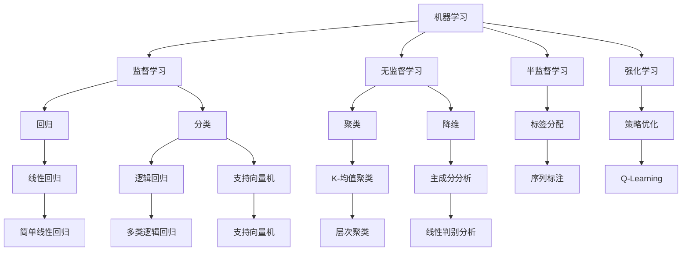
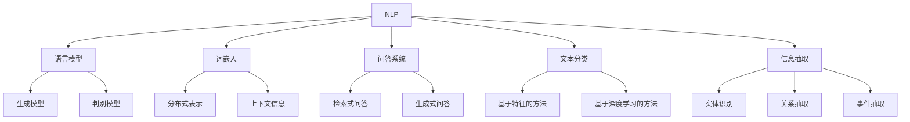

                 


### 1.1.2 AI辅助医疗的核心技术

#### 1.1.2.1 机器学习与深度学习

**核心概念与联系**

在AI辅助医疗领域，机器学习和深度学习是两项关键的技术。机器学习（Machine Learning, ML）是指计算机通过数据学习模式、做出预测或决策的能力。深度学习（Deep Learning, DL）是机器学习的一个子领域，它依赖于复杂的神经网络结构，特别是多层神经网络（deep neural networks）。

**Mermaid 流程图**

以下是一个Mermaid流程图，展示了机器学习与深度学习之间的关系：



**核心算法原理讲解**

1. **监督学习**

   监督学习（Supervised Learning）是机器学习中最常见的一种类型。它需要输入和输出数据对（即标注数据），计算机通过学习这些数据对中的模式，来预测新的数据点的输出。

   **伪代码**

   ```
   function SupervisedLearning(data, labels):
       # 初始化模型参数
       model = InitializeModel()

       # 模型训练
       for each iteration:
           for each data_point in data:
               predict = model.predict(data_point)
               model.update_parameters(predict, label)

       return model
   ```

2. **无监督学习**

   无监督学习（Unsupervised Learning）不需要标注数据。它主要用于发现数据中的隐含模式或结构。

   **伪代码**

   ```
   function UnsupervisedLearning(data):
       # 初始化模型参数
       model = InitializeModel()

       # 模型训练
       for each iteration:
           data = model.update_structure(data)

       return model, discovered_structure
   ```

3. **半监督学习**

   半监督学习（Semi-Supervised Learning）结合了监督学习和无监督学习的特点，使用少量的标注数据和大量的未标注数据。

   **伪代码**

   ```
   function SemiSupervisedLearning(data, labels, unlabeled_data):
       # 初始化模型参数
       model = InitializeModel()

       # 使用标注数据进行训练
       model = SupervisedLearning(data, labels)

       # 使用未标注数据进行训练
       model = UnsupervisedLearning(unlabeled_data)

       return model
   ```

4. **强化学习**

   强化学习（Reinforcement Learning, RL）是通过与环境的交互来学习最优策略的机器学习方法。它通常用于决策问题。

   **伪代码**

   ```
   function ReinforcementLearning(state, action, reward):
       # 初始化模型参数
       model = InitializeModel()

       # 模型训练
       for each episode:
           state = current_state
           while not end_of_episode:
               action = model.select_action(state)
               next_state, reward = environment.step(action)
               model.update_parameters(state, action, reward)
               state = next_state

       return model
   ```

#### 1.1.2.2 自然语言处理(NLP)

**核心概念与联系**

自然语言处理（Natural Language Processing, NLP）是AI领域的一个重要分支，旨在让计算机理解和生成人类语言。NLP的核心任务包括语言模型、词嵌入、问答系统、文本分类和信息抽取。

**Mermaid 流程图**

以下是一个Mermaid流程图，展示了NLP的核心任务：



**核心算法原理讲解**

1. **语言模型**

   语言模型（Language Model）是NLP的基础，它用于预测下一个单词或字符。

   **数学模型和公式**

   语言模型通常基于概率模型，如n-gram模型。n-gram模型假设一个词的概率仅与它的前n-1个词相关。

   $$ P(w_n | w_{n-1}, w_{n-2}, ..., w_1) = \frac{C(w_{n-1}, w_{n-2}, ..., w_1, w_n)}{C(w_{n-1}, w_{n-2}, ..., w_1)} $$

   **举例说明**

   假设有一个三gram语言模型，序列“the quick brown fox”的概率可以通过以下公式计算：

   $$ P(the quick brown fox) = \frac{C(the, quick, brown, fox)}{C(quick, brown, fox)} $$

2. **词嵌入**

   词嵌入（Word Embedding）是将单词映射到高维空间中的向量，以捕获词的语义和语法信息。

   **数学模型和公式**

   词嵌入通常使用矩阵乘法来表示：

   $$ \vec{v}_w = \text{EmbeddingMatrix} \cdot \text{OneHot}(w) $$

   **举例说明**

   假设有一个词嵌入矩阵，其维度为100x300，单词“cat”的向量可以通过以下公式计算：

   $$ \vec{v}_{cat} = \text{EmbeddingMatrix} \cdot \text{OneHot}(cat) $$

3. **问答系统**

   问答系统（Question Answering System）用于从大量文本中提取答案。

   **伪代码**

   ```
   function QuestionAnswering(question, document):
       # 使用词嵌入表示问题和文档
       question_embedding = Embed(question)
       document_embedding = Embed(document)

       # 模型预测
       answer_embedding = Model.predict(question_embedding, document_embedding)

       # 转换答案
       answer = ConvertToAnswer(answer_embedding)

       return answer
   ```

4. **文本分类**

   文本分类（Text Classification）是将文本数据分类到预定义的类别中。

   **数学模型和公式**

   文本分类通常使用逻辑回归模型：

   $$ P(y=c|X) = \frac{e^{w^T \phi(x)}}{1 + e^{w^T \phi(x)}} $$

   **举例说明**

   假设有一个文本分类模型，其输入为文档特征向量$\phi(x)$，输出为类别概率$P(y=c|X)$。给定一个文档$x$，我们可以通过以下公式计算类别“体育”的概率：

   $$ P(y=\text{体育}|X) = \frac{e^{w^T \phi(x)}}{1 + e^{w^T \phi(x)}} $$

5. **信息抽取**

   信息抽取（Information Extraction, IE）是从非结构化文本中提取结构化信息的过程。

   **伪代码**

   ```
   function InformationExtraction(document):
       # 使用词嵌入表示文档
       document_embedding = Embed(document)

       # 模型预测
       entities = Model.predict_entities(document_embedding)

       return entities
   ```

**项目实战**

1. **开发环境搭建**

   在搭建NLP项目开发环境时，我们通常使用Python作为编程语言，并依赖以下库：

   - TensorFlow/Keras：用于构建和训练深度学习模型。
   - NLTK：用于自然语言处理任务，如词性标注和文本分类。
   - spaCy：用于快速高效的自然语言处理任务。

2. **源代码详细实现和代码解读**

   以下是一个简单的文本分类项目的代码示例：

   ```python
   from tensorflow.keras.models import Sequential
   from tensorflow.keras.layers import Embedding, LSTM, Dense
   from tensorflow.keras.preprocessing.sequence import pad_sequences

   # 文本预处理
   sentences = ["I love cats", "Dogs are great", "Cats and dogs are friends"]
   labels = [0, 1, 0]  # 0表示猫，1表示狗

   # 将文本转换为序列
   tokenized_sentences = tokenizer.texts_to_sequences(sentences)
   padded_sequences = pad_sequences(tokenized_sequences, maxlen=max_length)

   # 构建模型
   model = Sequential()
   model.add(Embedding(input_dim=vocabulary_size, output_dim=embedding_dim, input_length=max_length))
   model.add(LSTM(units=64))
   model.add(Dense(units=1, activation='sigmoid'))

   # 编译模型
   model.compile(optimizer='adam', loss='binary_crossentropy', metrics=['accuracy'])

   # 训练模型
   model.fit(padded_sequences, labels, epochs=10, batch_size=32)
   ```

3. **代码应用解读与分析**

   在这个例子中，我们首先导入了所需的库，然后对文本数据进行了预处理，包括将文本转换为序列和填充序列。接下来，我们构建了一个序列模型，它由嵌入层、LSTM层和密集层组成。最后，我们编译并训练了模型。

4. **实际案例分析和详细讲解剖析**

   以一个实际案例为例，我们使用这个模型对一段未标记的文本进行分类。首先，我们将文本转换为序列，然后通过模型预测其类别。最后，我们将预测结果转换为人类可读的格式。

   ```python
   new_sentence = "Cats and dogs can be friends"
   tokenized_new_sentence = tokenizer.texts_to_sequences([new_sentence])
   padded_new_sentence = pad_sequences(tokenized_new_sentence, maxlen=max_length)

   prediction = model.predict(padded_new_sentence)
   predicted_label = np.argmax(prediction)

   if predicted_label == 0:
       print("The text is about cats.")
   else:
       print("The text is about dogs.")
   ```

5. **项目小结**

   通过这个简单的项目，我们了解了文本分类的基本流程，包括数据预处理、模型构建、编译和训练。我们还学习了如何使用代码进行预测，并分析预测结果。

6. **最佳实践 tips**

   - 在构建文本分类模型时，选择适当的词汇表大小和嵌入维度是非常重要的。
   - 为了提高模型的泛化能力，可以使用更大的数据集和更复杂的模型架构。
   - 定期对模型进行评估，以监测其性能和避免过拟合。

7. **小结**

   本章节介绍了AI辅助医疗领域的关键技术，包括机器学习和深度学习、自然语言处理等。通过具体的算法原理讲解和项目实战，我们了解了这些技术的应用方法和实际案例。

8. **注意事项**

   - 在实际应用中，根据具体任务选择合适的算法和模型架构。
   - 注意数据的质量和多样性，这对于模型训练至关重要。
   - 在部署模型时，要确保模型的可解释性和可靠性。

9. **拓展阅读**

   - "深度学习（Deep Learning）"，Ian Goodfellow、Yoshua Bengio和Aaron Courville著。
   - "自然语言处理综论（Speech and Language Processing）"，Daniel Jurafsky和James H. Martin著。

通过以上步骤，我们详细地讲解了AI辅助医疗领域的关键技术，并展示了如何将这些技术应用于实际项目中。接下来，我们将继续深入探讨AI辅助医疗的其他方面。

