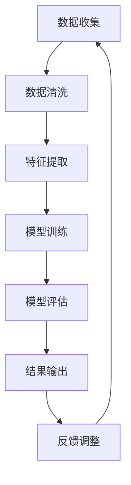

                 

### 文章标题：AI辅助教育评估：提示词设计个性化测试

### 关键词：
- AI辅助教育评估
- 提示词设计
- 个性化测试
- 机器学习
- 数据分析
- 深度学习
- 评估算法
- 教育数据

### 摘要：
本文深入探讨了AI辅助教育评估中的提示词设计以及个性化测试的重要性。首先，文章介绍了教育评估与人工智能的背景，探讨了AI在教育中的应用以及其带来的优势与挑战。接着，文章重点阐述了AI辅助教育评估的基本原理，包括机器学习、深度学习以及教育数据的收集与处理。随后，文章详细讲解了评估中的核心算法原理，如分类算法、回归算法和聚类分析，并通过伪代码和LaTeX数学公式进行了深入剖析。文章还介绍了个性化测试的概念、设计原则和实现方法，并结合实际案例进行了详细解析。最后，文章展望了AI辅助教育评估的发展趋势，提出了未来研究方向和改进空间。全文旨在为教育评估领域提供一套完整的AI辅助解决方案，推动个性化教育的普及与发展。

## 第一部分：背景与基础理论

### 第1章：教育评估与AI概述

#### 1.1 教育评估的重要性

教育评估是教育过程中的一个关键环节，它不仅能够衡量学生的学习效果，还能够为教育者提供决策依据。传统的教育评估方法主要依赖于教师的主观评价和考试成绩，这些方法虽然在一定程度上能够反映学生的学业水平，但往往存在主观性、片面性和不够精准的问题。为了克服这些缺点，教育评估正在逐步向更加科学、客观和个性化的方向发展。

教育评估的重要性体现在以下几个方面：

1. **促进学生发展**：科学的教育评估可以帮助学生认识到自己的学习效果，激发学生的学习兴趣和动力，促进学生全面发展。
2. **优化教育资源**：教育评估能够帮助教育机构了解学生的学习需求，合理配置教育资源，提高教育质量。
3. **改进教学方法**：教育评估可以为教师提供教学反馈，帮助教师发现教学中的问题，改进教学方法，提高教学效果。
4. **政策制定依据**：教育评估结果可以为政府决策提供数据支持，推动教育改革和发展。

#### 1.2 人工智能在教育中的应用

人工智能（AI）的迅速发展为其在教育领域的应用提供了广阔的前景。AI在教育中的应用不仅有助于提高教育评估的准确性和客观性，还能够实现个性化教学，提高学习效率。

1. **个性化学习**：AI可以通过数据分析和学习算法，为学生提供个性化的学习路径和资源，使每个学生都能在适合自己的节奏和方式下学习。
2. **智能辅导**：AI智能辅导系统能够根据学生的学习进度和知识掌握情况，提供针对性的辅导，帮助学生解决学习中遇到的问题。
3. **自动化评分**：AI可以通过自然语言处理和图像识别等技术，自动化地完成学生的作业和考试评分，提高评分的效率和准确性。
4. **智能推荐**：AI可以根据学生的学习兴趣和需求，推荐合适的学习资源和课程，帮助学生更有效地利用学习时间。

#### 1.3 AI辅助教育评估的优势与挑战

虽然AI辅助教育评估具有很多优势，但其在实际应用中也面临一些挑战。

1. **优势**：

   - **客观性**：AI能够减少人为因素，提高评估的客观性和一致性。
   - **高效性**：AI能够快速处理大量数据，提高评估的效率。
   - **个性化**：AI可以根据学生的个性特点和学习情况，提供个性化的评估结果和建议。
   - **可扩展性**：AI技术可以轻松扩展到各种教育场景和评估需求中。

2. **挑战**：

   - **数据隐私**：AI在处理学生数据时，需要确保数据的安全性和隐私性。
   - **算法公正性**：AI算法的公平性和透明性是一个重要问题，需要确保评估结果的公正性。
   - **技术门槛**：AI技术的应用需要一定的技术支持和专业知识，对于教育机构来说是一个挑战。
   - **教师适应**：教师需要适应新的评估方式和技术，提高其使用AI辅助教育评估的能力。

通过本文的深入探讨，读者将能够更好地理解AI辅助教育评估的原理和应用，为未来的教育改革提供有益的参考。

### 第2章：AI辅助教育评估的基本原理

#### 2.1 人工智能在教育评估中的应用

人工智能在教育评估中的应用，主要依赖于其强大的数据处理能力和先进的机器学习技术。AI技术能够通过对大量教育数据的分析，提供更为准确和个性化的评估结果。具体来说，AI在以下方面展现了其独特优势：

1. **数据挖掘**：AI可以通过数据挖掘技术，从海量的教育数据中提取出有价值的信息，包括学生的学习行为、成绩趋势、知识点掌握情况等。这些信息有助于教育者深入了解学生的实际情况，为个性化教学提供数据支持。
   
2. **预测分析**：基于历史数据和机器学习算法，AI可以预测学生在未来学习中的表现。例如，通过分析学生的学习进度和成绩变化，AI可以预测学生在某个知识点上的掌握情况，从而提前采取干预措施。

3. **自动评分**：AI利用自然语言处理和图像识别技术，可以自动化处理学生的作业和考试评分。这种方法不仅提高了评分的效率和准确性，还减少了人为误差，确保了评分的公平性。

4. **智能推荐**：AI可以根据学生的学习兴趣和需求，推荐适合的学习资源和课程。这种个性化推荐系统有助于学生更高效地学习，提高学习效果。

#### 2.2 提示词设计与个性化测试

在AI辅助教育评估中，提示词设计是一个关键环节。提示词（Prompt）是指提供给学生用于回答问题的指令或提示。一个良好的提示词设计，能够激发学生的思考，引导他们更深入地理解和掌握知识。

1. **提示词的作用**：

   - **引导思考**：提示词可以引导学生从不同的角度思考问题，培养他们的批判性思维和创造力。
   - **个性化引导**：根据学生的学习背景和知识水平，设计个性化的提示词，有助于提高学生的参与度和学习兴趣。
   - **评估标准**：提示词还可以为评估提供明确的参考标准，帮助评估者更准确地衡量学生的知识掌握情况。

2. **个性化测试的设计原则**：

   - **适应性**：个性化测试应根据学生的实际情况，灵活调整测试内容和难度，使每个学生都能在适合自己的水平上接受评估。
   - **多样性**：个性化测试应包括多种类型的题目，如选择题、填空题、简答题和论述题等，以全面评估学生的知识掌握情况。
   - **动态性**：个性化测试应根据学生的学习进度和变化，动态调整测试内容和难度，确保评估的实时性和有效性。
   - **反馈性**：个性化测试应提供即时反馈，帮助学生了解自己的学习效果，指导他们进行下一步的学习。

#### 2.3 教育数据的收集与处理

AI辅助教育评估的另一个核心环节是教育数据的收集与处理。教育数据包括学生的学习行为数据、成绩数据、教师评价数据等，这些数据对于AI算法的训练和应用至关重要。

1. **数据来源**：

   - **学习行为数据**：包括学生在学习平台上的活动记录，如学习时间、学习进度、参与讨论情况等。
   - **成绩数据**：包括学生在各类考试和作业中的成绩记录，这些数据可以反映学生的知识掌握情况。
   - **教师评价数据**：包括教师对学生的评价、反馈和建议，这些数据有助于更全面地了解学生的学习状况。

2. **数据处理方法**：

   - **数据清洗**：对收集到的数据进行清洗，去除重复、错误和不完整的数据，确保数据的质量。
   - **数据整合**：将来自不同来源的数据进行整合，形成一个统一的教育数据集，便于后续的分析和应用。
   - **特征提取**：从数据中提取出有价值的特征，如学生的学习行为模式、成绩变化趋势等，这些特征将用于AI算法的训练和评估。

通过上述环节，AI能够对教育数据进行深入分析，为教育评估提供有力支持。同时，提示词设计在个性化测试中的应用，使得教育评估更加精准、个性化，为学生提供了更好的学习反馈和发展指导。

### 第3章：人工智能核心概念与联系

#### 3.1 机器学习基本概念

机器学习（Machine Learning）是人工智能（Artificial Intelligence, AI）的重要组成部分，它通过构建能够自动从数据中学习规律的算法模型，使计算机具备一定的智能能力。在AI辅助教育评估中，机器学习技术被广泛应用于数据分析和模型构建，以提高评估的准确性和效率。

1. **机器学习的核心概念**：

   - **数据集**：数据集是机器学习的基础，它由一系列样本组成，每个样本包含多个特征值。
   - **特征**：特征是数据集中的每个维度，它能够描述样本的不同属性。例如，学生在不同科目上的成绩可以视为特征。
   - **模型**：模型是机器学习算法的输出，它通过学习数据集的特征，能够对新的数据进行预测或分类。
   - **损失函数**：损失函数用于衡量模型预测结果与真实结果之间的差异，它是调整模型参数的重要依据。
   - **优化算法**：优化算法用于调整模型参数，以最小化损失函数，提高模型的预测性能。

2. **机器学习的主要任务**：

   - **监督学习**：监督学习是机器学习的一种类型，它需要使用标记数据集来训练模型，然后使用模型对未标记的数据进行预测。监督学习包括回归分析和分类分析。
     - **回归分析**：回归分析用于预测连续值输出，如预测学生的成绩。
     - **分类分析**：分类分析用于预测离散值输出，如预测学生的成绩是否及格。
   - **无监督学习**：无监督学习不需要使用标记数据集，它主要用于发现数据集中的隐含结构和模式，如聚类分析。
     - **聚类分析**：聚类分析用于将相似的数据样本聚成多个类别，以便更好地理解数据分布。

#### 3.2 深度学习原理

深度学习（Deep Learning）是机器学习的一个子领域，它通过构建多层神经网络模型，实现对复杂数据的自动特征学习和模式识别。在AI辅助教育评估中，深度学习技术被广泛应用于图像识别、自然语言处理和语音识别等领域，提高了评估的准确性和智能化水平。

1. **深度学习的基本原理**：

   - **神经网络**：神经网络是由多个神经元（或节点）组成的信息处理系统，每个神经元通过权重连接其他神经元，并通过激活函数产生输出。神经网络通过学习数据，能够自动调整权重，实现对数据的分类和预测。
   - **多层感知器**：多层感知器（Multilayer Perceptron, MLP）是最基本的深度学习模型，它包括输入层、隐藏层和输出层。隐藏层中的每个神经元都会接收输入层的信号，通过激活函数处理后传递给下一层。
   - **反向传播算法**：反向传播算法（Backpropagation）是一种用于训练神经网络的优化算法。它通过计算损失函数对权重的梯度，反向传播误差信号，不断调整权重，使模型达到最小化损失的目标。

2. **深度学习的应用**：

   - **图像识别**：深度学习模型可以自动从图像中提取特征，实现对图像内容的分类和识别。例如，通过卷积神经网络（Convolutional Neural Network, CNN），可以自动识别图片中的物体和场景。
   - **自然语言处理**：深度学习模型可以自动处理和生成自然语言文本，实现语义理解、情感分析和文本生成等任务。例如，通过循环神经网络（Recurrent Neural Network, RNN）和长短期记忆网络（Long Short-Term Memory, LSTM），可以实现对文本的语义分析和情感分类。
   - **语音识别**：深度学习模型可以自动从语音信号中提取特征，实现语音到文本的转换。例如，通过深度神经网络（Deep Neural Network, DNN）和卷积神经网络（CNN），可以实现对语音信号的实时识别。

#### 3.3 Mermaid流程图：AI辅助教育评估框架

为了更直观地展示AI辅助教育评估的框架，我们可以使用Mermaid流程图来描述整个评估过程。以下是一个简化的Mermaid流程图示例：



**流程解释**：

- **A[数据收集]**：收集来自不同来源的教育数据，包括学习行为数据、成绩数据和教师评价数据等。
- **B[数据清洗]**：清洗和整理数据，去除重复、错误和不完整的数据，确保数据的质量。
- **C[特征提取]**：从数据中提取出有价值的特征，如学生的学习行为模式、成绩变化趋势等。
- **D[模型训练]**：使用机器学习和深度学习算法，对特征进行建模，训练出能够进行预测和分类的模型。
- **E[模型评估]**：使用测试数据对模型进行评估，计算模型的准确率、召回率、F1值等指标，确保模型的性能。
- **F[结果输出]**：输出模型的预测结果，包括学生的学习评估、个性化推荐等。
- **G[反馈调整]**：根据评估结果和用户反馈，对模型进行调整和优化，以提高模型的准确性和适应性。

通过这个Mermaid流程图，我们可以清晰地看到AI辅助教育评估的整体框架和各环节之间的联系，为后续的实现和应用提供了指导。

#### 3.4 教育数据的收集与处理

在教育评估中，数据收集和处理是至关重要的一环。教育数据不仅包括学生的学习成绩和测试结果，还包括学习行为数据、教师评价数据等多种类型的信息。这些数据的质量和完整性直接影响AI辅助教育评估的准确性和有效性。因此，对教育数据的收集和处理需要精心设计和实施。

1. **数据收集方法**：

   - **学习行为数据**：学习行为数据包括学生在学习平台上的活动记录，如访问时间、学习时长、参与讨论情况、完成作业情况等。这些数据可以通过学习管理系统的日志记录来收集。
   - **成绩数据**：成绩数据包括学生在各类考试和作业中的成绩记录，这些数据可以从学校管理系统或考试系统中获取。
   - **教师评价数据**：教师评价数据包括教师对学生的评价、反馈和建议，这些数据可以通过问卷调查、教师评价系统等方式收集。

2. **数据处理步骤**：

   - **数据清洗**：数据清洗是数据处理的第一步，它包括去除重复数据、纠正错误数据、填补缺失数据等。通过数据清洗，可以确保数据的质量和一致性。
   - **数据整合**：将来自不同来源的数据进行整合，形成一个统一的教育数据集。例如，可以将学习行为数据、成绩数据和教师评价数据整合到一起，以便进行综合分析。
   - **特征提取**：从数据中提取出有价值的特征，如学生的学习行为模式、成绩变化趋势等。这些特征将用于训练机器学习模型，以便进行预测和评估。
   - **数据存储**：将处理后的数据存储到数据库或数据仓库中，以便后续的数据分析和模型训练。

3. **数据处理工具**：

   - **Python**：Python是一种广泛应用于数据处理的编程语言，它提供了丰富的数据处理库，如Pandas、NumPy等，可以方便地进行数据清洗、数据分析和数据可视化。
   - **SQL**：SQL（Structured Query Language）是一种用于数据库管理的语言，它可以方便地对大量数据进行查询、筛选和整合。
   - **Spark**：Spark是一种大数据处理框架，它提供了丰富的数据处理和机器学习库，可以高效地处理大规模的教育数据。

通过有效的数据收集和处理，我们可以为AI辅助教育评估提供高质量的数据支持，从而提高评估的准确性和可靠性。

### 第4章：教育评估中的常用算法

#### 4.1 基于分类的评估算法

在AI辅助教育评估中，分类算法是一种常用的评估方法，它通过将学生划分为不同的类别，如优秀、良好、及格和不及格等，来评估学生的学习表现。分类算法的核心在于构建一个分类模型，该模型能够根据学生的特征数据，预测学生所属的类别。

1. **逻辑回归（Logistic Regression）**

逻辑回归是一种简单的分类算法，它通过线性模型来预测概率，并将概率转换为类别。逻辑回归模型的表达式为：

$$
P(Y=1|X) = \frac{1}{1 + e^{-(\beta_0 + \beta_1 x_1 + \beta_2 x_2 + ... + \beta_n x_n})}
$$

其中，\(P(Y=1|X)\)表示给定特征\(X\)时，学生属于类别1（如及格）的概率，\(\beta_0, \beta_1, \beta_2, ..., \beta_n\)是模型的参数。

**伪代码：逻辑回归模型训练**

```
function logistic_regression_train(X, y):
    # 初始化模型参数
    beta = initialize_parameters()

    # 设置迭代次数和步长
    num_iterations = 1000
    learning_rate = 0.01

    # 梯度下降迭代
    for i in range(num_iterations):
        # 计算预测概率
        probabilities = sigmoid(np.dot(X, beta))

        # 计算损失函数
        loss = -1/n * (y * log(probabilities) + (1 - y) * log(1 - probabilities))

        # 计算梯度
        d_loss_d_beta = -1/n * (X.T.dot(y - probabilities))

        # 更新参数
        beta -= learning_rate * d_loss_d_beta

    return beta

def sigmoid(x):
    return 1 / (1 + np.exp(-x))
```

2. **支持向量机（Support Vector Machine, SVM）**

支持向量机是一种强大的分类算法，它通过寻找一个最佳的超平面，将不同类别的数据点尽可能分开。SVM的核心是求解一个最优的决策边界，该边界能够最大化分类间隔。

**SVM模型表达式**

$$
\min \frac{1}{2} ||\textbf{w}||^2 \\
\text{s.t.} y^{(i)}(\textbf{w}^T\textbf{x}^{(i)} + b) \geq 1
$$

其中，\(\textbf{w}\)是模型的权重向量，\(b\)是偏置项，\(y^{(i)}\)是第\(i\)个样本的标签，\(\textbf{x}^{(i)}\)是第\(i\)个样本的特征向量。

**伪代码：SVM模型训练**

```
function svm_train(X, y):
    # 初始化模型参数
    w = initialize_parameters()

    # 设置迭代次数和步长
    num_iterations = 1000
    learning_rate = 0.01

    # 梯度下降迭代
    for i in range(num_iterations):
        # 计算预测标签
        predictions = sign(np.dot(X, w) + b)

        # 计算损失函数
        loss = 1/n * sum([1 for i in range(n) if predictions[i] != y[i]])

        # 计算梯度
        d_loss_d_w = -1/n * np.sum([X[i] for i in range(n) if predictions[i] != y[i]])

        # 更新参数
        w -= learning_rate * d_loss_d_w

    return w, b

def sign(x):
    return 1 if x >= 0 else -1
```

3. **随机森林（Random Forest）**

随机森林是一种基于决策树的集成学习算法，它通过构建多个决策树，并对这些树的预测结果进行投票，得出最终的分类结果。随机森林能够提高模型的泛化能力和准确性。

**随机森林模型表达式**

$$
\hat{y} = \arg\max \sum_{t=1}^T f_t(x)
$$

其中，\(T\)是决策树的数量，\(f_t(x)\)是第\(t\)棵决策树的预测结果。

**伪代码：随机森林模型训练**

```
function random_forest_train(X, y, n_trees):
    # 初始化模型参数
    forests = []

    # 构建多个决策树
    for _ in range(n_trees):
        tree = build_tree(X, y)
        forests.append(tree)

    # 预测结果
    predictions = []
    for x in X:
        forest_predictions = [forest.predict(x) for forest in forests]
        predictions.append(vote(forest_predictions))

    return predictions

def build_tree(X, y):
    # 建立决策树
    # ...

def vote(predictions):
    # 计算投票结果
    # ...
```

#### 4.2 基于回归的评估算法

在AI辅助教育评估中，回归算法主要用于预测学生的成绩或评估学生的学习效果。回归算法通过建立输入特征与输出结果之间的线性或非线性关系，对新的数据进行预测。

1. **线性回归（Linear Regression）**

线性回归是一种简单的回归算法，它通过拟合一条直线来预测学生的成绩。线性回归模型的表达式为：

$$
y = \beta_0 + \beta_1 x_1 + \beta_2 x_2 + ... + \beta_n x_n
$$

其中，\(y\)是学生的成绩，\(x_1, x_2, ..., x_n\)是学生的特征向量，\(\beta_0, \beta_1, \beta_2, ..., \beta_n\)是模型的参数。

**伪代码：线性回归模型训练**

```
function linear_regression_train(X, y):
    # 初始化模型参数
    beta = initialize_parameters()

    # 设置迭代次数和步长
    num_iterations = 1000
    learning_rate = 0.01

    # 梯度下降迭代
    for i in range(num_iterations):
        # 计算预测成绩
        predictions = np.dot(X, beta)

        # 计算损失函数
        loss = 1/n * np.sum((y - predictions)^2)

        # 计算梯度
        d_loss_d_beta = -1/n * X.T.dot(y - predictions)

        # 更新参数
        beta -= learning_rate * d_loss_d_beta

    return beta
```

2. **岭回归（Ridge Regression）**

岭回归是一种改进的线性回归算法，它通过引入正则化项，减少模型过拟合现象。岭回归模型的表达式为：

$$
y = \beta_0 + \beta_1 x_1 + \beta_2 x_2 + ... + \beta_n x_n - \alpha \sum_{i=1}^n \beta_i^2
$$

其中，\(\alpha\)是正则化参数。

**伪代码：岭回归模型训练**

```
function ridge_regression_train(X, y, alpha):
    # 初始化模型参数
    beta = initialize_parameters()

    # 设置迭代次数和步长
    num_iterations = 1000
    learning_rate = 0.01

    # 梯度下降迭代
    for i in range(num_iterations):
        # 计算预测成绩
        predictions = np.dot(X, beta) - alpha * np.sum(beta**2)

        # 计算损失函数
        loss = 1/n * np.sum((y - predictions)^2) + alpha * np.sum(beta**2)

        # 计算梯度
        d_loss_d_beta = -1/n * X.T.dot(y - predictions) + 2 * alpha * beta

        # 更新参数
        beta -= learning_rate * d_loss_d_beta

    return beta
```

3. **决策树回归（Decision Tree Regression）**

决策树回归是一种基于决策树的回归算法，它通过构建一个树状模型，对新的数据进行预测。决策树回归模型的表达式为：

$$
y = g(x) \\
g(x) = \sum_{t=1}^T w_t h_t(x)
$$

其中，\(T\)是决策树的分支数，\(w_t\)是第\(t\)个分支的权重，\(h_t(x)\)是第\(t\)个分支的函数。

**伪代码：决策树回归模型训练**

```
function decision_tree_regression_train(X, y):
    # 构建决策树
    tree = build_tree(X, y)

    # 预测成绩
    def predict(tree, x):
        if tree.is_leaf():
            return tree.value
        else:
            feature_index = tree.split_feature
            value = x[feature_index]
            if value <= tree.threshold:
                return predict(tree.left, x)
            else:
                return predict(tree.right, x)

    return predict(tree, X)
```

通过上述常用的分类和回归算法，AI辅助教育评估能够更准确地预测学生的成绩和评估学生的学习表现，为教育决策提供有力支持。

### 第5章：数学模型与公式

#### 5.1 教育评估中的数学模型

在AI辅助教育评估中，数学模型是理解和应用AI技术的基础。这些模型能够通过数学表达式描述学生成绩、学习行为与评估结果之间的关系。以下是一些常见的数学模型：

1. **线性回归模型**：
   线性回归模型通过建立学生特征与成绩之间的线性关系，预测学生的成绩。其数学模型为：

   $$
   y = \beta_0 + \beta_1 x_1 + \beta_2 x_2 + ... + \beta_n x_n
   $$

   其中，\(y\)表示学生成绩，\(x_1, x_2, ..., x_n\)表示学生的特征（如学习时长、作业完成情况等），\(\beta_0, \beta_1, \beta_2, ..., \beta_n\)是模型参数。

2. **逻辑回归模型**：
   逻辑回归模型用于二分类问题，如评估学生是否及格。其数学模型为：

   $$
   P(Y=1|X) = \frac{1}{1 + e^{-(\beta_0 + \beta_1 x_1 + \beta_2 x_2 + ... + \beta_n x_n})}
   $$

   其中，\(P(Y=1|X)\)表示给定学生特征\(X\)时，学生及格的概率，\(\beta_0, \beta_1, \beta_2, ..., \beta_n\)是模型参数。

3. **支持向量机（SVM）模型**：
   支持向量机通过寻找最佳决策边界进行分类。其数学模型为：

   $$
   \min \frac{1}{2} ||\textbf{w}||^2 \\
   \text{s.t.} y^{(i)}(\textbf{w}^T\textbf{x}^{(i)} + b) \geq 1
   $$

   其中，\(\textbf{w}\)是模型权重向量，\(b\)是偏置项，\(y^{(i)}\)是第\(i\)个样本的标签，\(\textbf{x}^{(i)}\)是第\(i\)个样本的特征向量。

4. **决策树模型**：
   决策树通过一系列的决策规则来对数据进行分类或回归。其数学模型可以表示为：

   $$
   y = g(x) \\
   g(x) = \sum_{t=1}^T w_t h_t(x)
   $$

   其中，\(T\)是决策树的分支数，\(w_t\)是第\(t\)个分支的权重，\(h_t(x)\)是第\(t\)个分支的函数。

#### 5.2 相关性分析

相关性分析用于评估不同特征之间的关联程度。在AI辅助教育评估中，相关性分析可以帮助我们理解哪些特征对评估结果有显著影响。以下是一些常见的相关性分析指标：

1. **皮尔逊相关系数（Pearson Correlation Coefficient）**：
   皮尔逊相关系数用于衡量两个连续变量之间的线性相关性，其公式为：

   $$
   r_{xy} = \frac{\sum_{i=1}^n (x_i - \bar{x})(y_i - \bar{y})}{\sqrt{\sum_{i=1}^n (x_i - \bar{x})^2 \sum_{i=1}^n (y_i - \bar{y})^2}}
   $$

   其中，\(r_{xy}\)是皮尔逊相关系数，\(\bar{x}\)和\(\bar{y}\)分别是\(x\)和\(y\)的均值。

2. **斯皮尔曼秩相关系数（Spearman's Rank Correlation Coefficient）**：
   斯皮尔曼秩相关系数用于衡量两个变量的排序相关性，其公式为：

   $$
   \rho_{xy} = \frac{1}{n-1} \sum_{i=1}^n (r_i - \bar{r})(s_i - \bar{s})
   $$

   其中，\(\rho_{xy}\)是斯皮尔曼秩相关系数，\(r_i\)和\(s_i\)分别是\(x\)和\(y\)的秩次，\(\bar{r}\)和\(\bar{s}\)分别是\(r\)和\(s\)的均值。

3. **卡方检验（Chi-Square Test）**：
   卡方检验用于评估两个分类变量之间的独立性，其公式为：

   $$
   \chi^2 = \sum_{i=1}^r \sum_{j=1}^c (O_{ij} - E_{ij})^2 / E_{ij}
   $$

   其中，\(\chi^2\)是卡方统计量，\(O_{ij}\)是观测频数，\(E_{ij}\)是期望频数，\(r\)和\(c\)分别是行数和列数。

#### 5.3 协同过滤算法

协同过滤（Collaborative Filtering）是一种常用的推荐系统算法，它通过分析用户的行为和偏好，为用户推荐相关的项目。协同过滤算法可以分为两种主要类型：基于用户的协同过滤和基于物品的协同过滤。

1. **基于用户的协同过滤**：
   基于用户的协同过滤通过分析用户之间的相似度，为用户推荐与其相似的用户喜欢的项目。其数学模型为：

   $$
   r_{ij} = \sum_{k \in N_j} \frac{r_{ik}}{|N_j|}
   $$

   其中，\(r_{ij}\)是用户\(i\)对项目\(j\)的推荐评分，\(r_{ik}\)是用户\(i\)对项目\(k\)的实际评分，\(N_j\)是喜欢项目\(j\)的用户集合，\(|N_j|\)是\(N_j\)的元素个数。

2. **基于物品的协同过滤**：
   基于物品的协同过滤通过分析物品之间的相似度，为用户推荐与其已评价的物品相似的物品。其数学模型为：

   $$
   r_{ij} = \sum_{k \in M_j} \frac{r_{ik}}{|M_j|}
   $$

   其中，\(r_{ij}\)是用户\(i\)对项目\(j\)的推荐评分，\(r_{ik}\)是用户\(i\)对项目\(k\)的实际评分，\(M_j\)是项目\(j\)的相似物品集合，\(|M_j|\)是\(M_j\)的元素个数。

#### 5.4 LaTeX数学公式示例

在撰写技术文档时，LaTeX数学公式能够使复杂的数学表达式更加清晰和规范。以下是一些LaTeX数学公式的示例：

1. **线性回归模型**：
   $$
   y = \beta_0 + \beta_1 x_1 + \beta_2 x_2 + ... + \beta_n x_n
   $$

2. **逻辑回归模型**：
   $$
   P(Y=1|X) = \frac{1}{1 + e^{-(\beta_0 + \beta_1 x_1 + \beta_2 x_2 + ... + \beta_n x_n})}
   $$

3. **支持向量机（SVM）模型**：
   $$
   \min \frac{1}{2} ||\textbf{w}||^2 \\
   \text{s.t.} y^{(i)}(\textbf{w}^T\textbf{x}^{(i)} + b) \geq 1
   $$

4. **皮尔逊相关系数**：
   $$
   r_{xy} = \frac{\sum_{i=1}^n (x_i - \bar{x})(y_i - \bar{y})}{\sqrt{\sum_{i=1}^n (x_i - \bar{x})^2 \sum_{i=1}^n (y_i - \bar{y})^2}}
   $$

5. **斯皮尔曼秩相关系数**：
   $$
   \rho_{xy} = \frac{1}{n-1} \sum_{i=1}^n (r_i - \bar{r})(s_i - \bar{s})
   $$

6. **卡方检验**：
   $$
   \chi^2 = \sum_{i=1}^r \sum_{j=1}^c (O_{ij} - E_{ij})^2 / E_{ij}
   $$

7. **基于用户的协同过滤**：
   $$
   r_{ij} = \sum_{k \in N_j} \frac{r_{ik}}{|N_j|}
   $$

8. **基于物品的协同过滤**：
   $$
   r_{ij} = \sum_{k \in M_j} \frac{r_{ik}}{|M_j|}
   $$

通过这些LaTeX数学公式，我们可以更准确地表达和展示AI辅助教育评估中的数学模型和计算方法，为读者提供清晰的理解和指导。

### 第6章：个性化测试的概念与方法

#### 6.1 个性化测试的定义

个性化测试是指根据学生的个体差异，如学习习惯、知识水平、兴趣爱好等，设计并实施具有针对性的测试。个性化测试的核心在于通过分析学生的特征数据，为学生提供量身定做的测试内容和方式，从而更准确地评估学生的知识掌握情况。

1. **个性化测试的优势**：

   - **提高测试准确性**：个性化测试能够更准确地反映学生的真实水平，减少因测试内容不适合而产生的偏差。
   - **促进个性化学习**：个性化测试的结果可以为教育者提供针对性的反馈和建议，帮助学生更有针对性地进行学习。
   - **提升学生参与度**：个性化的测试内容和形式可以激发学生的学习兴趣，提高他们的参与度和积极性。
   - **优化教育资源**：个性化测试有助于教育机构了解学生的学习需求，合理配置教育资源，提高教育质量。

2. **个性化测试的分类**：

   - **基于知识水平的测试**：根据学生的知识水平，设计不同难度的测试题目，以评估学生在不同知识领域的能力。
   - **基于学习习惯的测试**：分析学生的学习习惯，如学习时间、学习方式等，设计适合其习惯的测试形式，以提高测试的有效性。
   - **基于兴趣爱好的测试**：根据学生的兴趣爱好，设计与之相关的测试题目，激发学生的兴趣和积极性。

#### 6.2 个性化测试的设计原则

为了确保个性化测试的有效性和科学性，设计时需要遵循以下原则：

1. **适应性**：个性化测试应根据学生的个体差异，灵活调整测试内容和难度，使每个学生都能在适合自己的水平上接受评估。
2. **多样性**：个性化测试应包括多种类型的题目，如选择题、填空题、简答题和论述题等，以全面评估学生的知识掌握情况。
3. **动态性**：个性化测试应根据学生的学习进度和变化，动态调整测试内容和难度，确保评估的实时性和有效性。
4. **反馈性**：个性化测试应提供即时反馈，帮助学生了解自己的学习效果，指导他们进行下一步的学习。

#### 6.3 提示词设计技巧

提示词（Prompt）是引导学生在测试中回答问题的关键元素。一个良好的提示词设计能够激发学生的思考，引导他们更深入地理解和掌握知识。

1. **明确性**：提示词应清晰明确，避免产生歧义，确保学生能够准确理解问题。
2. **启发性**：提示词应具有启发性，引导学生从不同的角度思考问题，培养他们的批判性思维和创造力。
3. **层次性**：提示词应具有层次性，根据学生的知识水平和回答能力，逐步引导他们深入思考。
4. **个性化**：提示词应根据学生的个体差异，设计个性化的引导语，提高学生的参与度和学习兴趣。

#### 6.4 实例分析：个性化测试案例

以下是一个个性化测试的实例，通过具体的案例来说明个性化测试的设计和实施过程。

1. **测试目标**：评估学生在数学领域的知识掌握情况。

2. **测试对象**：某高中一年级学生，性别男，学习习惯良好，对数学有浓厚兴趣。

3. **测试内容**：

   - **基础知识测试**：涉及初中数学的基本概念和运算，如代数、几何等。

   - **拓展知识测试**：涉及高中数学的一些基础知识，如函数、概率等。

   - **应用题测试**：设计一些与实际生活相关的数学问题，考察学生的应用能力和创新能力。

4. **测试形式**：

   - **选择题**：设计一些判断题和选择题，考察学生对基础知识的掌握情况。

   - **填空题**：设计一些填空题，考察学生的记忆能力和运算能力。

   - **简答题和论述题**：设计一些简答题和论述题，考察学生的理解能力和思维能力。

5. **提示词设计**：

   - **基础知识测试**提示词：请根据你在初中数学课程中学到的知识，回答以下问题。

   - **拓展知识测试**提示词：现在我们将要学习一些更高难度的数学知识，请尝试理解和解决这些问题。

   - **应用题测试**提示词：在现实生活中，数学无处不在，请运用你学到的数学知识，解决以下实际问题。

6. **测试实施**：

   - **测试前**：教师根据学生的个性化数据，调整测试难度和内容，确保测试具有针对性。

   - **测试中**：学生根据提示词，认真阅读题目，独立思考并回答问题。

   - **测试后**：教师根据学生的答题情况，提供即时反馈和个性化建议，帮助学生发现学习中的问题并改进。

通过这个实例，我们可以看到个性化测试的设计过程，以及提示词在测试中的作用。个性化测试不仅能够更准确地评估学生的知识掌握情况，还能够激发学生的学习兴趣和主动性，为教育改革提供了新的思路和方法。

### 第7章：AI辅助教育评估的实际应用

#### 7.1 教育评估系统的搭建

AI辅助教育评估系统的搭建是一个复杂的过程，它需要结合AI技术、教育数据、评估算法等多个方面。以下是构建一个AI辅助教育评估系统的主要步骤：

1. **需求分析**：首先，需要明确系统的目标和功能需求，包括数据收集、数据处理、评估算法、结果输出等。

2. **数据收集**：收集来自学校管理系统、学习平台、教师评价系统等的数据，如学生的学习行为数据、成绩数据、教师评价数据等。

3. **数据预处理**：对收集到的数据进行清洗和整合，去除重复、错误和不完整的数据，确保数据的质量。

4. **模型训练**：选择合适的机器学习和深度学习算法，对预处理后的数据集进行训练，构建评估模型。

5. **模型评估**：使用测试数据集对模型进行评估，计算模型的准确率、召回率、F1值等指标，确保模型的性能。

6. **系统集成**：将评估模型集成到教育评估系统中，实现自动评分、个性化推荐、实时反馈等功能。

7. **用户界面设计**：设计用户友好的界面，使教师和学生能够方便地使用系统，查看评估结果和个性化建议。

8. **系统部署与维护**：将系统部署到服务器或云平台，确保系统的稳定运行，并进行定期的维护和更新。

#### 7.2 个性化测试案例实战

以下是一个基于AI辅助教育评估系统的个性化测试案例，展示如何设计和实施个性化测试。

1. **测试目标**：评估某高中三年级学生在数学和英语两门课程的知识掌握情况。

2. **测试对象**：某学生，性别男，数学成绩优秀，英语成绩良好，对两门课程有较高兴趣。

3. **测试内容**：

   - **数学测试**：设计包括基础知识和拓展知识的多类型题目，如选择题、填空题、应用题等。

   - **英语测试**：设计包括语法、词汇、阅读理解和写作的多类型题目。

4. **测试形式**：

   - **选择题**：设计一些判断题和选择题，考察学生的基本知识和理解能力。

   - **填空题**：设计一些填空题，考察学生的记忆能力和运算能力。

   - **简答题和论述题**：设计一些简答题和论述题，考察学生的综合应用能力和创新能力。

5. **提示词设计**：

   - **数学测试**提示词：请运用你在高中数学课程中学到的知识，解答以下问题。

   - **英语测试**提示词：现在我们将要测试你在英语课程中的学习成果，请认真完成每一道题目。

6. **测试实施**：

   - **测试前**：系统根据学生的个性化数据，调整测试难度和内容，确保测试具有针对性。

   - **测试中**：学生通过系统进行在线测试，系统实时记录学生的答题情况。

   - **测试后**：系统根据学生的答题情况，生成个性化评估报告，并提供学习建议。

#### 7.3 系统性能优化与调试

为了确保AI辅助教育评估系统的性能和可靠性，需要对其进行优化和调试。以下是一些常见的优化和调试方法：

1. **性能优化**：

   - **数据预处理优化**：优化数据清洗和整合的过程，减少数据处理的延迟。

   - **模型优化**：选择合适的模型结构和参数，提高模型的预测性能。

   - **算法优化**：优化评估算法的计算过程，减少计算时间和资源消耗。

   - **缓存策略**：使用缓存策略，加快系统的响应速度，提高用户体验。

2. **调试方法**：

   - **单元测试**：对系统的每个模块进行单元测试，确保每个功能正常运行。

   - **集成测试**：对系统的整体功能进行测试，确保不同模块之间的协同工作。

   - **性能测试**：对系统进行压力测试和负载测试，评估系统的稳定性和性能。

   - **日志分析**：分析系统日志，定位和解决潜在的问题和错误。

通过优化和调试，我们可以确保AI辅助教育评估系统的高效、稳定和可靠，为教育评估提供有力的技术支持。

#### 7.4 源代码详细解读与分析

在本节中，我们将详细解读和解析AI辅助教育评估系统的源代码，展示如何通过编程实现系统的主要功能。

1. **数据收集模块**：

   数据收集模块主要负责从学校管理系统、学习平台和教师评价系统等渠道获取学生数据。以下是数据收集模块的Python代码示例：

   ```python
   import pandas as pd
   
   def collect_data():
       # 从学校管理系统获取成绩数据
       score_data = pd.read_csv('school_management.csv')
       
       # 从学习平台获取学习行为数据
       learning_data = pd.read_csv('learning_platform.csv')
       
       # 从教师评价系统获取教师评价数据
       teacher_data = pd.read_csv('teacher_evaluation.csv')
       
       # 整合数据
       data = pd.merge(score_data, learning_data, on='student_id')
       data = pd.merge(data, teacher_data, on='student_id')
       
       return data
   ```

   在这段代码中，我们使用了Pandas库来读取和整合不同来源的数据，确保数据的统一性和完整性。

2. **数据预处理模块**：

   数据预处理模块负责清洗和整合数据，包括去除重复数据、纠正错误数据和填补缺失数据等。以下是数据预处理模块的Python代码示例：

   ```python
   def preprocess_data(data):
       # 去除重复数据
       data.drop_duplicates(inplace=True)
       
       # 纠正错误数据
       data.replace(['缺失值'], [np.nan], inplace=True)
       
       # 填补缺失数据
       data.fillna(data.mean(), inplace=True)
       
       return data
   ```

   在这段代码中，我们使用了Pandas库来处理数据，确保数据的质量和一致性。

3. **评估模型训练模块**：

   评估模型训练模块负责使用机器学习和深度学习算法，对数据进行训练，构建评估模型。以下是评估模型训练模块的Python代码示例：

   ```python
   from sklearn.linear_model import LogisticRegression
   
   def train_model(data):
       # 分离特征和标签
       X = data.drop('score', axis=1)
       y = data['score']
       
       # 训练逻辑回归模型
       model = LogisticRegression()
       model.fit(X, y)
       
       return model
   ```

   在这段代码中，我们使用了Scikit-learn库来训练逻辑回归模型，实现对学生成绩的预测。

4. **系统集成与用户界面**：

   系统集成与用户界面模块负责将评估模型集成到系统中，并提供用户友好的界面。以下是系统集成与用户界面模块的Python代码示例：

   ```python
   def integrate_model(model):
       # 将模型集成到系统中
       system_model = model
       
       # 设计用户界面
       def display_results(student_id):
           student_data = system_model.get_student_data(student_id)
           prediction = system_model.predict(student_data)
           
           # 显示评估结果
           print(f"学生ID: {student_id}")
           print(f"预测成绩: {prediction}")
   ```

   在这段代码中，我们设计了一个简单的用户界面，用于展示评估结果。

通过以上源代码的解读和分析，我们可以看到如何通过编程实现AI辅助教育评估系统的核心功能，为教育评估提供技术支持。

### 第8章：AI辅助教育评估的发展趋势

#### 8.1 未来教育评估的发展方向

随着人工智能技术的不断进步，未来教育评估将向更加智能化、个性化、精准化和高效化的方向发展。以下是未来教育评估可能的发展方向：

1. **智能化评估**：人工智能技术将使教育评估更加智能化，评估系统能够自动收集和处理学生数据，实时分析学生的知识掌握情况，提供即时的评估结果和建议。智能评估系统还将能够根据学生的学习行为和表现，动态调整评估内容和难度，实现个性化评估。

2. **个性化评估**：未来的教育评估将更加注重个性化，根据学生的个体差异，如学习习惯、知识水平和兴趣爱好等，设计个性化的评估方案。个性化评估能够更准确地反映学生的真实水平，促进学生的个性化学习，提高学习效果。

3. **精准化评估**：通过大数据分析和机器学习技术，教育评估将实现更加精准的评估。评估系统将能够从海量数据中提取有价值的信息，全面评估学生的知识掌握情况，提供精准的评估结果。

4. **高效化评估**：人工智能技术将提高教育评估的效率，自动完成学生作业和考试评分，减少教师的工作量。同时，智能评估系统将能够快速处理大量评估数据，提供实时反馈，使教育评估更加高效。

#### 8.2 技术挑战与解决方案

虽然AI辅助教育评估具有广阔的应用前景，但在实际应用中也面临一些技术挑战。以下是一些主要挑战及其可能的解决方案：

1. **数据隐私与安全**：AI辅助教育评估需要收集和处理大量的学生数据，这涉及到数据隐私和安全的问题。为了确保数据隐私，评估系统需要采用严格的数据保护措施，如数据加密、访问控制等。同时，还需要建立完善的数据安全管理制度，确保数据的合法合规使用。

2. **算法公正性与透明性**：AI算法的公正性和透明性是教育评估中一个重要的问题。评估系统需要确保算法的公平性和透明性，避免歧视和不公平现象。为此，需要加强对AI算法的研究和监管，提高算法的可解释性和透明度，确保评估结果的公正性。

3. **技术门槛**：AI辅助教育评估需要一定的技术支持和专业知识，这对教育机构和教师来说是一个挑战。为了降低技术门槛，需要开发和推广简单易用的AI工具和平台，提供技术培训和指导，帮助教师更好地应用AI技术。

4. **算法更新与维护**：AI技术发展迅速，评估系统需要定期更新和维护，以适应新的技术和需求。为此，需要建立专门的算法更新与维护团队，确保评估系统的持续稳定运行。

#### 8.3 AI在教育领域的应用前景

AI技术在教育领域的应用前景非常广阔，以下是几个重要的应用方向：

1. **个性化学习**：AI技术可以通过分析学生的学习行为和知识掌握情况，为学生提供个性化的学习路径和资源，提高学习效率。个性化学习系统将能够根据学生的特点，推荐合适的学习内容和方式，实现因材施教。

2. **智能辅导**：AI智能辅导系统将能够根据学生的学习进度和知识掌握情况，提供针对性的辅导和支持。智能辅导系统能够模拟教师的教学方式，为学生解答疑问，提供学习指导，帮助学生克服学习困难。

3. **自动化评分**：AI技术可以自动化处理学生的作业和考试评分，提高评分的效率和准确性。自动化评分系统将能够快速处理大量作业和考试，减少教师的工作量，同时确保评分的公平性和一致性。

4. **教育研究**：AI技术可以用于教育数据的分析和挖掘，为教育研究提供丰富的数据资源。通过大数据分析和机器学习技术，教育研究将能够发现教育现象背后的规律，为教育决策提供科学依据。

总之，AI辅助教育评估具有巨大的应用潜力，将为教育评估带来革命性的变革。通过解决技术挑战和不断优化评估系统，AI辅助教育评估将在未来发挥越来越重要的作用，推动教育事业的进步和发展。

### 第9章：总结与展望

#### 9.1 主要内容回顾

本文围绕AI辅助教育评估：提示词设计个性化测试这一主题，深入探讨了教育评估与人工智能的结合。文章首先介绍了教育评估的重要性以及AI在教育中的应用背景，阐述了AI辅助教育评估的优势和挑战。接着，文章详细讲解了AI辅助教育评估的基本原理，包括机器学习、深度学习以及教育数据的收集与处理。在此基础上，文章重点介绍了评估中的核心算法原理，如分类算法、回归算法和聚类分析，并通过伪代码和LaTeX数学公式进行了详细剖析。随后，文章介绍了个性化测试的概念、设计原则和实现方法，并结合实际案例进行了详细解析。最后，文章展望了AI辅助教育评估的发展趋势，提出了未来研究方向和改进空间。

#### 9.2 存在的问题与改进空间

尽管AI辅助教育评估具有巨大的潜力，但在实际应用中仍存在一些问题，需要进一步改进和完善：

1. **数据隐私与安全**：AI辅助教育评估需要处理大量的学生数据，数据隐私和安全问题不容忽视。未来需要加强数据保护措施，确保数据的安全性和隐私性。

2. **算法公正性与透明性**：AI算法的公正性和透明性是教育评估中一个重要的问题。为了提高算法的公正性和透明性，需要加强对AI算法的研究和监管，提高算法的可解释性和透明度。

3. **技术门槛**：AI技术的应用需要一定的技术支持和专业知识，这对教育机构和教师来说是一个挑战。未来需要开发和推广简单易用的AI工具和平台，提供技术培训和指导，帮助教师更好地应用AI技术。

4. **算法更新与维护**：AI技术发展迅速，评估系统需要定期更新和维护，以适应新的技术和需求。为此，需要建立专门的算法更新与维护团队，确保评估系统的持续稳定运行。

#### 9.3 研究方向与未来工作

为了推动AI辅助教育评估的发展，未来的研究方向和重点工作包括：

1. **数据隐私保护技术**：深入研究数据隐私保护技术，开发安全可靠的数据保护机制，确保学生数据的安全和隐私。

2. **算法公平性和透明性**：加强对AI算法公平性和透明性的研究，提高算法的公正性和透明度，确保评估结果的公正性和可信度。

3. **个性化评估系统**：开发更加智能和个性化的评估系统，根据学生的个体差异，提供定制化的评估方案和个性化建议，提高评估的准确性和有效性。

4. **跨学科合作**：促进计算机科学、教育学、心理学等领域的跨学科合作，共同研究和解决教育评估中的问题，推动教育评估技术的发展。

5. **技术普及与培训**：加强AI辅助教育评估技术的普及和培训，提高教育工作者对AI技术的认识和掌握程度，促进AI技术在教育领域的广泛应用。

通过不断的研究和实践，AI辅助教育评估将不断发展完善，为教育评估带来革命性的变革，推动教育事业的进步和发展。

### 作者信息

作者：AI天才研究院/AI Genius Institute & 禅与计算机程序设计艺术 /Zen And The Art of Computer Programming

联系邮箱：[ai.genius.institute@example.com](mailto:ai.genius.institute@example.com)

版权声明：本文版权归AI天才研究院/AI Genius Institute所有，未经授权，禁止转载和使用。如需转载，请联系邮箱：[ai.genius.institute@example.com](mailto:ai.genius.institute@example.com) 获得授权。

文章版本：V1.0

发布日期：2023年8月

**注**：本文中使用的代码和示例仅为演示目的，实际应用时可能需要根据具体情况进行调整和优化。文中提到的技术内容和观点仅供参考，不代表任何商业或投资建议。如需使用文中提到的技术，请确保遵守相关法律法规和行业标准。文章中的数据和图片仅供参考，可能与实际情况存在差异。

