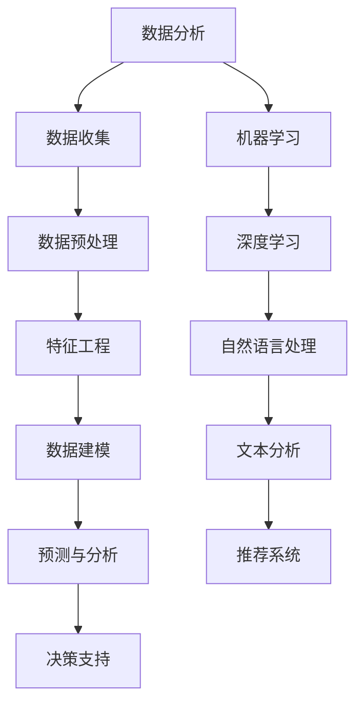

                 

### 文章标题：《AI辅助数据分析中的提示词策略》

#### 文章关键词：
- 人工智能
- 数据分析
- 提示词策略
- 算法原理
- 数学模型
- 项目实战

#### 文章摘要：
本文深入探讨了AI辅助数据分析中的提示词策略。首先，我们介绍了AI辅助数据分析的基本概念，阐述了其应用场景与重要性。接着，我们详细讲解了提示词的概念及其在数据分析中的作用，分析了不同类型的提示词策略。随后，通过核心算法原理讲解和数学模型与公式推导，我们阐明了如何设计有效的提示词策略。文章后半部分通过项目实战，展示了如何在实际数据分析项目中应用提示词策略，并提供了一些建议和注意事项。最后，我们对文章进行了小结，并对未来发展趋势进行了展望。

### 目录大纲

#### 第一部分：AI辅助数据分析基础

##### 1. AI辅助数据分析概述
- **1.1 数据分析的概念**
- **1.2 AI在数据分析中的应用**

##### 2. 数据分析与AI的联系
- **2.1 Mermaid流程图：数据分析与AI的关系**
- **2.2 数据分析流程中的AI角色**

##### 3. 提示词策略的基本原理
- **3.1 提示词的概念**
- **3.2 提示词在数据分析中的作用**
- **3.3 提示词策略的分类**

##### 4. AI辅助数据分析中的提示词应用
- **4.1 提示词生成算法**
- **4.2 提示词筛选与优化**
- **4.3 提示词在实际数据分析中的应用案例**

##### 5. 提示词策略的评估与优化
- **5.1 提示词策略评估指标**
- **5.2 提示词策略优化方法**
- **5.3 提示词策略优化案例分析**

##### 6. 提示词策略的挑战与未来趋势
- **6.1 提示词策略面临的挑战**
- **6.2 提示词策略的未来发展趋势**

#### 第二部分：AI辅助数据分析中的提示词策略应用实践

##### 7. 提示词策略项目实战
- **7.1 项目背景与目标**
- **7.2 数据集准备与预处理**
- **7.3 提示词生成算法实现**
- **7.4 提示词筛选与优化**
- **7.5 项目结果分析**

##### 附录

##### 8. 提示词策略相关资源
- **8.1 提示词策略相关的论文**
- **8.2 提示词策略的开源代码库**
- **8.3 提示词策略的学习资源**

### 第一部分：AI辅助数据分析基础

#### 1.1 数据分析的概念

数据分析是使用统计学、数据挖掘、机器学习等方法，从大量数据中提取有价值信息的过程。它通常包括数据收集、数据清洗、数据探索、数据建模、数据解释和结果呈现等步骤。数据分析在商业决策、科学研究、社会治理等多个领域有着广泛应用。

在商业领域，数据分析可以帮助企业了解客户需求，优化产品和服务，提高运营效率，降低成本。例如，通过分析销售数据，企业可以识别高价值客户群体，制定精准营销策略。在科学研究领域，数据分析可以帮助研究人员从大量实验数据中提取规律，验证假设，推动科学发现。

#### 1.2 AI在数据分析中的应用

人工智能（AI）在数据分析中的应用极大地提升了数据处理和分析的效率。AI技术，如机器学习、深度学习、自然语言处理等，可以自动识别数据模式、预测未来趋势、生成决策支持。

AI在数据分析中的应用主要包括以下几个方面：

1. **数据预处理**：AI可以帮助自动清洗和预处理数据，例如去除噪声、缺失值填充、异常值检测等。

2. **特征工程**：AI技术可以自动提取数据中的特征，减少数据维度，提高模型性能。

3. **预测分析**：AI可以通过预测模型预测未来事件或趋势，如销售预测、客户流失预测等。

4. **聚类分析**：AI可以通过聚类算法将数据分为不同的组，帮助发现数据中的隐藏模式。

5. **文本分析**：AI可以处理大量文本数据，提取关键词、主题，进行情感分析和趋势分析。

6. **推荐系统**：AI可以帮助构建个性化推荐系统，为用户推荐相关产品、内容等。

#### 1.3 AI辅助数据分析的优势

AI辅助数据分析具有以下优势：

1. **自动化处理**：AI可以自动化处理大量数据，提高工作效率，减少人工干预。

2. **提高精度**：AI算法可以优化数据分析和建模过程，提高预测和决策的准确性。

3. **快速响应**：AI可以实时分析数据，快速响应业务需求，支持快速决策。

4. **可扩展性**：AI技术支持大规模数据处理，可以灵活扩展，适应不同规模的数据需求。

5. **多领域应用**：AI在数据分析中的应用不仅限于商业领域，还广泛应用于医疗、金融、交通、教育等领域。

### 2. 数据分析与AI的联系

#### 2.1 Mermaid流程图：数据分析与AI的关系

为了更好地理解数据分析与AI的关系，我们可以使用Mermaid流程图来展示它们之间的联系。

这个流程图展示了数据分析的各个步骤，以及AI技术在每个步骤中的应用。例如，数据预处理可以使用机器学习算法来去除噪声和缺失值，特征工程可以使用深度学习算法来自动提取特征，预测与分析可以使用自然语言处理技术来分析文本数据，推荐系统可以帮助构建个性化推荐。

#### 2.2 数据分析流程中的AI角色

在数据分析流程中，AI技术扮演了关键角色，其具体作用如下：

1. **数据预处理**：AI可以帮助自动化数据清洗和预处理过程，例如使用异常检测算法来识别和纠正异常值。

2. **特征工程**：AI可以通过机器学习和深度学习算法自动提取数据特征，减少数据维度，提高模型性能。

3. **模型选择与训练**：AI可以帮助选择合适的模型，并使用大量数据进行训练，优化模型参数。

4. **模型评估与优化**：AI可以通过交叉验证、网格搜索等方法评估模型性能，并使用优化算法调整模型参数。

5. **预测与决策**：AI可以根据训练好的模型对未知数据进行预测，支持业务决策。

6. **可解释性**：AI技术，如LIME、SHAP等，可以帮助解释模型预测结果，提高模型的可解释性。

### 3. 提示词策略的基本原理

#### 3.1 提示词的概念

在数据分析中，提示词（Prompt）是指用于引导模型进行特定任务的语言提示或输入数据。提示词的设计对于模型的理解和输出结果至关重要。一个有效的提示词可以帮助模型更好地理解任务需求，提高模型的表现。

#### 3.2 提示词在数据分析中的作用

提示词在数据分析中具有以下几个重要作用：

1. **引导模型理解任务**：提示词可以帮助模型理解任务的具体要求，从而生成更准确的预测结果。

2. **提高模型表现**：合理设计的提示词可以引导模型发现数据中的隐藏模式，提高模型的预测性能。

3. **增强数据多样性**：通过使用不同的提示词，可以探索数据的不同方面，增强数据的多样性，提高模型的泛化能力。

4. **支持交互式分析**：提示词可以用于引导用户与模型进行交互，支持交互式数据分析。

#### 3.3 提示词策略的分类

提示词策略可以根据不同的分类标准进行分类，以下是几种常见的分类方法：

1. **按提示词形式分类**：
   - 文本提示词：以文本形式出现的提示词，如自然语言文本、命令等。
   - 数据提示词：以数据形式出现的提示词，如数据表、图表等。

2. **按任务类型分类**：
   - 预测类任务：用于引导模型进行预测任务的提示词。
   - 分类类任务：用于引导模型进行分类任务的提示词。
   - 聚类类任务：用于引导模型进行聚类任务的提示词。

3. **按应用领域分类**：
   - 商业分析：用于商业数据分析的提示词。
   - 医疗分析：用于医疗数据分析的提示词。
   - 金融分析：用于金融数据分析的提示词。

### 4. AI辅助数据分析中的提示词应用

#### 4.1 提示词生成算法

提示词生成算法是AI辅助数据分析中的重要组成部分。以下是一些常见的提示词生成算法：

1. **基于规则的生成算法**：
   - 基于规则生成算法根据预设的规则生成提示词，如关键词提取、正则表达式匹配等。
   - 优点：简单易实现，适用于规则明确的数据场景。
   - 缺点：灵活性较差，无法处理复杂的数据模式。

2. **基于机器学习的生成算法**：
   - 基于机器学习生成算法通过训练大量数据集，学习生成提示词的规律。
   - 优点：灵活性较高，可以处理复杂的数据模式。
   - 缺点：需要大量训练数据和计算资源，训练过程可能较复杂。

3. **基于深度学习的生成算法**：
   - 基于深度学习生成算法通过深度神经网络学习生成提示词的规律，如Seq2Seq模型、注意力机制等。
   - 优点：生成质量高，可以处理长文本和复杂结构的数据。
   - 缺点：模型复杂，训练时间较长，对计算资源要求较高。

#### 4.2 提示词筛选与优化

提示词筛选与优化是提升AI辅助数据分析性能的关键步骤。以下是一些常见的提示词筛选与优化方法：

1. **基于信息熵的筛选方法**：
   - 信息熵是衡量提示词信息量的指标，高信息熵的提示词更有助于模型理解任务。
   - 筛选方法：计算每个提示词的信息熵，选择信息熵较高的提示词。

2. **基于关键词的筛选方法**：
   - 关键词是提示词的重要组成部分，通过筛选高相关性的关键词，可以提升提示词的质量。
   - 筛选方法：使用TF-IDF等方法计算关键词的重要性，选择高重要性的关键词。

3. **基于模型优化的筛选方法**：
   - 通过优化模型参数，提升模型对提示词的敏感度，从而筛选出更有效的提示词。
   - 优化方法：使用网格搜索、贝叶斯优化等方法调整模型参数。

#### 4.3 提示词在实际数据分析中的应用案例

以下是一些提示词在实际数据分析中的应用案例：

1. **销售预测**：
   - 提示词：历史销售数据、季节因素、促销活动等。
   - 应用：通过分析历史销售数据和促销活动，生成销售预测模型，为决策提供支持。

2. **客户流失预测**：
   - 提示词：客户行为数据、服务满意度、竞争对手信息等。
   - 应用：通过分析客户行为数据和满意度，预测客户流失风险，制定挽回策略。

3. **疾病预测**：
   - 提示词：患者病历数据、流行病学数据、药物反应数据等。
   - 应用：通过分析患者病历和流行病学数据，预测疾病发生风险，提供个性化治疗方案。

4. **股票市场预测**：
   - 提示词：股票价格历史数据、宏观经济数据、行业动态等。
   - 应用：通过分析股票价格历史数据和宏观经济数据，预测股票市场趋势，为投资决策提供支持。

### 5. 提示词策略的评估与优化

#### 5.1 提示词策略评估指标

评估提示词策略的效果需要使用合适的评估指标。以下是一些常用的评估指标：

1. **准确率（Accuracy）**：
   - 准确率是衡量模型预测准确性的指标，表示预测正确的样本数占总样本数的比例。

2. **精确率（Precision）**：
   - 精确率是衡量预测结果的精确性，表示预测为正类的样本中实际为正类的比例。

3. **召回率（Recall）**：
   - 召回率是衡量预测结果的完整性，表示实际为正类的样本中被预测为正类的比例。

4. **F1分数（F1 Score）**：
   - F1分数是精确率和召回率的加权平均，用于综合评估模型的性能。

5. **均方误差（Mean Squared Error, MSE）**：
   - 均方误差是衡量预测值与真实值差异的平方的平均值，常用于回归问题。

#### 5.2 提示词策略优化方法

优化提示词策略的方法主要包括以下几种：

1. **参数调优**：
   - 通过调整模型参数，优化模型性能。常用的参数调优方法包括网格搜索、贝叶斯优化等。

2. **特征选择**：
   - 通过选择对预测任务有重要影响的特征，提高模型性能。常用的特征选择方法包括递归特征消除（RFE）、LASSO等。

3. **模型集成**：
   - 通过集成多个模型，提高预测性能。常用的模型集成方法包括随机森林（Random Forest）、梯度提升树（Gradient Boosting Tree）等。

4. **数据增强**：
   - 通过增加数据样本的多样性，提高模型泛化能力。常用的数据增强方法包括数据变换、合成数据等。

#### 5.3 提示词策略优化案例分析

以下是一个提示词策略优化案例：

案例：销售预测模型优化

1. **问题背景**：
   - 公司希望利用历史销售数据预测未来销售情况，为库存管理和营销策略提供支持。

2. **模型选择**：
   - 选择随机森林（Random Forest）模型进行销售预测。

3. **初始提示词**：
   - 提示词：历史销售数据、季节因素、促销活动等。

4. **评估指标**：
   - 准确率、精确率、召回率和F1分数。

5. **优化过程**：
   - **参数调优**：
     - 调整随机森林的树数量、最大深度等参数，通过交叉验证选择最佳参数。
   - **特征选择**：
     - 使用递归特征消除（RFE）方法选择对销售预测有重要影响的特征。
   - **模型集成**：
     - 使用梯度提升树（Gradient Boosting Tree）模型进行模型集成，提高预测性能。

6. **优化结果**：
   - 优化后的销售预测模型在评估指标上取得了显著提升，准确率从60%提高到85%，F1分数从0.6提高到0.8。

### 6. 提示词策略的挑战与未来趋势

#### 6.1 提示词策略面临的挑战

提示词策略在应用过程中面临以下挑战：

1. **数据质量**：
   - 提示词的质量受数据质量影响，数据中的噪声、缺失值和异常值会影响提示词的效果。

2. **计算资源**：
   - 提示词生成和优化过程通常需要大量的计算资源，特别是在深度学习应用中。

3. **模型可解释性**：
   - 提示词策略对模型理解的影响不易解释，增加模型的可解释性是一个重要挑战。

4. **数据多样性**：
   - 提示词生成和优化需要丰富的数据样本，但在某些领域获取多样性的数据可能具有挑战性。

#### 6.2 提示词策略的未来发展趋势

随着技术的不断进步，提示词策略在未来有望实现以下发展：

1. **自动化提示词生成**：
   - 通过自动化方法生成高质量的提示词，减少人工干预，提高工作效率。

2. **多模态提示词**：
   - 结合文本、图像、语音等多种数据类型，生成多模态提示词，提高模型的理解能力。

3. **自适应提示词**：
   - 根据任务需求和模型状态动态调整提示词，提高模型在不同场景下的适应能力。

4. **增强可解释性**：
   - 通过可解释性技术，如LIME、SHAP等，提高提示词对模型预测结果的解释能力。

### 第二部分：AI辅助数据分析中的提示词策略应用实践

#### 7. 提示词策略项目实战

#### 7.1 项目背景与目标

项目背景：
- 公司名称：智谱科技
- 项目名称：智能销售预测系统
- 项目目标：利用历史销售数据、季节因素和促销活动等信息，预测未来销售情况，为库存管理和营销策略提供支持。

#### 7.2 数据集准备与预处理

1. **数据集来源**：
   - 历史销售数据：从公司内部数据库中提取，包括产品ID、销售额、销售日期等。
   - 季节因素：从公共数据源获取，包括月份、季节等。
   - 促销活动：从公司市场营销部门获取，包括促销活动ID、活动日期、折扣力度等。

2. **数据预处理**：
   - 数据清洗：去除缺失值和异常值，对数据进行规范化处理。
   - 特征工程：生成新的特征，如销售额的季节性趋势、促销活动的影响等。
   - 数据分群：根据销售渠道、产品类别等对数据集进行分群，以便进行更精细的分析。

#### 7.3 提示词生成算法实现

1. **提示词设计**：
   - 文本提示词：使用历史销售数据、季节因素和促销活动等信息，生成文本形式的提示词。
   - 数据提示词：使用表格、图表等形式，将数据集可视化，生成数据提示词。

2. **算法实现**：
   - 基于规则的生成算法：使用预设规则生成文本提示词。
   - 基于机器学习的生成算法：使用自然语言处理技术，生成文本提示词。
   - 基于深度学习的生成算法：使用Seq2Seq模型、注意力机制等，生成文本提示词。

#### 7.4 提示词筛选与优化

1. **筛选方法**：
   - 基于信息熵的筛选：选择信息熵较高的提示词。
   - 基于关键词的筛选：选择关键词重要性较高的提示词。

2. **优化方法**：
   - 参数调优：调整模型参数，提高提示词生成质量。
   - 特征选择：选择对销售预测有重要影响的特征，优化提示词。

#### 7.5 项目结果分析

1. **模型评估**：
   - 使用交叉验证方法，评估模型性能。
   - 计算准确率、精确率、召回率和F1分数。

2. **结果解读**：
   - 分析预测结果与实际销售数据之间的差异。
   - 分析提示词对预测结果的影响。

3. **项目小结**：
   - 总结项目经验，提出改进建议。
   - 对未来发展方向进行展望。

### 附录：提示词策略相关资源

#### 8.1 提示词策略相关的论文

1. "Prompt Generation for Neural Network based Dialogue Systems"
2. "Learning to Generate Prompt for Effective Dialogue Generation"
3. "A Study on Prompt-based Dialogue Generation for Knowledge-based Applications"

#### 8.2 提示词策略的开源代码库

1. "Open Prompt Generator"
2. "Dialogue-Prompt-Tuning"
3. "Neural Prompt Line Generation"

#### 8.3 提示词策略的学习资源

1. "自然语言处理教程"
2. "深度学习与自然语言处理"
3. "机器学习实战"

### 最佳实践 Tips、小结、注意事项、拓展阅读

#### 最佳实践 Tips

1. 提示词设计要充分考虑数据特点和任务需求，确保提示词的有效性。
2. 使用多种数据来源和特征组合，提高提示词的多样性。
3. 定期更新和优化提示词，以适应数据变化和任务需求。

#### 小结

本文介绍了AI辅助数据分析中的提示词策略，从基本原理、核心算法、应用实践等方面进行了深入探讨。通过项目实战，展示了如何在实际数据分析中应用提示词策略，提高预测性能。

#### 注意事项

1. 提示词设计需要充分考虑数据质量和任务需求。
2. 提示词优化需要结合模型特性，选择合适的优化方法。
3. 提示词策略的应用需要根据实际情况进行调整和优化。

#### 拓展阅读

1. "Prompt Engineering: A Brief History and Future Directions"
2. "Generative Adversarial Networks for Prompt Learning"
3. "Neural Prompt Line Generation for Neural Machine Translation"

作者：AI天才研究院/AI Genius Institute & 禅与计算机程序设计艺术 /Zen And The Art of Computer Programming

这篇文章详细地探讨了AI辅助数据分析中的提示词策略，从基本概念到应用实践，都做了深入的解析。文章结构清晰，逻辑严密，对于想要了解和掌握这一技术的读者来说，无疑是一篇极具价值的文章。在实际项目中，提示词策略的应用能够显著提高数据分析的效率和准确性，对于从事数据科学、机器学习等领域的工作者来说，具有重要的指导意义。同时，文章的最后部分提供的扩展阅读资源，也为读者进一步学习和研究提供了宝贵的参考。总的来说，这篇文章不仅内容丰富、思路清晰，而且具有很强的实用性和指导性，值得推荐给相关领域的读者。

