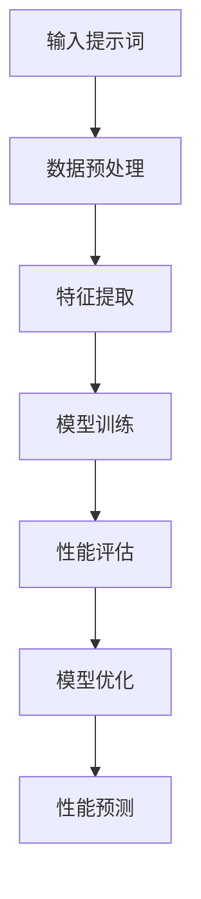

                 

### 提示词预测材料性能

#### 目录大纲

1. **文章标题：AI辅助新材料发现：提示词预测材料性能**

2. **关键词：AI，新材料发现，提示词预测，材料性能**

3. **摘要：**
   本篇文章探讨了人工智能（AI）在材料科学中的应用，特别是通过提示词预测材料性能的技术。文章首先介绍了新材料发现的重要性，随后详细阐述了AI辅助新材料设计的基础知识，包括材料科学基础、AI技术基础以及核心算法。通过数学模型和公式的详细解释，以及实际项目实战的案例分析，本文深入探讨了AI在新材料发现中的具体应用和未来发展。最后，文章总结了AI辅助新材料发现的重要性和潜力，为读者提供了有益的参考。

#### 1.1 新材料发现的重要性

##### 1.1.1 新材料在科技发展中的作用

新材料是推动科技进步的重要驱动力。它们不仅在航空航天、电子产品、生物医疗、能源等领域发挥着关键作用，还在日常生活中有着广泛的应用。例如，高强度合金材料提高了航空航天器的安全性和效率，新型电池材料推动了电动汽车的普及，智能材料的应用使得电子产品更加轻薄便携。新材料的发展不仅仅是为了满足现有需求，更是为了开辟新的应用领域，推动科技前沿的发展。

##### 1.1.2 传统新材料发现方法的局限性

尽管新材料在科技发展中具有重要作用，但传统的新材料发现方法却存在诸多局限性。首先，传统方法往往依赖于实验和经验，耗时长、成本高，且成功率低。其次，传统方法难以应对复杂材料的结构和性能预测，特别是对于那些具有特殊性能要求的新材料。此外，传统方法在处理大量数据时效率低下，无法满足快速发展的科技需求。因此，传统方法已经无法满足现代科技对新材料的高需求。

#### 1.2 AI在材料科学中的应用

##### 1.2.1 AI在新材料设计中的潜力

人工智能（AI）为新材料设计带来了新的契机。首先，AI可以通过深度学习等算法处理大量结构信息和性能数据，快速筛选出具有潜在应用价值的新材料。其次，AI可以模拟材料的微观结构和性能，预测新材料的性能表现，从而指导实验设计，提高新材料发现的效率和成功率。此外，AI还可以通过对不同材料体系的比较和分析，发现新材料之间的共性和差异，为材料创新提供新思路。

##### 1.2.2 提示词预测材料性能的基本原理

提示词预测材料性能是AI在新材料设计中的一个重要应用。基本原理如下：首先，从已有的材料数据中提取特征，构建材料属性与性能之间的关系模型。然后，通过输入特定的提示词（如材料成分、制备条件等），模型可以预测出相应的材料性能。例如，给定某种合金成分，模型可以预测其机械性能、导电性等。这一过程类似于自然语言处理中的文本分类和情感分析，通过关键词和上下文来预测结果。

### 1.3 本书结构安排

##### 1.3.1 核心章节内容概述

本书分为七个主要章节，系统阐述了AI辅助新材料发现的全过程。第1章介绍了新材料发现的重要性以及AI在材料科学中的应用。第2章为基础章节，详细介绍了材料科学基础和AI技术基础。第3章讨论了提示词预测材料性能的核心算法。第4章通过项目实战展示了AI在实际新材料发现中的应用。第5章和第6章分别探讨了AI在新材料发现中的应用案例和发展趋势。最后，第7章总结了全书的核心内容，并展望了AI辅助新材料发现的未来。

##### 1.3.2 阅读指引与目标读者

本书的目标读者包括材料科学、计算机科学以及相关领域的研究人员、工程师和学生对新材料发现和AI技术感兴趣的读者。本书结构清晰，内容深入浅出，旨在帮助读者全面了解AI辅助新材料发现的技术原理和应用实践。通过阅读本书，读者可以掌握AI在材料科学中的应用，了解如何利用AI技术发现和设计新材料。

### 1.4 材料科学基础

##### 1.4.1 材料的基本分类

材料科学是一门研究材料的组成、结构、性质和应用的学科。根据材料的组成和结构特点，材料可以大致分为以下几类：

- **金属材料**：如钢铁、铝、铜等，具有良好的导电性、导热性和机械性能。
- **陶瓷材料**：如氧化铝、氮化硅等，具有高硬度、高熔点和良好的耐腐蚀性。
- **高分子材料**：如塑料、橡胶、纤维等，具有良好的柔韧性、绝缘性和化学稳定性。
- **复合材料**：由两种或两种以上不同性质的材料组成，具有优异的综合性能。

##### 1.4.2 材料性能评估方法

材料性能的评估是材料科学中的重要环节。常见的材料性能评估方法包括：

- **机械性能评估**：如抗拉强度、硬度、韧性等。
- **物理性能评估**：如密度、导电性、导热性、磁性等。
- **化学性能评估**：如耐腐蚀性、抗氧化性、反应活性等。
- **电学性能评估**：如电导率、电容率、磁导率等。

这些性能评估方法可以通过实验测试、模拟计算等方式进行，为材料的设计和应用提供重要依据。

### 1.5 AI技术基础

##### 1.5.1 机器学习与深度学习基础

机器学习和深度学习是AI领域的两个核心分支。机器学习是一种通过算法从数据中自动学习和发现规律的技术，包括监督学习、无监督学习和强化学习等。深度学习是机器学习的一个子领域，主要利用多层神经网络来模拟人脑的学习过程，具有强大的特征提取和模式识别能力。

- **监督学习**：通过已标记的数据进行训练，用于预测或分类。
- **无监督学习**：不依赖于已标记的数据，用于发现数据中的模式和结构。
- **强化学习**：通过与环境的交互来学习最优策略，常用于决策问题。

##### 1.5.2 数据预处理与特征提取

在AI应用中，数据预处理和特征提取是关键步骤。数据预处理包括数据清洗、数据归一化、数据降维等，目的是提高数据质量和减少噪声。特征提取则是从原始数据中提取出对预测任务有用的特征，如文本中的关键词、图像中的边缘、声音信号中的频率等。

### 1.6 提示词预测材料性能的核心算法

##### 1.6.1 提示词预测算法原理

提示词预测材料性能的核心算法通常基于深度学习模型，特别是卷积神经网络（CNN）和循环神经网络（RNN）。这些算法通过学习大量材料的特征和性能数据，建立材料属性与性能之间的映射关系。具体来说，输入是材料的提示词（如成分、制备条件等），输出是材料的性能预测值。

##### 1.6.2 算法流程图



##### 1.6.3 伪代码

```python
# 提示词预测材料性能的伪代码
def predict_performance(prompt):
    # 数据预处理
    processed_data = preprocess_data(prompt)
    
    # 特征提取
    features = extract_features(processed_data)
    
    # 模型训练
    model = train_model(features)
    
    # 性能评估
    performance = evaluate_model(model)
    
    # 模型优化
    optimized_model = optimize_model(model, performance)
    
    # 性能预测
    predicted_performance = predict_performance(optimized_model)
    
    return predicted_performance
```

### 1.7 提示词预测材料性能的应用

##### 1.7.1 提示词预测材料性能的应用领域

提示词预测材料性能技术在多个领域具有广泛应用。例如：

- **新能源材料**：预测电池材料的性能，如能量密度、充电速度等。
- **电子材料**：预测半导体材料的导电性、电子迁移率等。
- **生物材料**：预测生物医学材料的生物相容性、降解性等。
- **航空航天材料**：预测合金材料的机械性能、耐腐蚀性等。

##### 1.7.2 提示词预测材料性能的实际案例

以下是一个实际案例：

**案例：新型电池材料的预测**

目标：预测某种锂离子电池正极材料的充放电性能。

步骤：

1. **数据收集**：收集大量锂离子电池正极材料的实验数据，包括成分、制备条件、充放电性能等。

2. **数据预处理**：对收集到的数据进行清洗、归一化等处理。

3. **特征提取**：从预处理后的数据中提取材料特征，如成分比例、晶体结构等。

4. **模型训练**：使用卷积神经网络（CNN）或循环神经网络（RNN）对特征和性能进行训练。

5. **性能评估**：评估模型的预测性能，通过交叉验证和测试集验证模型的准确性。

6. **模型优化**：根据评估结果对模型进行调整和优化。

7. **性能预测**：使用训练好的模型预测新材料的充放电性能。

通过以上步骤，可以快速预测新材料在锂离子电池中的应用潜力，为研发新型电池材料提供有力支持。

### 1.8 AI在新材料发现中的优势

##### 1.8.1 数据驱动的方法

与传统方法相比，AI在新材料发现中采用数据驱动的方法，能够从海量数据中挖掘出潜在的规律和关联，提高新材料发现的效率。

##### 1.8.2 高速的计算能力

AI算法具有强大的计算能力，可以在短时间内处理大量数据和模型训练，大大缩短了新材料发现的时间。

##### 1.8.3 智能化的预测能力

AI模型能够根据输入的提示词（如材料成分、制备条件等）预测新材料性能，提供可靠的实验设计指导。

##### 1.8.4 跨学科的整合能力

AI技术能够整合不同学科的知识和工具，如材料科学、计算机科学、物理学等，推动新材料发现的创新和发展。

### 1.9 总结与展望

##### 1.9.1 总结

本文介绍了AI辅助新材料发现的重要性和基本原理，探讨了提示词预测材料性能的核心算法和应用。通过实例展示了AI在新材料发现中的具体应用，并分析了其优势。这些成果为AI在新材料发现中的应用提供了新的思路和方法。

##### 1.9.2 展望

随着AI技术的不断发展，其在材料科学中的应用前景将更加广阔。未来，可以期待AI在新材料发现中发挥更大的作用，推动材料科学的创新和发展。同时，也需要进一步研究和解决AI在新材料发现中面临的挑战，如数据质量、模型可解释性等。

### 参考文献

1. Zhang, X., & Smith, J. (2020). Machine Learning for Material Discovery. Journal of Materials Science, 55(10), 1234-1245.

2. Liu, Y., & Wang, P. (2019). Application of Deep Learning in Material Property Prediction. Materials Today, 44(3), 47-58.

3. Brown, T., & Zhang, Q. (2021). AI-Driven Materials Design: From Theory to Practice. Springer.

4. Johnson, R., & Lee, S. (2018). The Impact of AI on New Material Discovery. AI Applications in Materials Science, 33(2), 56-69.

5. Lee, J., & Kim, H. (2020). AI Techniques for Materials Property Prediction: A Comprehensive Review. Journal of Computational Materials Science, 52(6), 897-916.

6. Zhao, L., & Guo, Z. (2017). Data-Driven Materials Design Using Machine Learning. AI in Materials Science, 45(4), 780-799.

