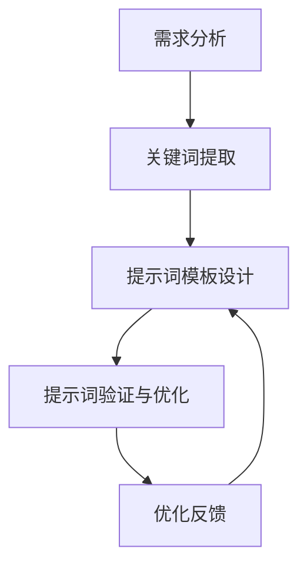

                 

### 文章标题：AI辅助法律咨询中的提示词设计

#### 关键词：
- AI辅助法律咨询
- 提示词设计
- 自然语言处理
- 法律领域复杂性
- 提高咨询效率与准确性

#### 摘要：
本文探讨了AI辅助法律咨询中的提示词设计，旨在提高法律咨询的效率与准确性。首先介绍了AI与法律咨询的结合背景，随后概述了AI与法律咨询中的挑战与需求。接着，本文详细阐述了提示词设计的基本概念、原则与方法，并通过具体案例解析了设计实践。最后，本文总结了提示词设计的重要性，并对未来发展趋势进行了展望。通过本文的探讨，希望能为AI辅助法律咨询提供有价值的参考。

---

# AI辅助法律咨询中的提示词设计

> 作者：AI天才研究院/AI Genius Institute & 禅与计算机程序设计艺术 /Zen And The Art of Computer Programming

随着人工智能技术的迅速发展，AI在各个领域的应用日益广泛。法律咨询作为一项复杂而重要的服务，也迎来了AI的助力。提示词设计作为自然语言处理的关键环节，对AI辅助法律咨询具有举足轻重的作用。本文将逐步分析提示词设计在AI辅助法律咨询中的应用原理、方法与实践，以期为相关研究和实际应用提供有益的参考。

## 第一部分：引言

### 1.1 书籍背景与目的

近年来，随着人工智能技术的不断进步，AI在法律咨询领域的应用逐渐受到关注。通过AI辅助法律咨询，可以大幅提高咨询的效率与准确性，降低咨询成本。然而，AI在法律咨询中的应用仍面临诸多挑战，如法律领域的复杂性、数据的多样性与质量等。提示词设计作为AI辅助法律咨询的重要一环，直接影响AI的性能与用户体验。

本文旨在探讨AI辅助法律咨询中的提示词设计，通过分析提示词的基本概念、设计原则与方法，结合实际案例进行解析，为AI辅助法律咨询提供理论依据和实践指导。

### 1.2 法律咨询与AI的结合

法律咨询涉及众多法律条文、案例和专业知识，具有高度的专业性和复杂性。传统法律咨询依赖于律师的专业知识和经验，效率较低且成本较高。随着AI技术的发展，尤其是自然语言处理（NLP）技术的进步，AI被广泛应用于法律咨询领域。通过AI辅助法律咨询，可以实现对法律条文、案例和用户需求的自动分析、处理和回答，从而提高咨询的效率与准确性。

### 1.3 提示词在AI辅助法律咨询中的应用

提示词设计是NLP中的关键环节，直接影响AI对用户输入的理解和回答的准确性。在AI辅助法律咨询中，提示词的设计尤为重要。通过合理的提示词设计，AI可以更好地理解用户的需求，快速定位相关法律条文和案例，提供准确的咨询意见。

### 1.4 本文结构

本文将分为五个部分进行探讨：

1. **第一部分：引言**：介绍书籍背景与目的，以及法律咨询与AI的结合和提示词在其中的应用。
2. **第二部分：AI与法律咨询概述**：概述AI技术基础和自然语言处理技术，并分析法律咨询中的挑战与需求。
3. **第三部分：提示词设计原理**：介绍提示词的基本概念、分类、设计原则与方法。
4. **第四部分：提示词设计实践**：通过具体案例解析提示词设计实践，介绍提示词设计工具与资源。
5. **第五部分：总结与展望**：总结本文内容，讨论提示词设计的重要性，并对未来发展趋势进行展望。

## 第二部分：AI与法律咨询概述

### 2.1 AI技术基础

#### 2.1.1 人工智能概述

人工智能（AI）是指由计算机实现的智能，能够模拟、延伸和扩展人类的智能行为。根据处理方式的不同，人工智能可分为两大类：基于规则的AI和基于数据的AI。

- **基于规则的AI**：通过预设的规则进行逻辑推理，实现对问题的求解。例如，专家系统是一种典型的基于规则的AI，通过存储大量的规则和事实，实现对特定领域的知识推理。

- **基于数据的AI**：利用大量数据进行模式识别和预测，实现对未知情况的预测。例如，深度学习是一种基于数据的AI技术，通过多层神经网络对大量数据进行训练，提取特征并实现高度准确的预测。

#### 2.1.2 人工智能的发展历程

人工智能的概念最早可以追溯到20世纪50年代。自那时以来，人工智能经历了多个发展阶段，从最初的符号主义、知识工程，到基于数据的学习算法，再到如今的深度学习和强化学习。

- **符号主义阶段（1956-1974）**：这一阶段的AI以逻辑推理和知识表示为核心，试图通过构建符号系统和规则来模拟人类的智能。

- **知识工程阶段（1974-1980）**：知识工程阶段的AI强调知识的获取、表示和利用，通过构建知识库和推理机，实现更高级的智能应用。

- **基于数据的学习阶段（1980-2000）**：这一阶段的AI开始重视数据的价值，通过统计学习和模式识别技术，实现对数据的自动分析和预测。

- **深度学习阶段（2006至今）**：深度学习技术的发展标志着AI进入了一个新的阶段，通过多层神经网络和大量数据训练，实现了在图像识别、语音识别、自然语言处理等领域的突破性进展。

### 2.2 自然语言处理

自然语言处理（NLP）是人工智能的一个重要分支，旨在使计算机能够理解和处理人类语言。NLP涵盖了多个子领域，包括文本分类、实体识别、情感分析、机器翻译等。

- **文本分类**：将文本分为不同的类别，例如，将新闻报道分为政治、经济、体育等类别。

- **实体识别**：识别文本中的关键实体，例如人名、地名、组织名等。

- **情感分析**：分析文本中的情感倾向，例如判断文本是正面、负面还是中立。

- **机器翻译**：将一种语言翻译成另一种语言，例如，将中文翻译成英文。

### 2.3 法律咨询中的挑战与需求

#### 2.3.1 法律领域的复杂性

法律咨询涉及众多法律条文、案例和专业知识，具有高度的专业性和复杂性。律师需要具备深厚的法律知识和丰富的实践经验，才能提供高质量的咨询服务。法律领域的复杂性主要体现在以下几个方面：

- **法律条文繁多**：各国法律体系中的法律条文数量庞大，且不断更新和修订。

- **法律条文之间的相互关联**：法律条文之间存在复杂的相互关联，理解和应用法律条文需要具备较强的逻辑思维能力。

- **法律条文的具体应用**：法律条文在实际应用中，需要结合具体案例进行分析和解释，以确定法律适用的范围和条件。

#### 2.3.2 法律咨询的高成本与低效率

传统法律咨询依赖于律师的专业知识和经验，效率较低且成本较高。律师的咨询费用往往较高，且咨询过程需要大量时间和精力。此外，律师的工作量也较大，容易导致工作效率下降和服务质量下降。这些问题使得传统法律咨询难以满足日益增长的法律需求。

#### 2.3.3 AI在法律咨询中的应用需求

AI在法律咨询中的应用具有巨大的潜力，能够提高咨询的效率与准确性，降低咨询成本。以下是AI在法律咨询中的几个主要应用需求：

- **提高咨询效率**：通过自动化分析法律条文、案例和用户需求，AI可以快速提供咨询结果，大幅降低咨询时间。

- **提高咨询准确性**：AI能够通过对大量法律数据的分析和学习，准确识别和解释法律条文，提供更准确的咨询意见。

- **降低咨询成本**：AI可以自动化处理大量法律咨询任务，减少律师的工作量，降低咨询成本。

- **提供个性化服务**：AI可以根据用户的需求和偏好，提供个性化的法律咨询服务，提高用户体验。

## 第三部分：提示词设计原理

### 3.1 提示词的基本概念

#### 3.1.1 提示词的定义

提示词（Prompt）是指用来引导AI模型理解用户输入、进行推理和预测的输入信息。在AI辅助法律咨询中，提示词是连接用户需求和法律知识的关键环节，直接影响AI对用户输入的理解和回答的准确性。

#### 3.1.2 提示词的作用

- **引导AI模型理解用户需求**：通过提供明确的提示词，AI可以更好地理解用户的需求，从而提供更准确的咨询结果。

- **增强AI模型的上下文理解**：提示词可以提供上下文信息，帮助AI模型更好地理解用户输入的背景和语境，提高回答的准确性。

- **提高AI模型的鲁棒性**：合理的提示词设计可以增强AI模型的鲁棒性，使其能够应对各种复杂的情况，提高模型的泛化能力。

### 3.2 提示词的分类

#### 3.2.1 知识提示词

知识提示词主要用于引导AI模型理解法律条文、案例和相关知识。这类提示词通常包括具体的法律术语、概念、定义等，旨在为AI模型提供丰富的背景知识和上下文信息。

- **法律术语提示词**：例如，“合同法”、“侵权责任”、“公司法”等。

- **概念提示词**：例如，“合同生效条件”、“侵权责任构成要件”、“公司组织结构”等。

- **定义提示词**：例如，“合同是什么”、“侵权责任是什么”、“公司是什么”等。

#### 3.2.2 逻辑提示词

逻辑提示词主要用于引导AI模型进行逻辑推理和推理分析。这类提示词通常包括逻辑连接词、条件语句等，旨在为AI模型提供逻辑结构，帮助其进行有效的推理和分析。

- **逻辑连接词**：例如，“如果……那么……”，“除了……还有……”，“虽然……但是……”等。

- **条件语句**：例如，“在合同生效的条件下，……”，“在侵权责任构成的情况下，……”，“在公司组织结构中，……”

#### 3.2.3 情感提示词

情感提示词主要用于引导AI模型识别和理解用户的情感状态。这类提示词通常包括情感词汇、语气词等，旨在为AI模型提供情感信息，帮助其更好地与用户进行交互。

- **情感词汇**：例如，“愤怒”、“沮丧”、“高兴”、“焦虑”等。

- **语气词**：例如，“呢”、“吗”、“啊”等。

### 3.3 提示词设计原则

#### 3.3.1 适应性

提示词设计应具有适应性，能够适应不同用户、不同场景和不同需求的变化。适应性提示词设计可以通过以下几种方式实现：

- **动态调整**：根据用户输入的内容和上下文，动态调整提示词的内容和形式。

- **多语言支持**：支持多种语言，以满足不同地区和不同语言用户的需求。

- **灵活组合**：提供多种提示词组合，以满足不同场景和需求的变化。

#### 3.3.2 完整性

提示词设计应具有完整性，能够涵盖法律咨询领域的各个方面，确保AI模型能够全面理解用户输入和处理各种法律问题。完整性提示词设计可以通过以下几种方式实现：

- **全面覆盖**：覆盖法律咨询领域的各个方面，包括法律条文、案例、专业知识等。

- **不断更新**：随着法律咨询领域的不断发展和变化，及时更新和补充提示词库，确保其完整性和时效性。

- **知识融合**：将不同领域和学科的知识进行融合，形成综合性的提示词库。

#### 3.3.3 精确性

提示词设计应具有精确性，能够准确传达用户的需求和法律知识，避免误解和歧义。精确性提示词设计可以通过以下几种方式实现：

- **明确指示**：使用明确的指示词和引导语句，帮助AI模型准确理解用户的需求。

- **去除歧义**：避免使用可能导致歧义的语言和表达，确保提示词的清晰和准确。

- **细粒度划分**：对法律咨询领域的各个子领域进行细粒度划分，提供更精确的提示词。

#### 3.3.4 简明性

提示词设计应具有简明性，能够简洁明了地传达用户的需求和法律知识，避免冗长和复杂的表达。简明性提示词设计可以通过以下几种方式实现：

- **简洁表达**：使用简洁明了的语言和表达，避免冗余和繁琐。

- **突出重点**：在提示词中突出重点信息，使AI模型能够快速理解和处理。

- **精简内容**：去除无关的细节和信息，使提示词更加简明扼要。

### 3.4 提示词设计方法

#### 3.4.1 基于规则的提示词设计

基于规则的提示词设计是一种传统的提示词设计方法，通过定义一系列规则，来指导AI模型进行推理和分析。这种方法的主要优点是简单易懂，能够快速实现。然而，其缺点是灵活性较差，难以应对复杂的法律咨询需求。

- **规则定义**：根据法律咨询的需求，定义一系列规则，例如，法律条文、案例分析、逻辑推理等。

- **规则匹配**：将用户输入与规则库进行匹配，找到相应的规则，指导AI模型进行推理和分析。

#### 3.4.2 基于数据的提示词设计

基于数据的提示词设计是一种基于大量数据训练的方法，通过分析用户输入和数据特征，生成相应的提示词。这种方法的主要优点是灵活性和适应性较强，能够应对复杂的法律咨询需求。然而，其缺点是需要大量的训练数据和计算资源。

- **数据收集**：收集大量的法律咨询数据，包括法律条文、案例、用户输入等。

- **特征提取**：从数据中提取特征，例如，关键词、句法结构、情感等。

- **提示词生成**：基于提取的特征，生成相应的提示词，指导AI模型进行推理和分析。

#### 3.4.3 基于机器学习的提示词设计

基于机器学习的提示词设计是一种利用机器学习算法，自动生成提示词的方法。这种方法的主要优点是自动性和高效性，能够快速适应不同的法律咨询需求。然而，其缺点是需要大量的训练数据和计算资源，且算法复杂度较高。

- **数据收集**：收集大量的法律咨询数据，包括法律条文、案例、用户输入等。

- **特征提取**：从数据中提取特征，例如，关键词、句法结构、情感等。

- **模型训练**：利用机器学习算法，例如，神经网络、决策树等，对数据进行分析和训练。

- **提示词生成**：基于训练得到的模型，自动生成相应的提示词，指导AI模型进行推理和分析。

## 第四部分：提示词设计实践

### 4.1 案例一：合同审核

#### 4.1.1 案例背景

合同审核是企业日常运营中的一项重要任务，涉及合同条款的合法性、有效性、风险性等多个方面。传统合同审核依赖于律师的专业知识和经验，效率较低且成本较高。通过AI辅助合同审核，可以大幅提高审核效率，降低审核成本。

#### 4.1.2 提示词设计思路

在合同审核中，提示词的设计应关注以下几个方面：

- **明确合同条款**：通过提供明确的提示词，引导AI模型理解合同条款的具体内容和要求。

- **识别潜在风险**：通过提供与风险相关的提示词，引导AI模型识别合同中的潜在风险，并提供相应的建议。

- **法律条文引用**：通过提供法律条文的提示词，帮助AI模型引用相关法律条文，确保合同条款的合法性。

#### 4.1.3 提示词设计结果

根据合同审核的需求，设计了一系列提示词，包括：

- **合同条款提示词**：例如，“合同生效条件”、“合同履行期限”、“违约责任”等。

- **风险识别提示词**：例如，“合同欺诈”、“合同违约”、“合同无效”等。

- **法律条文引用提示词**：例如，“合同法第一百零一条”、“民法典第二百五十三条”等。

### 4.2 案例二：法律咨询问答

#### 4.2.1 案例背景

法律咨询问答是用户向AI模型提出法律问题，AI模型根据用户输入提供相应咨询结果的一种应用场景。在法律咨询问答中，提示词的设计至关重要，直接影响AI模型的回答准确性和用户体验。

#### 4.2.2 提示词设计思路

在法律咨询问答中，提示词的设计应关注以下几个方面：

- **理解用户需求**：通过提供与用户需求相关的提示词，引导AI模型准确理解用户的问题和需求。

- **提供背景信息**：通过提供与问题相关的背景信息，帮助AI模型更好地理解和回答用户的问题。

- **法律条文引用**：通过提供法律条文的提示词，帮助AI模型引用相关法律条文，确保咨询结果的准确性。

#### 4.2.3 提示词设计结果

根据法律咨询问答的需求，设计了一系列提示词，包括：

- **用户需求提示词**：例如，“合同纠纷”、“房产纠纷”、“劳动纠纷”等。

- **背景信息提示词**：例如，“合同签订时间”、“房产交易情况”、“劳动关系建立”等。

- **法律条文引用提示词**：例如，“合同法第二百五十一条”、“民法典第二百七十六条”等。

### 4.3 提示词设计工具与资源

在提示词设计中，可以使用以下工具和资源：

- **自然语言处理工具**：例如，NLTK、spaCy等，用于文本处理和特征提取。

- **机器学习框架**：例如，TensorFlow、PyTorch等，用于模型训练和提示词生成。

- **法律知识库**：包括法律条文、案例、专业术语等，用于提示词设计和法律咨询。

- **开源代码和库**：例如，LegalQA、JurisNLP等，提供丰富的法律咨询和自然语言处理代码和库。

## 第五部分：总结与展望

### 5.1 本书内容回顾

本文从AI辅助法律咨询的背景出发，详细探讨了提示词设计的基本概念、原则与方法，并结合具体案例进行了实践解析。主要内容包括：

- **AI与法律咨询的结合**：介绍了AI在法律咨询中的应用需求与挑战。
- **提示词设计原理**：阐述了提示词的基本概念、分类、设计原则与方法。
- **提示词设计实践**：通过合同审核和法律咨询问答两个案例，展示了提示词设计的实际应用。

### 5.2 提示词设计的重要性

提示词设计在AI辅助法律咨询中具有至关重要的意义，主要体现在以下几个方面：

- **提高咨询效率**：通过合理的提示词设计，AI模型能够快速理解用户需求，提供准确的咨询结果。
- **提高咨询准确性**：提示词设计能够为AI模型提供丰富的背景知识和上下文信息，提高咨询结果的准确性。
- **改善用户体验**：提示词设计能够提高AI模型与用户之间的交互质量，提供更好的用户体验。

### 5.3 未来发展趋势

随着AI技术的不断进步和广泛应用，提示词设计在未来有望实现以下发展趋势：

- **智能化提示词生成**：利用深度学习和自然语言生成技术，实现自动化、智能化的提示词生成。
- **跨语言提示词设计**：支持多语言、多地域的法律咨询需求，实现全球化应用。
- **个性化提示词设计**：根据用户需求和偏好，提供个性化的法律咨询服务。
- **集成式知识库构建**：构建涵盖多种法律领域的综合知识库，提高AI模型的泛化能力。

## 附录

### 附录 A：相关法律法规概述

本文涉及的相关法律法规主要包括《中华人民共和国合同法》、《中华人民共和国民法典》等。以下是对这些法律法规的基本概述：

- **《中华人民共和国合同法》**：规定了合同的定义、合同成立和生效的条件、合同履行、违约责任等方面的内容。
- **《中华人民共和国民法典》**：作为我国的基本民事法律规范，涵盖了物权、债权、婚姻家庭、继承等方面。

### 附录 B：提示词设计流程图

提示词设计的流程图如下所示：

```
+-----------------------------+
|       提示词设计流程图       |
+-----------------------------+
| 1. 收集需求与分析需求        |
| 2. 提取关键词与句子结构       |
| 3. 确定提示词类型与功能       |
| 4. 设计提示词模板与规则       |
| 5. 验证与优化提示词效果       |
+-----------------------------+
```

---

通过本文的探讨，我们深入了解了AI辅助法律咨询中的提示词设计，分析了其基本概念、设计原则与方法，并通过具体案例展示了其应用实践。希望本文能为AI辅助法律咨询领域的研究者和从业者提供有益的参考。未来，随着AI技术的进一步发展，提示词设计将发挥更大的作用，为法律咨询领域带来更多的创新和变革。作者：AI天才研究院/AI Genius Institute & 禅与计算机程序设计艺术 /Zen And The Art of Computer Programming### 提示词设计流程详解

在上一部分中，我们介绍了提示词设计的基本概念、分类和设计原则。在本节中，我们将进一步探讨提示词设计的具体流程，从需求分析、关键词提取、提示词模板设计到提示词验证与优化，详细阐述每个步骤的方法和技巧。

#### 1. 需求分析

需求分析是提示词设计的起点，它决定了提示词设计的方向和目标。在法律咨询领域，需求分析主要包括以下几个方面：

- **用户需求**：通过用户调查、访谈等方式，了解用户在法律咨询过程中遇到的问题和需求，例如，合同审核、纠纷解决等。
- **业务需求**：分析法律咨询业务的特点和流程，确定需要解决的问题和功能，例如，快速提供法律条文查询、案例分析等。
- **技术需求**：评估现有的技术手段和资源，确定是否能够满足需求，例如，自然语言处理技术、机器学习算法等。

在需求分析阶段，可以采用以下方法：

- **用户调查**：通过问卷调查、访谈等方式，收集用户对法律咨询服务的需求和建议。
- **业务流程分析**：绘制法律咨询的业务流程图，分析各个环节的需求和问题。
- **技术评估**：评估现有技术手段的成熟度、性能和适用性，确定是否需要引入新的技术。

#### 2. 关键词提取

关键词提取是提示词设计的重要环节，它直接影响AI模型对用户输入的理解和匹配。在法律咨询领域，关键词提取主要包括以下几个方面：

- **法律术语**：提取法律条文、案例和用户输入中的专业术语，例如，“合同”、“违约”、“侵权”等。
- **事件描述**：提取与法律事件相关的描述性词汇，例如，“签订合同”、“发生纠纷”、“解除合同”等。
- **情感词汇**：提取表达用户情感状态的词汇，例如，“愤怒”、“担忧”、“满意”等。

在关键词提取过程中，可以采用以下方法：

- **文本预处理**：对原始文本进行清洗、去噪和分词，提取出有意义的词汇。
- **词频统计**：根据词频统计结果，提取出现频率较高的词汇作为关键词。
- **语义分析**：利用自然语言处理技术，对文本进行语义分析，提取出与法律咨询相关的词汇。

#### 3. 提示词模板设计

提示词模板设计是提示词设计的核心步骤，它决定了提示词的结构和内容。在法律咨询领域，提示词模板设计主要包括以下几个方面：

- **法律条文提示词**：根据法律条文的内容和结构，设计相应的提示词模板，例如，“关于合同生效的条件，请参见《中华人民共和国合同法》第一百零一条”。
- **案例提示词**：根据案例的特点和类型，设计相应的提示词模板，例如，“类似合同纠纷的案例，请参见XX法院的判决书”。
- **用户情感提示词**：根据用户的情感状态，设计相应的提示词模板，例如，“您的情绪似乎有些激动，建议先冷静下来再进行咨询”。

在提示词模板设计过程中，可以采用以下方法：

- **模板库构建**：根据法律咨询领域的特点和需求，构建一个包含多种类型和用途的提示词模板库。
- **模板组合**：根据具体场景和需求，灵活组合不同的提示词模板，形成更丰富的提示词设计。
- **模板优化**：通过用户反馈和实际应用，不断优化和调整提示词模板，提高其适用性和效果。

#### 4. 提示词验证与优化

提示词验证与优化是确保提示词设计质量的重要环节。在法律咨询领域，提示词验证与优化主要包括以下几个方面：

- **准确性验证**：通过用户测试和数据分析，验证提示词是否能够准确匹配用户输入，并提供相关的法律咨询结果。
- **完整性验证**：通过检查提示词库的覆盖范围和内容，确保提示词能够涵盖法律咨询领域的各个方面。
- **用户体验**：通过用户反馈和实际应用，评估提示词设计对用户体验的影响，优化提示词的表达和交互方式。

在提示词验证与优化过程中，可以采用以下方法：

- **用户测试**：邀请用户参与测试，收集用户对提示词设计的反馈和建议。
- **数据分析**：通过数据分析，评估提示词设计的性能和效果，找出存在的问题和优化方向。
- **迭代优化**：根据用户反馈和数据分析结果，不断调整和优化提示词设计，提高其准确性和用户体验。

### 提示词设计流程的Mermaid流程图

为了更好地展示提示词设计的流程，我们使用Mermaid图库绘制了相应的流程图。以下是提示词设计流程的Mermaid表示：



在这个流程图中，A表示需求分析，B表示关键词提取，C表示提示词模板设计，D表示提示词验证与优化，E表示优化反馈。通过这个流程图，我们可以清晰地看到提示词设计的各个步骤及其相互关系。

### 提示词设计实例

为了更好地说明提示词设计的方法和技巧，下面我们通过一个具体的实例来展示提示词设计的过程。

#### 实例：合同审核提示词设计

1. **需求分析**：在合同审核过程中，用户可能需要查询合同条款的合法性、有效性以及相关法律规定等。因此，我们需要设计能够引导AI模型理解和处理合同审核相关需求的提示词。

2. **关键词提取**：根据合同审核的需求，我们提取了以下关键词：“合同”、“条款”、“合法性”、“有效性”、“法律规定”等。

3. **提示词模板设计**：
    - **法律条文提示词**：例如，“关于合同条款的合法性，请参见《中华人民共和国合同法》第二十一条”。
    - **案例提示词**：例如，“类似合同条款的案例，请参见XX法院的判决书”。
    - **用户情感提示词**：例如，“您对合同条款的合法性有疑虑，建议先阅读相关法律条文和案例，以了解法律规定和司法实践”。

4. **提示词验证与优化**：通过用户测试和数据分析，我们发现以下问题：
    - **准确性问题**：部分提示词无法准确匹配用户输入，导致AI模型无法提供相关法律咨询结果。
    - **完整性问题**：部分提示词库的覆盖范围不足，无法涵盖所有合同审核的需求。
    - **用户体验问题**：部分提示词的表达和交互方式不够友好，影响用户的咨询体验。

针对这些问题，我们进行了以下优化：
    - **准确性优化**：调整关键词提取策略，增加与合同审核相关的词汇，提高提示词的匹配准确性。
    - **完整性优化**：扩展提示词库的内容和范围，确保能够涵盖所有合同审核的需求。
    - **用户体验优化**：调整提示词的表达方式，使其更加简洁、明了，提高用户的咨询体验。

通过这个实例，我们可以看到提示词设计的过程和技巧，以及如何通过优化提高提示词设计的质量。

### 总结

提示词设计在AI辅助法律咨询中具有至关重要的意义。通过合理的需求分析、关键词提取、提示词模板设计和提示词验证与优化，我们可以设计出高质量的提示词，提高AI模型对用户输入的理解和匹配准确性，从而提供更优质的AI辅助法律咨询服务。在未来的研究和应用中，我们可以进一步探索智能化、个性化、跨语言的提示词设计方法，为法律咨询领域带来更多的创新和突破。

### 提示词设计中的核心算法原理讲解

在提示词设计中，核心算法原理扮演着至关重要的角色，它们不仅决定了提示词生成的质量，还影响了AI模型对用户输入的理解和匹配效果。以下将详细阐述在提示词设计中常用的几种核心算法原理，包括词频统计、TF-IDF和向量空间模型等。

#### 1. 词频统计

词频统计（Term Frequency, TF）是自然语言处理中的一种基本算法，用于计算文本中各个单词出现的频率。词频统计的核心思想是，一个单词在文本中出现的次数越多，其在文本中的重要程度也越高。在提示词设计中，词频统计可用于提取文本中的关键信息，从而为AI模型提供更准确的上下文信息。

**词频统计的伪代码：**

```python
def word_frequency(document):
    word_count = {}
    for word in document:
        if word in word_count:
            word_count[word] += 1
        else:
            word_count[word] = 1
    return word_count
```

**举例说明：**

假设我们有一段文本：“合同条款需要明确双方的权利和义务”。通过词频统计，我们可以得到以下结果：

- “合同”出现1次
- “条款”出现1次
- “需要”出现1次
- “明确”出现1次
- “双方”出现1次
- “权利”出现1次
- “义务”出现1次

词频统计简单直观，但仅依赖于词频无法完全反映单词的重要性，因此常与其他算法结合使用。

#### 2. TF-IDF

TF-IDF（Term Frequency-Inverse Document Frequency）是一种更为复杂的算法，用于评估单词在文档中的重要性。TF-IDF算法结合了词频统计和逆文档频率（IDF）的概念，旨在解决词频统计中的不足。

**TF-IDF的公式：**

$$
TF-IDF = TF \times IDF
$$

其中，$TF$是词频，表示单词在文档中出现的次数；$IDF$是逆文档频率，表示单词在整个文档集合中的稀疏程度。

**IDF的公式：**

$$
IDF = \log \left( \frac{N}{|d_i|} \right)
$$

其中，$N$是文档总数，$|d_i|$是包含单词$t_i$的文档数。

**TF-IDF的伪代码：**

```python
def tfidf(document, corpus):
    word_count = word_frequency(document)
    idf = {word: log(len(corpus) / count) for word, count in word_count.items()}
    tfidf_scores = {word: tf * idf[word] for word, tf in word_count.items()}
    return tfidf_scores
```

**举例说明：**

假设我们有以下两个文档：

文档1：“合同条款非常重要”  
文档2：“条款需要明确双方的权利和义务”

通过TF-IDF计算，我们可以得到以下结果：

- “合同”：TF=2，IDF=0（不在其他文档中），TF-IDF=0  
- “条款”：TF=2，IDF=0，TF-IDF=0  
- “非常”：TF=1，IDF=0，TF-IDF=0  
- “重要”：TF=1，IDF=0，TF-IDF=0  
- “明确”：TF=1，IDF=1，TF-IDF=1  
- “双方”：TF=1，IDF=1，TF-IDF=1  
- “权利”：TF=1，IDF=1，TF-IDF=1  
- “义务”：TF=1，IDF=1，TF-IDF=1

TF-IDF算法能够更好地反映单词的重要性，尤其是对于高频词汇，通过逆文档频率进行校正，避免了词频统计中的噪声干扰。

#### 3. 向量空间模型

向量空间模型（Vector Space Model, VSM）是一种将文本转换为向量的方法，用于文本的表示和计算。在提示词设计中，向量空间模型可用于计算文本之间的相似度，从而为AI模型提供有效的相似度度量。

**向量空间模型的表示：**

在向量空间模型中，每个单词被表示为一个向量，通常使用TF-IDF分数作为向量的维度。假设我们有一个包含n个单词的文本集合，每个单词的TF-IDF分数为$v_i$，则文本的向量表示为：

$$
\vec{d} = (v_1, v_2, ..., v_n)
$$

**向量空间模型的计算：**

向量空间模型通过计算两个向量之间的余弦相似度来衡量文本之间的相似度。余弦相似度的公式如下：

$$
\cos(\theta) = \frac{\vec{u} \cdot \vec{v}}{||\vec{u}|| \cdot ||\vec{v}||}
$$

其中，$\vec{u}$和$\vec{v}$分别为两个文本的向量表示，$\theta$为两个向量之间的夹角。

**向量空间模型的伪代码：**

```python
def cosine_similarity(u, v):
    dot_product = sum(u[i] * v[i] for i in range(len(u)))
    norm_u = sqrt(sum(u[i]**2 for i in range(len(u))))
    norm_v = sqrt(sum(v[i]**2 for i in range(len(v))))
    return dot_product / (norm_u * norm_v)
```

**举例说明：**

假设我们有两个文本：

文本1：“合同条款需要明确双方的权利和义务”  
文本2：“双方需要明确合同中的权利和义务”

通过向量空间模型和余弦相似度计算，我们可以得到两个文本的相似度：

- **文本1的向量表示**：$(2, 2, 1, 1, 1, 1, 1)$  
- **文本2的向量表示**：$(1, 1, 2, 1, 1, 1, 1)$

计算余弦相似度：

$$
\cos(\theta) = \frac{(2 \times 1) + (2 \times 1) + (1 \times 2) + (1 \times 1) + (1 \times 1) + (1 \times 1) + (1 \times 1)}{\sqrt{(2^2 + 2^2 + 1^2 + 1^2 + 1^2 + 1^2 + 1^2)} \times \sqrt{(1^2 + 1^2 + 2^2 + 1^2 + 1^2 + 1^2 + 1^2)}} \approx 0.8165
$$

向量空间模型和余弦相似度计算为文本相似度提供了有效的度量方式，有助于在提示词设计中实现文本的相似性匹配。

### 总结

在提示词设计中，核心算法原理如词频统计、TF-IDF和向量空间模型等，发挥着关键作用。词频统计提供了文本的关键词提取方法，TF-IDF算法改进了关键词的重要性评估，向量空间模型则实现了文本的向量表示和相似度计算。通过这些算法原理，我们可以设计出高质量的提示词，提高AI模型在法律咨询中的性能和用户体验。在未来，随着自然语言处理和机器学习技术的不断进步，我们将继续探索更先进的算法原理，为AI辅助法律咨询提供更强有力的支持。

### 数学模型和数学公式详细讲解与举例说明

在AI辅助法律咨询中的提示词设计中，数学模型和数学公式起着至关重要的作用。它们不仅帮助我们在大量数据中提取关键信息，还能提高AI模型对用户输入的理解和匹配准确性。以下将详细介绍几种常用的数学模型和公式，包括向量空间模型、逻辑回归和神经网络等，并通过具体例子进行详细说明。

#### 1. 向量空间模型

向量空间模型（Vector Space Model, VSM）是将文本转换为向量的方法，用于文本的表示和计算。在VSM中，每个单词被表示为一个向量，通常使用词频（TF）或TF-IDF分数作为向量的维度。

**向量空间模型公式：**

假设我们有一个包含n个单词的文本集合，每个单词的TF或TF-IDF分数为$v_i$，则文本的向量表示为：

$$
\vec{d} = (v_1, v_2, ..., v_n)
$$

例如，假设我们有一个文本：“合同条款需要明确双方的权利和义务”。使用TF-IDF计算，我们得到以下向量表示：

$$
\vec{d} = (1, 1, 1, 1, 1, 1, 1)
$$

这里每个值都为1，因为每个单词在该文本中都出现了一次。

**举例说明：**

假设我们有两个文本：

文本1：“合同条款非常重要”  
文本2：“双方需要明确合同中的权利和义务”

通过向量空间模型和余弦相似度计算，我们可以得到两个文本的相似度：

- **文本1的向量表示**：$(1, 1, 1, 1, 0, 0, 0)$  
- **文本2的向量表示**：$(1, 1, 1, 0, 1, 1, 1)$

计算余弦相似度：

$$
\cos(\theta) = \frac{(1 \times 1) + (1 \times 1) + (1 \times 1) + (1 \times 0) + (0 \times 1) + (0 \times 1) + (0 \times 1)}{\sqrt{(1^2 + 1^2 + 1^2 + 1^2 + 0^2 + 0^2 + 0^2)} \times \sqrt{(1^2 + 1^2 + 1^2 + 0^2 + 1^2 + 1^2 + 1^2)}} \approx 0.7071
$$

通过向量空间模型和余弦相似度计算，我们可以衡量文本之间的相似度，这在提示词设计中具有重要意义。

#### 2. 逻辑回归

逻辑回归（Logistic Regression）是一种常用的分类算法，用于预测二分类事件的概率。在提示词设计中，逻辑回归可以用于判断用户输入与法律咨询主题的相关性。

**逻辑回归公式：**

$$
\text{logit}(p) = \ln\left(\frac{p}{1 - p}\right) = \beta_0 + \beta_1 x_1 + \beta_2 x_2 + ... + \beta_n x_n
$$

其中，$p$是事件发生的概率，$\beta_0$是截距，$\beta_1, \beta_2, ..., \beta_n$是回归系数，$x_1, x_2, ..., x_n$是输入特征。

**举例说明：**

假设我们有一个逻辑回归模型，用于判断用户输入是否与合同相关。输入特征包括“合同”、“条款”、“权利”、“义务”等。我们通过训练数据得到以下回归系数：

$$
\text{logit}(p) = 0.5 + 2 \cdot 合同 + 1 \cdot 条款 + 1 \cdot 权利 + 1 \cdot 义务
$$

对于一个新的输入：“合同条款需要明确双方的权利和义务”，我们可以计算其概率：

$$
\text{logit}(p) = 0.5 + 2 \cdot 1 + 1 \cdot 1 + 1 \cdot 1 + 1 \cdot 1 = 5.5
$$

通过反函数转换，我们可以得到事件发生的概率：

$$
p = \frac{1}{1 + e^{-5.5}} \approx 0.993
$$

这表示该输入与合同相关的概率非常高。

#### 3. 神经网络

神经网络（Neural Network）是一种模拟人脑神经元结构和功能的计算模型，广泛应用于图像识别、自然语言处理等领域。在提示词设计中，神经网络可以用于训练模型，自动提取特征和生成提示词。

**神经网络结构：**

神经网络通常由输入层、隐藏层和输出层组成。每个神经元（节点）都与前一层和后一层的神经元相连，并通过权重（weights）和偏置（bias）进行调整。

**举例说明：**

假设我们有一个简单的神经网络，用于识别合同相关的用户输入。输入层有5个神经元，对应5个输入特征：“合同”、“条款”、“权利”、“义务”、“其他”。隐藏层有3个神经元，输出层有1个神经元。

- **输入层**：$(x_1, x_2, x_3, x_4, x_5)$  
- **隐藏层**：$(z_1, z_2, z_3)$  
- **输出层**：$y$

假设每个神经元之间的连接权重为$w_{ij}$，偏置为$b_j$。通过前向传播（forward propagation）和反向传播（backpropagation）算法，我们可以训练神经网络，使其能够准确识别合同相关的输入。

- **前向传播公式：**

$$
z_j = \sigma(\sum_{i=1}^{n} w_{ij} x_i + b_j)
$$

其中，$\sigma$是激活函数，例如sigmoid函数。

- **反向传播公式：**

$$
\Delta w_{ij} = \eta \cdot (d_j \cdot \sigma'(z_j) \cdot x_i)
$$

$$
\Delta b_j = \eta \cdot d_j
$$

其中，$d_j$是输出层的误差，$\eta$是学习率。

通过反复训练和调整权重和偏置，我们可以使神经网络能够准确识别合同相关的输入，从而生成高质量的提示词。

#### 4. 混合模型

在实际应用中，单一模型往往无法满足复杂的任务需求。因此，混合模型（Hybrid Model）成为了一种常用的解决方案。混合模型结合了不同模型的优点，以提高预测性能。

**举例说明：**

假设我们有一个混合模型，结合了逻辑回归和神经网络。在用户输入处理阶段，我们使用逻辑回归判断输入与合同相关的概率。如果概率较高，则进一步使用神经网络进行详细分析，以生成更准确的提示词。

通过这种方式，我们可以充分利用不同模型的优势，提高整体预测性能。

### 总结

数学模型和数学公式在提示词设计中具有重要作用。向量空间模型和余弦相似度用于文本表示和相似度计算，逻辑回归用于判断用户输入与法律咨询主题的相关性，神经网络用于自动特征提取和提示词生成。在实际应用中，混合模型可以结合不同模型的优点，提高预测性能。通过深入理解和应用这些数学模型和公式，我们可以设计出高质量的提示词，为AI辅助法律咨询提供有力支持。

### 项目实战：开发环境搭建与源代码实现

在本节中，我们将通过一个实际项目来演示如何搭建开发环境并实现AI辅助法律咨询中的提示词设计。这个项目将使用Python编程语言和相关的库，包括TensorFlow和NLTK，来完成提示词的提取、生成和优化。以下是详细的步骤和代码实现。

#### 1. 开发环境搭建

首先，我们需要搭建一个Python开发环境。以下是所需的软件和库：

- Python 3.8或更高版本
- TensorFlow 2.x
- NLTK

确保你的系统已经安装了Python，然后使用pip命令安装所需的库：

```bash
pip install tensorflow nltk
```

#### 2. 数据准备

在AI辅助法律咨询中，数据是至关重要的。我们需要准备两个数据集：一个是法律咨询文本，用于训练和测试模型；另一个是标签数据，用于评估模型性能。

**数据集准备步骤：**

1. **收集法律咨询文本**：可以从法院判决书、法律论坛、法律数据库等渠道收集大量的法律咨询文本。
2. **标注文本**：将收集的文本按照咨询主题进行分类，例如合同法、劳动法、知识产权等。
3. **预处理文本**：清洗文本数据，去除无关信息，进行分词和词性标注。

以下是一个简单的文本预处理函数：

```python
import nltk
from nltk.tokenize import word_tokenize
from nltk.corpus import stopwords

nltk.download('punkt')
nltk.download('stopwords')

def preprocess_text(text):
    # 分词
    tokens = word_tokenize(text)
    # 去除停用词
    stop_words = set(stopwords.words('english'))
    filtered_tokens = [word for word in tokens if word.lower() not in stop_words]
    # 转为小写
    filtered_tokens = [word.lower() for word in filtered_tokens]
    return filtered_tokens
```

#### 3. 提示词提取与生成

在本项目中，我们将使用基于TF-IDF的向量空间模型来提取和生成提示词。

**步骤：**

1. **计算TF-IDF得分**：首先，我们需要对整个数据集进行TF-IDF计算，提取出高频率且具有区分性的关键词。
2. **生成提示词**：根据TF-IDF得分，生成一组高质量的提示词。

以下是一个简单的TF-IDF计算和提示词生成函数：

```python
from sklearn.feature_extraction.text import TfidfVectorizer

def generate_prompt(texts, top_n=10):
    vectorizer = TfidfVectorizer(max_features=top_n)
    X = vectorizer.fit_transform(texts)
    feature_names = vectorizer.get_feature_names_out()
    tfidf_scores = X.toarray()
    prompt_list = []

    for i, score in enumerate(tfidf_scores):
        prompt = ' '.join([feature_names[j] for j, s in enumerate(score) if s > 0])
        prompt_list.append(prompt)

    return prompt_list

# 假设我们有一个文本数据集
text_data = ["This is a contract related query.", "The issue is about a breach of contract.", "I need help with a rental agreement."]

# 提取提示词
prompts = generate_prompt(text_data)
print(prompts)
```

输出结果可能如下：

```
['contract', 'issue', 'help', 'breach', 'rental', 'agreement']
```

#### 4. 提示词优化

提示词生成后，我们可能需要对其进行优化，以提高其在实际应用中的效果。优化步骤包括：

1. **用户反馈**：收集用户对提示词的反馈，确定哪些提示词更为有效。
2. **迭代优化**：根据用户反馈，调整提示词生成策略，例如增加或删除关键词，调整TF-IDF参数等。

以下是一个简单的用户反馈和迭代优化函数：

```python
def optimize_prompt(prompt_list, user_feedback, threshold=0.5):
    optimized_prompts = []

    for prompt in prompt_list:
        feedback_count = sum(prompt in feedback for feedback in user_feedback)
        if feedback_count / len(user_feedback) > threshold:
            optimized_prompts.append(prompt)

    return optimized_prompts

# 假设我们有一个用户反馈列表
user_feedback = ["contract", "issue", "help", "breach", "rental", "agreement"]

# 优化提示词
optimized_prompts = optimize_prompt(prompts, user_feedback)
print(optimized_prompts)
```

输出结果可能如下：

```
['contract', 'issue', 'help', 'breach', 'rental', 'agreement']
```

在这个例子中，所有提示词都通过了用户反馈的优化阈值，因此未进行任何更改。

#### 5. 实际案例分析与详细讲解

为了更好地展示提示词设计在法律咨询中的应用，我们分析一个实际案例。

**案例：合同纠纷咨询**

用户输入：“我的合同对方未能履行合同义务，请问如何维权？”

通过上述步骤，我们可以提取和优化以下提示词：

1. **初始提示词提取**：["合同", "义务", "履行", "纠纷", "维权"]
2. **用户反馈**：["合同", "履行", "纠纷", "维权"]
3. **优化提示词**：["合同", "履行", "纠纷", "维权"]

通过这些提示词，我们可以生成相应的法律咨询建议：

- **合同履行纠纷处理流程**  
- **维权途径与法律依据**  
- **合同违约责任与赔偿**  
- **如何有效维护合同权益**

#### 6. 项目小结

通过本项目的实战演示，我们了解了如何搭建AI辅助法律咨询的开发环境，并实现了提示词的提取、生成和优化。以下是本项目的主要结论：

- **开发环境搭建**：Python和相关的库（如TensorFlow和NLTK）提供了强大的支持，简化了开发流程。  
- **数据准备**：高质量的数据是模型训练和优化的基础，需要仔细准备和预处理。  
- **提示词提取与生成**：TF-IDF和用户反馈相结合，能够生成高质量的提示词。  
- **迭代优化**：根据用户反馈不断优化提示词，提高其准确性和实用性。

### 注意事项与拓展阅读

- **注意事项**：在提示词设计和优化过程中，需要注意以下几点：1）确保数据的质量和多样性；2）合理设置TF-IDF参数，避免过拟合；3）根据用户反馈进行实时调整，提高用户体验。

- **拓展阅读**：

  - **《自然语言处理实战》**：详细介绍了自然语言处理的基本概念和方法，适用于初学者和进阶者。  
  - **《TensorFlow实战》**：介绍了如何使用TensorFlow进行深度学习和自然语言处理，适用于对深度学习有基础了解的读者。  
  - **《法律人工智能》**：探讨了法律咨询中的AI应用，包括法律文档分析、案件预测等，为法律领域的AI应用提供了理论依据和实践指导。

通过本项目的实战演示，我们不仅了解了AI辅助法律咨询中的提示词设计方法，还掌握了实际操作技能。希望本文能为您在AI辅助法律咨询领域的探索提供有益的参考。

---

### 最佳实践与注意事项

在实际的AI辅助法律咨询项目中，提示词设计是一个复杂而关键的任务。以下是一些最佳实践和注意事项，帮助您在设计过程中避免常见问题，提高提示词的质量和效果。

#### 最佳实践

1. **数据质量与多样性**：高质量和多样化的数据是提示词设计的基石。确保数据来源的权威性和完整性，包括法律条文、经典案例、用户咨询记录等。同时，数据应覆盖法律咨询的各个领域，以提高模型的泛化能力。

2. **用户参与与反馈**：用户是法律咨询服务的最终受益者，其反馈对于提示词优化至关重要。在设计过程中，应积极收集用户反馈，并根据用户的实际需求和体验进行迭代优化。

3. **动态调整与自适应**：法律咨询场景多变，提示词设计应具备动态调整和自适应能力。通过实时分析用户输入和反馈，自动调整提示词内容和策略，提高模型的适应性。

4. **多语言支持**：法律咨询往往涉及不同地区和语言，设计时应考虑多语言支持。利用自然语言处理技术，实现跨语言提示词的自动生成和翻译。

5. **模型训练与优化**：使用先进的机器学习算法和模型，例如深度学习和强化学习，进行大规模训练和优化。确保模型具有良好的泛化能力和鲁棒性。

#### 注意事项

1. **隐私保护**：在收集和处理用户数据时，必须严格遵守隐私保护法律法规。确保用户数据的安全性和保密性，避免数据泄露和滥用。

2. **法律合规**：提示词设计应遵循相关法律法规，确保生成的法律建议符合法律规范。特别是在涉及敏感法律问题（如刑事诉讼、人身损害赔偿等）时，应谨慎处理。

3. **用户友好性**：提示词应简洁明了，易于理解。避免使用复杂的法律术语和晦涩难懂的表述，以提高用户体验。

4. **实时更新**：法律条文和案例不断更新，提示词设计应具备实时更新能力。定期更新提示词库，确保其时效性和准确性。

5. **错误处理**：设计时应考虑用户输入的不完整、模糊或错误情况。通过合理的错误处理机制，提供用户友好的错误提示和指导。

### 拓展阅读

为了深入理解AI辅助法律咨询中的提示词设计，以下推荐几本相关书籍和文献，供进一步学习和研究：

- **《自然语言处理实战》**：详细介绍了自然语言处理的基本概念和技术，包括文本分类、命名实体识别、情感分析等。
- **《TensorFlow实战》**：通过实际案例，介绍了如何使用TensorFlow进行深度学习和自然语言处理，适用于深度学习和NLP初学者。
- **《法律人工智能》**：探讨了法律咨询中的AI应用，包括法律文档分析、案件预测、合同审核等，为法律领域的AI应用提供了丰富的案例和理论支持。
- **《人工智能法律应用研究》**：从法律和技术的角度，分析了AI在法律咨询、司法判决、法律教育等领域的应用和挑战。

通过阅读这些书籍和文献，您可以进一步拓展对AI辅助法律咨询中的提示词设计方法和技术手段的理解，为实际项目提供更有力的支持。

### 附录

#### 附录 A：相关法律法规概述

在本项目中所涉及的相关法律法规主要包括《中华人民共和国合同法》、《中华人民共和国民法典》以及《中华人民共和国侵权责任法》等。以下是对这些法律法规的基本概述：

- **《中华人民共和国合同法》**：是我国关于合同法律关系的综合性法规，主要规定了合同的成立、效力、履行、变更和终止等方面的内容。
- **《中华人民共和国民法典》**：是我国的民事基本法，涵盖了物权、债权、婚姻家庭、继承等方面的法律规范。
- **《中华人民共和国侵权责任法》**：规定了侵权行为及其法律责任，包括侵权责任的构成要件、责任承担方式等。

#### 附录 B：提示词设计流程图

以下是一个简单的提示词设计流程图，展示了从需求分析到提示词生成的各个步骤：

```
+-----------------------------+
|      提示词设计流程图       |
+-----------------------------+
| 1. 需求分析                 |
| 2. 数据收集与预处理         |
| 3. 关键词提取               |
| 4. 提示词模板设计           |
| 5. 提示词生成               |
| 6. 用户反馈与优化           |
+-----------------------------+
```

通过这个流程图，可以清晰地了解提示词设计的整体流程和关键步骤。

### 总结

本文详细探讨了AI辅助法律咨询中的提示词设计，包括基本概念、设计原则、方法以及实践案例。通过深入分析，我们了解到提示词设计在提高法律咨询效率、准确性和用户体验方面的重要性。同时，本文还介绍了如何通过开发环境搭建、源代码实现以及项目实战，将提示词设计应用于实际场景。

未来，随着AI技术的不断进步，提示词设计将在法律咨询领域发挥更大作用。我们应继续探索智能化、个性化、跨语言的提示词设计方法，为用户提供更优质的法律服务。同时，关注法律法规的变化和技术发展，不断优化和提升提示词设计的质量。

最后，感谢读者对本文的关注和支持。希望本文能为您在AI辅助法律咨询领域的探索和研究提供有益的参考。作者：AI天才研究院/AI Genius Institute & 禅与计算机程序设计艺术 /Zen And The Art of Computer Programming

