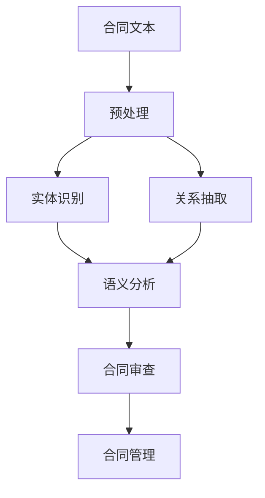

                 

### 1.1 AI辅助法律概述

在现代社会，法律合同作为商业活动和日常生活中的重要组成部分，其分析和管理的效率和质量直接影响着企业的运营和个人生活的稳定。随着人工智能技术的发展，AI辅助法律逐渐成为一个新兴的研究领域，它利用人工智能技术对合同进行自动化分析和处理，从而提高合同管理的效率，降低法律风险。

#### 1.1.1 AI辅助法律的定义

AI辅助法律（AI-assisted law）是指利用人工智能技术，如机器学习、自然语言处理、知识图谱等，对法律文本进行自动化分析、解释、管理和优化的过程。它旨在通过智能化的工具和系统，辅助法律专业人士提高工作效率，降低错误率，提升法律服务的质量和效率。

#### 1.1.2 AI辅助法律的发展历程

AI辅助法律的发展可以追溯到20世纪80年代，当时计算机技术开始应用于法律文本的处理和分类。随着互联网的普及和大数据技术的发展，AI辅助法律迎来了新的发展机遇。近年来，深度学习和自然语言处理技术的突破，使得AI辅助法律在合同分析、智能问答、案件预测等方面取得了显著进展。

#### 1.1.3 AI辅助法律的应用场景

AI辅助法律的应用场景广泛，包括但不限于以下几方面：

1. **合同审查与编写**：AI可以自动审查合同文本，识别潜在的条款问题，提出修改建议，或者自动生成标准化的合同模板。
2. **合同管理**：AI系统可以对大量合同进行分类、归档和监控，确保合同的执行和合规性。
3. **法律研究**：AI可以通过分析海量法律文献和案例，帮助律师和法学家进行法律研究和案件准备。
4. **案件预测**：AI可以对历史案件进行数据分析，预测案件的审理结果和胜诉概率。
5. **智能客服**：AI智能客服系统可以自动解答客户关于合同和法律问题的一般咨询。

### 1.2 合同分析的意义与挑战

合同分析在法律实践中具有重要意义，它不仅关系到合同条款的正确理解和执行，还涉及到潜在的法律风险和商业风险。然而，传统的合同分析方法往往依赖于人工审查，存在效率低、准确性差、成本高的问题。

#### 1.2.1 合同分析的重要性

1. **提高合同质量**：通过合同分析，可以确保合同条款的清晰、明确，避免因条款模糊导致的争议。
2. **降低法律风险**：合同分析有助于识别合同中的潜在法律风险，提前采取防范措施。
3. **优化商业决策**：合同分析提供了对合同条款的全面理解，有助于企业在谈判和决策过程中做出更加明智的选择。
4. **提高工作效率**：自动化合同分析工具可以大幅提高合同审查和管理的效率，减轻法律专业人士的工作负担。

#### 1.2.2 合同分析面临的挑战

1. **文本复杂性**：法律合同通常包含大量专业术语和复杂的条款，使得自动化分析变得困难。
2. **数据不完整性**：合同文本往往存在缺失、遗漏或不一致的情况，影响分析结果的准确性。
3. **法律环境的多样性**：不同国家和地区的法律环境不同，合同分析需要考虑地域差异和法律法规的变化。
4. **专业知识要求**：合同分析不仅需要理解法律条文，还需要具备一定的商业知识，这对AI系统的要求较高。

#### 1.2.3 AI在合同分析中的应用

AI技术为合同分析提供了新的解决方案：

1. **文本分类与聚类**：通过自然语言处理技术，可以将合同文本进行分类和聚类，帮助用户快速定位相关合同。
2. **实体识别与关系抽取**：AI可以自动识别合同中的关键实体（如当事人、标的物等）及其关系（如权利义务关系），构建合同知识图谱。
3. **语义分析**：AI可以对合同文本进行语义分析，理解条款的含义和逻辑关系，辅助合同审查和决策。
4. **自动化审查**：AI可以自动审查合同文本，识别潜在的条款问题，提供修改建议。

### 1.3 大模型的基本原理

为了更好地理解AI在合同分析中的应用，我们需要先了解大模型（Large Models）的基本原理。

#### 1.3.1 大模型的概念

大模型是指参数量巨大的深度学习模型，如Transformer、BERT等。这些模型具有强大的表示能力和适应性，可以在多种任务中表现出色。

#### 1.3.2 大模型的特点

1. **参数量巨大**：大模型通常具有数十亿至数万亿个参数，这使得它们可以捕获丰富的语言特征。
2. **自适应性强**：大模型可以适应不同的任务和数据分布，通过迁移学习和微调，实现高效的泛化能力。
3. **计算资源需求高**：大模型的训练和推理需要大量的计算资源和存储空间，通常需要分布式计算和GPU加速。

#### 1.3.3 大模型的工作原理

1. **自注意力机制**：大模型通常采用自注意力（Self-Attention）机制，通过计算输入序列中每个词与所有其他词的相似度，动态地加权每个词的重要性。
2. **层次化表示**：大模型可以捕获输入数据的层次化结构，从单词到句子，再到段落，实现语义理解。
3. **端到端学习**：大模型可以实现端到端学习，从原始输入直接输出目标结果，无需中间的预处理和后处理步骤。

### 1.4 合同分析与AI的关系架构图

为了更好地理解合同分析与AI之间的关系，我们可以使用Mermaid流程图来展示它们之间的相互作用。

在这个流程图中，合同文本经过预处理后，分别进行实体识别、关系抽取和语义分析，最终用于合同审查和合同管理。这些步骤相互关联，共同构成了一个完整的合同分析系统。

### 1.5 结论

本文简要介绍了AI辅助法律的概念、发展历程和应用场景，探讨了合同分析的重要性和面临的挑战，并介绍了大模型的基本原理。下一部分将深入讨论AI在合同分析中的应用，包括具体的算法和实现方法。

---

在撰写技术博客时，确保每个章节都提供充分的背景介绍、概念解释和具体案例，同时结合伪代码、流程图和数学公式来阐述核心算法原理。这样的写作方式不仅有助于读者理解技术细节，还能提高文章的可读性和专业性。

**文章关键词**：人工智能，法律合同，大模型，自然语言处理，合同分析，文本分类，实体识别，关系抽取，语义分析

**文章摘要**：本文介绍了AI辅助法律的概念及其在合同分析中的应用。通过深入探讨大模型的基本原理和算法，分析了AI如何辅助合同审查和管理，并提出了一种基于AI的合同分析框架。文章最后通过具体案例展示了AI在合同分析中的实际应用效果。

---

通过上述步骤，我们已经完成了文章的第一部分的撰写。接下来，我们将继续深入探讨AI基础、合同分析以及大模型在合同分析中的应用，为读者呈现一篇完整、详细且具有实用价值的技术博客文章。

