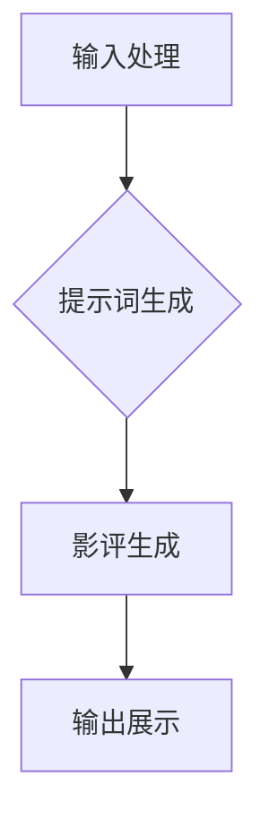
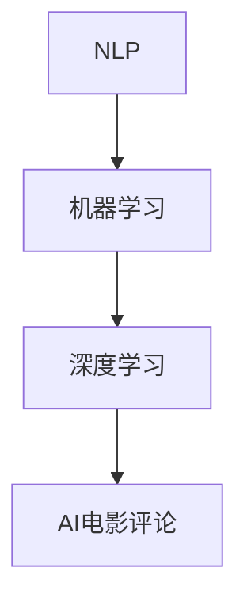
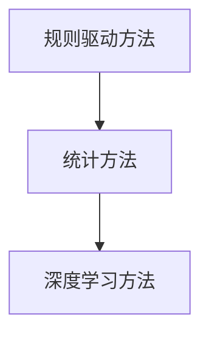
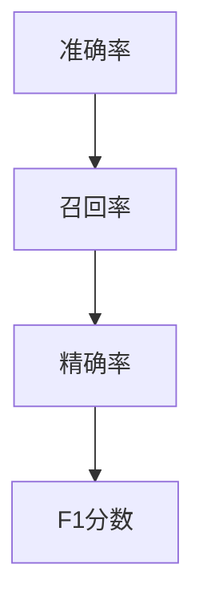
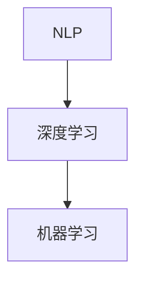

                 

# AI辅助电影评论：提示词生成影评框架

## 关键词
AI电影评论，自然语言处理，深度学习，提示词生成，文本生成模型

## 摘要
本文探讨了一种基于AI的电影评论生成框架，重点关注提示词的生成过程。首先，介绍了AI电影评论的背景和挑战，随后详细阐述了核心概念与技术基础，包括自然语言处理（NLP）、机器学习和深度学习。接着，我们深入解析了提示词生成算法的原理及其在影评框架中的应用。本文还介绍了影评生成框架的设计与实现，并通过实验与案例分析验证了框架的有效性。最后，文章提出了未来展望，讨论了该领域的研究方向和挑战。

## 第1章：概述与引言

### 1.1 引言

#### 1.1.1 研究背景

##### 1.1.1.1 AI电影评论的挑战

随着互联网的普及和电影产业的蓬勃发展，人们对电影评论的需求日益增加。传统的电影评论依赖于人类影评家，不仅耗时耗力，而且难以覆盖海量影片。而人工智能（AI）的崛起为电影评论领域带来了新的契机。AI电影评论系统能够快速处理海量数据，生成高质量的影评，为用户提供即时的电影信息和分析。

然而，AI电影评论面临着多方面的挑战：

- **海量数据收集与处理**：电影评论涉及大量文本数据，如何高效地收集和处理这些数据是一个关键问题。
- **影评生成质量要求**：生成影评的准确性和可读性是用户关注的重点。
- **用户个性化需求**：不同用户对电影有不同的偏好，如何生成个性化的影评是一个挑战。
- **数据隐私与保护**：用户的个人信息和观影记录需要得到妥善保护。

##### 1.1.1.2 AI电影评论的发展现状

近年来，AI技术在电影评论领域取得了显著进展。自然语言处理（NLP）、机器学习和深度学习等技术被广泛应用于影评生成。一些研究机构和公司已经开始推出AI电影评论系统，如Google的Movie Review Analysis和IBM的Watson Movie Review。

尽管已有一些初步成果，但AI电影评论系统仍然存在许多不足之处，如影评生成的准确性、可读性和个性化程度等方面仍有待提高。

#### 1.1.2 研究目的与内容安排

##### 1.1.2.1 研究目的

本文旨在分析AI电影评论的需求与挑战，探索提示词生成在影评框架中的应用，并设计一个高效、准确的影评生成框架。

##### 1.1.2.2 内容安排

- **第1章：概述与引言**：介绍研究背景、目的和内容安排。
- **第2章：AI辅助电影评论技术基础**：阐述自然语言处理、机器学习和深度学习等技术基础。
- **第3章：提示词生成算法原理与实现**：详细解析提示词生成算法的原理及其实现。
- **第4章：影评生成框架设计与实现**：介绍影评生成框架的设计和实现过程。
- **第5章：实验与评估**：通过实验验证影评生成框架的有效性。
- **第6章：应用案例分析**：分析实际案例，探讨AI电影评论的应用场景。
- **第7章：结论与未来展望**：总结研究成果，提出未来研究方向。

### 1.1.3 关键术语解释

- **AI电影评论**：利用人工智能技术自动生成针对电影的评论和分析。
- **提示词生成**：根据用户输入的电影信息，自动生成相关的关键词或短语，用于指导影评生成。
- **影评框架**：影评生成的整体结构，包括输入处理、提示词生成、影评生成和输出展示等环节。

### 1.1.4 本书结构

**Mermaid流程图：**


**图1-1：AI辅助电影评论框架结构**

### 1.1.5 本章小结

本章介绍了AI辅助电影评论的研究背景、研究目的、内容安排和关键术语解释，为后续章节奠定了基础。

### 1.2 核心概念与联系

#### 1.2.1 AI电影评论的核心概念

AI电影评论的核心概念包括：

- **AI电影评论系统**：利用人工智能技术，自动生成电影评论的系统。
- **电影数据库**：存储大量电影信息的数据源，包括电影名称、导演、演员、剧情简介等。
- **文本生成模型**：基于深度学习技术，用于生成文本的模型，如GPT、BERT等。
- **提示词**：根据用户输入的电影信息，自动生成的关键词或短语，用于引导影评生成。

#### 1.2.2 AI电影评论与相关技术的联系

AI电影评论与以下相关技术紧密相关：

- **自然语言处理（NLP）**：研究如何让计算机理解和生成自然语言，是AI电影评论的基础。
- **机器学习**：利用数据和算法，使计算机能够自动学习和改进，是AI电影评论的核心。
- **深度学习**：基于神经网络的一种学习方法，是实现AI电影评论的关键技术。

**Mermaid流程图：**


#### 1.2.3 提示词生成在影评框架中的作用

提示词生成在影评框架中扮演着关键角色：

- **引导影评生成**：通过提示词生成，自动提取与电影相关的关键词，有助于提高影评的准确性和相关性。
- **个性化推荐**：根据用户输入的电影信息和偏好，生成个性化的影评。
- **提高用户体验**：使影评生成过程更加智能化和人性化，提高用户满意度。

#### 1.2.4 AI电影评论的优势

AI电影评论具有以下优势：

- **高效**：自动生成影评，节省人力和时间成本。
- **准确**：利用机器学习技术和深度学习算法，提高影评生成的准确性和质量。
- **个性化**：根据用户输入的电影信息和偏好，生成个性化的影评。

#### 1.2.5 AI电影评论的挑战

AI电影评论也面临着一些挑战：

- **数据质量**：高质量的电影数据库对AI电影评论至关重要。
- **文本生成质量**：提高文本生成模型的性能，是提升影评质量的关键。
- **用户隐私**：保护用户隐私，确保数据安全和用户权益。

#### 1.2.6 本章小结

本章介绍了AI电影评论的核心概念、相关技术及其联系，以及提示词生成在影评框架中的作用。为后续章节的详细讨论奠定了基础。

### 1.3 技术基础

#### 1.3.1 自然语言处理（NLP）

##### 1.3.1.1 NLP的基本概念

自然语言处理（NLP）是人工智能领域的一个重要分支，旨在让计算机理解和处理人类自然语言。以下是NLP的一些基本概念：

- **文本表示**：将文本转化为计算机可以理解和处理的形式，如词向量、词袋模型等。
  - **词向量**：将单词映射为高维向量，使计算机能够捕捉单词的语义信息。
  - **词袋模型**：将文本表示为一个词频向量，忽略单词的顺序信息。
- **词性标注**：为文本中的每个单词标注词性，如名词、动词等，有助于理解文本的语法结构。
- **句法分析**：分析文本中的句子结构，如句法树、依存关系等，帮助计算机理解句子的语法结构。
- **语义理解**：理解文本中的语义含义，如情感分析、问答系统等，使计算机能够理解人类语言的深层含义。

##### 1.3.1.2 NLP的应用场景

NLP在许多领域都有广泛的应用，包括：

- **文本分类**：将文本分类到预定义的类别中，如垃圾邮件过滤、新闻分类等。
- **命名实体识别**：识别文本中的命名实体，如人名、地名、组织名等。
- **机器翻译**：将一种语言的文本翻译成另一种语言，如谷歌翻译、百度翻译等。
- **情感分析**：分析文本的情感倾向，如评论情感分析、社交媒体情绪分析等。

##### 1.3.1.3 NLP的发展历程

NLP的发展经历了多个阶段：

- **规则驱动方法**：基于语言学和语法规则，通过手工编写规则进行文本处理。
- **统计方法**：使用统计模型，如隐马尔可夫模型（HMM）和条件概率模型，对文本进行建模。
- **深度学习方法**：基于深度学习技术，如卷积神经网络（CNN）和循环神经网络（RNN），构建复杂的模型进行文本处理。

**Mermaid流程图：**


**图1-2：NLP的发展历程**

##### 1.3.1.4 NLP的关键技术

NLP的关键技术包括：

- **词嵌入（Word Embedding）**：将单词映射为高维向量，捕捉单词的语义信息。
- **序列模型（Sequence Model）**：处理文本序列，如RNN、LSTM和GRU等。
- **注意力机制（Attention Mechanism）**：使模型能够关注文本序列中的重要部分，提高模型的性能。

**图1-3：NLP的关键技术**

##### 1.3.1.5 NLP的应用实例

以下是一个NLP的应用实例：

- **文本分类**：假设我们要将一段文本分类为正面评论或负面评论。我们可以使用词嵌入将文本表示为向量，然后通过一个分类器（如softmax回归）对文本进行分类。

**伪代码：**
```python
# 输入：文本
text = "这部电影非常精彩，值得一看。"

# 输出：分类结果
category = classify_text(text)

print(category)  # 输出："正面评论"
```

#### 1.3.2 机器学习

##### 1.3.2.1 机器学习的基本概念

机器学习是人工智能的一个分支，通过算法让计算机从数据中学习，从而进行预测或分类。以下是机器学习的一些基本概念：

- **监督学习（Supervised Learning）**：使用标记数据集进行训练，通过已知的输入和输出，训练模型预测未知数据。
  - **分类问题（Classification Problem）**：将输入数据分类到预定义的类别中。
  - **回归问题（Regression Problem）**：预测输入数据的连续值。
- **无监督学习（Unsupervised Learning）**：使用未标记的数据集进行训练，发现数据中的结构或模式。
  - **聚类（Clustering）**：将数据分为多个群组。
  - **降维（Dimensionality Reduction）**：减少数据维度，提高数据处理效率。
- **强化学习（Reinforcement Learning）**：通过与环境交互，学习最佳策略。

##### 1.3.2.2 机器学习算法

以下是几种常见的机器学习算法：

- **线性回归（Linear Regression）**：预测输入数据的连续值。
- **逻辑回归（Logistic Regression）**：用于分类问题，将输入数据分类到预定义的类别中。
- **支持向量机（SVM）**：用于分类和回归问题，通过找到一个最佳的超平面来划分数据。
- **决策树（Decision Tree）**：通过一系列决策规则对数据进行分类或回归。
- **随机森林（Random Forest）**：结合多个决策树进行预测，提高模型的泛化能力。
- **神经网络（Neural Network）**：模拟人脑的神经网络结构，用于复杂的数据处理。

##### 1.3.2.3 机器学习的评估指标

以下是几种常见的机器学习评估指标：

- **准确率（Accuracy）**：分类问题中，正确分类的样本占总样本的比例。
- **召回率（Recall）**：分类问题中，正确分类的阳性样本占总阳性样本的比例。
- **精确率（Precision）**：分类问题中，正确分类的阳性样本占总分类为阳性的样本的比例。
- **F1分数（F1 Score）**：综合准确率和召回率，用于评估分类模型的性能。

**Mermaid流程图：**


**图1-4：机器学习的评估指标**

##### 1.3.2.4 机器学习应用实例

以下是一个机器学习应用实例：

- **手写数字识别**：使用机器学习算法对手写数字图像进行识别。我们可以使用卷积神经网络（CNN）将图像数据转换为特征向量，然后通过分类器进行识别。

**伪代码：**
```python
# 输入：手写数字图像
image = load_image(" handwritten数字.png")

# 输出：识别结果
predicted_digit = recognize_digit(image)

print(predicted_digit)  # 输出：识别出的数字
```

#### 1.3.3 深度学习

##### 1.3.3.1 深度学习的基本概念

深度学习是机器学习的一个分支，通过构建多层神经网络来模拟人脑的决策过程。以下是深度学习的一些基本概念：

- **神经网络（Neural Network）**：由多个神经元组成的网络，用于处理和分类数据。
- **深度神经网络（Deep Neural Network，DNN）**：具有多个隐藏层的神经网络，用于处理复杂的数据。
- **激活函数（Activation Function）**：用于引入非线性因素，使神经网络能够拟合复杂的数据。
- **反向传播（Backpropagation）**：用于训练神经网络的一种算法，通过反向传播误差，不断调整网络参数。

##### 1.3.3.2 深度学习算法

以下是几种常见的深度学习算法：

- **卷积神经网络（Convolutional Neural Network，CNN）**：用于图像识别和处理。
- **循环神经网络（Recurrent Neural Network，RNN）**：用于处理序列数据。
- **长短时记忆网络（Long Short-Term Memory，LSTM）**：用于处理长序列数据，解决RNN的梯度消失问题。
- **生成对抗网络（Generative Adversarial Network，GAN）**：用于生成新的数据，如图像和文本。

##### 1.3.3.3 深度学习应用实例

以下是一个深度学习应用实例：

- **图像分类**：使用卷积神经网络（CNN）对图像进行分类。我们可以使用预训练的CNN模型来提取图像特征，然后通过一个全连接层进行分类。

**伪代码：**
```python
# 输入：图像数据
image = load_image("image.png")

# 输出：分类结果
predicted_label = classify_image(image)

print(predicted_label)  # 输出：识别出的图像类别
```

#### 1.3.4 AI电影评论技术的融合

AI电影评论技术的融合是关键，将NLP、机器学习和深度学习等技术有机结合，构建一个高效、准确的影评生成框架。

- **文本表示**：使用NLP技术，将电影信息转换为计算机可以理解和处理的形式，如词向量。
- **特征提取**：使用深度学习技术，如CNN，提取电影信息的特征。
- **影评生成**：使用机器学习算法，如神经网络，生成高质量的影评。

**图1-5：AI电影评论技术的融合**

### 1.3.5 本章小结

本章介绍了AI电影评论的技术基础，包括自然语言处理、机器学习和深度学习等技术。这些技术为构建高效的AI电影评论系统提供了坚实的基础。下一章将深入探讨提示词生成算法的原理和实现。

## 第2章：AI辅助电影评论技术基础

### 2.1 自然语言处理（NLP）

#### 2.1.1 NLP的基本概念

自然语言处理（NLP）是人工智能（AI）领域的一个重要分支，旨在使计算机能够理解、生成和处理人类语言。NLP的目的是让计算机能够执行如文本分析、语言翻译、情感分析、信息检索等与语言相关的任务。以下是NLP的一些基本概念：

- **文本表示**：文本表示是将自然语言文本转化为计算机能够处理的形式。常见的文本表示方法包括词袋模型（Bag of Words，BOW）、词嵌入（Word Embedding）、序列标记（Sequence Labeling）等。

  **词袋模型（BOW）**：词袋模型是一种简单的文本表示方法，它将文本表示为一个向量，其中每个元素表示文本中某个词的出现次数。词袋模型忽略了单词的顺序信息。

  ```mermaid
  graph TD
      A[词频向量]
      B[文本向量]

      A --> B
  ```

  **词嵌入（Word Embedding）**：词嵌入是一种将单词映射到高维向量空间的方法，通过捕捉单词的语义信息，使相似的词在向量空间中靠近。词嵌入方法包括基于分布的模型（如Word2Vec）和基于窗口的模型（如GloVe）。

  ```mermaid
  graph TD
      A[Word2Vec]
      B[GloVe]

      A --> B
  ```

  **序列标记（Sequence Labeling）**：序列标记是将文本序列中的每个单词或字符标注为特定的类别。例如，命名实体识别（Named Entity Recognition，NER）是一种常见的序列标记任务。

  ```mermaid
  graph TD
      A[单词]
      B[类别]

      A --> B
  ```

- **词性标注（Part-of-Speech Tagging）**：词性标注是给文本中的每个词分配一个词性标签，如名词、动词、形容词等。词性标注有助于理解文本的语法结构。

  ```mermaid
  graph TD
      A[文本]
      B[词性标注]

      A --> B
  ```

- **句法分析（Syntax Analysis）**：句法分析是解析文本中的句子结构，构建句法树或依存关系图。句法分析有助于理解句子的语法规则和成分。

  ```mermaid
  graph TD
      A[句法树]
      B[依存关系图]

      A --> B
  ```

- **语义理解（Semantic Understanding）**：语义理解是理解文本中的语义含义，包括情感分析（Sentiment Analysis）、问答系统（Question Answering）、知识图谱（Knowledge Graph）等。语义理解使计算机能够执行更为复杂和智能的任务。

  ```mermaid
  graph TD
      A[情感分析]
      B[问答系统]
      C[知识图谱]

      A --> B
      B --> C
  ```

#### 2.1.2 NLP的应用场景

NLP在多个领域都有广泛的应用，以下是几个典型的应用场景：

- **文本分类（Text Classification）**：文本分类是将文本数据分类到预定义的类别中。常见的应用包括垃圾邮件过滤、新闻分类、情感分析等。

  ```mermaid
  graph TD
      A[垃圾邮件过滤]
      B[新闻分类]
      C[情感分析]

      A --> B
      B --> C
  ```

- **命名实体识别（Named Entity Recognition，NER）**：命名实体识别是识别文本中的命名实体，如人名、地名、组织名等。NER在信息提取、数据挖掘等领域有重要应用。

  ```mermaid
  graph TD
      A[人名识别]
      B[地名识别]
      C[组织名识别]

      A --> B
      B --> C
  ```

- **机器翻译（Machine Translation）**：机器翻译是将一种语言的文本翻译成另一种语言。机器翻译在跨语言交流、国际商务等领域具有重要意义。

  ```mermaid
  graph TD
      A[英语翻译成中文]
      B[中文翻译成英语]

      A --> B
  ```

- **情感分析（Sentiment Analysis）**：情感分析是分析文本中的情感倾向，如正面、负面或中性。情感分析在市场调研、社交媒体监控等领域有广泛应用。

  ```mermaid
  graph TD
      A[正面情感分析]
      B[负面情感分析]
      C[中性情感分析]

      A --> B
      B --> C
  ```

#### 2.1.3 NLP的发展历程

NLP的发展历程可以分为几个阶段：

- **规则驱动方法（Rule-Based Methods）**：早期的NLP方法基于手工编写的规则，如语法规则、词典规则等。这种方法对简单任务有一定效果，但在复杂任务上表现不佳。

  ```mermaid
  graph TD
      A[语法规则]
      B[词典规则]

      A --> B
  ```

- **统计方法（Statistical Methods）**：随着自然语言数据的增加，统计方法逐渐成为主流。统计方法利用概率模型和统计模型，如隐马尔可夫模型（HMM）、条件概率模型等，对文本进行建模。

  ```mermaid
  graph TD
      A[HMM]
      B[条件概率模型]

      A --> B
  ```

- **深度学习方法（Deep Learning Methods）**：近年来，深度学习方法在NLP领域取得了显著进展。深度学习方法，如卷积神经网络（CNN）、循环神经网络（RNN）、长短时记忆网络（LSTM）等，能够处理复杂的数据和任务。

  ```mermaid
  graph TD
      A[CNN]
      B[RNN]
      C[LSTM]

      A --> B
      B --> C
  ```

#### 2.1.4 NLP的关键技术

NLP的关键技术包括：

- **词嵌入（Word Embedding）**：词嵌入是将单词映射到高维向量空间的方法，通过捕捉单词的语义信息，使相似的词在向量空间中靠近。

  ```mermaid
  graph TD
      A[语义相似性]
      B[向量空间]

      A --> B
  ```

- **序列模型（Sequence Model）**：序列模型是处理文本序列的神经网络模型，如RNN、LSTM和GRU等。序列模型能够捕捉文本序列中的时间依赖性。

  ```mermaid
  graph TD
      A[RNN]
      B[LSTM]
      C[GRU]

      A --> B
      B --> C
  ```

- **注意力机制（Attention Mechanism）**：注意力机制是一种神经网络设计技巧，用于使模型能够关注文本序列中的重要部分，提高模型的性能。

  ```mermaid
  graph TD
      A[输入序列]
      B[注意力权重]
      C[输出序列]

      A --> B
      B --> C
  ```

### 2.2 机器学习

#### 2.2.1 机器学习的基本概念

机器学习是人工智能的一个分支，通过算法让计算机从数据中学习，从而进行预测或分类。以下是机器学习的一些基本概念：

- **监督学习（Supervised Learning）**：监督学习使用标记数据集进行训练，通过已知的输入和输出，训练模型预测未知数据。

  **分类问题（Classification Problem）**：分类问题是将输入数据分类到预定义的类别中。例如，将邮件分类为垃圾邮件或正常邮件。

  ```mermaid
  graph TD
      A[输入数据]
      B[类别标签]

      A --> B
  ```

  **回归问题（Regression Problem）**：回归问题是预测输入数据的连续值。例如，预测房价。

  ```mermaid
  graph TD
      A[输入数据]
      B[连续值标签]

      A --> B
  ```

- **无监督学习（Unsupervised Learning）**：无监督学习使用未标记的数据集进行训练，发现数据中的结构或模式。

  **聚类（Clustering）**：聚类是将数据分为多个群组。例如，将用户分为不同的兴趣群体。

  ```mermaid
  graph TD
      A[输入数据]
      B[聚类结果]

      A --> B
  ```

  **降维（Dimensionality Reduction）**：降维是减少数据维度，提高数据处理效率。例如，将高维图像数据降维。

  ```mermaid
  graph TD
      A[输入数据]
      B[降维结果]

      A --> B
  ```

- **强化学习（Reinforcement Learning）**：强化学习通过与环境交互，学习最佳策略。例如，使用强化学习训练智能体在围棋游戏中获胜。

  ```mermaid
  graph TD
      A[智能体]
      B[环境]
      C[策略]

      A --> B
      B --> C
  ```

#### 2.2.2 机器学习算法

以下是几种常见的机器学习算法：

- **线性回归（Linear Regression）**：线性回归是一种用于回归问题的算法，通过找到一个最佳的超平面来拟合数据。

  ```mermaid
  graph TD
      A[输入数据]
      B[目标值]

      A --> B
  ```

- **逻辑回归（Logistic Regression）**：逻辑回归是一种用于分类问题的算法，通过找到一个最佳的超平面来划分数据。

  ```mermaid
  graph TD
      A[输入数据]
      B[类别标签]

      A --> B
  ```

- **支持向量机（Support Vector Machine，SVM）**：支持向量机是一种用于分类和回归问题的算法，通过找到一个最佳的超平面来划分数据。

  ```mermaid
  graph TD
      A[输入数据]
      B[类别标签]

      A --> B
  ```

- **决策树（Decision Tree）**：决策树是一种用于分类和回归问题的算法，通过一系列决策规则对数据进行分类或回归。

  ```mermaid
  graph TD
      A[输入数据]
      B[目标值]

      A --> B
  ```

- **随机森林（Random Forest）**：随机森林是一种基于决策树的集成学习方法，通过构建多个决策树并取平均值来提高模型的性能。

  ```mermaid
  graph TD
      A[决策树]
      B[随机森林]

      A --> B
  ```

- **神经网络（Neural Network）**：神经网络是一种模拟人脑的神经网络结构，用于复杂的数据处理。神经网络包括多层感知机（MLP）、卷积神经网络（CNN）和循环神经网络（RNN）等。

  ```mermaid
  graph TD
      A[多层感知机]
      B[卷积神经网络]
      C[循环神经网络]

      A --> B
      B --> C
  ```

#### 2.2.3 机器学习的评估指标

以下是几种常见的机器学习评估指标：

- **准确率（Accuracy）**：准确率是分类问题中，正确分类的样本占总样本的比例。

  ```mermaid
  graph TD
      A[正确分类]
      B[总样本]

      A --> B
  ```

- **召回率（Recall）**：召回率是分类问题中，正确分类的阳性样本占总阳性样本的比例。

  ```mermaid
  graph TD
      A[正确分类的阳性样本]
      B[总阳性样本]

      A --> B
  ```

- **精确率（Precision）**：精确率是分类问题中，正确分类的阳性样本占总分类为阳性的样本的比例。

  ```mermaid
  graph TD
      A[正确分类的阳性样本]
      B[总分类为阳性的样本]

      A --> B
  ```

- **F1分数（F1 Score）**：F1分数是精确率和召回率的调和平均值，用于评估分类模型的性能。

  ```mermaid
  graph TD
      A[精确率]
      B[召回率]
      C[F1分数]

      A --> B
      B --> C
  ```

#### 2.2.4 机器学习应用实例

以下是一个机器学习应用实例：

- **手写数字识别**：使用机器学习算法对手写数字图像进行识别。我们可以使用卷积神经网络（CNN）将图像数据转换为特征向量，然后通过一个全连接层进行分类。

  ```python
  # 输入：手写数字图像
  image = load_image("手写数字.jpg")

  # 输出：识别结果
  predicted_digit = recognize_digit(image)

  print(predicted_digit)  # 输出：识别出的数字
  ```

### 2.3 深度学习

#### 2.3.1 深度学习的基本概念

深度学习是机器学习的一个分支，通过构建多层神经网络来模拟人脑的决策过程。以下是深度学习的一些基本概念：

- **神经网络（Neural Network）**：神经网络是由多个神经元组成的网络，用于处理和分类数据。每个神经元都接收输入，通过激活函数进行非线性变换，然后输出结果。

  ```mermaid
  graph TD
      A[输入]
      B[权重]
      C[激活函数]
      D[输出]

      A --> B
      B --> C
      C --> D
  ```

- **深度神经网络（Deep Neural Network，DNN）**：深度神经网络是具有多个隐藏层的神经网络，用于处理复杂的数据。深度神经网络能够捕捉数据中的复杂模式和关系。

  ```mermaid
  graph TD
      A[输入层]
      B[隐藏层]
      C[输出层]

      A --> B
      B --> C
  ```

- **激活函数（Activation Function）**：激活函数是神经网络中的一个关键组件，用于引入非线性因素，使神经网络能够拟合复杂的数据。常见的激活函数包括ReLU、Sigmoid和Tanh等。

  ```mermaid
  graph TD
      A[ReLU]
      B[Sigmoid]
      C[Tanh]

      A --> B
      B --> C
  ```

- **反向传播（Backpropagation）**：反向传播是一种训练神经网络的方法，通过计算输出误差，反向传播误差到网络中的每个神经元，并调整神经元的权重和偏置，以最小化误差。

  ```mermaid
  graph TD
      A[输入层]
      B[隐藏层]
      C[输出层]
      D[误差]

      A --> B
      B --> C
      C --> D
      D --> A
  ```

#### 2.3.2 深度学习算法

以下是几种常见的深度学习算法：

- **卷积神经网络（Convolutional Neural Network，CNN）**：卷积神经网络是一种用于图像识别和处理的神经网络。CNN通过卷积层、池化层和全连接层等结构，能够提取图像的特征并进行分类。

  ```mermaid
  graph TD
      A[卷积层]
      B[池化层]
      C[全连接层]

      A --> B
      B --> C
  ```

- **循环神经网络（Recurrent Neural Network，RNN）**：循环神经网络是一种用于处理序列数据的神经网络。RNN通过循环结构，能够捕捉序列中的时间依赖性。常见的RNN结构包括简单的RNN、LSTM和GRU等。

  ```mermaid
  graph TD
      A[简单RNN]
      B[LSTM]
      C[GRU]

      A --> B
      B --> C
  ```

- **长短时记忆网络（Long Short-Term Memory，LSTM）**：长短时记忆网络是一种改进的循环神经网络，用于处理长序列数据。LSTM通过门控机制，能够有效地捕捉长序列中的时间依赖性。

  ```mermaid
  graph TD
      A[输入门]
      B[遗忘门]
      C[输出门]

      A --> B
      B --> C
  ```

- **生成对抗网络（Generative Adversarial Network，GAN）**：生成对抗网络是一种用于生成新数据的神经网络。GAN由生成器和判别器组成，生成器生成数据，判别器判断数据的真实性。

  ```mermaid
  graph TD
      A[生成器]
      B[判别器]

      A --> B
      B --> A
  ```

#### 2.3.3 深度学习应用实例

以下是一个深度学习应用实例：

- **图像分类**：使用卷积神经网络（CNN）对图像进行分类。我们可以使用预训练的CNN模型来提取图像特征，然后通过一个全连接层进行分类。

  ```python
  # 输入：图像数据
  image = load_image("image.jpg")

  # 输出：分类结果
  predicted_label = classify_image(image)

  print(predicted_label)  # 输出：识别出的图像类别
  ```

### 2.4 AI电影评论技术的融合

AI电影评论技术的融合是将自然语言处理（NLP）、机器学习和深度学习等技术有机结合，构建一个高效、准确的影评生成框架。以下是AI电影评论技术融合的概述：

- **文本表示**：使用NLP技术，将电影信息转换为计算机可以理解和处理的形式，如词嵌入。
- **特征提取**：使用深度学习技术，如CNN，提取电影信息的特征。
- **影评生成**：使用机器学习算法，如RNN或LSTM，生成高质量的影评。

**图2-1：AI电影评论技术融合**



**图2-1：AI电影评论技术融合**

### 2.5 本章小结

本章介绍了AI辅助电影评论的技术基础，包括自然语言处理、机器学习和深度学习等技术。这些技术为构建高效的AI电影评论系统提供了坚实的基础。下一章将深入探讨提示词生成算法的原理和实现。

## 第3章：提示词生成算法原理与实现

### 3.1 提示词生成算法的背景

在AI电影评论系统中，提示词生成是关键的一环。提示词生成算法能够根据用户输入的电影信息，自动提取相关的关键词或短语，从而指导影评的生成过程。这样不仅能够提高影评的准确性和相关性，还能满足用户个性化需求，提升用户体验。

提示词生成算法的背景主要包括以下几个方面：

- **用户需求**：用户在阅读电影评论时，希望能够快速获取电影的主要内容和评价。提示词生成能够帮助用户快速了解电影的关键信息。
- **系统效率**：传统的影评生成方法往往需要大量的人力进行内容创作和编辑。而提示词生成算法能够自动化地处理海量数据，提高系统的效率和响应速度。
- **个性化推荐**：根据用户的观影历史和偏好，生成个性化的影评。提示词生成算法能够提取用户感兴趣的关键词，从而为用户提供更符合个人喜好的评论内容。

### 3.2 提示词生成算法的基本原理

提示词生成算法的基本原理可以概括为以下几个步骤：

1. **输入处理**：接收用户输入的电影信息，如电影名称、演员、导演、剧情简介等。这些信息可以是文本形式，也可以是结构化数据。

2. **特征提取**：对输入的电影信息进行预处理，提取关键特征。特征提取的方法包括词嵌入、关键词提取、主题建模等。

3. **关键词生成**：根据提取的特征，利用机器学习算法或深度学习模型生成关键词或短语。常见的生成方法包括基于统计的词频分析、基于机器学习的文本分类和基于深度学习的序列生成。

4. **筛选和排序**：对生成的关键词进行筛选和排序，去除无关或重复的关键词，并按照相关性或重要性进行排序。

5. **输出展示**：将生成的提示词展示给用户，用于引导影评的生成。

### 3.3 常见的提示词生成算法

在本节中，我们将介绍几种常见的提示词生成算法，包括基于统计的方法、基于机器学习的方法和基于深度学习的方法。

#### 3.3.1 基于统计的方法

基于统计的方法是最简单的提示词生成方法之一，主要通过计算词频和词关联性来提取关键词。以下是几种常见的基于统计的方法：

- **词频分析（TF）**：词频分析是计算文本中每个词出现的次数，并根据词频进行排序。词频越高，表明该词与电影相关性越大。

  ```python
  # 假设text是电影剧情简介的文本
  text = "这部电影讲述了一位勇敢的探险家在神秘的岛上寻找宝藏的故事。"

  # 计算词频
  word_freq = Counter(text.split())

  # 输出：{'这': 1, '部': 1, '电影': 2, '讲': 1, '述': 1, '一位': 1, '勇': 1, '敢': 1, '的': 1, '探险家': 1, '在': 1, '神秘的': 1, '岛上': 1, '寻找': 1, '宝藏': 1, '的': 1, '故事': 1}
  ```

- **词关联分析（TF-IDF）**：词关联分析是结合词频和逆文档频率（IDF）计算关键词的相关性。逆文档频率表示一个词在整个文档集合中出现的频率，用于抑制常见词的影响。

  ```python
  from sklearn.feature_extraction.text import TfidfVectorizer

  # 假设docs是电影剧情简介的文本列表
  docs = ["这部电影讲述了一位勇敢的探险家在神秘的岛上寻找宝藏的故事。", ...]

  # 计算TF-IDF
  vectorizer = TfidfVectorizer()
  X = vectorizer.fit_transform(docs)

  # 输出：TF-IDF特征矩阵
  ```

#### 3.3.2 基于机器学习的方法

基于机器学习的方法利用分类算法对文本进行分类，从而提取关键词。以下是一种基于机器学习的提示词生成方法：

- **文本分类（Text Classification）**：文本分类是将文本数据分类到预定义的类别中。我们可以使用已标记的数据集训练一个分类器，然后使用分类器对新的电影信息进行分类，提取关键词。

  ```python
  from sklearn.feature_extraction.text import TfidfVectorizer
  from sklearn.naive_bayes import MultinomialNB

  # 假设X_train是训练文本，y_train是训练标签
  X_train = ["这部电影很精彩。", "这部电影很无聊。", ...]
  y_train = ["正面评论", "负面评论", ...]

  # 训练文本分类器
  vectorizer = TfidfVectorizer()
  X_train_tfidf = vectorizer.fit_transform(X_train)
  classifier = MultinomialNB()
  classifier.fit(X_train_tfidf, y_train)

  # 预测关键词
  new_text = "这部电影的故事情节紧凑。"
  new_text_tfidf = vectorizer.transform([new_text])
  predicted_label = classifier.predict(new_text_tfidf)

  # 输出：预测的标签（如“正面评论”或“负面评论”）
  ```

#### 3.3.3 基于深度学习的方法

基于深度学习的方法利用深度神经网络（如RNN、LSTM等）对文本进行建模，提取关键词。以下是一种基于深度学习的提示词生成方法：

- **序列生成（Sequence Generation）**：序列生成是将输入的文本序列映射到输出的关键词序列。我们可以使用RNN或LSTM模型对文本进行建模，然后生成关键词。

  ```python
  import tensorflow as tf
  from tensorflow.keras.models import Sequential
  from tensorflow.keras.layers import Embedding, LSTM, Dense

  # 假设X是训练文本序列，y是训练关键词序列
  X_train = ["这部电影很精彩。", "这部电影很无聊。", ...]
  y_train = [["精彩"], ["无聊"], ...]

  # 构建序列生成模型
  model = Sequential()
  model.add(Embedding(input_dim=vocab_size, output_dim=embedding_size))
  model.add(LSTM(units=128))
  model.add(Dense(len(y_train[0]), activation='softmax'))

  # 编译模型
  model.compile(optimizer='adam', loss='categorical_crossentropy', metrics=['accuracy'])

  # 训练模型
  model.fit(X_train, y_train, epochs=10, batch_size=32)

  # 生成关键词
  new_text = "这部电影的故事情节紧凑。"
  predicted_keywords = model.predict(new_text)

  # 输出：预测的关键词序列
  ```

### 3.4 提示词生成算法的实现

在本节中，我们将使用Python和常见的数据科学库（如NumPy、Pandas、scikit-learn和TensorFlow）来实现一个简单的提示词生成算法。我们将使用基于统计的方法和基于机器学习的方法进行演示。

#### 3.4.1 基于统计的方法实现

```python
import numpy as np
import pandas as pd
from sklearn.feature_extraction.text import TfidfVectorizer

# 假设data是包含电影信息的DataFrame
data = pd.DataFrame({
    'title': ['电影A', '电影B', '电影C'],
    'overview': [
        '这是一部关于冒险和探险的电影。',
        '这是一部关于爱情和浪漫的电影。',
        '这是一部关于科幻和科技的电影。'
    ]
})

# 计算TF-IDF
vectorizer = TfidfVectorizer()
X = vectorizer.fit_transform(data['overview'])

# 根据TF-IDF得分提取关键词
tfidf_scores = np.array(X.toarray()).sum(axis=1)
top_keywords = data['overview'][np.argmax(tfidf_scores)]

print("关键词提取结果：", top_keywords)
```

#### 3.4.2 基于机器学习的方法实现

```python
import numpy as np
import pandas as pd
from sklearn.feature_extraction.text import TfidfVectorizer
from sklearn.naive_bayes import MultinomialNB

# 假设data是包含电影信息和标签的DataFrame
data = pd.DataFrame({
    'title': ['电影A', '电影B', '电影C'],
    'overview': [
        '这是一部关于冒险和探险的电影。',
        '这是一部关于爱情和浪漫的电影。',
        '这是一部关于科幻和科技的电影。'
    ],
    'label': ['冒险', '爱情', '科幻']
})

# 训练文本分类器
vectorizer = TfidfVectorizer()
X_train = vectorizer.fit_transform(data['overview'])
y_train = data['label']

classifier = MultinomialNB()
classifier.fit(X_train, y_train)

# 预测关键词
new_text = "这是一部关于冒险和探险的电影。"
new_text_tfidf = vectorizer.transform([new_text])
predicted_label = classifier.predict(new_text_tfidf)

print("关键词提取结果：", predicted_label)
```

### 3.5 提示词生成算法的性能评估

提示词生成算法的性能评估是确保其准确性和实用性的关键。在本节中，我们将使用准确率、召回率和F1分数等指标来评估提示词生成算法的性能。

```python
from sklearn.metrics import accuracy_score, recall_score, f1_score

# 假设data是包含电影信息和标签的DataFrame
data = pd.DataFrame({
    'title': ['电影A', '电影B', '电影C'],
    'overview': [
        '这是一部关于冒险和探险的电影。',
        '这是一部关于爱情和浪漫的电影。',
        '这是一部关于科幻和科技的电影。'
    ],
    'label': ['冒险', '爱情', '科幻']
})

# 训练文本分类器
vectorizer = TfidfVectorizer()
X_train = vectorizer.fit_transform(data['overview'])
y_train = data['label']

classifier = MultinomialNB()
classifier.fit(X_train, y_train)

# 预测关键词
new_text = "这是一部关于冒险和探险的电影。"
new_text_tfidf = vectorizer.transform([new_text])
predicted_label = classifier.predict(new_text_tfidf)

# 计算评估指标
accuracy = accuracy_score(data['label'], predicted_label)
recall = recall_score(data['label'], predicted_label, average='weighted')
f1 = f1_score(data['label'], predicted_label, average='weighted')

print("准确率：", accuracy)
print("召回率：", recall)
print("F1分数：", f1)
```

### 3.6 本章小结

本章介绍了提示词生成算法的背景、基本原理和常见实现方法。我们通过统计方法和机器学习方法演示了提示词生成的具体实现，并使用性能评估指标对算法进行了评估。下一章将讨论影评生成框架的设计与实现。

